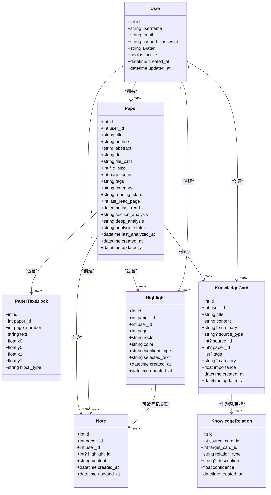
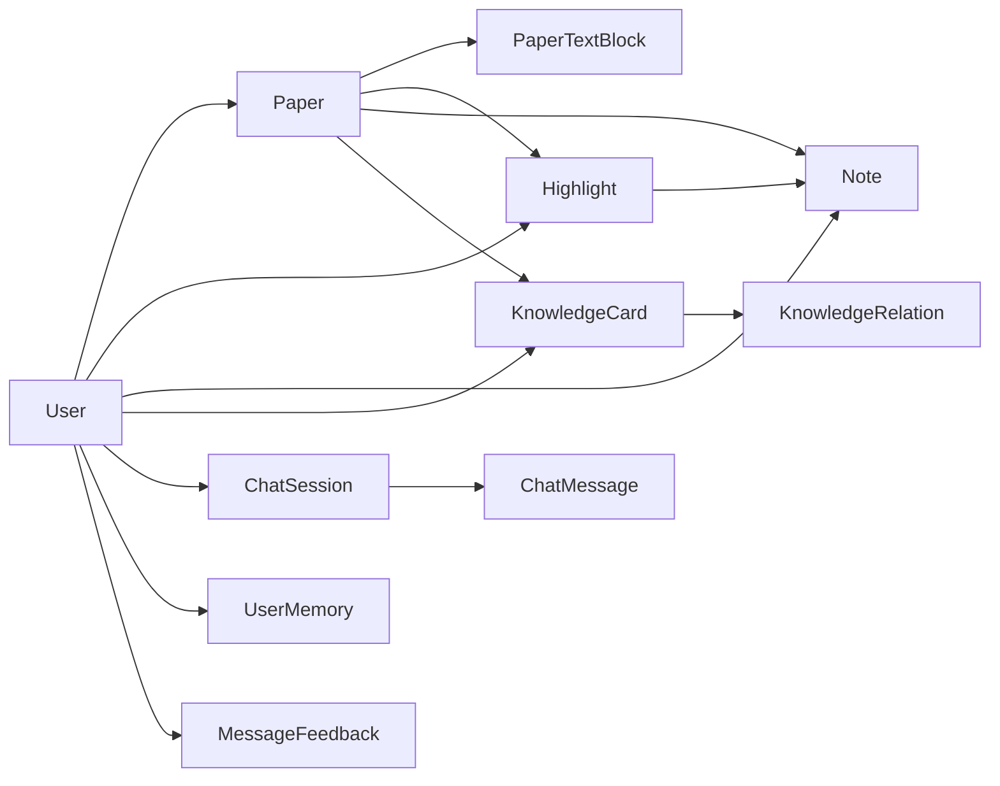

# 核心数据模型

<cite>
**本文引用的文件**
- [backend/app/models/user.py](file://backend/app/models/user.py)
- [backend/app/models/paper.py](file://backend/app/models/paper.py)
- [backend/app/models/highlight.py](file://backend/app/models/highlight.py)
- [backend/app/models/note.py](file://backend/app/models/note.py)
- [backend/app/models/knowledge.py](file://backend/app/models/knowledge.py)
- [backend/app/models/chat.py](file://backend/app/models/chat.py)
- [backend/app/models/memory.py](file://backend/app/models/memory.py)
- [backend/app/models/feedback.py](file://backend/app/models/feedback.py)
- [backend/app/database.py](file://backend/app/database.py)
- [backend/migrations/versions/6895243c431d_initial_schema.py](file://backend/migrations/versions/6895243c431d_initial_schema.py)
- [backend/app/schemas/user.py](file://backend/app/schemas/user.py)
- [backend/app/schemas/paper.py](file://backend/app/schemas/paper.py)
- [backend/app/schemas/highlight.py](file://backend/app/schemas/highlight.py)
- [backend/app/schemas/note.py](file://backend/app/schemas/note.py)
- [backend/app/config.py](file://backend/app/config.py)
</cite>

## 目录
1. [简介](#简介)
2. [项目结构](#项目结构)
3. [核心组件](#核心组件)
4. [架构总览](#架构总览)
5. [详细组件分析](#详细组件分析)
6. [依赖分析](#依赖分析)
7. [性能考虑](#性能考虑)
8. [故障排查指南](#故障排查指南)
9. [结论](#结论)
10. [附录](#附录)

## 简介
本文件系统性梳理 PaperChat 的核心数据模型，围绕 Paper（论文）、User（用户）、Highlight（高亮）、Note（笔记）、Knowledge（知识）等实体，阐述其设计理念、字段定义、数据类型与约束、模型间关系映射（含外键、级联与引用完整性）、验证规则与业务约束、扩展性与迁移策略，并给出数据库表结构与字段映射关系。

## 项目结构
后端采用 SQLAlchemy ORM + 异步数据库连接，模型集中于 backend/app/models，通过统一的 Base 基类声明；数据库初始化与会话管理位于 backend/app/database.py；迁移脚本由 Alembic 提供；Pydantic 模型位于 backend/app/schemas，用于 API 层的数据校验与序列化。

```mermaid
graph TB
subgraph "模型层"
U["User<br/>用户"]
P["Paper<br/>论文"]
PTB["PaperTextBlock<br/>论文文本块"]
H["Highlight<br/>高亮"]
N["Note<br/>笔记"]
KC["KnowledgeCard<br/>知识卡片"]
KR["KnowledgeRelation<br/>知识关联"]
CS["ChatSession<br/>会话"]
CM["ChatMessage<br/>消息"]
UM["UserMemory<br/>用户记忆"]
MF["MessageFeedback<br/>消息反馈"]
end
subgraph "基础设施"
DB["Base 元数据<br/>数据库引擎/会话"]
MIG["Alembic 迁移"]
end
U <- --> P
P < --> PTB
P < --> H
P < --> N
P < --> KC
U < --> H
U < --> N
U < --> CS
U < --> UM
U < --> MF
CS < --> CM
H < --> N
KC < --> KR
DB --- U
DB --- P
DB --- H
DB --- N
DB --- KC
DB --- KR
DB --- CS
DB --- CM
DB --- UM
DB --- MF
MIG --- DB
```

图表来源
- [backend/app/models/user.py:11-36](file://backend/app/models/user.py#L11-L36)
- [backend/app/models/paper.py:11-85](file://backend/app/models/paper.py#L11-L85)
- [backend/app/models/highlight.py:10-37](file://backend/app/models/highlight.py#L10-L37)
- [backend/app/models/note.py:11-34](file://backend/app/models/note.py#L11-L34)
- [backend/app/models/knowledge.py:14-80](file://backend/app/models/knowledge.py#L14-L80)
- [backend/app/models/chat.py:14-71](file://backend/app/models/chat.py#L14-L71)
- [backend/app/models/memory.py:14-54](file://backend/app/models/memory.py#L14-L54)
- [backend/app/models/feedback.py:14-48](file://backend/app/models/feedback.py#L14-L48)
- [backend/app/database.py:8-81](file://backend/app/database.py#L8-L81)
- [backend/migrations/versions/6895243c431d_initial_schema.py:21-61](file://backend/migrations/versions/6895243c431d_initial_schema.py#L21-L61)

章节来源
- [backend/app/models/__init__.py:1-29](file://backend/app/models/__init__.py#L1-L29)
- [backend/app/database.py:8-81](file://backend/app/database.py#L8-L81)
- [backend/migrations/versions/6895243c431d_initial_schema.py:21-61](file://backend/migrations/versions/6895243c431d_initial_schema.py#L21-L61)

## 核心组件
本节概览各核心实体的职责与关键字段，便于快速建立整体认知。

- 用户（User）
  - 负责论文、高亮、笔记、会话、记忆、反馈等资源的归属与权限控制。
  - 关键字段：用户名、邮箱（唯一索引）、头像、激活状态、时间戳。
  - 关系：一对多到 Paper、Highlight、Note、ChatSession、UserMemory、MessageFeedback、KnowledgeCard。

- 论文（Paper）
  - 存储论文元数据、解析缓存与阅读进度。
  - 关键字段：标题、作者、摘要、DOI、文件路径/大小、页数、标签（JSON 字符串）、分类、阅读状态、最后阅读页/时间、分析缓存（章节/深度）、分析状态与时间、时间戳。
  - 关系：多文本块、高亮、笔记、知识卡片；与 User 的多对一。

- 论文文本块（PaperTextBlock）
  - 存储 PDF 解析后的文本块几何信息与内容，支持按页检索。
  - 关键字段：所属论文、页码、文本、矩形坐标、块类型。
  - 关系：与 Paper 的多对一。

- 高亮（Highlight）
  - 记录用户在特定页面对文本区域的高亮标注，支持多种样式。
  - 关键字段：所属论文、用户、页码、矩形集合（JSON 字符串）、颜色、样式类型、选中文本、时间戳。
  - 关系：与 Paper、User 多对一；与 Note 一对多（可空外键）。

- 笔记（Note）
  - 将自由文本笔记与高亮进行弱关联（可选），便于检索与聚合。
  - 关键字段：所属论文、用户、可选高亮、内容、时间戳。
  - 关系：与 Paper、User 多对一；与 Highlight 多对一（可空）。

- 知识（Knowledge）
  - 知识卡片与知识关联，支持来源追踪、分类、标签、重要性权重与置信度。
  - 关键字段：用户、标题、内容、摘要、来源类型/ID、可选论文、标签（JSON 列表）、分类、重要性、时间戳。
  - 关系：与 User 多对一；与 Paper 多对一（可空）；自关联的双向关系集（作为源/目标）。

章节来源
- [backend/app/models/user.py:11-36](file://backend/app/models/user.py#L11-L36)
- [backend/app/models/paper.py:11-85](file://backend/app/models/paper.py#L11-L85)
- [backend/app/models/highlight.py:10-37](file://backend/app/models/highlight.py#L10-L37)
- [backend/app/models/note.py:11-34](file://backend/app/models/note.py#L11-L34)
- [backend/app/models/knowledge.py:14-80](file://backend/app/models/knowledge.py#L14-L80)

## 架构总览
下图展示核心实体的类关系与依赖，体现外键约束、级联删除与引用完整性。



图表来源
- [backend/app/models/user.py:11-36](file://backend/app/models/user.py#L11-L36)
- [backend/app/models/paper.py:11-85](file://backend/app/models/paper.py#L11-L85)
- [backend/app/models/highlight.py:10-37](file://backend/app/models/highlight.py#L10-L37)
- [backend/app/models/note.py:11-34](file://backend/app/models/note.py#L11-L34)
- [backend/app/models/knowledge.py:14-80](file://backend/app/models/knowledge.py#L14-L80)

## 详细组件分析

### 用户（User）模型
- 设计理念
  - 以“资源归属”为核心，所有论文、高亮、笔记、会话、记忆、反馈均通过 user_id 关联。
  - 使用唯一索引保证用户名与邮箱的全局唯一性，提升查询效率与一致性。
- 字段与约束
  - 主键：id
  - 唯一索引：username、email
  - 默认值：is_active=True，时间戳默认值与更新触发器
- 关系映射
  - 一对多：Paper、Highlight、Note、ChatSession、UserMemory、MessageFeedback、KnowledgeCard
  - 级联：UserMemory、MessageFeedback、KnowledgeCard 使用“all, delete-orphan”，确保用户删除时相关记录清理
- 数据完整性
  - 外键约束：上述关系均通过外键维护引用完整性
  - 业务约束：用户名长度、邮箱格式（由 Pydantic 校验层补充）

章节来源
- [backend/app/models/user.py:11-36](file://backend/app/models/user.py#L11-L36)
- [backend/app/schemas/user.py:8-42](file://backend/app/schemas/user.py#L8-L42)

### 论文（Paper）模型
- 设计理念
  - 统一存储论文元信息与解析缓存，支持阅读进度跟踪与分析状态管理。
  - 文本块、高亮、笔记、知识卡片均以“删除即孤儿”的策略随论文删除而清理，避免悬挂数据。
- 字段与约束
  - 主键：id
  - 外键：user_id → users.id
  - 索引：user_id、reading_status
  - 默认值：reading_status="unread"、last_read_page=0、analysis_status="not_generated"
  - 可空字段：authors、abstract、doi、tags、category、last_read_at、section_analysis、deep_analysis、last_analyzed_at
- 关系映射
  - 多对一：User
  - 一对多：PaperTextBlock、Highlight、Note、KnowledgeCard（级联删除-orphan）
- 数据完整性
  - 外键约束：user_id；PaperTextBlock、Highlight、Note、KnowledgeCard 的 ondelete=CASCADE 或级联 orphan
  - 状态一致性：analysis_status 非空化（迁移脚本已执行）

章节来源
- [backend/app/models/paper.py:11-85](file://backend/app/models/paper.py#L11-L85)
- [backend/migrations/versions/6895243c431d_initial_schema.py:33-36](file://backend/migrations/versions/6895243c431d_initial_schema.py#L33-L36)

### 论文文本块（PaperTextBlock）模型
- 设计理念
  - 存储 PDF 解析后的文本块几何信息，便于高亮与笔记的可视化定位。
- 字段与约束
  - 主键：id
  - 外键：paper_id → papers.id（ondelete=CASCADE）
  - 索引：paper_id
  - 类型：坐标为浮点数，块类型字符串枚举化
- 关系映射
  - 多对一：Paper

章节来源
- [backend/app/models/paper.py:65-85](file://backend/app/models/paper.py#L65-L85)

### 高亮（Highlight）模型
- 设计理念
  - 记录用户在指定页面的文本区域高亮，支持多种样式与颜色，便于后续笔记关联。
- 字段与约束
  - 主键：id
  - 外键：paper_id → papers.id（ondelete=CASCADE），user_id → users.id
  - 索引：paper_id、user_id
  - 默认值：color、highlight_type、created_at、updated_at
  - 可空字段：rects（JSON 字符串）
- 关系映射
  - 多对一：Paper、User
  - 一对多：Note（ondelete=SET NULL，允许笔记独立存在）
- 数据完整性
  - 外键约束：paper_id、user_id
  - 级联：Note 的 ondelete=SET NULL，避免破坏笔记内容

章节来源
- [backend/app/models/highlight.py:10-37](file://backend/app/models/highlight.py#L10-L37)

### 笔记（Note）模型
- 设计理念
  - 自由文本笔记，可选地与高亮建立弱关联，便于检索与上下文关联。
- 字段与约束
  - 主键：id
  - 外键：paper_id → papers.id（ondelete=CASCADE），user_id → users.id，highlight_id → highlights.id（ondelete=SET NULL）
  - 索引：paper_id、user_id
  - 可空字段：highlight_id
- 关系映射
  - 多对一：Paper、User、Highlight（可空）
- 数据完整性
  - 外键约束：三者皆有
  - 级联：highlight_id SET NULL，保持笔记独立性

章节来源
- [backend/app/models/note.py:11-34](file://backend/app/models/note.py#L11-L34)

### 知识（Knowledge）模型
- 设计理念
  - 知识卡片用于抽取与组织论文中的关键信息，支持来源追踪（高亮/聊天/手动/分析）、分类与标签、重要性权重与置信度。
- 字段与约束
  - 主键：id
  - 外键：user_id → users.id，paper_id → papers.id（可空）
  - 索引：user_id、paper_id
  - 默认值：importance=1.0、confidence=0.8
  - 可空字段：summary、source_type、source_id、paper_id、tags、category、description
  - 数据类型：tags 使用 JSON 列表
- 关系映射
  - 多对一：User、Paper
  - 自关联：KnowledgeRelation（双向，作为 source/target）
- 数据完整性
  - 外键约束：user_id、paper_id（可空）
  - 级联：KnowledgeRelation 使用“all, delete-orphan”

章节来源
- [backend/app/models/knowledge.py:14-80](file://backend/app/models/knowledge.py#L14-L80)

### 扩展性与版本兼容性
- 扩展性设计
  - JSON 字段（tags、rects、paper_ids、sources）用于承载灵活结构，降低未来字段变更成本。
  - 自关联关系（KnowledgeRelation）支持动态构建知识网络。
  - 会话模型（ChatSession）支持单论文与多论文（跨文档）两种模式，通过 JSON 字段 paper_ids 承载。
- 版本兼容性
  - 迁移脚本固定索引与非空化策略，确保历史数据与新版本一致。
  - 默认用户初始化，保证系统最小可用状态。
- 迁移策略
  - 新增字段建议通过 Alembic 迁移添加索引与默认值。
  - 删除字段需先迁移数据或转存，再删除列与索引。

章节来源
- [backend/migrations/versions/6895243c431d_initial_schema.py:21-61](file://backend/migrations/versions/6895243c431d_initial_schema.py#L21-L61)
- [backend/app/database.py:50-81](file://backend/app/database.py#L50-L81)

## 依赖分析
- 组件耦合
  - User 是核心枢纽，Paper、Highlight、Note、KnowledgeCard、ChatSession、UserMemory、MessageFeedback 均依赖其主键。
  - Paper 与 PaperTextBlock、Highlight、Note、KnowledgeCard 形成强聚合关系，删除论文时通过级联清理子实体。
  - KnowledgeCard 与 KnowledgeRelation 自关联，形成无环图（自反边允许）。
- 外部依赖
  - SQLAlchemy ORM 与异步引擎（aiosqlite/sqlite+aiosqlite）
  - Alembic 迁移工具
  - Pydantic 校验层（schema）



图表来源
- [backend/app/models/user.py:11-36](file://backend/app/models/user.py#L11-L36)
- [backend/app/models/paper.py:11-85](file://backend/app/models/paper.py#L11-L85)
- [backend/app/models/highlight.py:10-37](file://backend/app/models/highlight.py#L10-L37)
- [backend/app/models/note.py:11-34](file://backend/app/models/note.py#L11-L34)
- [backend/app/models/knowledge.py:14-80](file://backend/app/models/knowledge.py#L14-L80)
- [backend/app/models/chat.py:14-71](file://backend/app/models/chat.py#L14-L71)
- [backend/app/models/memory.py:14-54](file://backend/app/models/memory.py#L14-L54)
- [backend/app/models/feedback.py:14-48](file://backend/app/models/feedback.py#L14-L48)

## 性能考虑
- 索引策略
  - 在高频过滤字段上建立索引：Paper.user_id、Paper.reading_status、PaperTextBlock.paper_id、Highlight.paper_id、Highlight.user_id、Note.paper_id、Note.user_id、KnowledgeCard.paper_id、KnowledgeCard.user_id。
- 查询模式
  - 按用户聚合（论文/高亮/笔记/知识卡片）时，优先使用 user_id 索引。
  - 阅读状态筛选（unread/reading/finished）使用 reading_status 索引。
- 写入与级联
  - 大量删除（如删除论文）依赖级联或 orphan 删除，注意批量事务与回滚策略。
- 存储与类型
  - JSON 字段（rects、tags、paper_ids、sources、tags）减少模式变更成本，但查询时需注意索引与覆盖索引策略。

章节来源
- [backend/migrations/versions/6895243c431d_initial_schema.py:24-38](file://backend/migrations/versions/6895243c431d_initial_schema.py#L24-L38)

## 故障排查指南
- 常见错误与处理
  - 外键约束失败：检查关联实体是否存在，尤其是删除论文前确认子实体已清理或启用级联。
  - 唯一约束冲突：用户名/邮箱重复，需调整输入或清理冲突数据。
  - 非空字段问题：analysis_status 已迁移为非空，若出现异常需检查迁移是否成功。
- 诊断步骤
  - 启用调试模式查看 SQL 日志（数据库配置中 echo 开关）。
  - 使用会话工厂进行事务性操作，确保异常时回滚。
  - 检查 Alembic 迁移状态与目标数据库版本是否一致。
- 相关实现参考
  - 数据库会话与初始化：[backend/app/database.py:30-81](file://backend/app/database.py#L30-L81)
  - 迁移脚本：[backend/migrations/versions/6895243c431d_initial_schema.py:21-61](file://backend/migrations/versions/6895243c431d_initial_schema.py#L21-L61)
  - 配置项（含数据库 URL）：[backend/app/config.py:22-23](file://backend/app/config.py#L22-L23)

章节来源
- [backend/app/database.py:30-81](file://backend/app/database.py#L30-L81)
- [backend/migrations/versions/6895243c431d_initial_schema.py:21-61](file://backend/migrations/versions/6895243c431d_initial_schema.py#L21-L61)
- [backend/app/config.py:22-23](file://backend/app/config.py#L22-L23)

## 结论
PaperChat 的核心数据模型以用户为中心，围绕论文与其衍生的高亮、笔记、知识卡片构建了清晰的层次结构与强健的外键约束。通过索引、级联与 orphan 删除策略，保证了数据一致性与可维护性；通过 JSON 字段与自关联关系，提供了良好的扩展性与演进空间。配合 Alembic 迁移与异步数据库连接，系统在功能与性能之间取得平衡。

## 附录

### 数据库表结构与字段映射
- 用户（users）
  - 字段：id（PK）、username（UNIQUE+INDEX）、email（UNIQUE+INDEX）、hashed_password、avatar、is_active、created_at、updated_at
  - 关系：Paper、Highlight、Note、ChatSession、UserMemory、MessageFeedback、KnowledgeCard

- 论文（papers）
  - 字段：id（PK）、user_id（FK）、title、authors、abstract、doi、file_path、file_size、page_count、tags、category、reading_status、last_read_page、last_read_at、section_analysis、deep_analysis、analysis_status、last_analyzed_at、created_at、updated_at
  - 关系：PaperTextBlock、Highlight、Note、KnowledgeCard；多对一：User

- 论文文本块（paper_text_blocks）
  - 字段：id（PK）、paper_id（FK→papers.id ondelete=CASCADE）、page_number、text、x0、y0、x1、y1、block_type
  - 关系：Paper

- 高亮（highlights）
  - 字段：id（PK）、paper_id（FK→papers.id ondelete=CASCADE）、user_id（FK）、page、rects、color、highlight_type、selected_text、created_at、updated_at
  - 关系：Paper、User；Note（可空外键）

- 笔记（notes）
  - 字段：id（PK）、paper_id（FK→papers.id ondelete=CASCADE）、user_id（FK）、highlight_id（FK→highlights.id ondelete=SET NULL）、content、created_at、updated_at
  - 关系：Paper、User、Highlight（可空）

- 知识卡片（knowledge_cards）
  - 字段：id（PK）、user_id（FK）、title、content、summary、source_type、source_id、paper_id（FK→papers.id）、tags、category、importance、created_at、updated_at
  - 关系：User、Paper；自关联：KnowledgeRelation

- 知识关联（knowledge_relations）
  - 字段：id（PK）、source_card_id（FK→knowledge_cards.id）、target_card_id（FK→knowledge_cards.id）、relation_type、description、confidence、created_at
  - 关系：作为 source/target 的 KnowledgeCard

- 会话（chat_sessions）
  - 字段：id（PK）、user_id（FK）、paper_id（FK→papers.id 可空）、paper_ids（JSON 多论文ID）、title、created_at、updated_at
  - 关系：User、Paper、ChatMessage

- 消息（chat_messages）
  - 字段：id（PK）、session_id（FK→chat_sessions.id）、role、content、sources（JSON 引用来源）、created_at
  - 关系：ChatSession、MessageFeedback

- 用户记忆（user_memories）
  - 字段：id（PK）、user_id（FK）、memory_type、content、embedding、importance、access_count、last_accessed、created_at
  - 关系：User

- 消息反馈（message_feedbacks）
  - 字段：id（PK）、message_id（FK→chat_messages.id）、user_id（FK）、rating、comment、created_at
  - 关系：ChatMessage、User

章节来源
- [backend/app/models/user.py:11-36](file://backend/app/models/user.py#L11-L36)
- [backend/app/models/paper.py:11-85](file://backend/app/models/paper.py#L11-L85)
- [backend/app/models/highlight.py:10-37](file://backend/app/models/highlight.py#L10-L37)
- [backend/app/models/note.py:11-34](file://backend/app/models/note.py#L11-L34)
- [backend/app/models/knowledge.py:14-80](file://backend/app/models/knowledge.py#L14-L80)
- [backend/app/models/chat.py:14-71](file://backend/app/models/chat.py#L14-L71)
- [backend/app/models/memory.py:14-54](file://backend/app/models/memory.py#L14-L54)
- [backend/app/models/feedback.py:14-48](file://backend/app/models/feedback.py#L14-L48)

### API 层数据模型（校验与序列化）
- 用户：UserCreate、UserLogin、UserResponse、Token
- 论文：PaperCreate、PaperUpdate、PaperResponse、PaperListResponse、PaperTextBlockResponse、BatchUploadResult、BatchUploadResponse
- 高亮：HighlightCreate、HighlightUpdate、HighlightResponse
- 笔记：NoteCreate、NoteUpdate、NoteResponse、NoteWithHighlightResponse

章节来源
- [backend/app/schemas/user.py:8-42](file://backend/app/schemas/user.py#L8-L42)
- [backend/app/schemas/paper.py:7-83](file://backend/app/schemas/paper.py#L7-L83)
- [backend/app/schemas/highlight.py:7-37](file://backend/app/schemas/highlight.py#L7-L37)
- [backend/app/schemas/note.py:7-36](file://backend/app/schemas/note.py#L7-L36)