# 知识图谱系统

<cite>
**本文档引用的文件**
- [backend/app/main.py](file://backend/app/main.py)
- [backend/app/models/knowledge_graph.py](file://backend/app/models/knowledge_graph.py)
- [backend/app/services/knowledge/graph_service.py](file://backend/app/services/knowledge/graph_service.py)
- [backend/app/routers/knowledge_graph.py](file://backend/app/routers/knowledge_graph.py)
- [frontend/src/components/KnowledgeGraph/ForceGraph.jsx](file://frontend/src/components/KnowledgeGraph/ForceGraph.jsx)
- [frontend/src/pages/KnowledgeGraphPage.jsx](file://frontend/src/pages/KnowledgeGraphPage.jsx)
- [backend/app/prompts/graph.py](file://backend/app/prompts/graph.py)
- [backend/app/database.py](file://backend/app/database.py)
- [backend/app/config.py](file://backend/app/config.py)
- [backend/app/models/knowledge.py](file://backend/app/models/knowledge.py)
- [frontend/src/stores/knowledgeStore.ts](file://frontend/src/stores/knowledgeStore.ts)
</cite>

## 目录
1. [简介](#简介)
2. [项目结构](#项目结构)
3. [核心组件](#核心组件)
4. [架构概览](#架构概览)
5. [详细组件分析](#详细组件分析)
6. [依赖关系分析](#依赖关系分析)
7. [性能考虑](#性能考虑)
8. [故障排除指南](#故障排除指南)
9. [结论](#结论)

## 简介

知识图谱系统是一个基于学术论文阅读与问答的智能知识管理平台。该系统通过自然语言处理技术和机器学习算法，自动从论文文本中提取实体和关系，构建学术知识图谱，帮助用户更好地理解和组织学术知识。

系统采用前后端分离架构，后端使用Python FastAPI框架，前端使用React技术栈，数据库采用SQLAlchemy ORM进行数据持久化。核心功能包括论文知识图谱构建、实体关系抽取、可视化展示、知识卡片管理等。

## 项目结构

该项目采用模块化的文件组织方式，主要分为以下几个部分：

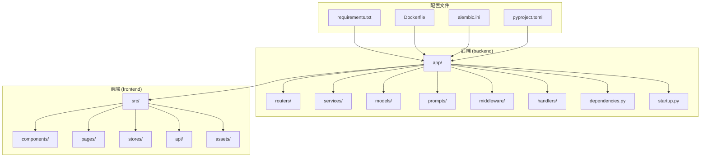

**图表来源**
- [backend/app/main.py:1-390](file://backend/app/main.py#L1-L390)
- [frontend/src/pages/KnowledgeGraphPage.jsx:1-691](file://frontend/src/pages/KnowledgeGraphPage.jsx#L1-L691)

**章节来源**
- [backend/app/main.py:1-390](file://backend/app/main.py#L1-L390)
- [frontend/src/pages/KnowledgeGraphPage.jsx:1-691](file://frontend/src/pages/KnowledgeGraphPage.jsx#L1-L691)

## 核心组件

### 数据模型层

系统的核心数据模型包括知识图谱节点和边，以及知识卡片和关系模型：

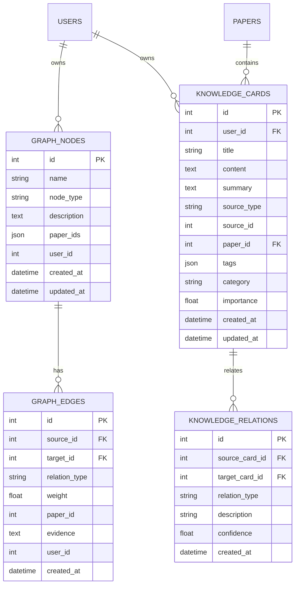

**图表来源**
- [backend/app/models/knowledge_graph.py:14-75](file://backend/app/models/knowledge_graph.py#L14-L75)
- [backend/app/models/knowledge.py:14-80](file://backend/app/models/knowledge.py#L14-L80)

### 服务层架构

系统采用分层的服务架构，主要包含以下核心服务：

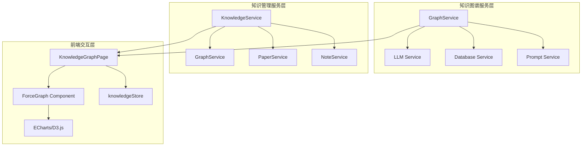

**图表来源**
- [backend/app/services/knowledge/graph_service.py:20-406](file://backend/app/services/knowledge/graph_service.py#L20-L406)
- [frontend/src/pages/KnowledgeGraphPage.jsx:69-691](file://frontend/src/pages/KnowledgeGraphPage.jsx#L69-L691)

**章节来源**
- [backend/app/models/knowledge_graph.py:14-75](file://backend/app/models/knowledge_graph.py#L14-L75)
- [backend/app/models/knowledge.py:14-80](file://backend/app/models/knowledge.py#L14-L80)
- [backend/app/services/knowledge/graph_service.py:20-406](file://backend/app/services/knowledge/graph_service.py#L20-L406)

## 架构概览

系统采用现代化的全栈架构设计，实现了前后端分离和微服务化的组件组织：

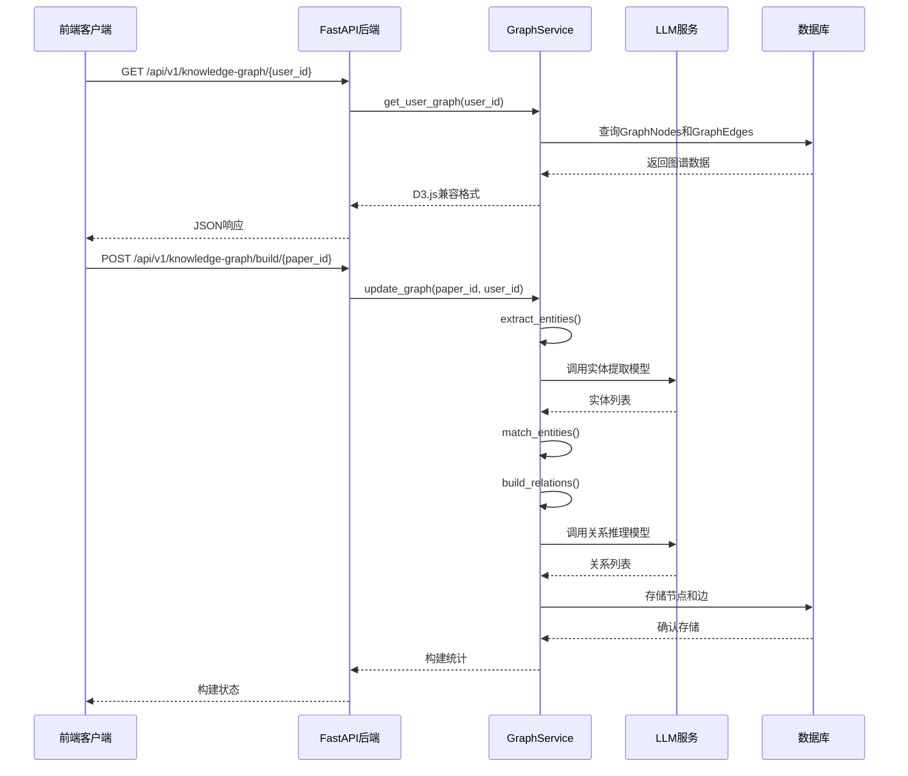

**图表来源**
- [backend/app/routers/knowledge_graph.py:23-249](file://backend/app/routers/knowledge_graph.py#L23-L249)
- [backend/app/services/knowledge/graph_service.py:196-316](file://backend/app/services/knowledge/graph_service.py#L196-L316)

系统架构特点：
- **异步处理**：使用async/await模式处理I/O密集型操作
- **缓存机制**：集成Redis缓存提升查询性能
- **错误处理**：完善的异常捕获和错误响应机制
- **安全防护**：CORS配置、速率限制、安全中间件
- **可扩展性**：模块化设计支持功能扩展

**章节来源**
- [backend/app/main.py:288-390](file://backend/app/main.py#L288-L390)
- [backend/app/routers/knowledge_graph.py:23-249](file://backend/app/routers/knowledge_graph.py#L23-L249)

## 详细组件分析

### 知识图谱构建服务

GraphService是系统的核心组件，负责从论文文本中提取实体和关系，构建完整的知识图谱：

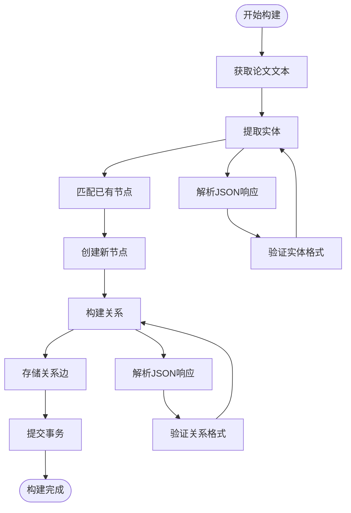

**图表来源**
- [backend/app/services/knowledge/graph_service.py:23-316](file://backend/app/services/knowledge/graph_service.py#L23-L316)

#### 实体提取流程

系统使用专门的提示词模板指导LLM进行实体提取：

| 实体类型 | 描述 | 示例 |
|---------|------|------|
| concept | 概念 | Transformer, Attention Mechanism |
| method | 方法 | BERT, GPT, LSTM |
| dataset | 数据集 | GLUE, SQuAD, ImageNet |
| metric | 评估指标 | Accuracy, F1-score, BLEU |
| author | 作者 | Vaswani, Devlin |

#### 关系推理规则

系统支持五种关系类型的自动推理：

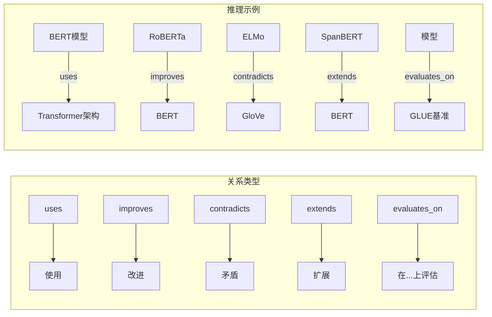

**图表来源**
- [backend/app/prompts/graph.py:27-52](file://backend/app/prompts/graph.py#L27-L52)

**章节来源**
- [backend/app/services/knowledge/graph_service.py:23-316](file://backend/app/services/knowledge/graph_service.py#L23-L316)
- [backend/app/prompts/graph.py:1-58](file://backend/app/prompts/graph.py#L1-L58)

### 前端可视化组件

系统提供了两种可视化方案，满足不同场景的需求：

#### D3.js力导向图组件

ForceGraph组件使用D3.js实现交互式力导向图：

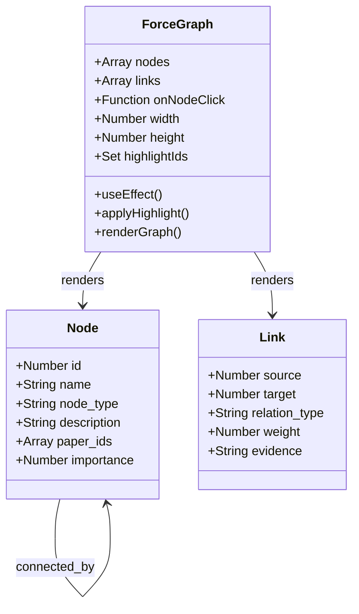

**图表来源**
- [frontend/src/components/KnowledgeGraph/ForceGraph.jsx:34-245](file://frontend/src/components/KnowledgeGraph/ForceGraph.jsx#L34-L245)

#### ECharts知识图谱页面

KnowledgeGraphPage页面提供了更丰富的交互功能：

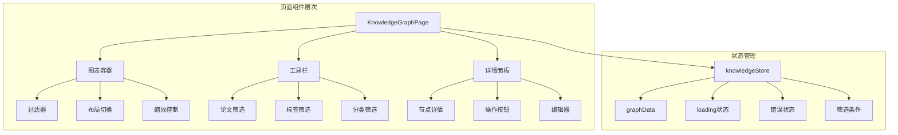

**图表来源**
- [frontend/src/pages/KnowledgeGraphPage.jsx:69-691](file://frontend/src/pages/KnowledgeGraphPage.jsx#L69-L691)
- [frontend/src/stores/knowledgeStore.ts:55-493](file://frontend/src/stores/knowledgeStore.ts#L55-L493)

**章节来源**
- [frontend/src/components/KnowledgeGraph/ForceGraph.jsx:34-245](file://frontend/src/components/KnowledgeGraph/ForceGraph.jsx#L34-L245)
- [frontend/src/pages/KnowledgeGraphPage.jsx:69-691](file://frontend/src/pages/KnowledgeGraphPage.jsx#L69-L691)
- [frontend/src/stores/knowledgeStore.ts:55-493](file://frontend/src/stores/knowledgeStore.ts#L55-L493)

### API路由设计

系统采用RESTful API设计原则，提供清晰的资源访问接口：

| 路由 | 方法 | 功能 | 参数 |
|------|------|------|------|
| `/api/v1/knowledge-graph/{user_id}` | GET | 获取用户完整图谱 | user_id |
| `/api/v1/knowledge-graph/{user_id}/paper/{paper_id}` | GET | 获取论文子图 | user_id, paper_id |
| `/api/v1/knowledge-graph/build/{paper_id}` | POST | 手动触发图谱构建 | paper_id, user_id |
| `/api/v1/knowledge-graph/{user_id}/search` | GET | 搜索图谱节点 | user_id, query |

**章节来源**
- [backend/app/routers/knowledge_graph.py:23-249](file://backend/app/routers/knowledge_graph.py#L23-L249)

## 依赖关系分析

系统采用模块化的依赖管理策略，确保各组件间的松耦合：

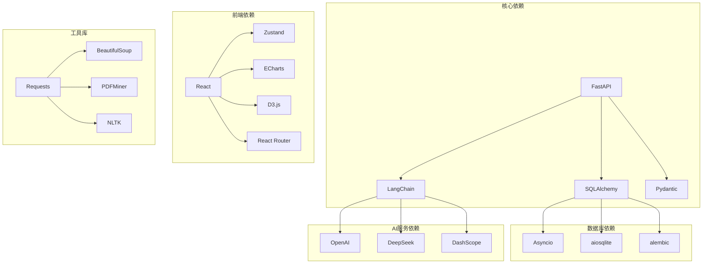

**图表来源**
- [backend/app/main.py:18-32](file://backend/app/main.py#L18-L32)
- [backend/app/config.py:29-65](file://backend/app/config.py#L29-L65)

### 数据库连接管理

系统使用异步数据库连接池，支持高并发访问：

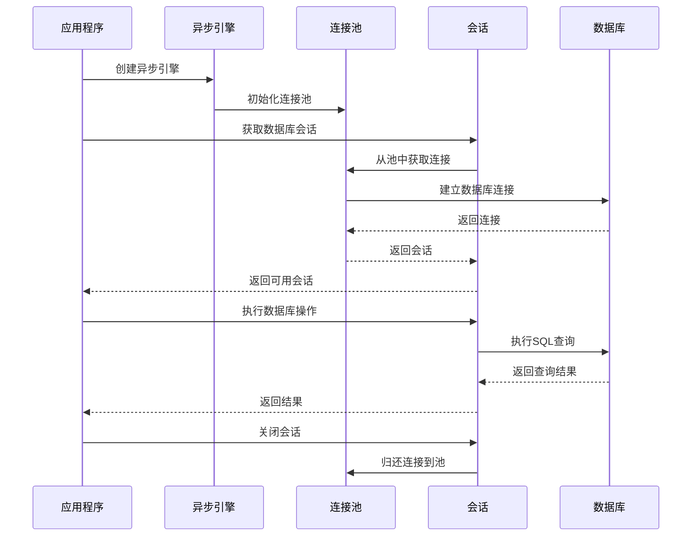

**图表来源**
- [backend/app/database.py:13-50](file://backend/app/database.py#L13-L50)

**章节来源**
- [backend/app/database.py:13-83](file://backend/app/database.py#L13-L83)
- [backend/app/config.py:29-65](file://backend/app/config.py#L29-L65)

## 性能考虑

### 缓存策略

系统实现了多层次的缓存机制以提升性能：

1. **数据库查询缓存**：使用Redis缓存热点查询结果
2. **LLM响应缓存**：缓存相似的提示词调用结果
3. **前端状态缓存**：使用Zustand管理本地状态缓存
4. **静态资源缓存**：浏览器端静态资源缓存

### 异步处理优化

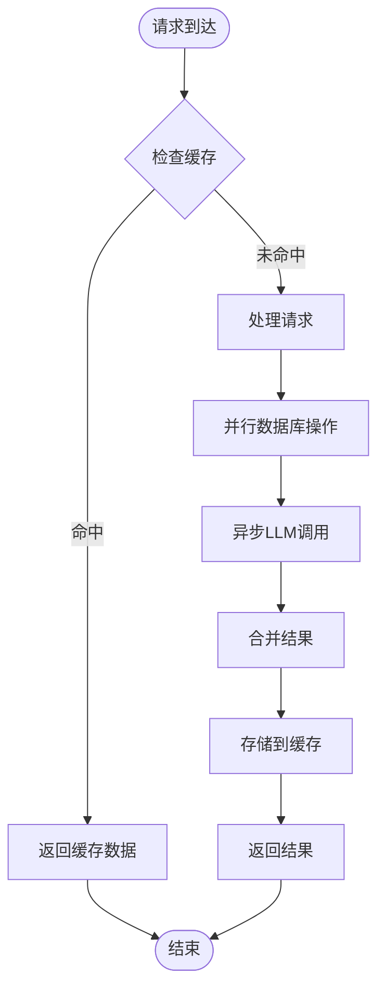

### 数据库优化

- **索引优化**：为常用查询字段建立复合索引
- **连接池管理**：合理配置连接池大小和超时时间
- **批量操作**：支持批量插入和更新操作
- **查询优化**：使用原生SQL优化复杂查询

## 故障排除指南

### 常见问题及解决方案

#### 1. LLM服务连接失败

**症状**：实体提取和关系推理功能异常
**原因**：API密钥配置错误或网络连接问题
**解决方案**：
- 检查`.env`文件中的API密钥配置
- 验证网络连接和防火墙设置
- 查看LLM服务日志获取详细错误信息

#### 2. 数据库连接异常

**症状**：所有数据库操作失败
**原因**：数据库连接池耗尽或连接超时
**解决方案**：
- 检查数据库服务状态
- 调整连接池配置参数
- 查看数据库连接数限制

#### 3. 前端渲染性能问题

**症状**：图谱渲染缓慢或卡顿
**原因**：节点数量过多或复杂度高
**解决方案**：
- 实施节点聚合策略
- 优化D3.js渲染性能
- 使用虚拟滚动技术

#### 4. 缓存一致性问题

**症状**：显示过期或不一致的数据
**原因**：缓存更新时机不当
**解决方案**：
- 实施缓存失效策略
- 使用分布式锁保证一致性
- 定期清理过期缓存

**章节来源**
- [backend/app/main.py:132-275](file://backend/app/main.py#L132-L275)
- [frontend/src/pages/KnowledgeGraphPage.jsx:509-541](file://frontend/src/pages/KnowledgeGraphPage.jsx#L509-L541)

## 结论

知识图谱系统是一个功能完整、架构清晰的学术知识管理平台。系统通过先进的自然语言处理技术和机器学习算法，实现了从论文文本到知识图谱的自动化转换，为学术研究提供了强大的知识组织和发现能力。

### 系统优势

1. **技术先进性**：采用最新的LLM技术和图数据库理念
2. **用户体验**：提供直观的可视化界面和流畅的操作体验
3. **扩展性强**：模块化设计支持功能扩展和定制化需求
4. **性能优异**：多层缓存和异步处理确保系统响应速度
5. **安全性高**：完善的权限控制和数据保护机制

### 发展方向

1. **算法优化**：持续改进实体提取和关系推理的准确性
2. **功能扩展**：增加更多知识管理功能和协作特性
3. **性能提升**：优化大规模数据处理能力和渲染性能
4. **生态建设**：构建开放的插件生态系统和第三方集成

该系统为学术研究和知识管理提供了强有力的技术支撑，具有广阔的应用前景和发展潜力。