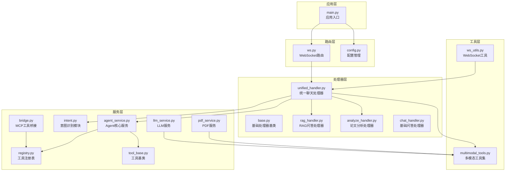
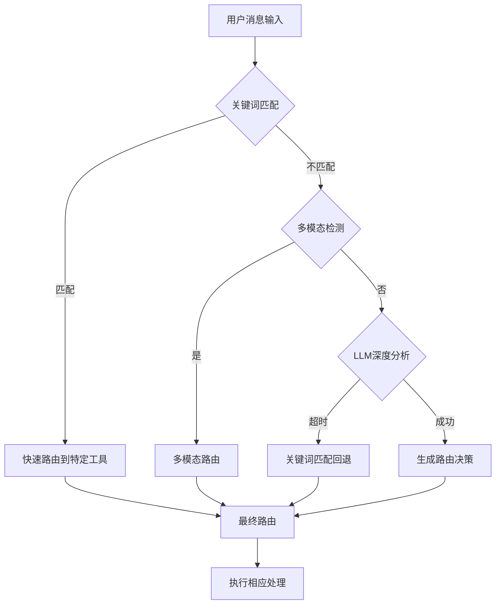
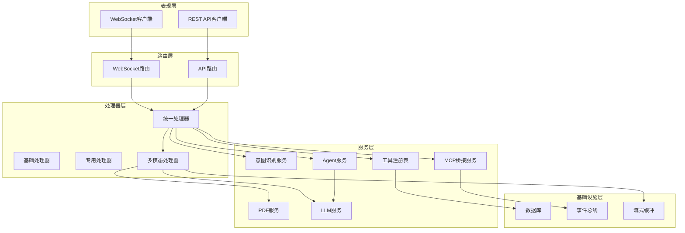
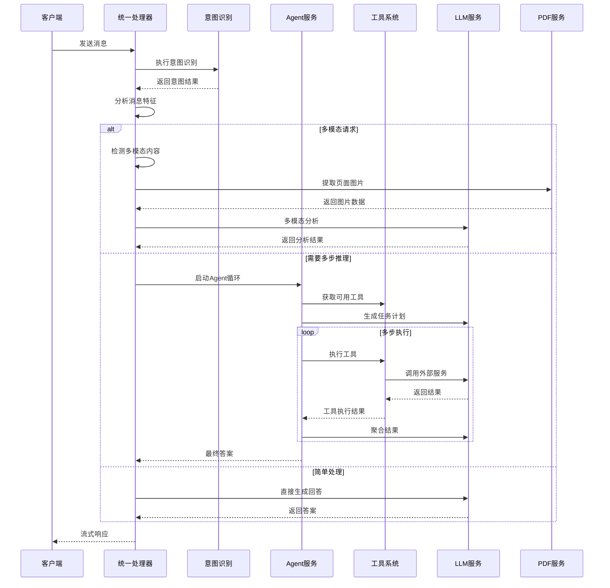
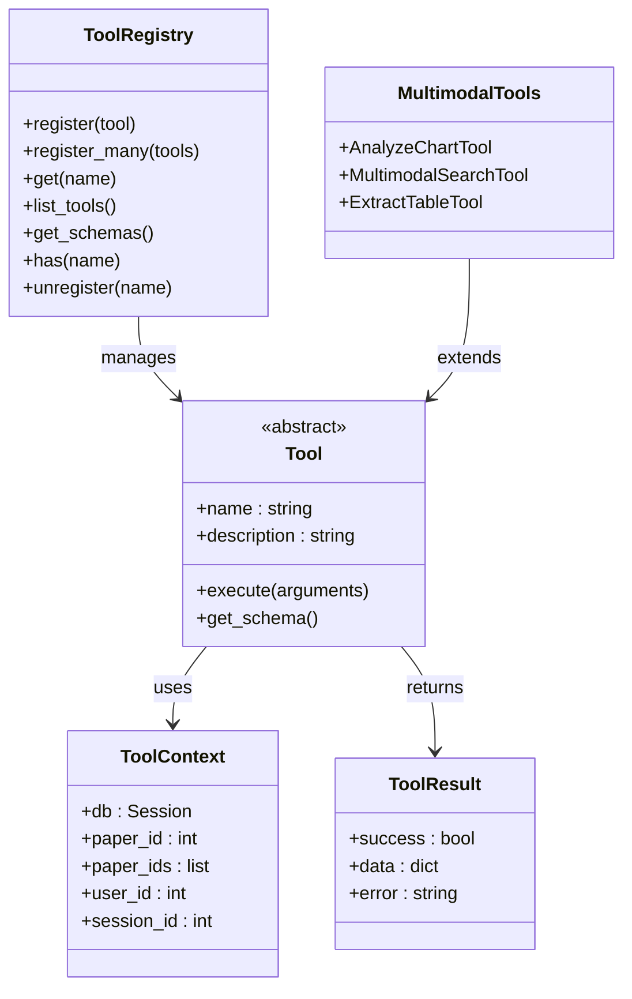
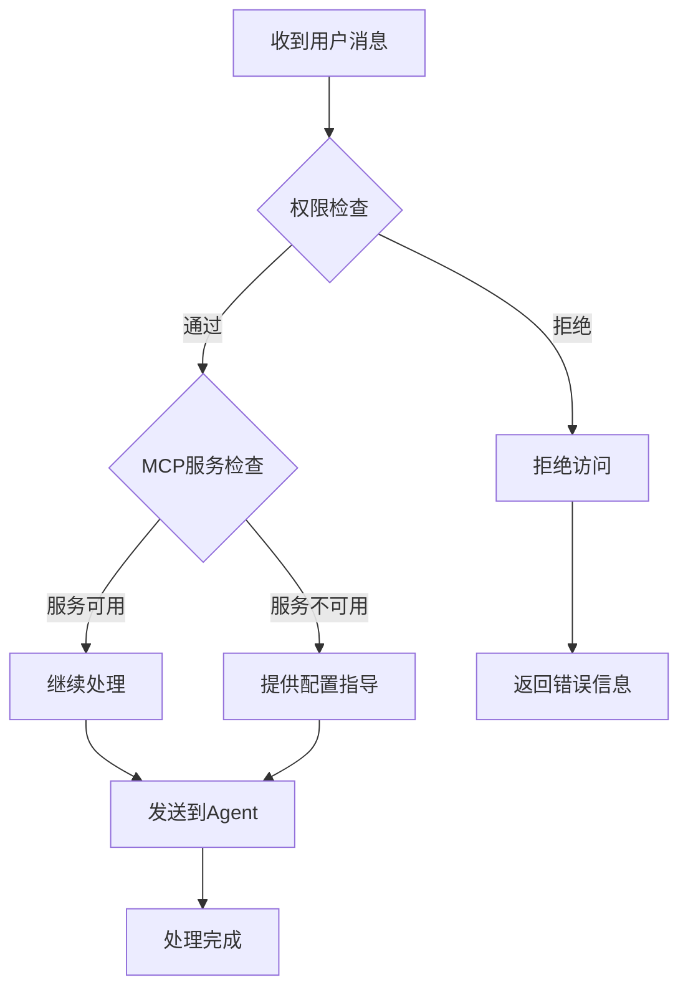
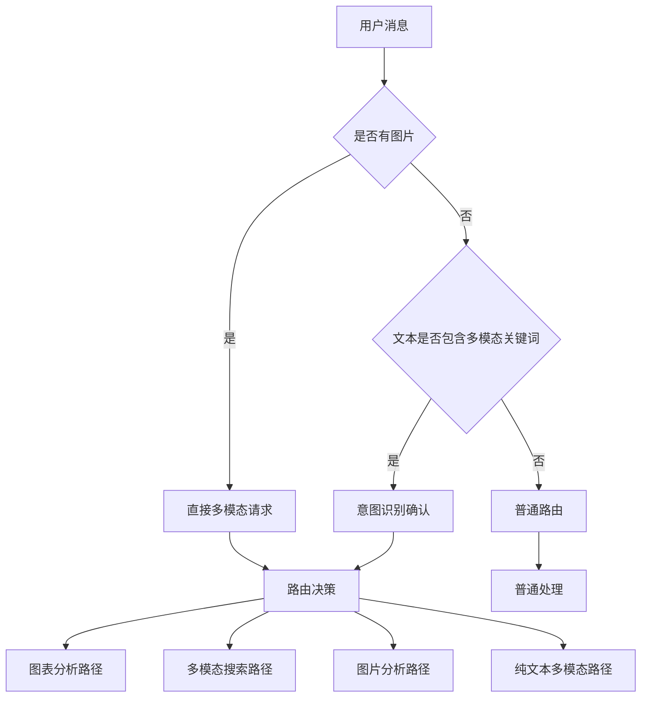
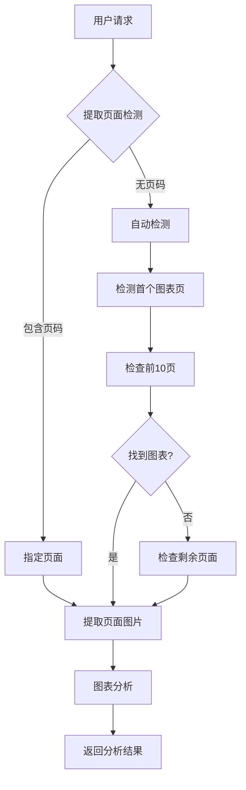
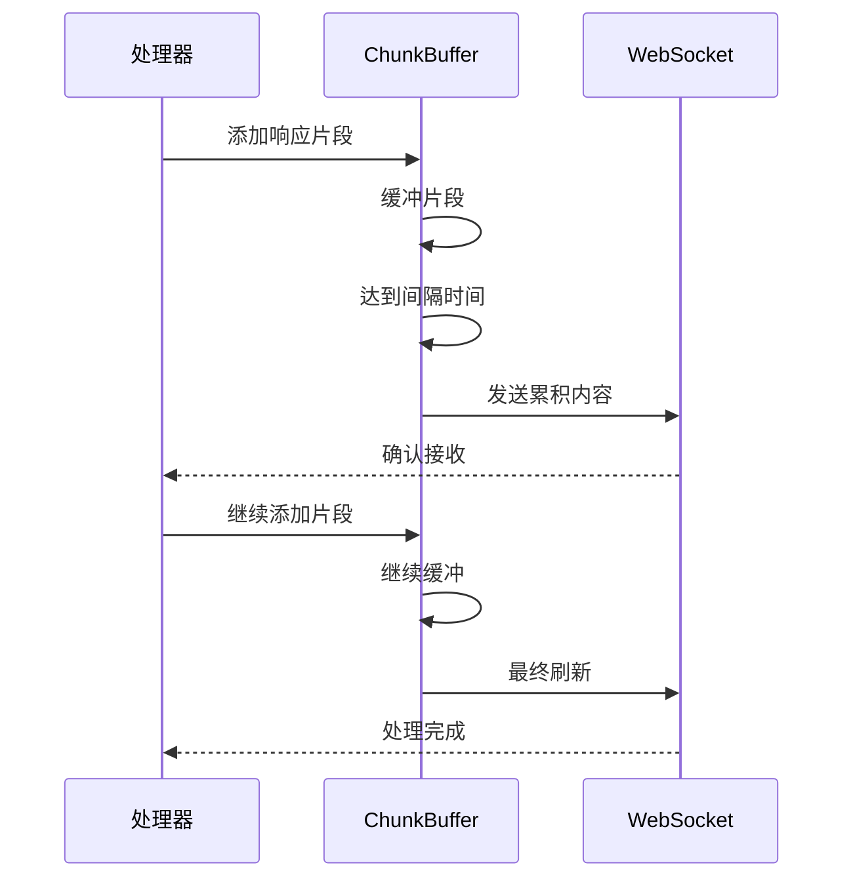
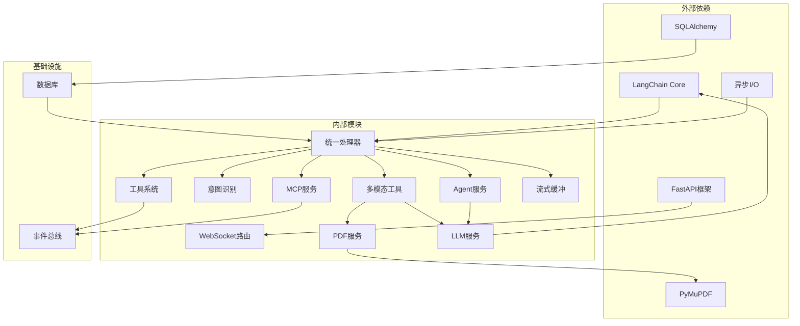

# 统一处理器系统

<cite>
**本文档引用的文件**
- [unified_handler.py](file://backend/app/handlers/unified_handler.py)
- [base.py](file://backend/app/handlers/base.py)
- [main.py](file://backend/app/main.py)
- [chat_handler.py](file://backend/app/handlers/chat_handler.py)
- [agent_service.py](file://backend/app/services/agent/agent_service.py)
- [tool_base.py](file://backend/app/services/core/tool_base.py)
- [ws.py](file://backend/app/routers/ws.py)
- [registry.py](file://backend/app/tools/registry.py)
- [intent.py](file://backend/app/services/agent/intent.py)
- [bridge.py](file://backend/app/mcp_services/bridge.py)
- [rag_handler.py](file://backend/app/handlers/rag_handler.py)
- [analyze_handler.py](file://backend/app/handlers/analyze_handler.py)
- [config.py](file://backend/app/config.py)
- [multimodal_tools.py](file://backend/app/tools/multimodal_tools.py)
- [pdf_service.py](file://backend/app/services/pdf_service.py)
- [ws_utils.py](file://backend/app/handlers/ws_utils.py)
- [llm_service.py](file://backend/app/services/llm/llm_service.py)
</cite>

## 更新摘要
**变更内容**
- 新增多模态请求路由功能，支持图片和文本的智能识别
- 增加智能页面提取功能，支持从PDF中提取特定页面的图表
- 实现流式响应支持，通过ChunkBuffer优化WebSocket通信
- 新增多模态工具集，包括图表分析、多模态搜索、表格提取等
- 增强意图识别系统，支持多模态意图的精确分类

## 目录
1. [简介](#简介)
2. [项目结构](#项目结构)
3. [核心组件](#核心组件)
4. [架构概览](#架构概览)
5. [详细组件分析](#详细组件分析)
6. [多模态功能增强](#多模态功能增强)
7. [流式响应支持](#流式响应支持)
8. [依赖关系分析](#依赖关系分析)
9. [性能考虑](#性能考虑)
10. [故障排除指南](#故障排除指南)
11. [结论](#结论)

## 简介

统一处理器系统是 PaperChat 项目的核心聊天处理引擎，负责根据用户消息的语义意图自动路由到最适合的处理方式。该系统集成了多种处理模式，包括RAG问答、深度分析、跨文档对话、写作辅助、知识库管理等，为用户提供智能化的学术论文阅读和问答体验。

**更新** 系统现已大幅增强，新增多模态请求路由、智能页面提取、流式响应支持等功能，能够处理包含图片、图表、表格等多模态内容的复杂请求。

系统采用"意图识别 + 自动路由 + 多模态处理"的设计理念，能够智能判断用户的实际需求，并选择最优的处理策略。无论是简单的闲聊对话还是复杂的多步推理任务，统一处理器都能提供高效、准确的响应。

## 项目结构

基于代码库的组织结构，统一处理器系统主要分布在以下目录中：

**图表来源**
- [unified_handler.py:1-1654](file://backend/app/handlers/unified_handler.py#L1-L1654)
- [base.py:1-159](file://backend/app/handlers/base.py#L1-L159)
- [main.py:1-390](file://backend/app/main.py#L1-L390)
- [multimodal_tools.py:1-324](file://backend/app/tools/multimodal_tools.py#L1-L324)
- [pdf_service.py:270-332](file://backend/app/services/pdf_service.py#L270-L332)
- [ws_utils.py:1-78](file://backend/app/handlers/ws_utils.py#L1-L78)

**章节来源**
- [unified_handler.py:1-1654](file://backend/app/handlers/unified_handler.py#L1-L1654)
- [base.py:1-159](file://backend/app/handlers/base.py#L1-L159)
- [main.py:1-390](file://backend/app/main.py#L1-L390)

## 核心组件

### 统一聊天处理器 (UnifiedHandler)

统一聊天处理器是整个系统的核心，负责接收用户消息并进行智能路由决策。其主要功能包括：

- **意图识别**：通过关键词匹配和LLM分析双重机制识别用户意图
- **自动路由**：根据意图类型自动选择最适合的处理方式
- **多模态处理**：支持简单问答、RAG问答、深度分析、跨文档对话等多种模式
- **安全控制**：集成安全检查和权限验证机制
- **多模态路由**：新增多模态请求检测和处理能力

**更新** 新增了专门的多模态处理逻辑，能够智能识别包含图片、图表、表格等多模态内容的请求，并选择相应的处理路径。

### 意图识别系统

系统实现了多层次的意图识别机制：

**图表来源**
- [intent.py:150-289](file://backend/app/services/agent/intent.py#L150-L289)
- [unified_handler.py:133-145](file://backend/app/handlers/unified_handler.py#L133-L145)

### Agent服务系统

Agent服务系统提供了强大的多步推理能力：

- **工具注册**：统一管理所有可用工具的生命周期
- **任务规划**：智能分解复杂任务为有序的子任务序列
- **执行监控**：实时跟踪任务执行进度和状态
- **结果聚合**：将多步执行结果整合为连贯的最终回答

**章节来源**
- [unified_handler.py:193-433](file://backend/app/handlers/unified_handler.py#L193-L433)
- [agent_service.py:70-376](file://backend/app/services/agent/agent_service.py#L70-L376)

## 架构概览

统一处理器系统采用了分层架构设计，确保了良好的可扩展性和维护性：

**图表来源**
- [ws.py:29-275](file://backend/app/routers/ws.py#L29-L275)
- [unified_handler.py:1-1654](file://backend/app/handlers/unified_handler.py#L1-L1654)
- [main.py:112-275](file://backend/app/main.py#L112-L275)

## 详细组件分析

### 统一处理器核心流程

统一处理器的核心工作流程如下：

**图表来源**
- [unified_handler.py:297-433](file://backend/app/handlers/unified_handler.py#L297-L433)
- [intent.py:250-289](file://backend/app/services/agent/intent.py#L250-L289)

### 工具系统架构

工具系统采用注册表模式，提供了灵活的工具管理和扩展能力：

**图表来源**
- [registry.py:10-51](file://backend/app/tools/registry.py#L10-L51)
- [tool_base.py:1-9](file://backend/app/services/core/tool_base.py#L1-L9)
- [multimodal_tools.py:18-324](file://backend/app/tools/multimodal_tools.py#L18-L324)

**章节来源**
- [registry.py:10-51](file://backend/app/tools/registry.py#L10-L51)
- [tool_base.py:1-9](file://backend/app/services/core/tool_base.py#L1-L9)
- [multimodal_tools.py:18-324](file://backend/app/tools/multimodal_tools.py#L18-L324)

### 安全控制机制

系统内置了多层次的安全控制机制：

**图表来源**
- [unified_handler.py:352-372](file://backend/app/handlers/unified_handler.py#L352-L372)

**章节来源**
- [unified_handler.py:352-372](file://backend/app/handlers/unified_handler.py#L352-L372)

## 多模态功能增强

### 多模态请求检测

系统新增了专门的多模态请求检测机制，能够智能识别包含图片、图表、表格等内容的请求：

**图表来源**
- [unified_handler.py:133-145](file://backend/app/handlers/unified_handler.py#L133-L145)
- [unified_handler.py:249-418](file://backend/app/handlers/unified_handler.py#L249-L418)

### 多模态工具集

系统提供了完整的多模态工具集，支持各种复杂的多模态请求：

#### AnalyzeChartTool
- **功能**：分析PDF论文中的图表，识别图表类型、提取数据摘要和关键发现
- **应用场景**：图表解读、数据分析、可视化内容理解
- **性能**：单次分析2-5秒，云端加速

#### MultimodalSearchTool  
- **功能**：基于图片和文本进行多模态搜索，结合视觉内容和文本查询
- **应用场景**：以图搜文、视觉搜索、跨模态信息检索
- **性能**：3-8秒，支持纯文本、纯图片、图文混合三种模式

#### ExtractTableTool
- **功能**：从论文PDF中提取表格并转为结构化数据（Markdown/CSV/JSON）
- **应用场景**：表格数据提取、结构化信息处理
- **性能**：自动检测表格位置，支持多种输出格式

**章节来源**
- [multimodal_tools.py:18-324](file://backend/app/tools/multimodal_tools.py#L18-L324)
- [pdf_service.py:270-332](file://backend/app/services/pdf_service.py#L270-L332)

### 智能页面提取

系统实现了智能的PDF页面提取功能，能够从论文中定位和提取特定页面的图片内容：

**图表来源**
- [unified_handler.py:334-382](file://backend/app/handlers/unified_handler.py#L334-L382)
- [pdf_service.py:286-327](file://backend/app/services/pdf_service.py#L286-L327)

**章节来源**
- [unified_handler.py:334-382](file://backend/app/handlers/unified_handler.py#L334-L382)
- [pdf_service.py:286-327](file://backend/app/services/pdf_service.py#L286-L327)

## 流式响应支持

### ChunkBuffer流式传输

系统实现了高效的流式响应机制，通过ChunkBuffer优化WebSocket通信：

**图表来源**
- [ws_utils.py:10-78](file://backend/app/handlers/ws_utils.py#L10-L78)
- [unified_handler.py:384-394](file://backend/app/handlers/unified_handler.py#L384-L394)

### 流式响应优化

系统通过多种机制优化流式响应性能：

- **缓冲合并**：默认50ms合并间隔，显著减少WebSocket消息数量
- **智能刷新**：达到间隔时间自动刷新，避免长时间等待
- **内存管理**：异步锁保护，防止竞态条件
- **异常处理**：完善的错误处理和资源清理机制

**章节来源**
- [ws_utils.py:10-78](file://backend/app/handlers/ws_utils.py#L10-L78)
- [unified_handler.py:384-394](file://backend/app/handlers/unified_handler.py#L384-L394)

## 依赖关系分析

统一处理器系统的依赖关系呈现典型的分层架构特征：

**图表来源**
- [unified_handler.py:1-36](file://backend/app/handlers/unified_handler.py#L1-L36)
- [main.py:112-275](file://backend/app/main.py#L112-L275)

**章节来源**
- [unified_handler.py:1-36](file://backend/app/handlers/unified_handler.py#L1-L36)
- [main.py:112-275](file://backend/app/main.py#L112-L275)

## 性能考虑

统一处理器系统在设计时充分考虑了性能优化：

### 响应时间优化

- **意图识别缓存**：关键词匹配在1ms内完成，避免不必要的LLM调用
- **多模态快速通道**：检测到图片时直接进入多模态处理，零延迟路由
- **流式响应**：采用ChunkBuffer实现流式输出，提升用户体验
- **并发处理**：支持多任务并发执行，合理利用系统资源

### 资源管理

- **连接池管理**：数据库连接采用异步连接池，提高连接复用率
- **内存优化**：工具实例采用单例模式，避免重复创建
- **缓存策略**：实现多级缓存机制，减少重复计算
- **图片处理优化**：PDF服务缓存页面信息，避免重复解析

### 扩展性设计

- **插件化架构**：工具系统支持动态注册和注销
- **配置驱动**：通过配置文件实现功能开关和参数调整
- **负载均衡**：支持多实例部署和任务分发
- **多模态扩展**：新的多模态工具可轻松集成到现有框架

## 故障排除指南

### 常见问题及解决方案

**问题1：意图识别不准确**
- 检查关键词配置是否完整
- 验证LLM模型配置是否正确
- 查看日志中意图识别结果

**问题2：工具调用失败**
- 确认工具权限配置
- 检查MCP服务连接状态
- 验证API密钥有效性

**问题3：响应速度慢**
- 检查数据库连接池配置
- 优化LLM模型参数
- 调整流式输出间隔

**问题4：多模态处理失败**
- 验证图片格式和编码
- 检查PDF文件完整性
- 确认多模态工具可用性

**问题5：流式响应异常**
- 检查WebSocket连接状态
- 验证ChunkBuffer配置
- 查看网络延迟情况

**章节来源**
- [unified_handler.py:507-513](file://backend/app/handlers/unified_handler.py#L507-L513)
- [agent_service.py:267-276](file://backend/app/services/agent/agent_service.py#L267-L276)

## 结论

统一处理器系统通过智能化的意图识别和自动路由机制，为用户提供了高效、准确的学术论文阅读和问答体验。系统采用分层架构设计，具有良好的可扩展性和维护性，能够适应不断增长的功能需求。

**更新** 通过新增多模态功能，系统现在能够处理包含图片、图表、表格等复杂内容的请求，大大扩展了应用场景。多模态请求路由、智能页面提取、流式响应支持等功能的集成，使得系统在处理复杂学术内容时更加得心应手。

该系统的主要优势包括：

1. **智能路由**：能够准确识别用户意图并选择最优处理方式
2. **多模态支持**：支持简单问答、复杂推理、跨文档分析等多种模式
3. **多模态增强**：新增图表分析、多模态搜索、表格提取等高级功能
4. **流式响应**：通过ChunkBuffer实现高效的实时通信
5. **安全可靠**：内置多层次安全控制机制
6. **高性能**：采用流式处理和缓存优化技术
7. **易于扩展**：插件化架构支持功能扩展

未来可以进一步优化的方向包括：增强多语言支持、改进上下文理解能力、增加个性化推荐功能、扩展更多类型的多模态工具等。