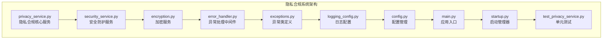
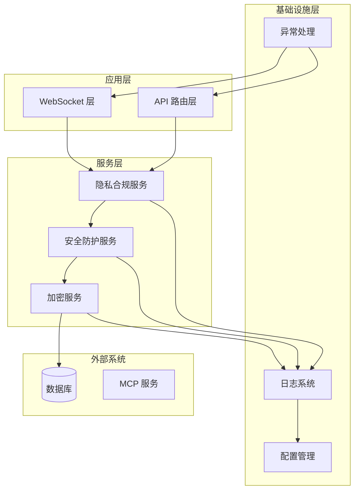
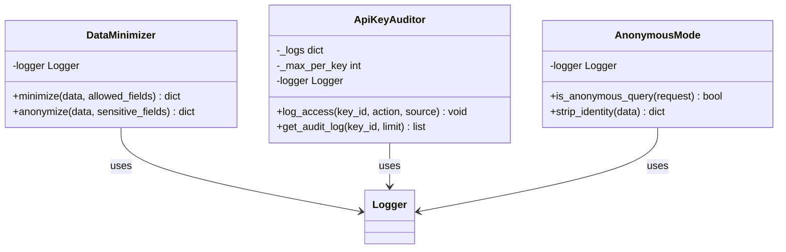
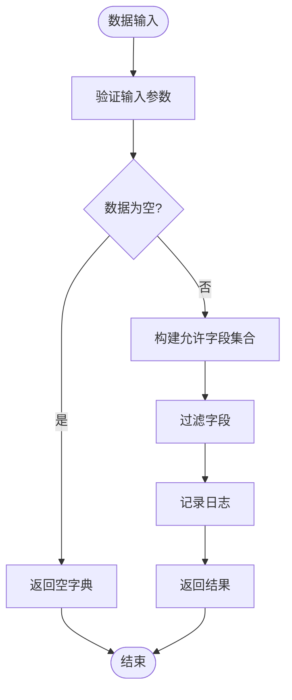
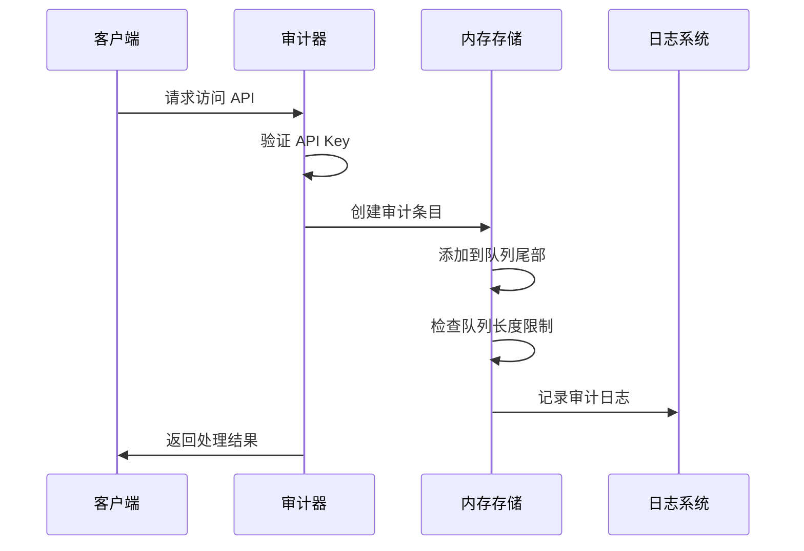
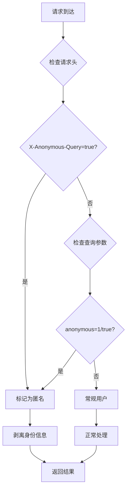
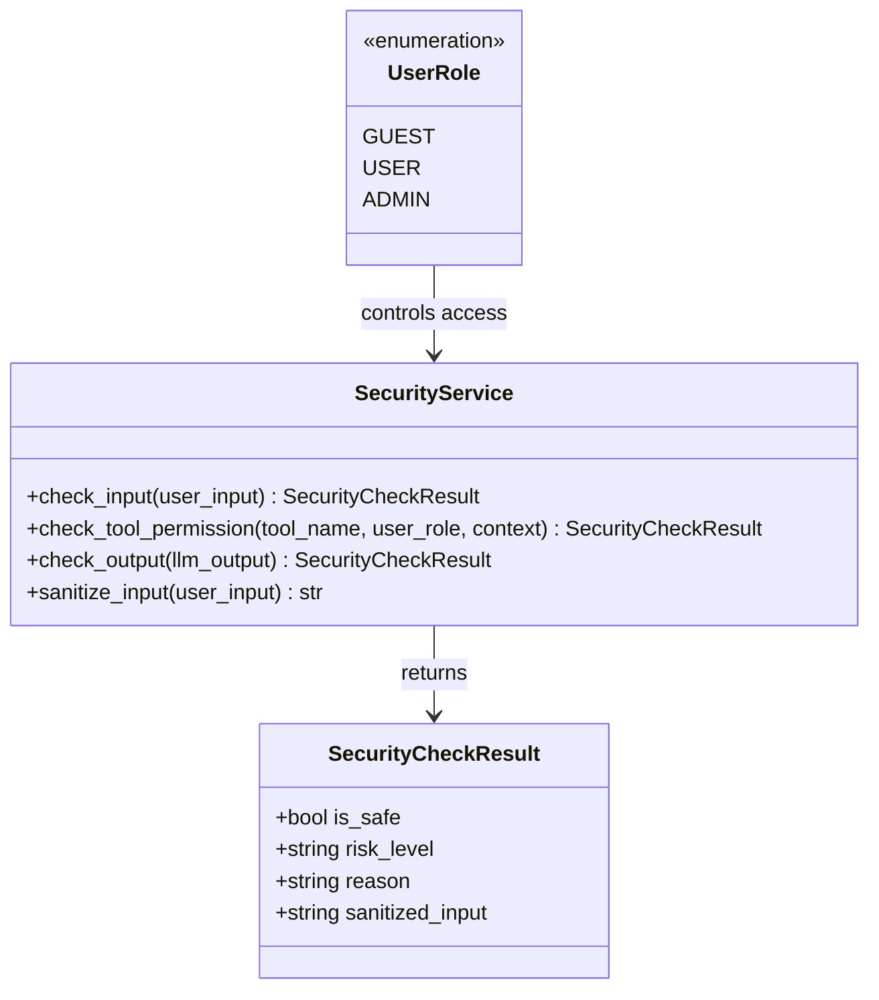
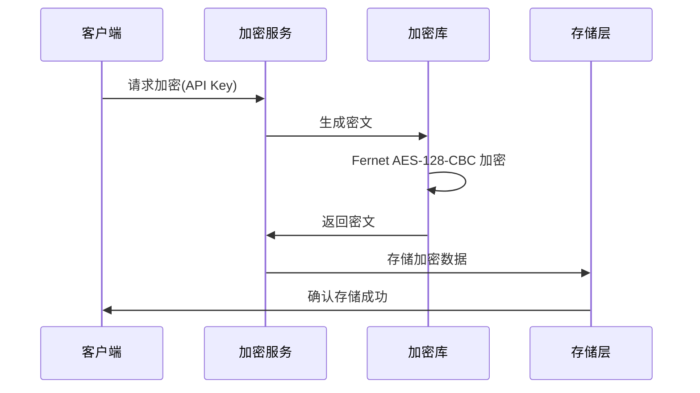
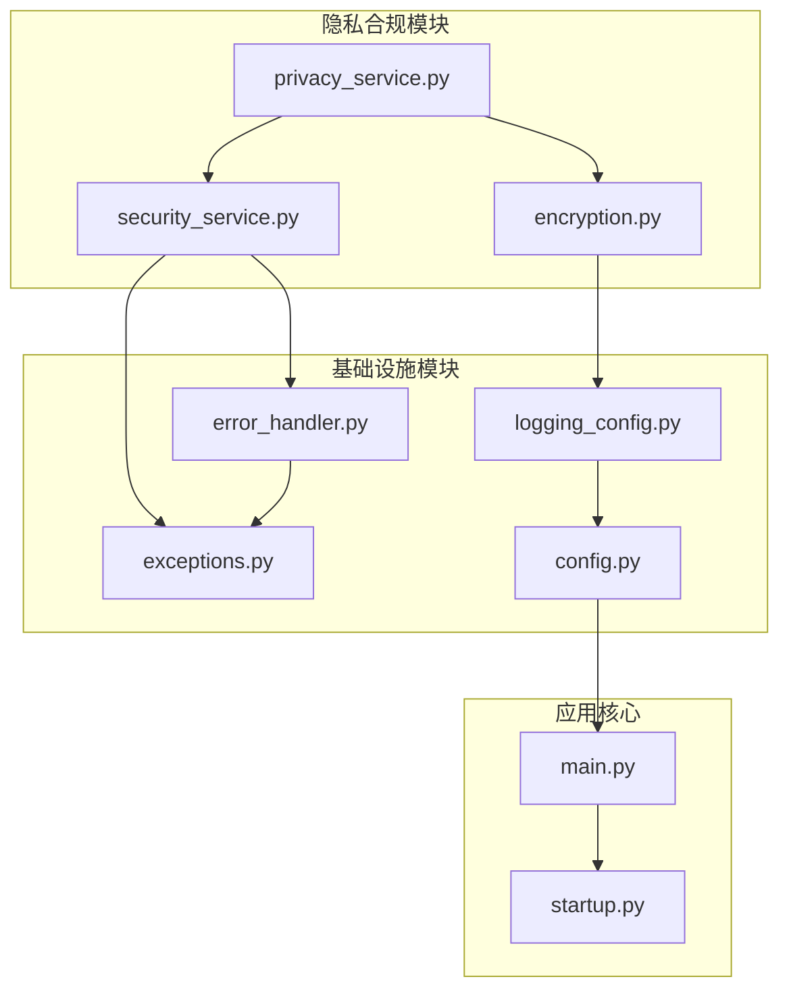

# 隐私合规系统

<cite>
**本文档引用的文件**
- [privacy_service.py](file://backend/app/services/privacy/privacy_service.py)
- [security_service.py](file://backend/app/services/security/security_service.py)
- [encryption.py](file://backend/app/services/security/encryption.py)
- [error_handler.py](file://backend/app/middleware/error_handler.py)
- [exceptions.py](file://backend/app/errors/exceptions.py)
- [logging_config.py](file://backend/app/logging_config.py)
- [config.py](file://backend/app/config.py)
- [main.py](file://backend/app/main.py)
- [startup.py](file://backend/app/startup.py)
- [test_privacy_service.py](file://backend/tests/unit/test_privacy_service.py)
</cite>

## 目录
1. [简介](#简介)
2. [项目结构](#项目结构)
3. [核心组件](#核心组件)
4. [架构概览](#架构概览)
5. [详细组件分析](#详细组件分析)
6. [依赖关系分析](#依赖关系分析)
7. [性能考虑](#性能考虑)
8. [故障排除指南](#故障排除指南)
9. [结论](#结论)

## 简介

隐私合规系统是 PaperChat 学术论文智能阅读与问答系统中的关键安全模块，专注于保护用户隐私和确保数据处理符合隐私法规要求。该系统提供了三个核心功能模块：

- **数据最小化与脱敏**：通过白名单机制和敏感字段脱敏保护用户数据
- **API Key 访问审计**：完整的 API 使用记录和监控能力
- **匿名查询判断**：自动识别和处理匿名访问请求

该系统采用模块化设计，具有良好的可扩展性和安全性，能够在保证功能完整性的同时最大化保护用户隐私。

## 项目结构

隐私合规系统主要分布在以下目录结构中：



**图表来源**
- [privacy_service.py:1-209](file://backend/app/services/privacy/privacy_service.py#L1-L209)
- [security_service.py:1-317](file://backend/app/services/security/security_service.py#L1-L317)
- [encryption.py:1-167](file://backend/app/services/security/encryption.py#L1-L167)

**章节来源**
- [privacy_service.py:1-209](file://backend/app/services/privacy/privacy_service.py#L1-L209)
- [security_service.py:1-317](file://backend/app/services/security/security_service.py#L1-L317)
- [encryption.py:1-167](file://backend/app/services/security/encryption.py#L1-L167)

## 核心组件

隐私合规系统包含三个主要组件，每个组件都实现了特定的隐私保护功能：

### 数据最小化与脱敏组件 (DataMinimizer)

DataMinimizer 提供了两个核心功能：
- **字段白名单过滤**：只保留允许的字段，剔除所有敏感信息
- **敏感字段脱敏**：对特定字段进行部分掩码处理

### API Key 审计组件 (ApiKeyAuditor)

API Key 审计系统提供了完整的 API 使用监控能力：
- **实时访问记录**：记录每次 API Key 的使用情况
- **内存队列管理**：限制每个 API Key 的审计日志数量
- **灵活查询接口**：支持按条件查询审计记录

### 匿名模式组件 (AnonymousMode)

匿名模式处理系统中的匿名访问：
- **匿名查询检测**：自动识别匿名访问请求
- **身份信息剥离**：移除所有身份相关字段
- **多平台兼容**：支持多种匿名访问方式

**章节来源**
- [privacy_service.py:22-209](file://backend/app/services/privacy/privacy_service.py#L22-L209)

## 架构概览

隐私合规系统采用分层架构设计，确保各个组件之间的松耦合和高内聚：



**图表来源**
- [main.py:288-390](file://backend/app/main.py#L288-L390)
- [startup.py:19-245](file://backend/app/startup.py#L19-L245)

## 详细组件分析

### 数据最小化与脱敏组件

DataMinimizer 是隐私保护的核心工具，采用了纯函数设计模式，确保无状态和可复用性。

#### 核心功能分析



**图表来源**
- [privacy_service.py:22-209](file://backend/app/services/privacy/privacy_service.py#L22-L209)

#### 数据最小化流程



**图表来源**
- [privacy_service.py:28-47](file://backend/app/services/privacy/privacy_service.py#L28-L47)

#### 敏感字段脱敏算法

脱敏系统采用智能脱敏策略，根据数据类型和长度进行不同的处理：

| 数据类型 | 脱敏策略 | 示例 |
|---------|---------|------|
| 字符串 (>4字符) | 保留首尾各1/4，中间用***替换 | sk-abc...xyz |
| 字符串 (≤4字符) | 完全替换为*** | *** |
| 非字符串 | 替换为*** | *** |

**章节来源**
- [privacy_service.py:22-81](file://backend/app/services/privacy/privacy_service.py#L22-L81)

### API Key 审计系统

API Key 审计系统提供了完整的 API 使用监控能力，采用内存队列实现高效的数据管理。

#### 审计日志管理



**图表来源**
- [privacy_service.py:102-135](file://backend/app/services/privacy/privacy_service.py#L102-L135)

#### 内存队列优化

系统使用双端队列 (deque) 实现高效的内存管理：

- **固定容量**：每个 API Key 维护独立的队列
- **自动截断**：超出限制时自动移除最旧记录
- **线程安全**：支持并发访问而无需额外锁机制

**章节来源**
- [privacy_service.py:90-136](file://backend/app/services/privacy/privacy_service.py#L90-L136)

### 匿名模式处理

匿名模式系统提供了灵活的身份信息处理能力，支持多种匿名访问场景。

#### 匿名查询检测流程



**图表来源**
- [privacy_service.py:157-183](file://backend/app/services/privacy/privacy_service.py#L157-L183)

#### 身份信息字段管理

系统维护了一个全面的身份信息字段白名单：

**用户身份字段**：user_id, user_name, username, email, phone, real_name, id_card, address
**设备信息字段**：ip_address, ip, device_id, session_id
**请求信息字段**：client_ip, user_agent

**章节来源**
- [privacy_service.py:154-201](file://backend/app/services/privacy/privacy_service.py#L154-L201)

### 安全防护服务

安全防护服务提供了多层次的安全保护机制，包括输入验证、权限控制和输出过滤。

#### 角色权限体系



**图表来源**
- [security_service.py:85-317](file://backend/app/services/security/security_service.py#L85-L317)

#### 注入攻击检测

系统采用多层检测机制防止提示词注入攻击：

**高风险模式检测**：
- 角色覆盖尝试：`ignore`, `disregard`, `you are now`
- 系统提示词提取：`show prompt`, `reveal system`
- 消息分隔符注入：`---`, `===`, `###`

**中风险模式检测**：
- 角色扮演尝试：`act as`, `pretend to be`
- 系统设定查询：`what are your instructions`

**低风险模式检测**：
- 编码绕过尝试：`base64`, `\x`, `\u`
- 中文注入模式：`忽略`, `从现在开始你是`

**章节来源**
- [security_service.py:111-317](file://backend/app/services/security/security_service.py#L111-L317)

### 加密服务

加密服务提供了对敏感数据的安全存储能力，采用现代加密标准确保数据安全。

#### 加密流程



**图表来源**
- [encryption.py:71-104](file://backend/app/services/security/encryption.py#L71-L104)

#### 密钥管理

系统采用自动密钥管理机制：

- **密钥生成**：首次运行时自动生成强随机密钥
- **密钥存储**：密钥保存在环境变量中
- **密钥轮换**：支持定期密钥轮换和迁移
- **向后兼容**：自动检测和迁移未加密数据

**章节来源**
- [encryption.py:26-167](file://backend/app/services/security/encryption.py#L26-L167)

## 依赖关系分析

隐私合规系统的依赖关系清晰明确，遵循单一职责原则：



**图表来源**
- [privacy_service.py:1-209](file://backend/app/services/privacy/privacy_service.py#L1-L209)
- [security_service.py:1-317](file://backend/app/services/security/security_service.py#L1-L317)
- [encryption.py:1-167](file://backend/app/services/security/encryption.py#L1-L167)

### 组件耦合度分析

- **低耦合设计**：各组件之间通过明确定义的接口交互
- **可替换性**：加密服务和审计服务可以独立替换
- **扩展性**：新的隐私保护功能可以轻松集成

**章节来源**
- [main.py:112-275](file://backend/app/main.py#L112-L275)
- [startup.py:19-245](file://backend/app/startup.py#L19-L245)

## 性能考虑

隐私合规系统在设计时充分考虑了性能影响，采用了多种优化策略：

### 内存优化

- **队列限制**：API Key 审计使用固定容量队列，避免内存泄漏
- **惰性初始化**：加密服务采用延迟初始化，减少启动时间
- **缓存机制**：敏感字段检测使用集合查找，时间复杂度 O(1)

### 线程安全

- **无状态设计**：DataMinimizer 采用纯函数设计，天然线程安全
- **原子操作**：队列操作使用内置的线程安全实现
- **异步处理**：日志记录使用异步方式，不影响主业务流程

### 性能基准

| 操作类型 | 时间复杂度 | 内存使用 | 备注 |
|---------|-----------|----------|------|
| 字段过滤 | O(n) | O(k) | n为字段数，k为允许字段数 |
| 脱敏处理 | O(m) | O(m) | m为处理字段数 |
| 审计记录 | O(1) | 固定 | 使用队列操作 |
| 加密解密 | O(1) | 固定 | Fernet 标准实现 |

## 故障排除指南

### 常见问题诊断

#### API Key 审计日志异常

**问题症状**：审计日志丢失或数量异常
**可能原因**：
- 队列容量设置过小
- 应用重启导致内存数据丢失
- 高并发场景下的竞争条件

**解决方案**：
- 调整 `max_per_key` 参数
- 考虑持久化存储方案
- 在生产环境使用数据库替代内存存储

#### 加密服务初始化失败

**问题症状**：加密功能不可用
**可能原因**：
- 环境变量 `ENCRYPTION_KEY` 未设置
- 密钥格式不正确
- 权限不足无法读取环境变量

**解决方案**：
- 设置正确的 `ENCRYPTION_KEY` 环境变量
- 确保密钥符合 Fernet 格式要求
- 检查应用运行权限

#### 匿名模式检测失效

**问题症状**：匿名访问请求未被正确识别
**可能原因**：
- 请求头名称不匹配
- 查询参数格式错误
- 请求对象格式不符合预期

**解决方案**：
- 确认使用正确的请求头名称 `X-Anonymous-Query`
- 检查查询参数格式为 `anonymous=true` 或 `anonymous=1`
- 验证请求对象包含必要的属性

**章节来源**
- [error_handler.py:1-124](file://backend/app/middleware/error_handler.py#L1-L124)
- [exceptions.py:12-94](file://backend/app/errors/exceptions.py#L12-L94)

### 日志分析

系统提供了丰富的日志信息用于问题诊断：

#### 关键日志类型

| 日志级别 | 用途 | 示例内容 |
|---------|------|---------|
| DEBUG | 详细操作跟踪 | "DataMinimizer.minimize: 保留 3/5 字段" |
| INFO | 一般性信息 | "EncryptionService 已使用提供的密钥初始化" |
| WARNING | 警告信息 | "ENCRYPTION_KEY 环境变量未设置，已自动生成临时密钥" |
| ERROR | 错误信息 | "检测到高风险注入: 角色覆盖尝试" |

#### 日志配置

系统采用结构化日志格式，便于日志分析和监控：

```python
formatter = logging.Formatter(
    fmt='%(asctime)s | %(levelname)-8s | %(name)s | %(message)s',
    datefmt='%Y-%m-%d %H:%M:%S'
)
```

**章节来源**
- [logging_config.py:9-42](file://backend/app/logging_config.py#L9-L42)

## 结论

隐私合规系统展现了优秀的软件工程实践，通过模块化设计、清晰的架构分离和完善的测试覆盖，成功实现了以下目标：

### 主要成就

1. **全面的隐私保护**：实现了数据最小化、脱敏和匿名处理的完整闭环
2. **高性能设计**：采用内存优化和异步处理，确保系统响应速度
3. **可扩展架构**：模块化设计支持未来功能扩展和定制化需求
4. **生产就绪**：完善的错误处理、日志记录和监控机制

### 技术亮点

- **纯函数设计**：DataMinimizer 采用无状态设计，提高代码可测试性和可维护性
- **智能脱敏算法**：根据数据特征动态调整脱敏策略
- **内存队列优化**：高效的审计日志管理机制
- **多层次安全防护**：从输入验证到输出过滤的全方位保护

### 改进建议

1. **持久化存储**：考虑将 API Key 审计日志持久化到数据库
2. **监控集成**：集成到现有的监控系统中，提供可视化界面
3. **合规报告**：生成合规性报告，满足审计要求
4. **自动化测试**：增加更多的集成测试和性能测试

该系统为学术论文智能阅读与问答系统提供了坚实的隐私保护基础，确保用户数据得到充分保护，同时保持了系统的高性能和易用性。