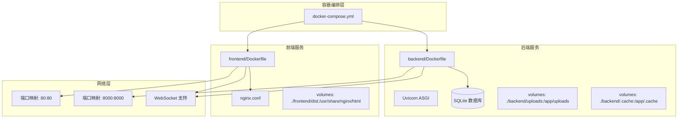
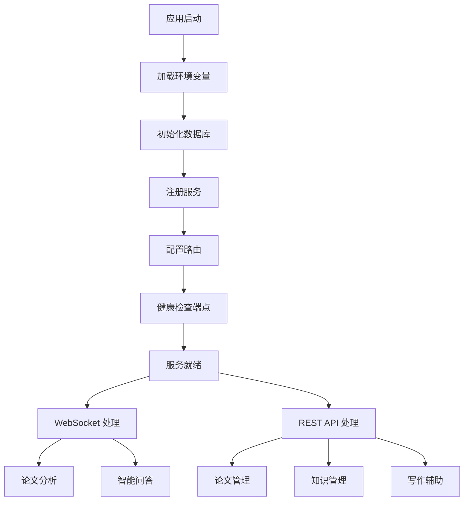
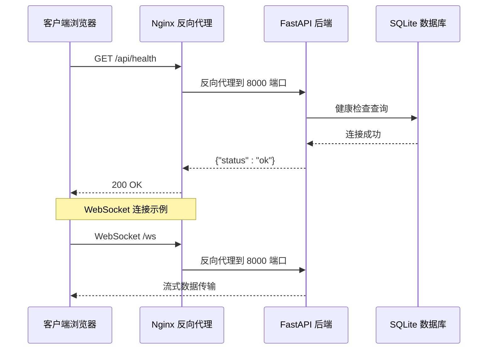
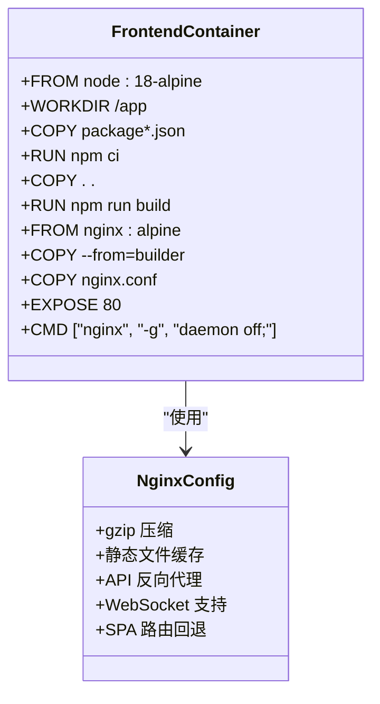
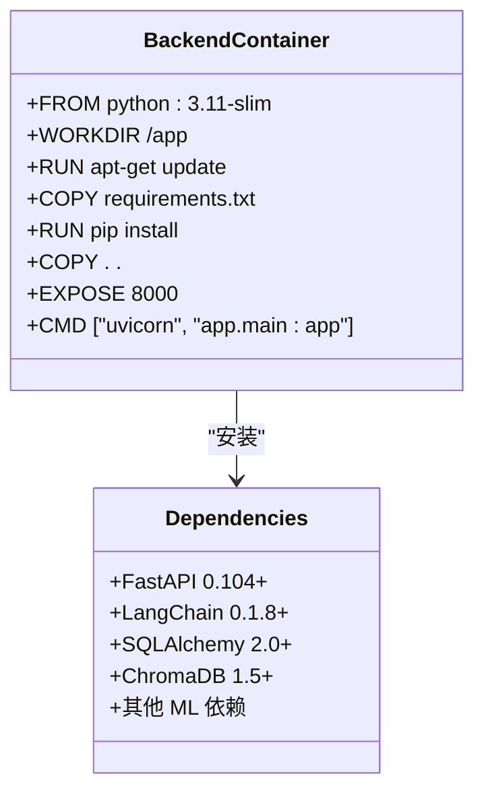
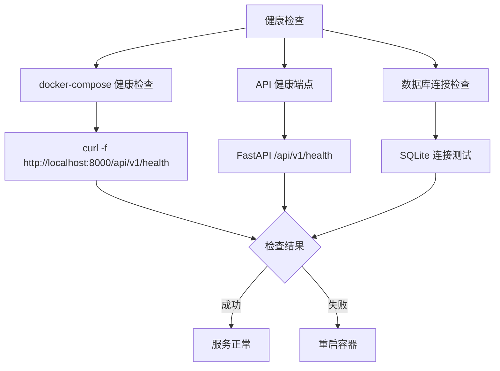
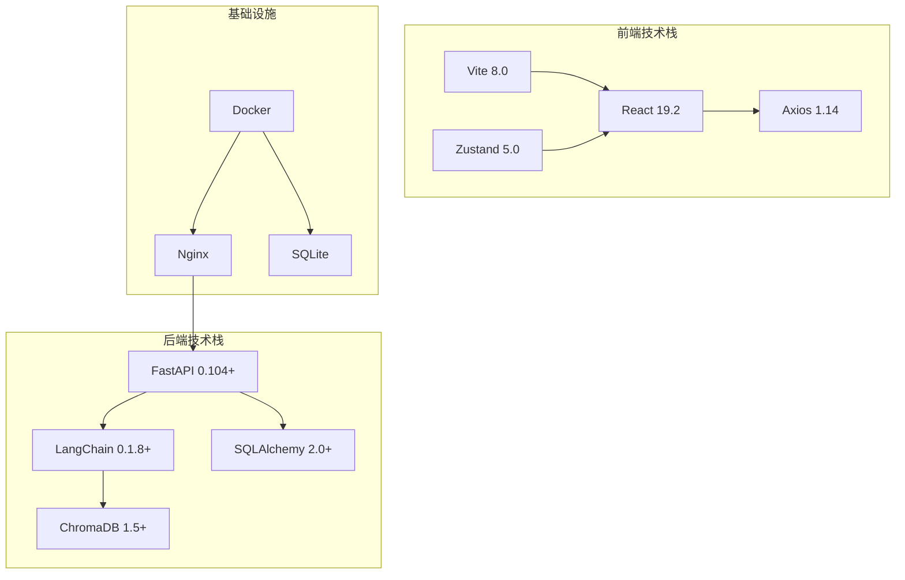
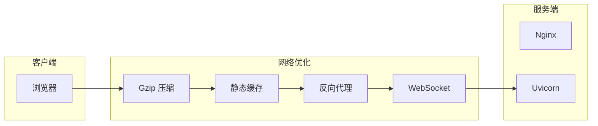

# 容器化部署

<cite>
**本文档引用的文件**
- [docker-compose.yml](file://docker-compose.yml)
- [backend/Dockerfile](file://backend/Dockerfile)
- [frontend/Dockerfile](file://frontend/Dockerfile)
- [backend/main.py](file://backend/main.py)
- [backend/app/main.py](file://backend/app/main.py)
- [backend/app/config.py](file://backend/app/config.py)
- [backend/requirements.txt](file://backend/requirements.txt)
- [frontend/nginx.conf](file://frontend/nginx.conf)
- [backend/.dockerignore](file://backend/.dockerignore)
- [frontend/.dockerignore](file://frontend/.dockerignore)
- [backend/pyproject.toml](file://backend/pyproject.toml)
- [frontend/package.json](file://frontend/package.json)
- [README.md](file://README.md)
</cite>

## 目录
1. [简介](#简介)
2. [项目结构](#项目结构)
3. [核心组件](#核心组件)
4. [架构概览](#架构概览)
5. [详细组件分析](#详细组件分析)
6. [依赖分析](#依赖分析)
7. [性能考虑](#性能考虑)
8. [故障排除指南](#故障排除指南)
9. [结论](#结论)

## 简介

PaperChat 是一个基于云端大模型的智能论文分析系统，支持 PDF 上传、AI 论文结构化解析、智能问答、知识管理和写作辅助等功能。本文档详细介绍该系统的容器化部署方案，包括 Docker 配置、服务编排、网络通信和健康检查机制。

## 项目结构

PaperChat 采用前后端分离的微服务架构，通过 Docker Compose 进行统一编排：



**图表来源**
- [docker-compose.yml:1-28](file://docker-compose.yml#L1-L28)
- [backend/Dockerfile:1-20](file://backend/Dockerfile#L1-L20)
- [frontend/Dockerfile:1-14](file://frontend/Dockerfile#L1-L14)

**章节来源**
- [docker-compose.yml:1-28](file://docker-compose.yml#L1-L28)
- [README.md:72-183](file://README.md#L72-L183)

## 核心组件

### Docker Compose 编排配置

系统使用 Docker Compose 进行多服务编排，包含以下关键组件：

| 组件 | 配置要点 | 端口映射 | 数据卷 |
|------|----------|----------|--------|
| Backend | Python 3.11 Slim | 8000:8000 | uploads/, chatpdf.db |
| Frontend | Nginx Alpine | 80:80 | dist/ |
| Health Check | curl http://localhost:8000/api/v1/health | - | - |

### 后端服务配置

后端采用 FastAPI 框架，支持异步处理和 WebSocket 通信：



**图表来源**
- [backend/app/main.py:31-91](file://backend/app/main.py#L31-L91)
- [backend/main.py:32-34](file://backend/main.py#L32-L34)

**章节来源**
- [backend/app/main.py:130-227](file://backend/app/main.py#L130-L227)
- [backend/main.py:16-151](file://backend/main.py#L16-L151)

## 架构概览

系统采用反向代理架构，前端通过 Nginx 提供静态资源服务，后端通过 Uvicorn 提供 API 和 WebSocket 服务：



**图表来源**
- [frontend/nginx.conf:19-40](file://frontend/nginx.conf#L19-L40)
- [backend/app/main.py:205-216](file://backend/app/main.py#L205-L216)

## 详细组件分析

### 前端容器配置

前端使用多阶段构建策略，第一阶段使用 Node.js 构建生产包，第二阶段使用 Nginx 提供静态服务：



**图表来源**
- [frontend/Dockerfile:1-14](file://frontend/Dockerfile#L1-L14)
- [frontend/nginx.conf:1-47](file://frontend/nginx.conf#L1-L47)

#### Nginx 配置详解

前端 Nginx 配置包含以下关键特性：

| 配置项 | 作用 | 实现方式 |
|--------|------|----------|
| Gzip 压缩 | 减少传输体积 | gzip on; gzip_types |
| 静态缓存 | 提升加载速度 | expires 1y; Cache-Control |
| API 代理 | 转发后端请求 | proxy_pass http://backend:8000 |
| WebSocket | 支持实时通信 | Upgrade 升级头 |
| SPA 回退 | 支持前端路由 | try_files $uri $uri/ /index.html |

**章节来源**
- [frontend/Dockerfile:1-14](file://frontend/Dockerfile#L1-L14)
- [frontend/nginx.conf:1-47](file://frontend/nginx.conf#L1-L47)

### 后端容器配置

后端采用 Python 3.11 Slim 基础镜像，包含完整的依赖安装和应用启动配置：



**图表来源**
- [backend/Dockerfile:1-20](file://backend/Dockerfile#L1-L20)
- [backend/requirements.txt:1-25](file://backend/requirements.txt#L1-L25)

#### 环境变量和配置管理

后端使用 Pydantic Settings 进行配置管理，支持从 .env 文件读取环境变量：

| 配置类别 | 关键参数 | 默认值 | 用途 |
|----------|----------|--------|------|
| 应用配置 | APP_NAME, DEBUG | "PaperChat", True | 应用基本信息 |
| 数据库 | DATABASE_URL | sqlite+aiosqlite:///./paperchat.db | 数据存储 |
| JWT | JWT_SECRET_KEY, JWT_ALGORITHM | 安全密钥 | 用户认证 |
| CORS | CORS_ORIGINS | 开发环境域名 | 跨域访问 |
| 上传 | UPLOAD_DIR, MAX_FILE_SIZE | ./uploads, 50MB | 文件上传 |

**章节来源**
- [backend/app/config.py:15-47](file://backend/app/config.py#L15-L47)

### 健康检查机制

系统实现了多层次的健康检查机制：



**图表来源**
- [docker-compose.yml:14-19](file://docker-compose.yml#L14-L19)
- [backend/app/main.py:205-216](file://backend/app/main.py#L205-L216)

**章节来源**
- [docker-compose.yml:14-19](file://docker-compose.yml#L14-L19)
- [backend/app/main.py:205-216](file://backend/app/main.py#L205-L216)

## 依赖分析

### 技术栈依赖关系

系统的技术栈采用分层依赖结构：



**图表来源**
- [README.md:40-71](file://README.md#L40-L71)
- [backend/requirements.txt:1-25](file://backend/requirements.txt#L1-L25)
- [frontend/package.json:14-45](file://frontend/package.json#L14-L45)

### Docker 镜像构建优化

前后端都采用了多阶段构建策略来优化镜像大小：

| 优化策略 | 实现方式 | 效果 |
|----------|----------|------|
| 多阶段构建 | Node.js 构建 + Nginx 运行 | 减少镜像大小 |
| 依赖缓存 | pip install 缓存 | 加快构建速度 |
| 系统包清理 | apt-get clean | 减少包管理器占用 |
| 文件过滤 | .dockerignore 排除 | 避免不必要的文件传输 |

**章节来源**
- [backend/.dockerignore:1-37](file://backend/.dockerignore#L1-L37)
- [frontend/.dockerignore:1-32](file://frontend/.dockerignore#L1-L32)

## 性能考虑

### 容器性能优化

系统在容器层面采用了多项性能优化措施：

1. **镜像大小优化**
   - 使用 Alpine Linux 基础镜像
   - 多阶段构建减少最终镜像大小
   - .dockerignore 排除不必要的文件

2. **资源利用优化**
   - Nginx 提供静态资源服务，减轻后端压力
   - gzip 压缩减少网络传输
   - 静态文件长期缓存

3. **并发处理能力**
   - Uvicorn 支持异步处理
   - WebSocket 实现实时通信
   - 多任务并发执行

### 网络通信优化



**图表来源**
- [frontend/nginx.conf:7-17](file://frontend/nginx.conf#L7-L17)
- [frontend/nginx.conf:19-40](file://frontend/nginx.conf#L19-L40)

## 故障排除指南

### 常见问题诊断

| 问题类型 | 症状 | 诊断方法 | 解决方案 |
|----------|------|----------|----------|
| 容器启动失败 | docker-compose up 报错 | 查看容器日志 | 检查端口占用和权限 |
| 健康检查失败 | 服务不可用 | curl http://localhost:8000/api/v1/health | 检查后端服务状态 |
| 文件上传失败 | 403/404 错误 | 检查 uploads 目录权限 | 确认数据卷挂载正确 |
| WebSocket 连接失败 | 无法建立实时通信 | 检查反向代理配置 | 验证 Upgrade 头设置 |

### 日志查看和调试

```bash
# 查看所有容器日志
docker-compose logs -f

# 查看特定服务日志
docker-compose logs -f backend
docker-compose logs -f frontend

# 进入容器进行调试
docker-compose exec backend bash
docker-compose exec frontend bash
```

### 环境变量配置

确保 .env 文件包含必要的配置：

```env
# DeepSeek API Key
DEEPSEEK_API_KEY=your-api-key-here

# JWT 密钥（生产环境必须修改）
JWT_SECRET_KEY=your-secure-secret-key-change-in-production

# 数据库配置
DATABASE_URL=sqlite+aiosqlite:///./paperchat.db

# 上传目录
UPLOAD_DIR=./uploads
MAX_FILE_SIZE=52428800
```

**章节来源**
- [backend/app/config.py:28-41](file://backend/app/config.py#L28-L41)
- [backend/app/main.py:48-50](file://backend/app/main.py#L48-L50)

## 结论

PaperChat 的容器化部署方案具有以下优势：

1. **架构清晰**：前后端分离，职责明确
2. **部署简单**：Docker Compose 一键部署
3. **性能优秀**：多阶段构建，资源优化
4. **易于扩展**：微服务架构，便于水平扩展
5. **运维友好**：完善的健康检查和错误处理

该部署方案适合中小型团队快速搭建论文分析平台，支持生产环境的稳定运行。通过合理的资源配置和监控设置，可以进一步提升系统的可靠性和性能表现。