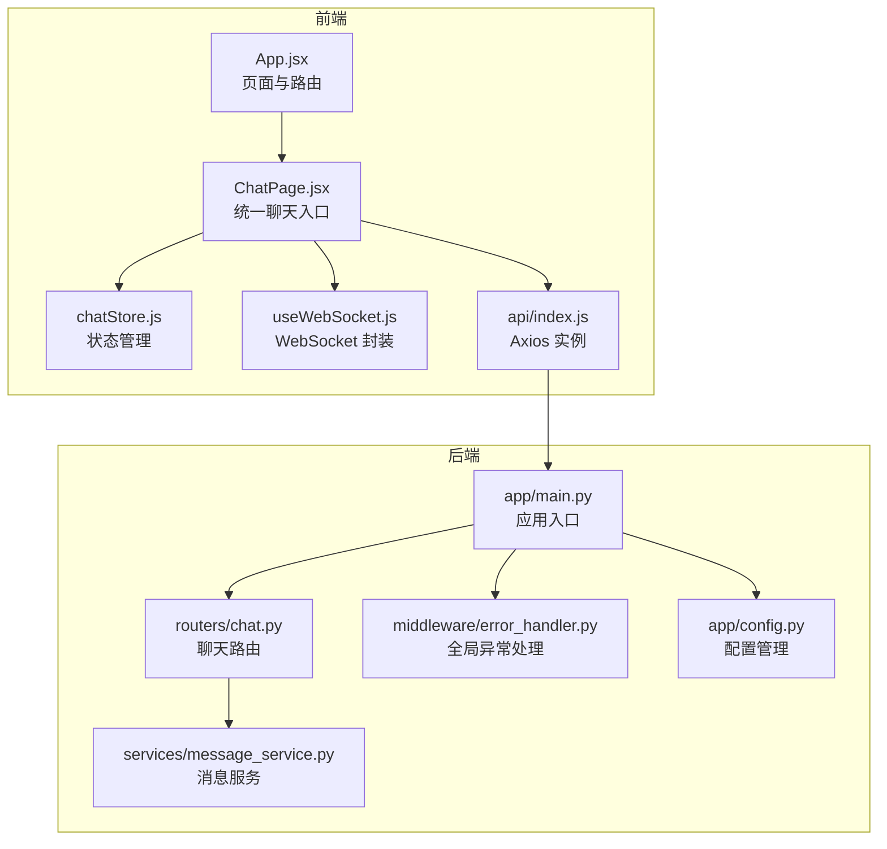
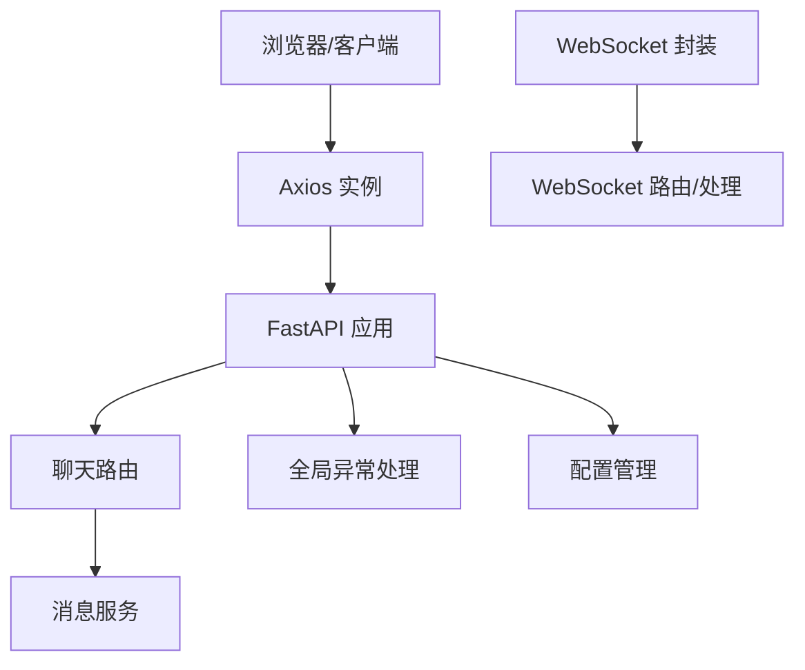
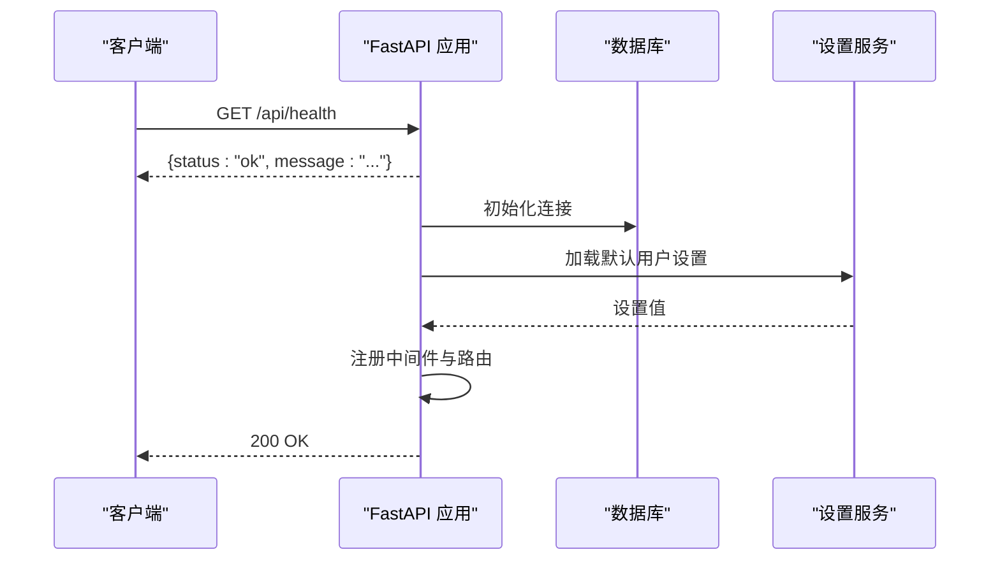
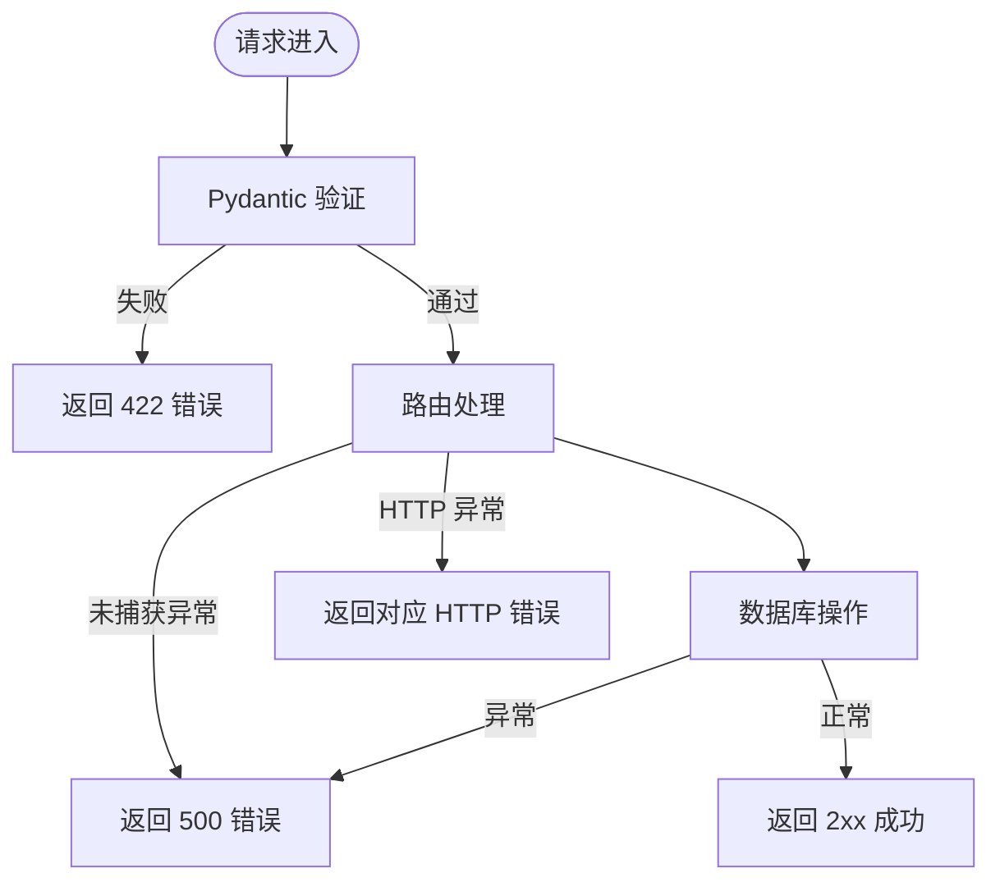
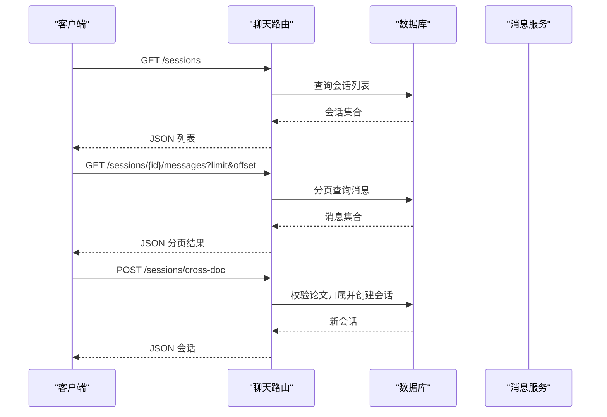
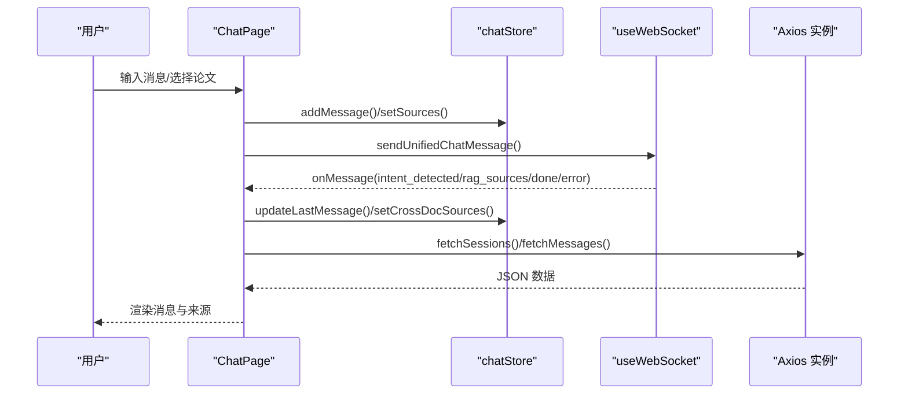
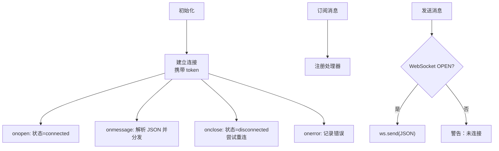
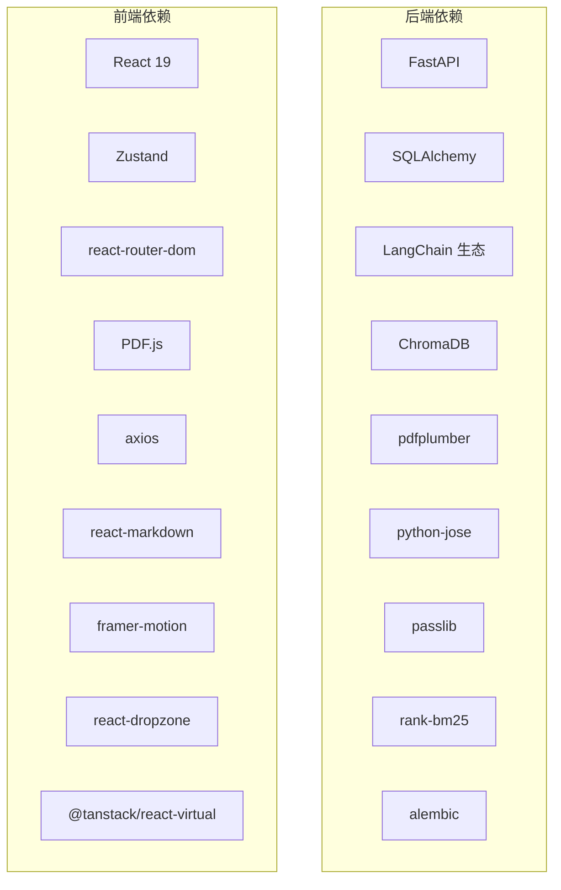

# 代码规范与最佳实践

<cite>
**本文引用的文件**
- [backend/app/main.py](file://backend/app/main.py)
- [backend/app/config.py](file://backend/app/config.py)
- [backend/app/middleware/error_handler.py](file://backend/app/middleware/error_handler.py)
- [backend/app/routers/chat.py](file://backend/app/routers/chat.py)
- [backend/app/services/message_service.py](file://backend/app/services/message_service.py)
- [backend/requirements.txt](file://backend/requirements.txt)
- [frontend/src/App.jsx](file://frontend/src/App.jsx)
- [frontend/src/pages/ChatPage.jsx](file://frontend/src/pages/ChatPage.jsx)
- [frontend/src/components/ChatPanel/ChatPanel.jsx](file://frontend/src/components/ChatPanel/ChatPanel.jsx)
- [frontend/src/stores/chatStore.js](file://frontend/src/stores/chatStore.js)
- [frontend/src/hooks/useWebSocket.js](file://frontend/src/hooks/useWebSocket.js)
- [frontend/src/api/index.js](file://frontend/src/api/index.js)
- [frontend/package.json](file://frontend/package.json)
- [frontend/eslint.config.js](file://frontend/eslint.config.js)
- [README.md](file://README.md)
</cite>

## 目录
1. [简介](#简介)
2. [项目结构](#项目结构)
3. [核心组件](#核心组件)
4. [架构总览](#架构总览)
5. [详细组件分析](#详细组件分析)
6. [依赖分析](#依赖分析)
7. [性能考虑](#性能考虑)
8. [故障排查指南](#故障排查指南)
9. [结论](#结论)
10. [附录](#附录)

## 简介
本文件面向 PaperChat 项目，提供 Python 后端与 JavaScript/React 前端的统一代码规范与最佳实践，涵盖编码风格、架构设计、模块划分、注释与文档、代码审查与质量保障、重构与反模式规避等内容。目标是帮助团队建立一致的开发标准，提升可维护性与协作效率。

## 项目结构
项目采用前后端分离架构：
- 后端：FastAPI + SQLAlchemy（异步）+ LangChain + ChromaDB + pdfplumber
- 前端：React 19 + Vite + Zustand + react-router-dom + PDF.js + axios
- 通信：REST API + WebSocket（统一聊天入口）

**图表来源**
- [backend/app/main.py:55-99](file://backend/app/main.py#L55-L99)
- [backend/app/routers/chat.py:1-417](file://backend/app/routers/chat.py#L1-L417)
- [backend/app/middleware/error_handler.py:73-92](file://backend/app/middleware/error_handler.py#L73-L92)
- [backend/app/services/message_service.py:1-72](file://backend/app/services/message_service.py#L1-L72)
- [backend/app/config.py:15-44](file://backend/app/config.py#L15-L44)
- [frontend/src/App.jsx:1-800](file://frontend/src/App.jsx#L1-L800)
- [frontend/src/pages/ChatPage.jsx:1-434](file://frontend/src/pages/ChatPage.jsx#L1-L434)
- [frontend/src/stores/chatStore.js:1-417](file://frontend/src/stores/chatStore.js#L1-L417)
- [frontend/src/hooks/useWebSocket.js:1-180](file://frontend/src/hooks/useWebSocket.js#L1-L180)
- [frontend/src/api/index.js:1-12](file://frontend/src/api/index.js#L1-L12)

**章节来源**
- [README.md:72-183](file://README.md#L72-L183)
- [backend/app/main.py:1-114](file://backend/app/main.py#L1-L114)
- [frontend/src/App.jsx:1-800](file://frontend/src/App.jsx#L1-L800)

## 核心组件
- 后端应用入口与生命周期：负责初始化数据库、加载默认用户设置、注册中间件与路由、健康检查端点。
- 全局异常处理：统一处理 Pydantic 验证错误、HTTP 异常、SQLAlchemy 错误与通用异常。
- 聊天路由：提供会话创建、查询、更新、删除与消息分页查询等接口。
- 消息服务：封装消息历史加载、全文文本获取、消息保存与文本块查询。
- 前端应用与路由：统一聊天入口、论文选择、会话管理、WebSocket 通信与状态管理。
- WebSocket 封装：全局连接、断线重连、消息订阅与发送、取消控制。
- Axios 实例：统一 baseURL、请求头与拦截器扩展点。

**章节来源**
- [backend/app/main.py:16-53](file://backend/app/main.py#L16-L53)
- [backend/app/middleware/error_handler.py:11-92](file://backend/app/middleware/error_handler.py#L11-L92)
- [backend/app/routers/chat.py:21-417](file://backend/app/routers/chat.py#L21-L417)
- [backend/app/services/message_service.py:14-72](file://backend/app/services/message_service.py#L14-L72)
- [frontend/src/pages/ChatPage.jsx:23-434](file://frontend/src/pages/ChatPage.jsx#L23-L434)
- [frontend/src/stores/chatStore.js:4-417](file://frontend/src/stores/chatStore.js#L4-L417)
- [frontend/src/hooks/useWebSocket.js:19-179](file://frontend/src/hooks/useWebSocket.js#L19-L179)
- [frontend/src/api/index.js:4-12](file://frontend/src/api/index.js#L4-L12)

## 架构总览
后端采用分层架构：入口层（main）、路由层（routers）、服务层（services）、模型层（models）、中间件层（middleware）。前端采用页面层（pages）、组件层（components）、状态层（stores）、钩子层（hooks）、工具层（utils）与 API 层（api）。

**图表来源**
- [backend/app/main.py:55-99](file://backend/app/main.py#L55-L99)
- [backend/app/routers/chat.py:1-417](file://backend/app/routers/chat.py#L1-L417)
- [backend/app/middleware/error_handler.py:73-92](file://backend/app/middleware/error_handler.py#L73-L92)
- [backend/app/services/message_service.py:1-72](file://backend/app/services/message_service.py#L1-L72)
- [frontend/src/api/index.js:1-12](file://frontend/src/api/index.js#L1-L12)
- [frontend/src/hooks/useWebSocket.js:1-180](file://frontend/src/hooks/useWebSocket.js#L1-L180)

## 详细组件分析

### 后端：应用入口与生命周期
- 生命周期管理：启动时初始化数据库、加载默认用户设置并应用，关闭时释放数据库连接。
- CORS 配置：允许指定源、凭证、方法与头部。
- 全局异常处理：集中注册各类异常处理器。
- 路由注册：集中 include 各模块路由。
- 健康检查：提供 /api/health 端点。

**图表来源**
- [backend/app/main.py:16-53](file://backend/app/main.py#L16-L53)
- [backend/app/main.py:79-94](file://backend/app/main.py#L79-L94)
- [backend/app/main.py:102-114](file://backend/app/main.py#L102-L114)

**章节来源**
- [backend/app/main.py:16-53](file://backend/app/main.py#L16-L53)
- [backend/app/main.py:79-94](file://backend/app/main.py#L79-L94)
- [backend/app/main.py:102-114](file://backend/app/main.py#L102-L114)

### 后端：全局异常处理
- 验证错误：Pydantic 验证失败，返回 422 并包含字段级错误明细。
- HTTP 异常：透传状态码与详情。
- 数据库异常：捕获 SQLAlchemyError，返回 500。
- 通用异常：捕获未处理异常，返回 500。

**图表来源**
- [backend/app/middleware/error_handler.py:11-92](file://backend/app/middleware/error_handler.py#L11-L92)

**章节来源**
- [backend/app/middleware/error_handler.py:11-92](file://backend/app/middleware/error_handler.py#L11-L92)

### 后端：聊天路由（会话与消息）
- 会话管理：创建、查询（支持按论文筛选）、详情、更新、删除。
- 消息管理：分页查询消息列表。
- 跨文档会话：校验论文归属，创建跨文档会话。
- 权限与安全：依赖当前用户上下文，确保资源归属。

**图表来源**
- [backend/app/routers/chat.py:21-417](file://backend/app/routers/chat.py#L21-L417)
- [backend/app/services/message_service.py:24-42](file://backend/app/services/message_service.py#L24-L42)

**章节来源**
- [backend/app/routers/chat.py:21-417](file://backend/app/routers/chat.py#L21-L417)
- [backend/app/services/message_service.py:24-42](file://backend/app/services/message_service.py#L24-L42)

### 前端：统一聊天入口（ChatPage）
- 页面职责：论文选择、会话管理、消息展示、输入与发送、联网搜索开关、意图指示与来源展示。
- 虚拟滚动：使用 @tanstack/react-virtual 提升长列表性能。
- WebSocket：统一聊天入口，支持取消、意图识别、跨文档会话。
- 状态管理：Zustand chatStore 管理会话、消息、来源、跨文档模式与联网搜索。

**图表来源**
- [frontend/src/pages/ChatPage.jsx:181-210](file://frontend/src/pages/ChatPage.jsx#L181-L210)
- [frontend/src/stores/chatStore.js:23-417](file://frontend/src/stores/chatStore.js#L23-L417)
- [frontend/src/hooks/useWebSocket.js:100-179](file://frontend/src/hooks/useWebSocket.js#L100-L179)
- [frontend/src/api/index.js:4-12](file://frontend/src/api/index.js#L4-L12)

**章节来源**
- [frontend/src/pages/ChatPage.jsx:23-434](file://frontend/src/pages/ChatPage.jsx#L23-L434)
- [frontend/src/stores/chatStore.js:4-417](file://frontend/src/stores/chatStore.js#L4-L417)
- [frontend/src/hooks/useWebSocket.js:1-180](file://frontend/src/hooks/useWebSocket.js#L1-L180)
- [frontend/src/api/index.js:1-12](file://frontend/src/api/index.js#L1-L12)

### 前端：WebSocket 封装与消息处理
- 全局连接：单例 WebSocket，自动重连（最多 5 次，间隔 3 秒）。
- 消息订阅：支持按类型订阅与通配订阅，支持取消订阅。
- 发送消息：提供通用 sendMessage、RAG、跨文档与统一聊天消息发送。
- 状态监听：使用 useSyncExternalStore 订阅连接状态变化。

**图表来源**
- [frontend/src/hooks/useWebSocket.js:19-71](file://frontend/src/hooks/useWebSocket.js#L19-L71)
- [frontend/src/hooks/useWebSocket.js:164-179](file://frontend/src/hooks/useWebSocket.js#L164-L179)

**章节来源**
- [frontend/src/hooks/useWebSocket.js:1-180](file://frontend/src/hooks/useWebSocket.js#L1-L180)

### 前端：组件与样式模块化
- 组件复用：ChatPanel、MessageItem、PaperSelector 等组件通过 props 与样式模块化实现复用。
- 样式模块：每个组件配套 .module.css，避免全局污染。
- Hook 规范：useWebSocket、useTypewriter、useChatMessages 等钩子职责单一，便于测试与复用。

**章节来源**
- [frontend/src/components/ChatPanel/ChatPanel.jsx:1-611](file://frontend/src/components/ChatPanel/ChatPanel.jsx#L1-L611)
- [frontend/src/App.jsx:1-800](file://frontend/src/App.jsx#L1-L800)

## 依赖分析
- 后端依赖：FastAPI、SQLAlchemy、LangChain 生态、ChromaDB、pdfplumber、pydantic-settings、python-jose、passlib、pdfplumber、rank-bm25、alembic。
- 前端依赖：React 19、Vite、Zustand、react-router-dom、PDF.js、axios、react-markdown、framer-motion、react-dropzone、@tanstack/react-virtual。

**图表来源**
- [backend/requirements.txt:1-19](file://backend/requirements.txt#L1-L19)
- [frontend/package.json:12-35](file://frontend/package.json#L12-L35)

**章节来源**
- [backend/requirements.txt:1-19](file://backend/requirements.txt#L1-L19)
- [frontend/package.json:1-37](file://frontend/package.json#L1-L37)

## 性能考虑
- 前端性能
  - 虚拟滚动：对长消息列表使用 @tanstack/react-virtual，减少 DOM 节点数量。
  - 懒加载：页面组件使用 React.lazy + Suspense，降低首屏体积。
  - 组件优化：ChatPanel 内部使用 memo 与浅比较，减少不必要的重渲染。
  - WebSocket：全局连接与重连策略，避免频繁重建连接。
- 后端性能
  - 异步数据库：SQLAlchemy 异步引擎与 aiosqlite，提升 I/O 并发。
  - 选择性加载：聊天路由使用 selectinload 与分页查询，避免 N+1 与超大数据集。
  - 缓存与预取：前端对分析缓存进行预取与去重解析，减少重复计算。

**章节来源**
- [frontend/src/pages/ChatPage.jsx:162-171](file://frontend/src/pages/ChatPage.jsx#L162-L171)
- [frontend/src/components/ChatPanel/ChatPanel.jsx:12-119](file://frontend/src/components/ChatPanel/ChatPanel.jsx#L12-L119)
- [backend/app/routers/chat.py:32-49](file://backend/app/routers/chat.py#L32-L49)
- [frontend/src/App.jsx:25-31](file://frontend/src/App.jsx#L25-L31)

## 故障排查指南
- WebSocket 连接问题
  - 确认 token 传递与连接 URL；检查断线重连次数与延迟。
  - 使用 onMessage 订阅“error”、“done”、“cancelled”等消息类型定位问题。
- 聊天与会话异常
  - 检查 422 验证错误字段，确认请求参数与 Pydantic 模式匹配。
  - 检查 404/403 资源归属与权限，确认当前用户上下文。
  - 检查 500 数据库错误日志，定位 SQLAlchemy 异常。
- 前端状态异常
  - 使用 chatStore 的错误字段与加载状态，结合控制台日志定位问题。
  - 检查 Axios 实例 baseURL 与网络请求是否可达。

**章节来源**
- [frontend/src/hooks/useWebSocket.js:19-71](file://frontend/src/hooks/useWebSocket.js#L19-L71)
- [frontend/src/stores/chatStore.js:33-40](file://frontend/src/stores/chatStore.js#L33-L40)
- [backend/app/middleware/error_handler.py:11-92](file://backend/app/middleware/error_handler.py#L11-L92)
- [frontend/src/api/index.js:4-12](file://frontend/src/api/index.js#L4-L12)

## 结论
本规范总结了 PaperChat 项目的前后端编码标准与最佳实践，覆盖架构分层、模块划分、异常与日志、状态管理、样式模块化、性能优化与故障排查。建议在后续迭代中持续完善测试与静态分析工具配置，逐步引入单元测试覆盖率与性能基准测试，以进一步提升代码质量与稳定性。

## 附录

### Python 后端编码规范（PEP8 与项目实践）
- 命名约定
  - 模块与包：小写、下划线分隔（如 handlers、services）。
  - 函数与方法：小驼峰或下划线命名，清晰表达意图（如 get_or_create_session_by_paper）。
  - 常量：全大写加下划线（如 CORS_ORIGINS）。
  - 类：帕斯卡命名（如 ChatSession）。
- 类设计原则
  - 单一职责：路由模块仅处理 HTTP 请求映射，业务逻辑下沉至服务层。
  - 依赖倒置：通过依赖注入（Depends/get_db）与工厂函数解耦。
- 异常处理模式
  - 明确异常类型：验证错误、HTTP 异常、数据库异常、通用异常。
  - 统一响应格式：包含 code、message、data 字段，便于前端消费。
- 日志记录规范
  - 开发阶段使用 print 输出错误信息；生产环境建议接入日志框架（如 structlog 或 logging）。
  - 记录关键路径与错误堆栈，便于定位问题。

**章节来源**
- [backend/app/middleware/error_handler.py:11-92](file://backend/app/middleware/error_handler.py#L11-L92)
- [backend/app/config.py:15-44](file://backend/app/config.py#L15-L44)

### JavaScript/React 前端编码规范（ES6+/React）
- 语法规范
  - 使用 ES6+ 语法：const/let、解构、模板字符串、箭头函数、模块导入导出。
  - 避免全局变量，使用模块化组织代码。
- 组件命名约定
  - 组件文件夹采用帕斯卡命名（如 ChatPanel），组件文件与文件夹同名。
  - 样式文件使用 .module.css，组件内通过 import styles 使用。
- Hook 使用规范
  - 自定义 Hook 以 use 开头，职责单一，避免在条件/循环中调用。
  - 在组件中使用 useCallback/useMemo 优化渲染与副作用。
- 状态管理最佳实践
  - Zustand：使用 create 管理全局状态，避免过度拆分 store。
  - 严格区分本地 UI 状态与持久化业务状态。
- 样式模块化规范
  - 每个组件配套样式文件，使用 CSS 变量与层级化命名，避免冲突。
  - 使用 CSS Modules，组件内通过 styles.xxx 引用类名。

**章节来源**
- [frontend/src/components/ChatPanel/ChatPanel.jsx:1-611](file://frontend/src/components/ChatPanel/ChatPanel.jsx#L1-L611)
- [frontend/src/stores/chatStore.js:1-417](file://frontend/src/stores/chatStore.js#L1-L417)
- [frontend/src/hooks/useWebSocket.js:1-180](file://frontend/src/hooks/useWebSocket.js#L1-L180)

### 文件组织结构与模块划分
- 后端模块划分
  - app/main.py：应用入口与生命周期
  - app/routers/*：按领域划分路由（chat、papers、highlights 等）
  - app/services/*：业务服务（llm、rag、pdf、knowledge 等）
  - app/models/*：数据模型
  - app/middleware/*：中间件（异常处理）
  - app/config.py：配置管理
- 前端模块划分
  - src/pages/*：页面级组件
  - src/components/*：可复用 UI 组件
  - src/stores/*：Zustand 状态管理
  - src/hooks/*：自定义 Hook
  - src/utils/*：工具函数
  - src/api/index.js：Axios 实例

**章节来源**
- [README.md:72-183](file://README.md#L72-L183)
- [backend/app/main.py:1-114](file://backend/app/main.py#L1-L114)
- [frontend/src/App.jsx:1-800](file://frontend/src/App.jsx#L1-L800)

### 注释与文档编写规范
- 函数注释
  - 使用文档字符串描述用途、参数、返回值与异常。
  - 对复杂逻辑提供简要说明，必要时给出调用示例路径。
- 类注释
  - 描述类职责、关键属性与方法用途。
- API 文档模板
  - 参考项目 README 的 API 端点表格，统一列出方法、路径、参数与返回。
- README 编写标准
  - 保持技术栈、项目结构、快速开始、WebSocket 协议与 API 端点的准确性与时效性。

**章节来源**
- [backend/app/routers/chat.py:1-417](file://backend/app/routers/chat.py#L1-L417)
- [README.md:295-390](file://README.md#L295-L390)

### 代码审查检查清单与质量保证
- 代码审查检查清单
  - 命名一致性与可读性
  - 异常处理完整性（422/404/500）
  - SQL 查询性能（分页、selectinload、索引）
  - 前端渲染性能（memo、虚拟滚动、懒加载）
  - WebSocket 连接与消息订阅正确性
  - Axios baseURL 与错误处理
- 质量保证措施
  - ESLint 配置：已启用推荐规则与 React Hooks 规则。
  - 静态分析：建议增加 TypeScript 类型检查与 ESLint 规则强化。
  - 单元测试：建议为关键服务与工具函数补充测试，目标覆盖率逐步提升。
  - 性能基准：对长消息列表与大论文加载场景进行基准测试，持续优化。

**章节来源**
- [frontend/eslint.config.js:1-30](file://frontend/eslint.config.js#L1-L30)
- [frontend/package.json:25-35](file://frontend/package.json#L25-L35)

### 重构指导原则与反模式避免
- 重构指导原则
  - 保持接口稳定，逐步替换内部实现。
  - 优先优化热点路径（消息流、长列表、WebSocket）。
  - 通过中间件与服务层隔离第三方依赖（LangChain、ChromaDB）。
- 反模式避免
  - 避免在组件中直接发起网络请求，统一通过 api/index.js。
  - 避免在 store 中存放 UI 状态（如展开/折叠），使用本地状态或 props。
  - 避免在路由层做过多业务逻辑，保持路由薄层。
  - 避免全局共享状态污染，使用作用域明确的 store。

**章节来源**
- [frontend/src/api/index.js:1-12](file://frontend/src/api/index.js#L1-L12)
- [frontend/src/stores/chatStore.js:1-417](file://frontend/src/stores/chatStore.js#L1-L417)
- [backend/app/routers/chat.py:1-417](file://backend/app/routers/chat.py#L1-L417)