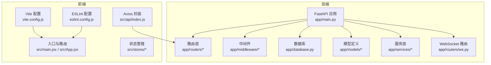
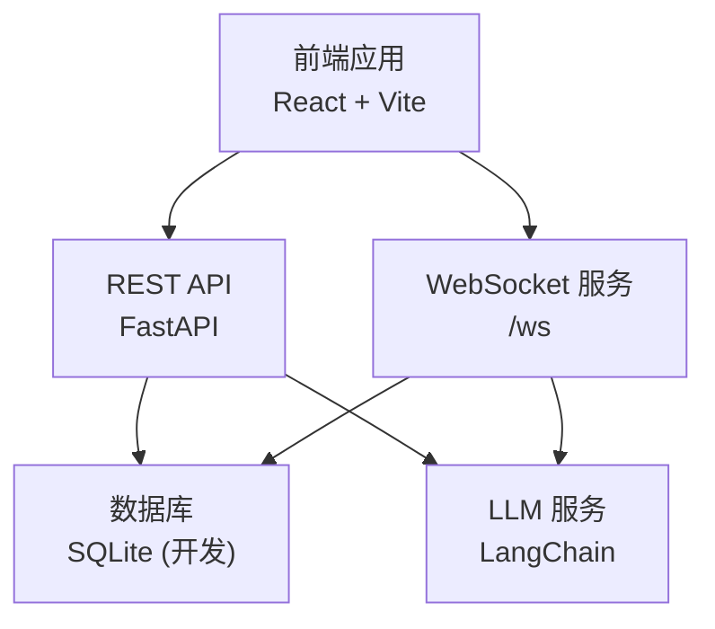
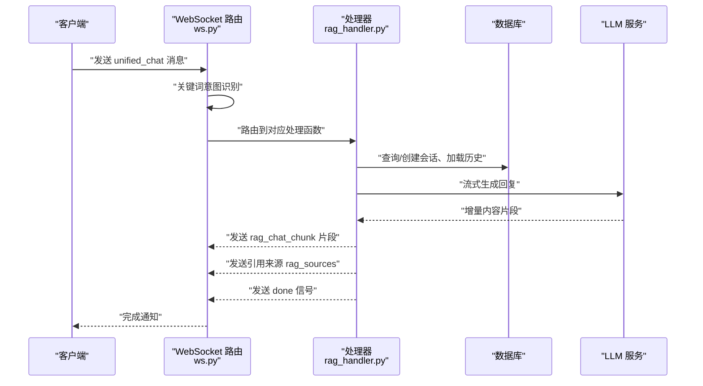
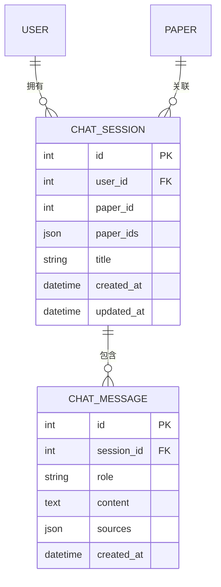
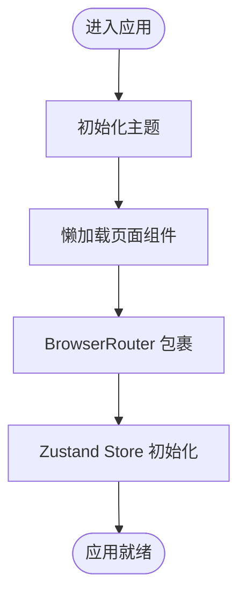
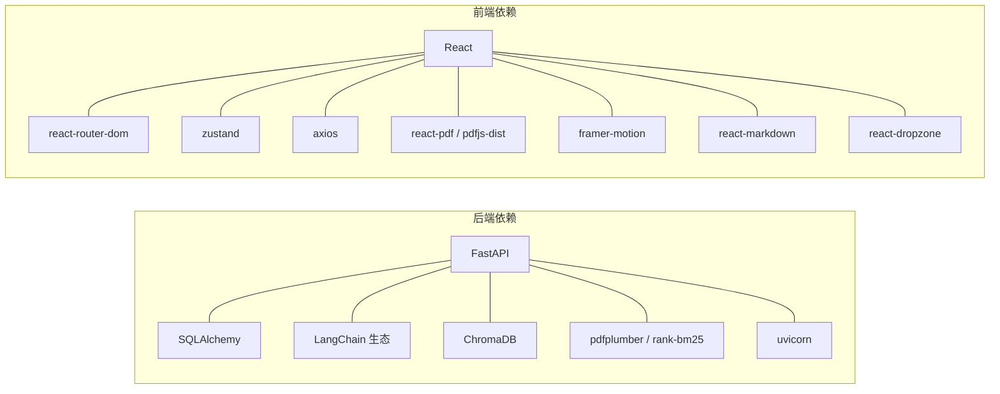

# 开发指南

<cite>
**本文档引用的文件**
- [README.md](file://README.md)
- [backend/requirements.txt](file://backend/requirements.txt)
- [frontend/package.json](file://frontend/package.json)
- [backend/app/main.py](file://backend/app/main.py)
- [backend/run.py](file://backend/run.py)
- [backend/app/config.py](file://backend/app/config.py)
- [backend/app/routers/ws.py](file://backend/app/routers/ws.py)
- [backend/app/middleware/error_handler.py](file://backend/app/middleware/error_handler.py)
- [backend/app/database.py](file://backend/app/database.py)
- [backend/app/models/chat.py](file://backend/app/models/chat.py)
- [frontend/vite.config.js](file://frontend/vite.config.js)
- [frontend/eslint.config.js](file://frontend/eslint.config.js)
- [frontend/src/api/index.js](file://frontend/src/api/index.js)
- [frontend/src/main.jsx](file://frontend/src/main.jsx)
- [frontend/src/App.jsx](file://frontend/src/App.jsx)
- [frontend/src/stores/chatStore.js](file://frontend/src/stores/chatStore.js)
- [backend/app/services/llm_service.py](file://backend/app/services/llm_service.py)
- [backend/app/handlers/rag_handler.py](file://backend/app/handlers/rag_handler.py)
</cite>

## 目录
1. [简介](#简介)
2. [项目结构](#项目结构)
3. [核心组件](#核心组件)
4. [架构总览](#架构总览)
5. [详细组件分析](#详细组件分析)
6. [依赖关系分析](#依赖关系分析)
7. [性能考量](#性能考量)
8. [故障排除指南](#故障排除指南)
9. [结论](#结论)
10. [附录](#附录)

## 简介
本指南面向 PaperChat 项目的开发者，提供从环境搭建、代码规范、开发流程、测试策略、性能优化到贡献指南的完整说明。PaperChat 是一个基于云端大模型的学术论文智能阅读与问答系统，采用前后端分离架构：后端使用 FastAPI + SQLAlchemy + LangChain，前端使用 React + Vite + Zustand，支持 WebSocket 实时通信与 RAG 检索增强问答。

## 项目结构
项目采用“backend + frontend”双仓库结构，后端提供 REST API 与 WebSocket，前端提供 React 单页应用。关键目录与职责如下：
- backend/app：后端核心应用，包含路由、中间件、模型、服务与数据库初始化
- backend/services：顶层服务封装
- frontend/src：前端源码，按 pages/components/stores/hooks/utils 组织
- 根目录 README.md：项目说明、技术栈、快速开始与功能说明

图表来源
- [backend/app/main.py:55-95](file://backend/app/main.py#L55-L95)
- [backend/app/routers/ws.py:76-102](file://backend/app/routers/ws.py#L76-L102)
- [frontend/vite.config.js:1-54](file://frontend/vite.config.js#L1-L54)
- [frontend/src/main.jsx:1-14](file://frontend/src/main.jsx#L1-L14)
- [frontend/src/App.jsx:1-120](file://frontend/src/App.jsx#L1-L120)

章节来源
- [README.md:72-183](file://README.md#L72-L183)
- [backend/app/main.py:55-95](file://backend/app/main.py#L55-L95)
- [frontend/vite.config.js:1-54](file://frontend/vite.config.js#L1-L54)

## 核心组件
- 应用入口与生命周期：后端通过 lifespan 管理数据库初始化与默认用户设置；前端通过 BrowserRouter 包裹应用并懒加载页面。
- WebSocket 通信：统一聊天入口支持意图识别与自动路由，消息类型覆盖分析、问答、跨文档问答与 Agent 模式。
- 数据库与模型：异步 SQLAlchemy 引擎与会话工厂，会话与消息模型支持单/多论文场景。
- 状态管理：Zustand store 管理会话、消息、跨文档模式与联网搜索状态。
- API 代理与校验：Vite 代理到后端 API/WS，ESLint 提供 JS/JSX 规范校验。

章节来源
- [backend/app/main.py:16-53](file://backend/app/main.py#L16-L53)
- [backend/app/routers/ws.py:262-417](file://backend/app/routers/ws.py#L262-L417)
- [backend/app/database.py:50-81](file://backend/app/database.py#L50-L81)
- [backend/app/models/chat.py:14-51](file://backend/app/models/chat.py#L14-L51)
- [frontend/src/stores/chatStore.js:4-417](file://frontend/src/stores/chatStore.js#L4-L417)
- [frontend/vite.config.js:7-17](file://frontend/vite.config.js#L7-L17)
- [frontend/eslint.config.js:1-30](file://frontend/eslint.config.js#L1-L30)

## 架构总览
PaperChat 采用前后端分离架构，前端通过 Axios 与后端 REST API 通信，同时通过 WebSocket 实现实时消息流。后端使用 FastAPI 提供 REST 与 WebSocket，数据库为 SQLite（开发环境），LangChain 用于 LLM 编排与 RAG。

图表来源
- [backend/app/main.py:62-95](file://backend/app/main.py#L62-L95)
- [backend/app/routers/ws.py:76-102](file://backend/app/routers/ws.py#L76-L102)
- [backend/app/database.py:13-27](file://backend/app/database.py#L13-L27)
- [backend/app/services/llm_service.py:1-6](file://backend/app/services/llm_service.py#L1-L6)

## 详细组件分析

### WebSocket 统一聊天流程
统一聊天入口根据用户输入关键词进行意图识别，并自动路由到相应处理函数（章节概述、深度分析、跨文档问答或 RAG 问答）。流程包含消息校验、任务取消、流式响应与引用来源推送。

图表来源
- [backend/app/routers/ws.py:262-417](file://backend/app/routers/ws.py#L262-L417)
- [backend/app/handlers/rag_handler.py:29-217](file://backend/app/handlers/rag_handler.py#L29-L217)

章节来源
- [backend/app/routers/ws.py:262-417](file://backend/app/routers/ws.py#L262-L417)
- [backend/app/handlers/rag_handler.py:29-217](file://backend/app/handlers/rag_handler.py#L29-L217)

### 会话与消息模型
会话模型支持单论文与跨文档两种场景，消息模型包含来源引用，便于溯源与反馈。

图表来源
- [backend/app/models/chat.py:14-71](file://backend/app/models/chat.py#L14-L71)

章节来源
- [backend/app/models/chat.py:14-71](file://backend/app/models/chat.py#L14-L71)

### 前端状态管理与路由
前端使用 Zustand 管理会话、消息、跨文档模式与联网搜索状态；路由采用 React Router DOM，页面组件懒加载以优化首屏性能。

图表来源
- [frontend/src/main.jsx:1-14](file://frontend/src/main.jsx#L1-L14)
- [frontend/src/App.jsx:22-58](file://frontend/src/App.jsx#L22-L58)
- [frontend/src/stores/chatStore.js:4-417](file://frontend/src/stores/chatStore.js#L4-L417)

章节来源
- [frontend/src/main.jsx:1-14](file://frontend/src/main.jsx#L1-L14)
- [frontend/src/App.jsx:22-58](file://frontend/src/App.jsx#L22-L58)
- [frontend/src/stores/chatStore.js:4-417](file://frontend/src/stores/chatStore.js#L4-L417)

## 依赖关系分析
- 后端依赖：FastAPI、SQLAlchemy、LangChain 生态、ChromaDB、pdfplumber、rank-bm25、uvicorn 等。
- 前端依赖：React、react-router-dom、zustand、axios、react-pdf/pdfjs-dist、framer-motion、react-markdown、react-dropzone 等。
- 构建与开发：Vite、ESLint、globals、@vitejs/plugin-react 等。

图表来源
- [backend/requirements.txt:1-19](file://backend/requirements.txt#L1-L19)
- [frontend/package.json:12-34](file://frontend/package.json#L12-L34)

章节来源
- [backend/requirements.txt:1-19](file://backend/requirements.txt#L1-L19)
- [frontend/package.json:12-34](file://frontend/package.json#L12-L34)

## 性能考量
- 前端构建优化：Vite 通过 manualChunks 将大型依赖拆分为 vendor-* 片段，减少包体积并提升缓存命中率；chunkSizeWarningLimit 提升为 500KB 以适应 PDF/Markdown 等大依赖。
- WebSocket 并发控制：后端 ConnectionState 维护 running_tasks，同一通道的任务会被取消或替换，避免资源浪费。
- 数据库事务：异步会话工厂与依赖注入确保事务正确提交/回滚，降低锁竞争风险。
- LLM 流式输出：RAG 处理器采用 astream 逐步推送增量内容，改善用户体验并降低首帧延迟。

章节来源
- [frontend/vite.config.js:20-52](file://frontend/vite.config.js#L20-L52)
- [backend/app/routers/ws.py:56-74](file://backend/app/routers/ws.py#L56-L74)
- [backend/app/database.py:30-47](file://backend/app/database.py#L30-L47)
- [backend/app/handlers/rag_handler.py:179-187](file://backend/app/handlers/rag_handler.py#L179-L187)

## 故障排除指南
- 启动后端报错（HuggingFace 镜像/缓存）：确保在导入相关库前设置 HF_ENDPOINT 与 HF_HOME；检查 .cache 目录权限。
- WebSocket 未连接：确认前端代理配置（/api 与 /ws）指向后端 8000 端口；检查后端 CORS 配置与 JWT 令牌有效性。
- 数据库连接失败：确认 DATABASE_URL 与 SQLite 文件权限；在 lifespan 中查看初始化日志。
- ESLint 报错：遵循 eslint.config.js 规则，注意 no-unused-vars 的 varsIgnorePattern 配置。
- RAG 无结果：检查论文文本块是否存在与索引是否建立；必要时重建索引后重试。

章节来源
- [backend/run.py:13-19](file://backend/run.py#L13-L19)
- [backend/app/config.py:15-40](file://backend/app/config.py#L15-L40)
- [frontend/vite.config.js:7-17](file://frontend/vite.config.js#L7-L17)
- [backend/app/middleware/error_handler.py:11-70](file://backend/app/middleware/error_handler.py#L11-L70)
- [frontend/eslint.config.js:25-27](file://frontend/eslint.config.js#L25-L27)
- [backend/app/handlers/rag_handler.py:48-90](file://backend/app/handlers/rag_handler.py#L48-L90)

## 结论
本指南提供了 PaperChat 项目的开发环境、代码规范、开发流程、测试策略、性能优化与故障排除的系统性说明。建议团队在开发中严格遵循配置与规范，利用现有 WebSocket 与 RAG 能力，持续优化前端构建与后端并发处理，保障系统的稳定性与可维护性。

## 附录

### 开发环境搭建
- 后端
  - Python 3.10+
  - 安装依赖：pip install -r backend/requirements.txt
  - 复制并编辑 .env（DEEPSEEK_API_KEY、JWT_SECRET_KEY 等）
  - 启动方式：python backend/run.py 或 uvicorn app.main:app --host 0.0.0.0 --port 8000 --reload
- 前端
  - Node.js 18+
  - 安装依赖：npm install
  - 启动开发服务器：npm run dev
  - 访问 http://localhost:5173

章节来源
- [README.md:187-238](file://README.md#L187-L238)
- [backend/requirements.txt:1-19](file://backend/requirements.txt#L1-L19)
- [frontend/package.json:6-11](file://frontend/package.json#L6-L11)
- [backend/run.py:23-30](file://backend/run.py#L23-L30)

### 代码规范与最佳实践
- Python
  - 使用 Pydantic Settings 管理配置，避免硬编码敏感信息
  - 异步编程：使用 SQLAlchemy 异步引擎与 async/await，确保数据库事务正确处理
  - 错误处理：统一异常处理器，返回标准化错误响应
- JavaScript/TypeScript
  - ESLint 规则：推荐使用 @eslint/js 与 globals，禁用未使用变量规则按需配置
  - 组件组织：按 pages/components/stores/hooks/utils 分层，保持单一职责
  - 状态管理：Zustand store 仅存放 UI 状态与轻量业务逻辑，避免过度耦合

章节来源
- [backend/app/config.py:15-40](file://backend/app/config.py#L15-L40)
- [backend/app/middleware/error_handler.py:73-92](file://backend/app/middleware/error_handler.py#L73-L92)
- [frontend/eslint.config.js:1-30](file://frontend/eslint.config.js#L1-L30)
- [frontend/src/stores/chatStore.js:4-417](file://frontend/src/stores/chatStore.js#L4-L417)

### 开发流程与代码审查
- 分支管理：采用 feature/*、develop、main 分支策略，hotfix/* 用于紧急修复
- 提交规范：使用清晰的提交信息，关联 Issue 编号
- 代码审查：PR 至 develop，至少一名 reviewer 通过后合并
- 持续集成：建议在 CI 中执行 lint、单元测试与构建检查（可在现有脚本基础上扩展）

[本节为通用流程建议，不直接分析具体文件，故无章节来源]

### 测试策略与质量保证
- 单元测试：针对服务层（如 llm_service、search_service）编写异步测试，模拟外部依赖
- 集成测试：使用 FastAPI TestClient 测试路由与中间件行为，覆盖 WebSocket 路由的关键分支
- 端到端测试：使用 Playwright/Cypress 等工具，覆盖登录、上传、阅读、聊天、会话管理等关键流程
- 质量门禁：ESLint、构建产物大小告警（Vite 配置）、覆盖率门槛（建议引入）

[本节为通用策略建议，不直接分析具体文件，故无章节来源]

### 性能优化与调试技巧
- 前端
  - 使用 Vite manualChunks 拆分大依赖，结合 CDN 与缓存策略
  - 图片与 PDF 渲染：按需加载、分页渲染、缩略图预览
- 后端
  - 异步 I/O：避免阻塞操作，合理使用 asyncio.create_task 与取消机制
  - 数据库：索引优化、批量写入、连接池配置
  - LLM：流式输出、上下文截断、提示词模板复用
- 调试
  - WebSocket：使用浏览器开发者工具 Network 面板观察 /ws 握手与消息流
  - 日志：DEBUG 模式下开启 SQL 输出，结合后端异常处理器定位问题

章节来源
- [frontend/vite.config.js:20-52](file://frontend/vite.config.js#L20-L52)
- [backend/app/routers/ws.py:56-74](file://backend/app/routers/ws.py#L56-L74)
- [backend/app/database.py:13-27](file://backend/app/database.py#L13-L27)
- [backend/app/middleware/error_handler.py:43-70](file://backend/app/middleware/error_handler.py#L43-L70)

### 贡献指南
- 提交 Issue：描述问题现象、期望结果、复现步骤与环境信息
- 提交 PR：关联 Issue，提供测试用例与变更说明，遵守代码规范
- 文档更新：涉及用户可见的功能变更需同步更新 README 与 API 说明

[本节为通用流程建议，不直接分析具体文件，故无章节来源]