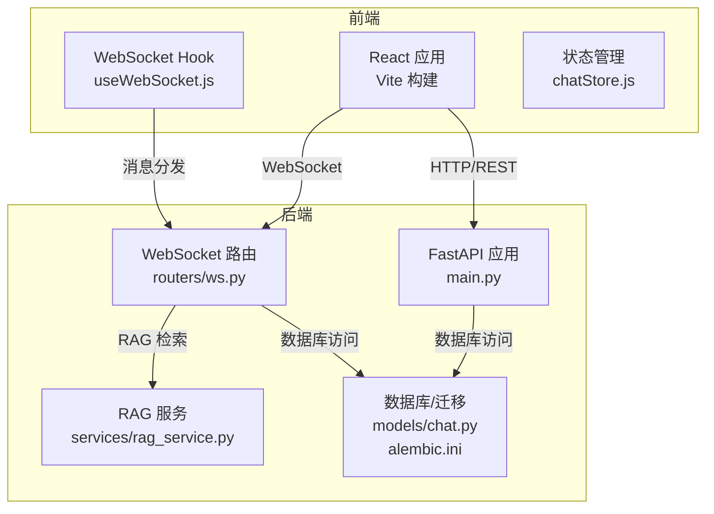
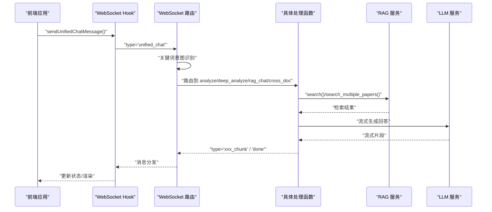
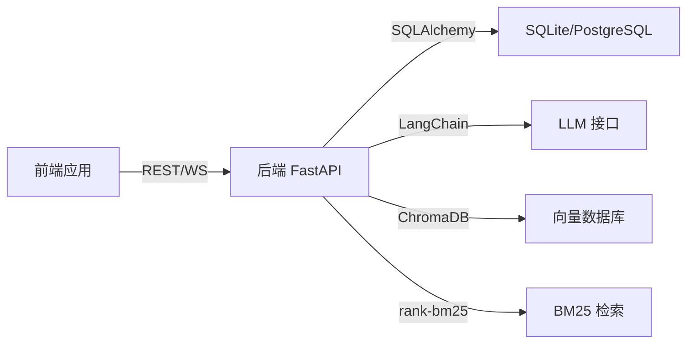

# 开发流程与协作

<cite>
**本文引用的文件**   
- [README.md](file://README.md)
- [开发计划.md](file://开发计划.md)
- [优化计划.md](file://优化计划.md)
- [backend/main.py](file://backend/main.py)
- [backend/app/routers/ws.py](file://backend/app/routers/ws.py)
- [backend/app/services/rag_service.py](file://backend/app/services/rag_service.py)
- [backend/app/models/chat.py](file://backend/app/models/chat.py)
- [backend/requirements.txt](file://backend/requirements.txt)
- [backend/run.py](file://backend/run.py)
- [backend/alembic.ini](file://backend/alembic.ini)
- [frontend/package.json](file://frontend/package.json)
- [frontend/vite.config.js](file://frontend/vite.config.js)
- [frontend/src/stores/chatStore.js](file://frontend/src/stores/chatStore.js)
- [frontend/src/hooks/useWebSocket.js](file://frontend/src/hooks/useWebSocket.js)
</cite>

## 目录
1. [简介](#简介)
2. [项目结构](#项目结构)
3. [核心组件](#核心组件)
4. [架构总览](#架构总览)
5. [详细组件分析](#详细组件分析)
6. [依赖分析](#依赖分析)
7. [性能考虑](#性能考虑)
8. [故障排除指南](#故障排除指南)
9. [结论](#结论)
10. [附录](#附录)

## 简介
本指南面向 PaperChat 项目团队，提供一套完整的开发流程与协作规范，覆盖分支管理、代码审查、CI/CD、任务分配与进度跟踪、团队协作工具、冲突解决与决策流程、发布与版本控制等。文档以现有仓库结构与实现为基础，结合项目当前的开发阶段与未来规划，给出可落地的实践建议。

## 项目结构
PaperChat 采用前后端分离架构：
- 后端：FastAPI + SQLAlchemy 异步 ORM，提供 REST API 与 WebSocket 服务；集成 LangChain、ChromaDB、sentence-transformers 等用于 RAG 与向量化检索。
- 前端：React 19 + Vite，使用 Zustand 管理状态，react-router-dom 路由，react-markdown 渲染，PDF.js/react-pdf 渲染 PDF。
- 数据与迁移：SQLite（开发/测试）+ Alembic（迁移）；生产可平滑迁移到 PostgreSQL。
- 开发与部署：Vite 代理到后端；后端通过 uvicorn 启动；建议引入 Docker 与 GitHub Actions 实现 CI/CD。

图表来源
- [backend/main.py:18-31](file://backend/main.py#L18-L31)
- [backend/app/routers/ws.py:76-102](file://backend/app/routers/ws.py#L76-L102)
- [backend/app/services/rag_service.py:16-51](file://backend/app/services/rag_service.py#L16-L51)
- [backend/app/models/chat.py:14-39](file://backend/app/models/chat.py#L14-L39)
- [frontend/src/hooks/useWebSocket.js:1-180](file://frontend/src/hooks/useWebSocket.js#L1-L180)
- [frontend/src/stores/chatStore.js:1-417](file://frontend/src/stores/chatStore.js#L1-L417)

章节来源
- [README.md:72-183](file://README.md#L72-L183)
- [backend/main.py:18-31](file://backend/main.py#L18-L31)
- [frontend/vite.config.js:1-54](file://frontend/vite.config.js#L1-L54)

## 核心组件
- WebSocket 通信：统一消息类型与流式输出，支持分析、问答、RAG、跨文档、Agent、统一入口等。
- RAG 检索：ChromaDB + BM25 混合检索，RRF 融合排序，支持跨文档检索与缓存优化。
- 会话与消息：数据库持久化，支持单/多论文会话、消息分页、引用来源。
- 前端状态与连接：Zustand 管理会话/消息/跨文档/联网搜索状态；统一 WebSocket Hook 管理连接与消息订阅。

章节来源
- [backend/app/routers/ws.py:120-417](file://backend/app/routers/ws.py#L120-L417)
- [backend/app/services/rag_service.py:233-335](file://backend/app/services/rag_service.py#L233-L335)
- [backend/app/models/chat.py:14-71](file://backend/app/models/chat.py#L14-L71)
- [frontend/src/stores/chatStore.js:1-417](file://frontend/src/stores/chatStore.js#L1-L417)
- [frontend/src/hooks/useWebSocket.js:1-180](file://frontend/src/hooks/useWebSocket.js#L1-L180)

## 架构总览
PaperChat 的核心交互流程如下：前端通过 WebSocket 发送统一聊天消息，后端根据关键词进行意图识别并路由到相应处理函数，RAG 服务执行检索与融合排序，LLM 生成流式回答并通过 WebSocket 返回，前端状态管理与渲染。

图表来源
- [backend/app/routers/ws.py:262-417](file://backend/app/routers/ws.py#L262-L417)
- [backend/app/services/rag_service.py:233-335](file://backend/app/services/rag_service.py#L233-L335)
- [frontend/src/hooks/useWebSocket.js:140-154](file://frontend/src/hooks/useWebSocket.js#L140-L154)
- [frontend/src/stores/chatStore.js:395-413](file://frontend/src/stores/chatStore.js#L395-L413)

## 详细组件分析

### 分支管理策略
- 主分支保护
  - 仅允许通过合并请求（MR）合并，禁止直接推送至主分支。
  - MR 需满足：通过 CI、至少一名代码审查者批准、无冲突、通过所有检查。
- 功能分支命名规范
  - feat/功能模块/简述
  - fix/问题定位/简述
  - docs/文档/简述
  - refactor/重构/简述
  - perf/性能/简述
  - test/测试/简述
  - chore/日常事务/简述
- 合并请求流程
  - MR 必须关联 Issue 或开发计划条目，填写 PR 模板。
  - 自动化检查：静态检查、单元测试、前端 Lint、构建产物校验。
  - 代码审查清单：功能正确性、性能影响、安全性、可维护性、测试覆盖。
- 版本标签管理
  - 采用语义化版本（SemVer），由 CI 在发布时自动打标签并生成发布说明草稿，人工审核后发布。

章节来源
- [开发计划.md:307-336](file://开发计划.md#L307-L336)

### 代码审查流程规范
- PR 模板
  - 概述、变更内容、影响范围、测试方案、风险与回滚预案、相关 Issue/PR 链接。
- 审查清单
  - 代码正确性、边界条件、异常处理、性能与资源释放、安全与鉴权、日志与可观测性、兼容性与迁移。
- 反馈处理
  - 明确回复与修订计划，必要时拆分 PR。
- 合并标准
  - 通过自动化检查与人工审查，确保无阻塞性问题，具备最小测试覆盖。

章节来源
- [优化计划.md:664-703](file://优化计划.md#L664-L703)

### 持续集成与持续部署
- 自动化测试
  - 后端：pytest（建议引入 pytest-asyncio、mock LLM）、覆盖率报告。
  - 前端：ESLint、构建产物校验、可选 Vitest/Jest 单测。
- 代码质量检查
  - ESLint、Python Lint（如 ruff/black/isort）、安全扫描（secrets、依赖漏洞）。
- 部署流水线
  - 建议使用 GitHub Actions：拉取 → 安装依赖 → 测试 → 构建 → 打包 → 部署（Docker/容器编排）。
  - 建议引入 Dockerfile 与 docker-compose，一键启动前后端与数据库。

章节来源
- [frontend/package.json:6-11](file://frontend/package.json#L6-L11)
- [backend/requirements.txt:1-19](file://backend/requirements.txt#L1-L19)
- [优化计划.md:664-703](file://优化计划.md#L664-L703)

### 开发任务分配与进度跟踪
- 任务分解
  - 将“核心体验补全”“智能化升级”“体验打磨”“平台化”四大阶段细化为可执行的开发计划条目，明确优先级与依赖。
- 优先级排序
  - P0：必须立即修复（如 ws.py 拆分、数据库迁移、PDF 渲染优化等）。
  - P1：尽快修复（如 LLM 提示词与逻辑分离、会话/消息服务抽取、WebSocket 认证）。
  - P2：计划修复（如 RAG/LLM 解耦、前端 Store 拆分、索引重建异步化）。
  - P3/P4：后续优化与未来能力建设。
- 里程碑规划
  - 每阶段末尾设定里程碑，产出可演示的功能与文档，便于评审与迭代。

章节来源
- [开发计划.md:7-26](file://开发计划.md#L7-L26)
- [开发计划.md:339-353](file://开发计划.md#L339-L353)
- [优化计划.md:14-84](file://优化计划.md#L14-L84)
- [优化计划.md:146-294](file://优化计划.md#L146-L294)
- [优化计划.md:296-430](file://优化计划.md#L296-L430)

### 团队协作工具使用规范
- Issue 模板
  - 功能需求、缺陷报告、性能问题、安全问题、技术债务、重构提案。
- 讨论规范
  - 重要决策需在 Issue 或评审会议中记录，形成可追溯的决策依据。
- 文档维护流程
  - 变更即更新，README、开发计划、优化计划与设计文档保持一致，发布时同步更新。

章节来源
- [README.md:391-772](file://README.md#L391-L772)
- [开发计划.md:1-354](file://开发计划.md#L1-L354)
- [优化计划.md:1-1068](file://优化计划.md#L1-L1068)

### 冲突解决机制与决策流程
- 技术方案评审
  - 复杂改动需形成设计文档或评审记录，明确动机、方案、权衡与风险。
- 变更管理流程
  - 重大变更需通过评审与试点，逐步推广；涉及数据库结构变更需使用 Alembic 迁移。
- 决策流程
  - 一般问题由负责人拍板；跨模块影响需技术负责人/架构师参与。

章节来源
- [优化计划.md:39-68](file://优化计划.md#L39-L68)
- [backend/alembic.ini:1-150](file://backend/alembic.ini#L1-L150)

### 发布管理与版本控制
- 语义化版本控制
  - 主版本：破坏性变更；次版本：新增功能且兼容；修订版本：修复与兼容性更新。
- 发布说明编写
  - 自动生成草稿，包含变更摘要、已知问题、升级指引、兼容性说明。
- 版本标签与发布
  - CI 自动打标签并推送发布，确保可追溯与可回滚。

章节来源
- [backend/main.py:18](file://backend/main.py#L18)
- [开发计划.md:469-772](file://开发计划.md#L469-L772)

## 依赖分析
- 后端依赖
  - FastAPI、SQLAlchemy、LangChain、ChromaDB、sentence-transformers、rank-bm25、pdfplumber、Alembic。
- 前端依赖
  - React、Zustand、react-router-dom、react-markdown、react-pdf/pdfjs-dist、@tanstack/react-virtual、Axios。
- 关键依赖关系
  - WebSocket 依赖 JWT 认证；RAG 服务依赖 ChromaDB 与向量模型；前端状态依赖 WebSocket 与 API。

图表来源
- [backend/requirements.txt:1-19](file://backend/requirements.txt#L1-L19)
- [frontend/package.json:12-35](file://frontend/package.json#L12-L35)

章节来源
- [backend/requirements.txt:1-19](file://backend/requirements.txt#L1-L19)
- [frontend/package.json:12-35](file://frontend/package.json#L12-L35)

## 性能考虑
- WebSocket 与消息流
  - 优化打字机效果更新频率与累积策略，减少频繁 setState 与全量重渲染。
  - 前端消息列表使用虚拟化，降低长对话渲染开销。
- RAG 检索
  - BM25 索引缓存、跨文档检索并行化、索引状态检查与异步重建。
- 前端渲染
  - PDF 渲染懒加载、Markdown 组件 memo 化、请求缓存与分页。
- 后端性能
  - 线程池并发优化、数据库连接池参数调优、日志结构化与关键路径耗时埋点。

章节来源
- [优化计划.md:233-274](file://优化计划.md#L233-L274)
- [优化计划.md:121-143](file://优化计划.md#L121-L143)
- [优化计划.md:247-264](file://优化计划.md#L247-L264)
- [优化计划.md:403-429](file://优化计划.md#L403-L429)
- [优化计划.md:516-527](file://优化计划.md#L516-L527)
- [优化计划.md:777-800](file://优化计划.md#L777-L800)

## 故障排除指南
- WebSocket 连接问题
  - 检查前端 token 注入与后端 JWT 校验；确认代理配置与 CORS；观察重连机制与最大重试次数。
- RAG 检索异常
  - 索引是否存在、集合名称是否正确、向量模型是否加载成功；查看 BM25 缓存失效与重建逻辑。
- 数据库与迁移
  - 使用 Alembic 管理迁移，避免直接 ALTER TABLE；生产环境注意备份与回滚策略。
- 前端状态与渲染
  - 检查 Zustand 状态更新路径、消息列表虚拟化、Markdown 渲染性能。

章节来源
- [frontend/src/hooks/useWebSocket.js:19-71](file://frontend/src/hooks/useWebSocket.js#L19-L71)
- [backend/app/routers/ws.py:32-53](file://backend/app/routers/ws.py#L32-L53)
- [backend/app/services/rag_service.py:183-232](file://backend/app/services/rag_service.py#L183-L232)
- [backend/alembic.ini:1-150](file://backend/alembic.ini#L1-L150)
- [frontend/src/stores/chatStore.js:202-233](file://frontend/src/stores/chatStore.js#L202-L233)

## 结论
本指南基于 PaperChat 当前实现与未来规划，提供了可操作的开发流程与协作规范。建议团队尽快落地 CI/CD、测试与文档流程，持续优化 WebSocket 与 RAG 性能，并在下一阶段推进多 Agent 研究助手与 Tauri 桌面端。通过严格的分支与审查流程、版本与发布管理，确保项目高质量演进。

## 附录
- 快速开始与端口说明
  - 前端：5173；后端：8000；WebSocket：/ws。
- 后端启动
  - 使用 run.py 或 uvicorn 直接启动；设置 HF 缓存目录以加速模型下载。
- 前端代理
  - Vite 代理 /api 到后端，/ws 到 WebSocket。

章节来源
- [README.md:384-389](file://README.md#L384-L389)
- [backend/run.py:23-30](file://backend/run.py#L23-L30)
- [frontend/vite.config.js:7-18](file://frontend/vite.config.js#L7-L18)