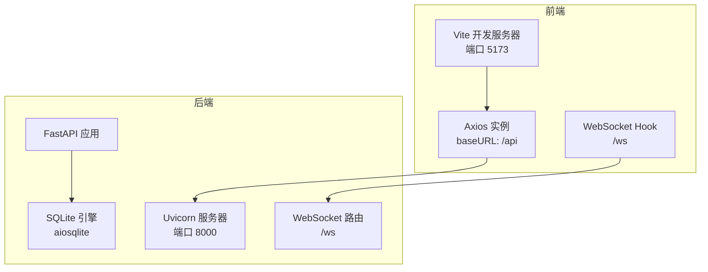
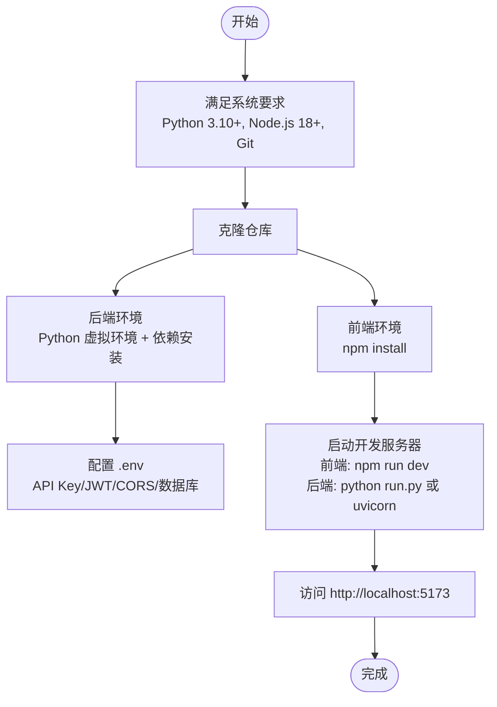
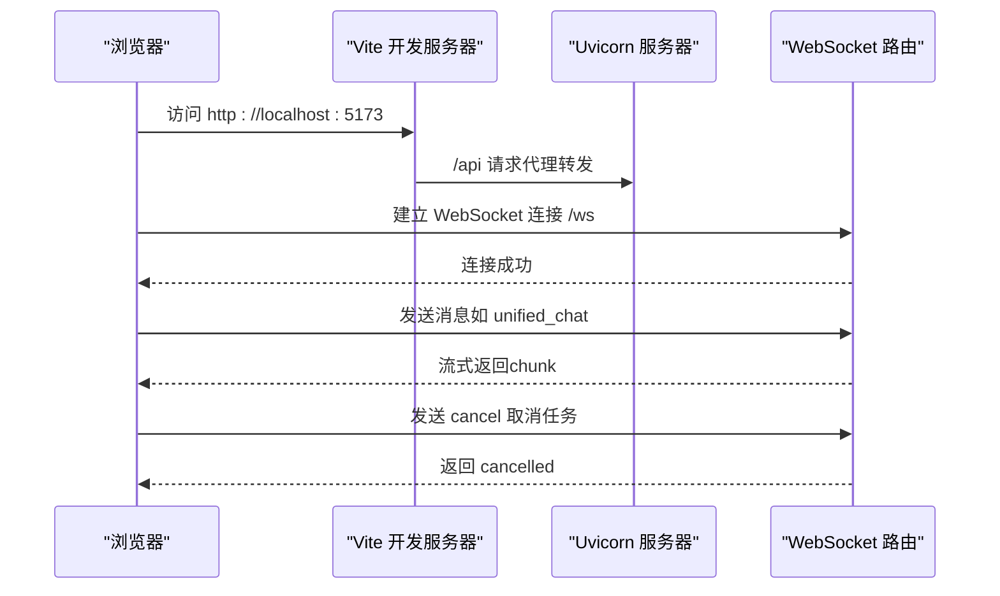
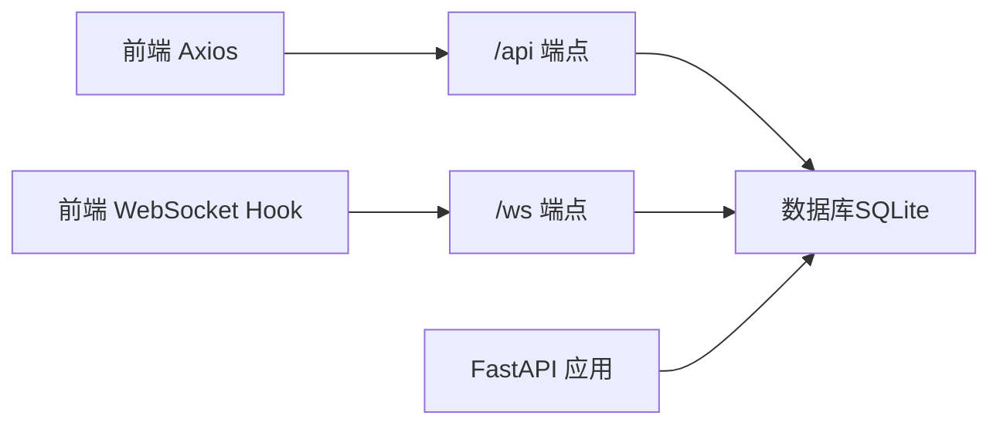

# 开发环境搭建

<cite>
**本文档引用的文件**
- [requirements.txt](file://backend/requirements.txt)
- [package.json](file://frontend/package.json)
- [README.md](file://README.md)
- [config.py](file://backend/app/config.py)
- [run.py](file://backend/run.py)
- [main.py](file://backend/app/main.py)
- [database.py](file://backend/app/database.py)
- [ws.py](file://backend/app/routers/ws.py)
- [useWebSocket.js](file://frontend/src/hooks/useWebSocket.js)
- [index.js](file://frontend/src/api/index.js)
- [vite.config.js](file://frontend/vite.config.js)
- [eslint.config.js](file://frontend/eslint.config.js)
- [.gitignore（后端）](file://backend/.gitignore)
- [.gitignore（前端）](file://frontend/.gitignore)
</cite>

## 目录
1. [简介](#简介)
2. [项目结构](#项目结构)
3. [核心组件](#核心组件)
4. [架构总览](#架构总览)
5. [详细组件分析](#详细组件分析)
6. [依赖关系分析](#依赖关系分析)
7. [性能考虑](#性能考虑)
8. [故障排除指南](#故障排除指南)
9. [结论](#结论)
10. [附录](#附录)

## 简介
本指南面向希望在本地搭建 PaperChat 项目的开发者，覆盖系统要求、环境变量配置、后端与前端依赖安装、IDE 配置建议、开发服务器启动流程以及常见问题排查。PaperChat 是一个基于 FastAPI + React 的学术论文智能阅读与问答系统，支持 PDF 上传、AI 结构化解析、RAG 增强问答、高亮标注、知识库与写作辅助，并通过 WebSocket 实现实时流式通信。

## 项目结构
项目采用前后端分离架构：
- 后端：Python + FastAPI + SQLAlchemy（异步 ORM）+ LangChain 生态（ChromaDB、sentence-transformers、rank-bm25、pdfplumber 等）
- 前端：React + Vite + Zustand + react-router-dom + PDF.js + axios
- WebSocket：统一聊天入口与多工具路由，支持断线重连与任务取消

图表来源
- [main.py:55-95](file://backend/app/main.py#L55-L95)
- [run.py:23-30](file://backend/run.py#L23-L30)
- [vite.config.js:7-17](file://frontend/vite.config.js#L7-L17)
- [index.js:4-9](file://frontend/src/api/index.js#L4-L9)
- [useWebSocket.js:3-3](file://frontend/src/hooks/useWebSocket.js#L3-L3)
- [database.py:14-18](file://backend/app/database.py#L14-L18)
- [ws.py:76-102](file://backend/app/routers/ws.py#L76-L102)

章节来源
- [README.md:72-183](file://README.md#L72-L183)
- [main.py:55-95](file://backend/app/main.py#L55-L95)
- [run.py:23-30](file://backend/run.py#L23-L30)
- [vite.config.js:7-17](file://frontend/vite.config.js#L7-L17)
- [index.js:4-9](file://frontend/src/api/index.js#L4-L9)
- [useWebSocket.js:3-3](file://frontend/src/hooks/useWebSocket.js#L3-L3)
- [database.py:14-18](file://backend/app/database.py#L14-L18)
- [ws.py:76-102](file://backend/app/routers/ws.py#L76-L102)

## 核心组件
- 后端配置与生命周期
  - 应用名称、调试模式、CORS、JWT、上传目录、最大文件大小等均来自配置类，支持从 .env 文件读取
  - 应用生命周期在启动时初始化数据库并加载默认用户配置，关闭时释放连接
- 数据库
  - 使用 SQLAlchemy 异步引擎与 aiosqlite，DEBUG 模式下输出 SQL
  - 启动时创建所有表并确保默认用户存在
- WebSocket
  - 支持 analyze、chat、rag_chat、cross_doc_chat、deep_analyze、agent_chat、unified_chat 等消息类型
  - 支持任务取消、意图识别与自动路由、断线重连
- 前端代理与 API
  - Vite 代理将 /api 转发至后端，/ws 转发至 WebSocket
  - Axios 实例 base URL 指向 /api，简化请求路径

章节来源
- [config.py:15-41](file://backend/app/config.py#L15-L41)
- [main.py:16-52](file://backend/app/main.py#L16-L52)
- [database.py:50-80](file://backend/app/database.py#L50-L80)
- [ws.py:76-436](file://backend/app/routers/ws.py#L76-L436)
- [vite.config.js:7-17](file://frontend/vite.config.js#L7-L17)
- [index.js:4-9](file://frontend/src/api/index.js#L4-L9)

## 架构总览
PaperChat 的开发环境由以下要素构成：
- 系统要求：Python 3.10+、Node.js 18+、Git
- 后端依赖：FastAPI、Uvicorn、SQLAlchemy、LangChain 生态、ChromaDB、sentence-transformers、rank-bm25、pdfplumber、pydantic-settings、JWT、aiosqlite 等
- 前端依赖：React、Vite、Zustand、react-router-dom、PDF.js、axios、ESLint、React 插件等
- 环境变量：DEEPSEEK_API_KEY、JWT 配置、CORS、数据库 URL、上传目录等
- 开发服务器：后端 uvicorn，前端 Vite，端口 5173（前端）、8000（后端）

图表来源
- [README.md:187-239](file://README.md#L187-L239)
- [requirements.txt:1-19](file://backend/requirements.txt#L1-L19)
- [package.json:6-11](file://frontend/package.json#L6-L11)
- [run.py:23-30](file://backend/run.py#L23-L30)

章节来源
- [README.md:187-239](file://README.md#L187-L239)
- [requirements.txt:1-19](file://backend/requirements.txt#L1-L19)
- [package.json:6-11](file://frontend/package.json#L6-L11)
- [run.py:23-30](file://backend/run.py#L23-L30)

## 详细组件分析

### 系统要求与环境准备
- Python 3.10+
- Node.js 18+
- Git
- DeepSeek API Key（用于 LLM 能力）

章节来源
- [README.md:187-192](file://README.md#L187-L192)

### 后端环境搭建
- 进入后端目录，复制环境变量模板并编辑 .env，填入 DEEPSEEK_API_KEY
- 创建并激活 Python 虚拟环境（可选）
- 安装依赖：pip install -r requirements.txt
- 启动后端：python run.py 或 uvicorn app.main:app --host 0.0.0.0 --port 8000 --reload

章节来源
- [README.md:193-222](file://README.md#L193-L222)
- [requirements.txt:1-19](file://backend/requirements.txt#L1-L19)
- [run.py:23-30](file://backend/run.py#L23-L30)

### 前端环境搭建
- 进入前端目录，安装依赖：npm install
- 启动开发服务器：npm run dev
- 访问 http://localhost:5173

章节来源
- [README.md:224-239](file://README.md#L224-L239)
- [package.json:6-11](file://frontend/package.json#L6-L11)

### 环境变量配置
- 后端配置类包含以下关键项（可通过 .env 覆盖）：
  - 应用名称与调试模式
  - 数据库 URL（默认 SQLite）
  - DeepSeek API Key
  - JWT 密钥、算法、过期时间
  - CORS 允许的源
  - 上传目录与最大文件大小
- 前端通过 Vite 代理将 /api 与 /ws 转发至后端，无需手动配置前端环境变量

章节来源
- [config.py:15-41](file://backend/app/config.py#L15-L41)
- [vite.config.js:7-17](file://frontend/vite.config.js#L7-L17)

### 开发服务器启动流程
- 后端：uvicorn 在 0.0.0.0:8000 启动，支持热重载
- 前端：Vite 在 0.0.0.0:5173 启动，支持热重载
- WebSocket：前端通过 useWebSocket.js 连接 ws://localhost:8000/ws，支持断线重连与任务取消

图表来源
- [useWebSocket.js:19-59](file://frontend/src/hooks/useWebSocket.js#L19-L59)
- [ws.py:76-102](file://backend/app/routers/ws.py#L76-L102)
- [vite.config.js:7-17](file://frontend/vite.config.js#L7-L17)

章节来源
- [run.py:23-30](file://backend/run.py#L23-L30)
- [vite.config.js:7-17](file://frontend/vite.config.js#L7-L17)
- [useWebSocket.js:3-3](file://frontend/src/hooks/useWebSocket.js#L3-L3)
- [ws.py:76-102](file://backend/app/routers/ws.py#L76-L102)

### IDE 配置建议（VS Code）
- 推荐插件
  - Python（Microsoft）：语法高亮、格式化、调试
  - ESLint（Dirk Baeumer）：JavaScript/JSX 代码规范
  - Prettier（Prettier）：代码格式化
  - ES7+ React/Redux/React-Native snippets（charalampos karypidis）：React 片段
  - Vite（ZiHang Gao）：Vite 项目支持
- Python 格式化
  - 使用 black 或 ruff，结合 settings.json 指定默认 formatter
- JavaScript/JSX 格式化
  - 使用 Prettier，配合 ESLint 规则
- 调试配置
  - Python：launch.json 配置 uvicorn 调试
  - JavaScript：VS Code 内置 Chrome 调试（Vite）

章节来源
- [eslint.config.js:1-30](file://frontend/eslint.config.js#L1-L30)
- [package.json:24-34](file://frontend/package.json#L24-L34)

### 依赖安装与版本说明
- 后端依赖（部分）
  - FastAPI、Uvicorn、SQLAlchemy、LangChain 生态、ChromaDB、sentence-transformers、rank-bm25、pdfplumber、pydantic-settings、JWT、aiosqlite、Alembic 等
- 前端依赖（部分）
  - React、Vite、Zustand、react-router-dom、PDF.js、axios、ESLint、@vitejs/plugin-react 等

章节来源
- [requirements.txt:1-19](file://backend/requirements.txt#L1-L19)
- [package.json:12-34](file://frontend/package.json#L12-L34)

## 依赖关系分析
后端与前端通过 /api 与 /ws 两条通道通信，数据库为 SQLite（开发阶段）。WebSocket 路由负责消息类型分发与任务调度，Axios 与 useWebSocket.js 分别承担 REST 与实时通信。

图表来源
- [index.js:4-9](file://frontend/src/api/index.js#L4-L9)
- [useWebSocket.js:3-3](file://frontend/src/hooks/useWebSocket.js#L3-L3)
- [ws.py:76-102](file://backend/app/routers/ws.py#L76-L102)
- [database.py:14-18](file://backend/app/database.py#L14-L18)
- [main.py:55-95](file://backend/app/main.py#L55-L95)

章节来源
- [index.js:4-9](file://frontend/src/api/index.js#L4-L9)
- [useWebSocket.js:3-3](file://frontend/src/hooks/useWebSocket.js#L3-L3)
- [ws.py:76-102](file://backend/app/routers/ws.py#L76-L102)
- [database.py:14-18](file://backend/app/database.py#L14-L18)
- [main.py:55-95](file://backend/app/main.py#L55-L95)

## 性能考虑
- 前端构建分包策略：将 React、PDF.js、Zustand、react-markdown 等独立拆分为 vendor chunks，减少重复打包体积
- WebSocket 流式传输：后端按块发送响应，前端逐步渲染，降低首屏等待
- 数据库异步：SQLAlchemy 异步引擎与会话工厂，避免阻塞
- 开发模式：DEBUG=true 时输出 SQL，便于调试；生产环境建议关闭

章节来源
- [vite.config.js:23-47](file://frontend/vite.config.js#L23-L47)
- [database.py:14-27](file://backend/app/database.py#L14-L27)
- [config.py:19-20](file://backend/app/config.py#L19-L20)

## 故障排除指南
- 端口占用
  - 前端：5173；后端：8000。若被占用，可在各自配置中修改端口或终止占用进程
- CORS 错误
  - 确认 .env 中 CORS_ORIGINS 包含 http://localhost:5173
- 数据库初始化失败
  - 检查 DATABASE_URL 是否为 sqlite+aiosqlite，确认权限与路径
- WebSocket 连接失败
  - 确认后端已启动且端口正确；检查 useWebSocket.js 中的 WS_URL 与 token
- LLM API Key 无效
  - 确认 DEEPSEEK_API_KEY 已正确填写；网络代理可能影响访问
- 依赖安装失败
  - 后端：确保 Python 3.10+；使用虚拟环境隔离依赖
  - 前端：确保 Node.js 18+；清理 node_modules 并重新安装

章节来源
- [config.py:34-38](file://backend/app/config.py#L34-L38)
- [database.py:50-80](file://backend/app/database.py#L50-L80)
- [useWebSocket.js:19-59](file://frontend/src/hooks/useWebSocket.js#L19-L59)
- [README.md:187-239](file://README.md#L187-L239)

## 结论
按照本指南完成系统要求、依赖安装、环境变量配置与开发服务器启动后，即可在本地顺畅开发 PaperChat。建议在开发过程中充分利用热重载与断线重连机制，结合 ESLint 与 Prettier 保持代码质量，并通过 DEBUG 模式观察数据库与 WebSocket 交互细节。

## 附录

### 端口与服务对照
- 前端开发服务器：http://localhost:5173
- 后端 API/WS：http://localhost:8000
- Vite 代理规则：/api → http://localhost:8000；/ws → ws://localhost:8000

章节来源
- [README.md:384-389](file://README.md#L384-L389)
- [vite.config.js:7-17](file://frontend/vite.config.js#L7-L17)