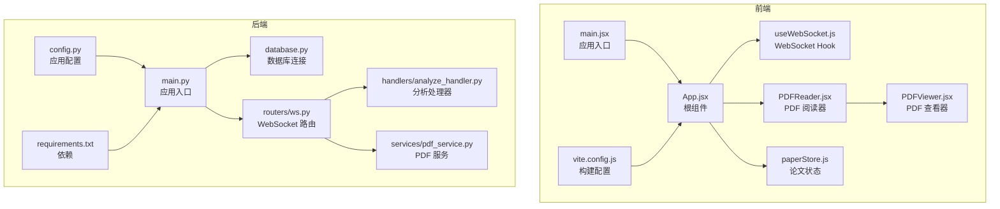
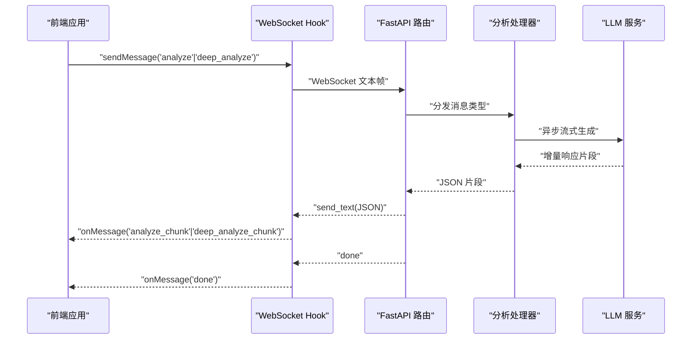
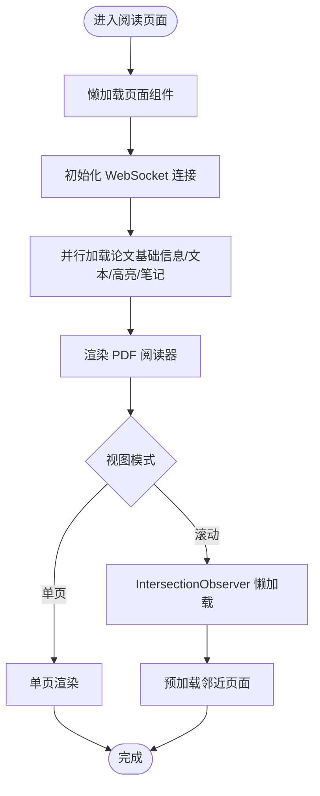
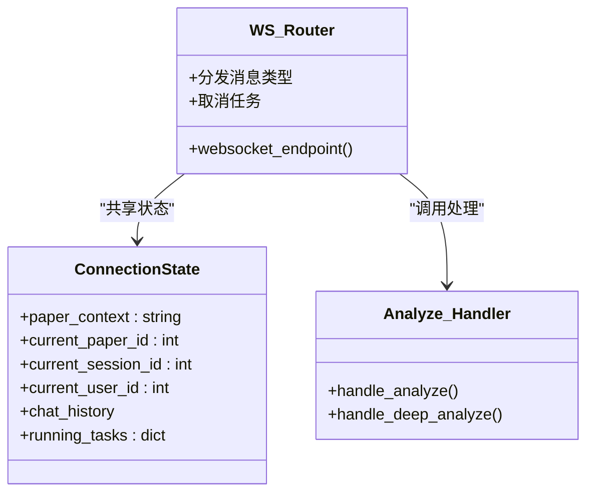
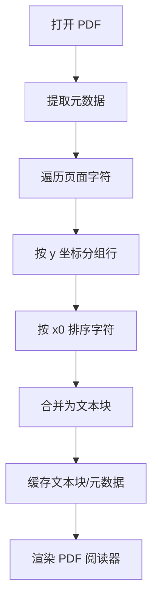
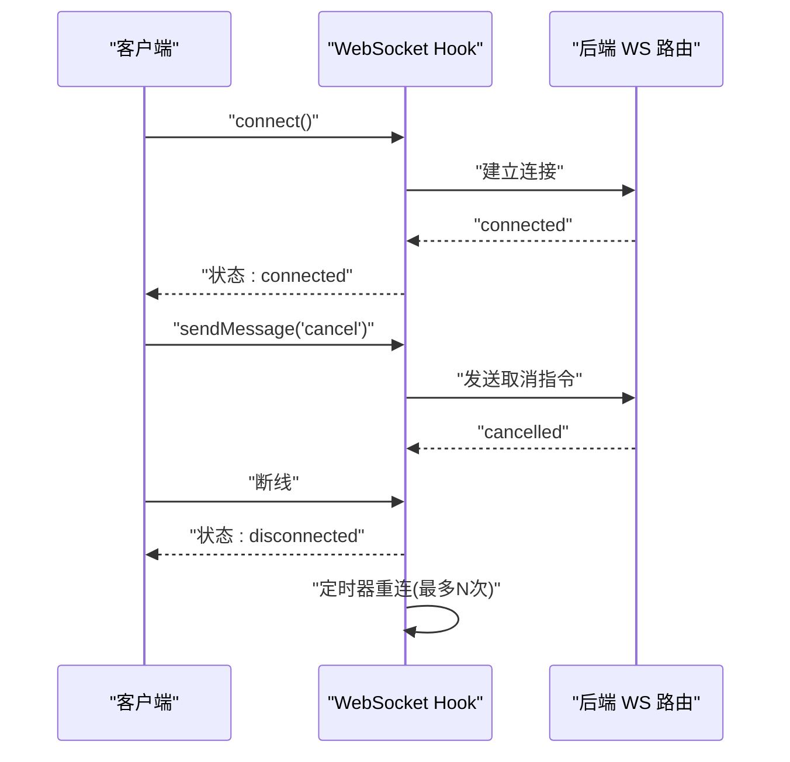
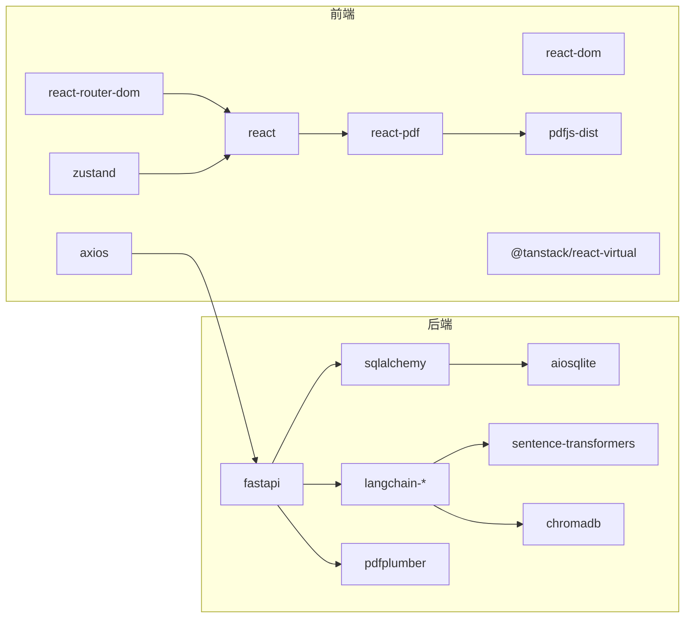

# 性能优化与调试

<cite>
**本文引用的文件**
- [后端入口 main.py](file://backend/app/main.py)
- [应用配置 config.py](file://backend/app/config.py)
- [数据库连接 database.py](file://backend/app/database.py)
- [WebSocket 路由 ws.py](file://backend/app/routers/ws.py)
- [分析处理器 analyze_handler.py](file://backend/app/handlers/analyze_handler.py)
- [PDF 处理服务 pdf_service.py](file://backend/app/services/pdf_service.py)
- [前端入口 main.jsx](file://frontend/src/main.jsx)
- [Vite 构建配置 vite.config.js](file://frontend/vite.config.js)
- [App 根组件 App.jsx](file://frontend/src/App.jsx)
- [PDF 阅读器组件 PDFReader.jsx](file://frontend/src/components/PDFReader/PDFReader.jsx)
- [PDF 查看器组件 PDFViewer.jsx](file://frontend/src/components/PDFViewer/PDFViewer.jsx)
- [WebSocket Hook useWebSocket.js](file://frontend/src/hooks/useWebSocket.js)
- [论文状态存储 paperStore.js](file://frontend/src/stores/paperStore.js)
- [前端包管理 package.json](file://frontend/package.json)
- [后端依赖 requirements.txt](file://backend/requirements.txt)
</cite>

## 目录
1. [简介](#简介)
2. [项目结构](#项目结构)
3. [核心组件](#核心组件)
4. [架构总览](#架构总览)
5. [详细组件分析](#详细组件分析)
6. [依赖关系分析](#依赖关系分析)
7. [性能考量](#性能考量)
8. [故障排查指南](#故障排查指南)
9. [结论](#结论)
10. [附录](#附录)

## 简介
本指南面向 PaperChat 项目，围绕前端性能优化、后端性能优化、PDF 处理性能优化、WebSocket 通信优化、调试工具与技巧、性能监控与分析以及常见性能问题诊断与解决展开。文档结合仓库现有实现，给出可操作的优化建议与最佳实践。

## 项目结构
项目采用前后端分离架构：
- 前端基于 React 19 + Vite，使用 react-router-dom 进行路由，Zustand 管理状态，react-pdf/pdfjs-dist 渲染 PDF，Axios 发起 API 请求。
- 后端基于 FastAPI，使用 SQLAlchemy 2.x 异步 ORM，WebSocket 提供实时分析与问答能力，LangChain 生态集成 LLM 服务，pdfplumber 处理 PDF 元数据与文本提取。

**图表来源**
- [前端入口 main.jsx:1-14](file://frontend/src/main.jsx#L1-L14)
- [App 根组件 App.jsx:1-1010](file://frontend/src/App.jsx#L1-L1010)
- [WebSocket Hook useWebSocket.js:1-180](file://frontend/src/hooks/useWebSocket.js#L1-L180)
- [PDF 阅读器组件 PDFReader.jsx:1-656](file://frontend/src/components/PDFReader/PDFReader.jsx#L1-L656)
- [PDF 查看器组件 PDFViewer.jsx:1-91](file://frontend/src/components/PDFViewer/PDFViewer.jsx#L1-L91)
- [论文状态存储 paperStore.js:1-357](file://frontend/src/stores/paperStore.js#L1-L357)
- [Vite 构建配置 vite.config.js:1-54](file://frontend/vite.config.js#L1-L54)
- [后端入口 main.py:1-114](file://backend/app/main.py#L1-L114)
- [数据库连接 database.py:1-81](file://backend/app/database.py#L1-L81)
- [WebSocket 路由 ws.py:1-436](file://backend/app/routers/ws.py#L1-L436)
- [分析处理器 analyze_handler.py:1-87](file://backend/app/handlers/analyze_handler.py#L1-L87)
- [PDF 处理服务 pdf_service.py:1-194](file://backend/app/services/pdf_service.py#L1-L194)
- [应用配置 config.py:1-44](file://backend/app/config.py#L1-L44)
- [后端依赖 requirements.txt:1-19](file://backend/requirements.txt#L1-L19)

**章节来源**
- [前端入口 main.jsx:1-14](file://frontend/src/main.jsx#L1-L14)
- [后端入口 main.py:1-114](file://backend/app/main.py#L1-L114)

## 核心组件
- 前端应用入口与路由：通过 React Router 实现页面级懒加载与 Suspense，减少初始包体积。
- WebSocket Hook：集中管理连接生命周期、消息订阅、重连与取消任务。
- PDF 阅读器：支持单页/滚动模式、IntersectionObserver 懒加载、设备像素比适配、高亮层叠加。
- 状态管理：Zustand Store 管理论文列表、全文文本、推荐、高亮与笔记等状态。
- 后端应用：FastAPI + SQLAlchemy 异步连接；WebSocket 路由按消息类型分发至不同处理器；PDF 服务使用 pdfplumber 提取元数据与文本块。

**章节来源**
- [App 根组件 App.jsx:25-57](file://frontend/src/App.jsx#L25-L57)
- [WebSocket Hook useWebSocket.js:1-180](file://frontend/src/hooks/useWebSocket.js#L1-L180)
- [PDF 阅读器组件 PDFReader.jsx:1-656](file://frontend/src/components/PDFReader/PDFReader.jsx#L1-L656)
- [论文状态存储 paperStore.js:1-357](file://frontend/src/stores/paperStore.js#L1-L357)
- [后端入口 main.py:55-95](file://backend/app/main.py#L55-L95)
- [数据库连接 database.py:13-48](file://backend/app/database.py#L13-L48)
- [WebSocket 路由 ws.py:76-120](file://backend/app/routers/ws.py#L76-L120)
- [PDF 处理服务 pdf_service.py:11-194](file://backend/app/services/pdf_service.py#L11-L194)

## 架构总览
前端通过 Axios 与后端 REST API 交互，WebSocket 用于实时分析与问答。后端使用异步数据库连接与任务取消机制，避免阻塞；PDF 处理采用流式与分块策略，降低内存峰值。

**图表来源**
- [WebSocket Hook useWebSocket.js:100-154](file://frontend/src/hooks/useWebSocket.js#L100-L154)
- [WebSocket 路由 ws.py:120-200](file://backend/app/routers/ws.py#L120-L200)
- [分析处理器 analyze_handler.py:13-49](file://backend/app/handlers/analyze_handler.py#L13-L49)

## 详细组件分析

### 前端性能优化策略
- React 组件优化
  - 页面级懒加载与 Suspense：对核心页面组件使用 lazy/suspense，减少首屏 JS 体积与白屏时间。
  - 状态隔离与选择器：使用 Zustand 的原子化状态，避免不必要的重渲染。
  - 回调稳定化：使用 useCallback 包裹事件处理与子组件回调，减少子组件重渲染。
- 虚拟列表实现
  - 滚动模式下使用 IntersectionObserver 预加载相邻页面，仅渲染可见页，显著降低 DOM 节点数量。
- 图片懒加载
  - PDF 页面占位符与预加载策略：在滚动模式下为不可见页面提供等高占位符，避免布局抖动。
- CSS 优化
  - 使用 CSS 变量与模块化样式，避免全局样式冲突；SVG 图标内联，减少额外请求。
- JavaScript 代码分割
  - Vite manualChunks 按依赖库拆分：React 核心、PDF 相关、状态管理、Markdown 渲染分别打包，提升缓存命中率。

**图表来源**
- [App 根组件 App.jsx:310-419](file://frontend/src/App.jsx#L310-L419)
- [PDF 阅读器组件 PDFReader.jsx:315-362](file://frontend/src/components/PDFReader/PDFReader.jsx#L315-L362)

**章节来源**
- [App 根组件 App.jsx:25-57](file://frontend/src/App.jsx#L25-L57)
- [PDF 阅读器组件 PDFReader.jsx:315-362](file://frontend/src/components/PDFReader/PDFReader.jsx#L315-L362)
- [Vite 构建配置 vite.config.js:23-47](file://frontend/vite.config.js#L23-L47)

### 后端性能优化方法
- 数据库查询优化
  - 异步连接与会话工厂：使用 SQLAlchemy 异步引擎与 async session，减少阻塞。
  - 生命周期管理：应用启动时初始化数据库，关闭时释放连接，避免连接泄漏。
- 缓存策略
  - 分析结果缓存：将章节概述与深度分析结果写入缓存，前端可直接读取历史缓存，减少重复计算。
- 异步处理优化
  - 任务取消与并发控制：WebSocket 路由中为每种消息类型维护 running_tasks 字典，支持取消与覆盖，避免资源堆积。
  - 流式响应：分析处理器逐片发送响应，前端即时展示，缩短感知延迟。
- 内存管理
  - PDF 文本块提取：按页遍历字符，按行聚合，避免一次性加载全部文本到内存。
  - 任务清理：连接断开时取消所有运行中的任务，释放资源。

**图表来源**
- [WebSocket 路由 ws.py:56-74](file://backend/app/routers/ws.py#L56-L74)
- [WebSocket 路由 ws.py:114-136](file://backend/app/routers/ws.py#L114-L136)
- [分析处理器 analyze_handler.py:13-49](file://backend/app/handlers/analyze_handler.py#L13-L49)

**章节来源**
- [数据库连接 database.py:13-48](file://backend/app/database.py#L13-L48)
- [后端入口 main.py:16-52](file://backend/app/main.py#L16-L52)
- [WebSocket 路由 ws.py:130-136](file://backend/app/routers/ws.py#L130-L136)
- [分析处理器 analyze_handler.py:18-35](file://backend/app/handlers/analyze_handler.py#L18-L35)
- [PDF 处理服务 pdf_service.py:69-118](file://backend/app/services/pdf_service.py#L69-L118)

### PDF 处理性能优化
- 大文件分片处理
  - 文本块提取：按页遍历字符，按 y 坐标分组为行，再按 x0 排序合并，避免全量字符串拼接造成的内存峰值。
- 增量渲染
  - 滚动模式下仅渲染可见页，使用 IntersectionObserver 预加载，占位符维持布局稳定。
- 向量索引优化
  - 项目依赖 sentence-transformers 与 chromadb，建议对论文文本进行分块嵌入并缓存向量，查询时使用向量检索加速。
- 内存缓存策略
  - PDF 元数据与文本块缓存于进程内存，避免重复解析；分析结果缓存于后端，前端优先读取本地缓存。

**图表来源**
- [PDF 处理服务 pdf_service.py:69-118](file://backend/app/services/pdf_service.py#L69-L118)
- [PDF 阅读器组件 PDFReader.jsx:417-481](file://frontend/src/components/PDFReader/PDFReader.jsx#L417-L481)

**章节来源**
- [PDF 处理服务 pdf_service.py:14-194](file://backend/app/services/pdf_service.py#L14-L194)
- [PDF 阅读器组件 PDFReader.jsx:417-481](file://frontend/src/components/PDFReader/PDFReader.jsx#L417-L481)

### WebSocket 通信优化
- 消息压缩
  - 建议启用后端/代理层压缩（如 gzip/deflate），减少传输体积。
- 连接池管理
  - 前端使用全局单例连接，避免重复握手；后端为每个客户端维护独立状态与任务集合。
- 心跳检测与断线重连
  - 前端实现指数退避重连与最大重试次数，连接断开后自动重连。
- 取消与并发控制
  - 支持取消当前任务，避免旧任务占用资源；多任务场景下按通道区分 running_tasks。

**图表来源**
- [WebSocket Hook useWebSocket.js:19-71](file://frontend/src/hooks/useWebSocket.js#L19-L71)
- [WebSocket 路由 ws.py:252-260](file://backend/app/routers/ws.py#L252-L260)

**章节来源**
- [WebSocket Hook useWebSocket.js:1-180](file://frontend/src/hooks/useWebSocket.js#L1-L180)
- [WebSocket 路由 ws.py:252-260](file://backend/app/routers/ws.py#L252-L260)

### 调试工具与技巧
- 浏览器开发者工具
  - 使用 Performance 面板记录渲染与脚本执行；Network 面板观察 WebSocket 帧与 API 响应；Memory 面板检测内存泄漏。
- Node.js 调试
  - 后端使用 uvicorn 启动，可通过日志与异常捕获定位问题；生产环境建议开启结构化日志。
- Python 调试器配置
  - 在 FastAPI/服务层设置断点，逐步跟踪数据库事务与 LLM 调用链路。
- 网络监控工具
  - 使用浏览器 Network 面板与 WebSocket 握手/帧监控；后端可接入 Prometheus/Grafana 监控关键指标。

**章节来源**
- [后端入口 main.py:102-114](file://backend/app/main.py#L102-L114)
- [应用配置 config.py:18-40](file://backend/app/config.py#L18-L40)

### 性能监控与分析方法
- 关键指标监控
  - 前端：首屏时间、交互就绪时间、WebSocket 连接成功率、PDF 渲染帧率。
  - 后端：请求延迟 P95/P99、并发连接数、数据库连接池利用率、LLM 调用耗时。
- 性能基准测试
  - 使用 Lighthouse/自定义脚本对 PDF 加载与分析流程进行基准测试，定期回归。
- 内存泄漏检测
  - 前端：使用 Performance Memory 快照对比；后端：监控进程 RSS 与 GC 次数。
- CPU 使用率分析
  - 后端：定位高 CPU 使用的路由与处理器，优化循环与 I/O。

**章节来源**
- [前端包管理 package.json:12-36](file://frontend/package.json#L12-L36)
- [后端依赖 requirements.txt:1-19](file://backend/requirements.txt#L1-L19)

### 常见性能问题诊断与解决方案
- 渲染卡顿
  - 优化 PDF 渲染：滚动模式 + 懒加载；减少高亮层重绘；避免在渲染路径中做昂贵计算。
- 内存溢出
  - 控制一次性加载的数据规模：分页提取 PDF 文本块；及时清理 IntersectionObserver 与事件监听。
- 网络延迟
  - 启用 WebSocket 压缩与长连接；前端重连策略与退避；后端限流与队列化处理。
- 数据库瓶颈
  - 使用异步连接池；为高频查询建立索引；避免 N+1 查询；必要时引入只读副本。

**章节来源**
- [PDF 阅读器组件 PDFReader.jsx:315-362](file://frontend/src/components/PDFReader/PDFReader.jsx#L315-L362)
- [数据库连接 database.py:13-27](file://backend/app/database.py#L13-L27)
- [WebSocket 路由 ws.py:130-136](file://backend/app/routers/ws.py#L130-L136)

## 依赖关系分析
- 前端依赖
  - React 生态与 PDF 渲染：react、react-dom、react-router-dom、react-pdf、pdfjs-dist、zustand。
  - 构建与分包：Vite 8，Rollup manualChunks 拆分第三方库。
- 后端依赖
  - Web 框架与数据库：FastAPI、SQLAlchemy 2.x、aiosqlite。
  - LLM 与向量：LangChain 生态、sentence-transformers、chromadb。
  - PDF 解析：pdfplumber。

**图表来源**
- [前端包管理 package.json:12-36](file://frontend/package.json#L12-L36)
- [后端依赖 requirements.txt:1-19](file://backend/requirements.txt#L1-L19)

**章节来源**
- [前端包管理 package.json:12-36](file://frontend/package.json#L12-L36)
- [后端依赖 requirements.txt:1-19](file://backend/requirements.txt#L1-L19)

## 性能考量
- 前端
  - 代码分割与懒加载：已通过 Vite manualChunks 与 React lazy 实现。
  - 渲染优化：滚动模式懒加载、高亮层按页渲染、设备像素比适配。
- 后端
  - 异步 I/O：数据库与 LLM 调用均采用异步方式。
  - 并发控制：WebSocket 任务取消与覆盖，避免资源堆积。
- PDF 处理
  - 分块与流式：按页提取文本块，避免全量加载。
- WebSocket
  - 流式响应与取消：前端即时反馈，后端快速回收资源。

**章节来源**
- [Vite 构建配置 vite.config.js:23-47](file://frontend/vite.config.js#L23-L47)
- [PDF 阅读器组件 PDFReader.jsx:417-481](file://frontend/src/components/PDFReader/PDFReader.jsx#L417-L481)
- [WebSocket 路由 ws.py:130-136](file://backend/app/routers/ws.py#L130-L136)
- [分析处理器 analyze_handler.py:18-35](file://backend/app/handlers/analyze_handler.py#L18-L35)

## 故障排查指南
- WebSocket 连接失败
  - 检查前端 token 传递与后端 JWT 校验；确认代理配置与端口映射。
- PDF 加载失败
  - 检查文件格式与大小限制；查看 PDF.js worker 加载路径；确认跨域与权限。
- 分析任务无响应
  - 检查 running_tasks 状态与取消逻辑；确认 LLM 服务可用性与超时设置。
- 数据库连接异常
  - 检查连接池配置与事务提交/回滚逻辑；确保应用生命周期中正确初始化与关闭。

**章节来源**
- [WebSocket Hook useWebSocket.js:19-59](file://frontend/src/hooks/useWebSocket.js#L19-L59)
- [PDF 阅读器组件 PDFReader.jsx:63-67](file://frontend/src/components/PDFReader/PDFReader.jsx#L63-L67)
- [WebSocket 路由 ws.py:103-107](file://backend/app/routers/ws.py#L103-L107)
- [数据库连接 database.py:39-47](file://backend/app/database.py#L39-L47)

## 结论
本指南基于现有代码实现，总结了前端与后端的关键性能优化点，并针对 PDF 处理与 WebSocket 通信提供了可落地的优化策略。建议在持续集成中加入性能回归测试与监控告警，确保系统在高负载下的稳定性与响应速度。

## 附录
- 前端构建与分包
  - Vite 8 使用 Rolldown，manualChunks 将 React、PDF、Zustand、Markdown 等库拆分为独立 chunk，提升缓存命中率。
- 后端配置要点
  - HuggingFace 镜像与模型缓存目录设置，提升模型加载效率；SQLite 开发环境适合小规模数据，生产建议迁移到 PostgreSQL 并启用连接池。

**章节来源**
- [Vite 构建配置 vite.config.js:23-47](file://frontend/vite.config.js#L23-L47)
- [应用配置 config.py:4-10](file://backend/app/config.py#L4-L10)