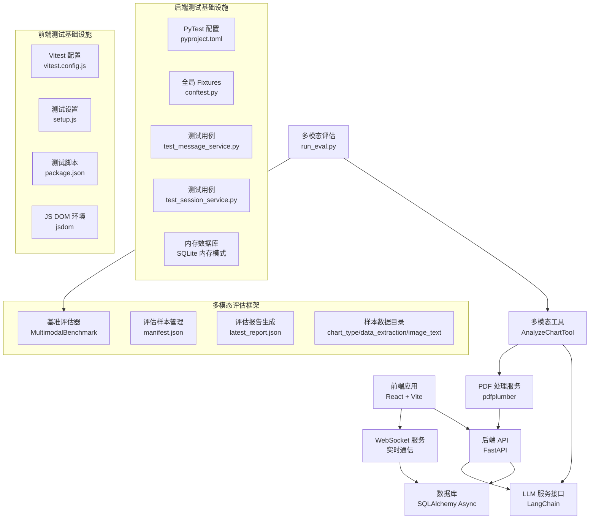
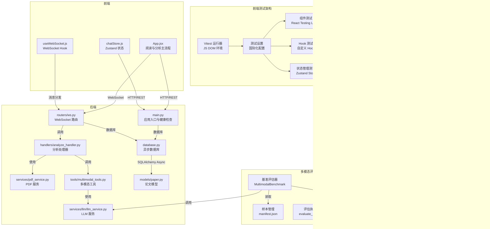
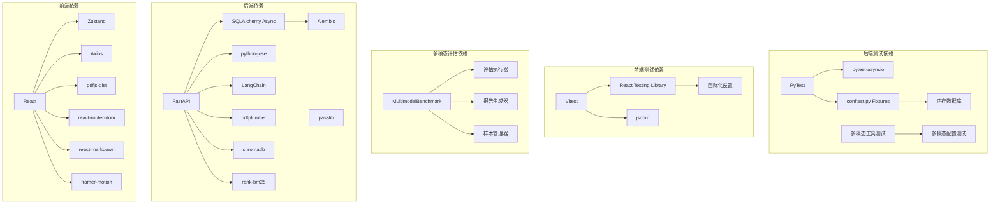

# 测试策略与质量保证

<cite>
**本文档引用的文件**
- [backend/pyproject.toml](file://backend/pyproject.toml)
- [backend/tests/conftest.py](file://backend/tests/conftest.py)
- [backend/tests/test_message_service.py](file://backend/tests/test_message_service.py)
- [backend/tests/test_session_service.py](file://backend/tests/test_session_service.py)
- [backend/app/main.py](file://backend/app/main.py)
- [backend/app/config.py](file://backend/app/config.py)
- [backend/app/database.py](file://backend/app/database.py)
- [backend/app/routers/ws.py](file://backend/app/routers/ws.py)
- [backend/app/handlers/analyze_handler.py](file://backend/app/handlers/analyze_handler.py)
- [backend/app/services/pdf_service.py](file://backend/app/services/pdf_service.py)
- [backend/app/models/paper.py](file://backend/app/models/paper.py)
- [backend/app/tools/multimodal_tools.py](file://backend/app/tools/multimodal_tools.py)
- [backend/app/services/llm/llm_service.py](file://backend/app/services/llm/llm_service.py)
- [backend/tests/benchmarks/multimodal_eval.py](file://backend/tests/benchmarks/multimodal_eval.py)
- [backend/tests/benchmarks/run_eval.py](file://backend/tests/benchmarks/run_eval.py)
- [backend/tests/benchmarks/data/manifest.json](file://backend/tests/benchmarks/data/manifest.json)
- [backend/tests/unit/test_multimodal_tools.py](file://backend/tests/unit/test_multimodal_tools.py)
- [backend/tests/unit/test_multimodal_config.py](file://backend/tests/unit/test_multimodal_config.py)
- [frontend/package.json](file://frontend/package.json)
- [frontend/vitest.config.js](file://frontend/vitest.config.js)
- [frontend/src/test/setup.js](file://frontend/src/test/setup.js)
- [frontend/vite.config.js](file://frontend/vite.config.js)
- [frontend/src/App.jsx](file://frontend/src/App.jsx)
- [frontend/src/hooks/useWebSocket.js](file://frontend/src/hooks/useWebSocket.js)
- [frontend/src/stores/chatStore.js](file://frontend/src/stores/chatStore.js)
</cite>

## 更新摘要
**所做更改**
- 新增多模态评估基准框架，包括图表类型识别、数据提取和图像文本匹配的基准测试
- 新增多模态工具单元测试，验证 AnalyzeChartTool 和 MultimodalSearchTool 的调用链
- 新增多模态配置测试，验证 LLM 服务增强功能
- 更新测试基础设施以支持多模态评估框架
- 新增多模态评估报告生成和对比功能

## 目录
1. [引言](#引言)
2. [项目结构](#项目结构)
3. [核心组件](#核心组件)
4. [架构总览](#架构总览)
5. [详细组件分析](#详细组件分析)
6. [依赖分析](#依赖分析)
7. [性能考量](#性能考量)
8. [故障排查指南](#故障排查指南)
9. [结论](#结论)
10. [附录](#附录)

## 引言
本文件面向 PaperChat 项目，制定系统化的测试策略与质量保证方案，覆盖单元测试、集成测试、性能与压力测试、代码质量保障、测试数据与环境管理、缺陷跟踪与修复流程，以及用户体验与可用性评估方法。项目已建立完整的测试基础设施，包括 PyTest 后端测试框架和 Vitest 前端测试配置，确保在保证功能正确性的前提下，持续提升系统稳定性、可维护性与用户体验。

**更新** 新增多模态评估基准框架，支持图表类型识别、数据提取和图像文本匹配的自动化评估。

## 项目结构
PaperChat 采用前后端分离架构：
- 后端基于 FastAPI，提供 REST API 与 WebSocket 实时通信，使用 SQLAlchemy Async ORM 进行数据库访问，并通过 Alembic 管理迁移。
- 前端基于 React 19 与 Vite，使用 Zustand 管理状态，Axios 与自定义 WebSocket Hook 进行通信，具备 PDF 阅读、笔记、高亮、分析与聊天等功能模块。
- 已建立完整的测试基础设施，包括 PyTest 和 Vitest 测试框架配置。
- **新增** 多模态评估基准框架，支持图表分析、数据提取和图像理解的自动化测试。

**图表来源**
- [backend/pyproject.toml:1-4](file://backend/pyproject.toml#L1-L4)
- [backend/tests/conftest.py:50-91](file://backend/tests/conftest.py#L50-L91)
- [frontend/vitest.config.js:4-12](file://frontend/vitest.config.js#L4-L12)
- [frontend/src/test/setup.js:1-6](file://frontend/src/test/setup.js#L1-L6)
- [backend/tests/benchmarks/multimodal_eval.py:46-505](file://backend/tests/benchmarks/multimodal_eval.py#L46-L505)
- [backend/tests/benchmarks/run_eval.py:29-109](file://backend/tests/benchmarks/run_eval.py#L29-L109)
- [backend/app/tools/multimodal_tools.py:18-324](file://backend/app/tools/multimodal_tools.py#L18-L324)

**章节来源**
- [backend/pyproject.toml:1-4](file://backend/pyproject.toml#L1-L4)
- [backend/tests/conftest.py:1-91](file://backend/tests/conftest.py#L1-L91)
- [frontend/vitest.config.js:1-12](file://frontend/vitest.config.js#L1-L12)
- [frontend/src/test/setup.js:1-6](file://frontend/src/test/setup.js#L1-L6)
- [backend/tests/benchmarks/multimodal_eval.py:1-505](file://backend/tests/benchmarks/multimodal_eval.py#L1-L505)
- [backend/tests/benchmarks/run_eval.py:1-109](file://backend/tests/benchmarks/run_eval.py#L1-L109)
- [backend/app/tools/multimodal_tools.py:1-324](file://backend/app/tools/multimodal_tools.py#L1-L324)

## 核心组件
- **后端测试基础设施**：PyTest 配置文件定义异步模式和测试路径，全局 fixtures 提供内存数据库和事件循环支持。
- **前端测试基础设施**：Vitest 配置支持 React 组件测试，JS DOM 环境模拟浏览器行为，国际化设置确保测试一致性。
- **应用入口与生命周期**：后端通过 lifespan 管理数据库初始化与默认用户配置加载；提供健康检查端点。
- **配置管理**：集中管理应用名称、调试模式、数据库连接、JWT 密钥、CORS 来源、上传目录与大小限制等。
- **数据库层**：异步引擎与会话工厂，提供依赖注入与事务控制；启动时创建表并确保默认用户存在。
- **WebSocket 路由**：统一接入点，按消息类型分发至分析、问答、RAG、跨文档、Agent 等处理器；支持任务取消与意图识别路由。
- **PDF 处理服务**：提供元数据提取、文本块提取、全文提取、页数统计与有效性校验。
- **多模态工具**：AnalyzeChartTool 支持图表分析，MultimodalSearchTool 支持多模态搜索，ExtractTableTool 支持表格提取。
- **多模态评估框架**：提供完整的基准测试套件，支持图表类型识别、数据提取和图像文本匹配的自动化评估。
- **前端应用与状态**：ReaderPage 主流程、WebSocket Hook、Zustand Chat Store，支撑阅读、分析、笔记、聊天与推荐等场景。

**章节来源**
- [backend/pyproject.toml:1-4](file://backend/pyproject.toml#L1-L4)
- [backend/tests/conftest.py:1-91](file://backend/tests/conftest.py#L1-L91)
- [frontend/vitest.config.js:1-12](file://frontend/vitest.config.js#L1-L12)
- [frontend/src/test/setup.js:1-6](file://frontend/src/test/setup.js#L1-L6)
- [backend/app/main.py:16-52](file://backend/app/main.py#L16-L52)
- [backend/app/config.py:15-41](file://backend/app/config.py#L15-L41)
- [backend/app/database.py:30-81](file://backend/app/database.py#L30-L81)
- [backend/app/routers/ws.py:32-436](file://backend/app/routers/ws.py#L32-L436)
- [backend/app/services/pdf_service.py:11-194](file://backend/app/services/pdf_service.py#L11-L194)
- [backend/app/tools/multimodal_tools.py:18-324](file://backend/app/tools/multimodal_tools.py#L18-L324)
- [backend/tests/benchmarks/multimodal_eval.py:46-505](file://backend/tests/benchmarks/multimodal_eval.py#L46-L505)
- [frontend/src/App.jsx:60-420](file://frontend/src/App.jsx#L60-L420)
- [frontend/src/hooks/useWebSocket.js:19-79](file://frontend/src/hooks/useWebSocket.js#L19-L79)
- [frontend/src/stores/chatStore.js:4-417](file://frontend/src/stores/chatStore.js#L4-L417)

## 架构总览
后端通过 FastAPI 路由暴露 REST 与 WebSocket 接口，前端通过 Axios 与 WebSocket 与后端交互。数据库采用 SQLite（开发环境）并支持异步访问。PDF 解析由 pdfplumber 提供，LLM 服务通过 LangChain 抽象对接外部模型。完整的测试基础设施确保每个组件都得到充分验证。

**更新** 新增多模态评估框架，提供自动化基准测试能力，支持图表分析、数据提取和图像理解的性能监控。

**图表来源**
- [backend/pyproject.toml:1-4](file://backend/pyproject.toml#L1-L4)
- [backend/tests/conftest.py:70-91](file://backend/tests/conftest.py#L70-L91)
- [frontend/vitest.config.js:6-10](file://frontend/vitest.config.js#L6-L10)
- [frontend/src/test/setup.js:1-6](file://frontend/src/test/setup.js#L1-L6)
- [backend/tests/benchmarks/multimodal_eval.py:376-444](file://backend/tests/benchmarks/multimodal_eval.py#L376-L444)
- [backend/app/main.py:55-114](file://backend/app/main.py#L55-L114)
- [backend/app/routers/ws.py:76-436](file://backend/app/routers/ws.py#L76-L436)
- [backend/app/handlers/analyze_handler.py:13-87](file://backend/app/handlers/analyze_handler.py#L13-L87)
- [backend/app/services/pdf_service.py:11-194](file://backend/app/services/pdf_service.py#L11-L194)
- [backend/app/tools/multimodal_tools.py:18-324](file://backend/app/tools/multimodal_tools.py#L18-L324)
- [backend/app/models/paper.py:11-85](file://backend/app/models/paper.py#L11-L85)
- [backend/app/database.py:13-81](file://backend/app/database.py#L13-L81)
- [backend/app/services/llm/llm_service.py:37-200](file://backend/app/services/llm/llm_service.py#L37-L200)
- [frontend/src/App.jsx:60-420](file://frontend/src/App.jsx#L60-L420)
- [frontend/src/hooks/useWebSocket.js:84-180](file://frontend/src/hooks/useWebSocket.js#L84-L180)
- [frontend/src/stores/chatStore.js:4-417](file://frontend/src/stores/chatStore.js#L4-L417)

## 详细组件分析

### 单元测试策略（PyTest + 后端测试基础设施）

**更新** 新增多模态工具和配置的单元测试

- **测试框架与配置**
  - 使用 PyTest 作为主要测试运行器，配置文件位于 `backend/pyproject.toml`
  - 设置 `asyncio_mode = "auto"` 支持异步测试，`testpaths = ["tests"]` 指定测试目录
  - 全局 fixtures 提供内存数据库和事件循环支持
- **测试基础设施**
  - `conftest.py` 提供全局 fixtures，包括内存 SQLite 引擎、异步会话工厂和事件循环
  - 自动去重索引功能避免数据库创建冲突
  - 每个测试函数拥有独立的数据库会话，确保测试隔离
- **测试用例设计**
  - `test_message_service.py` 验证消息仓库的保存与分页查询功能
  - `test_session_service.py` 验证会话仓库的核心 CRUD 操作
  - **新增** `test_multimodal_tools.py` 验证多模态工具的完整调用链
  - **新增** `test_multimodal_config.py` 验证多模态配置和 LLM 服务增强功能
  - 使用 `pytest.mark.asyncio` 标记异步测试函数
- **多模态工具测试策略**
  - AnalyzeChartTool：验证数据库查询、PDF 图片提取、LLM 分析的完整调用链
  - MultimodalSearchTool：验证图片描述生成、查询组合和搜索调度
  - ExtractTableTool：验证表格检测、图片提取和结构化数据提取
  - 使用 AsyncMock 和 patch 进行服务模拟，确保测试隔离
- **多模态配置测试策略**
  - 验证新配置项的默认值（QWEN_MODEL_CLOUD、MAX_IMAGE_SIZE_MB 等）
  - 测试 chat_with_image 方法使用配置中的模型名
  - 验证图片压缩逻辑和批量分析功能
- **数据库测试策略**
  - 内存数据库模式确保测试速度和隔离性
  - 自动创建和销毁数据库表结构
  - 支持外键约束的种子数据插入
- **测试用例设计原则**
  - 每个测试函数专注于单一功能验证
  - 使用夹具（fixture）管理测试数据和依赖
  - 支持自动化的数据清理和环境重置

**章节来源**
- [backend/pyproject.toml:1-4](file://backend/pyproject.toml#L1-L4)
- [backend/tests/conftest.py:1-91](file://backend/tests/conftest.py#L1-L91)
- [backend/tests/test_message_service.py:1-79](file://backend/tests/test_message_service.py#L1-L79)
- [backend/tests/test_session_service.py:1-65](file://backend/tests/test_session_service.py#L1-L65)
- [backend/tests/unit/test_multimodal_tools.py:1-251](file://backend/tests/unit/test_multimodal_tools.py#L1-L251)
- [backend/tests/unit/test_multimodal_config.py:1-253](file://backend/tests/unit/test_multimodal_config.py#L1-L253)

### 前端测试策略（Vitest + React Testing Library）

**更新** 新增 Vitest 前端测试配置和测试环境设置

- **测试框架与配置**
  - 使用 Vitest 作为测试运行器，配置文件位于 `frontend/vitest.config.js`
  - 设置 `environment: 'jsdom'` 模拟浏览器 DOM 环境
  - `globals: true` 启用全局测试函数支持
  - `setupFiles: './src/test/setup.js'` 指定测试初始化文件
- **测试环境配置**
  - `frontend/src/test/setup.js` 配置国际化设置，将语言设置为中文
  - 自动导入 `@testing-library/jest-dom` 扩展断言
  - 初始化 i18n 系统确保组件国际化测试的一致性
- **测试脚本管理**
  - `frontend/package.json` 提供测试命令：`test` 和 `test:watch`
  - 支持单次运行和监听模式的测试执行
- **组件测试策略**
  - 使用 React Testing Library 进行组件渲染和交互测试
  - 支持自定义 Hook 和 Zustand 状态管理的测试
  - 验证用户交互、状态变更和错误处理
- **测试覆盖率要求**
  - 组件和 Hook 的行覆盖率不低于 75%
  - 关键交互路径覆盖率不低于 60%

**章节来源**
- [frontend/vitest.config.js:1-12](file://frontend/vitest.config.js#L1-L12)
- [frontend/src/test/setup.js:1-6](file://frontend/src/test/setup.js#L1-L6)
- [frontend/package.json:11-12](file://frontend/package.json#L11-L12)

### 多模态评估基准框架

**新增** 完整的多模态评估基准框架，支持自动化性能测试和质量监控

- **评估框架概述**
  - `MultimodalBenchmark` 类提供完整的评估执行流程
  - 支持图表类型识别、数据提取、图像文本匹配和表格结构化提取
  - 自动生成样本清单和评估报告，支持与历史版本对比
- **评估维度设计**
  - 图表类型识别：50 样本，Accuracy 指标
  - 图表数据提取：30 样本，F1 Score 指标
  - 图像文本匹配：20 样本，Recall 指标
  - 表格结构化提取：30 样本，结构匹配指标
- **评估执行流程**
  - `load_samples()`：从 manifest.json 加载或生成样本清单
  - `evaluate_chart_type()`：调用 `llm_service.analyze_chart()` 进行图表类型识别
  - `evaluate_data_extraction()`：调用 `llm_service.analyze_chart()` 进行数据提取评估
  - `evaluate_image_text_matching()`：调用 `llm_service.chat_with_image()` 进行图文匹配
  - `evaluate_table_extraction()`：调用 `llm_service.extract_table()` 进行表格提取评估
- **报告生成与对比**
  - `generate_report()`：计算各类别的准确率、延迟和错误统计
  - `compare_with_previous()`：与上次运行结果对比，生成变化量
  - `print_summary()`：控制台格式化输出评估结果
  - `save_report()`：保存评估报告到 JSON 文件
- **样本管理**
  - 自动创建 `chart_type`、`data_extraction`、`image_text`、`table_extraction` 子目录
  - 支持 100 个样本的完整评估套件
  - 模板化样本清单，便于后续填充真实数据

**章节来源**
- [backend/tests/benchmarks/multimodal_eval.py:1-505](file://backend/tests/benchmarks/multimodal_eval.py#L1-L505)
- [backend/tests/benchmarks/run_eval.py:1-109](file://backend/tests/benchmarks/run_eval.py#L1-L109)
- [backend/tests/benchmarks/data/manifest.json:1-1286](file://backend/tests/benchmarks/data/manifest.json#L1-L1286)

### 集成测试方案
- **API 接口测试**
  - 使用 FastAPI TestClient 或 Postman/Newman，覆盖论文上传、解析、分析、问答、会话管理等端到端流程。
  - 验证鉴权、CORS、文件大小限制、错误码与响应格式一致性。
- **数据库操作测试**
  - 在测试环境中创建临时数据库，验证 Paper、Highlight、Note、User 等模型的增删改查与关系完整性。
  - 检查事务回滚、并发写入与唯一约束。
- **WebSocket 通信测试**
  - 编写 WebSocket 客户端测试，模拟前端消息发送与接收，验证分析、问答、跨文档、Agent 等消息类型与完成/错误信号。
  - 验证任务取消、连接断开与重连机制。
- **多模态工具集成测试**
  - **新增** 验证 AnalyzeChartTool、MultimodalSearchTool、ExtractTableTool 的完整调用链
  - 测试 PDF 图片提取、LLM 服务调用和数据库操作的集成
  - 验证错误处理和异常情况下的系统稳定性
- **端到端功能测试**
  - 通过脚本驱动浏览器（如 Playwright/Cypress），模拟完整用户旅程：登录/匿名、上传 PDF、阅读、高亮、笔记、分析、聊天与导出。
  - 覆盖弱网、慢速 LLM 等边界场景。

**章节来源**
- [backend/app/routers/ws.py:76-436](file://backend/app/routers/ws.py#L76-L436)
- [backend/app/models/paper.py:11-85](file://backend/app/models/paper.py#L11-L85)
- [backend/app/tools/multimodal_tools.py:18-324](file://backend/app/tools/multimodal_tools.py#L18-L324)
- [frontend/src/App.jsx:60-420](file://frontend/src/App.jsx#L60-L420)
- [frontend/src/hooks/useWebSocket.js:19-79](file://frontend/src/hooks/useWebSocket.js#L19-L79)

### 性能测试与压力测试
- **响应时间测试**
  - 使用 Locust/JMeter 对论文分析、RAG 问答、跨文档问答等关键路径进行负载测试，记录 P50/P95 响应时间。
  - **新增** 多模态评估基准测试，100 样本评估预计 5-10 分钟（云端）
- **并发用户测试**
  - 模拟多用户同时进行分析与聊天，观察队列积压、超时与资源占用情况。
- **内存使用监控**
  - 在 PDF 大文件解析与长对话场景下，监控进程内存峰值，定位泄漏与优化点。
  - **新增** 监控多模态工具的内存使用，特别是图片处理和 LLM 调用
- **数据库查询优化测试**
  - 对高频查询（Paper 列表、高亮/笔记分页、会话消息）进行 EXPLAIN/ANALYZE，优化索引与查询计划。
- **WebSocket 压力测试**
  - 模拟高并发消息推送与取消，验证连接池、背压与错误恢复。
- **多模态性能基准**
  - **新增** 图表类型识别：单样本 2-5s（云端），10-30s（本地）
  - 图表数据提取：单样本 2-5s（云端），10-30s（本地）
  - 图文匹配：单样本 2-5s（云端），10-30s（本地）
  - 表格提取：单样本 2-5s（云端），10-30s（本地）

**章节来源**
- [backend/tests/benchmarks/multimodal_eval.py:46-57](file://backend/tests/benchmarks/multimodal_eval.py#L46-L57)
- [backend/app/routers/ws.py:120-436](file://backend/app/routers/ws.py#L120-L436)
- [backend/app/services/pdf_service.py:11-194](file://backend/app/services/pdf_service.py#L11-L194)
- [backend/app/models/paper.py:11-85](file://backend/app/models/paper.py#L11-L85)

### 代码质量保证
- **静态代码分析**
  - 后端：使用 ruff/flake8/pylint，配置规则集，强制命名规范、导入顺序与复杂度阈值。
  - 前端：ESLint 配置基础规则与 React Hooks 规则，禁止 console.warn/error 以外的日志级别。
- **代码复杂度检查**
  - 控制函数圈复杂度不超过 10，类方法不超过 50 行；超过阈值需重构。
- **重复代码检测**
  - 使用 SonarQube/CodeClimate 检测重复片段，统一为通用工具函数或 Hook。
- **安全漏洞扫描**
  - 依赖扫描：pip-audit/npm audit，定期更新依赖并修复高危漏洞。
  - 输入校验：JWT 校验、CORS 白名单、文件上传白名单与大小限制。
  - 敏感信息：密钥与令牌不在日志中打印，使用环境变量管理。
- **多模态代码质量**
  - **新增** 多模态工具的代码复杂度控制，确保图表分析和表格提取的算法效率
  - 配置项的安全验证，防止恶意配置注入

**章节来源**
- [backend/requirements.txt:1-19](file://backend/requirements.txt#L1-L19)
- [backend/app/config.py:15-41](file://backend/app/config.py#L15-L41)
- [frontend/package.json:25-35](file://frontend/package.json#L25-L35)

### 测试数据管理与测试环境配置
- **测试数据库**
  - 使用 SQLite 内存数据库或临时文件，配合 Alembic 迁移脚本初始化测试 schema。
- **模拟服务**
  - 使用 unittest.mock/Mockito 模拟 LLM 服务与外部 API，固定响应以稳定测试。
  - **新增** 多模态评估框架使用 AsyncMock 模拟 LLM 服务调用
- **测试数据生成策略**
  - 使用 Factory Boy/Faker 生成论文、高亮、笔记、会话等测试数据，确保字段完整性与一致性。
  - **新增** 多模态评估样本的自动生成和模板化管理
- **环境隔离**
  - 通过环境变量切换测试/开发/生产配置，确保测试不会污染真实数据。
- **多模态测试数据管理**
  - **新增** `tests/benchmarks/data/` 目录结构，包含 4 个评估维度的样本数据
  - 自动生成 manifest.json 样本清单，支持 100 个测试样本的完整套件

**章节来源**
- [backend/app/config.py:22-38](file://backend/app/config.py#L22-L38)
- [backend/app/database.py:50-81](file://backend/app/database.py#L50-L81)
- [backend/app/services/pdf_service.py:11-194](file://backend/app/services/pdf_service.py#L11-L194)
- [backend/tests/benchmarks/multimodal_eval.py:80-147](file://backend/tests/benchmarks/multimodal_eval.py#L80-L147)

### 缺陷跟踪与修复流程
- **Bug 分类**
  - 功能缺陷、性能退化、安全风险、兼容性问题、可用性问题。
- **优先级评估**
  - P0：影响核心功能（上传/解析/分析/聊天）；P1：影响主要流程但可绕过；P2：UI/UX 微缺陷；P3：文档/注释。
- **修复验证**
  - 新增/回归测试用例，确保修复生效且无副作用。
- **回归测试**
  - 每次发布前执行冒烟测试与关键路径回归，确保稳定性。
- **多模态缺陷跟踪**
  - **新增** 多模态评估框架的回归测试，确保图表分析、数据提取和图像理解功能的稳定性
  - 基准测试报告的版本对比，及时发现性能退化

**章节来源**
- [backend/app/routers/ws.py:120-436](file://backend/app/routers/ws.py#L120-L436)
- [backend/tests/benchmarks/multimodal_eval.py:446-475](file://backend/tests/benchmarks/multimodal_eval.py#L446-L475)
- [frontend/src/App.jsx:60-420](file://frontend/src/App.jsx#L60-L420)

### 用户体验测试与可用性评估
- **可用性测试**
  - 通过用户任务观察（上传-阅读-高亮-笔记-分析-聊天），收集完成时间、错误率与主观满意度。
- **可访问性（a11y）**
  - 使用 axe/lighthouse 检查键盘导航、屏幕阅读器支持与对比度。
- **性能感知**
  - 关注首屏渲染、PDF 加载、分析响应与滚动性能，必要时引入虚拟化与懒加载。
- **用户反馈闭环**
  - 建立反馈收集渠道与问题分类，快速迭代改进。
- **多模态用户体验评估**
  - **新增** 图表分析、数据提取和图像理解功能的用户体验测试
  - 基于多模态评估框架的性能监控，持续优化用户交互体验

## 依赖分析
- **后端依赖**
  - FastAPI、SQLAlchemy Async、Alembic、LangChain 生态、pdfplumber、JWT、Passlib、ChromaDB、RankBM25 等。
- **前端依赖**
  - React、Zustand、Axios、pdfjs-dist、react-router-dom、react-markdown、framer-motion 等。
- **测试依赖**
  - PyTest、pytest-asyncio、Vitest、React Testing Library、Jest DOM、unittest.mock 等。
- **多模态评估依赖**
  - **新增** 多模态评估框架依赖 base64、json、time 等标准库，以及 pathlib 进行文件管理
  - 评估报告生成依赖 json 序列化和时间戳记录
- **关键耦合点**
  - WebSocket 与数据库的并发任务管理；PDF 服务与 LLM 服务的异步协作；前端状态与 WebSocket 消息的解耦。
  - **新增** 多模态工具与 LLM 服务的紧密耦合，需要稳定的评估基准来监控性能变化

**图表来源**
- [backend/pyproject.toml:1-4](file://backend/pyproject.toml#L1-L4)
- [backend/tests/conftest.py:1-91](file://backend/tests/conftest.py#L1-L91)
- [frontend/vitest.config.js:1-12](file://frontend/vitest.config.js#L1-L12)
- [frontend/src/test/setup.js:1-6](file://frontend/src/test/setup.js#L1-L6)
- [backend/tests/unit/test_multimodal_tools.py:1-251](file://backend/tests/unit/test_multimodal_tools.py#L1-L251)
- [backend/tests/unit/test_multimodal_config.py:1-253](file://backend/tests/unit/test_multimodal_config.py#L1-L253)
- [backend/tests/benchmarks/multimodal_eval.py:46-505](file://backend/tests/benchmarks/multimodal_eval.py#L46-L505)
- [backend/requirements.txt:1-19](file://backend/requirements.txt#L1-L19)
- [frontend/package.json:14-45](file://frontend/package.json#L14-L45)

**章节来源**
- [backend/requirements.txt:1-19](file://backend/requirements.txt#L1-L19)
- [frontend/package.json:14-45](file://frontend/package.json#L14-L45)

## 性能考量
- **数据库优化**
  - 为高频查询字段建立索引（Paper.reading_status、Paper.user_id、Highlight.paper_id 等）。
  - 使用分页与延迟加载，避免一次性加载大量数据。
- **LLM 与检索**
  - 对 RAG 与跨文档检索设置超时与重试策略，缓存关键词与分析结果。
  - **新增** 多模态评估的性能监控，100 样本评估预计 5-10 分钟（云端）
- **前端性能**
  - 使用 React 虚拟化组件（如 @tanstack/react-virtual）处理长列表；拆分代码块，利用 Vite 的手动分包策略。
  - PDF 渲染采用分页与缩略图，避免一次性渲染全部页面。
- **多模态性能优化**
  - **新增** 图片压缩和缓存机制，减少 LLM 调用成本
  - **新增** 批量处理和并行执行，提高多模态工具的处理效率

**章节来源**
- [backend/app/models/paper.py:17-36](file://backend/app/models/paper.py#L17-L36)
- [backend/tests/benchmarks/multimodal_eval.py:46-57](file://backend/tests/benchmarks/multimodal_eval.py#L46-L57)
- [frontend/vite.config.js:20-52](file://frontend/vite.config.js#L20-L52)

## 故障排查指南
- **WebSocket 连接问题**
  - 检查前端 Token 传递与后端 JWT 解码；确认 CORS 与代理配置；验证连接池与任务取消逻辑。
- **PDF 解析失败**
  - 校验文件头与扩展名，捕获解析异常并返回友好错误；对空页与特殊格式做容错处理。
- **数据库异常**
  - 检查会话提交/回滚与连接释放；在并发场景下避免死锁与重复写入。
- **前端状态异常**
  - 使用 Redux DevTools/Zustand Devtools 观察状态变化；隔离 WebSocket 与 HTTP 请求的影响。
- **测试环境问题**
  - 检查 PyTest 配置是否正确加载；验证内存数据库连接；确认 Vitest 环境设置。
- **多模态评估问题**
  - **新增** 检查评估样本文件是否存在，验证 LLM 服务可用性，确认评估报告生成成功
  - **新增** 验证多模态工具的依赖服务（PDF 解析、LLM 服务）状态

**章节来源**
- [frontend/src/hooks/useWebSocket.js:19-79](file://frontend/src/hooks/useWebSocket.js#L19-L79)
- [backend/app/routers/ws.py:32-54](file://backend/app/routers/ws.py#L32-L54)
- [backend/app/services/pdf_service.py:163-190](file://backend/app/services/pdf_service.py#L163-L190)
- [backend/app/database.py:39-47](file://backend/app/database.py#L39-L47)
- [frontend/src/stores/chatStore.js:4-417](file://frontend/src/stores/chatStore.js#L4-L417)
- [backend/tests/benchmarks/multimodal_eval.py:153-187](file://backend/tests/benchmarks/multimodal_eval.py#L153-L187)

## 结论
通过完善的测试策略与质量保证体系，PaperChat 已建立完整的测试基础设施，包括 PyTest 后端测试框架和 Vitest 前端测试配置。项目能够在快速迭代的同时保持高质量交付，建议持续完善自动化测试覆盖率、性能监控与用户体验评估，形成从开发到运维的闭环质量管理体系。

**更新** 新增多模态评估基准框架显著提升了系统的自动化测试能力和质量监控水平，为多模态功能的稳定性和性能提供了可靠的保障机制。

## 附录
- **测试清单**
  - 单元测试：handlers、services、models、utils、**新增** 多模态工具和配置
  - 集成测试：API、WebSocket、数据库、PDF、**新增** 多模态工具集成
  - 性能测试：响应时间、并发、内存、查询优化、**新增** 多模态性能基准
  - 质量检查：静态分析、复杂度、重复代码、安全扫描、**新增** 多模态代码质量
  - 用户体验：可访问性、性能感知、用户反馈、**新增** 多模态用户体验评估
- **测试基础设施**
  - 后端：PyTest 配置、全局 fixtures、内存数据库、**新增** 多模态评估框架
  - 前端：Vitest 配置、测试环境、国际化设置
- **多模态评估指标**
  - 图表类型识别：Accuracy ≥ 0.8（目标），当前 50 样本
  - 图表数据提取：F1 Score ≥ 0.5（目标），当前 30 样本  
  - 图文匹配：Recall ≥ 0.5（目标），当前 20 样本
  - 表格提取：结构匹配准确率 ≥ 0.7（目标），当前 30 样本
  - 总体：100 样本评估，云端约 5-10 分钟，本地约 30-60 分钟