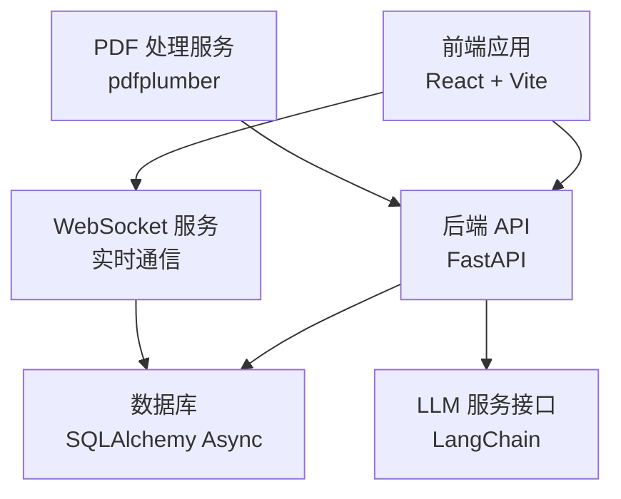
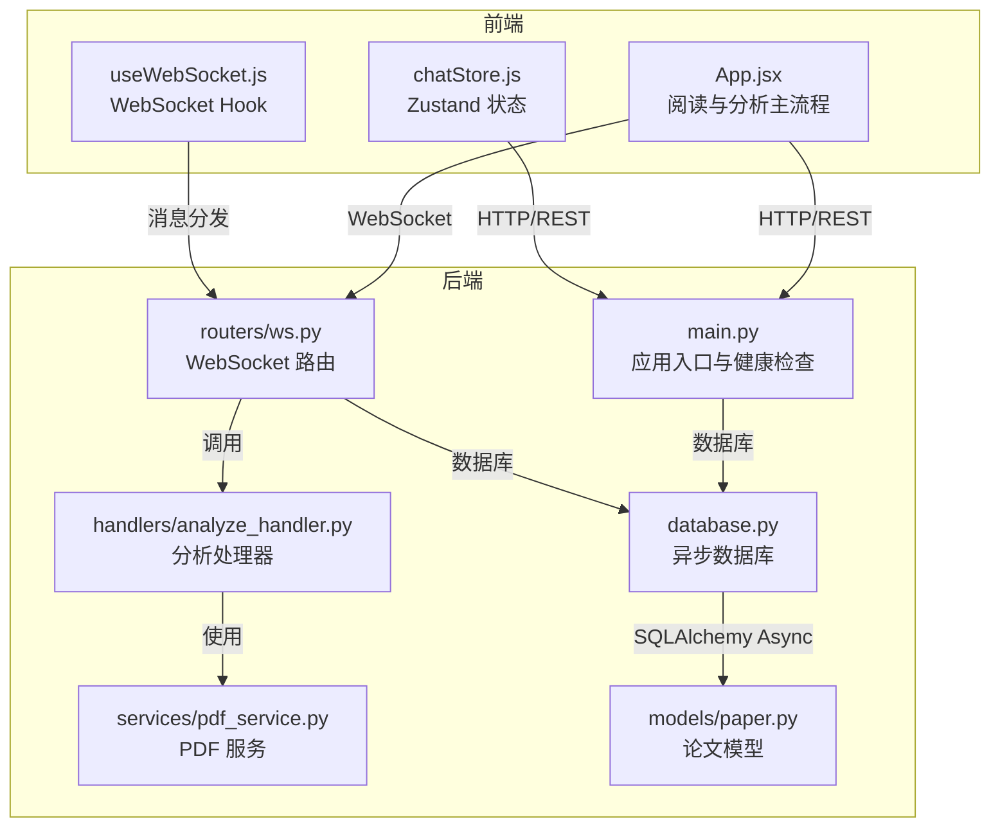
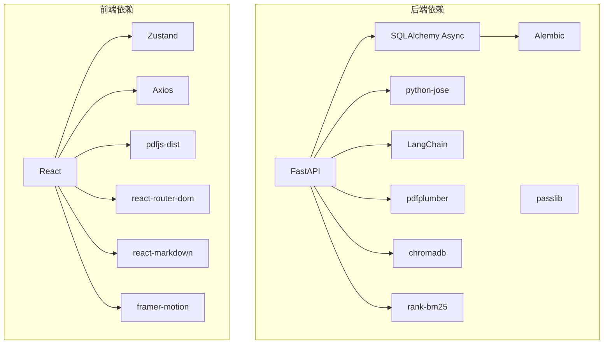

# 测试策略与质量保证

<cite>
**本文引用的文件**   
- [backend/requirements.txt](file://backend/requirements.txt)
- [backend/app/main.py](file://backend/app/main.py)
- [backend/app/config.py](file://backend/app/config.py)
- [backend/app/database.py](file://backend/app/database.py)
- [backend/app/routers/ws.py](file://backend/app/routers/ws.py)
- [backend/app/handlers/analyze_handler.py](file://backend/app/handlers/analyze_handler.py)
- [backend/app/services/pdf_service.py](file://backend/app/services/pdf_service.py)
- [backend/app/models/paper.py](file://backend/app/models/paper.py)
- [frontend/package.json](file://frontend/package.json)
- [frontend/vite.config.js](file://frontend/vite.config.js)
- [frontend/src/App.jsx](file://frontend/src/App.jsx)
- [frontend/src/hooks/useWebSocket.js](file://frontend/src/hooks/useWebSocket.js)
- [frontend/src/stores/chatStore.js](file://frontend/src/stores/chatStore.js)
</cite>

## 目录
1. [引言](#引言)
2. [项目结构](#项目结构)
3. [核心组件](#核心组件)
4. [架构总览](#架构总览)
5. [详细组件分析](#详细组件分析)
6. [依赖分析](#依赖分析)
7. [性能考量](#性能考量)
8. [故障排查指南](#故障排查指南)
9. [结论](#结论)
10. [附录](#附录)

## 引言
本文件面向 PaperChat 项目，制定系统化的测试策略与质量保证方案，覆盖单元测试、集成测试、性能与压力测试、代码质量保障、测试数据与环境管理、缺陷跟踪与修复流程，以及用户体验与可用性评估方法。目标是在保证功能正确性的前提下，持续提升系统稳定性、可维护性与用户体验。

## 项目结构
PaperChat 采用前后端分离架构：
- 后端基于 FastAPI，提供 REST API 与 WebSocket 实时通信，使用 SQLAlchemy Async ORM 进行数据库访问，并通过 Alembic 管理迁移。
- 前端基于 React 19 与 Vite，使用 Zustand 管理状态，Axios 与自定义 WebSocket Hook 进行通信，具备 PDF 阅读、笔记、高亮、分析与聊天等功能模块。

图表来源
- [backend/app/main.py:55-95](file://backend/app/main.py#L55-L95)
- [backend/app/routers/ws.py:76-102](file://backend/app/routers/ws.py#L76-L102)
- [backend/app/database.py:13-27](file://backend/app/database.py#L13-L27)
- [backend/app/services/pdf_service.py:11-194](file://backend/app/services/pdf_service.py#L11-L194)

章节来源
- [backend/app/main.py:1-114](file://backend/app/main.py#L1-L114)
- [frontend/vite.config.js:1-54](file://frontend/vite.config.js#L1-L54)

## 核心组件
- 应用入口与生命周期：后端通过 lifespan 管理数据库初始化与默认用户配置加载；提供健康检查端点。
- 配置管理：集中管理应用名称、调试模式、数据库连接、JWT 密钥、CORS 来源、上传目录与大小限制等。
- 数据库层：异步引擎与会话工厂，提供依赖注入与事务控制；启动时创建表并确保默认用户存在。
- WebSocket 路由：统一接入点，按消息类型分发至分析、问答、RAG、跨文档、Agent 等处理器；支持任务取消与意图识别路由。
- PDF 处理服务：提供元数据提取、文本块提取、全文提取、页数统计与有效性校验。
- 前端应用与状态：ReaderPage 主流程、WebSocket Hook、Zustand Chat Store，支撑阅读、分析、笔记、聊天与推荐等场景。

章节来源
- [backend/app/main.py:16-52](file://backend/app/main.py#L16-L52)
- [backend/app/config.py:15-41](file://backend/app/config.py#L15-L41)
- [backend/app/database.py:30-81](file://backend/app/database.py#L30-L81)
- [backend/app/routers/ws.py:32-436](file://backend/app/routers/ws.py#L32-L436)
- [backend/app/services/pdf_service.py:11-194](file://backend/app/services/pdf_service.py#L11-L194)
- [frontend/src/App.jsx:60-420](file://frontend/src/App.jsx#L60-L420)
- [frontend/src/hooks/useWebSocket.js:19-79](file://frontend/src/hooks/useWebSocket.js#L19-L79)
- [frontend/src/stores/chatStore.js:4-417](file://frontend/src/stores/chatStore.js#L4-L417)

## 架构总览
后端通过 FastAPI 路由暴露 REST 与 WebSocket 接口，前端通过 Axios 与 WebSocket 与后端交互。数据库采用 SQLite（开发环境）并支持异步访问。PDF 解析由 pdfplumber 提供，LLM 服务通过 LangChain 抽象对接外部模型。

图表来源
- [backend/app/main.py:55-114](file://backend/app/main.py#L55-L114)
- [backend/app/routers/ws.py:76-436](file://backend/app/routers/ws.py#L76-L436)
- [backend/app/handlers/analyze_handler.py:13-87](file://backend/app/handlers/analyze_handler.py#L13-L87)
- [backend/app/services/pdf_service.py:11-194](file://backend/app/services/pdf_service.py#L11-L194)
- [backend/app/models/paper.py:11-85](file://backend/app/models/paper.py#L11-L85)
- [backend/app/database.py:13-81](file://backend/app/database.py#L13-L81)
- [frontend/src/App.jsx:60-420](file://frontend/src/App.jsx#L60-L420)
- [frontend/src/hooks/useWebSocket.js:84-180](file://frontend/src/hooks/useWebSocket.js#L84-L180)
- [frontend/src/stores/chatStore.js:4-417](file://frontend/src/stores/chatStore.js#L4-L417)

## 详细组件分析

### 单元测试策略（Python + pytest）
- 测试框架与配置
  - 使用 pytest 作为测试运行器，结合 pytest-asyncio 支持异步测试。
  - 在项目根目录新增 pytest 配置文件，指定测试目录、插件与覆盖率选项。
- 路由与业务逻辑
  - 针对 FastAPI 路由编写单元测试，使用 TestClient 或模拟依赖注入，覆盖正常与异常分支。
  - 对分析处理器、PDF 服务等纯函数与业务逻辑进行隔离测试，确保输入输出与副作用可控。
- 数据库与会话
  - 使用临时数据库或内存数据库（如 SQLite 内存模式）进行测试，确保事务回滚与数据隔离。
  - 通过依赖替换与工厂模式注入测试用 Session，避免真实数据库影响。
- 测试用例设计原则
  - 每个函数/方法至少覆盖成功路径、边界条件与典型错误场景。
  - 使用参数化测试覆盖多种输入组合，减少重复代码。
  - 对异步函数使用 asyncio.run 或 pytest-asyncio 标记，确保协程正确执行。
- 覆盖率要求
  - 要求核心业务模块（handlers、services、models）行覆盖率不低于 80%，分支覆盖率不低于 60%。
  - 对关键路径（WebSocket 消息分发、PDF 解析、数据库写入）进行重点保护。

章节来源
- [backend/requirements.txt:1-19](file://backend/requirements.txt#L1-L19)
- [backend/app/routers/ws.py:76-102](file://backend/app/routers/ws.py#L76-L102)
- [backend/app/handlers/analyze_handler.py:13-87](file://backend/app/handlers/analyze_handler.py#L13-L87)
- [backend/app/services/pdf_service.py:11-194](file://backend/app/services/pdf_service.py#L11-L194)
- [backend/app/database.py:30-81](file://backend/app/database.py#L30-L81)

### 前端测试策略（React + React Testing Library）
- 测试框架与配置
  - 使用 React Testing Library 进行组件测试，搭配 @testing-library/jest-dom 与 jest-environment-jsdom。
  - 在 Vite 环境下通过自定义 Jest 配置支持 ES 模块与 React 组件。
- 组件与状态
  - 对核心组件（ReaderPage、PDFReader、NoteEditor、ChatPanel 等）进行渲染、交互与状态变更测试。
  - 使用 Mock Store 与 Mock WebSocket Hook，隔离真实网络与状态管理。
- 用户交互与事件
  - 覆盖按钮点击、文本选择、拖拽调整、键盘快捷键等用户行为。
  - 验证错误提示、加载状态与空态展示。
- 覆盖率要求
  - 组件与 Hooks 的行覆盖率不低于 75%，关键交互路径不低于 60%。

章节来源
- [frontend/package.json:1-37](file://frontend/package.json#L1-L37)
- [frontend/vite.config.js:1-54](file://frontend/vite.config.js#L1-L54)
- [frontend/src/App.jsx:60-420](file://frontend/src/App.jsx#L60-L420)
- [frontend/src/hooks/useWebSocket.js:84-180](file://frontend/src/hooks/useWebSocket.js#L84-L180)
- [frontend/src/stores/chatStore.js:4-417](file://frontend/src/stores/chatStore.js#L4-L417)

### 集成测试方案
- API 接口测试
  - 使用 FastAPI TestClient 或 Postman/Newman，覆盖论文上传、解析、分析、问答、会话管理等端到端流程。
  - 验证鉴权、CORS、文件大小限制、错误码与响应格式一致性。
- 数据库操作测试
  - 在测试环境中创建临时数据库，验证 Paper、Highlight、Note、User 等模型的增删改查与关系完整性。
  - 检查事务回滚、并发写入与唯一约束。
- WebSocket 通信测试
  - 编写 WebSocket 客户端测试，模拟前端消息发送与接收，验证分析、问答、跨文档、Agent 等消息类型与完成/错误信号。
  - 验证任务取消、连接断开与重连机制。
- 端到端功能测试
  - 通过脚本驱动浏览器（如 Playwright/Cypress），模拟完整用户旅程：登录/匿名、上传 PDF、阅读、高亮、笔记、分析、聊天与导出。
  - 覆盖弱网、慢速 LLM 等边界场景。

章节来源
- [backend/app/routers/ws.py:76-436](file://backend/app/routers/ws.py#L76-L436)
- [backend/app/models/paper.py:11-85](file://backend/app/models/paper.py#L11-L85)
- [frontend/src/App.jsx:60-420](file://frontend/src/App.jsx#L60-L420)
- [frontend/src/hooks/useWebSocket.js:19-79](file://frontend/src/hooks/useWebSocket.js#L19-L79)

### 性能测试与压力测试
- 响应时间测试
  - 使用 Locust/JMeter 对论文分析、RAG 问答、跨文档问答等关键路径进行负载测试，记录 P50/P95 响应时间。
- 并发用户测试
  - 模拟多用户同时进行分析与聊天，观察队列积压、超时与资源占用情况。
- 内存使用监控
  - 在 PDF 大文件解析与长对话场景下，监控进程内存峰值，定位泄漏与优化点。
- 数据库查询优化测试
  - 对高频查询（Paper 列表、高亮/笔记分页、会话消息）进行 EXPLAIN/ANALYZE，优化索引与查询计划。
- WebSocket 压力测试
  - 模拟高并发消息推送与取消，验证连接池、背压与错误恢复。

章节来源
- [backend/app/routers/ws.py:120-436](file://backend/app/routers/ws.py#L120-L436)
- [backend/app/services/pdf_service.py:11-194](file://backend/app/services/pdf_service.py#L11-L194)
- [backend/app/models/paper.py:11-85](file://backend/app/models/paper.py#L11-L85)

### 代码质量保证
- 静态代码分析
  - 后端：使用 ruff/flake8/pylint，配置规则集，强制命名规范、导入顺序与复杂度阈值。
  - 前端：ESLint 配置基础规则与 React Hooks 规则，禁止 console.warn/error 以外的日志级别。
- 代码复杂度检查
  - 控制函数圈复杂度不超过 10，类方法不超过 50 行；超过阈值需重构。
- 重复代码检测
  - 使用 SonarQube/CodeClimate 检测重复片段，统一为通用工具函数或 Hook。
- 安全漏洞扫描
  - 依赖扫描：pip-audit/npm audit，定期更新依赖并修复高危漏洞。
  - 输入校验：JWT 校验、CORS 白名单、文件上传白名单与大小限制。
  - 敏感信息：密钥与令牌不在日志中打印，使用环境变量管理。

章节来源
- [backend/requirements.txt:1-19](file://backend/requirements.txt#L1-L19)
- [backend/app/config.py:15-41](file://backend/app/config.py#L15-L41)
- [frontend/package.json:25-35](file://frontend/package.json#L25-L35)

### 测试数据管理与测试环境配置
- 测试数据库
  - 使用 SQLite 内存数据库或临时文件，配合 Alembic 迁移脚本初始化测试 schema。
- 模拟服务
  - 使用 unittest.mock/Mockito 模拟 LLM 服务与外部 API，固定响应以稳定测试。
- 测试数据生成策略
  - 使用 Factory Boy/Faker 生成论文、高亮、笔记、会话等测试数据，确保字段完整性与一致性。
- 环境隔离
  - 通过环境变量切换测试/开发/生产配置，确保测试不会污染真实数据。

章节来源
- [backend/app/config.py:22-38](file://backend/app/config.py#L22-L38)
- [backend/app/database.py:50-81](file://backend/app/database.py#L50-L81)
- [backend/app/services/pdf_service.py:11-194](file://backend/app/services/pdf_service.py#L11-L194)

### 缺陷跟踪与修复流程
- Bug 分类
  - 功能缺陷、性能退化、安全风险、兼容性问题、可用性问题。
- 优先级评估
  - P0：影响核心功能（上传/解析/分析/聊天）；P1：影响主要流程但可绕过；P2：UI/UX 微缺陷；P3：文档/注释。
- 修复验证
  - 新增/回归测试用例，确保修复生效且无副作用。
- 回归测试
  - 每次发布前执行冒烟测试与关键路径回归，确保稳定性。

章节来源
- [backend/app/routers/ws.py:120-436](file://backend/app/routers/ws.py#L120-L436)
- [frontend/src/App.jsx:60-420](file://frontend/src/App.jsx#L60-L420)

### 用户体验测试与可用性评估
- 可用性测试
  - 通过用户任务观察（上传-阅读-高亮-笔记-分析-聊天），收集完成时间、错误率与主观满意度。
- 可访问性（a11y）
  - 使用 axe/lighthouse 检查键盘导航、屏幕阅读器支持与对比度。
- 性能感知
  - 关注首屏渲染、PDF 加载、分析响应与滚动性能，必要时引入虚拟化与懒加载。
- 用户反馈闭环
  - 建立反馈收集渠道与问题分类，快速迭代改进。

## 依赖分析
- 后端依赖
  - FastAPI、SQLAlchemy Async、Alembic、LangChain 生态、pdfplumber、JWT、Passlib、ChromaDB、RankBM25 等。
- 前端依赖
  - React、Zustand、Axios、pdfjs-dist、react-router-dom、react-markdown、framer-motion 等。
- 关键耦合点
  - WebSocket 与数据库的并发任务管理；PDF 服务与 LLM 服务的异步协作；前端状态与 WebSocket 消息的解耦。

图表来源
- [backend/requirements.txt:1-19](file://backend/requirements.txt#L1-L19)
- [frontend/package.json:12-24](file://frontend/package.json#L12-L24)

章节来源
- [backend/requirements.txt:1-19](file://backend/requirements.txt#L1-L19)
- [frontend/package.json:12-24](file://frontend/package.json#L12-L24)

## 性能考量
- 数据库优化
  - 为高频查询字段建立索引（Paper.reading_status、Paper.user_id、Highlight.paper_id 等）。
  - 使用分页与延迟加载，避免一次性加载大量数据。
- LLM 与检索
  - 对 RAG 与跨文档检索设置超时与重试策略，缓存关键词与分析结果。
- 前端性能
  - 使用 React 虚拟化组件（如 @tanstack/react-virtual）处理长列表；拆分代码块，利用 Vite 的手动分包策略。
  - PDF 渲染采用分页与缩略图，避免一次性渲染全部页面。

章节来源
- [backend/app/models/paper.py:17-36](file://backend/app/models/paper.py#L17-L36)
- [frontend/vite.config.js:20-52](file://frontend/vite.config.js#L20-L52)

## 故障排查指南
- WebSocket 连接问题
  - 检查前端 Token 传递与后端 JWT 解码；确认 CORS 与代理配置；验证连接池与任务取消逻辑。
- PDF 解析失败
  - 校验文件头与扩展名，捕获解析异常并返回友好错误；对空页与特殊格式做容错处理。
- 数据库异常
  - 检查会话提交/回滚与连接释放；在并发场景下避免死锁与重复写入。
- 前端状态异常
  - 使用 Redux DevTools/Zustand Devtools 观察状态变化；隔离 WebSocket 与 HTTP 请求的影响。

章节来源
- [frontend/src/hooks/useWebSocket.js:19-79](file://frontend/src/hooks/useWebSocket.js#L19-L79)
- [backend/app/routers/ws.py:32-54](file://backend/app/routers/ws.py#L32-L54)
- [backend/app/services/pdf_service.py:163-190](file://backend/app/services/pdf_service.py#L163-L190)
- [backend/app/database.py:39-47](file://backend/app/database.py#L39-L47)
- [frontend/src/stores/chatStore.js:4-417](file://frontend/src/stores/chatStore.js#L4-L417)

## 结论
通过完善的测试策略与质量保证体系，PaperChat 可在快速迭代的同时保持高质量交付。建议持续完善自动化测试覆盖率、性能监控与用户体验评估，形成从开发到运维的闭环质量管理体系。

## 附录
- 测试清单
  - 单元测试：handlers、services、models、utils
  - 集成测试：API、WebSocket、数据库、PDF
  - 性能测试：响应时间、并发、内存、查询优化
  - 质量检查：静态分析、复杂度、重复代码、安全扫描
  - 用户体验：可访问性、性能感知、用户反馈