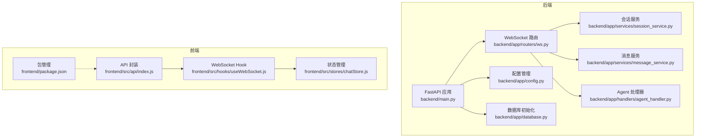
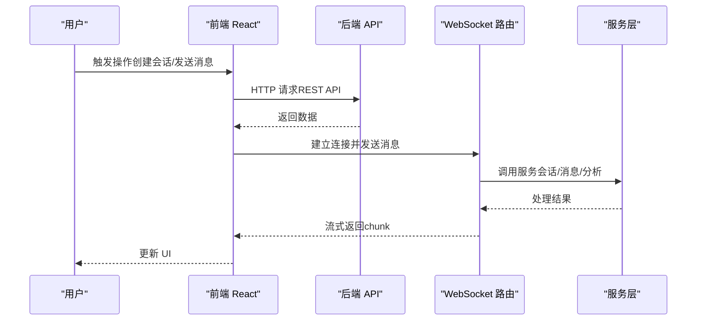
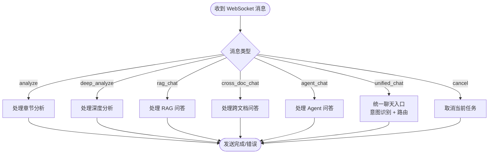
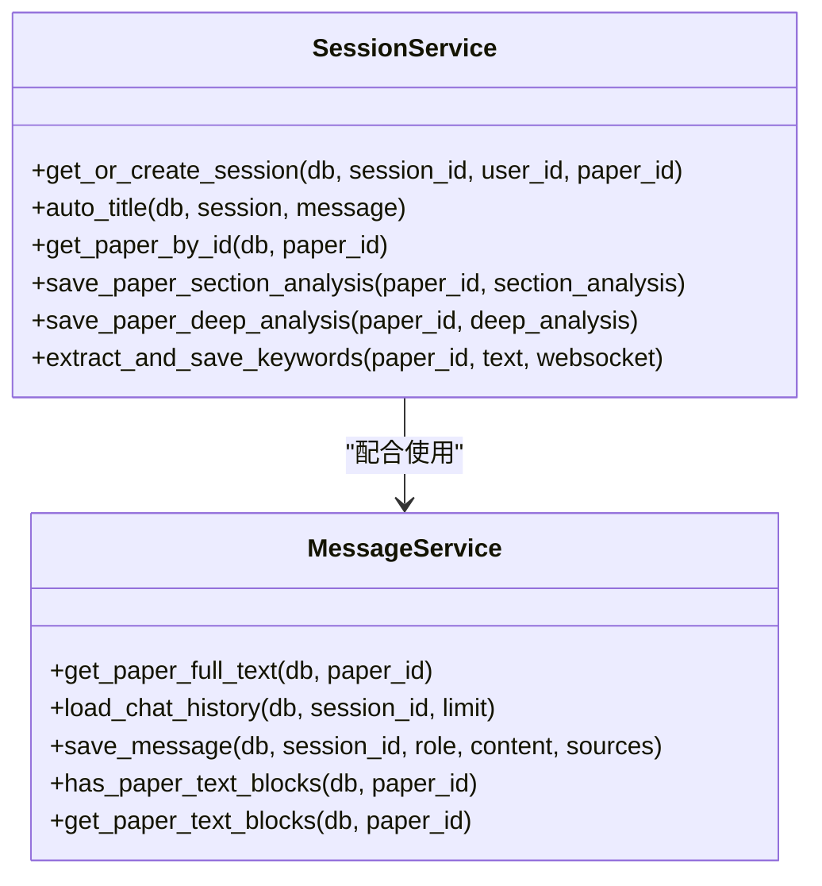
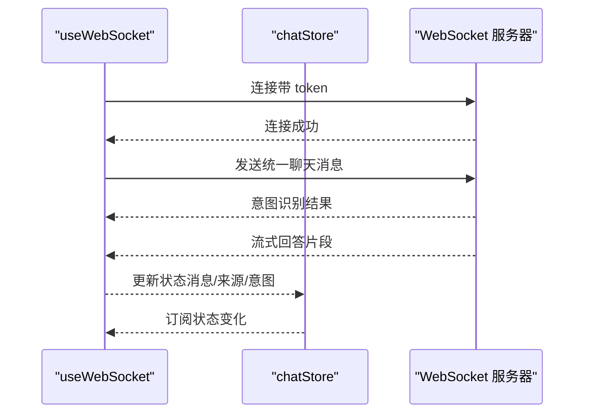
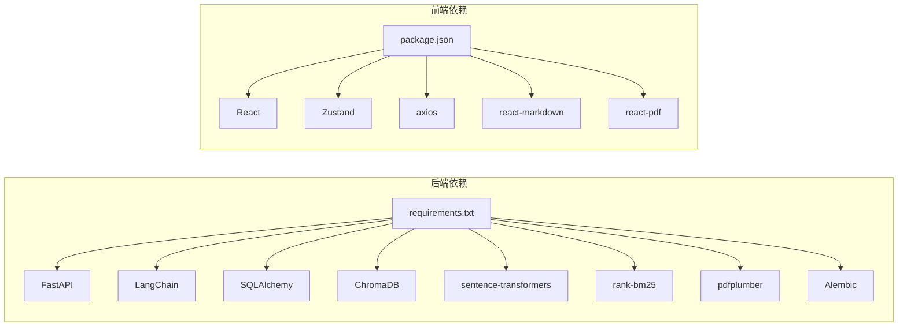

# 贡献指南

<cite>
**本文档引用的文件**
- [README.md](file://README.md)
- [优化计划.md](file://优化计划.md)
- [开发计划.md](file://开发计划.md)
- [backend/main.py](file://backend/main.py)
- [backend/app/config.py](file://backend/app/config.py)
- [backend/app/database.py](file://backend/app/database.py)
- [backend/app/routers/ws.py](file://backend/app/routers/ws.py)
- [backend/app/handlers/agent_handler.py](file://backend/app/handlers/agent_handler.py)
- [backend/app/services/session_service.py](file://backend/app/services/session_service.py)
- [backend/app/services/message_service.py](file://backend/app/services/message_service.py)
- [backend/requirements.txt](file://backend/requirements.txt)
- [frontend/package.json](file://frontend/package.json)
- [frontend/README.md](file://frontend/README.md)
- [frontend/src/api/index.js](file://frontend/src/api/index.js)
- [frontend/src/hooks/useWebSocket.js](file://frontend/src/hooks/useWebSocket.js)
- [frontend/src/stores/chatStore.js](file://frontend/src/stores/chatStore.js)
</cite>

## 目录
1. [简介](#简介)
2. [项目结构](#项目结构)
3. [核心组件](#核心组件)
4. [架构总览](#架构总览)
5. [详细组件分析](#详细组件分析)
6. [依赖分析](#依赖分析)
7. [性能考量](#性能考量)
8. [故障排除指南](#故障排除指南)
9. [结论](#结论)
10. [附录](#附录)

## 简介
本指南面向希望参与 PaperChat 项目的开发者，提供从 Fork 项目、创建功能分支、提交代码到发起 Pull Request 的完整流程；规范问题报告与功能请求模板；明确代码贡献要求（代码风格、测试、文档与兼容性）；说明社区行为准则与沟通规范；阐述维护者职责与决策流程；给出新贡献者入门建议；并介绍知识产权与许可信息以及贡献认可机制。

PaperChat 是一个基于云端大模型的智能论文分析系统，支持 PDF 上传、AI 论文结构化解析、智能问答、知识管理与写作辅助。项目采用前后端分离架构：后端基于 FastAPI + SQLAlchemy + LangChain，前端基于 React + Vite + Zustand，并通过 WebSocket 实现实时流式通信。

## 项目结构
- 后端（Python/异步）：FastAPI 应用、路由、服务层、数据模型与数据库初始化
- 前端（JavaScript/React）：页面组件、状态管理（Zustand）、API 封装、WebSocket Hook
- 开发与优化文档：优化计划、开发计划、README

**图表来源**
- [backend/main.py:1-148](file://backend/main.py#L1-L148)
- [backend/app/routers/ws.py:1-436](file://backend/app/routers/ws.py#L1-L436)
- [backend/app/config.py:1-44](file://backend/app/config.py#L1-L44)
- [backend/app/database.py:1-81](file://backend/app/database.py#L1-L81)
- [backend/app/services/session_service.py:1-134](file://backend/app/services/session_service.py#L1-L134)
- [backend/app/services/message_service.py:1-72](file://backend/app/services/message_service.py#L1-L72)
- [backend/app/handlers/agent_handler.py:1-67](file://backend/app/handlers/agent_handler.py#L1-L67)
- [frontend/src/api/index.js:1-12](file://frontend/src/api/index.js#L1-L12)
- [frontend/src/hooks/useWebSocket.js:1-180](file://frontend/src/hooks/useWebSocket.js#L1-L180)
- [frontend/src/stores/chatStore.js:1-417](file://frontend/src/stores/chatStore.js#L1-L417)
- [frontend/package.json:1-37](file://frontend/package.json#L1-L37)

**章节来源**
- [README.md:72-183](file://README.md#L72-L183)
- [backend/main.py:1-148](file://backend/main.py#L1-L148)
- [frontend/package.json:1-37](file://frontend/package.json#L1-L37)

## 核心组件
- 后端应用与路由
  - FastAPI 应用入口与健康检查端点
  - WebSocket 路由集中处理多种消息类型（分析、问答、RAG、跨文档、Agent、统一聊天）
- 服务层
  - 会话服务：会话创建、标题自动命名、论文查询
  - 消息服务：全文文本获取、历史加载、消息保存
- 前端通信与状态
  - API 封装：统一 axios 实例
  - WebSocket Hook：全局连接、断线重连、消息分发
  - Zustand 状态：会话、消息、跨文档、联网搜索、统一聊天意图

**章节来源**
- [backend/app/routers/ws.py:76-436](file://backend/app/routers/ws.py#L76-L436)
- [backend/app/services/session_service.py:17-134](file://backend/app/services/session_service.py#L17-L134)
- [backend/app/services/message_service.py:14-72](file://backend/app/services/message_service.py#L14-L72)
- [frontend/src/api/index.js:1-12](file://frontend/src/api/index.js#L1-L12)
- [frontend/src/hooks/useWebSocket.js:1-180](file://frontend/src/hooks/useWebSocket.js#L1-L180)
- [frontend/src/stores/chatStore.js:1-417](file://frontend/src/stores/chatStore.js#L1-L417)

## 架构总览
PaperChat 采用“后端 API + WebSocket + 前端 React”的架构。后端提供 REST API 与 WebSocket，前端通过 axios 与 WebSocket 与后端交互，状态通过 Zustand 管理。

**图表来源**
- [backend/app/routers/ws.py:76-436](file://backend/app/routers/ws.py#L76-L436)
- [frontend/src/hooks/useWebSocket.js:19-71](file://frontend/src/hooks/useWebSocket.js#L19-L71)
- [frontend/src/stores/chatStore.js:203-233](file://frontend/src/stores/chatStore.js#L203-L233)

## 详细组件分析

### WebSocket 通信与消息处理
- 支持的消息类型：分析、问答、RAG、跨文档、深度分析、Agent、统一聊天、取消
- 连接认证：支持 JWT Token，未提供时降级为默认用户
- 任务管理：每个连接维护 ConnectionState，跟踪运行中的任务并支持取消
- 统一聊天：基于关键词进行意图识别，自动路由到不同处理函数

**图表来源**
- [backend/app/routers/ws.py:120-417](file://backend/app/routers/ws.py#L120-L417)

**章节来源**
- [backend/app/routers/ws.py:1-436](file://backend/app/routers/ws.py#L1-L436)

### 会话与消息服务
- 会话服务：获取/创建会话、自动命名、论文查询、关键词提取
- 消息服务：全文文本拼接、历史加载、消息保存、文本块检查

**图表来源**
- [backend/app/services/session_service.py:17-134](file://backend/app/services/session_service.py#L17-L134)
- [backend/app/services/message_service.py:14-72](file://backend/app/services/message_service.py#L14-L72)

**章节来源**
- [backend/app/services/session_service.py:1-134](file://backend/app/services/session_service.py#L1-L134)
- [backend/app/services/message_service.py:1-72](file://backend/app/services/message_service.py#L1-L72)

### 前端状态与通信
- API 封装：统一 baseURL 与请求头
- WebSocket Hook：全局连接、断线重连、消息订阅
- Zustand 状态：会话 CRUD、消息流式更新、跨文档、联网搜索、统一聊天意图

**图表来源**
- [frontend/src/hooks/useWebSocket.js:19-71](file://frontend/src/hooks/useWebSocket.js#L19-L71)
- [frontend/src/stores/chatStore.js:395-413](file://frontend/src/stores/chatStore.js#L395-L413)

**章节来源**
- [frontend/src/api/index.js:1-12](file://frontend/src/api/index.js#L1-L12)
- [frontend/src/hooks/useWebSocket.js:1-180](file://frontend/src/hooks/useWebSocket.js#L1-L180)
- [frontend/src/stores/chatStore.js:1-417](file://frontend/src/stores/chatStore.js#L1-L417)

## 依赖分析
- 后端依赖：FastAPI、Uvicorn、LangChain、SQLAlchemy、ChromaDB、sentence-transformers、rank-bm25、pdfplumber、Alembic 等
- 前端依赖：React、Vite、Zustand、react-router-dom、PDF.js、axios、react-markdown、framer-motion、react-dropzone 等

**图表来源**
- [backend/requirements.txt:1-19](file://backend/requirements.txt#L1-L19)
- [frontend/package.json:12-35](file://frontend/package.json#L12-L35)

**章节来源**
- [backend/requirements.txt:1-19](file://backend/requirements.txt#L1-L19)
- [frontend/package.json:1-37](file://frontend/package.json#L1-L37)

## 性能考量
- WebSocket 连接与任务管理：支持取消与并发任务跟踪，避免资源泄漏
- 会话与消息：自动命名与历史加载，减少不必要的数据库查询
- 前端渲染：消息列表与 Markdown 渲染优化，建议结合虚拟列表与 memo 化
- 后端检索：RAG 检索与索引缓存，避免重复构建 BM25 索引
- 数据库：连接池与事务管理，确保并发安全

**章节来源**
- [backend/app/routers/ws.py:56-113](file://backend/app/routers/ws.py#L56-L113)
- [backend/app/services/session_service.py:45-54](file://backend/app/services/session_service.py#L45-L54)
- [backend/app/services/message_service.py:24-42](file://backend/app/services/message_service.py#L24-L42)
- [优化计划.md:121-142](file://优化计划.md#L121-L142)

## 故障排除指南
- WebSocket 未连接或断开
  - 检查前端 Hook 的连接状态与重连逻辑
  - 确认后端路由是否正确处理 token
- 会话/消息异常
  - 核对会话服务与消息服务的数据库操作
  - 检查消息历史加载与全文文本拼接
- 前端状态不更新
  - 确认 Zustand 状态更新方法与订阅
  - 检查 axios 封装与错误处理

**章节来源**
- [frontend/src/hooks/useWebSocket.js:19-71](file://frontend/src/hooks/useWebSocket.js#L19-L71)
- [frontend/src/stores/chatStore.js:203-233](file://frontend/src/stores/chatStore.js#L203-L233)
- [backend/app/services/session_service.py:17-43](file://backend/app/services/session_service.py#L17-L43)
- [backend/app/services/message_service.py:14-42](file://backend/app/services/message_service.py#L14-L42)

## 结论
本指南提供了参与 PaperChat 项目的一站式流程与规范，涵盖从开发环境搭建到贡献验收的全流程。建议贡献者在提交前阅读优化计划与开发计划，关注当前优先级与架构演进方向，确保贡献与项目目标一致。

## 附录

### 一、参与流程（Fork → 分支 → 提交 → PR）
- Fork 仓库至个人账号
- 创建功能分支（建议以 issue 编号命名，如 feature/issue-XXX）
- 提交代码并附上变更说明
- 发起 Pull Request，填写模板并关联相关 Issue

[本节为通用流程说明，不直接分析具体文件]

### 二、问题报告与功能请求模板
- Bug 报告模板
  - 环境信息：操作系统、浏览器/Node 版本、Python 版本
  - 复现步骤：最小可复现步骤
  - 预期行为与实际行为
  - 日志与截图（如有）
- 功能请求模板
  - 背景与动机
  - 期望功能描述
  - 影响范围与兼容性考虑
  - 优先级建议

[本节为模板说明，不直接分析具体文件]

### 三、代码贡献要求
- 代码风格
  - 后端：遵循 Python 代码规范，必要时使用 linter
  - 前端：ESLint 规则，建议使用 TypeScript
- 测试
  - 后端：为关键服务（RAG、Agent、会话）编写单元测试
  - 前端：为 Store 与关键组件编写测试
- 文档
  - 新增功能需更新 README 或新增文档
  - API 变更需同步更新接口文档
- 兼容性
  - 保持向后兼容或提供迁移指南
  - 数据库迁移使用 Alembic

**章节来源**
- [优化计划.md:566-593](file://优化计划.md#L566-L593)
- [开发计划.md:339-353](file://开发计划.md#L339-L353)

### 四、社区行为准则与沟通规范
- 讨论礼仪：尊重他人、聚焦技术、提供可验证信息
- 反馈处理：及时响应、明确结论、记录决策
- 冲突解决：寻求共识、必要时由维护者裁决

[本节为通用规范说明，不直接分析具体文件]

### 五、维护者职责与决策流程
- 代码审查标准：功能正确性、性能与安全性、可维护性
- 发布流程：版本号管理、变更日志、兼容性声明
- 版本管理：语义化版本，重大变更需迁移指南

**章节来源**
- [README.md:469-772](file://README.md#L469-L772)

### 六、新贡献者入门指导
- 开发环境搭建：后端 Python 3.10+、前端 Node 18+
- 快速开始：后端依赖安装、前端依赖安装、启动命令
- 第一个 Issue：选择标记为 good first issue 的任务
- 导师制度：通过 Issue/PR 与维护者互动，寻求指导

**章节来源**
- [README.md:185-239](file://README.md#L185-L239)
- [开发计划.md:34-60](file://开发计划.md#L34-L60)

### 七、知识产权与许可
- 许可证：项目采用开源许可证（具体以仓库许可为准）
- 贡献者许可协议：首次贡献时签署或默认同意相关条款

[本节为通用信息说明，不直接分析具体文件]

### 八、贡献认可与奖励
- 贡献者名单：在贡献者列表中致谢
- 成就徽章：根据贡献类型授予徽章
- 社区活动：定期线上分享与线下聚会

[本节为通用信息说明，不直接分析具体文件]