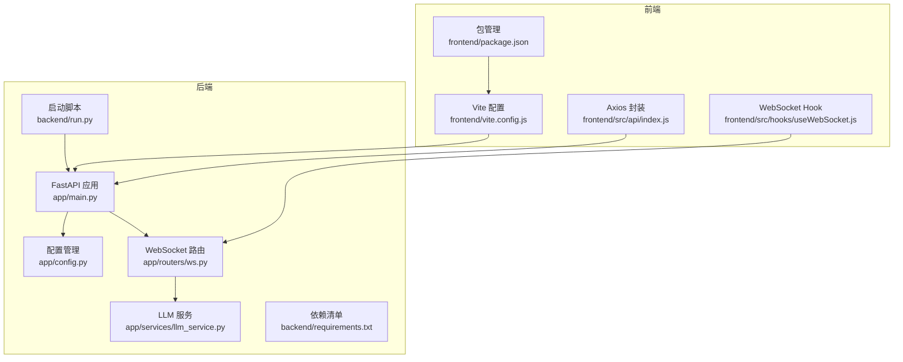
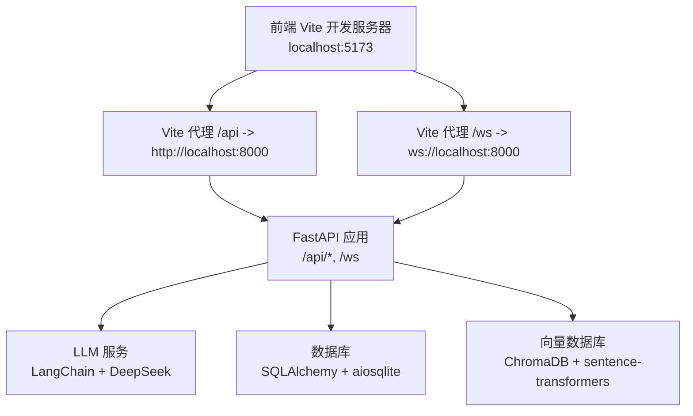
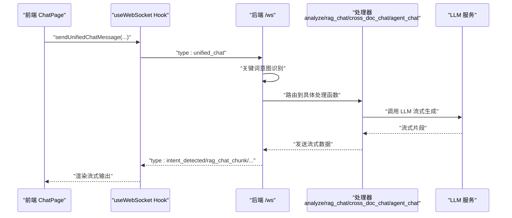
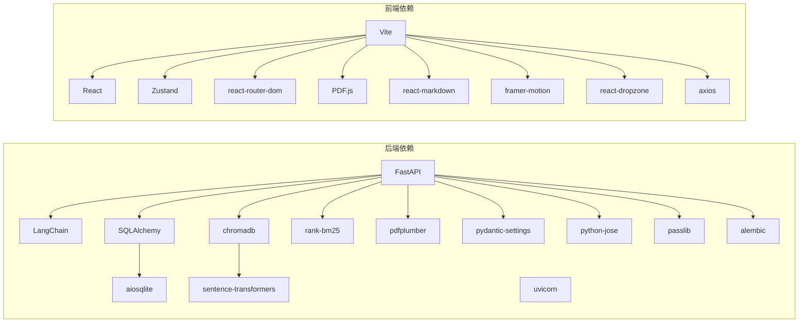

# 快速开始

<cite>
**本文引用的文件**
- [README.md](file://README.md)
- [backend/run.py](file://backend/run.py)
- [backend/main.py](file://backend/main.py)
- [backend/app/main.py](file://backend/app/main.py)
- [backend/app/config.py](file://backend/app/config.py)
- [backend/.env.example](file://backend/.env.example)
- [backend/requirements.txt](file://backend/requirements.txt)
- [backend/app/routers/ws.py](file://backend/app/routers/ws.py)
- [backend/app/services/llm_service.py](file://backend/app/services/llm_service.py)
- [frontend/package.json](file://frontend/package.json)
- [frontend/vite.config.js](file://frontend/vite.config.js)
- [frontend/src/api/index.js](file://frontend/src/api/index.js)
- [frontend/src/hooks/useWebSocket.js](file://frontend/src/hooks/useWebSocket.js)
</cite>

## 目录
1. [简介](#简介)
2. [项目结构](#项目结构)
3. [核心组件](#核心组件)
4. [架构总览](#架构总览)
5. [详细组件分析](#详细组件分析)
6. [依赖关系分析](#依赖关系分析)
7. [性能考虑](#性能考虑)
8. [故障排查指南](#故障排查指南)
9. [结论](#结论)
10. [附录](#附录)

## 简介
本指南面向希望快速搭建并运行 PaperChat 的开发者，覆盖环境准备、依赖安装、配置与启动、常见问题排查以及验证步骤。PaperChat 是一个基于云端大模型的学术论文智能阅读与问答系统，采用前后端分离架构：后端使用 FastAPI + LangChain + SQLAlchemy，前端使用 React + Vite。系统支持 PDF 上传、论文解析、RAG 增强问答、高亮标注、笔记与知识库、写作辅助、Agent 智能体、跨文档问答与统一聊天入口等能力。

## 项目结构
- 后端（Python 3.10+，FastAPI，uvicorn，LangChain，SQLAlchemy，ChromaDB，sentence-transformers 等）
- 前端（React 19，Vite 8，Zustand，react-router-dom，PDF.js 等）

图表来源
- [backend/app/main.py:55-95](file://backend/app/main.py#L55-L95)
- [backend/app/config.py:15-41](file://backend/app/config.py#L15-L41)
- [backend/app/routers/ws.py:47-70](file://backend/app/routers/ws.py#L47-L70)
- [backend/app/services/llm_service.py:360-458](file://backend/app/services/llm_service.py#L360-L458)
- [backend/run.py:23-30](file://backend/run.py#L23-L30)
- [backend/requirements.txt:1-19](file://backend/requirements.txt#L1-L19)
- [frontend/vite.config.js:7-17](file://frontend/vite.config.js#L7-L17)
- [frontend/src/api/index.js:4-9](file://frontend/src/api/index.js#L4-L9)
- [frontend/src/hooks/useWebSocket.js:3-5](file://frontend/src/hooks/useWebSocket.js#L3-L5)
- [frontend/package.json:6-11](file://frontend/package.json#L6-L11)

章节来源
- [README.md:72-183](file://README.md#L72-L183)

## 核心组件
- 后端应用入口与生命周期：创建 FastAPI 应用、注册中间件与路由、数据库初始化与关闭。
- 配置管理：从 .env 读取配置，包括 DeepSeek API Key、数据库连接、JWT、CORS、上传目录与大小限制等。
- WebSocket 路由：统一聊天入口、RAG 问答、跨文档问答、章节/深度分析、Agent 智能体等消息类型处理。
- LLM 服务：基于 LangChain 的 DeepSeek 大模型交互，支持流式输出、RAG 检索、术语解释、摘要、翻译、深度分析、多论文对比与写作辅助等。
- 前端代理与 API：Vite 代理到后端 8000 端口；Axios 封装统一 API 基址；WebSocket Hook 管理连接与消息分发。

章节来源
- [backend/app/main.py:16-53](file://backend/app/main.py#L16-L53)
- [backend/app/config.py:15-41](file://backend/app/config.py#L15-L41)
- [backend/app/routers/ws.py:47-70](file://backend/app/routers/ws.py#L47-L70)
- [backend/app/services/llm_service.py:360-458](file://backend/app/services/llm_service.py#L360-L458)
- [frontend/vite.config.js:7-17](file://frontend/vite.config.js#L7-L17)
- [frontend/src/api/index.js:4-9](file://frontend/src/api/index.js#L4-L9)
- [frontend/src/hooks/useWebSocket.js:3-5](file://frontend/src/hooks/useWebSocket.js#L3-L5)

## 架构总览
后端通过 uvicorn 启动 FastAPI 应用，前端通过 Vite 开发服务器运行。前端通过 /api 前缀代理到后端 8000 端口，WebSocket 通过 /ws 代理到后端。后端使用 LangChain 与 DeepSeek API 进行流式对话与论文分析，使用 SQLAlchemy + aiosqlite 进行异步数据库操作，使用 ChromaDB + sentence-transformers 进行向量检索。

图表来源
- [frontend/vite.config.js:7-17](file://frontend/vite.config.js#L7-L17)
- [backend/app/main.py:62-77](file://backend/app/main.py#L62-L77)
- [backend/app/services/llm_service.py:360-458](file://backend/app/services/llm_service.py#L360-L458)

## 详细组件分析

### 环境与依赖准备
- Python 3.10+：满足后端依赖版本要求。
- Node.js 18+：满足前端依赖版本要求。
- DeepSeek API Key：用于 LLM 服务调用，需在后端 .env 中配置。

章节来源
- [README.md:187-191](file://README.md#L187-L191)
- [backend/.env.example](file://backend/.env.example#L10)
- [backend/requirements.txt:1-19](file://backend/requirements.txt#L1-L19)
- [frontend/package.json:12-23](file://frontend/package.json#L12-L23)

### 后端环境搭建与启动
- 复制并编辑 .env：复制 .env.example 为 .env，并填入 DEEPSEEK_API_KEY 等配置。
- 虚拟环境（可选）：创建并激活 Python 虚拟环境。
- 安装依赖：pip install -r backend/requirements.txt。
- 启动方式：
  - 使用启动脚本：python backend/run.py。
  - 直接使用 uvicorn：uvicorn backend.app.main:app --host 0.0.0.0 --port 8000 --reload。

章节来源
- [README.md:193-222](file://README.md#L193-L222)
- [backend/run.py:23-30](file://backend/run.py#L23-L30)
- [backend/app/main.py:98-99](file://backend/app/main.py#L98-L99)

### 前端环境搭建与启动
- 安装依赖：npm install。
- 启动开发服务器：npm run dev。
- 访问地址：http://localhost:5173。

章节来源
- [README.md:224-238](file://README.md#L224-L238)
- [frontend/package.json:6-11](file://frontend/package.json#L6-L11)

### 配置管理与环境变量
- .env 示例包含 DEEPSEEK_API_KEY、DATABASE_URL、JWT、CORS、上传目录与大小限制等。
- 配置类从 .env 读取并提供默认值，支持调试模式与应用名称等。

章节来源
- [backend/.env.example:10-44](file://backend/.env.example#L10-L44)
- [backend/app/config.py:15-41](file://backend/app/config.py#L15-L41)

### WebSocket 通信与统一聊天入口
- 前端通过 useWebSocket.js 管理连接与消息分发，支持统一聊天入口 unified_chat，自动根据关键词识别意图并路由到不同处理函数（章节分析、深度分析、跨文档问答、RAG 问答）。
- 后端 ws.py 路由负责消息类型分发、任务取消、会话与历史管理、引用来源返回等。

图表来源
- [frontend/src/hooks/useWebSocket.js:138-152](file://frontend/src/hooks/useWebSocket.js#L138-L152)
- [backend/app/routers/ws.py:223-377](file://backend/app/routers/ws.py#L223-L377)
- [backend/app/services/llm_service.py:460-582](file://backend/app/services/llm_service.py#L460-L582)

章节来源
- [frontend/src/hooks/useWebSocket.js:3-5](file://frontend/src/hooks/useWebSocket.js#L3-L5)
- [backend/app/routers/ws.py:47-70](file://backend/app/routers/ws.py#L47-L70)

### API 与健康检查
- 健康检查端点：/api/health，返回应用状态信息。
- 前端通过 axios 封装统一访问 /api 前缀，Vite 代理到后端 8000 端口。

章节来源
- [backend/app/main.py:102-113](file://backend/app/main.py#L102-L113)
- [frontend/src/api/index.js:4-9](file://frontend/src/api/index.js#L4-L9)
- [frontend/vite.config.js:7-17](file://frontend/vite.config.js#L7-L17)

## 依赖关系分析
- 后端依赖：FastAPI、uvicorn、LangChain、SQLAlchemy、aiosqlite、pydantic-settings、python-jose、passlib、pdfplumber、chromadb、sentence-transformers、rank-bm25、alembic 等。
- 前端依赖：React、Vite、Zustand、react-router-dom、PDF.js、react-markdown、framer-motion、react-dropzone、axios 等。

图表来源
- [backend/requirements.txt:1-19](file://backend/requirements.txt#L1-L19)
- [frontend/package.json:12-33](file://frontend/package.json#L12-L33)

章节来源
- [backend/requirements.txt:1-19](file://backend/requirements.txt#L1-L19)
- [frontend/package.json:12-33](file://frontend/package.json#L12-L33)

## 性能考虑
- 流式输出：后端 LLM 服务与前端 WebSocket 均采用流式传输，减少等待时间，提升交互体验。
- 向量检索：ChromaDB + sentence-transformers 提供高效的论文检索，配合 RAG 减少上下文长度与 token 消耗。
- 代理与端口：Vite 代理到后端 8000 端口，避免跨域与本地开发复杂性。
- 任务取消：WebSocket 路由支持取消当前任务，避免资源浪费。

章节来源
- [backend/app/services/llm_service.py:460-582](file://backend/app/services/llm_service.py#L460-L582)
- [backend/app/routers/ws.py:213-221](file://backend/app/routers/ws.py#L213-L221)

## 故障排查指南
- 端口占用
  - 后端默认端口 8000，前端默认端口 5173。若端口被占用，可在启动时更换端口或释放占用进程。
  - 前端代理配置指向后端 8000 端口，确保后端已启动。
- 依赖版本不兼容
  - 后端依赖版本在 requirements.txt 中声明，建议使用 Python 3.10+ 与 Node.js 18+。
  - 前端依赖版本在 package.json 中声明，确保使用 Node.js 18+。
- API Key 配置错误
  - 在 .env 中正确填写 DEEPSEEK_API_KEY，确保网络可达且额度充足。
  - 如出现流式输出异常，检查 LLM 服务配置与网络连接。
- CORS 跨域问题
  - 后端 CORS 默认允许前端 localhost:5173/5174，若前端端口变化需同步修改。
- 数据库初始化失败
  - 初次运行会自动初始化数据库与表，若失败检查数据库路径权限与磁盘空间。

章节来源
- [backend/app/main.py:70-77](file://backend/app/main.py#L70-L77)
- [backend/app/config.py:34-38](file://backend/app/config.py#L34-L38)
- [backend/.env.example:10-44](file://backend/.env.example#L10-L44)
- [frontend/vite.config.js:7-17](file://frontend/vite.config.js#L7-L17)

## 结论
按照本指南完成环境准备、依赖安装与配置后，即可启动后端与前端服务并访问应用。系统支持统一聊天入口、RAG 增强问答、跨文档问答、论文解析与写作辅助等核心功能。如遇问题，可依据“故障排查指南”逐步定位与解决。

## 附录

### 端口说明
- 前端开发服务器：5173
- 后端 API / WebSocket：8000

章节来源
- [README.md:384-389](file://README.md#L384-L389)

### 验证安装成功
- 后端健康检查：访问 http://localhost:8000/api/health，返回状态正常。
- 前端页面：访问 http://localhost:5173，页面可正常加载。
- WebSocket 连接：在聊天页面发起一次问答，观察流式输出是否正常。

章节来源
- [backend/app/main.py:102-113](file://backend/app/main.py#L102-L113)
- [frontend/vite.config.js:7-17](file://frontend/vite.config.js#L7-L17)
- [frontend/src/hooks/useWebSocket.js:138-152](file://frontend/src/hooks/useWebSocket.js#L138-L152)