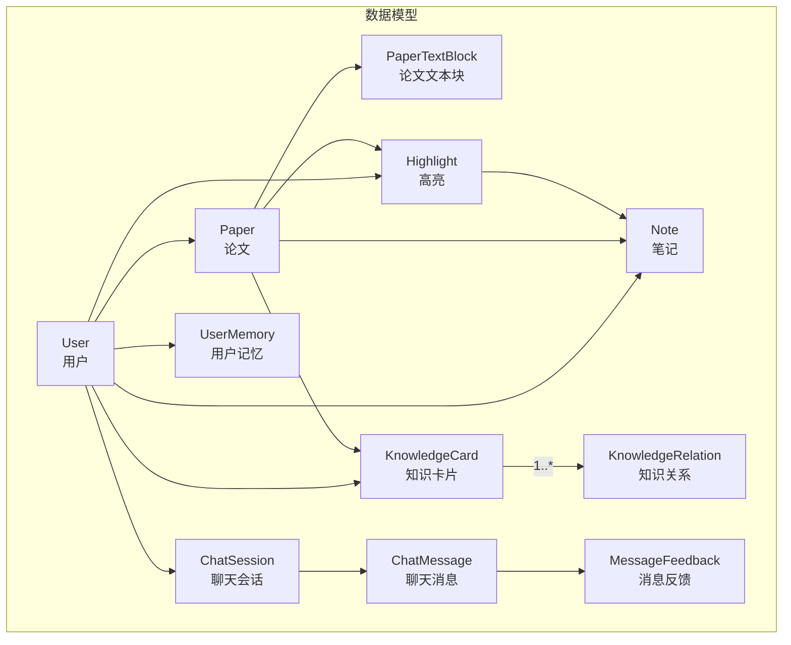
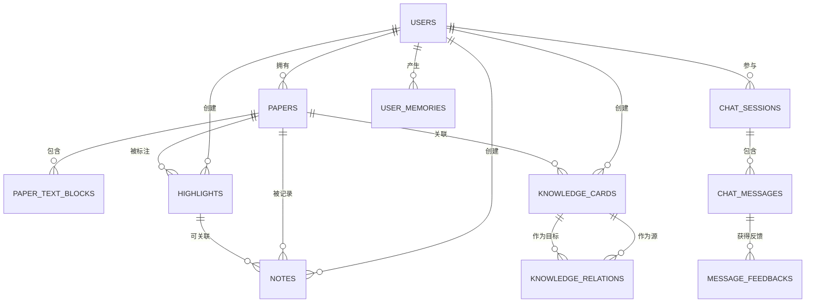
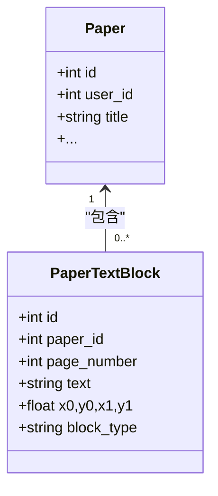
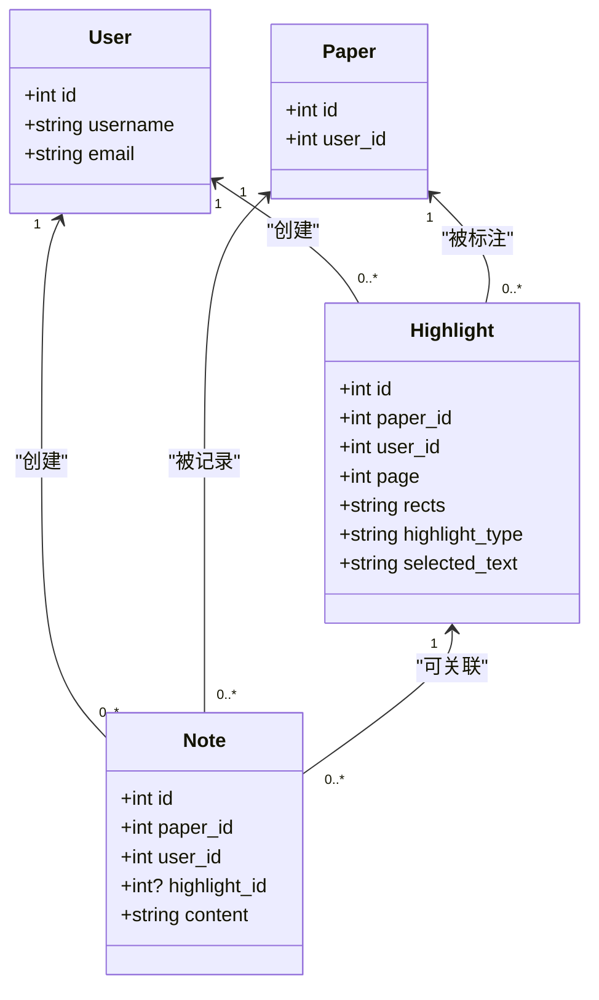
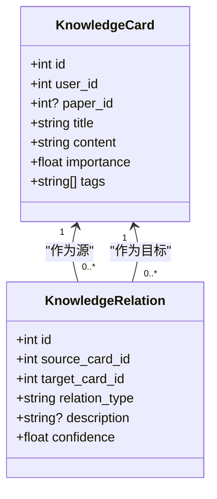
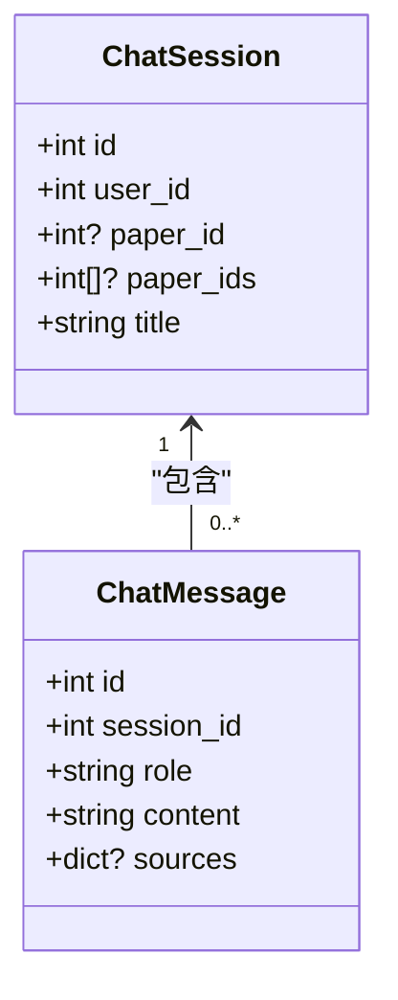
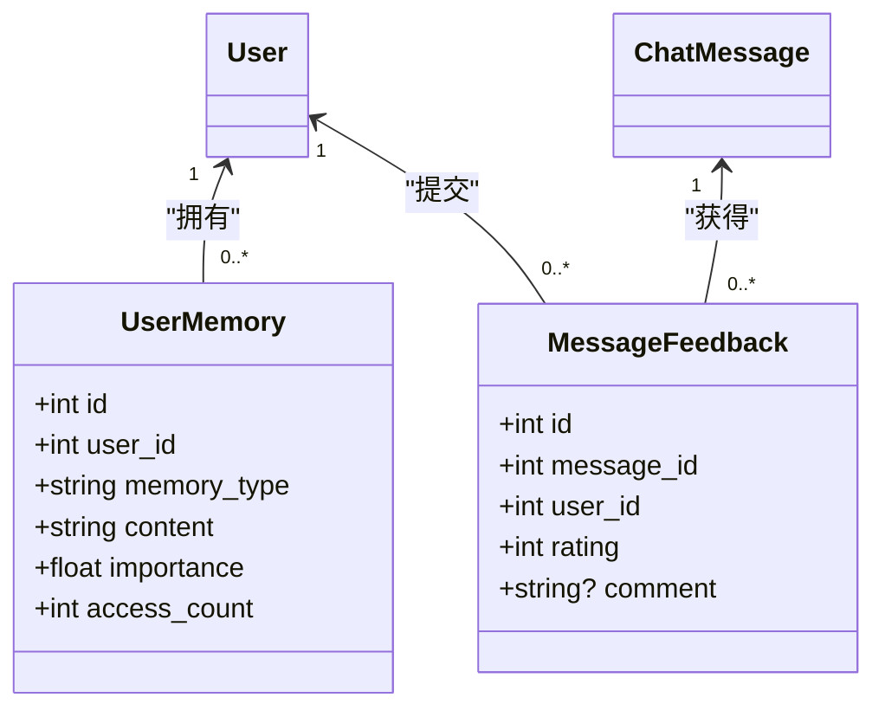
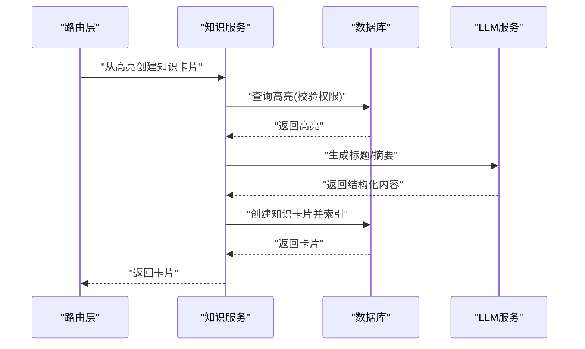
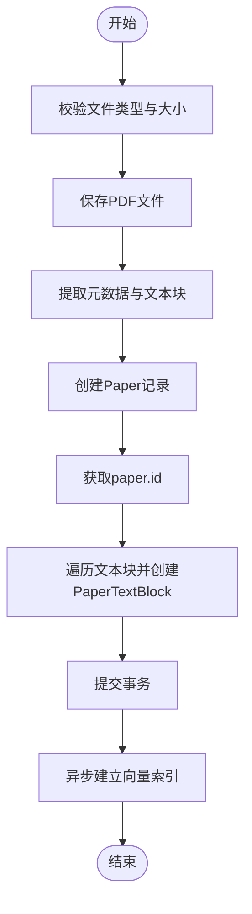
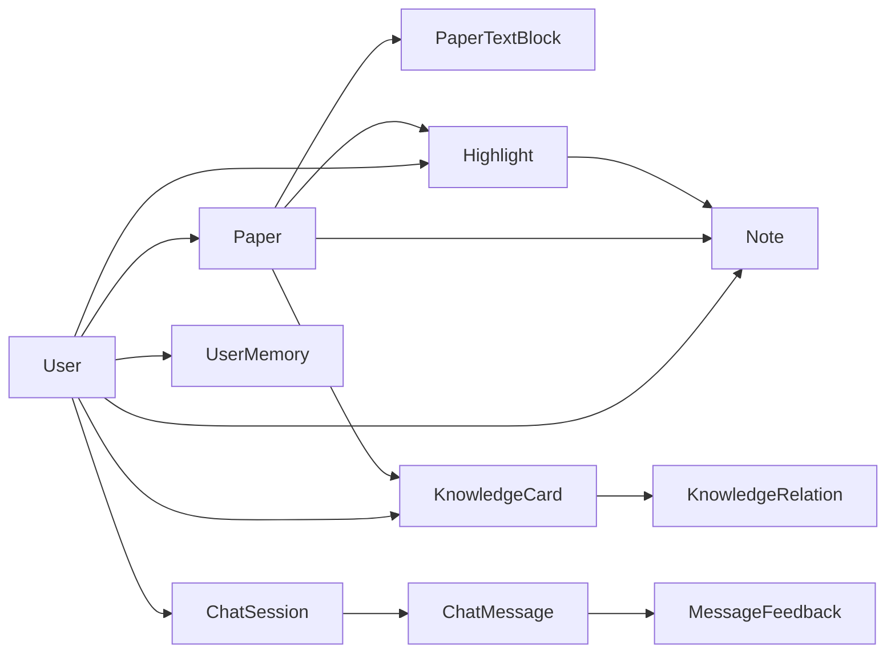

# 实体关系模型

<cite>
**本文引用的文件**
- [backend/app/models/paper.py](file://backend/app/models/paper.py)
- [backend/app/models/highlight.py](file://backend/app/models/highlight.py)
- [backend/app/models/note.py](file://backend/app/models/note.py)
- [backend/app/models/knowledge.py](file://backend/app/models/knowledge.py)
- [backend/app/models/chat.py](file://backend/app/models/chat.py)
- [backend/app/models/user.py](file://backend/app/models/user.py)
- [backend/app/models/memory.py](file://backend/app/models/memory.py)
- [backend/app/models/feedback.py](file://backend/app/models/feedback.py)
- [backend/app/database.py](file://backend/app/database.py)
- [backend/migrations/versions/6895243c431d_initial_schema.py](file://backend/migrations/versions/6895243c431d_initial_schema.py)
- [backend/app/routers/papers.py](file://backend/app/routers/papers.py)
- [backend/app/routers/highlights.py](file://backend/app/routers/highlights.py)
- [backend/app/routers/knowledge.py](file://backend/app/routers/knowledge.py)
- [backend/app/services/knowledge_service.py](file://backend/app/services/knowledge_service.py)
</cite>

## 目录
1. [简介](#简介)
2. [项目结构](#项目结构)
3. [核心组件](#核心组件)
4. [架构总览](#架构总览)
5. [详细组件分析](#详细组件分析)
6. [依赖分析](#依赖分析)
7. [性能考虑](#性能考虑)
8. [故障排查指南](#故障排查指南)
9. [结论](#结论)
10. [附录](#附录)

## 简介
本文件面向 PaperChat 系统，提供完整的实体关系模型（ERD）与 SQL 关系定义说明，覆盖论文、文本块、高亮、笔记、知识卡片、知识关系、聊天会话、聊天消息、用户记忆与消息反馈等核心实体。文档重点解释一对一、一对多与多对多关系的设计原理，给出外键与索引约束的最佳实践，并通过序列图与流程图展示典型业务流程。

## 项目结构
后端采用 SQLAlchemy ORM 映射，模型位于 models 目录；数据库初始化与迁移位于 database.py 与 migrations 目录；路由层位于 routers 目录，服务层位于 services 目录。本文聚焦于模型与路由/服务交互，梳理实体间的关系映射与约束。

图表来源
- [backend/app/models/user.py:11-36](file://backend/app/models/user.py#L11-L36)
- [backend/app/models/paper.py:11-85](file://backend/app/models/paper.py#L11-L85)
- [backend/app/models/highlight.py:10-37](file://backend/app/models/highlight.py#L10-L37)
- [backend/app/models/note.py:11-34](file://backend/app/models/note.py#L11-L34)
- [backend/app/models/knowledge.py:14-80](file://backend/app/models/knowledge.py#L14-L80)
- [backend/app/models/chat.py:14-71](file://backend/app/models/chat.py#L14-L71)
- [backend/app/models/memory.py:14-54](file://backend/app/models/memory.py#L14-L54)
- [backend/app/models/feedback.py:14-48](file://backend/app/models/feedback.py#L14-L48)

章节来源
- [backend/app/models/user.py:11-36](file://backend/app/models/user.py#L11-L36)
- [backend/app/models/paper.py:11-85](file://backend/app/models/paper.py#L11-L85)
- [backend/app/models/highlight.py:10-37](file://backend/app/models/highlight.py#L10-L37)
- [backend/app/models/note.py:11-34](file://backend/app/models/note.py#L11-L34)
- [backend/app/models/knowledge.py:14-80](file://backend/app/models/knowledge.py#L14-L80)
- [backend/app/models/chat.py:14-71](file://backend/app/models/chat.py#L14-L71)
- [backend/app/models/memory.py:14-54](file://backend/app/models/memory.py#L14-L54)
- [backend/app/models/feedback.py:14-48](file://backend/app/models/feedback.py#L14-L48)

## 核心组件
- 用户（User）：系统主体，拥有论文、高亮、笔记、聊天会话、知识卡片、用户记忆与消息反馈。
- 论文（Paper）：承载用户上传的 PDF，包含元数据与分析缓存；与论文文本块、高亮、笔记、知识卡片存在一对多关系。
- 论文文本块（PaperTextBlock）：存储 PDF 解析后的文本块及其几何信息，与论文为一对一/一对多。
- 高亮（Highlight）：用户对论文页面的高亮标注，与论文、用户为多对一；与笔记为一对多。
- 笔记（Note）：对论文或高亮的补充说明，与论文、用户为多对一；与高亮为多对一（可空）。
- 知识卡片（KnowledgeCard）：从高亮、聊天或手工创建的知识单元，与用户、论文为多对一；与知识关系为一对多。
- 知识关系（KnowledgeRelation）：卡片间的语义关系，源卡片与目标卡片均为多对一，形成多对多的图结构。
- 聊天会话（ChatSession）：用户与系统/论文的对话上下文，与用户为多对一；与聊天消息为一对多。
- 聊天消息（ChatMessage）：会话中的具体消息，与会话为多对一；与消息反馈为一对多。
- 用户记忆（UserMemory）：用户的偏好、研究方向等长期记忆，与用户为一对多。
- 消息反馈（MessageFeedback）：用户对消息的评分与评论，与消息、用户为多对一。

章节来源
- [backend/app/models/user.py:11-36](file://backend/app/models/user.py#L11-L36)
- [backend/app/models/paper.py:11-85](file://backend/app/models/paper.py#L11-L85)
- [backend/app/models/highlight.py:10-37](file://backend/app/models/highlight.py#L10-L37)
- [backend/app/models/note.py:11-34](file://backend/app/models/note.py#L11-L34)
- [backend/app/models/knowledge.py:14-80](file://backend/app/models/knowledge.py#L14-L80)
- [backend/app/models/chat.py:14-71](file://backend/app/models/chat.py#L14-L71)
- [backend/app/models/memory.py:14-54](file://backend/app/models/memory.py#L14-L54)
- [backend/app/models/feedback.py:14-48](file://backend/app/models/feedback.py#L14-L48)

## 架构总览
PaperChat 的数据层围绕“用户”为中心，论文作为载体，高亮/笔记提供阅读辅助，知识卡片与关系构建个人知识图谱，聊天模块贯穿检索增强与对话体验，用户记忆与反馈完善个性化闭环。

图表来源
- [backend/app/models/user.py:25-32](file://backend/app/models/user.py#L25-L32)
- [backend/app/models/paper.py:38-59](file://backend/app/models/paper.py#L38-L59)
- [backend/app/models/highlight.py:26-33](file://backend/app/models/highlight.py#L26-L33)
- [backend/app/models/note.py:27-30](file://backend/app/models/note.py#L27-L30)
- [backend/app/models/knowledge.py:33-47](file://backend/app/models/knowledge.py#L33-L47)
- [backend/app/models/chat.py:27-35](file://backend/app/models/chat.py#L27-L35)
- [backend/app/models/feedback.py:31-33](file://backend/app/models/feedback.py#L31-L33)
- [backend/app/models/memory.py:36-37](file://backend/app/models/memory.py#L36-L37)

## 详细组件分析

### 论文与论文文本块：一对多
- 设计原理：论文解析后按页拆分为多个文本块，便于检索与可视化定位。
- 外键与级联：PaperTextBlock.paper_id 引用 papers.id，删除论文时通过级联删除文本块。
- 索引：PaperTextBlock.paper_id 建有索引，提升按论文查询文本块效率。

图表来源
- [backend/app/models/paper.py:11-85](file://backend/app/models/paper.py#L11-L85)
- [backend/app/models/paper.py:65-85](file://backend/app/models/paper.py#L65-L85)

章节来源
- [backend/app/models/paper.py:38-59](file://backend/app/models/paper.py#L38-L59)
- [backend/app/models/paper.py:65-85](file://backend/app/models/paper.py#L65-L85)
- [backend/migrations/versions/6895243c431d_initial_schema.py:32-32](file://backend/migrations/versions/6895243c431d_initial_schema.py#L32-L32)

### 用户与高亮、笔记：多对一
- 设计原理：高亮与笔记均属于用户在论文上的阅读产物，需绑定用户与论文。
- 外键：Highlight.user_id、paper_id；Note.user_id、paper_id、highlight_id（可空）。
- 级联：删除论文时级联删除其高亮与笔记；删除高亮时级联删除其笔记。

图表来源
- [backend/app/models/user.py:25-32](file://backend/app/models/user.py#L25-L32)
- [backend/app/models/highlight.py:15-33](file://backend/app/models/highlight.py#L15-L33)
- [backend/app/models/note.py:16-30](file://backend/app/models/note.py#L16-L30)

章节来源
- [backend/app/models/highlight.py:26-33](file://backend/app/models/highlight.py#L26-L33)
- [backend/app/models/note.py:27-30](file://backend/app/models/note.py#L27-L30)
- [backend/migrations/versions/6895243c431d_initial_schema.py:26-31](file://backend/migrations/versions/6895243c431d_initial_schema.py#L26-L31)

### 知识卡片与知识关系：复杂多对多
- 设计原理：知识卡片代表知识点，卡片之间通过多种关系（相关、前置、扩展、矛盾、支持）构成知识图谱。
- 外键：KnowledgeRelation.source_card_id 与 target_card_id 均引用 knowledge_cards.id。
- 级联：删除卡片时级联删除其作为源/目标的关联。
- 关系完整性：同一（源, 目标）组合应避免重复，可通过业务层校验或数据库唯一约束实现。

图表来源
- [backend/app/models/knowledge.py:14-80](file://backend/app/models/knowledge.py#L14-L80)

章节来源
- [backend/app/models/knowledge.py:33-47](file://backend/app/models/knowledge.py#L33-L47)
- [backend/app/models/knowledge.py:66-76](file://backend/app/models/knowledge.py#L66-L76)

### 聊天会话与聊天消息：层级关系
- 设计原理：会话承载多条消息，支持单论文与跨文档两种场景。
- 外键：ChatMessage.session_id 引用 chat_sessions.id；ChatSession.user_id、paper_id/paper_ids 引用 users.id 与 papers.id。
- 级联：删除会话时级联删除消息；删除消息时级联删除反馈。
- 顺序：消息按创建时间排序，确保对话时序。

图表来源
- [backend/app/models/chat.py:14-71](file://backend/app/models/chat.py#L14-L71)

章节来源
- [backend/app/models/chat.py:27-35](file://backend/app/models/chat.py#L27-L35)
- [backend/app/models/chat.py:65-67](file://backend/app/models/chat.py#L65-L67)

### 用户记忆与消息反馈：一对多
- 用户记忆（UserMemory）：存储用户偏好、研究方向、术语使用等，与用户为一对多。
- 消息反馈（MessageFeedback）：用户对消息的评分与评论，与消息、用户为多对一。

图表来源
- [backend/app/models/memory.py:14-54](file://backend/app/models/memory.py#L14-L54)
- [backend/app/models/feedback.py:14-48](file://backend/app/models/feedback.py#L14-L48)

章节来源
- [backend/app/models/memory.py:36-37](file://backend/app/models/memory.py#L36-L37)
- [backend/app/models/feedback.py:31-33](file://backend/app/models/feedback.py#L31-L33)

### 典型流程：从高亮到知识卡片

图表来源
- [backend/app/routers/knowledge.py:311-327](file://backend/app/routers/knowledge.py#L311-L327)
- [backend/app/services/knowledge_service.py:82-162](file://backend/app/services/knowledge_service.py#L82-L162)

章节来源
- [backend/app/routers/knowledge.py:311-327](file://backend/app/routers/knowledge.py#L311-L327)
- [backend/app/services/knowledge_service.py:82-162](file://backend/app/services/knowledge_service.py#L82-L162)

### 典型流程：论文上传与文本块入库

图表来源
- [backend/app/routers/papers.py:156-262](file://backend/app/routers/papers.py#L156-L262)

章节来源
- [backend/app/routers/papers.py:156-262](file://backend/app/routers/papers.py#L156-L262)

## 依赖分析
- 模型间依赖：PaperTextBlock、Highlight、Note、KnowledgeCard、ChatMessage、MessageFeedback 均依赖 User 与 Paper；KnowledgeRelation 依赖两个 KnowledgeCard；ChatSession 依赖 User 与 Paper；ChatMessage 依赖 ChatSession；MessageFeedback 依赖 ChatMessage 与 User；UserMemory 依赖 User。
- 级联策略：模型定义中广泛使用“级联删除或孤儿删除”，保证删除父实体时子实体一致性。
- 索引策略：迁移脚本为高频查询列（paper_id、user_id、reading_status 等）建立索引，提升查询性能。

图表来源
- [backend/app/models/user.py:25-32](file://backend/app/models/user.py#L25-L32)
- [backend/app/models/paper.py:38-59](file://backend/app/models/paper.py#L38-L59)
- [backend/app/models/highlight.py:26-33](file://backend/app/models/highlight.py#L26-L33)
- [backend/app/models/note.py:27-30](file://backend/app/models/note.py#L27-L30)
- [backend/app/models/knowledge.py:33-47](file://backend/app/models/knowledge.py#L33-L47)
- [backend/app/models/chat.py:27-35](file://backend/app/models/chat.py#L27-L35)
- [backend/app/models/feedback.py:31-33](file://backend/app/models/feedback.py#L31-L33)
- [backend/app/models/memory.py:36-37](file://backend/app/models/memory.py#L36-L37)

章节来源
- [backend/migrations/versions/6895243c431d_initial_schema.py:24-38](file://backend/migrations/versions/6895243c431d_initial_schema.py#L24-L38)

## 性能考虑
- 索引优化：迁移脚本为 user_id、paper_id、reading_status 等列建立索引，建议在高并发场景下对 frequently-filtered 列保持索引。
- 级联删除：删除论文会级联删除文本块、高亮、笔记，减少碎片数据，但需注意大体量删除的事务开销。
- 异步处理：论文上传后异步建立向量索引，避免阻塞主流程。
- 查询优化：路由层使用 selectinload 等策略加载关联数据，减少 N+1 查询风险。

## 故障排查指南
- 外键约束错误：当尝试删除仍被引用的实体时，数据库会抛出外键约束异常。检查删除顺序与级联配置。
- 权限校验失败：路由层对资源访问进行用户绑定校验，若报“不存在或无权限”，确认当前用户与资源归属一致。
- 索引缺失导致慢查询：若按 paper_id、user_id 查询明显变慢，检查迁移脚本是否执行，确认索引存在。
- 级联删除误删：确认删除论文是否为预期行为，必要时调整级联策略或先迁移子实体。

章节来源
- [backend/app/routers/papers.py:341-376](file://backend/app/routers/papers.py#L341-L376)
- [backend/app/routers/highlights.py:154-186](file://backend/app/routers/highlights.py#L154-L186)
- [backend/app/routers/knowledge.py:282-308](file://backend/app/routers/knowledge.py#L282-L308)

## 结论
PaperChat 的实体关系以“用户—论文—高亮/笔记—知识卡片/关系—聊天—反馈/记忆”为主线，通过明确的外键与索引设计、合理的级联策略与异步处理，实现了从阅读到知识沉淀再到对话增强的完整闭环。遵循本文的 ERD 与最佳实践，可在保证数据一致性的同时提升系统性能与可维护性。

## 附录

### 实体关系图（ERD）

图表来源
- [backend/app/models/user.py:25-32](file://backend/app/models/user.py#L25-L32)
- [backend/app/models/paper.py:38-59](file://backend/app/models/paper.py#L38-L59)
- [backend/app/models/highlight.py:26-33](file://backend/app/models/highlight.py#L26-L33)
- [backend/app/models/note.py:27-30](file://backend/app/models/note.py#L27-L30)
- [backend/app/models/knowledge.py:33-47](file://backend/app/models/knowledge.py#L33-L47)
- [backend/app/models/chat.py:27-35](file://backend/app/models/chat.py#L27-L35)
- [backend/app/models/feedback.py:31-33](file://backend/app/models/feedback.py#L31-L33)
- [backend/app/models/memory.py:36-37](file://backend/app/models/memory.py#L36-L37)

### SQL 关系定义（基于模型与迁移）
- 用户与论文
  - 外键：PAPERS.user_id → USERS.id
  - 约束：NOT NULL，索引：ix_papers_user_id
- 论文与论文文本块
  - 外键：PAPER_TEXT_BLOCKS.paper_id → PAPERS.id ON DELETE CASCADE
  - 约束：NOT NULL，索引：ix_paper_text_blocks_paper_id
- 用户与高亮
  - 外键：HIGHLIGHTS.user_id → USERS.id
  - 约束：NOT NULL，索引：ix_highlights_user_id
- 论文与高亮
  - 外键：HIGHLIGHTS.paper_id → PAPERS.id ON DELETE CASCADE
  - 约束：NOT NULL，索引：ix_highlights_paper_id
- 用户与笔记
  - 外键：NOTES.user_id → USERS.id
  - 约束：NOT NULL，索引：ix_notes_user_id
- 论文与笔记
  - 外键：NOTES.paper_id → PAPERS.id ON DELETE CASCADE
  - 约束：NOT NULL，索引：ix_notes_paper_id
- 高亮与笔记
  - 外键：NOTES.highlight_id → HIGHLIGHTS.id ON DELETE SET NULL
  - 约束：可空
- 用户与知识卡片
  - 外键：KNOWLEDGE_CARDS.user_id → USERS.id
  - 约束：NOT NULL，索引：ix_knowledge_cards_user_id
- 论文与知识卡片
  - 外键：KNOWLEDGE_CARDS.paper_id → PAPERS.id
  - 约束：可空，索引：ix_knowledge_cards_paper_id
- 知识卡片与知识关系（双向）
  - 外键：KNOWLEDGE_RELATIONS.source_card_id → KNOWLEDGE_CARDS.id
  - 外键：KNOWLEDGE_RELATIONS.target_card_id → KNOWLEDGE_CARDS.id
  - 约束：NOT NULL（源/目标），索引：ix_knowledge_relations_*（建议）
- 用户与聊天会话
  - 外键：CHAT_SESSIONS.user_id → USERS.id
  - 约束：NOT NULL，索引：ix_chat_sessions_user_id
- 论文与聊天会话
  - 外键：CHAT_SESSIONS.paper_id → PAPERS.id
  - 约束：可空，索引：ix_chat_sessions_paper_id
- 会话与消息
  - 外键：CHAT_MESSAGES.session_id → CHAT_SESSIONS.id
  - 约束：NOT NULL，索引：ix_chat_messages_session_id（建议）
- 消息与反馈
  - 外键：MESSAGE_FEEDBACKS.message_id → CHAT_MESSAGES.id
  - 约束：NOT NULL，索引：ix_message_feedbacks_message_id
- 用户与反馈
  - 外键：MESSAGE_FEEDBACKS.user_id → USERS.id
  - 约束：NOT NULL，索引：ix_message_feedbacks_user_id
- 用户与记忆
  - 外键：USER_MEMORIES.user_id → USERS.id
  - 约束：NOT NULL，索引：ix_user_memories_user_id

章节来源
- [backend/app/models/paper.py:17-17](file://backend/app/models/paper.py#L17-L17)
- [backend/app/models/paper.py:71-71](file://backend/app/models/paper.py#L71-L71)
- [backend/app/models/highlight.py:16-17](file://backend/app/models/highlight.py#L16-L17)
- [backend/app/models/note.py:17-22](file://backend/app/models/note.py#L17-L22)
- [backend/app/models/knowledge.py:20-26](file://backend/app/models/knowledge.py#L20-L26)
- [backend/app/models/knowledge.py:59-60](file://backend/app/models/knowledge.py#L59-L60)
- [backend/app/models/chat.py:20-22](file://backend/app/models/chat.py#L20-L22)
- [backend/app/models/chat.py:59-59](file://backend/app/models/chat.py#L59-L59)
- [backend/app/models/feedback.py:25-26](file://backend/app/models/feedback.py#L25-L26)
- [backend/migrations/versions/6895243c431d_initial_schema.py:24-38](file://backend/migrations/versions/6895243c431d_initial_schema.py#L24-L38)