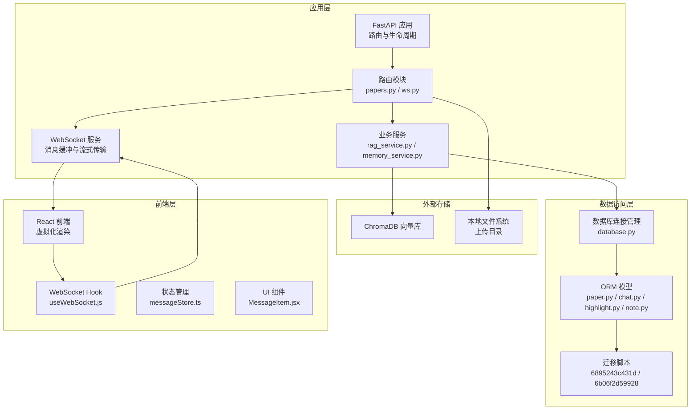
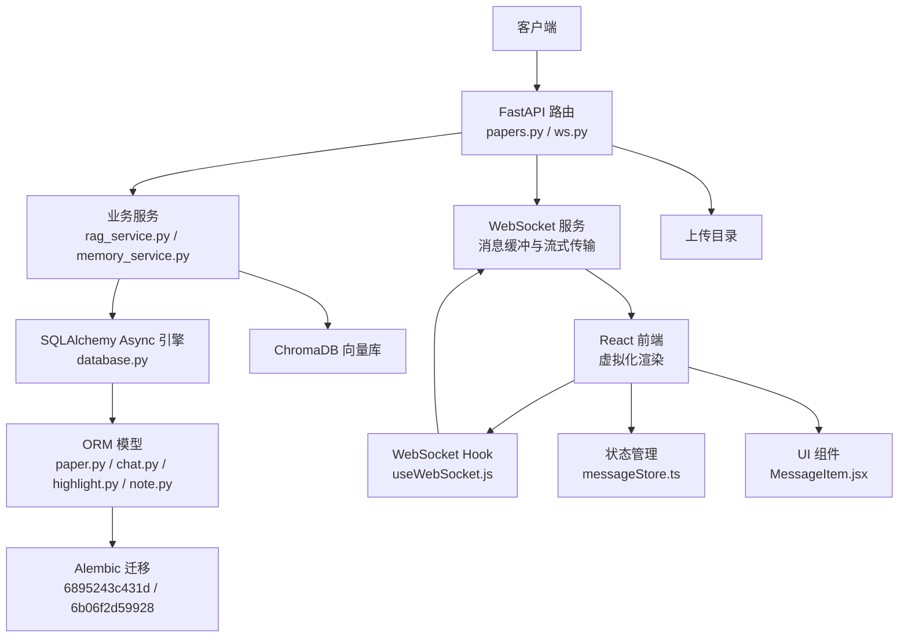
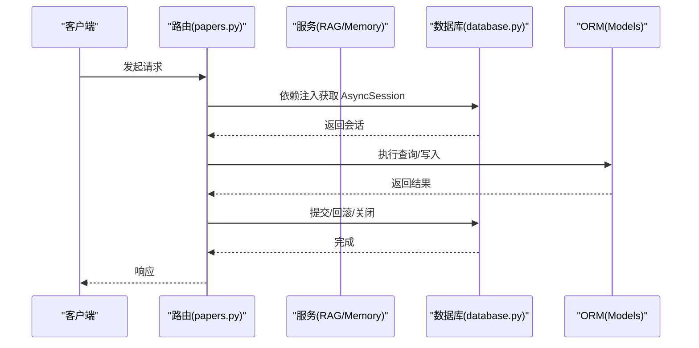
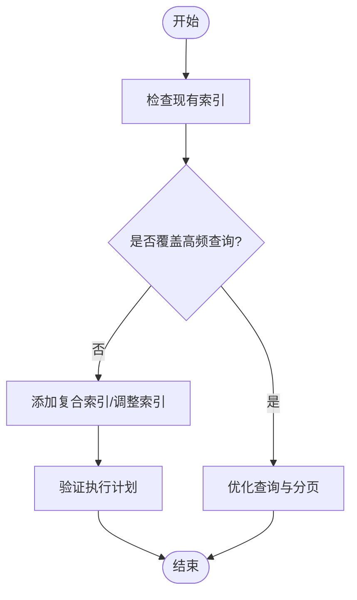
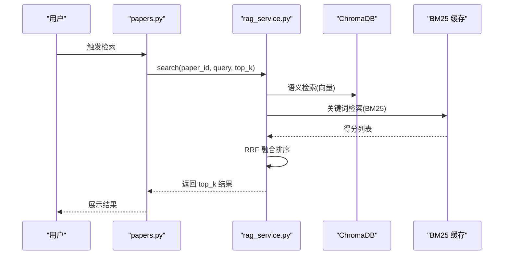
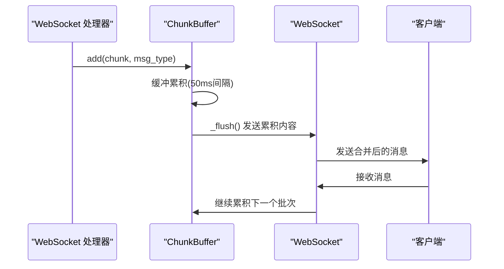
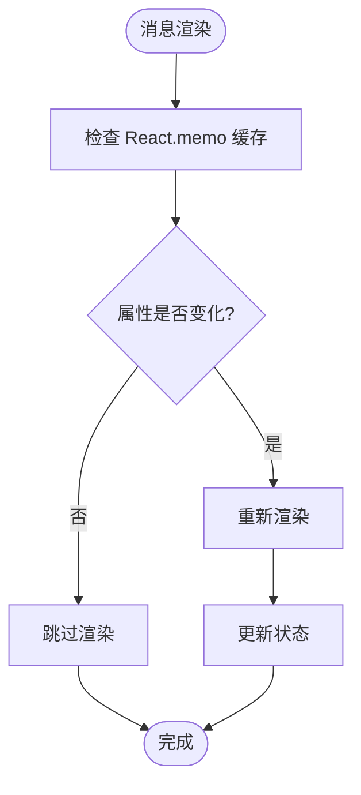
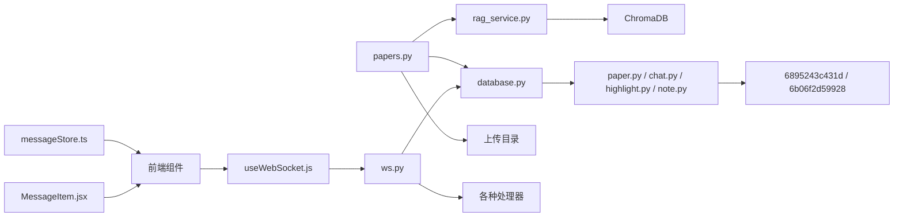

# 性能优化与索引策略

<cite>
**本文引用的文件**
- [backend/app/database.py](file://backend/app/database.py)
- [backend/app/config.py](file://backend/app/config.py)
- [backend/migrations/versions/6895243c431d_initial_schema.py](file://backend/migrations/versions/6895243c431d_initial_schema.py)
- [backend/migrations/versions/6b06f2d59928_add_performance_indexes.py](file://backend/migrations/versions/6b06f2d59928_add_performance_indexes.py)
- [backend/app/models/__init__.py](file://backend/app/models/__init__.py)
- [backend/app/models/paper.py](file://backend/app/models/paper.py)
- [backend/app/models/chat.py](file://backend/app/models/chat.py)
- [backend/app/models/highlight.py](file://backend/app/models/highlight.py)
- [backend/app/models/note.py](file://backend/app/models/note.py)
- [backend/app/routers/papers.py](file://backend/app/routers/papers.py)
- [backend/app/routers/ws.py](file://backend/app/routers/ws.py)
- [backend/app/services/rag_service.py](file://backend/app/services/rag_service.py)
- [backend/app/services/memory_service.py](file://backend/app/services/memory_service.py)
- [backend/app/main.py](file://backend/app/main.py)
- [frontend/src/hooks/useWebSocket.js](file://frontend/src/hooks/useWebSocket.js)
- [frontend/src/components/ChatPage/MessageItem.jsx](file://frontend/src/components/ChatPage/MessageItem.jsx)
- [frontend/src/stores/messageStore.ts](file://frontend/src/stores/messageStore.ts)
</cite>

## 更新摘要
**所做更改**
- 新增 WebSocket 消息缓冲优化章节，详细说明高频消息合并策略
- 新增前端虚拟化渲染优化章节，涵盖 React.memo 和消息组件优化
- 更新数据库索引策略，包含新增的复合索引和性能优化
- 新增流式数据传输改进章节，说明 WebSocket 缓冲机制
- 更新架构图以反映新的实时通信架构

## 目录
1. [简介](#简介)
2. [项目结构](#项目结构)
3. [核心组件](#核心组件)
4. [架构总览](#架构总览)
5. [详细组件分析](#详细组件分析)
6. [依赖分析](#依赖分析)
7. [性能考量](#性能考量)
8. [故障排查指南](#故障排查指南)
9. [结论](#结论)
10. [附录](#附录)

## 简介
本文件面向 PaperChat 系统的数据库性能优化与索引策略，围绕以下主题展开：
- 查询性能优化策略与索引设计原则
- 查询计划分析方法
- 全文搜索索引实现（向量索引与文本搜索结合）
- 复合索引设计策略（针对高频查询模式）
- 数据库连接池与并发访问控制
- 缓存策略（查询结果缓存与热点数据缓存）
- 慢查询分析与性能监控
- 大数据量场景下的分表分库与水平扩展
- 内存使用优化与垃圾回收策略
- 性能测试与基准测试实施指南
- **新增** WebSocket 消息缓冲优化与流式传输
- **新增** 前端虚拟化渲染与性能优化

## 项目结构
PaperChat 后端采用 FastAPI + SQLAlchemy Async + Alembic 的技术栈，数据库层通过异步引擎与会话工厂提供连接管理；全文检索采用 ChromaDB + BM25 的混合检索方案；RAG 服务负责论文文本分块、向量化与检索融合。**新增**实时通信通过 WebSocket 提供论文分析和问答的实时交互。

**图表来源**
- [backend/app/main.py:16-52](file://backend/app/main.py#L16-L52)
- [backend/app/routers/papers.py:1-1034](file://backend/app/routers/papers.py#L1-L1034)
- [backend/app/routers/ws.py:1-510](file://backend/app/routers/ws.py#L1-L510)
- [backend/app/database.py:14-81](file://backend/app/database.py#L14-L81)
- [backend/migrations/versions/6895243c431d_initial_schema.py:21-61](file://backend/migrations/versions/6895243c431d_initial_schema.py#L21-L61)
- [backend/migrations/versions/6b06f2d59928_add_performance_indexes.py:21-44](file://backend/migrations/versions/6b06f2d59928_add_performance_indexes.py#L21-L44)
- [backend/app/services/rag_service.py:16-400](file://backend/app/services/rag_service.py#L16-L400)
- [frontend/src/hooks/useWebSocket.js:1-180](file://frontend/src/hooks/useWebSocket.js#L1-L180)
- [frontend/src/stores/messageStore.ts:1-273](file://frontend/src/stores/messageStore.ts#L1-L273)
- [frontend/src/components/ChatPage/MessageItem.jsx:1-36](file://frontend/src/components/ChatPage/MessageItem.jsx#L1-L36)

**章节来源**
- [backend/app/main.py:16-52](file://backend/app/main.py#L16-L52)
- [backend/app/routers/papers.py:1-1034](file://backend/app/routers/papers.py#L1-L1034)
- [backend/app/routers/ws.py:1-510](file://backend/app/routers/ws.py#L1-L510)
- [backend/app/database.py:14-81](file://backend/app/database.py#L14-L81)
- [backend/migrations/versions/6895243c431d_initial_schema.py:21-61](file://backend/migrations/versions/6895243c431d_initial_schema.py#L21-L61)
- [backend/migrations/versions/6b06f2d59928_add_performance_indexes.py:21-44](file://backend/migrations/versions/6b06f2d59928_add_performance_indexes.py#L21-L44)
- [backend/app/services/rag_service.py:16-400](file://backend/app/services/rag_service.py#L16-L400)

## 核心组件
- 数据库连接与会话管理：异步引擎、会话工厂、依赖注入与生命周期关闭
- ORM 模型与索引：论文、文本块、高亮、笔记、会话与消息等表的字段与索引
- 迁移脚本：自动创建高频查询字段索引（包括新增的复合索引）
- RAG 服务：ChromaDB 向量索引、BM25 缓存、混合检索与重排序
- 记忆服务：向量相似度召回、时间衰减与重要性管理
- 路由与查询：论文列表、分页、过滤、全文检索触发
- **新增** WebSocket 服务：消息缓冲、流式传输与实时通信
- **新增** 前端优化：虚拟化渲染、状态管理和消息处理

**章节来源**
- [backend/app/database.py:14-81](file://backend/app/database.py#L14-L81)
- [backend/app/models/paper.py:11-94](file://backend/app/models/paper.py#L11-L94)
- [backend/app/models/chat.py:14-75](file://backend/app/models/chat.py#L14-L75)
- [backend/app/models/highlight.py:10-41](file://backend/app/models/highlight.py#L10-L41)
- [backend/app/models/note.py:11-34](file://backend/app/models/note.py#L11-L34)
- [backend/migrations/versions/6895243c431d_initial_schema.py:21-61](file://backend/migrations/versions/6895243c431d_initial_schema.py#L21-L61)
- [backend/migrations/versions/6b06f2d59928_add_performance_indexes.py:21-44](file://backend/migrations/versions/6b06f2d59928_add_performance_indexes.py#L21-L44)
- [backend/app/services/rag_service.py:16-400](file://backend/app/services/rag_service.py#L16-L400)
- [backend/app/services/memory_service.py:46-438](file://backend/app/services/memory_service.py#L46-L438)
- [backend/app/routers/papers.py:91-154](file://backend/app/routers/papers.py#L91-L154)
- [backend/app/routers/ws.py:36-104](file://backend/app/routers/ws.py#L36-L104)
- [frontend/src/hooks/useWebSocket.js:1-180](file://frontend/src/hooks/useWebSocket.js#L1-L180)
- [frontend/src/stores/messageStore.ts:1-273](file://frontend/src/stores/messageStore.ts#L1-L273)
- [frontend/src/components/ChatPage/MessageItem.jsx:1-36](file://frontend/src/components/ChatPage/MessageItem.jsx#L1-L36)

## 架构总览
PaperChat 的数据库与检索架构由"关系型数据库 + 向量数据库"的双引擎组成。关系型数据库承担结构化数据与事务一致性，ChromaDB 承担大规模向量检索与混合检索能力。**新增**实时通信通过 WebSocket 提供高效的流式数据传输。

**图表来源**
- [backend/app/routers/papers.py:1-1034](file://backend/app/routers/papers.py#L1-L1034)
- [backend/app/routers/ws.py:1-510](file://backend/app/routers/ws.py#L1-L510)
- [backend/app/services/rag_service.py:16-400](file://backend/app/services/rag_service.py#L16-L400)
- [backend/app/services/memory_service.py:46-438](file://backend/app/services/memory_service.py#L46-L438)
- [backend/app/database.py:14-81](file://backend/app/database.py#L14-L81)
- [backend/migrations/versions/6895243c431d_initial_schema.py:21-61](file://backend/migrations/versions/6895243c431d_initial_schema.py#L21-L61)
- [backend/migrations/versions/6b06f2d59928_add_performance_indexes.py:21-44](file://backend/migrations/versions/6b06f2d59928_add_performance_indexes.py#L21-L44)
- [frontend/src/hooks/useWebSocket.js:1-180](file://frontend/src/hooks/useWebSocket.js#L1-L180)
- [frontend/src/stores/messageStore.ts:1-273](file://frontend/src/stores/messageStore.ts#L1-L273)
- [frontend/src/components/ChatPage/MessageItem.jsx:1-36](file://frontend/src/components/ChatPage/MessageItem.jsx#L1-L36)

## 详细组件分析

### 数据库连接与并发控制
- 异步引擎与会话工厂：使用异步 SQLAlchemy 引擎与 async_sessionmaker，支持非阻塞 I/O 与高并发
- 生命周期管理：应用启动时初始化数据库，关闭时释放连接
- 依赖注入：get_db 提供会话依赖，自动提交、回滚与关闭，减少资源泄漏风险
- 并发建议：生产环境应配置连接池参数（见"性能考量"）

**图表来源**
- [backend/app/routers/papers.py:91-154](file://backend/app/routers/papers.py#L91-L154)
- [backend/app/database.py:30-47](file://backend/app/database.py#L30-L47)

**章节来源**
- [backend/app/database.py:14-81](file://backend/app/database.py#L14-L81)
- [backend/app/main.py:16-52](file://backend/app/main.py#L16-L52)

### 索引设计与查询优化
- 现有索引（迁移脚本）：papers.user_id、papers.reading_status、paper_text_blocks.paper_id、chat_sessions.user_id/paper_id、highlights.user_id/paper_id、knowledge_cards.user_id/paper_id、notes.user_id/paper_id
- **新增** 性能优化索引：chat_messages.session_id + created_at 复合索引、papers.user_id + reading_status 复合索引、highlights.paper_id + page 复合索引、paper_text_blocks.paper_id + page_number + y0 复合索引
- 设计原则：
  - 高频过滤字段优先（user_id、reading_status）
  - 关联查询主外键建立索引（paper_id、user_id）
  - 范围/排序字段考虑复合索引（如 user_id + created_at）
- 查询优化建议：
  - 使用 selectinload 减少 N+1 查询（已在论文列表中应用）
  - 对模糊搜索使用 LIKE 或全文索引（见"全文搜索索引"）
  - 控制分页偏移，避免超大 OFFSET（见"性能考量"）

**图表来源**
- [backend/migrations/versions/6895243c431d_initial_schema.py:21-61](file://backend/migrations/versions/6895243c431d_initial_schema.py#L21-L61)
- [backend/migrations/versions/6b06f2d59928_add_performance_indexes.py:21-44](file://backend/migrations/versions/6b06f2d59928_add_performance_indexes.py#L21-L44)
- [backend/app/routers/papers.py:91-154](file://backend/app/routers/papers.py#L91-L154)

**章节来源**
- [backend/migrations/versions/6895243c431d_initial_schema.py:21-61](file://backend/migrations/versions/6895243c431d_initial_schema.py#L21-L61)
- [backend/migrations/versions/6b06f2d59928_add_performance_indexes.py:21-44](file://backend/migrations/versions/6b06f2d59928_add_performance_indexes.py#L21-L44)
- [backend/app/routers/papers.py:91-154](file://backend/app/routers/papers.py#L91-L154)

### 全文搜索索引与混合检索
- 向量索引：ChromaDB 为每篇论文创建独立 collection，使用句子嵌入模型生成向量，支持 cosine 距离检索
- BM25 关键词检索：对文档集合构建 BM25 索引，缓存以避免重复构建
- 混合检索与重排序：采用 RRF（Reciprocal Rank Fusion）融合语义与关键词检索结果
- 跨论文检索：并行检索多个 collection，合并排序后返回 top_k

**图表来源**
- [backend/app/routers/papers.py:1-1034](file://backend/app/routers/papers.py#L1-L1034)
- [backend/app/services/rag_service.py:233-307](file://backend/app/services/rag_service.py#L233-L307)

**章节来源**
- [backend/app/services/rag_service.py:16-400](file://backend/app/services/rag_service.py#L16-L400)

### 复合索引设计策略
- 高频查询模式：
  - 用户维度查询：papers.user_id + created_at/desc
  - 阅读状态过滤：papers.user_id + reading_status
  - 文本块查询：paper_text_blocks.paper_id + page_number/y0
  - 会话与消息：chat_sessions.user_id + created_at；chat_messages.session_id + created_at
  - 高亮查询：highlights.user_id + paper_id + page
- 建议复合索引：
  - (user_id, reading_status)
  - (user_id, created_at)
  - (paper_id, page_number, y0)
  - (session_id, created_at)
  - (paper_id, page)

**章节来源**
- [backend/app/models/paper.py:17,27,36](file://backend/app/models/paper.py#L17,L27,L36)
- [backend/app/models/chat.py:20,63](file://backend/app/models/chat.py#L20,L63)
- [backend/app/models/highlight.py:16,17](file://backend/app/models/highlight.py#L16,L17)
- [backend/app/models/note.py:17,18](file://backend/app/models/note.py#L17,L18)

### WebSocket 消息缓冲优化
- **新增** 消息缓冲机制：ChunkBuffer 类实现高频 WebSocket chunk 消息合并，减少发送次数
- 缓冲策略：
  - 默认 50ms 合并间隔，对用户体验影响极小（人眼感知延迟约 100ms）
  - 可显著减少 WebSocket 消息数量（通常减少 80-90%）
  - 降低前端 React 重渲染频率，提升整体流畅度
- 实现细节：
  - 支持异步锁保护缓冲区操作
  - 自动 flush 机制，超过间隔时间自动发送累积内容
  - 支持强制 flush 和优雅关闭
- 使用方式：
  - 在处理器中创建 ChunkBuffer 实例
  - 通过 send_chunk_with_buffer 辅助函数发送带缓冲的消息
  - 支持多种消息类型（stream、chat_chunk、rag_chat_chunk 等）

**图表来源**
- [backend/app/routers/ws.py:36-104](file://backend/app/routers/ws.py#L36-L104)
- [backend/app/routers/ws.py:91-104](file://backend/app/routers/ws.py#L91-L104)

**章节来源**
- [backend/app/routers/ws.py:36-104](file://backend/app/routers/ws.py#L36-L104)
- [backend/app/routers/ws.py:91-104](file://backend/app/routers/ws.py#L91-L104)

### 流式数据传输改进
- **新增** 流式传输优化：WebSocket 端点支持实时流式响应
- 实现特点：
  - 支持多种流式消息类型（analyze_chunk、chat_chunk、rag_chat_chunk 等）
  - 消息缓冲减少网络开销和前端渲染压力
  - 支持任务取消和状态管理
  - 统一聊天入口的智能路由功能
- 性能收益：
  - 显著降低 WebSocket 消息数量
  - 提升用户交互体验和系统响应速度
  - 减少前端重渲染频率

**章节来源**
- [backend/app/routers/ws.py:150-510](file://backend/app/routers/ws.py#L150-L510)

### 前端虚拟化渲染优化
- **新增** React.memo 优化：MessageItem 组件使用 memo 包装，避免不必要的重渲染
- 优化策略：
  - 通过自定义比较函数（prev, next）精确控制重渲染条件
  - 仅在关键属性变化时重新渲染消息项
  - 减少大量消息时的 DOM 操作开销
- 状态管理优化：
  - Zustand 状态管理提供高效的状态更新机制
  - 消息缓存支持 5 分钟 TTL，提升页面切换性能
  - 分页加载支持增量加载，避免一次性渲染大量数据
- WebSocket 集成：
  - 全局 WebSocket 连接管理，支持自动重连
  - 消息处理器注册机制，支持多类型消息处理
  - 连接状态监听，提供统一的连接状态管理

**图表来源**
- [frontend/src/components/ChatPage/MessageItem.jsx:1-36](file://frontend/src/components/ChatPage/MessageItem.jsx#L1-L36)
- [frontend/src/stores/messageStore.ts:1-273](file://frontend/src/stores/messageStore.ts#L1-L273)
- [frontend/src/hooks/useWebSocket.js:1-180](file://frontend/src/hooks/useWebSocket.js#L1-L180)

**章节来源**
- [frontend/src/components/ChatPage/MessageItem.jsx:1-36](file://frontend/src/components/ChatPage/MessageItem.jsx#L1-L36)
- [frontend/src/stores/messageStore.ts:1-273](file://frontend/src/stores/messageStore.ts#L1-L273)
- [frontend/src/hooks/useWebSocket.js:1-180](file://frontend/src/hooks/useWebSocket.js#L1-L180)

### 缓存策略
- 搜索服务缓存：内存字典缓存 DuckDuckGo 搜索结果，LRU 驱逐
- RAG BM25 缓存：按 paper_id 缓存 BM25 实例与文档列表，避免重复构建
- 记忆服务缓存：向量嵌入缓存与相似度计算结果，时间衰减因子参与综合评分
- **新增** 前端消息缓存：Zustand 状态管理中的消息缓存，支持 TTL 过期控制
- 建议：
  - 为热点查询结果增加 Redis 缓存层
  - 对跨文档检索结果进行短期缓存
  - 控制缓存 TTL 与失效策略，避免脏读

**章节来源**
- [backend/app/services/search_service.py:10-113](file://backend/app/services/search_service.py#L10-L113)
- [backend/app/services/rag_service.py:44,163-182](file://backend/app/services/rag_service.py#L44,L163-L182)
- [backend/app/services/memory_service.py:46-438](file://backend/app/services/memory_service.py#L46-L438)
- [frontend/src/stores/messageStore.ts:46,173-198](file://frontend/src/stores/messageStore.ts#L46,L173-L198)

### 慢查询分析与性能监控
- 开启 SQL 日志：调试模式下输出 SQL 语句，便于观察执行计划
- 慢查询定位：结合数据库慢查询日志与执行计划分析
- 监控指标：QPS、P95/P99 延迟、连接池利用率、ChromaDB 查询耗时
- **新增** WebSocket 性能监控：消息缓冲效果、连接状态、重连次数
- 建议工具：Prometheus + Grafana、数据库自带 EXPLAIN/ANALYZE

**章节来源**
- [backend/app/config.py:20,23](file://backend/app/config.py#L20,L23)
- [backend/app/database.py:16](file://backend/app/database.py#L16)

### 大数据量场景下的分表分库与水平扩展
- 分表策略：
  - 按用户 ID 分表：papers、paper_text_blocks、highlights、notes、chat_sessions、chat_messages
  - 按时间分表：适用于日志/审计类数据（可选）
- 分库策略：
  - 读写分离：主库写入，从库读取
  - 数据库分片：按用户 ID 哈希分片
- RAG 扩展：
  - ChromaDB 多实例部署或集群化
  - 检索结果聚合与缓存
- **新增** WebSocket 扩展：
  - 多实例部署支持水平扩展
  - 消息缓冲配置可调优以适应不同负载

**章节来源**
- [backend/app/models/paper.py:17](file://backend/app/models/paper.py#L17)
- [backend/app/models/chat.py:20](file://backend/app/models/chat.py#L20)
- [backend/app/models/highlight.py:16](file://backend/app/models/highlight.py#L16)
- [backend/app/models/note.py:17](file://backend/app/models/note.py#L17)

### 内存使用优化与垃圾回收策略
- 懒加载模型：Embedding 模型延迟加载，首次使用时异步线程池加载
- 线程池复用：固定大小线程池执行同步编码任务，避免频繁创建销毁
- 缓存淘汰：RAG BM25 缓存与搜索服务缓存采用 LRU 驱逐
- **新增** 前端内存优化：React.memo 减少组件重渲染，Zustand 提供高效状态管理
- 建议：
  - 控制向量维度与批量大小
  - 定期清理过期缓存与无用索引
  - JVM/Python GC 参数调优（视运行环境而定）

**章节来源**
- [backend/app/services/rag_service.py:26,42,82-93](file://backend/app/services/rag_service.py#L26,L42,L82-L93)
- [backend/app/services/memory_service.py:49-65](file://backend/app/services/memory_service.py#L49-L65)
- [frontend/src/components/ChatPage/MessageItem.jsx:1-36](file://frontend/src/components/ChatPage/MessageItem.jsx#L1-L36)

### 性能测试与基准测试
- 单元测试：针对路由与服务的关键路径编写异步单元测试
- 基准测试：
  - 数据准备：构造不同规模的论文与文本块数据集
  - 指标：检索吞吐、平均/尾延迟、内存占用、CPU 利用率
  - **新增** WebSocket 基准测试：消息缓冲效果、连接稳定性、并发处理能力
  - 工具：locust、wrk、JMeter 或自定义压测脚本
- 回归测试：每次索引策略或缓存策略变更后进行回归对比

**章节来源**
- [backend/app/routers/papers.py:156-262](file://backend/app/routers/papers.py#L156-L262)
- [backend/app/services/rag_service.py:183-232](file://backend/app/services/rag_service.py#L183-L232)

## 依赖分析
- 组件耦合：
  - 路由依赖数据库会话与服务层
  - 服务层依赖数据库与外部向量库
  - 模型与迁移脚本共同决定索引布局
  - **新增** WebSocket 服务依赖路由和处理器
  - **新增** 前端依赖 WebSocket Hook 和状态管理
- 外部依赖：
  - SQLAlchemy Async、Alembic、ChromaDB、BM25、SentenceTransformer
  - **新增** WebSocket 相关依赖和前端 React 生态

**图表来源**
- [backend/app/routers/papers.py:1-1034](file://backend/app/routers/papers.py#L1-L1034)
- [backend/app/routers/ws.py:1-510](file://backend/app/routers/ws.py#L1-L510)
- [backend/app/database.py:14-81](file://backend/app/database.py#L14-L81)
- [backend/app/services/rag_service.py:16-400](file://backend/app/services/rag_service.py#L16-L400)
- [backend/migrations/versions/6895243c431d_initial_schema.py:21-61](file://backend/migrations/versions/6895243c431d_initial_schema.py#L21-L61)
- [backend/migrations/versions/6b06f2d59928_add_performance_indexes.py:21-44](file://backend/migrations/versions/6b06f2d59928_add_performance_indexes.py#L21-L44)
- [frontend/src/hooks/useWebSocket.js:1-180](file://frontend/src/hooks/useWebSocket.js#L1-L180)
- [frontend/src/stores/messageStore.ts:1-273](file://frontend/src/stores/messageStore.ts#L1-L273)
- [frontend/src/components/ChatPage/MessageItem.jsx:1-36](file://frontend/src/components/ChatPage/MessageItem.jsx#L1-L36)

**章节来源**
- [backend/app/models/__init__.py:15-29](file://backend/app/models/__init__.py#L15-L29)
- [backend/app/models/paper.py:11-94](file://backend/app/models/paper.py#L11-L94)
- [backend/app/models/chat.py:14-75](file://backend/app/models/chat.py#L14-L75)
- [backend/app/models/highlight.py:10-41](file://backend/app/models/highlight.py#L10-L41)
- [backend/app/models/note.py:11-34](file://backend/app/models/note.py#L11-L34)

## 性能考量
- 连接池配置与并发控制
  - 生产环境建议显式设置连接池大小、超时与回收策略
  - 使用连接池复用与异步 I/O，避免阻塞
- 分页与 OFFSET 优化
  - 对超大偏移使用基于游标的分页（基于主键或唯一索引）
- 查询计划分析
  - 使用数据库 EXPLAIN/EXPLAIN ANALYZE 分析执行计划
  - 关注索引选择、排序与连接顺序
- 缓存与预热
  - 预热热门论文的向量索引与 BM25 缓存
  - 对跨文档检索结果进行短期缓存
  - **新增** 预热 WebSocket 连接和消息缓冲
- I/O 与磁盘
  - ChromaDB 持久化目录与上传目录的磁盘 IO 调优
- 监控与告警
  - 建立 QPS、延迟、错误率与资源使用监控
  - **新增** WebSocket 连接状态和消息传输监控
- **新增** 前端性能优化
  - React.memo 减少不必要的组件重渲染
  - Zustand 提供高效的状态管理
  - WebSocket 连接池和重连机制

## 故障排查指南
- 数据库连接问题
  - 检查 DATABASE_URL 与连接池配置
  - 确认生命周期钩子正确初始化与关闭
- 查询性能问题
  - 使用调试模式查看 SQL 输出
  - 分析执行计划，确认索引是否被使用
- RAG 检索异常
  - 检查 ChromaDB 目录权限与磁盘空间
  - 验证嵌入模型加载与线程池可用性
- 缓存失效
  - 清理过期缓存与重建 BM25 索引
  - 检查缓存键与驱逐策略
- **新增** WebSocket 相关问题
  - 检查消息缓冲配置和性能影响
  - 验证连接状态和自动重连机制
  - 分析消息类型路由和处理器执行情况
- **新增** 前端渲染问题
  - 检查 React.memo 缓存逻辑
  - 验证 Zustand 状态更新性能
  - 分析 WebSocket 消息处理和 UI 更新

**章节来源**
- [backend/app/config.py:22-23](file://backend/app/config.py#L22,L23)
- [backend/app/database.py:16,50-81](file://backend/app/database.py#L16,L50-L81)
- [backend/app/services/rag_service.py:337-371](file://backend/app/services/rag_service.py#L337-L371)
- [backend/app/routers/ws.py:36-104](file://backend/app/routers/ws.py#L36,L104-L104)
- [frontend/src/components/ChatPage/MessageItem.jsx:1-36](file://frontend/src/components/ChatPage/MessageItem.jsx#L1-L36)
- [frontend/src/stores/messageStore.ts:173-198](file://frontend/src/stores/messageStore.ts#L173,L196-L198)

## 结论
PaperChat 的性能优化应围绕"索引优先、缓存前置、异步 I/O、混合检索、实时通信"五大支柱展开。通过合理的索引设计与查询优化，配合 ChromaDB 与 BM25 的混合检索，可在保证准确性的同时显著提升检索效率。**新增**的 WebSocket 消息缓冲优化和前端虚拟化渲染进一步提升了实时通信和界面渲染性能。结合连接池与缓存策略，可进一步降低延迟并提高吞吐。在大数据量场景下，建议采用分表分库与水平扩展方案，并辅以完善的监控与压测体系，确保系统稳定与可扩展性。

## 附录
- 快速检查清单
  - 确认高频字段已建立索引
  - 使用 selectinload 优化 N+1 查询
  - 预热热门论文的向量索引与 BM25 缓存
  - 配置连接池与并发参数
  - 建立慢查询与性能监控
  - 制定分表分库与水平扩展规划
  - **新增** 验证 WebSocket 消息缓冲效果
  - **新增** 检查前端虚拟化渲染性能
  - **新增** 测试流式数据传输稳定性