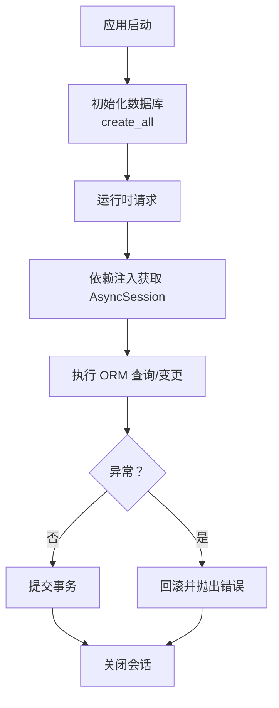
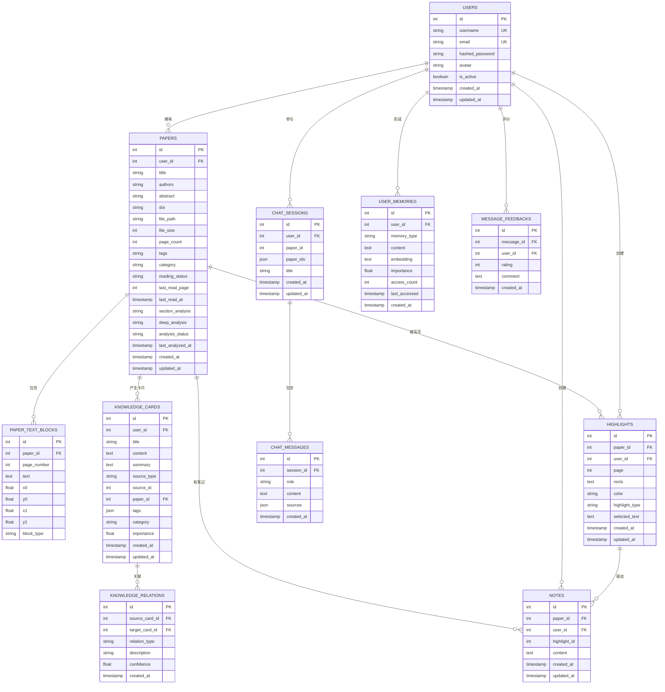
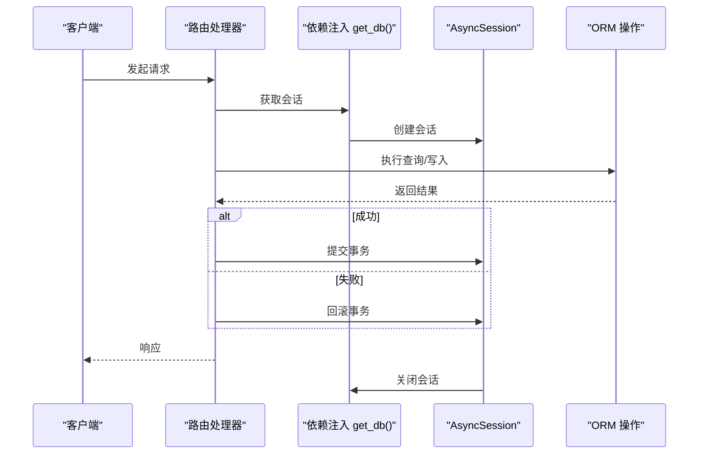
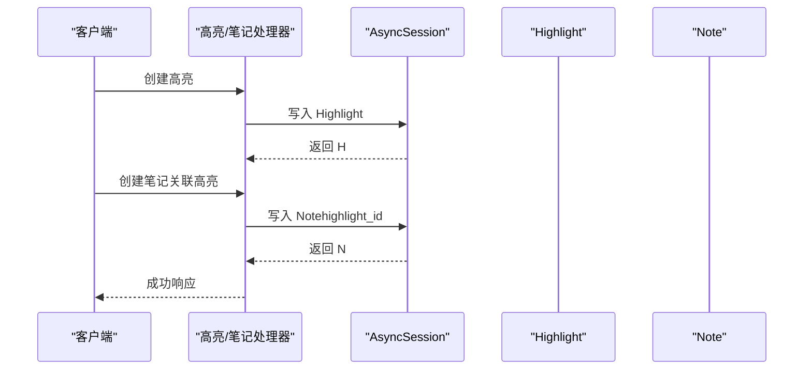
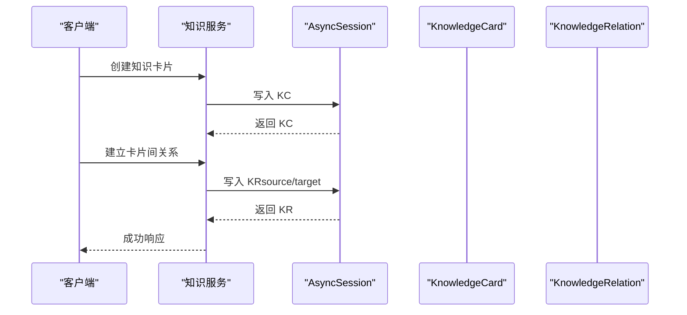
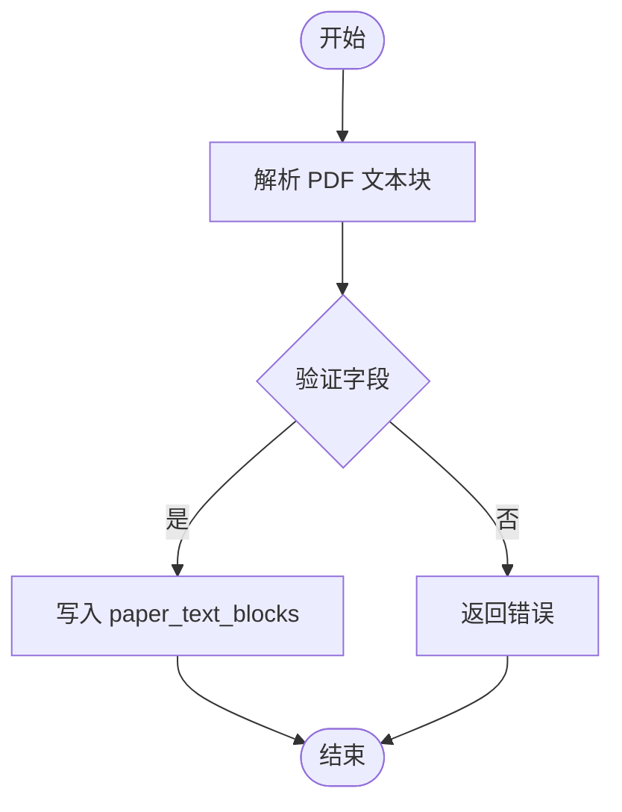
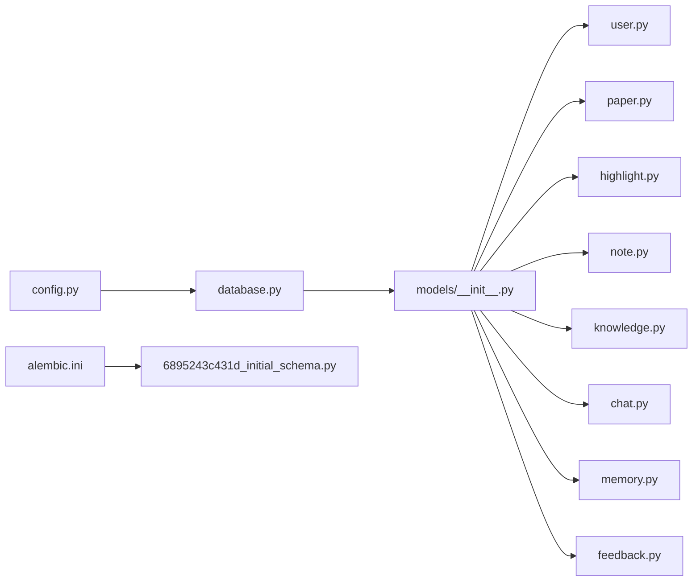

# 数据库设计

<cite>
**本文引用的文件**
- [backend/app/models/__init__.py](file://backend/app/models/__init__.py)
- [backend/app/models/user.py](file://backend/app/models/user.py)
- [backend/app/models/paper.py](file://backend/app/models/paper.py)
- [backend/app/models/highlight.py](file://backend/app/models/highlight.py)
- [backend/app/models/note.py](file://backend/app/models/note.py)
- [backend/app/models/knowledge.py](file://backend/app/models/knowledge.py)
- [backend/app/models/chat.py](file://backend/app/models/chat.py)
- [backend/app/models/memory.py](file://backend/app/models/memory.py)
- [backend/app/models/feedback.py](file://backend/app/models/feedback.py)
- [backend/app/database.py](file://backend/app/database.py)
- [backend/migrations/versions/6895243c431d_initial_schema.py](file://backend/migrations/versions/6895243c431d_initial_schema.py)
- [backend/alembic.ini](file://backend/alembic.ini)
- [backend/app/config.py](file://backend/app/config.py)
- [backend/app/schemas/paper.py](file://backend/app/schemas/paper.py)
- [backend/app/schemas/highlight.py](file://backend/app/schemas/highlight.py)
</cite>

## 目录
1. [简介](#简介)
2. [项目结构](#项目结构)
3. [核心组件](#核心组件)
4. [架构总览](#架构总览)
5. [详细组件分析](#详细组件分析)
6. [依赖分析](#依赖分析)
7. [性能考量](#性能考量)
8. [故障排查指南](#故障排查指南)
9. [结论](#结论)
10. [附录](#附录)

## 简介
本文件为 PaperChat 系统的数据库设计与实现文档，聚焦于实体关系模型（论文、用户、高亮、笔记、知识卡片、聊天会话与消息、用户记忆、消息反馈等），系统性阐述字段定义、数据类型与约束、索引与查询优化策略、迁移方案、数据访问模式（ORM、事务与并发）、以及数据安全与隐私保护、性能监控与维护建议。内容基于后端 SQLAlchemy/AsyncIO 模型与 Alembic 迁移脚本的实际实现整理而成。

## 项目结构
后端采用 SQLAlchemy 声明式基类与异步会话，模型集中于 models 目录并通过统一导出入口聚合；数据库初始化、会话生命周期与依赖注入在 database.py 中实现；迁移工具使用 Alembic，初始迁移脚本位于 migrations/versions。

```mermaid
graph TB
subgraph "模型层"
U["User<br/>用户"]
P["Paper<br/>论文"]
PTB["PaperTextBlock<br/>论文文本块"]
H["Highlight<br/>高亮"]
N["Note<br/>笔记"]
KC["KnowledgeCard<br/>知识卡片"]
KR["KnowledgeRelation<br/>知识关联"]
CS["ChatSession<br/>聊天会话"]
CM["ChatMessage<br/>聊天消息"]
UM["UserMemory<br/>用户记忆"]
MF["MessageFeedback<br/>消息反馈"]
end
subgraph "基础设施"
DB["数据库引擎/会话"]
AL["Alembic 迁移"]
end
U < --> P
P < --> PTB
P < --> H
P < --> N
P < --> KC
U < --> H
U < --> N
U < --> CS
U < --> UM
U < --> MF
CS < --> CM
H < --> N
KC < --> KR
DB --- U
DB --- P
DB --- H
DB --- N
DB --- KC
DB --- KR
DB --- CS
DB --- CM
DB --- UM
DB --- MF
AL --- DB
```

图表来源
- [backend/app/models/user.py:11-36](file://backend/app/models/user.py#L11-L36)
- [backend/app/models/paper.py:11-85](file://backend/app/models/paper.py#L11-L85)
- [backend/app/models/highlight.py:10-37](file://backend/app/models/highlight.py#L10-L37)
- [backend/app/models/note.py:11-34](file://backend/app/models/note.py#L11-L34)
- [backend/app/models/knowledge.py:14-80](file://backend/app/models/knowledge.py#L14-L80)
- [backend/app/models/chat.py:14-71](file://backend/app/models/chat.py#L14-L71)
- [backend/app/models/memory.py:14-54](file://backend/app/models/memory.py#L14-L54)
- [backend/app/models/feedback.py:14-48](file://backend/app/models/feedback.py#L14-L48)
- [backend/app/database.py:8-81](file://backend/app/database.py#L8-L81)
- [backend/migrations/versions/6895243c431d_initial_schema.py:21-39](file://backend/migrations/versions/6895243c431d_initial_schema.py#L21-L39)

章节来源
- [backend/app/models/__init__.py:1-29](file://backend/app/models/__init__.py#L1-L29)
- [backend/app/database.py:8-81](file://backend/app/database.py#L8-L81)
- [backend/alembic.ini:1-150](file://backend/alembic.ini#L1-L150)

## 核心组件
本节梳理核心实体及其职责与关键字段，便于快速建立整体认知。

- 用户（User）
  - 主键自增 id；用户名与邮箱唯一且带索引；密码哈希存储；头像可空；活跃状态布尔值；创建/更新时间戳。
  - 关系：一对多论文、高亮、笔记、聊天会话、记忆、反馈、知识卡片。

- 论文（Paper）
  - 主键自增 id；外键 user_id；标题、作者、摘要、DOI、文件路径与大小、页数；标签与分类（JSON 字符串/字符串）；阅读状态与最后阅读页/时间；分析缓存字段与状态、最后分析时间；创建/更新时间戳。
  - 关系：一对多文本块、高亮、笔记、知识卡片；多对一用户。

- 论文文本块（PaperTextBlock）
  - 主键自增 id；外键 paper_id（级联删除）；页码、文本内容及几何坐标；块类型（默认 text）。
  - 关系：多对一论文。

- 高亮（Highlight）
  - 主键自增 id；外键 paper_id、user_id；页码、矩形集合（JSON 字符串）、颜色、高亮类型、选中文本；创建/更新时间戳。
  - 关系：多对一论文、用户；一对多笔记（可空外键）。

- 笔记（Note）
  - 主键自增 id；外键 paper_id、user_id；可空高亮关联；内容；创建/更新时间戳。
  - 关系：多对一论文、用户；可选多对一高亮。

- 知识卡片（KnowledgeCard）
  - 主键自增 id；外键 user_id、可空 paper_id；标题、内容、摘要；来源类型与来源 id；标签（JSON 列表）、分类；重要性权重；创建/更新时间戳。
  - 关系：多对一用户、可选论文；双向一对多知识关联。

- 知识关联（KnowledgeRelation）
  - 主键自增 id；双外键 source/target 卡片；关系类型（枚举字符串）、描述、置信度；创建时间。
  - 关系：双向多对一卡片。

- 聊天会话（ChatSession）
  - 主键自增 id；外键 user_id；可空单论文或 JSON 数组表示多论文；标题；创建/更新时间戳。
  - 关系：多对一用户；可选多对一论文；一对多消息。

- 聊天消息（ChatMessage）
  - 主键自增 id；外键会话；角色（用户/助手）、内容、来源引用（JSON）；创建时间。
  - 关系：多对一会话；一对多反馈。

- 用户记忆（UserMemory）
  - 主键自增 id；外键 user_id；记忆类型、内容、向量（JSON 文本）、重要性、访问计数与时间；创建/更新时间戳。
  - 关系：多对一用户。

- 消息反馈（MessageFeedback）
  - 主键自增 id；外键消息、用户；评分（1/-1）、评论；创建时间。
  - 关系：多对一消息、用户。

章节来源
- [backend/app/models/user.py:11-36](file://backend/app/models/user.py#L11-L36)
- [backend/app/models/paper.py:11-85](file://backend/app/models/paper.py#L11-L85)
- [backend/app/models/highlight.py:10-37](file://backend/app/models/highlight.py#L10-L37)
- [backend/app/models/note.py:11-34](file://backend/app/models/note.py#L11-L34)
- [backend/app/models/knowledge.py:14-80](file://backend/app/models/knowledge.py#L14-L80)
- [backend/app/models/chat.py:14-71](file://backend/app/models/chat.py#L14-L71)
- [backend/app/models/memory.py:14-54](file://backend/app/models/memory.py#L14-L54)
- [backend/app/models/feedback.py:14-48](file://backend/app/models/feedback.py#L14-L48)

## 架构总览
PaperChat 的数据库层以 SQLAlchemy 异步引擎为核心，通过 DeclarativeBase 统一建模，配合 Alembic 实现迁移管理。会话生命周期由依赖注入函数提供，确保异常时回滚与资源释放。



图表来源
- [backend/app/database.py:50-81](file://backend/app/database.py#L50-L81)

章节来源
- [backend/app/database.py:8-81](file://backend/app/database.py#L8-L81)

## 详细组件分析

### 实体关系图（ERD）


图表来源
- [backend/app/models/user.py:11-36](file://backend/app/models/user.py#L11-L36)
- [backend/app/models/paper.py:11-85](file://backend/app/models/paper.py#L11-L85)
- [backend/app/models/highlight.py:10-37](file://backend/app/models/highlight.py#L10-L37)
- [backend/app/models/note.py:11-34](file://backend/app/models/note.py#L11-L34)
- [backend/app/models/knowledge.py:14-80](file://backend/app/models/knowledge.py#L14-L80)
- [backend/app/models/chat.py:14-71](file://backend/app/models/chat.py#L14-L71)
- [backend/app/models/memory.py:14-54](file://backend/app/models/memory.py#L14-L54)
- [backend/app/models/feedback.py:14-48](file://backend/app/models/feedback.py#L14-L48)

章节来源
- [backend/app/models/user.py:11-36](file://backend/app/models/user.py#L11-L36)
- [backend/app/models/paper.py:11-85](file://backend/app/models/paper.py#L11-L85)
- [backend/app/models/highlight.py:10-37](file://backend/app/models/highlight.py#L10-L37)
- [backend/app/models/note.py:11-34](file://backend/app/models/note.py#L11-L34)
- [backend/app/models/knowledge.py:14-80](file://backend/app/models/knowledge.py#L14-L80)
- [backend/app/models/chat.py:14-71](file://backend/app/models/chat.py#L14-L71)
- [backend/app/models/memory.py:14-54](file://backend/app/models/memory.py#L14-L54)
- [backend/app/models/feedback.py:14-48](file://backend/app/models/feedback.py#L14-L48)

### 数据模型字段与约束说明
- 用户（User）
  - 唯一性：username、email
  - 索引：username、email
  - 其他：is_active、时间戳

- 论文（Paper）
  - 外键：user_id
  - 索引：user_id、reading_status
  - 默认值：reading_status、analysis_status（迁移中调整为非空）

- 论文文本块（PaperTextBlock）
  - 外键：paper_id（级联删除）
  - 索引：paper_id

- 高亮（Highlight）
  - 外键：paper_id（级联删除）、user_id
  - 索引：paper_id、user_id

- 笔记（Note）
  - 外键：paper_id（级联删除）、user_id；highlight_id（可空，删除设为 NULL）

- 知识卡片（KnowledgeCard）
  - 外键：user_id、paper_id（可空）
  - 索引：user_id、paper_id
  - JSON 字段：tags

- 知识关联（KnowledgeRelation）
  - 外键：source_card_id、target_card_id（自关联）
  - 字段：relation_type、confidence

- 聊天会话（ChatSession）
  - 外键：user_id；paper_id（可空）
  - JSON 字段：paper_ids

- 聊天消息（ChatMessage）
  - 外键：session_id
  - JSON 字段：sources

- 用户记忆（UserMemory）
  - 外键：user_id
  - 索引：user_id、memory_type

- 消息反馈（MessageFeedback）
  - 外键：message_id、user_id
  - 索引：message_id、user_id

章节来源
- [backend/app/models/paper.py:16-36](file://backend/app/models/paper.py#L16-L36)
- [backend/app/models/highlight.py:15-24](file://backend/app/models/highlight.py#L15-L24)
- [backend/app/models/note.py:16-25](file://backend/app/models/note.py#L16-L25)
- [backend/app/models/knowledge.py:19-31](file://backend/app/models/knowledge.py#L19-L31)
- [backend/app/models/chat.py:19-25](file://backend/app/models/chat.py#L19-L25)
- [backend/app/models/memory.py:26-34](file://backend/app/models/memory.py#L26-L34)
- [backend/app/models/feedback.py:24-29](file://backend/app/models/feedback.py#L24-L29)
- [backend/migrations/versions/6895243c431d_initial_schema.py:33-37](file://backend/migrations/versions/6895243c431d_initial_schema.py#L33-L37)

### 索引与查询优化策略
- 已有索引（初始迁移）
  - 论文：user_id、reading_status
  - 高亮：paper_id、user_id
  - 笔记：paper_id、user_id
  - 知识卡片：paper_id、user_id
  - 聊天会话：paper_id、user_id
  - 论文文本块：paper_id

- 建议新增索引（按查询场景）
  - 论文：title（全文检索可选）、category、created_at（时间范围查询）
  - 高亮：page、selected_text（前缀/模糊匹配）
  - 笔记：highlight_id（反向查找）
  - 知识卡片：title、tags（JSON 检索，需结合数据库支持）
  - 聊天消息：role、created_at（排序/分页）
  - 用户记忆：embedding（向量相似度检索，需扩展索引类型）
  - 消息反馈：rating（统计分析）

- 全文搜索建议
  - 对论文摘要/正文、笔记内容、知识卡片内容，可引入数据库内置全文索引（如 PostgreSQL tsvector）或外部搜索引擎（如 Elasticsearch/Solr）以提升检索性能。

- 复合索引建议
  - 论文阅读状态与用户：reading_status + user_id
  - 高亮用户与论文：user_id + paper_id
  - 笔记用户与论文：user_id + paper_id
  - 知识卡片用户与论文：user_id + paper_id

章节来源
- [backend/migrations/versions/6895243c431d_initial_schema.py:21-39](file://backend/migrations/versions/6895243c431d_initial_schema.py#L21-L39)

### 数据访问模式最佳实践
- ORM 使用
  - 使用映射列与关系属性进行关联查询，避免 N+1 查询；必要时使用 selectinload/joinedload 批量加载。
  - 对复杂查询使用原生 SQL 或函数式表达式（如 func.now()）保持一致性。

- 事务管理
  - 依赖注入函数在异常时自动回滚并抛出，确保一致性；业务层避免手动 commit/rollback，交由依赖注入统一处理。
  - 长事务应拆分为短事务，减少锁竞争与死锁风险。

- 并发控制
  - 使用数据库层面的唯一约束（如用户名/邮箱）与外键约束保证参照完整性。
  - 对热点记录（如用户记忆访问计数）采用乐观锁或原子更新，避免竞态条件。

- 会话与资源
  - 异步会话工厂配置 expire_on_commit=False，减少对象过期带来的额外查询。
  - 在 finally 分支中确保会话关闭，防止连接泄漏。

章节来源
- [backend/app/database.py:30-47](file://backend/app/database.py#L30-L47)

### 数据安全与隐私保护
- 身份认证与授权
  - 用户密码采用哈希存储，不保存明文；登录流程由鉴权服务负责，数据库仅存储哈希值。
  - 资源访问控制：所有写操作均绑定 user_id，查询时按用户隔离数据。

- 数据最小化与脱敏
  - 仅存储完成功能所必需的字段；对日志与调试输出避免打印敏感信息。
  - 对外部接口返回的数据进行脱敏处理（如隐藏完整邮箱）。

- 传输与存储安全
  - 生产环境使用强密钥与 HTTPS；数据库连接使用安全的连接字符串。
  - 敏感字段（如密码）不在数据库中保留，或采用透明数据加密（TDE）与密钥管理服务。

- 审计与合规
  - 记录关键操作（创建/修改/删除）的时间戳与操作者；对高风险操作增加审计日志。

章节来源
- [backend/app/models/user.py:16-23](file://backend/app/models/user.py#L16-L23)
- [backend/app/config.py:28-31](file://backend/app/config.py#L28-L31)

### 数据库迁移策略
- 初始架构（版本 6895243c431d）
  - 创建核心表与索引；将 papers.analysis_status 从允许空改为非空。
  - 删除索引用于回滚。

- 迁移工具与配置
  - Alembic 配置文件指定脚本位置与日志级别；生产环境建议固定数据库 URL。
  - 迁移脚本遵循 up/down 模式，确保可逆演。

- 版本演进建议
  - 新增字段：优先添加可空列并补全默认值，再逐步改为非空。
  - 删除字段：先迁移数据，再删除列；避免破坏依赖。
  - 索引变更：评估查询模式，避免过多索引影响写入性能。
  - JSON/全文：根据实际检索需求决定是否引入全文索引或外部搜索引擎。

章节来源
- [backend/migrations/versions/6895243c431d_initial_schema.py:21-61](file://backend/migrations/versions/6895243c431d_initial_schema.py#L21-L61)
- [backend/alembic.ini:86-90](file://backend/alembic.ini#L86-L90)

### 类与序列交互图（代码级）
- 会话生命周期（依赖注入）


图表来源
- [backend/app/database.py:30-47](file://backend/app/database.py#L30-L47)

- 高亮创建到笔记关联


图表来源
- [backend/app/models/highlight.py:15-24](file://backend/app/models/highlight.py#L15-L24)
- [backend/app/models/note.py:16-22](file://backend/app/models/note.py#L16-L22)

- 知识卡片与关联


图表来源
- [backend/app/models/knowledge.py:19-31](file://backend/app/models/knowledge.py#L19-L31)
- [backend/app/models/knowledge.py:58-64](file://backend/app/models/knowledge.py#L58-L64)

- 论文文本块解析与存储


图表来源
- [backend/app/models/paper.py:65-85](file://backend/app/models/paper.py#L65-L85)

## 依赖分析
- 模型导出与聚合
  - models/__init__.py 将 Base 与各模型导出，便于统一导入与使用。
- 数据库与会话
  - database.py 定义 Base、异步引擎与会话工厂，并提供依赖注入函数与初始化逻辑。
- 迁移与配置
  - migrations/versions/6895243c431d_initial_schema.py 定义初始索引与字段约束变更。
  - alembic.ini 指定脚本位置与日志配置。
- 配置项
  - config.py 提供数据库连接字符串（开发阶段 SQLite）与 JWT、CORS 等配置。



图表来源
- [backend/app/models/__init__.py:5-28](file://backend/app/models/__init__.py#L5-L28)
- [backend/app/database.py:8-27](file://backend/app/database.py#L8-L27)
- [backend/migrations/versions/6895243c431d_initial_schema.py:14-18](file://backend/migrations/versions/6895243c431d_initial_schema.py#L14-L18)
- [backend/alembic.ini:8-16](file://backend/alembic.ini#L8-L16)
- [backend/app/config.py:22-23](file://backend/app/config.py#L22-L23)

章节来源
- [backend/app/models/__init__.py:5-28](file://backend/app/models/__init__.py#L5-L28)
- [backend/app/database.py:8-27](file://backend/app/database.py#L8-L27)
- [backend/migrations/versions/6895243c431d_initial_schema.py:14-18](file://backend/migrations/versions/6895243c431d_initial_schema.py#L14-L18)
- [backend/alembic.ini:8-16](file://backend/alembic.ini#L8-L16)
- [backend/app/config.py:22-23](file://backend/app/config.py#L22-L23)

## 性能考量
- 查询性能
  - 为高频过滤字段（user_id、paper_id、reading_status）建立单列索引；对组合过滤（如 user_id + created_at）建立复合索引。
  - 对大字段（Text/JSON）避免 SELECT *，仅取必要列。
- 写入性能
  - 批量插入使用 bulk_save_objects/bulk_insert_mappings；减少往返次数。
  - 控制索引数量，避免频繁写入导致的索引维护开销。
- 缓存与分析
  - 论文分析缓存字段（section_analysis/deep_analysis）减少重复计算；分析状态字段用于幂等控制。
- 异步与连接池
  - 使用异步引擎与会话工厂，合理设置连接池参数；避免长事务占用连接。
- 监控与诊断
  - 开启 DEBUG 时输出 SQL 语句，定位慢查询；生产环境关闭调试输出。
  - 结合数据库性能分析工具（如 EXPLAIN/EXPLAIN ANALYZE）优化查询计划。

## 故障排查指南
- 迁移失败
  - 检查 alembic.ini 中 sqlalchemy.url 是否正确；确认版本脚本与数据库当前版本一致。
  - 若字段约束变更（如非空）导致失败，先迁移数据再执行升级。
- 连接问题
  - 确认 DATABASE_URL（开发阶段 SQLite 文件路径）存在且可写；生产环境检查网络与凭据。
- 依赖注入异常
  - 确保路由处理函数正确注入 AsyncSession；异常时会自动回滚，检查业务层是否手动提交。
- 锁与死锁
  - 减少长事务；对并发写入使用重试与幂等设计；必要时调整隔离级别。

章节来源
- [backend/alembic.ini:86-90](file://backend/alembic.ini#L86-L90)
- [backend/app/config.py:22-23](file://backend/app/config.py#L22-L23)
- [backend/app/database.py:30-47](file://backend/app/database.py#L30-L47)

## 结论
本设计围绕论文阅读与知识管理场景，构建了以用户为中心的实体模型，辅以高亮、笔记、知识卡片与聊天上下文的协同关系。通过异步 ORM 与 Alembic 迁移，实现了可演进的数据库架构。建议在后续版本中完善全文检索、向量索引与复合索引策略，强化数据安全与性能监控，持续迭代以满足业务增长。

## 附录
- 字段与类型参考
  - 字符串：String(n)、Text
  - 数值：Integer、Float
  - 时间：DateTime，默认使用 func.now()
  - JSON：JSON/Text（视数据库支持而定）
- 常用约束
  - primary_key、nullable、unique、default、onupdate
- 关系与级联
  - 外键约束与级联删除（如 paper_text_blocks、notes、knowledge_cards、chat_messages、user_memories、message_feedbacks）