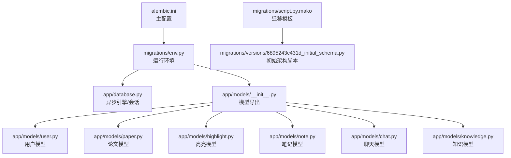
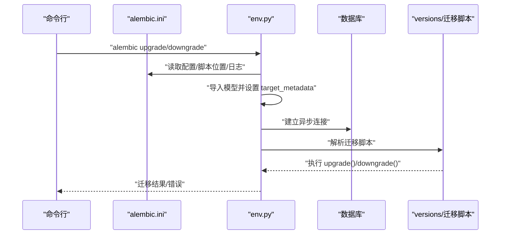
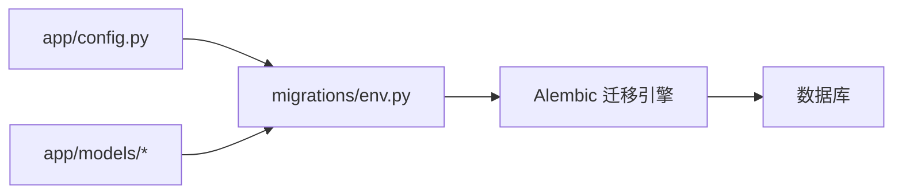

# 数据库迁移策略

<cite>
**本文引用的文件**
- [6895243c431d_initial_schema.py](file://backend/migrations/versions/6895243c431d_initial_schema.py)
- [env.py](file://backend/migrations/env.py)
- [alembic.ini](file://backend/alembic.ini)
- [script.py.mako](file://backend/migrations/script.py.mako)
- [database.py](file://backend/app/database.py)
- [config.py](file://backend/app/config.py)
- [models/__init__.py](file://backend/app/models/__init__.py)
- [models/user.py](file://backend/app/models/user.py)
- [models/paper.py](file://backend/app/models/paper.py)
- [models/highlight.py](file://backend/app/models/highlight.py)
- [models/note.py](file://backend/app/models/note.py)
- [models/chat.py](file://backend/app/models/chat.py)
- [models/knowledge.py](file://backend/app/models/knowledge.py)
</cite>

## 目录
1. [简介](#简介)
2. [项目结构](#项目结构)
3. [核心组件](#核心组件)
4. [架构总览](#架构总览)
5. [详细组件分析](#详细组件分析)
6. [依赖分析](#依赖分析)
7. [性能考虑](#性能考虑)
8. [故障排查指南](#故障排查指南)
9. [结论](#结论)
10. [附录](#附录)

## 简介
本文件面向 PaperChat 系统的数据库迁移策略，系统采用 SQLAlchemy 与 Alembic 实现异步数据库迁移与版本管理。本文档围绕以下目标展开：
- 深入解释 Alembic 迁移框架的配置与使用方法
- 详细描述初始架构迁移脚本（表创建、索引建立、约束设置）
- 迁移版本管理策略（版本号命名规范、迁移历史记录）
- 向前迁移与向后回滚的操作流程与注意事项
- 数据迁移最佳实践（备份、迁移测试、回滚策略）
- 增量迁移设计原则（新增表、修改结构、删除字段）
- 生产环境迁移安全操作与故障恢复方案
- 迁移脚本编写规范与自动化部署流程

## 项目结构
PaperChat 的数据库迁移相关文件集中在 backend/migrations 目录，并通过 Alembic 配置与项目模型进行集成。关键文件与职责如下：
- migrations/versions：存放具体迁移脚本（如初始架构脚本）
- migrations/env.py：Alembic 运行环境，负责加载模型元数据与数据库连接
- alembic.ini：Alembic 主配置文件，定义脚本位置、模板、日志等
- migrations/script.py.mako：迁移脚本模板，用于生成新迁移文件
- app/database.py：SQLAlchemy 异步引擎与会话工厂，提供数据库连接
- app/config.py：应用配置，包含 DATABASE_URL 等关键参数
- app/models/*：ORM 模型定义，作为 Alembic 目标元数据

图表来源
- [alembic.ini:1-150](file://backend/alembic.ini#L1-L150)
- [env.py:1-110](file://backend/migrations/env.py#L1-L110)
- [script.py.mako:1-29](file://backend/migrations/script.py.mako#L1-L29)
- [models/__init__.py:1-29](file://backend/app/models/__init__.py#L1-L29)

章节来源
- [alembic.ini:1-150](file://backend/alembic.ini#L1-L150)
- [env.py:1-110](file://backend/migrations/env.py#L1-L110)
- [models/__init__.py:1-29](file://backend/app/models/__init__.py#L1-L29)

## 核心组件
- Alembic 配置与运行环境
  - alembic.ini 定义脚本位置、模板、路径分隔符、日志级别等
  - env.py 加载项目模型与配置，设置目标元数据，支持离线与在线迁移
- 数据库连接与模型
  - app/database.py 提供异步 SQLAlchemy 引擎与会话工厂
  - app/config.py 提供 DATABASE_URL 等配置项
  - app/models/* 定义 ORM 模型，作为迁移的目标元数据
- 迁移脚本模板与初始脚本
  - script.py.mako 为新迁移文件提供模板
  - 6895243c431d_initial_schema.py 为初始架构脚本，包含索引与列约束变更

章节来源
- [alembic.ini:1-150](file://backend/alembic.ini#L1-L150)
- [env.py:1-110](file://backend/migrations/env.py#L1-L110)
- [database.py:1-81](file://backend/app/database.py#L1-L81)
- [config.py:1-44](file://backend/app/config.py#L1-L44)
- [models/__init__.py:1-29](file://backend/app/models/__init__.py#L1-L29)
- [6895243c431d_initial_schema.py:1-61](file://backend/migrations/versions/6895243c431d_initial_schema.py#L1-L61)

## 架构总览
PaperChat 的迁移架构由“配置—环境—模型—脚本”四层组成，确保迁移过程可追溯、可回滚、可测试。

图表来源
- [alembic.ini:1-150](file://backend/alembic.ini#L1-L150)
- [env.py:1-110](file://backend/migrations/env.py#L1-L110)
- [6895243c431d_initial_schema.py:1-61](file://backend/migrations/versions/6895243c431d_initial_schema.py#L1-L61)

## 详细组件分析

### Alembic 配置与运行环境
- 配置要点
  - script_location 指定迁移脚本目录
  - prepend_sys_path 将项目根目录加入 sys.path，便于导入模型
  - sqlalchemy.url 由 env.py 动态设置为 settings.DATABASE_URL
  - 日志级别在 [loggers]/[logger_alembic] 中配置
- 运行模式
  - offline 模式：直接使用 URL 执行迁移脚本
  - online 模式：通过异步引擎连接数据库，支持 aiosqlite
- 模型导入
  - env.py 导入 app.database.Base 与所有模型，确保 target_metadata 包含完整元数据

章节来源
- [alembic.ini:1-150](file://backend/alembic.ini#L1-L150)
- [env.py:1-110](file://backend/migrations/env.py#L1-L110)

### 初始架构迁移脚本（6895243c431d）
- 版本标识
  - revision: 6895243c431d
  - down_revision: None（初始版本）
- 升级操作
  - 为多张表创建索引（如 chat_sessions、highlights、knowledge_cards、notes、paper_text_blocks、papers）
  - 修改 papers.analysis_status 列的约束（设为非空）
  - 为 papers 添加复合索引（reading_status、user_id）
- 回滚操作
  - 逆序删除上述索引
  - 恢复 papers.analysis_status 的可空性与默认值
- 注意事项
  - 索引顺序与回滚顺序相反，确保幂等性
  - 列约束变更需谨慎，建议先在测试环境验证

章节来源
- [6895243c431d_initial_schema.py:1-61](file://backend/migrations/versions/6895243c431d_initial_schema.py#L1-L61)

### 迁移脚本模板（script.py.mako）
- 模板作用
  - 自动生成迁移文件骨架，包含版本号、上下文注释、upgrade()/downgrade() 函数
- 使用方式
  - 新增迁移：alembic revision --autogenerate
  - 自动检测模型变更并生成脚本
- 建议
  - 在自动生成后手动审阅，确保索引、约束、数据类型变更符合预期

章节来源
- [script.py.mako:1-29](file://backend/migrations/script.py.mako#L1-L29)

### 数据库连接与模型元数据
- 连接配置
  - app/config.py 提供 DATABASE_URL，默认使用 sqlite+aiosqlite（开发环境）
  - env.py 将 Alembic 的 sqlalchemy.url 设置为 settings.DATABASE_URL
- 元数据与模型
  - app/database.py 定义 Base 与异步引擎
  - env.py 导入 models 并设置 target_metadata，使 Alembic 能识别所有表结构

章节来源
- [config.py:1-44](file://backend/app/config.py#L1-L44)
- [env.py:1-110](file://backend/migrations/env.py#L1-L110)
- [database.py:1-81](file://backend/app/database.py#L1-L81)
- [models/__init__.py:1-29](file://backend/app/models/__init__.py#L1-L29)

### 数据模型与索引设计
- 用户表（users）
  - 唯一索引：username、email
  - 关系：papers、highlights、notes、chat_sessions、memories、message_feedbacks、knowledge_cards
- 论文表（papers）
  - 索引：user_id、reading_status
  - 列：analysis_status（初始脚本中调整为非空）
  - 关系：text_blocks、highlights、notes、knowledge_cards
- 高亮表（highlights）
  - 索引：paper_id、user_id
  - 关系：paper、user、notes
- 笔记表（notes）
  - 索引：paper_id、user_id、highlight_id（外键）
  - 关系：paper、user、highlight
- 聊天会话表（chat_sessions）
  - 索引：user_id、paper_id
  - 列：paper_ids（JSON，支持跨文档会话）
  - 关系：user、paper、messages
- 聊天消息表（chat_messages）
  - 关系：session、feedbacks
- 知识卡片表（knowledge_cards）
  - 索引：user_id、paper_id
  - 关系：user、paper、relations_as_source、relations_as_target
- 知识关联表（knowledge_relations）
  - 关系：source_card、target_card

章节来源
- [models/user.py:1-36](file://backend/app/models/user.py#L1-L36)
- [models/paper.py:1-85](file://backend/app/models/paper.py#L1-L85)
- [models/highlight.py:1-37](file://backend/app/models/highlight.py#L1-L37)
- [models/note.py:1-34](file://backend/app/models/note.py#L1-L34)
- [models/chat.py:1-71](file://backend/app/models/chat.py#L1-L71)
- [models/knowledge.py:1-80](file://backend/app/models/knowledge.py#L1-L80)

## 依赖分析
- 组件耦合
  - env.py 依赖 app/config.py 与 app/models，形成“配置—模型—迁移”的单向依赖
  - Alembic 通过 target_metadata 与 SQLAlchemy ORM 元数据绑定
- 外部依赖
  - Alembic、SQLAlchemy、aiosqlite（开发环境）
- 潜在风险
  - 若模型导入顺序或名称变更，可能导致迁移失败
  - 回滚顺序必须与升级顺序严格相反

图表来源
- [config.py:1-44](file://backend/app/config.py#L1-L44)
- [env.py:1-110](file://backend/migrations/env.py#L1-L110)

章节来源
- [config.py:1-44](file://backend/app/config.py#L1-L44)
- [env.py:1-110](file://backend/migrations/env.py#L1-L110)

## 性能考虑
- 索引策略
  - 为高频查询字段（user_id、paper_id、reading_status）建立索引，提升查询性能
  - 避免过度索引，减少写入开销
- 迁移执行
  - 在大型表上创建索引时，优先选择维护窗口或离线迁移
  - 使用事务包裹迁移，确保原子性
- 异步连接
  - 使用异步引擎与连接池，降低阻塞风险

## 故障排查指南
- 常见问题
  - 迁移失败：检查 Alembic 日志级别与数据库连接字符串
  - 模型未被识别：确认 env.py 已正确导入所有模型
  - 回滚不一致：核对索引与约束的回滚顺序
- 排查步骤
  - 确认 DATABASE_URL 正确（开发环境默认 sqlite）
  - 使用 alembic current 查看当前版本
  - 使用 alembic history 查看历史记录
  - 使用 alembic downgrade --to=-1 回退一步进行验证
- 回滚策略
  - 对于破坏性变更，先在测试环境验证回滚脚本
  - 对于数据变更，保留备份并在回滚后恢复

章节来源
- [alembic.ini:115-150](file://backend/alembic.ini#L115-L150)
- [env.py:1-110](file://backend/migrations/env.py#L1-L110)
- [6895243c431d_initial_schema.py:1-61](file://backend/migrations/versions/6895243c431d_initial_schema.py#L1-L61)

## 结论
PaperChat 的数据库迁移体系以 Alembic 为核心，结合 SQLAlchemy 异步引擎与完善的模型元数据，实现了可追踪、可回滚、可测试的迁移流程。通过严格的索引与约束管理、规范的版本命名与回滚顺序，以及生产环境的安全操作与故障恢复机制，能够有效保障数据库演进的稳定性与安全性。

## 附录

### 迁移版本管理策略
- 版本号命名
  - 使用 Alembic 默认格式（十六进制短 ID + 描述），保持简洁可读
  - 可选按日期组织文件名或子目录（需配合 recursive_version_locations）
- 迁移历史记录
  - Alembic 会在数据库中记录迁移历史，可通过 alembic current/history 查看
- 版本路径
  - script_location 指向 migrations，version_locations 可扩展至多版本目录

章节来源
- [alembic.ini:1-150](file://backend/alembic.ini#L1-L150)
- [6895243c431d_initial_schema.py:1-61](file://backend/migrations/versions/6895243c431d_initial_schema.py#L1-L61)

### 向前迁移与向后回滚流程
- 向前迁移
  - 生成脚本：alembic revision --autogenerate
  - 执行迁移：alembic upgrade head
- 向后回滚
  - 回退一步：alembic downgrade -1
  - 回退到指定版本：alembic downgrade <目标版本>
- 注意事项
  - 回滚顺序与升级顺序相反
  - 对于破坏性变更，提前备份数据库

章节来源
- [script.py.mako:1-29](file://backend/migrations/script.py.mako#L1-L29)
- [6895243c431d_initial_schema.py:1-61](file://backend/migrations/versions/6895243c431d_initial_schema.py#L1-L61)

### 数据迁移最佳实践
- 备份
  - 迁移前对生产数据库进行快照或导出
- 测试
  - 在测试环境重复执行迁移与回滚，验证幂等性
- 回滚策略
  - 为每个破坏性变更准备回滚脚本
  - 对数据变更使用增量迁移，避免全量替换

### 增量迁移设计原则
- 新增表
  - 明确主键、外键与索引策略
  - 在回滚脚本中删除表与索引
- 修改现有表结构
  - 优先使用 ALTER COLUMN 与 CREATE INDEX/DROP INDEX
  - 避免 DROP COLUMN；如需删除字段，先迁移数据到新结构
- 删除废弃字段
  - 通过迁移脚本逐步清理，确保回滚路径可用

### 生产环境迁移安全操作
- 时间窗口
  - 选择业务低峰期执行迁移
- 通知与回滚
  - 提前通知团队，准备回滚预案
- 监控与验证
  - 迁移后验证关键查询与接口功能
  - 持续监控数据库性能指标

### 迁移脚本编写规范
- 命名与注释
  - 使用清晰的描述性 slug，遵循 Alembic 文件模板
- 幂等性
  - 升级与回滚应互为镜像，避免副作用
- 审阅
  - 自动脚本生成后人工审阅，确保逻辑正确

### 自动化部署流程
- CI/CD 集成
  - 在流水线中执行 alembic upgrade head
  - 在部署前运行迁移测试
- 环境隔离
  - 不同环境使用独立 DATABASE_URL
  - 开发环境使用 sqlite，生产环境使用 PostgreSQL 或 MySQL