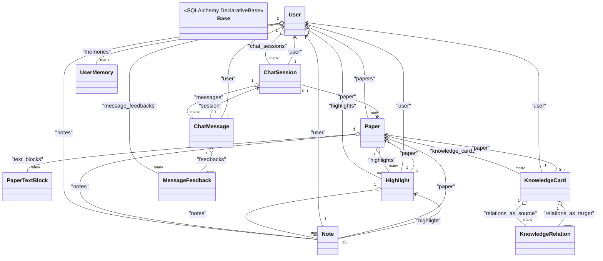
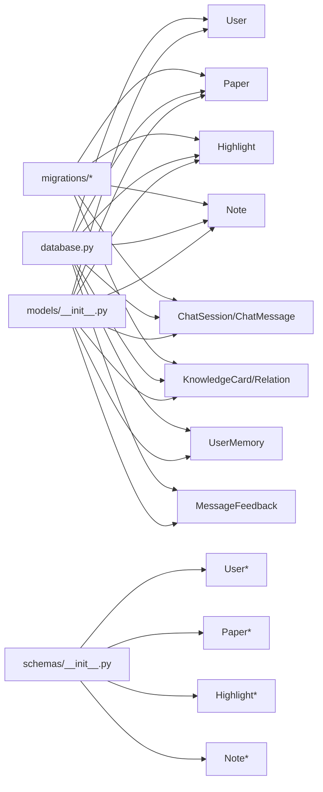
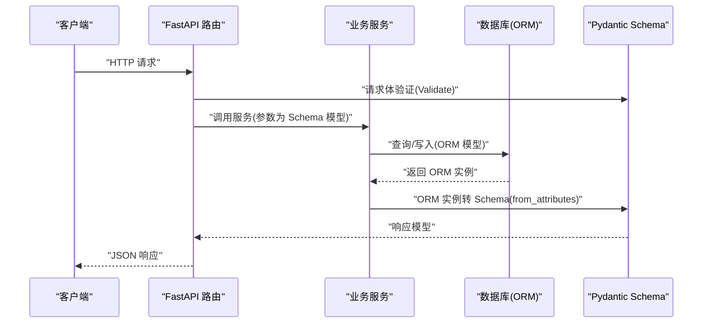

# 数据模型架构

<cite>
**本文引用的文件**
- [models/__init__.py](file://backend/app/models/__init__.py)
- [schemas/__init__.py](file://backend/app/schemas/__init__.py)
- [models/paper.py](file://backend/app/models/paper.py)
- [models/user.py](file://backend/app/models/user.py)
- [models/highlight.py](file://backend/app/models/highlight.py)
- [models/note.py](file://backend/app/models/note.py)
- [models/knowledge.py](file://backend/app/models/knowledge.py)
- [models/chat.py](file://backend/app/models/chat.py)
- [models/memory.py](file://backend/app/models/memory.py)
- [models/feedback.py](file://backend/app/models/feedback.py)
- [schemas/paper.py](file://backend/app/schemas/paper.py)
- [schemas/user.py](file://backend/app/schemas/user.py)
- [schemas/highlight.py](file://backend/app/schemas/highlight.py)
- [schemas/note.py](file://backend/app/schemas/note.py)
- [database.py](file://backend/app/database.py)
- [migrations/versions/6895243c431d_initial_schema.py](file://backend/migrations/versions/6895243c431d_initial_schema.py)
</cite>

## 目录
1. [简介](#简介)
2. [项目结构](#项目结构)
3. [核心组件](#核心组件)
4. [架构总览](#架构总览)
5. [详细组件分析](#详细组件分析)
6. [依赖分析](#依赖分析)
7. [性能考量](#性能考量)
8. [故障排查指南](#故障排查指南)
9. [结论](#结论)
10. [附录](#附录)

## 简介
本文件系统性梳理 PaperChat 的数据模型架构，覆盖 SQLAlchemy ORM 实体与 Pydantic Schema 的字段定义、数据类型选择、验证规则、继承关系与抽象基类设计、序列化/反序列化策略、模型间传递模式与 API 响应格式，并结合迁移脚本说明索引策略与查询优化字段设计。目标是帮助开发者与产品人员快速理解并正确使用数据模型。

## 项目结构
后端采用分层组织：models 定义数据库实体与关系；schemas 定义 Pydantic 验证与序列化；database 提供异步引擎与会话生命周期；migrations 提供索引与字段变更脚本。

```mermaid
graph TB
subgraph "模型层(models)"
U["User"]
P["Paper<br/>PaperTextBlock"]
H["Highlight"]
N["Note"]
C["ChatSession<br/>ChatMessage"]
K["KnowledgeCard<br/>KnowledgeRelation"]
M["UserMemory"]
F["MessageFeedback"]
end
subgraph "序列化层(schemas)"
SU["UserCreate/UserResponse/UserLogin"]
SP["PaperCreate/PaperUpdate/PaperResponse/PaperListResponse"]
SH["HighlightCreate/HighlightUpdate/HighlightResponse"]
SN["NoteCreate/NoteUpdate/NoteResponse/NoteWithHighlightResponse"]
end
subgraph "基础设施(database)"
DB["Base/AsyncEngine/Session"]
MG["Alembic 迁移"]
end
U < --> P
U < --> H
U < --> N
U < --> C
U < --> M
U < --> F
P < --> H
P < --> N
P < --> K
H < --> N
C < --> F
DB --> U
DB --> P
DB --> H
DB --> N
DB --> C
DB --> K
DB --> M
DB --> F
MG --> DB
SP --> P
SU --> U
SH --> H
SN --> N
```

图表来源
- [models/__init__.py:1-29](file://backend/app/models/__init__.py#L1-L29)
- [schemas/__init__.py:1-18](file://backend/app/schemas/__init__.py#L1-L18)
- [database.py:8-81](file://backend/app/database.py#L8-L81)
- [migrations/versions/6895243c431d_initial_schema.py:21-39](file://backend/migrations/versions/6895243c431d_initial_schema.py#L21-L39)

章节来源
- [models/__init__.py:1-29](file://backend/app/models/__init__.py#L1-L29)
- [schemas/__init__.py:1-18](file://backend/app/schemas/__init__.py#L1-L18)
- [database.py:8-81](file://backend/app/database.py#L8-L81)
- [migrations/versions/6895243c431d_initial_schema.py:21-39](file://backend/migrations/versions/6895243c431d_initial_schema.py#L21-L39)

## 核心组件
- 用户(User)：唯一标识、认证凭据、头像、激活状态与时间戳；一对多关联论文、高亮、笔记、会话、记忆、反馈。
- 论文(Paper)：标题、作者、摘要、DOI、文件路径与大小、页数、标签、分类、阅读状态与进度、分析缓存与状态、时间戳；一对多关联文本块、高亮、笔记、知识卡片。
- 文本块(PaperTextBlock)：页面号、文本内容与四边形坐标、块类型；与论文的级联删除关系。
- 高亮(Highlight)：页面号、矩形集合(JSON 字符串)、颜色、标注类型、选中文本；一对多关联笔记；与用户、论文的多对一关系。
- 笔记(Note)：可选绑定高亮、内容；与用户、论文、高亮的多对一关系。
- 知识(KnowledgeCard/Relation)：卡片含标题、内容、摘要、来源类型/ID、关联论文、标签、分类、重要性；关系含类型、描述、置信度；双向多对多通过外键维护。
- 聊天(ChatSession/ChatMessage)：会话支持单论文与跨文档；消息含角色、内容、来源引用；与反馈的级联删除。
- 记忆(UserMemory)：记忆类型、内容、向量、重要性、访问计数与时间戳；与用户多对一。
- 反馈(MessageFeedback)：评分与评论；与消息、用户多对一。

章节来源
- [models/user.py:11-36](file://backend/app/models/user.py#L11-L36)
- [models/paper.py:11-85](file://backend/app/models/paper.py#L11-L85)
- [models/highlight.py:10-37](file://backend/app/models/highlight.py#L10-L37)
- [models/note.py:11-34](file://backend/app/models/note.py#L11-L34)
- [models/knowledge.py:14-80](file://backend/app/models/knowledge.py#L14-L80)
- [models/chat.py:14-71](file://backend/app/models/chat.py#L14-L71)
- [models/memory.py:14-54](file://backend/app/models/memory.py#L14-L54)
- [models/feedback.py:14-48](file://backend/app/models/feedback.py#L14-L48)

## 架构总览
- ORM 基类：统一的 DeclarativeBase 子类，集中于 database.Base。
- 异步数据库：基于 SQLAlchemy AsyncEngine 与 AsyncSession，提供依赖注入与事务控制。
- 索引策略：迁移脚本显式创建高频查询字段索引（如 papers.user_id、reading_status，highlights.user_id/paper_id 等），提升关联查询性能。
- 模型导出：models/__init__.py 统一导出实体与 Base，便于路由与服务层按需导入。



图表来源
- [database.py:8-11](file://backend/app/database.py#L8-L11)
- [models/user.py:25-32](file://backend/app/models/user.py#L25-L32)
- [models/paper.py:38-59](file://backend/app/models/paper.py#L38-L59)
- [models/highlight.py:26-33](file://backend/app/models/highlight.py#L26-L33)
- [models/note.py:27-30](file://backend/app/models/note.py#L27-L30)
- [models/chat.py:27-35](file://backend/app/models/chat.py#L27-L35)
- [models/knowledge.py:33-47](file://backend/app/models/knowledge.py#L33-L47)
- [models/feedback.py:31-33](file://backend/app/models/feedback.py#L31-L33)

## 详细组件分析

### 用户(User)模型
- 字段与类型
  - 唯一标识与认证：整型主键、字符串用户名(唯一+索引)、邮箱(唯一+索引)、哈希密码。
  - 其他：头像字符串、激活布尔值、创建/更新时间戳。
- 关系
  - 一对多：论文、高亮、笔记、会话、记忆、反馈。
- 验证规则
  - Pydantic 层：用户名长度范围、邮箱合法性；登录模型要求用户名与密码字段。
- 序列化
  - UserResponse 包含基础字段与时间戳，启用 from_attributes。
- 设计要点
  - 使用索引加速用户维度查询；与多实体强关联，支撑全文检索与个性化功能。

章节来源
- [models/user.py:11-36](file://backend/app/models/user.py#L11-L36)
- [schemas/user.py:8-42](file://backend/app/schemas/user.py#L8-L42)

### 论文(Paper)与文本块(PaperTextBlock)模型
- 论文字段
  - 标题、作者、摘要、DOI、文件路径与大小、页数、标签(JSON 字符串)、分类。
  - 阅读状态(枚举字符串)与最后阅读页码、时间戳；分析缓存(章节/深度)与状态、时间戳。
  - user_id 外键+索引；reading_status 索引。
- 文本块字段
  - 页面号、文本、四边形坐标(x0,y0,x1,y1)、块类型(默认 text)。
  - paper_id 外键+索引，级联删除。
- 关系
  - Paper 与 User、PaperTextBlock、Highlight、Note、KnowledgeCard 的一对多关系。
- 验证与序列化
  - PaperCreate/PaperUpdate/PaperResponse 定义字段与 from_attributes。
  - PaperListResponse 返回总数与列表。
- 查询优化
  - 迁移脚本为 papers.user_id、reading_status 添加索引。

章节来源
- [models/paper.py:11-85](file://backend/app/models/paper.py#L11-L85)
- [schemas/paper.py:7-83](file://backend/app/schemas/paper.py#L7-L83)
- [migrations/versions/6895243c431d_initial_schema.py:32-38](file://backend/migrations/versions/6895243c431d_initial_schema.py#L32-L38)

### 高亮(Highlight)与笔记(Note)模型
- 高亮字段
  - 页面号、矩形集合(JSON 字符串)、颜色(默认色)、标注类型(默认 highlight)、选中文本。
  - user_id、paper_id 外键+索引；与笔记的级联删除。
- 笔记字段
  - 可选绑定高亮、内容；user_id、paper_id 外键+索引；highlight_id 可空。
- 关系
  - 高亮与笔记一对多；三者均与用户、论文多对一。
- 验证与序列化
  - HighlightCreate/Update/Response 定义字段与 from_attributes。
  - NoteCreate/Update/Response 与带高亮信息的 NoteWithHighlightResponse。
- 设计要点
  - rects 以 JSON 字符串存储，前端渲染时解析；颜色与类型用于 UI 渲染与筛选。

章节来源
- [models/highlight.py:10-37](file://backend/app/models/highlight.py#L10-L37)
- [models/note.py:11-34](file://backend/app/models/note.py#L11-L34)
- [schemas/highlight.py:7-37](file://backend/app/schemas/highlight.py#L7-L37)
- [schemas/note.py:7-36](file://backend/app/schemas/note.py#L7-L36)

### 知识库(KnowledgeCard/Relation)模型
- 知识卡片
  - 标题、内容、摘要、来源类型/ID、关联论文、标签(JSON 列表)、分类、重要性浮点数。
  - user_id 外键+索引；paper_id 外键+索引。
- 知识关联
  - 源卡与目标卡双向多对多，关系类型枚举字符串、描述、置信度。
- 关系
  - 卡片与用户、论文多对一；卡片与关系的双向一对多。
- 设计要点
  - 支持从高亮、聊天、手动输入、分析等多种来源生成卡片；标签与分类便于检索与聚合。

章节来源
- [models/knowledge.py:14-80](file://backend/app/models/knowledge.py#L14-L80)

### 聊天会话与消息模型
- 会话
  - user_id 外键+索引；paper_id 外键+索引(兼容旧数据)；paper_ids JSON(跨文档会话)。
  - 标题、创建/更新时间戳；方法判断跨文档会话与获取关联论文ID。
- 消息
  - session_id 外键；role 枚举字符串；content 文本；sources JSON 引用来源。
- 关系
  - 会话与消息一对多；消息与反馈一对多。
- 设计要点
  - 支持单论文与多论文混合会话；消息来源引用便于溯源与检索。

章节来源
- [models/chat.py:14-71](file://backend/app/models/chat.py#L14-L71)

### 用户记忆与反馈模型
- 用户记忆
  - memory_type 索引；content 文本；embedding 文本；importance 浮点数；访问统计与时间戳。
  - to_dict 方法用于序列化。
- 反馈
  - rating 1/-1；comment 文本；message_id、user_id 外键+索引。
  - to_dict 方法用于序列化。

章节来源
- [models/memory.py:14-54](file://backend/app/models/memory.py#L14-L54)
- [models/feedback.py:14-48](file://backend/app/models/feedback.py#L14-L48)

## 依赖分析
- 导出与聚合
  - models/__init__.py 统一导出 Base 与全部实体，便于路由与服务层按需导入。
  - schemas/__init__.py 聚合常用 Pydantic 模型，简化导入。
- 数据库与会话
  - database.Base 作为所有 ORM 类的基类；异步引擎与会话工厂提供依赖注入与事务管理。
- 迁移与索引
  - 迁移脚本在升级阶段创建关键字段索引，在降级阶段回滚索引，确保查询性能与一致性。



图表来源
- [models/__init__.py:5-28](file://backend/app/models/__init__.py#L5-L28)
- [schemas/__init__.py:2-17](file://backend/app/schemas/__init__.py#L2-L17)
- [database.py:8-11](file://backend/app/database.py#L8-L11)
- [migrations/versions/6895243c431d_initial_schema.py:21-39](file://backend/migrations/versions/6895243c431d_initial_schema.py#L21-L39)

章节来源
- [models/__init__.py:5-28](file://backend/app/models/__init__.py#L5-L28)
- [schemas/__init__.py:2-17](file://backend/app/schemas/__init__.py#L2-L17)
- [database.py:8-11](file://backend/app/database.py#L8-L11)
- [migrations/versions/6895243c431d_initial_schema.py:21-39](file://backend/migrations/versions/6895243c431d_initial_schema.py#L21-L39)

## 性能考量
- 索引策略
  - papers.user_id、papers.reading_status：加速用户维度查询与阅读状态筛选。
  - highlights.user_id、highlights.paper_id：加速高亮的用户与论文过滤。
  - notes.user_id、notes.paper_id：加速笔记的用户与论文过滤。
  - knowledge_cards.user_id、knowledge_cards.paper_id：加速知识卡片的用户与论文过滤。
  - chat_sessions.user_id、chat_sessions.paper_id：加速会话的用户与论文过滤。
- 查询优化字段
  - Paper：reading_status、last_read_page、last_read_at；Highlight：page；Note：highlight_id；ChatSession：paper_ids(JSON)用于跨文档场景。
- 异步与连接池
  - 使用异步引擎与会话工厂，减少阻塞；依赖注入确保事务边界清晰，避免长事务导致锁竞争。

章节来源
- [migrations/versions/6895243c431d_initial_schema.py:24-38](file://backend/migrations/versions/6895243c431d_initial_schema.py#L24-L38)
- [models/paper.py:27-29](file://backend/app/models/paper.py#L27-L29)
- [models/highlight.py:16-18](file://backend/app/models/highlight.py#L16-L18)
- [models/note.py:17-22](file://backend/app/models/note.py#L17-L22)
- [models/chat.py:20-22](file://backend/app/models/chat.py#L20-L22)
- [database.py:14-27](file://backend/app/database.py#L14-L27)

## 故障排查指南
- 常见问题
  - 外键约束失败：检查 user_id/paper_id 是否存在；注意 PaperTextBlock 的 CASCADE 删除策略。
  - 高亮 rects 不合法：确认为 JSON 字符串数组，元素包含 x0/y0/x1/y1。
  - 跨文档会话异常：确认 ChatSession.paper_ids 为列表且非空。
  - 索引缺失导致慢查询：确认迁移已执行，索引存在。
- 排查步骤
  - 启用调试模式查看 SQL 输出；检查 get_db 依赖注入是否正确提交/回滚。
  - 使用 to_dict 方法核对序列化字段与时间格式。
- 相关实现
  - get_db 提供会话生命周期与异常回滚；init_db 确保默认用户存在；close_db 释放连接。

章节来源
- [database.py:30-81](file://backend/app/database.py#L30-L81)
- [models/memory.py:42-54](file://backend/app/models/memory.py#L42-L54)
- [models/feedback.py:38-48](file://backend/app/models/feedback.py#L38-L48)

## 结论
PaperChat 的数据模型围绕“用户-论文-高亮-笔记-知识-聊天-记忆-反馈”构建，采用 SQLAlchemy 异步 ORM 与 Pydantic Schema 实现强类型与高性能的数据层。迁移脚本明确索引策略，配合查询优化字段与异步会话，满足多维检索与高并发场景需求。Schema 的 from_attributes 与严格字段定义保证了 API 响应的一致性与可预测性。

## 附录

### 模型与 Schema 的序列化/反序列化流程


图表来源
- [schemas/paper.py:26-45](file://backend/app/schemas/paper.py#L26-L45)
- [schemas/highlight.py:23-36](file://backend/app/schemas/highlight.py#L23-L36)
- [schemas/note.py:20-30](file://backend/app/schemas/note.py#L20-L30)
- [schemas/user.py:25-34](file://backend/app/schemas/user.py#L25-L34)

### 版本兼容性与向后兼容设计
- 迁移脚本
  - 升级：创建索引、调整 analysis_status 可空性；降级：回滚索引与字段约束。
- 字段演进
  - 新增可选字段(如 tags、category、summary、embedding)不破坏现有记录。
  - JSON 字段(如 tags、paper_ids、sources、rects)具备向前兼容性，但需注意默认值与解析逻辑。
- Schema 设计
  - 所有响应模型启用 from_attributes，确保 ORM 实例与 Pydantic 模型之间的平滑转换。
  - 可选字段与默认值保障旧版本数据在新 Schema 下的可用性。

章节来源
- [migrations/versions/6895243c431d_initial_schema.py:33-36](file://backend/migrations/versions/6895243c431d_initial_schema.py#L33-L36)
- [schemas/paper.py:14-24](file://backend/app/schemas/paper.py#L14-L24)
- [schemas/highlight.py:17-21](file://backend/app/schemas/highlight.py#L17-L21)
- [schemas/note.py:14-18](file://backend/app/schemas/note.py#L14-L18)