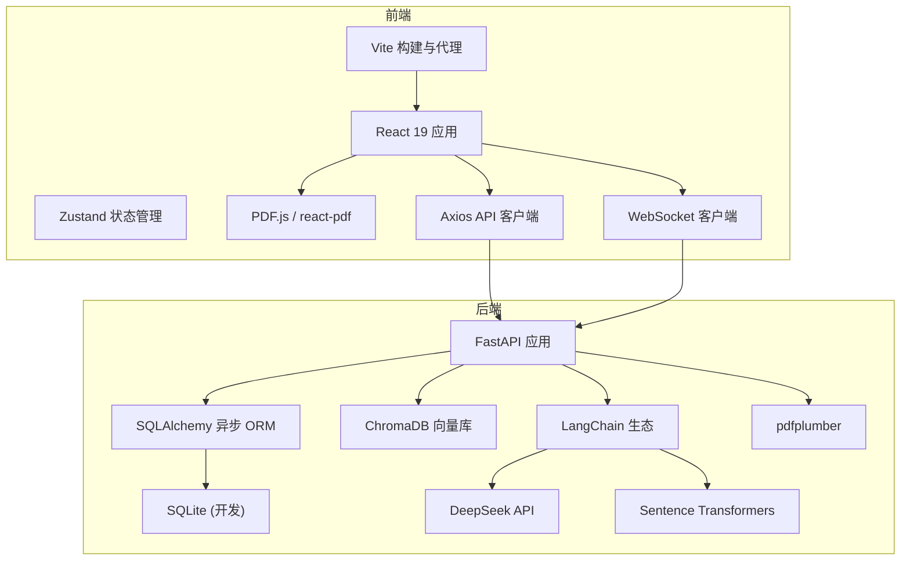
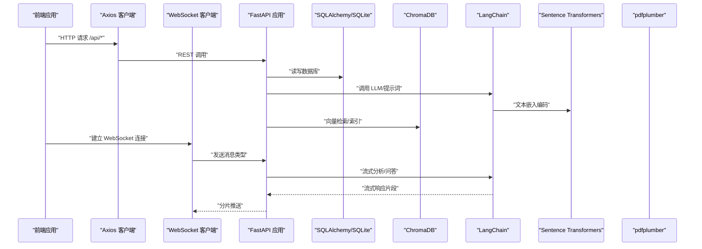
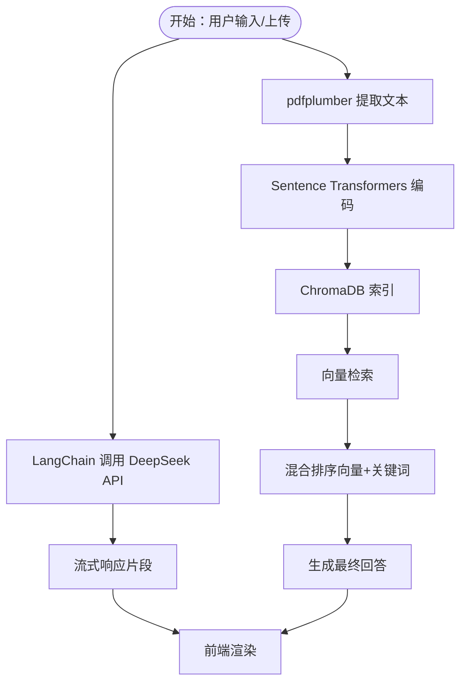
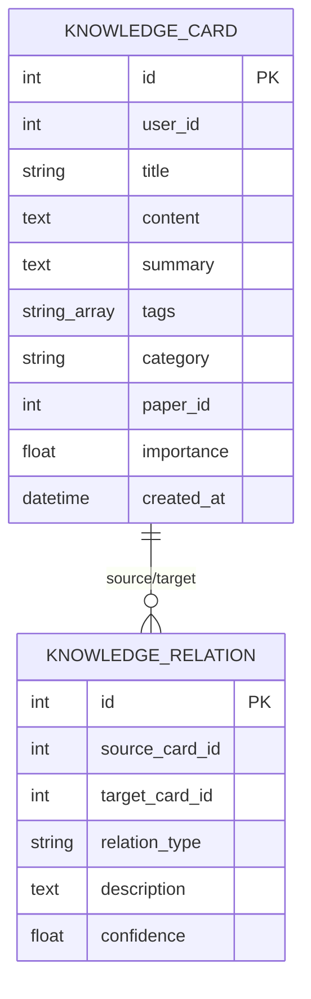
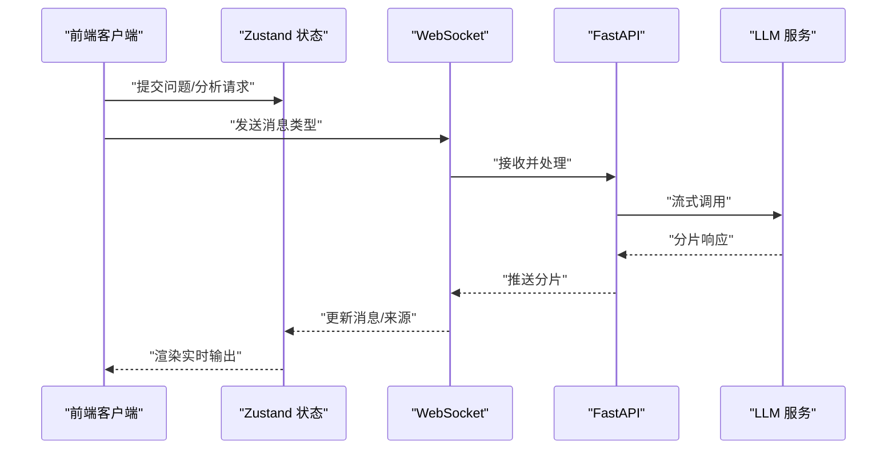
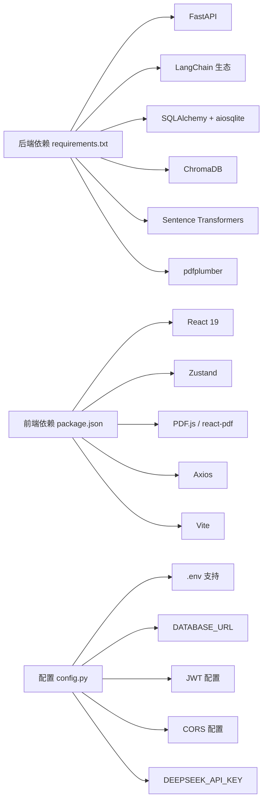

# 技术栈与依赖

<cite>
**本文档引用的文件**
- [requirements.txt](file://backend/requirements.txt)
- [package.json](file://frontend/package.json)
- [config.py](file://backend/app/config.py)
- [main.py](file://backend/main.py)
- [database.py](file://backend/app/database.py)
- [llm_service.py](file://backend/app/services/llm_service.py)
- [knowledge_service.py](file://backend/app/services/knowledge_service.py)
- [pdf_service.py](file://backend/app/services/pdf_service.py)
- [vite.config.js](file://frontend/vite.config.js)
- [chatStore.js](file://frontend/src/stores/chatStore.js)
- [index.js](file://frontend/src/api/index.js)
</cite>

## 目录
1. [简介](#简介)
2. [项目结构](#项目结构)
3. [核心组件](#核心组件)
4. [架构总览](#架构总览)
5. [详细组件分析](#详细组件分析)
6. [依赖分析](#依赖分析)
7. [性能考虑](#性能考虑)
8. [故障排除指南](#故障排除指南)
9. [结论](#结论)
10. [附录](#附录)

## 简介
本文件系统性梳理 PaperChat 的技术栈与依赖，覆盖后端（FastAPI、SQLAlchemy、LangChain、ChromaDB、pdfplumber）、前端（React 19、Zustand、PDF.js、Vite）、AI 服务集成（DeepSeek API、Sentence Transformers）、数据库技术栈（SQLite 与 ChromaDB），并提供安装与配置指南（环境变量与第三方服务）。

## 项目结构
项目采用前后端分离架构：
- 后端：Python + FastAPI，提供 REST/WebSocket 接口，集成 LangChain、ChromaDB、pdfplumber 等。
- 前端：React 19 + Vite，使用 Zustand 管理状态，PDF.js 渲染 PDF，Axios 与 WebSocket 与后端交互。
- 数据存储：开发阶段使用 SQLite；知识向量检索使用 ChromaDB。

图表来源
- [main.py:13-26](file://backend/main.py#L13-L26)
- [database.py:14-27](file://backend/app/database.py#L14-L27)
- [config.py:22-23](file://backend/app/config.py#L22-L23)
- [knowledge_service.py:375-506](file://backend/app/services/knowledge_service.py#L375-L506)
- [pdf_service.py:14-143](file://backend/app/services/pdf_service.py#L14-L143)
- [vite.config.js:7-17](file://frontend/vite.config.js#L7-L17)
- [chatStore.js:395-413](file://frontend/src/stores/chatStore.js#L395-L413)

章节来源
- [main.py:13-26](file://backend/main.py#L13-L26)
- [database.py:14-27](file://backend/app/database.py#L14-L27)
- [config.py:22-23](file://backend/app/config.py#L22-L23)
- [vite.config.js:7-17](file://frontend/vite.config.js#L7-L17)

## 核心组件
- 后端框架：FastAPI 提供高性能异步接口，支持 REST 与 WebSocket。
- 数据持久化：SQLAlchemy 异步 ORM + SQLite（开发环境）。
- 向量检索：ChromaDB + Sentence Transformers。
- PDF 处理：pdfplumber 提取元数据、文本块与全文。
- AI 集成：LangChain + DeepSeek API；提示词驱动的知识抽取与标签生成。
- 前端框架：React 19 + Vite；Zustand 管理会话与消息状态；PDF.js 渲染 PDF；Axios 与 WebSocket 通信。

章节来源
- [requirements.txt:1-19](file://backend/requirements.txt#L1-L19)
- [package.json:12-34](file://frontend/package.json#L12-L34)
- [config.py:22-27](file://backend/app/config.py#L22-L27)
- [knowledge_service.py:375-506](file://backend/app/services/knowledge_service.py#L375-L506)
- [pdf_service.py:14-143](file://backend/app/services/pdf_service.py#L14-L143)

## 架构总览
后端通过 FastAPI 暴露健康检查、WebSocket 以及各路由模块；数据库使用 SQLAlchemy 异步连接；知识向量索引由 ChromaDB 承载；PDF 解析由 pdfplumber 完成；前端通过 Axios 与 WebSocket 与后端交互。

图表来源
- [main.py:34-135](file://backend/main.py#L34-L135)
- [database.py:30-47](file://backend/app/database.py#L30-L47)
- [knowledge_service.py:375-506](file://backend/app/services/knowledge_service.py#L375-L506)
- [pdf_service.py:14-143](file://backend/app/services/pdf_service.py#L14-L143)

## 详细组件分析

### 后端技术栈与版本要求
- FastAPI >= 0.104.0：提供高性能异步 Web 框架与自动 OpenAPI 文档。
- Uvicorn[standard] >= 0.24.0：ASGI 服务器。
- LangChain 生态：langchain>=0.1.8、langchain-openai>=0.0.5、langchain-community>=0.0.10、langchain-core>=0.1.0。
- SQLAlchemy >= 2.0.0 + aiosqlite >= 0.19.0：异步 ORM 与 SQLite 驱动。
- Pydantic Settings >= 2.0.0：从 .env 读取配置。
- 其他：python-jose、passlib、python-multipart、email-validator、rank-bm25、alembic。
- 向量与嵌入：chromadb>=1.5.0、sentence-transformers>=2.5.0。
- PDF 解析：pdfplumber>=0.10.0。

章节来源
- [requirements.txt:1-19](file://backend/requirements.txt#L1-L19)
- [config.py:15-40](file://backend/app/config.py#L15-L40)

### 前端技术栈与选择理由
- React 19：最新稳定版本，具备并发特性与更好的性能。
- Vite：快速构建工具，支持热更新与高效打包。
- PDF.js 与 react-pdf：高质量 PDF 渲染与交互。
- Zustand：轻量状态管理，适合复杂会话与消息流。
- Axios：统一 API 客户端，简化请求与响应处理。
- ESLint/Vite 插件：保证代码质量与开发体验。

章节来源
- [package.json:12-34](file://frontend/package.json#L12-L34)
- [vite.config.js:1-54](file://frontend/vite.config.js#L1-L54)
- [chatStore.js:1-417](file://frontend/src/stores/chatStore.js#L1-L417)
- [index.js:1-12](file://frontend/src/api/index.js#L1-L12)

### AI 服务集成（DeepSeek API 与 Sentence Transformers）
- DeepSeek API：通过 LangChain 的 OpenAI 兼容适配器调用，用于流式分析与问答。
- Sentence Transformers：用于将文本编码为向量，配合 ChromaDB 实现向量检索。
- 提示词工程：知识抽取、标签生成、关联发现均通过 LangChain Messages 与 Prompt 模板完成。

图表来源
- [knowledge_service.py:375-506](file://backend/app/services/knowledge_service.py#L375-L506)
- [pdf_service.py:14-143](file://backend/app/services/pdf_service.py#L14-L143)

章节来源
- [knowledge_service.py:20-76](file://backend/app/services/knowledge_service.py#L20-L76)
- [knowledge_service.py:375-506](file://backend/app/services/knowledge_service.py#L375-L506)
- [pdf_service.py:14-143](file://backend/app/services/pdf_service.py#L14-L143)

### 数据库技术栈（SQLite 与 ChromaDB）
- SQLite（开发）：轻量、易部署，适合本地开发与演示。
- ChromaDB：嵌入式/独立向量数据库，支持 cosine 距离，适合 RAG 场景。
- 向量索引策略：按用户维度隔离 collection，文本拼接（标题+内容+标签）进行编码与存储。

图表来源
- [knowledge_service.py:526-592](file://backend/app/services/knowledge_service.py#L526-L592)

章节来源
- [database.py:14-27](file://backend/app/database.py#L14-L27)
- [knowledge_service.py:466-524](file://backend/app/services/knowledge_service.py#L466-L524)

### WebSocket 与流式响应
- 后端通过 WebSocket 提供流式分析与问答能力，支持取消与错误处理。
- 前端使用 Zustand 管理会话、消息与来源，WebSocket 事件驱动 UI 更新。

图表来源
- [main.py:34-135](file://backend/main.py#L34-L135)
- [chatStore.js:395-413](file://frontend/src/stores/chatStore.js#L395-L413)

章节来源
- [main.py:34-135](file://backend/main.py#L34-L135)
- [chatStore.js:395-413](file://frontend/src/stores/chatStore.js#L395-L413)

## 依赖分析
- 后端依赖集中在 requirements.txt，涵盖 Web 框架、ORM、AI 生态、向量库与 PDF 解析。
- 前端依赖集中在 package.json，包含 React、PDF 渲染、状态管理与构建工具。
- 配置集中于 config.py，支持 .env 文件加载，包含数据库、JWT、CORS、上传目录与 DeepSeek API Key。

图表来源
- [requirements.txt:1-19](file://backend/requirements.txt#L1-L19)
- [package.json:12-34](file://frontend/package.json#L12-L34)
- [config.py:15-40](file://backend/app/config.py#L15-L40)

章节来源
- [requirements.txt:1-19](file://backend/requirements.txt#L1-L19)
- [package.json:12-34](file://frontend/package.json#L12-L34)
- [config.py:15-40](file://backend/app/config.py#L15-L40)

## 性能考虑
- 向量检索：对查询文本进行异步嵌入编码，使用线程池执行 CPU 密集任务，避免阻塞事件循环。
- 混合检索：结合向量相似度与关键词匹配，减少误召回，提升相关性。
- 分片推送：WebSocket 流式响应，前端逐步渲染，降低首屏等待时间。
- 构建优化：Vite 按依赖拆分 chunk，将 React、PDF、Zustand、Markdown 等独立打包，提升缓存命中率。
- PDF 解析：按页提取字符坐标，合并行文本，避免全量扫描导致内存峰值过高。

章节来源
- [knowledge_service.py:375-506](file://backend/app/services/knowledge_service.py#L375-L506)
- [vite.config.js:23-47](file://frontend/vite.config.js#L23-L47)
- [pdf_service.py:69-118](file://backend/app/services/pdf_service.py#L69-L118)

## 故障排除指南
- WebSocket 连接失败：确认后端 CORS 配置与前端代理设置一致；检查后端日志与异常分支。
- 向量检索异常：确认 ChromaDB 客户端可用、集合存在且非空；检查嵌入模型初始化与编码执行。
- PDF 解析报错：验证文件头与扩展名；确保 pdfplumber 可打开文件；关注字符坐标与空页处理。
- 数据库事务：异常时自动回滚并关闭会话，避免连接泄漏。
- 环境变量缺失：DEEPSEEK_API_KEY、JWT 密钥、上传目录需正确配置；.env 文件编码为 UTF-8。

章节来源
- [main.py:136-147](file://backend/main.py#L136-L147)
- [knowledge_service.py:401-404](file://backend/app/services/knowledge_service.py#L401-L404)
- [pdf_service.py:173-189](file://backend/app/services/pdf_service.py#L173-L189)
- [database.py:40-47](file://backend/app/database.py#L40-L47)
- [config.py:25-31](file://backend/app/config.py#L25-L31)

## 结论
PaperChat 采用现代化技术栈：后端以 FastAPI + LangChain + ChromaDB + pdfplumber 构建，前端以 React 19 + Vite + Zustand + PDF.js 组合，形成高性能、可扩展的论文阅读与智能问答平台。SQLite 与 ChromaDB 的组合兼顾开发便捷与检索效果，DeepSeek API 与 Sentence Transformers 提供强大的语言理解与向量能力。

## 附录

### 依赖安装与配置指南
- 后端安装与运行
  - 安装依赖：pip install -r backend/requirements.txt
  - 创建 .env 文件，设置 DATABASE_URL、DEEPSEEK_API_KEY、JWT_SECRET_KEY 等
  - 初始化数据库：在应用启动时调用初始化逻辑
  - 启动服务：uvicorn --host 0.0.0.0 --port 8000 backend.main:app

- 前端安装与运行
  - 安装依赖：npm install
  - 开发运行：npm run dev
  - 构建产物：npm run build
  - 代理配置：Vite 已内置 /api 与 /ws 代理至后端

- 第三方服务配置
  - DeepSeek API：在 .env 中配置 DEEPSEEK_API_KEY
  - ChromaDB：默认本地嵌入式运行；生产可改为独立服务
  - HuggingFace 模型镜像与缓存：已在配置中设置 HF_ENDPOINT 与 HF_HOME

章节来源
- [requirements.txt:1-19](file://backend/requirements.txt#L1-L19)
- [package.json:6-11](file://frontend/package.json#L6-L11)
- [config.py:1-11](file://backend/app/config.py#L1-L11)
- [config.py:25-31](file://backend/app/config.py#L25-L31)
- [main.py:5-11](file://backend/main.py#L5-L11)