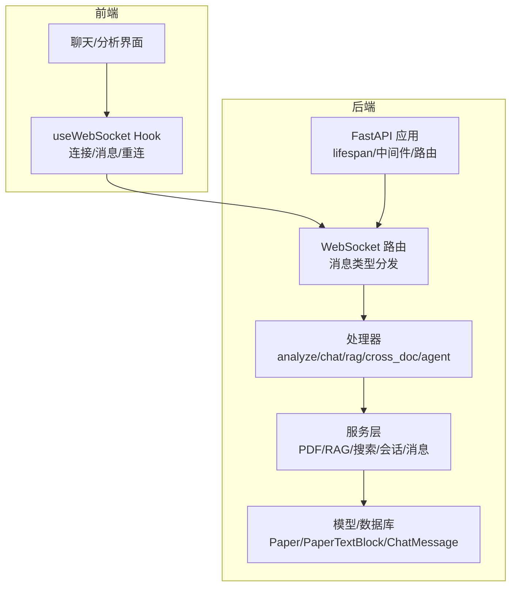
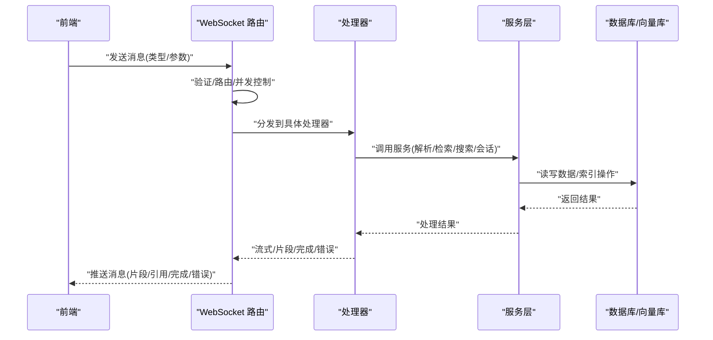
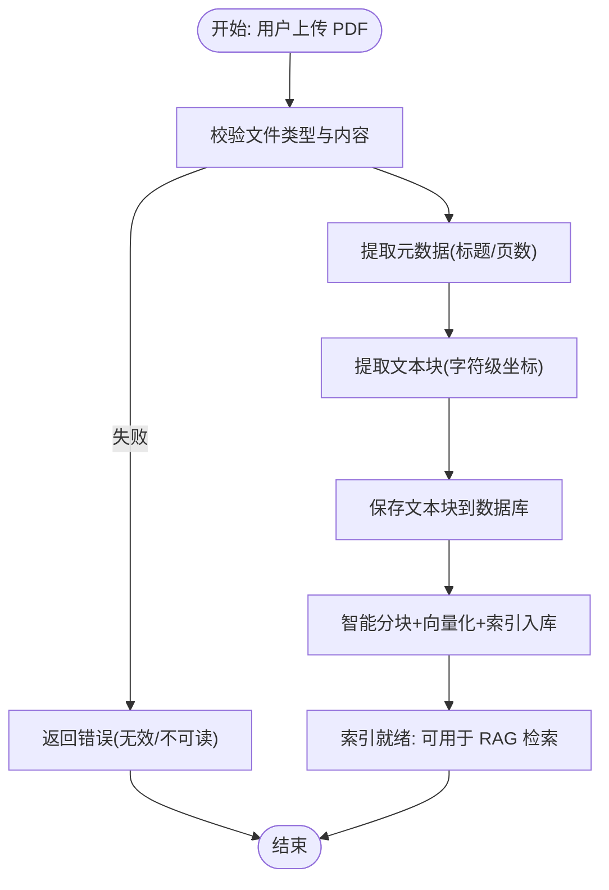
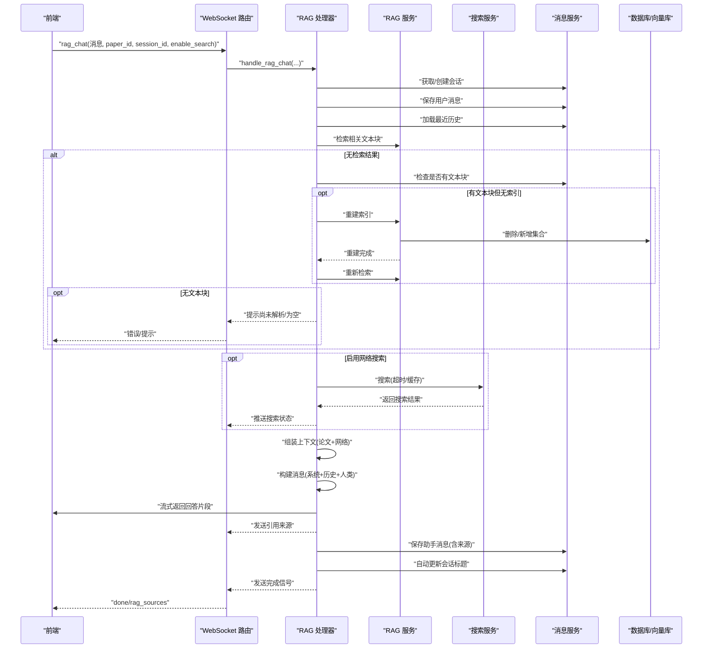
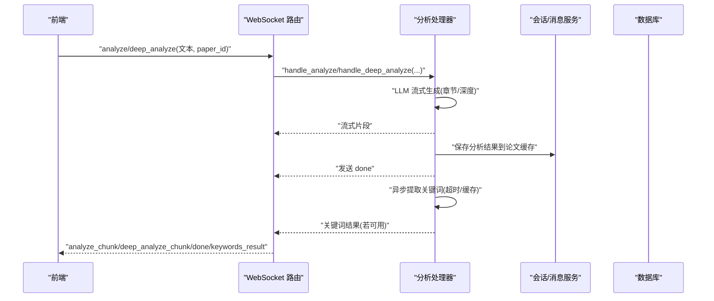
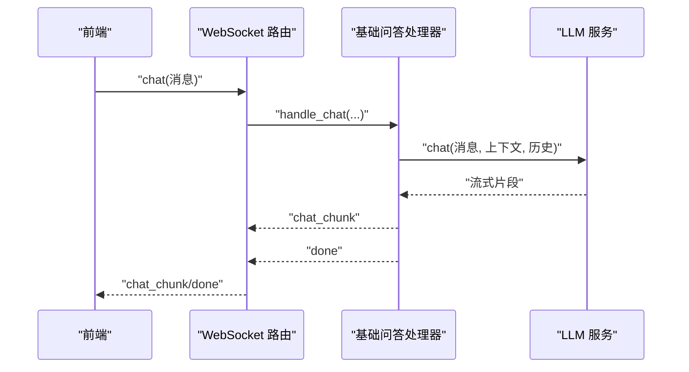
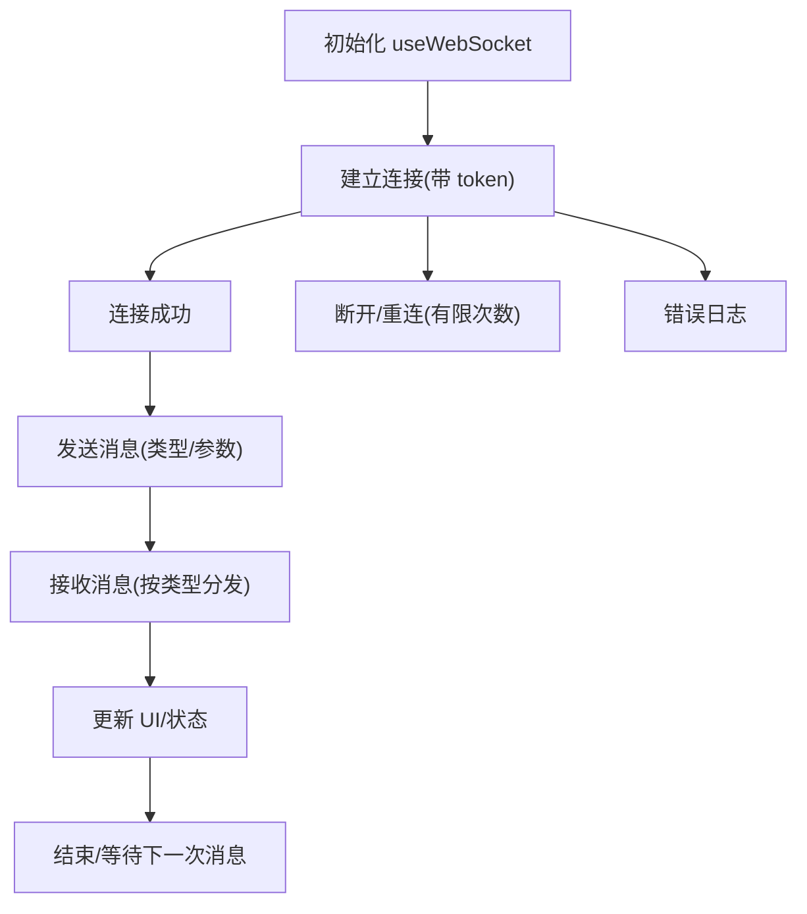
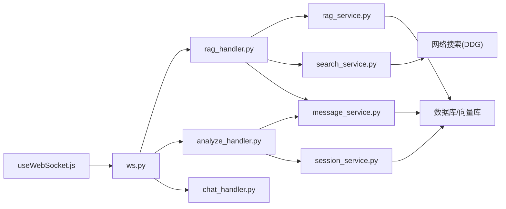
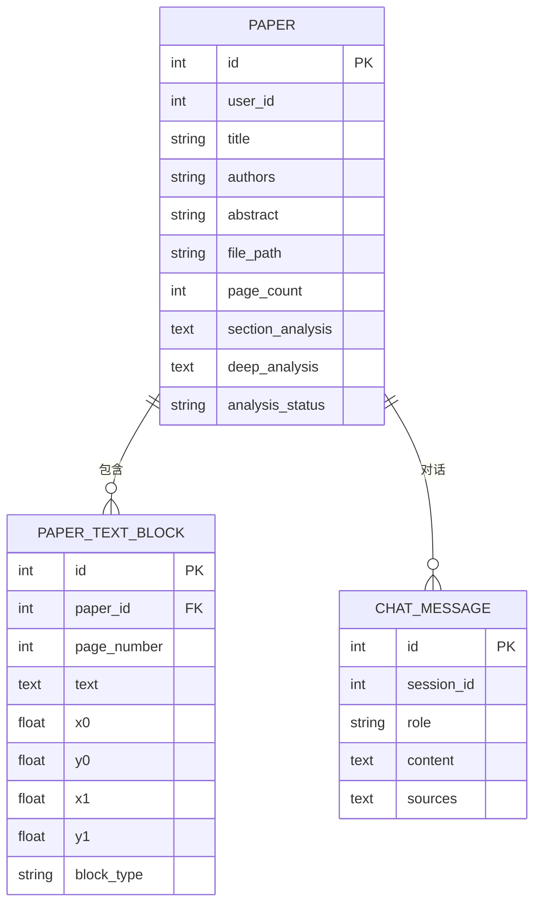

# 数据流与处理流程

<cite>
**本文引用的文件**
- [backend/app/main.py](file://backend/app/main.py)
- [backend/app/routers/ws.py](file://backend/app/routers/ws.py)
- [backend/app/handlers/rag_handler.py](file://backend/app/handlers/rag_handler.py)
- [backend/app/handlers/chat_handler.py](file://backend/app/handlers/chat_handler.py)
- [backend/app/handlers/analyze_handler.py](file://backend/app/handlers/analyze_handler.py)
- [backend/app/services/pdf_service.py](file://backend/app/services/pdf_service.py)
- [backend/app/services/rag_service.py](file://backend/app/services/rag_service.py)
- [backend/app/services/search_service.py](file://backend/app/services/search_service.py)
- [backend/app/services/session_service.py](file://backend/app/services/session_service.py)
- [backend/app/services/message_service.py](file://backend/app/services/message_service.py)
- [backend/app/models/paper.py](file://backend/app/models/paper.py)
- [frontend/src/hooks/useWebSocket.js](file://frontend/src/hooks/useWebSocket.js)
</cite>

## 目录
1. [简介](#简介)
2. [项目结构](#项目结构)
3. [核心组件](#核心组件)
4. [架构总览](#架构总览)
5. [详细组件分析](#详细组件分析)
6. [依赖关系分析](#依赖关系分析)
7. [性能考量](#性能考量)
8. [故障排查指南](#故障排查指南)
9. [结论](#结论)
10. [附录](#附录)

## 简介
本文档聚焦 PaperChat 系统的数据流与处理流程，围绕三大主线数据流展开：
- 文件上传流程：前端 → 后端 API → PDF 解析 → 文本块存储 → 向量索引
- 问答流程：前端输入 → WebSocket → RAG 检索 → LLM 生成 → 流式响应
- 分析流程：PDF 文本 → LLM 分析 → JSON 结果 → 前端渲染

文档解释了数据在各层之间的传递方式，包括请求参数验证、响应数据格式化、错误处理机制；描述了异步数据处理的实现方式，包括并发处理、缓存策略、性能优化，并提供数据流图和处理时序图，帮助开发者快速理解系统的数据处理逻辑。

## 项目结构
系统采用前后端分离架构，后端以 FastAPI 为核心，通过 WebSocket 提供实时交互能力；前端通过自定义 Hook 管理 WebSocket 连接与消息分发。

图表来源
- [backend/app/main.py:55-95](file://backend/app/main.py#L55-L95)
- [backend/app/routers/ws.py:76-102](file://backend/app/routers/ws.py#L76-L102)

章节来源
- [backend/app/main.py:16-53](file://backend/app/main.py#L16-L53)
- [backend/app/main.py:55-95](file://backend/app/main.py#L55-L95)
- [backend/app/routers/ws.py:76-102](file://backend/app/routers/ws.py#L76-L102)

## 核心组件
- WebSocket 路由与状态管理：负责连接生命周期、消息类型路由、并发任务管理与清理。
- 处理器：分别处理分析、问答、RAG 问答、Agent 问答、跨文档问答等业务场景。
- 服务层：
  - PDF 解析服务：提取元数据、文本块、全文与页数，校验 PDF 有效性。
  - RAG 检索服务：智能分块、向量索引、混合检索（语义+BM25）、RRF 融合排序、跨论文检索、索引重建与删除。
  - 搜索服务：集成 DuckDuckGo，支持超时控制与结果缓存。
  - 会话与消息服务：会话持久化、历史加载、消息保存、关键词提取与缓存。
- 数据模型：Paper、PaperTextBlock、ChatMessage 等 ORM 映射，支撑全文文本、索引与会话记录。
- 前端 Hook：统一管理 WebSocket 连接、消息订阅、重连策略与发送方法。

章节来源
- [backend/app/routers/ws.py:56-65](file://backend/app/routers/ws.py#L56-L65)
- [backend/app/handlers/analyze_handler.py:13-48](file://backend/app/handlers/analyze_handler.py#L13-L48)
- [backend/app/handlers/chat_handler.py:11-32](file://backend/app/handlers/chat_handler.py#L11-L32)
- [backend/app/handlers/rag_handler.py:29-217](file://backend/app/handlers/rag_handler.py#L29-L217)
- [backend/app/services/pdf_service.py:11-194](file://backend/app/services/pdf_service.py#L11-L194)
- [backend/app/services/rag_service.py:16-400](file://backend/app/services/rag_service.py#L16-L400)
- [backend/app/services/search_service.py:10-113](file://backend/app/services/search_service.py#L10-L113)
- [backend/app/services/session_service.py:17-134](file://backend/app/services/session_service.py#L17-L134)
- [backend/app/services/message_service.py:14-72](file://backend/app/services/message_service.py#L14-L72)
- [backend/app/models/paper.py:11-85](file://backend/app/models/paper.py#L11-L85)
- [frontend/src/hooks/useWebSocket.js:19-71](file://frontend/src/hooks/useWebSocket.js#L19-L71)

## 架构总览
系统通过 WebSocket 实现前端与后端的实时双向通信，处理器根据消息类型分发到相应服务，服务层协调数据库与外部模型/引擎完成数据处理与检索。

图表来源
- [backend/app/routers/ws.py:114-436](file://backend/app/routers/ws.py#L114-L436)
- [backend/app/handlers/rag_handler.py:29-217](file://backend/app/handlers/rag_handler.py#L29-L217)
- [backend/app/handlers/analyze_handler.py:13-87](file://backend/app/handlers/analyze_handler.py#L13-L87)
- [backend/app/handlers/chat_handler.py:11-32](file://backend/app/handlers/chat_handler.py#L11-L32)

## 详细组件分析

### 文件上传与解析数据流
该流程从 PDF 文件上传到向量索引建立，涉及 PDF 解析、文本块存储与向量索引。

图表来源
- [backend/app/services/pdf_service.py:14-194](file://backend/app/services/pdf_service.py#L14-L194)
- [backend/app/services/rag_service.py:102-232](file://backend/app/services/rag_service.py#L102-L232)
- [backend/app/models/paper.py:65-85](file://backend/app/models/paper.py#L65-L85)

章节来源
- [backend/app/services/pdf_service.py:14-194](file://backend/app/services/pdf_service.py#L14-L194)
- [backend/app/services/rag_service.py:102-232](file://backend/app/services/rag_service.py#L102-L232)
- [backend/app/models/paper.py:65-85](file://backend/app/models/paper.py#L65-L85)

### RAG 问答数据流与时序
RAG 问答流程包含会话管理、检索、可选网络搜索、上下文组装、LLM 流式生成与引用来源回传。

图表来源
- [backend/app/routers/ws.py:153-183](file://backend/app/routers/ws.py#L153-L183)
- [backend/app/handlers/rag_handler.py:29-217](file://backend/app/handlers/rag_handler.py#L29-L217)
- [backend/app/services/rag_service.py:233-306](file://backend/app/services/rag_service.py#L233-L306)
- [backend/app/services/search_service.py:41-103](file://backend/app/services/search_service.py#L41-L103)
- [backend/app/services/message_service.py:14-72](file://backend/app/services/message_service.py#L14-L72)

章节来源
- [backend/app/routers/ws.py:153-183](file://backend/app/routers/ws.py#L153-L183)
- [backend/app/handlers/rag_handler.py:29-217](file://backend/app/handlers/rag_handler.py#L29-L217)
- [backend/app/services/rag_service.py:233-306](file://backend/app/services/rag_service.py#L233-L306)
- [backend/app/services/search_service.py:41-103](file://backend/app/services/search_service.py#L41-L103)
- [backend/app/services/message_service.py:14-72](file://backend/app/services/message_service.py#L14-L72)

### 论文章节/深度分析数据流
分析流程通过 LLM 生成章节概述或深度分析，并将结果缓存至论文记录，同时异步提取关键词。

图表来源
- [backend/app/routers/ws.py:120-200](file://backend/app/routers/ws.py#L120-L200)
- [backend/app/handlers/analyze_handler.py:13-87](file://backend/app/handlers/analyze_handler.py#L13-L87)
- [backend/app/services/session_service.py:62-134](file://backend/app/services/session_service.py#L62-L134)

章节来源
- [backend/app/routers/ws.py:120-200](file://backend/app/routers/ws.py#L120-L200)
- [backend/app/handlers/analyze_handler.py:13-87](file://backend/app/handlers/analyze_handler.py#L13-L87)
- [backend/app/services/session_service.py:62-134](file://backend/app/services/session_service.py#L62-L134)

### 基础问答数据流
基础问答直接使用全文上下文与历史进行对话，流式返回回答。

图表来源
- [backend/app/routers/ws.py:137-151](file://backend/app/routers/ws.py#L137-L151)
- [backend/app/handlers/chat_handler.py:11-32](file://backend/app/handlers/chat_handler.py#L11-L32)

章节来源
- [backend/app/routers/ws.py:137-151](file://backend/app/routers/ws.py#L137-L151)
- [backend/app/handlers/chat_handler.py:11-32](file://backend/app/handlers/chat_handler.py#L11-L32)

### 前端 WebSocket 交互与错误处理
前端通过自定义 Hook 统一管理连接、消息订阅、重连与发送，后端在路由层进行消息类型校验与并发任务管理，异常通过错误消息返回。

图表来源
- [frontend/src/hooks/useWebSocket.js:19-71](file://frontend/src/hooks/useWebSocket.js#L19-L71)
- [frontend/src/hooks/useWebSocket.js:100-176](file://frontend/src/hooks/useWebSocket.js#L100-L176)
- [backend/app/routers/ws.py:114-436](file://backend/app/routers/ws.py#L114-L436)

章节来源
- [frontend/src/hooks/useWebSocket.js:19-71](file://frontend/src/hooks/useWebSocket.js#L19-L71)
- [frontend/src/hooks/useWebSocket.js:100-176](file://frontend/src/hooks/useWebSocket.js#L100-L176)
- [backend/app/routers/ws.py:114-436](file://backend/app/routers/ws.py#L114-L436)

## 依赖关系分析
后端组件之间存在清晰的分层依赖：路由层依赖处理器，处理器依赖服务层，服务层依赖数据库与外部引擎；前端通过 Hook 与后端路由解耦。

图表来源
- [backend/app/routers/ws.py:23-27](file://backend/app/routers/ws.py#L23-L27)
- [backend/app/handlers/rag_handler.py:10-17](file://backend/app/handlers/rag_handler.py#L10-L17)
- [backend/app/handlers/analyze_handler.py:8-10](file://backend/app/handlers/analyze_handler.py#L8-L10)
- [backend/app/handlers/chat_handler.py:8](file://backend/app/handlers/chat_handler.py#L8)
- [backend/app/services/rag_service.py:16](file://backend/app/services/rag_service.py#L16)
- [backend/app/services/search_service.py:10](file://backend/app/services/search_service.py#L10)
- [backend/app/services/message_service.py:14](file://backend/app/services/message_service.py#L14)
- [backend/app/services/session_service.py:17](file://backend/app/services/session_service.py#L17)
- [frontend/src/hooks/useWebSocket.js:3](file://frontend/src/hooks/useWebSocket.js#L3)

章节来源
- [backend/app/routers/ws.py:23-27](file://backend/app/routers/ws.py#L23-L27)
- [backend/app/handlers/rag_handler.py:10-17](file://backend/app/handlers/rag_handler.py#L10-L17)
- [backend/app/handlers/analyze_handler.py:8-10](file://backend/app/handlers/analyze_handler.py#L8-L10)
- [backend/app/handlers/chat_handler.py:8](file://backend/app/handlers/chat_handler.py#L8)
- [backend/app/services/rag_service.py:16](file://backend/app/services/rag_service.py#L16)
- [backend/app/services/search_service.py:10](file://backend/app/services/search_service.py#L10)
- [backend/app/services/message_service.py:14](file://backend/app/services/message_service.py#L14)
- [backend/app/services/session_service.py:17](file://backend/app/services/session_service.py#L17)
- [frontend/src/hooks/useWebSocket.js:3](file://frontend/src/hooks/useWebSocket.js#L3)

## 性能考量
- 异步与并发
  - WebSocket 路由对每类任务维护独立并发任务表，支持取消与覆盖，避免资源泄漏。
  - RAG 检索与搜索在独立线程池中执行，避免阻塞事件循环。
  - LLM 生成采用流式输出，前端即时渲染，提升交互体验。
- 缓存策略
  - RAG 服务对 BM25 索引与文档集合进行缓存，避免重复构建。
  - 搜索服务对查询结果进行缓存，控制最大缓存大小与超时。
  - 分析结果与关键词提取结果写入论文记录，减少重复计算。
- 索引与检索优化
  - 智能分块策略与重叠窗口，提升检索召回。
  - 语义检索与 BM25 关键词检索融合（RRF），平衡相关性与准确性。
  - 支持跨论文检索与索引重建，保证数据一致性。
- I/O 与数据库
  - 会话与消息服务使用独立数据库会话，降低锁竞争。
  - PDF 解析与文本块存储按页排序，便于后续检索与展示。

章节来源
- [backend/app/routers/ws.py:56-65](file://backend/app/routers/ws.py#L56-L65)
- [backend/app/routers/ws.py:130-135](file://backend/app/routers/ws.py#L130-L135)
- [backend/app/services/rag_service.py:44-46](file://backend/app/services/rag_service.py#L44-L46)
- [backend/app/services/rag_service.py:163-181](file://backend/app/services/rag_service.py#L163-L181)
- [backend/app/services/search_service.py:20-23](file://backend/app/services/search_service.py#L20-L23)
- [backend/app/services/search_service.py:62-96](file://backend/app/services/search_service.py#L62-L96)
- [backend/app/services/session_service.py:62-87](file://backend/app/services/session_service.py#L62-L87)
- [backend/app/services/pdf_service.py:72-118](file://backend/app/services/pdf_service.py#L72-L118)

## 故障排查指南
- WebSocket 连接问题
  - 检查前端 Hook 的重连逻辑与状态监听，确认 token 是否正确传递。
  - 后端路由在未授权时主动关闭连接，需确认 JWT 校验与用户状态。
- 消息类型与参数校验
  - 后端对消息类型进行严格校验，错误类型将返回错误消息；检查前端发送的消息格式与必填字段。
- RAG 检索失败
  - 若无检索结果，检查是否存在文本块与索引状态；必要时触发重建索引。
  - 网络搜索超时或失败时，后端返回空结果并记录日志，前端可提示重试。
- LLM 生成异常
  - 处理器捕获异常并返回错误消息；检查 LLM 服务可用性与超时配置。
- 数据库与索引
  - 确认 PaperTextBlock 与向量集合存在；跨论文检索时检查 paper_ids 有效性。

章节来源
- [frontend/src/hooks/useWebSocket.js:19-71](file://frontend/src/hooks/useWebSocket.js#L19-L71)
- [backend/app/routers/ws.py:103-107](file://backend/app/routers/ws.py#L103-L107)
- [backend/app/routers/ws.py:120-128](file://backend/app/routers/ws.py#L120-L128)
- [backend/app/routers/ws.py:167-172](file://backend/app/routers/ws.py#L167-L172)
- [backend/app/handlers/rag_handler.py:48-89](file://backend/app/handlers/rag_handler.py#L48-L89)
- [backend/app/services/search_service.py:98-103](file://backend/app/services/search_service.py#L98-L103)
- [backend/app/services/rag_service.py:355-370](file://backend/app/services/rag_service.py#L355-L370)

## 结论
PaperChat 系统通过清晰的分层设计与异步处理机制，实现了从 PDF 解析到向量索引、从 RAG 检索到 LLM 流式生成的完整数据链路。WebSocket 提供了低延迟的实时交互能力，配合严格的参数校验、错误处理与缓存策略，保障了系统的稳定性与性能。建议在生产环境中关注索引重建策略、搜索缓存命中率与 LLM 超时配置，以进一步优化用户体验。

## 附录
- 数据模型概览（简化）

图表来源
- [backend/app/models/paper.py:11-85](file://backend/app/models/paper.py#L11-L85)