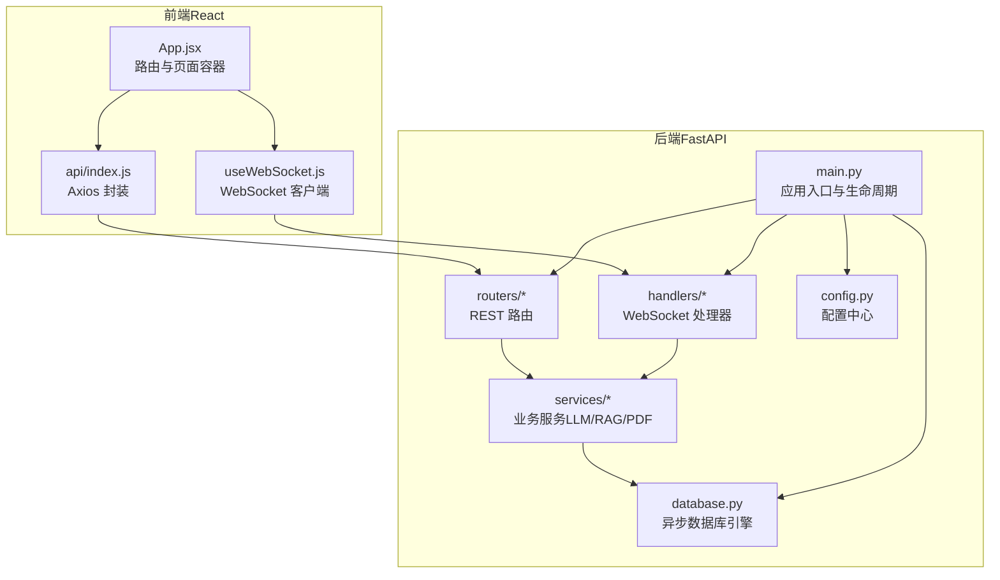
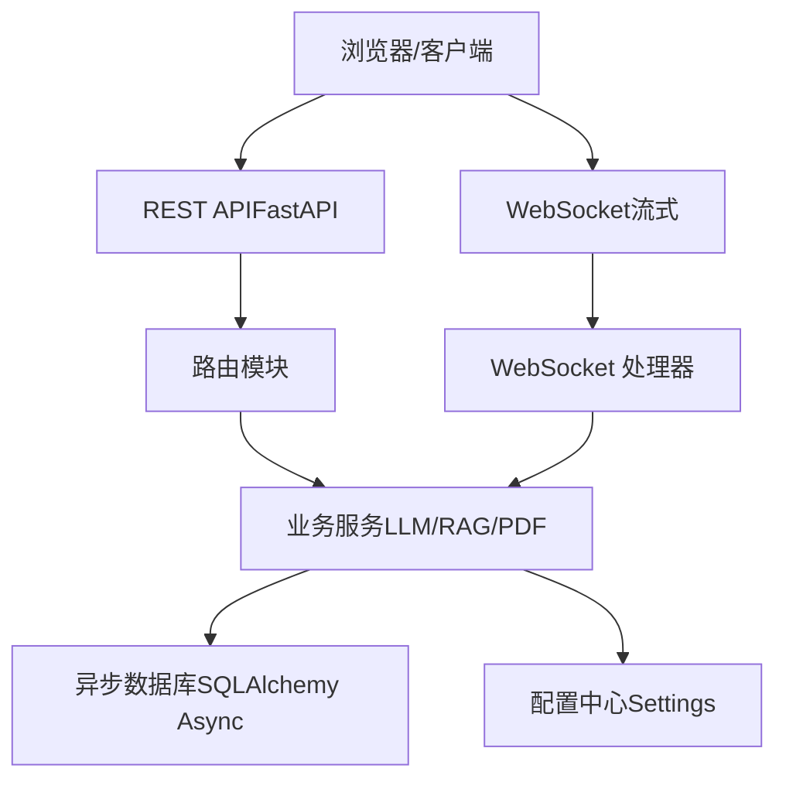
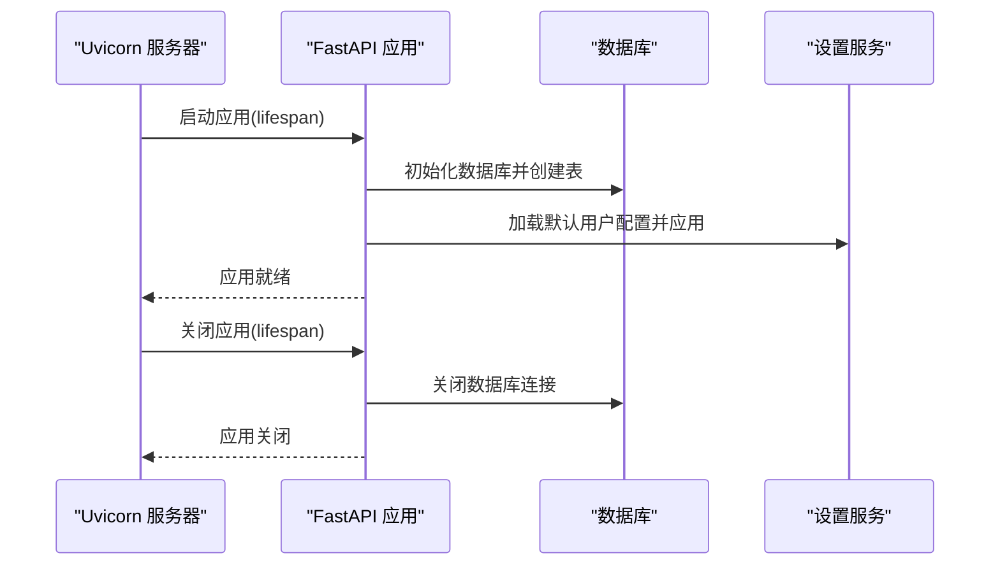
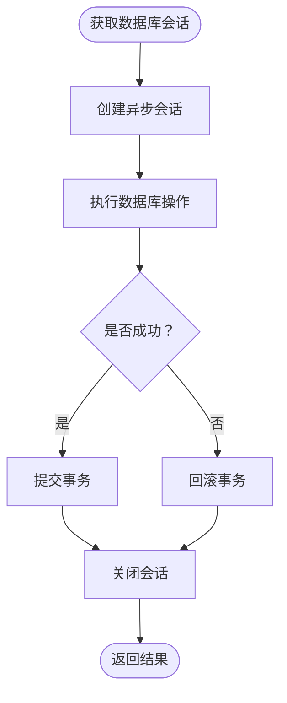
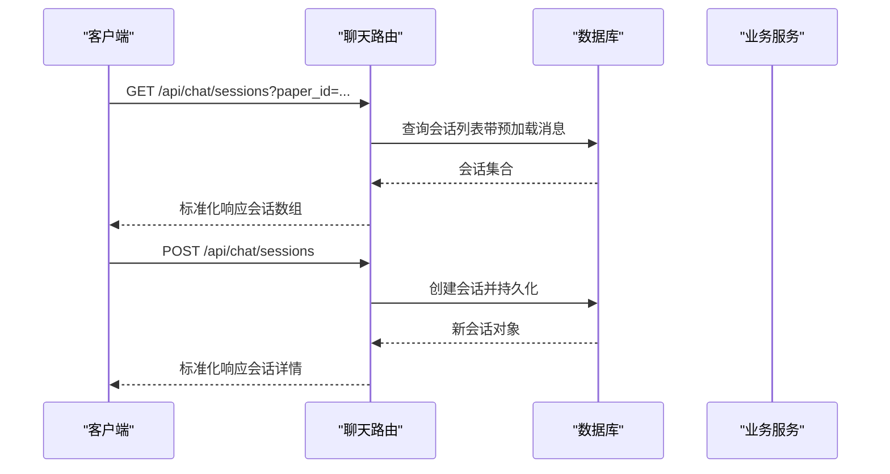
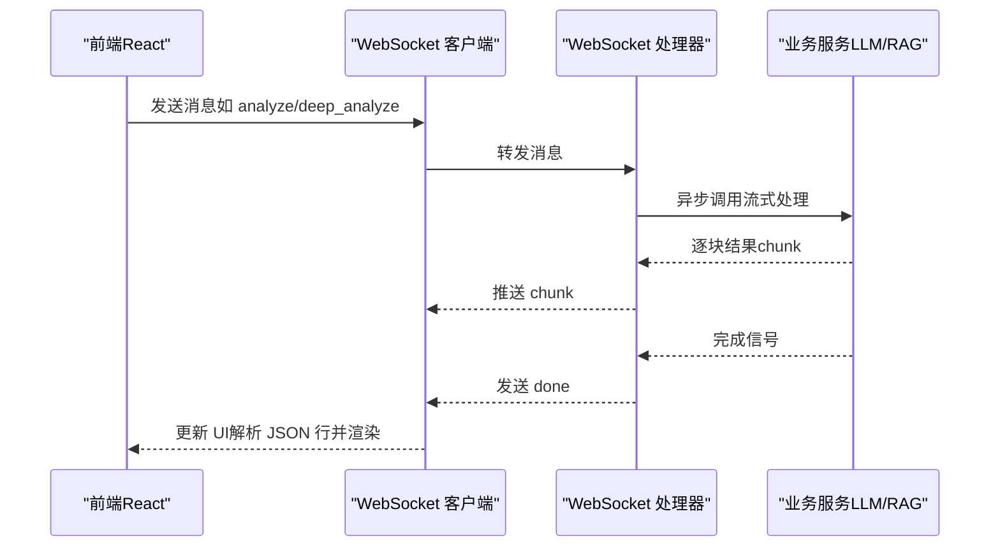
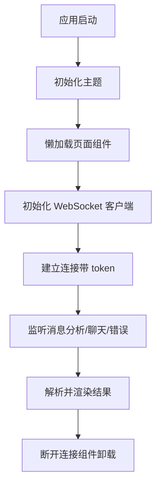
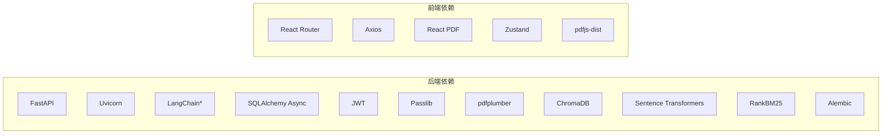

# 整体架构设计

<cite>
**本文引用的文件**
- [backend/app/main.py](file://backend/app/main.py)
- [backend/app/config.py](file://backend/app/config.py)
- [backend/app/database.py](file://backend/app/database.py)
- [backend/app/middleware/error_handler.py](file://backend/app/middleware/error_handler.py)
- [backend/app/routers/__init__.py](file://backend/app/routers/__init__.py)
- [backend/app/routers/chat.py](file://backend/app/routers/chat.py)
- [backend/app/handlers/chat_handler.py](file://backend/app/handlers/chat_handler.py)
- [backend/app/services/llm_service.py](file://backend/app/services/llm_service.py)
- [backend/requirements.txt](file://backend/requirements.txt)
- [frontend/src/App.jsx](file://frontend/src/App.jsx)
- [frontend/src/hooks/useWebSocket.js](file://frontend/src/hooks/useWebSocket.js)
- [frontend/src/api/index.js](file://frontend/src/api/index.js)
- [frontend/package.json](file://frontend/package.json)
- [backend/app/models/paper.py](file://backend/app/models/paper.py)
- [backend/app/models/user.py](file://backend/app/models/user.py)
</cite>

## 目录
1. [引言](#引言)
2. [项目结构](#项目结构)
3. [核心组件](#核心组件)
4. [架构总览](#架构总览)
5. [详细组件分析](#详细组件分析)
6. [依赖分析](#依赖分析)
7. [性能考量](#性能考量)
8. [故障排查指南](#故障排查指南)
9. [结论](#结论)
10. [附录](#附录)

## 引言
本文件面向 PaperChat 系统的整体架构设计，围绕“前后端分离 + 微服务化 + 异步编程”的目标展开，重点说明：
- 技术栈选型：后端采用 FastAPI + SQLAlchemy Async，前端采用 React + Zustand + WebSocket。
- 分层架构：表现层（前端）、业务逻辑层（后端服务）、数据访问层（数据库）清晰分工。
- 微服务化思路：将 LLM、RAG、PDF 处理等能力抽象为可独立演进的服务模块。
- 异步编程：后端基于 asyncio，前端通过 WebSocket 实现流式交互。

## 项目结构
系统采用典型的前后端分离结构：
- 后端（Python/FastAPI）：提供 REST API 与 WebSocket，负责业务编排、数据持久化与外部服务集成。
- 前端（React/Vite）：提供 PDF 阅读、高亮、笔记、分析面板与实时聊天体验，通过 WebSocket 与后端进行流式通信。

图表来源
- [backend/app/main.py:55-95](file://backend/app/main.py#L55-L95)
- [backend/app/routers/__init__.py:1-27](file://backend/app/routers/__init__.py#L1-L27)
- [backend/app/database.py:13-27](file://backend/app/database.py#L13-L27)
- [backend/app/config.py:15-40](file://backend/app/config.py#L15-L40)
- [frontend/src/App.jsx:1-120](file://frontend/src/App.jsx#L1-L120)
- [frontend/src/hooks/useWebSocket.js:1-60](file://frontend/src/hooks/useWebSocket.js#L1-L60)
- [frontend/src/api/index.js:1-12](file://frontend/src/api/index.js#L1-L12)

章节来源
- [backend/app/main.py:55-95](file://backend/app/main.py#L55-L95)
- [backend/app/routers/__init__.py:1-27](file://backend/app/routers/__init__.py#L1-L27)
- [backend/app/database.py:13-27](file://backend/app/database.py#L13-L27)
- [backend/app/config.py:15-40](file://backend/app/config.py#L15-L40)
- [frontend/src/App.jsx:1-120](file://frontend/src/App.jsx#L1-L120)
- [frontend/src/hooks/useWebSocket.js:1-60](file://frontend/src/hooks/useWebSocket.js#L1-L60)
- [frontend/src/api/index.js:1-12](file://frontend/src/api/index.js#L1-L12)

## 核心组件
- 应用入口与生命周期：FastAPI 应用创建、CORS 配置、全局异常处理、路由注册、数据库初始化与关闭。
- 配置中心：集中管理应用名称、调试开关、数据库连接、JWT、CORS、上传目录与大小限制等。
- 数据访问层：基于 SQLAlchemy 2.x 的异步引擎与会话工厂，提供依赖注入与事务控制。
- 中间件与异常处理：统一处理 Pydantic 校验、HTTP、SQLAlchemy 与通用异常，返回标准化错误响应。
- 路由与控制器：按功能域拆分路由模块（论文、高亮、笔记、聊天、知识、写作、推荐等），每个模块负责 REST 接口。
- WebSocket 处理器：接收前端消息，委派给业务服务（LLM/RAG/PDF），并将流式结果回传前端。
- 前端应用：路由与页面组件、WebSocket 客户端钩子、Axios 封装、状态管理（Zustand）与 PDF 阅读器。

章节来源
- [backend/app/main.py:16-52](file://backend/app/main.py#L16-L52)
- [backend/app/config.py:15-40](file://backend/app/config.py#L15-L40)
- [backend/app/database.py:30-47](file://backend/app/database.py#L30-L47)
- [backend/app/middleware/error_handler.py:73-92](file://backend/app/middleware/error_handler.py#L73-L92)
- [backend/app/routers/__init__.py:1-27](file://backend/app/routers/__init__.py#L1-L27)
- [frontend/src/App.jsx:1-120](file://frontend/src/App.jsx#L1-L120)
- [frontend/src/hooks/useWebSocket.js:1-60](file://frontend/src/hooks/useWebSocket.js#L1-L60)
- [frontend/src/api/index.js:1-12](file://frontend/src/api/index.js#L1-L12)

## 架构总览
PaperChat 采用“前后端分离 + 微服务化 + 异步处理”的架构：
- 前端通过 REST API 获取静态资源与元数据，通过 WebSocket 获取流式分析与聊天结果。
- 后端以 FastAPI 为核心，承载业务编排与数据持久化；将 LLM、RAG、PDF 处理等能力抽象为服务模块，便于独立扩展与替换。
- 数据层使用 SQLAlchemy Async，确保高并发下的数据库访问性能与一致性。
- 异步模式贯穿后端（async/await、异步数据库）与前端（WebSocket 流式接收）。

图表来源
- [backend/app/main.py:79-93](file://backend/app/main.py#L79-L93)
- [backend/app/routers/__init__.py:1-27](file://backend/app/routers/__init__.py#L1-L27)
- [backend/app/handlers/chat_handler.py:11-32](file://backend/app/handlers/chat_handler.py#L11-L32)
- [backend/app/database.py:13-27](file://backend/app/database.py#L13-L27)
- [backend/app/config.py:15-40](file://backend/app/config.py#L15-L40)

## 详细组件分析

### 后端应用入口与生命周期
- 生命周期管理：启动时初始化数据库、创建表、加载默认用户配置；关闭时释放数据库连接。
- CORS 与异常处理：统一配置跨域与全局异常处理器，保证前后端交互顺畅与错误一致化。
- 路由注册：集中导入并注册所有路由模块，形成清晰的 API 边界。

图表来源
- [backend/app/main.py:16-52](file://backend/app/main.py#L16-L52)

章节来源
- [backend/app/main.py:16-52](file://backend/app/main.py#L16-L52)

### 配置中心（Settings）
- 集中式配置：应用名、调试模式、数据库 URL、JWT 密钥与算法、CORS 允许源、上传目录与大小限制。
- 环境变量优先：通过 pydantic-settings 从 .env 文件读取配置，支持运行时覆盖。

章节来源
- [backend/app/config.py:15-40](file://backend/app/config.py#L15-L40)

### 数据访问层（SQLAlchemy Async）
- 异步引擎与会话：使用异步引擎与会话工厂，提供依赖注入函数，自动提交/回滚与关闭。
- 初始化与关闭：启动时创建所有表，关闭时释放连接，保障应用生命周期内的一致性。

图表来源
- [backend/app/database.py:30-47](file://backend/app/database.py#L30-L47)

章节来源
- [backend/app/database.py:30-47](file://backend/app/database.py#L30-L47)

### 中间件与异常处理
- 统一异常处理：对 Pydantic 校验错误、HTTP 异常、SQLAlchemy 错误与通用异常进行标准化响应。
- 便于前端统一处理：错误码、消息与数据结构一致，降低前端适配成本。

章节来源
- [backend/app/middleware/error_handler.py:11-92](file://backend/app/middleware/error_handler.py#L11-L92)

### 路由与控制器（示例：聊天会话）
- 功能域路由：按领域拆分路由模块，如论文、高亮、笔记、聊天、知识、写作、推荐等。
- 控制器职责：校验参数、查询/写入数据库、返回标准化结构；复杂逻辑委派给服务层。

图表来源
- [backend/app/routers/chat.py:21-118](file://backend/app/routers/chat.py#L21-L118)

章节来源
- [backend/app/routers/chat.py:21-118](file://backend/app/routers/chat.py#L21-L118)

### WebSocket 处理器与流式交互
- 前端通过 WebSocket 连接后端，发送分析与聊天指令，接收流式结果。
- 后端处理器异步调用业务服务，逐块推送结果，结束时发送完成信号。

图表来源
- [frontend/src/hooks/useWebSocket.js:100-154](file://frontend/src/hooks/useWebSocket.js#L100-L154)
- [backend/app/handlers/chat_handler.py:11-32](file://backend/app/handlers/chat_handler.py#L11-L32)

章节来源
- [frontend/src/hooks/useWebSocket.js:100-154](file://frontend/src/hooks/useWebSocket.js#L100-L154)
- [backend/app/handlers/chat_handler.py:11-32](file://backend/app/handlers/chat_handler.py#L11-L32)

### 业务服务与 LLM/RAG/PDF 封装
- 服务抽象：后端将 LLM、RAG、PDF 处理等能力封装为服务模块，对外暴露统一接口。
- 兼容入口：通过兼容层导出服务实例，保持现有导入路径稳定。

章节来源
- [backend/app/services/llm_service.py:1-6](file://backend/app/services/llm_service.py#L1-L6)

### 前端应用与状态管理
- 路由与页面：核心页面采用懒加载与 Suspense 提升首屏性能；导航栏与布局组件化。
- WebSocket 客户端：全局连接、状态订阅、消息分发与重连机制；提供多种消息发送方法。
- Axios 封装：统一 baseURL 与请求头，简化后端交互。

图表来源
- [frontend/src/App.jsx:22-60](file://frontend/src/App.jsx#L22-L60)
- [frontend/src/hooks/useWebSocket.js:19-58](file://frontend/src/hooks/useWebSocket.js#L19-L58)
- [frontend/src/api/index.js:4-9](file://frontend/src/api/index.js#L4-L9)

章节来源
- [frontend/src/App.jsx:22-60](file://frontend/src/App.jsx#L22-L60)
- [frontend/src/hooks/useWebSocket.js:19-58](file://frontend/src/hooks/useWebSocket.js#L19-L58)
- [frontend/src/api/index.js:4-9](file://frontend/src/api/index.js#L4-L9)

## 依赖分析
- 后端依赖：FastAPI、Uvicorn、LangChain 生态、SQLAlchemy Async、aiosqlite、Pydantic Settings、JWT、Passlib、ChromaDB、Sentence Transformers、RankBM25、Alembic 等。
- 前端依赖：React、React Router、Axios、React PDF、Framer Motion、Zustand、pdfjs-dist 等。

图表来源
- [backend/requirements.txt:1-19](file://backend/requirements.txt#L1-L19)
- [frontend/package.json:12-23](file://frontend/package.json#L12-L23)

章节来源
- [backend/requirements.txt:1-19](file://backend/requirements.txt#L1-L19)
- [frontend/package.json:12-23](file://frontend/package.json#L12-L23)

## 性能考量
- 异步数据库：使用 SQLAlchemy Async 与异步会话工厂，减少阻塞，提升并发吞吐。
- 并行加载：前端在阅读页加载论文时，将多个独立请求并行执行，缩短首屏等待时间。
- 流式传输：WebSocket 使用流式 chunk 推送，前端边接收边渲染，改善交互延迟。
- 代码分割：前端采用懒加载与 Suspense，降低首屏体积与白屏时间。
- 缓存与重连：WebSocket 客户端内置最大重试次数与指数退避，提升网络波动下的稳定性。

章节来源
- [backend/app/database.py:30-47](file://backend/app/database.py#L30-L47)
- [frontend/src/App.jsx:338-344](file://frontend/src/App.jsx#L338-L344)
- [frontend/src/hooks/useWebSocket.js:4-11](file://frontend/src/hooks/useWebSocket.js#L4-L11)

## 故障排查指南
- 健康检查：后端提供健康检查端点，用于快速判断服务可用性。
- 统一错误响应：前端可依据错误码与消息进行分类提示与重试。
- 数据库初始化：确认数据库连接字符串与权限，确保启动时能创建表并插入默认用户。
- WebSocket 连接：检查 token 参数、协议（ws/wss）与主机地址，观察重连日志。

章节来源
- [backend/app/main.py:102-114](file://backend/app/main.py#L102-L114)
- [backend/app/middleware/error_handler.py:11-92](file://backend/app/middleware/error_handler.py#L11-L92)
- [backend/app/database.py:50-73](file://backend/app/database.py#L50-L73)
- [frontend/src/hooks/useWebSocket.js:3-25](file://frontend/src/hooks/useWebSocket.js#L3-L25)

## 结论
PaperChat 通过前后端分离与微服务化设计，实现了论文阅读、高亮、笔记、分析与聊天的完整闭环。后端以 FastAPI 为核心，结合 SQLAlchemy Async 与统一异常处理，提供稳定可靠的业务编排；前端以 React 与 WebSocket 为基础，构建流畅的交互体验。异步编程贯穿全链路，配合缓存与重连策略，满足学术场景对性能与可用性的要求。

## 附录
- 数据模型概览：论文、用户、高亮、笔记、知识卡等模型定义清晰，关系明确，支撑阅读与协作功能。
- 路由模块：按功能域拆分，职责单一，便于维护与扩展。

章节来源
- [backend/app/models/paper.py:11-63](file://backend/app/models/paper.py#L11-L63)
- [backend/app/models/user.py:11-36](file://backend/app/models/user.py#L11-L36)
- [backend/app/routers/__init__.py:1-27](file://backend/app/routers/__init__.py#L1-L27)