# 架构设计

<cite>
**本文档引用的文件**
- [backend/app/main.py](file://backend/app/main.py)
- [backend/app/config.py](file://backend/app/config.py)
- [backend/app/database.py](file://backend/app/database.py)
- [backend/app/routers/ws.py](file://backend/app/routers/ws.py)
- [backend/app/services/llm_service.py](file://backend/app/services/llm_service.py)
- [backend/app/services/pdf_service.py](file://backend/app/services/pdf_service.py)
- [backend/app/services/rag_service.py](file://backend/app/services/rag_service.py)
- [backend/app/services/memory_service.py](file://backend/app/services/memory_service.py)
- [backend/app/handlers/analyze_handler.py](file://backend/app/handlers/analyze_handler.py)
- [backend/app/models/paper.py](file://backend/app/models/paper.py)
- [backend/app/mcp_services/__init__.py](file://backend/app/mcp_services/__init__.py)
- [backend/app/mcp_services/client.py](file://backend/app/mcp_services/client.py)
- [backend/app/mcp_services/manager.py](file://backend/app/mcp_services/manager.py)
- [backend/app/mcp_services/bridge.py](file://backend/app/mcp_services/bridge.py)
- [backend/app/mcp_services/transport.py](file://backend/app/mcp_services/transport.py)
- [backend/app/mcp_services/config.py](file://backend/app/mcp_services/config.py)
- [backend/app/mcp_services/academic_config.py](file://backend/app/mcp_services/academic_config.py)
- [backend/app/mcp_services/servers/arxiv_server.py](file://backend/app/mcp_services/servers/arxiv_server.py)
- [backend/app/mcp_services/servers/semantic_scholar_server.py](file://backend/app/mcp_services/servers/semantic_scholar_server.py)
- [backend/app/mcp_services/servers/crossref_server.py](file://backend/app/mcp_services/servers/crossref_server.py)
- [frontend/src/App.jsx](file://frontend/src/App.jsx)
- [frontend/src/hooks/useWebSocket.js](file://frontend/src/hooks/useWebSocket.js)
- [frontend/vite.config.js](file://frontend/vite.config.js)
- [backend/requirements.txt](file://backend/requirements.txt)
</cite>

## 更新摘要
**所做更改**
- 新增MCP驱动架构章节，详细介绍统一处理器系统和模块化Agent架构
- 更新架构总览图，加入MCP服务集成层
- 新增MCP服务配置和管理机制说明
- 更新组件交互图，展示MCP工具桥接流程
- 新增学术数据源MCP服务器实现分析

## 目录
1. [简介](#简介)
2. [项目结构](#项目结构)
3. [核心组件](#核心组件)
4. [架构总览](#架构总览)
5. [详细组件分析](#详细组件分析)
6. [MCP驱动架构](#mcp驱动架构)
7. [依赖关系分析](#依赖关系分析)
8. [性能考量](#性能考量)
9. [故障排查指南](#故障排查指南)
10. [结论](#结论)
11. [附录](#附录)

## 简介
PaperChat 是一个前后端分离的学术论文智能阅读与问答系统。后端采用 FastAPI 提供高性能异步 API 与 WebSocket 实时通信；前端采用 React + Vite 构建现代化单页应用，通过 WebSocket 与后端进行流式交互。系统采用分层架构设计，将表现层、业务逻辑层与数据访问层清晰分离，并通过微服务化思想将 LLM、RAG、PDF 处理等能力封装为独立服务，便于扩展与维护。

**更新** 新架构引入MCP（Model Context Protocol）驱动系统，实现统一处理器系统和模块化Agent架构，通过MCP协议集成学术数据源和工具服务。

## 项目结构
项目采用"前后端分离 + 微服务化 + MCP驱动"的组织方式：
- 后端（Python/FastAPI）：提供 REST API、WebSocket、数据库与各类服务（LLM/RAG/PDF/记忆等）
- 前端（React/Vite）：提供 PDF 阅读、笔记、高亮、分析面板与实时交互界面
- MCP服务层：统一的MCP协议客户端和服务管理器，支持多种传输协议
- 配置与依赖：后端通过 requirements.txt 管理依赖，前端通过 package.json 与 vite.config.js 管理构建与代理

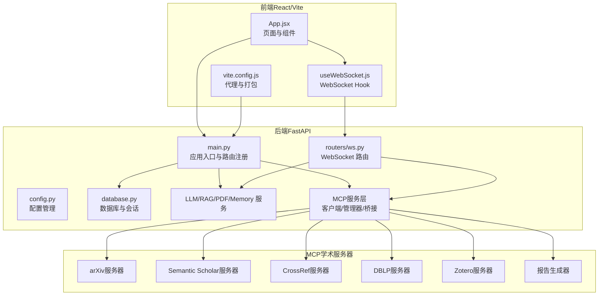

**图表来源**
- [backend/app/mcp_services/__init__.py:1-42](file://backend/app/mcp_services/__init__.py#L1-L42)
- [backend/app/mcp_services/academic_config.py:13-62](file://backend/app/mcp_services/academic_config.py#L13-L62)
- [frontend/src/App.jsx:1-800](file://frontend/src/App.jsx#L1-L800)
- [frontend/src/hooks/useWebSocket.js:1-178](file://frontend/src/hooks/useWebSocket.js#L1-L178)
- [frontend/vite.config.js:1-54](file://frontend/vite.config.js#L1-L54)

**章节来源**
- [backend/app/main.py:1-114](file://backend/app/main.py#L1-L114)
- [frontend/vite.config.js:1-54](file://frontend/vite.config.js#L1-L54)

## 核心组件
- 应用入口与生命周期：FastAPI 应用创建、CORS 配置、路由注册、数据库初始化与关闭
- 配置管理：集中管理应用名称、调试模式、数据库连接、JWT、CORS、上传目录与大小限制
- 数据库与会话：异步 SQLAlchemy 引擎与会话工厂，提供依赖注入与事务管理
- WebSocket 路由：统一消息协议与任务调度，支持分析、问答、RAG、跨文档、Agent 等多种模式
- 服务层：
  - LLM 服务：基于 LangChain 的 DeepSeek 大模型交互，支持流式输出与多场景提示词
  - RAG 服务：ChromaDB 向量检索 + BM25 关键词检索 + RRF 融合排序
  - PDF 服务：PDF 元数据与文本块提取、全文提取、页数统计与校验
  - 记忆服务：用户长期记忆提取、存储、召回与衰减
- **MCP服务层**：统一的MCP协议客户端、服务管理器和工具桥接，支持多种传输协议
- 前端组件与 Hook：统一 WebSocket 管理、消息订阅、状态监听与重连机制

**章节来源**
- [backend/app/config.py:1-44](file://backend/app/config.py#L1-L44)
- [backend/app/database.py:1-81](file://backend/app/database.py#L1-L81)
- [backend/app/routers/ws.py:1-397](file://backend/app/routers/ws.py#L1-L397)
- [backend/app/services/llm_service.py:1-800](file://backend/app/services/llm_service.py#L1-L800)
- [backend/app/services/rag_service.py:1-400](file://backend/app/services/rag_service.py#L1-L400)
- [backend/app/services/pdf_service.py:1-194](file://backend/app/services/pdf_service.py#L1-L194)
- [backend/app/services/memory_service.py:1-438](file://backend/app/services/memory_service.py#L1-L438)
- [backend/app/mcp_services/__init__.py:1-42](file://backend/app/mcp_services/__init__.py#L1-L42)
- [frontend/src/hooks/useWebSocket.js:1-178](file://frontend/src/hooks/useWebSocket.js#L1-L178)

## 架构总览
PaperChat 采用"前后端分离 + 微服务化 + MCP驱动"的架构模式：
- 表现层：React 前端负责 PDF 阅读、高亮、笔记、分析面板与实时交互
- 业务逻辑层：FastAPI 路由与处理器承接请求，调用 LLM/RAG/PDF/记忆等服务
- 数据访问层：SQLAlchemy 异步 ORM 访问数据库，ChromaDB 持久化向量索引
- **MCP服务层**：统一的MCP协议客户端和服务管理器，提供学术数据源集成和工具桥接
- 实时通信：WebSocket 提供统一协议，支持流式消息与任务取消
- 微服务化：LLM、RAG、PDF、记忆等能力以服务形式封装，便于替换与扩展

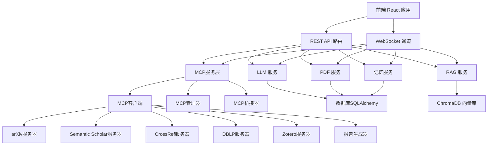

**图表来源**
- [backend/app/routers/ws.py:1-397](file://backend/app/routers/ws.py#L1-L397)
- [backend/app/services/llm_service.py:1-800](file://backend/app/services/llm_service.py#L1-L800)
- [backend/app/services/rag_service.py:1-400](file://backend/app/services/rag_service.py#L1-L400)
- [backend/app/services/pdf_service.py:1-194](file://backend/app/services/pdf_service.py#L1-L194)
- [backend/app/services/memory_service.py:1-438](file://backend/app/services/memory_service.py#L1-L438)
- [backend/app/mcp_services/manager.py:17-233](file://backend/app/mcp_services/manager.py#L17-L233)

## 详细组件分析

### 应用入口与生命周期（FastAPI）
- 应用创建与配置：设置标题、版本、描述、CORS、全局异常处理与路由注册
- 生命周期管理：启动时初始化数据库、加载默认用户配置；关闭时释放数据库连接
- 健康检查端点：提供应用状态信息

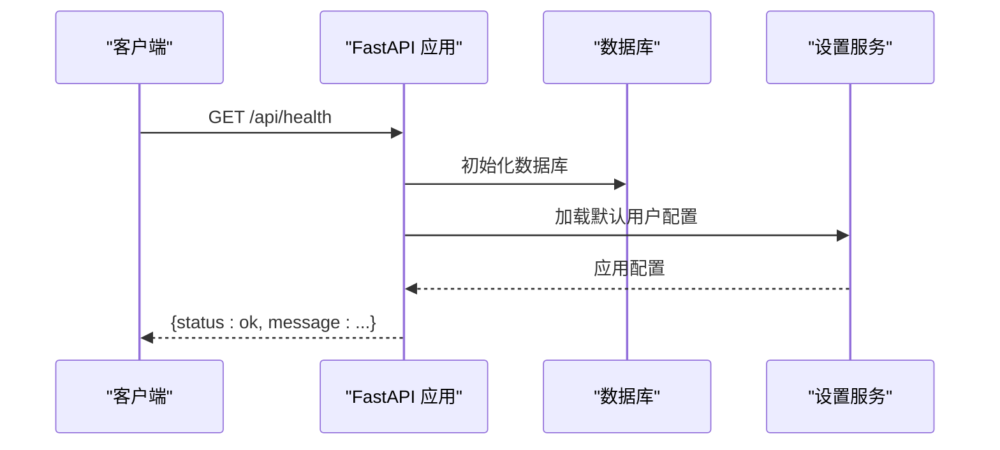

**图表来源**
- [backend/app/main.py:16-114](file://backend/app/main.py#L16-L114)

**章节来源**
- [backend/app/main.py:1-114](file://backend/app/main.py#L1-L114)

### 配置管理（Settings）
- 集中管理应用名称、调试模式、数据库 URL、JWT 密钥与算法、CORS 允许源、上传目录与大小限制
- HuggingFace 镜像与缓存目录设置，便于国内环境加速模型下载

**章节来源**
- [backend/app/config.py:1-44](file://backend/app/config.py#L1-L44)

### 数据库与会话（SQLAlchemy 异步）
- 异步引擎与会话工厂：提供依赖注入、自动提交/回滚与连接关闭
- 表结构：Paper、PaperTextBlock 等模型定义，支持级联删除与外键约束
- 初始化与关闭：启动时创建表，关闭时释放连接

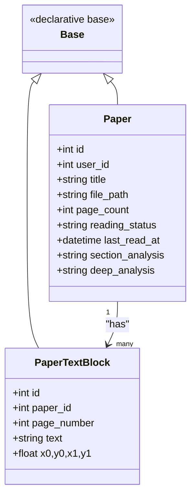

**图表来源**
- [backend/app/models/paper.py:11-85](file://backend/app/models/paper.py#L11-L85)

**章节来源**
- [backend/app/database.py:1-81](file://backend/app/database.py#L1-L81)
- [backend/app/models/paper.py:1-85](file://backend/app/models/paper.py#L1-L85)

### WebSocket 实时通信
- 统一消息协议：支持 analyze、chat、rag_chat、deep_analyze、agent_chat、cross_doc_chat、unified_chat、cancel 等
- 连接状态与任务管理：ConnectionState 共享状态，running_tasks 管理并发任务与取消
- 处理器解耦：analyze_handler 等处理器专注于具体业务逻辑，WebSocket 路由负责路由与调度

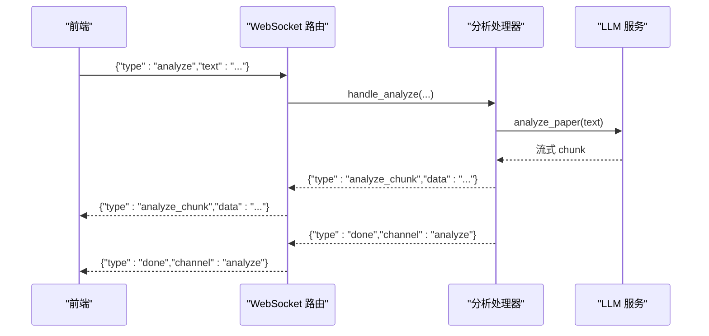

**图表来源**
- [backend/app/routers/ws.py:47-397](file://backend/app/routers/ws.py#L47-L397)
- [backend/app/handlers/analyze_handler.py:13-87](file://backend/app/handlers/analyze_handler.py#L13-L87)
- [backend/app/services/llm_service.py:460-472](file://backend/app/services/llm_service.py#L460-L472)

**章节来源**
- [backend/app/routers/ws.py:1-397](file://backend/app/routers/ws.py#L1-L397)
- [backend/app/handlers/analyze_handler.py:1-87](file://backend/app/handlers/analyze_handler.py#L1-L87)

### LLM 服务（LangChain + DeepSeek）
- 流式输出：支持 analyze_paper、chat、chat_with_rag、deep_analyze 等多场景
- 提示词工程：针对论文分析、问答、术语解释、摘要、翻译、深度分析等设计专用提示词
- 配置更新：运行时可更新模型、温度、最大 token、API Key 与 Base URL

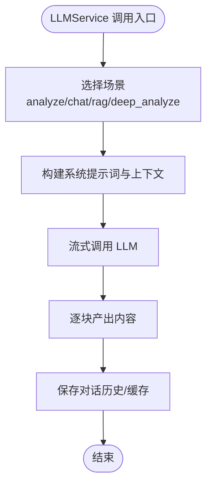

**图表来源**
- [backend/app/services/llm_service.py:360-800](file://backend/app/services/llm_service.py#L360-L800)

**章节来源**
- [backend/app/services/llm_service.py:1-800](file://backend/app/services/llm_service.py#L1-L800)

### RAG 服务（向量检索 + BM25 + RRF）
- 智能分块：按文本块自然边界分块，保留页码信息，支持重叠
- 向量索引：ChromaDB 持久化，SentenceTransformer 编码
- 混合检索：语义检索 + BM25 关键词检索，RRF 融合排序
- 跨文档检索：并行检索多个论文集合，合并排序

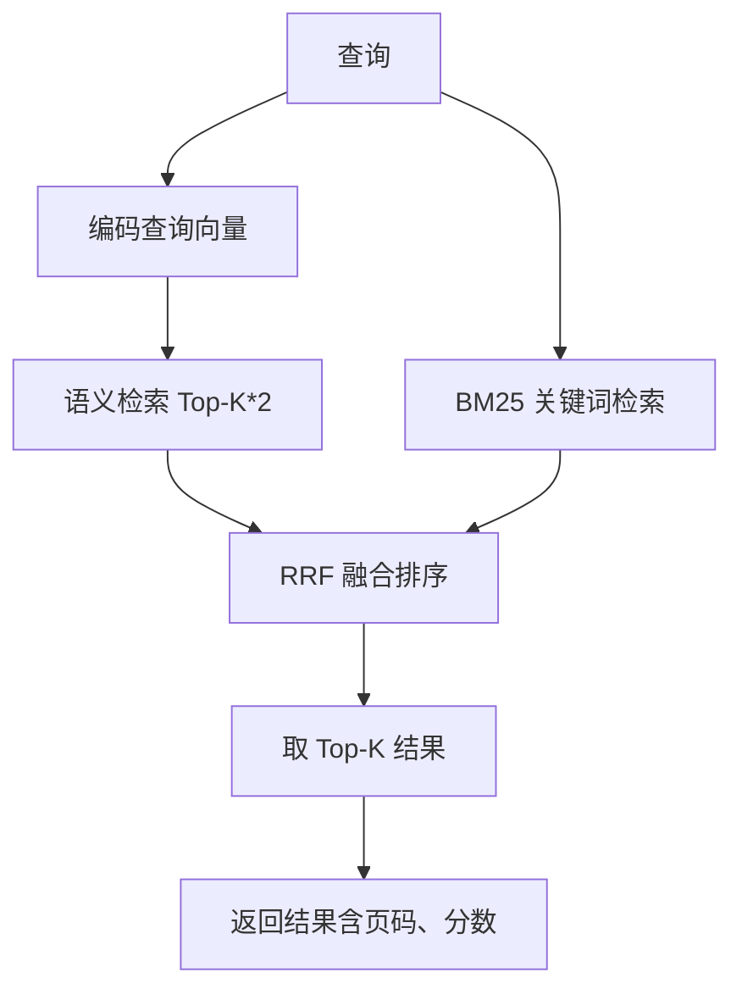

**图表来源**
- [backend/app/services/rag_service.py:233-335](file://backend/app/services/rag_service.py#L233-L335)

**章节来源**
- [backend/app/services/rag_service.py:1-400](file://backend/app/services/rag_service.py#L1-L400)

### PDF 服务（文本提取与元数据）
- 元数据提取：标题、作者、页数（优先从 PDF 元数据，其次从第一页文本）
- 文本块提取：字符级别坐标信息，按行合并，保留边界框
- 全文提取：按页拼接文本，用于 LLM 分析
- 校验与页数：验证 PDF 有效性与页数统计

**章节来源**
- [backend/app/services/pdf_service.py:1-194](file://backend/app/services/pdf_service.py#L1-L194)

### 记忆服务（用户长期记忆）
- 记忆提取：从对话中抽取研究方向、偏好、术语用法、背景等
- 存储与去重：向量化相似度判断，避免重复存储
- 召回与衰减：按相似度与重要性加权召回，指数时间衰减
- 用户画像：聚合记忆构建用户画像

**章节来源**
- [backend/app/services/memory_service.py:1-438](file://backend/app/services/memory_service.py#L1-L438)

### 前端 WebSocket Hook（useWebSocket）
- 全局连接管理：单例 WebSocket，自动重连（最多 5 次，间隔 3 秒）
- 消息订阅：支持按类型订阅与通配符订阅，支持取消订阅
- 发送封装：提供通用 sendMessage 与 RAG/CrossDoc/Unified 场景封装
- 状态通知：使用 useSyncExternalStore 同步连接状态

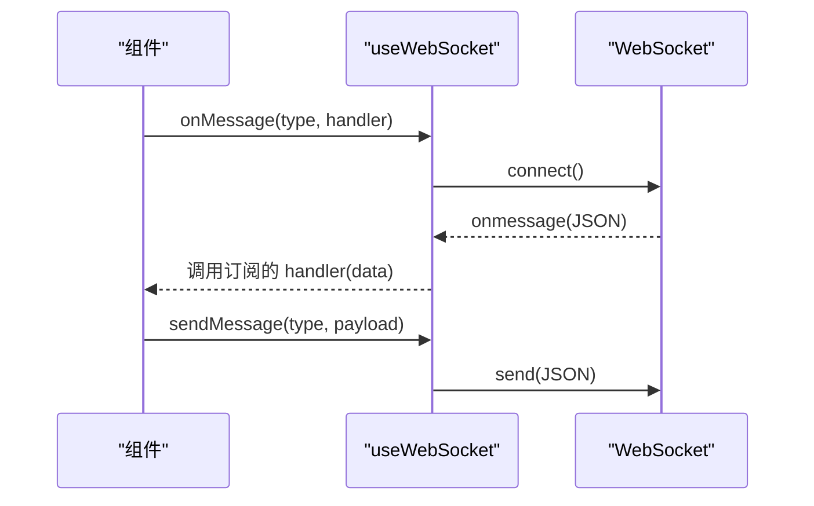

**图表来源**
- [frontend/src/hooks/useWebSocket.js:1-178](file://frontend/src/hooks/useWebSocket.js#L1-L178)

**章节来源**
- [frontend/src/hooks/useWebSocket.js:1-178](file://frontend/src/hooks/useWebSocket.js#L1-L178)

### 前端应用与页面（React）
- ReaderPage：论文阅读、高亮、笔记、分析面板与推荐
- WebSocket 消息处理：统一处理分析、深度分析、Agent 等消息类型
- 并行加载：论文基础信息、文本、分析缓存、高亮、笔记、推荐等并行请求
- 布局与交互：三栏布局、拖拽调整、笔记编辑器、关键词提取

**章节来源**
- [frontend/src/App.jsx:1-800](file://frontend/src/App.jsx#L1-L800)

## MCP驱动架构

### MCP服务层概述
PaperChat引入了完整的MCP（Model Context Protocol）驱动架构，实现统一处理器系统和模块化Agent架构：

- **统一处理器系统**：通过MCP协议统一管理各种外部服务和工具
- **模块化Agent架构**：支持动态加载和管理不同的MCP服务器
- **多传输协议支持**：同时支持stdio、SSE和HTTP传输方式
- **智能重连机制**：自动检测连接状态并进行重连

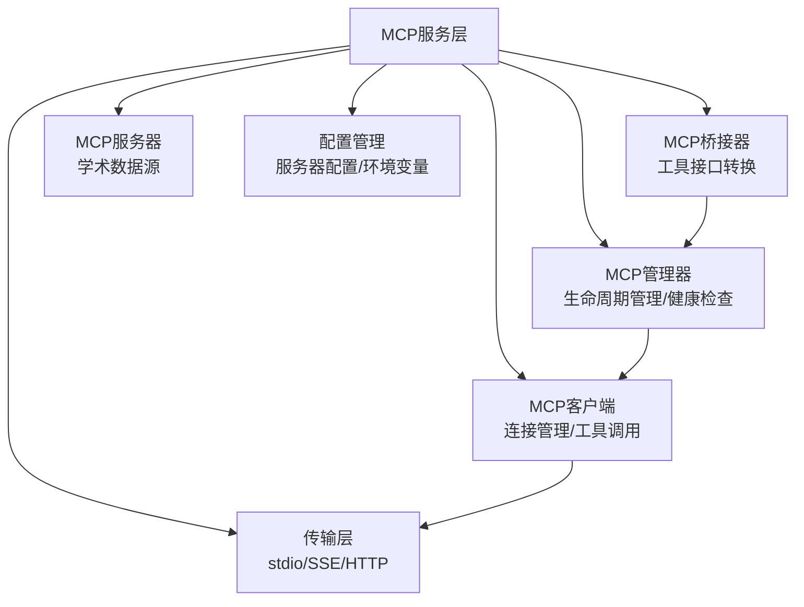

**图表来源**
- [backend/app/mcp_services/__init__.py:13-41](file://backend/app/mcp_services/__init__.py#L13-L41)
- [backend/app/mcp_services/client.py:57-471](file://backend/app/mcp_services/client.py#L57-L471)
- [backend/app/mcp_services/manager.py:17-233](file://backend/app/mcp_services/manager.py#L17-L233)
- [backend/app/mcp_services/bridge.py:21-82](file://backend/app/mcp_services/bridge.py#L21-L82)

### MCP客户端架构
MCP客户端提供完整的MCP协议支持，包括连接管理、工具调用和健康检查：

- **连接管理**：支持多种传输协议，自动重连机制
- **工具调用**：统一的工具调用接口，支持超时控制和重试
- **健康检查**：定期检查服务器状态，自动恢复断线连接
- **缓存机制**：工具列表缓存，减少重复查询

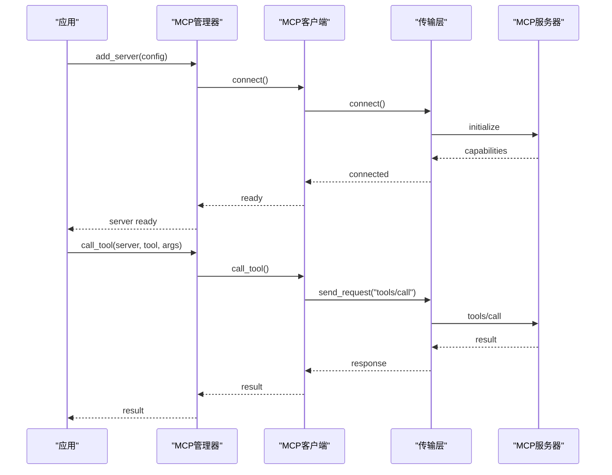

**图表来源**
- [backend/app/mcp_services/manager.py:80-153](file://backend/app/mcp_services/manager.py#L80-L153)
- [backend/app/mcp_services/client.py:134-427](file://backend/app/mcp_services/client.py#L134-L427)

### MCP管理器功能
MCP管理器负责所有MCP服务器的生命周期管理和协调：

- **并发启动**：支持同时启动多个MCP服务器
- **动态管理**：支持运行时添加和移除服务器
- **健康检查**：定期检查服务器状态并自动重连
- **工具聚合**：统一收集所有服务器的工具列表

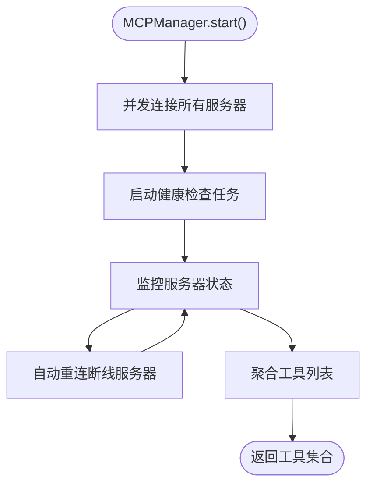

**图表来源**
- [backend/app/mcp_services/manager.py:36-218](file://backend/app/mcp_services/manager.py#L36-L218)

### MCP桥接器机制
MCP桥接器将MCP工具动态转换为内部工具接口：

- **动态类生成**：运行时创建MCP工具的动态子类
- **接口适配**：将MCP工具调用适配为内部Tool接口
- **批量桥接**：支持一次性桥接所有可用工具
- **错误处理**：优雅处理桥接过程中的异常

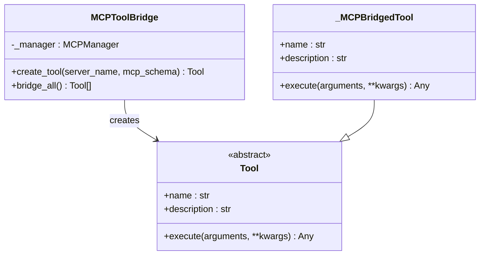

**图表来源**
- [backend/app/mcp_services/bridge.py:21-82](file://backend/app/mcp_services/bridge.py#L21-L82)

### 传输层实现
MCP支持三种传输协议，满足不同场景需求：

- **Stdio传输**：本地进程间通信，适合Python脚本服务器
- **SSE传输**：HTTP服务器发送事件，支持双向通信
- **HTTP传输**：直接HTTP POST，简单可靠

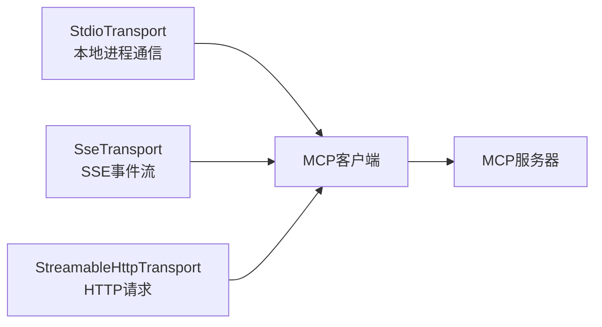

**图表来源**
- [backend/app/mcp_services/transport.py:50-417](file://backend/app/mcp_services/transport.py#L50-L417)

### 学术数据源MCP服务器
系统集成了5个学术数据源的MCP服务器，提供丰富的学术资源：

- **arXiv服务器**：论文搜索、元数据获取、PDF链接
- **Semantic Scholar服务器**：论文搜索、引用分析、作者信息
- **CrossRef服务器**：DOI解析、作品搜索、资助机构信息
- **DBLP服务器**：出版物查询、作者信息
- **Zotero服务器**：文献库管理
- **报告生成器**：学术报告生成

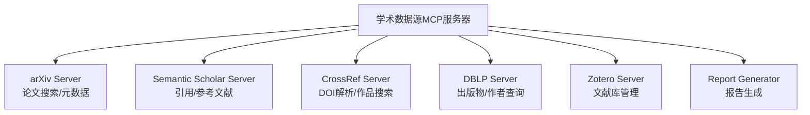

**图表来源**
- [backend/app/mcp_services/academic_config.py:13-62](file://backend/app/mcp_services/academic_config.py#L13-L62)
- [backend/app/mcp_services/servers/arxiv_server.py:28-63](file://backend/app/mcp_services/servers/arxiv_server.py#L28-L63)
- [backend/app/mcp_services/servers/semantic_scholar_server.py:53-102](file://backend/app/mcp_services/servers/semantic_scholar_server.py#L53-L102)
- [backend/app/mcp_services/servers/crossref_server.py:53-88](file://backend/app/mcp_services/servers/crossref_server.py#L53-L88)

**章节来源**
- [backend/app/mcp_services/__init__.py:1-42](file://backend/app/mcp_services/__init__.py#L1-L42)
- [backend/app/mcp_services/client.py:1-471](file://backend/app/mcp_services/client.py#L1-L471)
- [backend/app/mcp_services/manager.py:1-233](file://backend/app/mcp_services/manager.py#L1-L233)
- [backend/app/mcp_services/bridge.py:1-82](file://backend/app/mcp_services/bridge.py#L1-L82)
- [backend/app/mcp_services/transport.py:1-417](file://backend/app/mcp_services/transport.py#L1-L417)
- [backend/app/mcp_services/config.py:1-34](file://backend/app/mcp_services/config.py#L1-L34)
- [backend/app/mcp_services/academic_config.py:1-62](file://backend/app/mcp_services/academic_config.py#L1-L62)

## 依赖关系分析
- 后端依赖：FastAPI、Uvicorn、LangChain、SQLAlchemy、aiosqlite、pdfplumber、chromadb、sentence-transformers、rank-bm25、Alembic 等
- **MCP依赖**：aiohttp（SSE传输）、asyncio子进程（stdio传输）
- 前端依赖：React、React Router、Zustand、React PDF、PDF.js、Axios、Framer Motion 等
- 代理与打包：Vite 代理 /api 与 /ws，手动分包 vendor-react、vendor-pdf、vendor-zustand、vendor-markdown 等

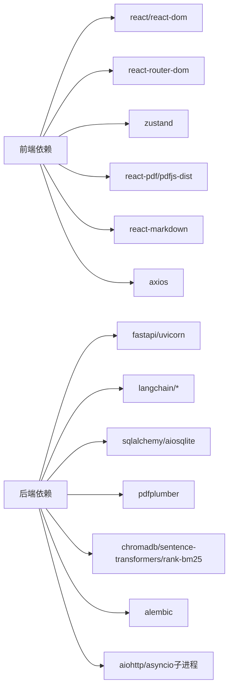

**图表来源**
- [backend/requirements.txt:1-19](file://backend/requirements.txt#L1-L19)
- [frontend/package.json:12-34](file://frontend/package.json#L12-L34)

**章节来源**
- [backend/requirements.txt:1-19](file://backend/requirements.txt#L1-L19)
- [frontend/package.json:1-36](file://frontend/package.json#L1-L36)

## 性能考量
- 异步编程：FastAPI 与 SQLAlchemy 异步，减少阻塞；LLM/RAG 使用线程池执行同步操作，避免阻塞事件循环
- 流式输出：LLM 与分析过程采用流式返回，前端即时渲染，提升交互体验
- 懒加载与缓存：RAG 服务延迟加载嵌入模型与 BM25 缓存，首次使用时加载，后续复用
- 并行请求：前端 ReaderPage 对论文数据、分析缓存、高亮、笔记、推荐等进行并行加载
- **MCP性能优化**：MCP客户端实现工具列表缓存，减少重复查询；传输层支持并发请求
- 分包与代理：Vite 手动分包 vendor-*，减少首屏体积；代理 /api 与 /ws，避免跨域与反向代理复杂度
- WebSocket 重连：前端实现指数退避重连，提升网络波动下的稳定性

## 故障排查指南
- WebSocket 连接失败：检查后端 /ws 端点是否可用，确认前端 WS_URL 与后端主机一致；查看重连日志与状态
- LLM 调用异常：检查 DEEPSEEK_API_KEY 与 API Base URL 配置；确认提示词格式与上下文长度限制
- RAG 检索无结果：确认论文是否已索引（index_paper）、集合是否存在、BM25 缓存是否命中
- PDF 解析失败：检查文件是否为有效 PDF、页数是否大于 0；查看 pdfplumber 报错信息
- 记忆服务异常：检查向量模型加载、相似度计算与数据库写入；确认 JSON 嵌入序列化
- 前端页面空白：检查 /api 代理是否正确指向后端 8000 端口；确认静态资源构建与缓存
- **MCP连接问题**：检查MCP服务器配置、传输协议设置、网络连接状态；查看MCP管理器日志
- **MCP工具调用失败**：确认工具名称正确、参数格式符合schema、服务器是否在线；检查MCP桥接器状态

**章节来源**
- [frontend/src/hooks/useWebSocket.js:19-70](file://frontend/src/hooks/useWebSocket.js#L19-L70)
- [backend/app/services/llm_service.py:401-458](file://backend/app/services/llm_service.py#L401-L458)
- [backend/app/services/rag_service.py:183-232](file://backend/app/services/rag_service.py#L183-L232)
- [backend/app/services/pdf_service.py:163-189](file://backend/app/services/pdf_service.py#L163-L189)
- [backend/app/services/memory_service.py:100-154](file://backend/app/services/memory_service.py#L100-L154)
- [frontend/vite.config.js:8-17](file://frontend/vite.config.js#L8-L17)

## 结论
PaperChat 通过前后端分离与微服务化设计，实现了高性能、可扩展的学术论文智能阅读与问答系统。后端以 FastAPI 为核心，结合 LangChain、ChromaDB、pdfplumber 等技术栈，提供强大的 LLM、RAG、PDF 处理与记忆能力；前端以 React 为基础，配合 WebSocket 实现实时交互与流式渲染。

**更新** 新的MCP驱动架构进一步增强了系统的模块化和可扩展性，通过统一的MCP协议实现了学术数据源的标准化集成，支持动态加载和管理各种外部服务。MCP服务层提供了完整的生命周期管理、健康检查和工具桥接机制，为未来的功能扩展奠定了坚实基础。

整体架构清晰、职责分明，具备良好的可维护性与扩展性，能够适应不断增长的学术研究需求。

## 附录
- 系统边界图：前端与后端通过 REST API 与 WebSocket 通信，后端内部通过服务层解耦，数据层与向量库独立
- 组件交互图：WebSocket 路由作为统一入口，将消息分发至分析/问答/跨文档等处理器，处理器调用 LLM/RAG/PDF/记忆服务，最终返回流式结果
- **MCP集成图**：MCP服务层作为统一抽象，向上提供标准化接口，向下集成各种学术数据源服务器