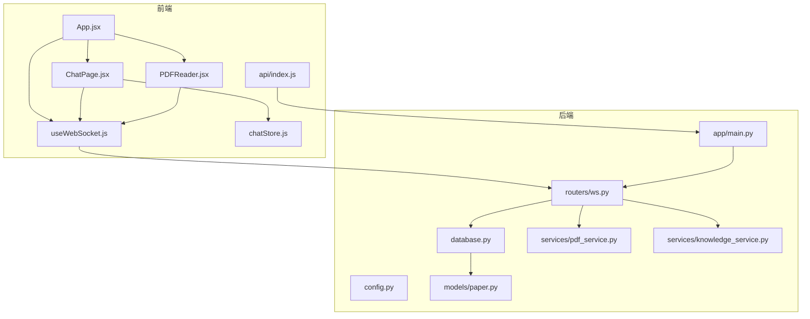
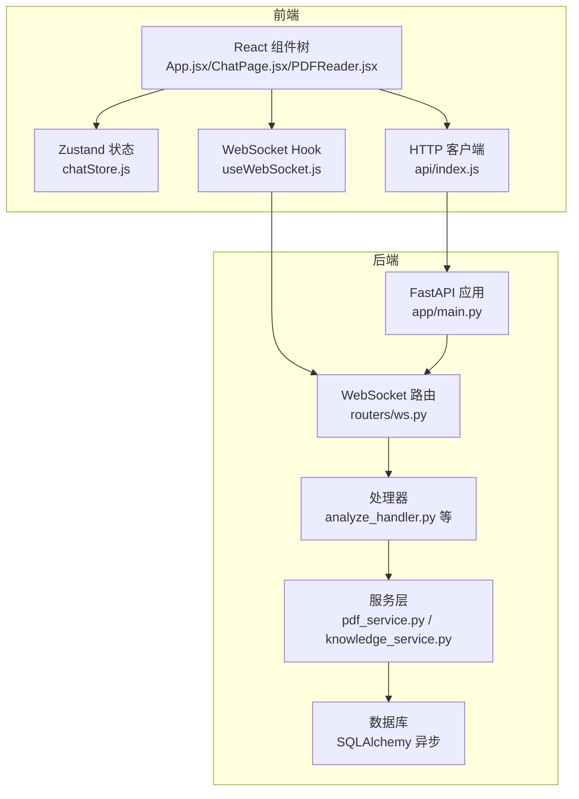
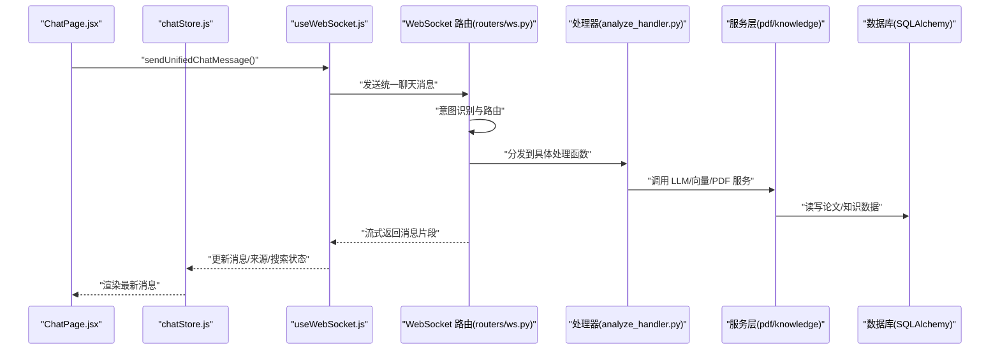
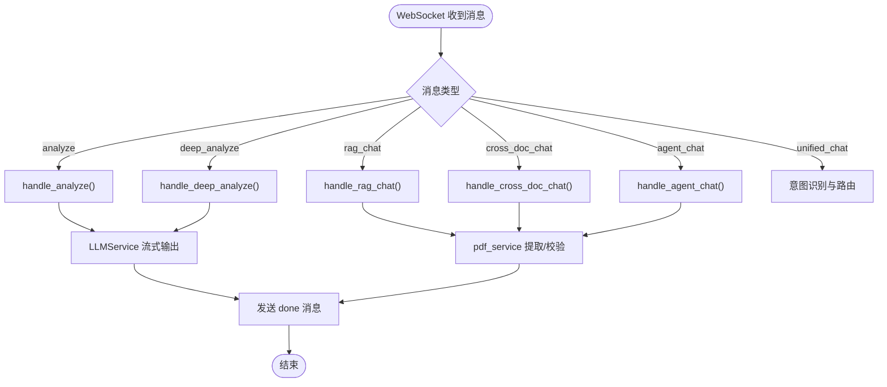
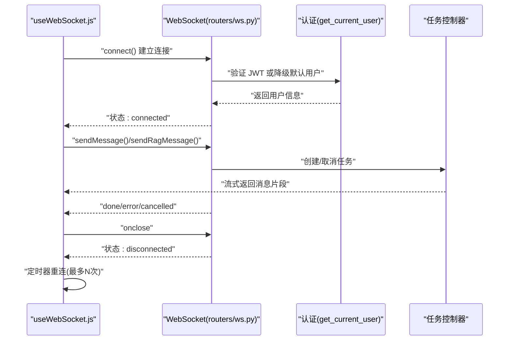
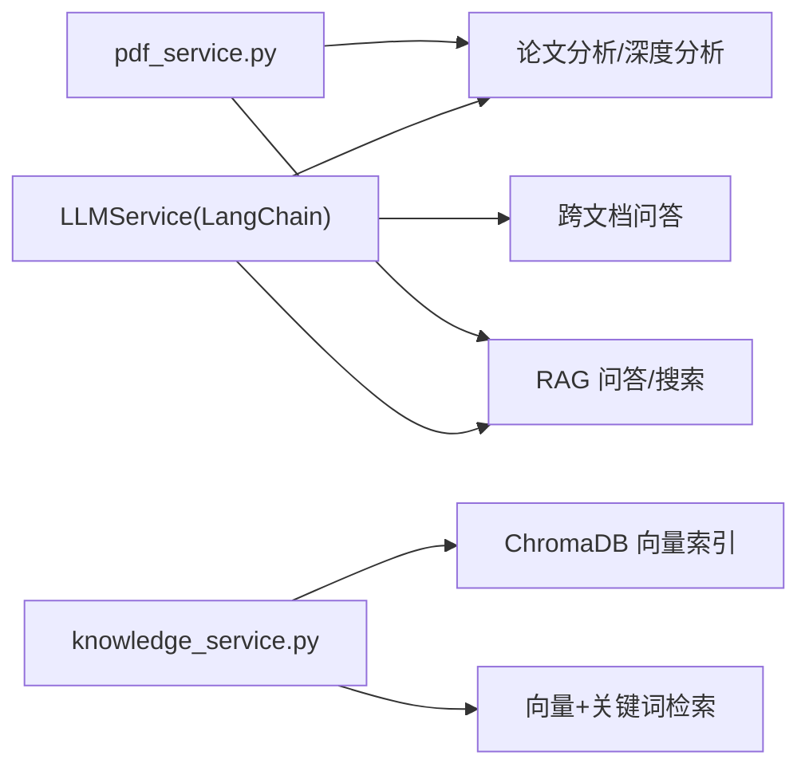
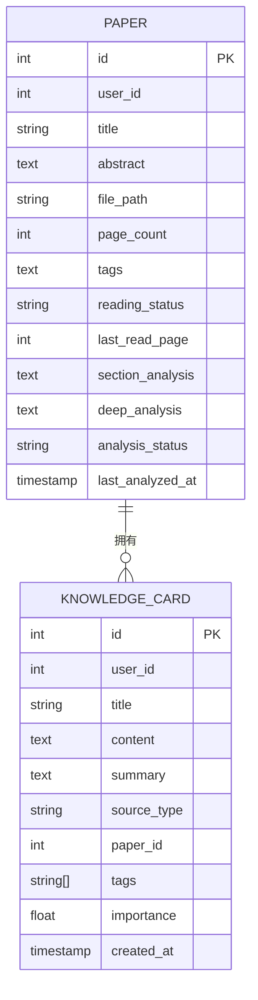
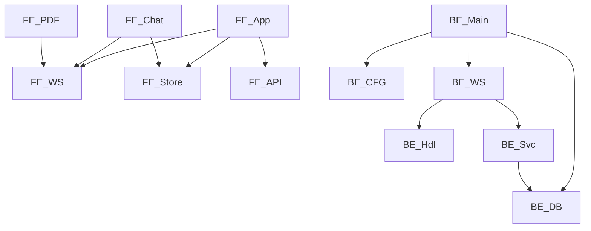

# 组件交互与集成

<cite>
**本文引用的文件**
- [backend/app/main.py](file://backend/app/main.py)
- [backend/app/config.py](file://backend/app/config.py)
- [backend/app/database.py](file://backend/app/database.py)
- [backend/app/routers/ws.py](file://backend/app/routers/ws.py)
- [backend/app/handlers/analyze_handler.py](file://backend/app/handlers/analyze_handler.py)
- [backend/app/services/pdf_service.py](file://backend/app/services/pdf_service.py)
- [backend/app/services/knowledge_service.py](file://backend/app/services/knowledge_service.py)
- [backend/app/models/paper.py](file://backend/app/models/paper.py)
- [frontend/src/App.jsx](file://frontend/src/App.jsx)
- [frontend/src/pages/ChatPage.jsx](file://frontend/src/pages/ChatPage.jsx)
- [frontend/src/components/PDFReader/PDFReader.jsx](file://frontend/src/components/PDFReader/PDFReader.jsx)
- [frontend/src/hooks/useWebSocket.js](file://frontend/src/hooks/useWebSocket.js)
- [frontend/src/stores/chatStore.js](file://frontend/src/stores/chatStore.js)
- [frontend/src/api/index.js](file://frontend/src/api/index.js)
</cite>

## 目录
1. [简介](#简介)
2. [项目结构](#项目结构)
3. [核心组件](#核心组件)
4. [架构总览](#架构总览)
5. [详细组件分析](#详细组件分析)
6. [依赖关系分析](#依赖关系分析)
7. [性能考量](#性能考量)
8. [故障排查指南](#故障排查指南)
9. [结论](#结论)
10. [附录](#附录)

## 简介
本文件面向 PaperChat 系统，系统分为前后端两部分：前端采用 React + Zustand 状态管理与 WebSocket 通信；后端采用 FastAPI + SQLAlchemy 异步数据库访问，结合 LangChain 与向量检索实现论文分析、RAG、跨文档问答与知识图谱能力。本文重点阐述：
- 前端组件交互：页面组件、UI 组件、状态管理之间的协作方式
- 后端服务集成：路由层、业务服务层、数据访问层的职责划分与调用关系
- WebSocket 连接管理：连接建立、消息路由、断线重连机制
- 第三方服务集成：AI 服务调用、PDF 处理服务、向量数据库操作
- 组件关系图与集成架构图，给出具体集成示例与最佳实践

## 项目结构
- 后端
  - 应用入口与生命周期：app/main.py
  - 配置中心：app/config.py
  - 数据库与模型：app/database.py、app/models/paper.py
  - WebSocket 路由：app/routers/ws.py
  - 处理器与服务：handlers/*、services/*
  - PDF 处理与知识服务：services/pdf_service.py、services/knowledge_service.py
- 前端
  - 应用根与页面：App.jsx、pages/*
  - 组件与工具：components/*、hooks/*、stores/*
  - API 客户端：api/index.js

**图表来源**
- [backend/app/main.py:55-99](file://backend/app/main.py#L55-L99)
- [backend/app/routers/ws.py:76-102](file://backend/app/routers/ws.py#L76-L102)
- [frontend/src/App.jsx:1-120](file://frontend/src/App.jsx#L1-L120)
- [frontend/src/pages/ChatPage.jsx:23-120](file://frontend/src/pages/ChatPage.jsx#L23-L120)
- [frontend/src/components/PDFReader/PDFReader.jsx:13-50](file://frontend/src/components/PDFReader/PDFReader.jsx#L13-L50)
- [frontend/src/hooks/useWebSocket.js:1-60](file://frontend/src/hooks/useWebSocket.js#L1-L60)
- [frontend/src/api/index.js:1-12](file://frontend/src/api/index.js#L1-L12)

**章节来源**
- [backend/app/main.py:55-99](file://backend/app/main.py#L55-L99)
- [frontend/src/App.jsx:1-120](file://frontend/src/App.jsx#L1-L120)

## 核心组件
- 前端应用与页面
  - App.jsx：应用根组件，组织 ReaderPage 与懒加载页面，集中管理 WebSocket 状态与消息订阅，协调笔记、高亮、分析等状态
  - ChatPage.jsx：聊天页面，整合会话管理、消息流式渲染、PaperSelector、输入条与会话侧边栏
  - PDFReader.jsx：PDF 阅读器，支持单页/滚动模式、缩放、文本选择、高亮与阅读辅助面板
- 前端状态与通信
  - useWebSocket.js：全局 WebSocket 连接、消息分发、断线重连、统一消息发送接口
  - chatStore.js：Zustand 状态管理，会话、消息、跨文档问答、联网搜索、引用来源等
  - api/index.js：Axios 客户端，统一基础路径与请求头
- 后端应用与路由
  - app/main.py：FastAPI 应用创建、CORS、中间件、路由注册、健康检查
  - routers/ws.py：WebSocket 端点，消息类型路由、任务并发控制、统一聊天入口
- 后端服务与数据
  - database.py：异步数据库引擎与会话工厂、初始化与关闭
  - services/pdf_service.py：PDF 元数据、文本块、全文提取与校验
  - services/knowledge_service.py：知识卡片提取、标签生成、向量索引、检索与图谱
  - models/paper.py：论文与文本块模型，分析缓存字段

**章节来源**
- [frontend/src/App.jsx:60-190](file://frontend/src/App.jsx#L60-L190)
- [frontend/src/pages/ChatPage.jsx:23-120](file://frontend/src/pages/ChatPage.jsx#L23-L120)
- [frontend/src/components/PDFReader/PDFReader.jsx:13-50](file://frontend/src/components/PDFReader/PDFReader.jsx#L13-L50)
- [frontend/src/hooks/useWebSocket.js:1-120](file://frontend/src/hooks/useWebSocket.js#L1-L120)
- [frontend/src/stores/chatStore.js:1-120](file://frontend/src/stores/chatStore.js#L1-L120)
- [frontend/src/api/index.js:1-12](file://frontend/src/api/index.js#L1-L12)
- [backend/app/main.py:55-99](file://backend/app/main.py#L55-L99)
- [backend/app/routers/ws.py:76-102](file://backend/app/routers/ws.py#L76-L102)
- [backend/app/database.py:13-81](file://backend/app/database.py#L13-L81)
- [backend/app/services/pdf_service.py:11-60](file://backend/app/services/pdf_service.py#L11-L60)
- [backend/app/services/knowledge_service.py:79-120](file://backend/app/services/knowledge_service.py#L79-L120)
- [backend/app/models/paper.py:11-40](file://backend/app/models/paper.py#L11-L40)

## 架构总览
PaperChat 采用“前端 React + 后端 FastAPI”的双栈架构，通过 WebSocket 实现实时双向通信，后端以“路由层-处理器层-服务层-数据访问层”分层设计，配合 LangChain 与向量数据库实现论文分析与 RAG。

**图表来源**
- [backend/app/main.py:55-99](file://backend/app/main.py#L55-L99)
- [backend/app/routers/ws.py:76-102](file://backend/app/routers/ws.py#L76-L102)
- [frontend/src/hooks/useWebSocket.js:84-179](file://frontend/src/hooks/useWebSocket.js#L84-L179)
- [frontend/src/stores/chatStore.js:395-414](file://frontend/src/stores/chatStore.js#L395-L414)

## 详细组件分析

### 前端组件交互与状态管理
- 页面与组件协作
  - ReaderPage：聚合论文加载、分析、笔记、推荐等状态，统一处理 WebSocket 消息（章节概述、深度分析、关键词、Agent 流程）
  - ChatPage：会话管理、消息虚拟滚动、PaperSelector、输入条、意图提示与搜索开关
  - PDFReader：文本选择、高亮创建、阅读辅助（术语解释/摘要/翻译）、单页/滚动模式切换
- 状态管理
  - chatStore：会话列表、消息流式更新、跨文档问答、联网搜索状态、引用来源
  - useWebSocket：全局连接、断线重连、消息订阅与分发、统一发送接口（RAG、跨文档、统一聊天）
- 数据流
  - ReaderPage 通过 useWebSocket 发送分析/深度分析请求，接收流式 JSON 行并解析为 UI 结构
  - ChatPage 通过 useWebSocket 发送统一聊天消息，处理器根据关键词路由到不同功能

**图表来源**
- [frontend/src/pages/ChatPage.jsx:180-208](file://frontend/src/pages/ChatPage.jsx#L180-L208)
- [frontend/src/stores/chatStore.js:395-414](file://frontend/src/stores/chatStore.js#L395-L414)
- [frontend/src/hooks/useWebSocket.js:109-154](file://frontend/src/hooks/useWebSocket.js#L109-L154)
- [backend/app/routers/ws.py:262-417](file://backend/app/routers/ws.py#L262-L417)
- [backend/app/handlers/analyze_handler.py:13-50](file://backend/app/handlers/analyze_handler.py#L13-L50)

**章节来源**
- [frontend/src/App.jsx:132-307](file://frontend/src/App.jsx#L132-L307)
- [frontend/src/pages/ChatPage.jsx:180-208](file://frontend/src/pages/ChatPage.jsx#L180-L208)
- [frontend/src/stores/chatStore.js:395-414](file://frontend/src/stores/chatStore.js#L395-L414)
- [frontend/src/hooks/useWebSocket.js:109-154](file://frontend/src/hooks/useWebSocket.js#L109-L154)

### 后端服务集成与调用链
- 路由层
  - WebSocket 端点：统一消息类型路由，任务并发控制与取消，统一聊天入口（意图识别与自动路由）
- 处理器层
  - analyze_handler：论文分析/深度分析处理器，流式返回 JSON 行，完成后发送 done
- 服务层
  - pdf_service：PDF 元数据、文本块、全文提取、页数与有效性校验
  - knowledge_service：知识卡片提取、标签生成、向量索引、检索与图谱
- 数据访问层
  - database：异步引擎与会话工厂，应用启动时创建表与默认用户

**图表来源**
- [backend/app/routers/ws.py:120-261](file://backend/app/routers/ws.py#L120-L261)
- [backend/app/handlers/analyze_handler.py:13-87](file://backend/app/handlers/analyze_handler.py#L13-L87)
- [backend/app/services/pdf_service.py:11-60](file://backend/app/services/pdf_service.py#L11-L60)

**章节来源**
- [backend/app/routers/ws.py:76-102](file://backend/app/routers/ws.py#L76-L102)
- [backend/app/handlers/analyze_handler.py:13-87](file://backend/app/handlers/analyze_handler.py#L13-L87)
- [backend/app/services/pdf_service.py:11-60](file://backend/app/services/pdf_service.py#L11-L60)
- [backend/app/database.py:50-81](file://backend/app/database.py#L50-L81)

### WebSocket 连接管理
- 连接建立
  - useWebSocket 在首次订阅时发起连接，自动携带本地存储的 token
  - 服务端验证 JWT，无 token 时降级为默认用户
- 消息路由
  - 前端通过统一发送接口（RAG、跨文档、统一聊天）发送消息
  - 服务端根据消息类型路由到相应处理器，支持任务并发与取消
- 断线重连
  - 最大重试次数与指数退避延迟，连接断开后自动重连
  - 状态变更通过全局监听通知所有订阅者

**图表来源**
- [frontend/src/hooks/useWebSocket.js:19-71](file://frontend/src/hooks/useWebSocket.js#L19-L71)
- [backend/app/routers/ws.py:32-54](file://backend/app/routers/ws.py#L32-L54)
- [backend/app/routers/ws.py:120-261](file://backend/app/routers/ws.py#L120-L261)

**章节来源**
- [frontend/src/hooks/useWebSocket.js:1-180](file://frontend/src/hooks/useWebSocket.js#L1-L180)
- [backend/app/routers/ws.py:32-54](file://backend/app/routers/ws.py#L32-L54)

### 第三方服务集成
- AI 服务调用
  - LLMService 通过 LangChain 调用外部模型，提供分析、RAG、跨文档、阅读辅助等提示词模板
- PDF 处理服务
  - pdf_service：提取元数据、文本块、全文；校验 PDF 有效性
- 向量数据库操作
  - knowledge_service：将知识卡片向量化并存入 ChromaDB，提供向量检索与关键词检索融合

**图表来源**
- [backend/app/services/pdf_service.py:11-60](file://backend/app/services/pdf_service.py#L11-L60)
- [backend/app/services/knowledge_service.py:466-510](file://backend/app/services/knowledge_service.py#L466-L510)

**章节来源**
- [backend/app/services/pdf_service.py:11-60](file://backend/app/services/pdf_service.py#L11-L60)
- [backend/app/services/knowledge_service.py:466-510](file://backend/app/services/knowledge_service.py#L466-L510)

### 数据模型与缓存
- 论文模型包含分析缓存字段（章节概述、深度分析、状态与时间戳），便于前端快速恢复分析结果
- 知识服务提供向量索引与检索，支持知识图谱构建

**图表来源**
- [backend/app/models/paper.py:11-40](file://backend/app/models/paper.py#L11-L40)
- [backend/app/services/knowledge_service.py:526-592](file://backend/app/services/knowledge_service.py#L526-L592)

**章节来源**
- [backend/app/models/paper.py:11-40](file://backend/app/models/paper.py#L11-L40)
- [backend/app/services/knowledge_service.py:526-592](file://backend/app/services/knowledge_service.py#L526-L592)

## 依赖关系分析
- 前端
  - App.jsx 依赖 useWebSocket、stores、components、api
  - ChatPage.jsx 依赖 stores、hooks、components
  - PDFReader.jsx 依赖 react-pdf、highlight 层与工具栏
- 后端
  - main.py 依赖 config、database、routers、middleware
  - ws.py 依赖 handlers、services、models
  - services 依赖 database 与外部 LLM/向量库

**图表来源**
- [frontend/src/App.jsx:1-30](file://frontend/src/App.jsx#L1-L30)
- [frontend/src/pages/ChatPage.jsx:1-20](file://frontend/src/pages/ChatPage.jsx#L1-L20)
- [backend/app/main.py:10-13](file://backend/app/main.py#L10-L13)
- [backend/app/routers/ws.py:23-27](file://backend/app/routers/ws.py#L23-L27)

**章节来源**
- [frontend/src/App.jsx:1-30](file://frontend/src/App.jsx#L1-L30)
- [backend/app/main.py:10-13](file://backend/app/main.py#L10-L13)

## 性能考量
- 前端
  - 虚拟滚动：ChatPage 使用 @tanstack/react-virtual 降低长消息列表渲染成本
  - 懒加载页面：App.jsx 对页面组件进行懒加载与 suspense，减少首屏体积
  - WebSocket 连接复用：useWebSocket 全局连接，避免重复握手
- 后端
  - 异步数据库：SQLAlchemy 异步引擎与会话工厂，减少阻塞
  - 流式响应：分析/问答处理器逐段返回，前端即时渲染
  - 并发控制：WebSocket 中对同类型任务进行取消与替换，避免资源浪费

[本节为通用指导，无需列出具体文件来源]

## 故障排查指南
- WebSocket 无法连接
  - 检查 token 是否正确传递，服务端 JWT 解码与用户校验
  - 查看断线重连日志与最大重试次数
- 分析/问答无响应
  - 确认消息类型与参数（paper_id、paper_ids、enable_search）
  - 检查 LLM 服务可用性与提示词模板
- PDF 解析失败
  - 校验文件扩展名与 PDF 头，确认可打开
  - 检查页面数与文本块提取结果
- 知识检索异常
  - 确认 ChromaDB 集合存在且非空
  - 检查嵌入模型与查询编码执行器

**章节来源**
- [frontend/src/hooks/useWebSocket.js:19-71](file://frontend/src/hooks/useWebSocket.js#L19-L71)
- [backend/app/routers/ws.py:120-261](file://backend/app/routers/ws.py#L120-L261)
- [backend/app/services/pdf_service.py:162-190](file://backend/app/services/pdf_service.py#L162-L190)
- [backend/app/services/knowledge_service.py:466-510](file://backend/app/services/knowledge_service.py#L466-L510)

## 结论
PaperChat 通过清晰的前后端分层与组件化设计，实现了论文阅读、分析、问答与知识管理的闭环。前端以 React + Zustand + WebSocket 为核心，后端以 FastAPI + LangChain + 向量检索为基础，辅以异步数据库与 PDF 处理服务，形成高内聚、低耦合的系统架构。建议在生产环境中进一步完善可观测性、限流与缓存策略，并持续优化提示词与检索策略以提升用户体验。

[本节为总结性内容，无需列出具体文件来源]

## 附录
- 集成示例
  - 前端统一聊天：通过 chatStore 的 sendUnifiedChatMessage 发送消息，服务端根据关键词路由到 RAG/跨文档/分析等处理函数
  - PDF 解析：调用 pdf_service 的提取方法，结合数据库模型存储文本块与元数据
  - 知识向量化：知识服务将卡片内容向量化并写入 ChromaDB，检索时融合向量与关键词
- 最佳实践
  - 前端：合理拆分组件与状态，避免过度渲染；对长列表使用虚拟滚动；统一错误处理与加载状态
  - 后端：严格参数校验与异常捕获；对耗时任务使用异步与取消机制；对敏感配置使用环境变量

[本节为通用指导，无需列出具体文件来源]