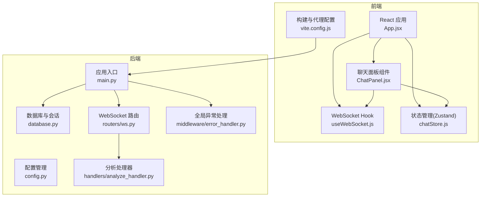
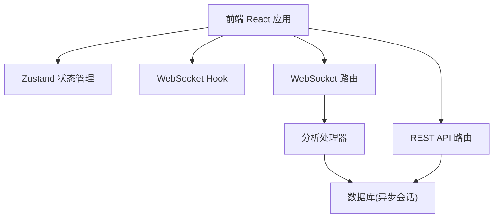
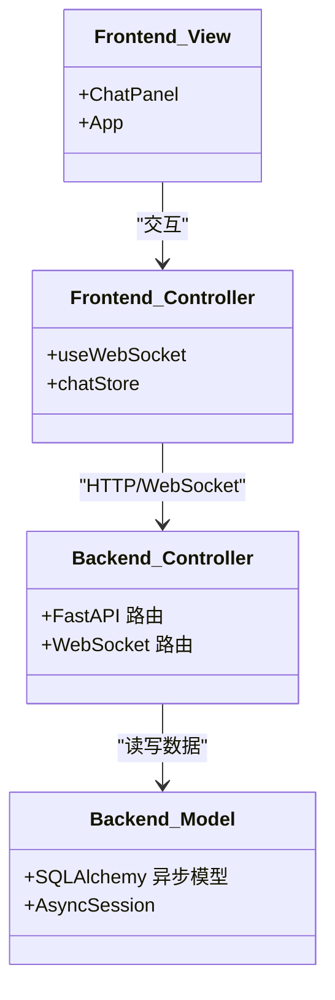
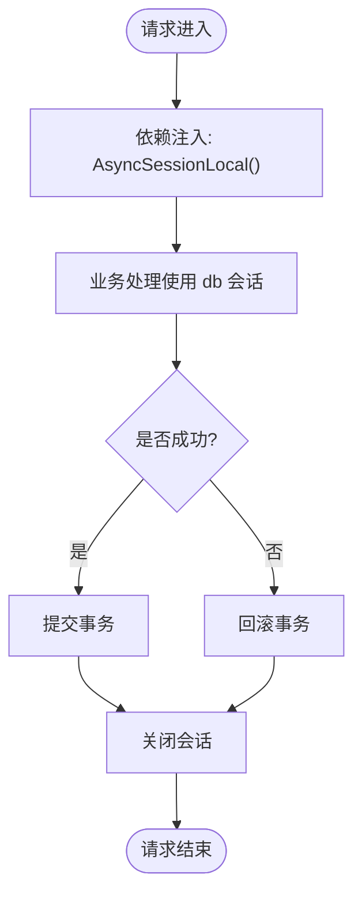
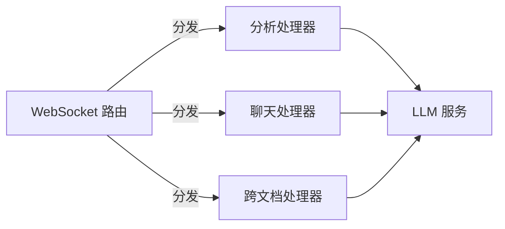
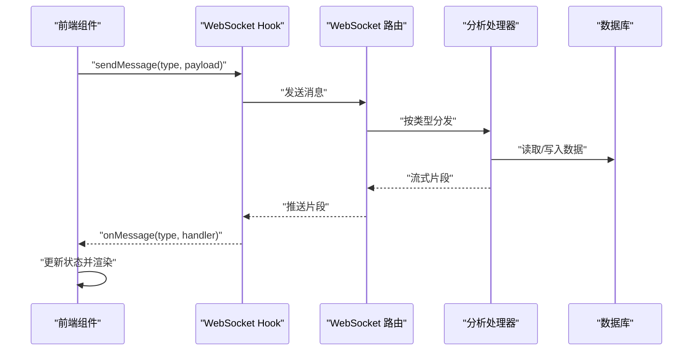
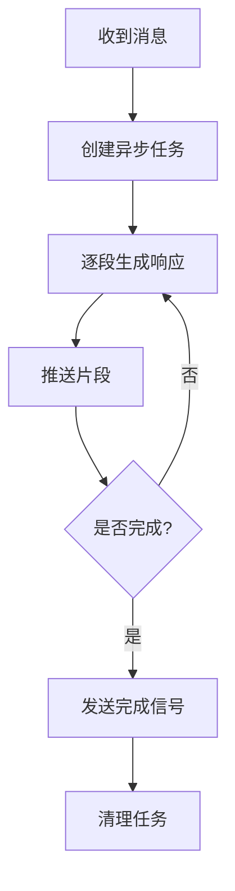
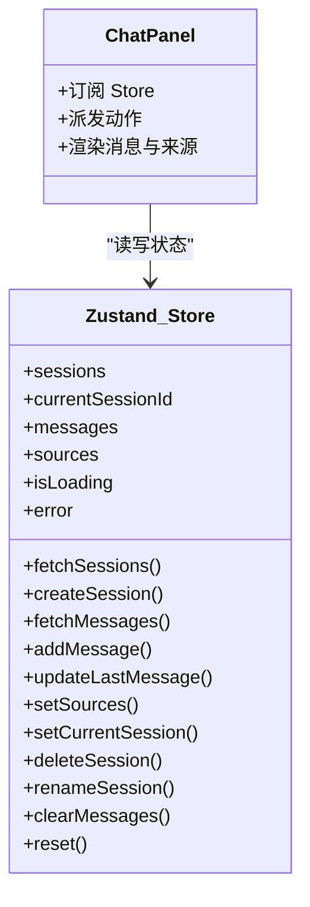
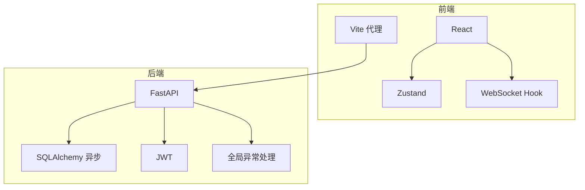

# 设计模式与架构模式

<cite>
**本文档引用的文件**
- [backend/app/main.py](file://backend/app/main.py)
- [backend/app/config.py](file://backend/app/config.py)
- [backend/app/database.py](file://backend/app/database.py)
- [backend/app/middleware/error_handler.py](file://backend/app/middleware/error_handler.py)
- [backend/app/routers/ws.py](file://backend/app/routers/ws.py)
- [backend/app/handlers/analyze_handler.py](file://backend/app/handlers/analyze_handler.py)
- [backend/app/services/__init__.py](file://backend/app/services/__init__.py)
- [backend/app/services/llm_service.py](file://backend/app/services/llm_service.py)
- [frontend/src/App.jsx](file://frontend/src/App.jsx)
- [frontend/src/hooks/useWebSocket.js](file://frontend/src/hooks/useWebSocket.js)
- [frontend/src/stores/chatStore.js](file://frontend/src/stores/chatStore.js)
- [frontend/src/components/ChatPanel/ChatPanel.jsx](file://frontend/src/components/ChatPanel/ChatPanel.jsx)
- [frontend/vite.config.js](file://frontend/vite.config.js)
</cite>

## 目录
1. [引言](#引言)
2. [项目结构](#项目结构)
3. [核心组件](#核心组件)
4. [架构总览](#架构总览)
5. [详细组件分析](#详细组件分析)
6. [依赖分析](#依赖分析)
7. [性能考量](#性能考量)
8. [故障排查指南](#故障排查指南)
9. [结论](#结论)
10. [附录](#附录)

## 引言
本文件面向 PaperChat 系统，系统性梳理其采用的设计模式与架构模式，重点覆盖：
- MVC 模式在后端的实现与前后端职责划分
- 依赖注入与工厂模式在服务创建与数据库会话管理中的应用
- 微服务架构原则在单体后端中的实践（服务解耦、接口隔离、单一职责）
- 事件驱动架构在 WebSocket 实时通信中的落地
- 异步编程模式（asyncio）在后端处理中的使用与最佳实践
- 状态管理模式（Zustand）在前端的状态设计与使用方式
- 结合具体代码路径给出实现细节与参考示例

## 项目结构
PaperChat 采用前后端分离架构，后端基于 FastAPI，前端基于 React，通过 WebSocket 实现实时交互，并使用 Zustand 进行前端状态管理。

**图表来源**
- [backend/app/main.py:1-114](file://backend/app/main.py#L1-L114)
- [backend/app/config.py:1-44](file://backend/app/config.py#L1-L44)
- [backend/app/database.py:1-81](file://backend/app/database.py#L1-L81)
- [backend/app/middleware/error_handler.py:1-92](file://backend/app/middleware/error_handler.py#L1-L92)
- [backend/app/routers/ws.py:1-436](file://backend/app/routers/ws.py#L1-L436)
- [backend/app/handlers/analyze_handler.py:1-87](file://backend/app/handlers/analyze_handler.py#L1-L87)
- [frontend/src/App.jsx:1-1010](file://frontend/src/App.jsx#L1-L1010)
- [frontend/src/hooks/useWebSocket.js:1-180](file://frontend/src/hooks/useWebSocket.js#L1-L180)
- [frontend/src/stores/chatStore.js:1-417](file://frontend/src/stores/chatStore.js#L1-L417)
- [frontend/src/components/ChatPanel/ChatPanel.jsx:1-611](file://frontend/src/components/ChatPanel/ChatPanel.jsx#L1-L611)
- [frontend/vite.config.js:1-54](file://frontend/vite.config.js#L1-L54)

**章节来源**
- [backend/app/main.py:1-114](file://backend/app/main.py#L1-L114)
- [frontend/src/App.jsx:1-1010](file://frontend/src/App.jsx#L1-L1010)

## 核心组件
- 后端应用入口与生命周期管理：负责应用初始化、数据库连接、CORS 中间件、全局异常处理与路由注册。
- WebSocket 路由与消息分发：统一接入各类实时消息类型，按类型路由至对应处理器。
- 分析处理器：封装论文分析与深度分析的异步流式输出逻辑。
- 数据库与依赖注入：提供异步会话工厂与依赖注入函数，确保事务一致性与资源释放。
- 前端 WebSocket Hook：集中管理连接状态、消息订阅与重连策略。
- Zustand 状态管理：集中管理会话、消息、跨文档问答、联网搜索等状态。
- 构建与代理：Vite 代理后端 API 与 WebSocket，分包优化第三方依赖。

**章节来源**
- [backend/app/main.py:55-95](file://backend/app/main.py#L55-L95)
- [backend/app/routers/ws.py:76-436](file://backend/app/routers/ws.py#L76-L436)
- [backend/app/handlers/analyze_handler.py:13-87](file://backend/app/handlers/analyze_handler.py#L13-L87)
- [backend/app/database.py:30-81](file://backend/app/database.py#L30-L81)
- [frontend/src/hooks/useWebSocket.js:1-180](file://frontend/src/hooks/useWebSocket.js#L1-L180)
- [frontend/src/stores/chatStore.js:1-417](file://frontend/src/stores/chatStore.js#L1-L417)
- [frontend/vite.config.js:1-54](file://frontend/vite.config.js#L1-L54)

## 架构总览
PaperChat 采用“单体后端 + 前端 SPA”的整体架构，后端通过 FastAPI 提供 REST 与 WebSocket 服务；前端通过 Zustand 管理状态并通过 WebSocket 与后端进行事件驱动的实时通信。

**图表来源**
- [backend/app/routers/ws.py:76-436](file://backend/app/routers/ws.py#L76-L436)
- [backend/app/handlers/analyze_handler.py:13-87](file://backend/app/handlers/analyze_handler.py#L13-L87)
- [backend/app/database.py:30-81](file://backend/app/database.py#L30-L81)
- [frontend/src/stores/chatStore.js:1-417](file://frontend/src/stores/chatStore.js#L1-L417)
- [frontend/src/hooks/useWebSocket.js:1-180](file://frontend/src/hooks/useWebSocket.js#L1-L180)

## 详细组件分析

### MVC 模式实现
- 视图层（View）：前端 React 组件（如 ChatPanel、App），负责渲染与用户交互。
- 控制器（Controller）：前端 Zustand Store 与 WebSocket Hook 承担控制器职责，协调视图与模型；后端 FastAPI 路由承担控制器职责，接收请求并调度服务。
- 模型层（Model）：后端 SQLAlchemy 异步模型与数据库会话；前端 Zustand Store 管理应用状态。

**图表来源**
- [frontend/src/components/ChatPanel/ChatPanel.jsx:121-611](file://frontend/src/components/ChatPanel/ChatPanel.jsx#L121-L611)
- [frontend/src/stores/chatStore.js:1-417](file://frontend/src/stores/chatStore.js#L1-L417)
- [frontend/src/hooks/useWebSocket.js:84-180](file://frontend/src/hooks/useWebSocket.js#L84-L180)
- [backend/app/routers/ws.py:76-436](file://backend/app/routers/ws.py#L76-L436)
- [backend/app/database.py:8-81](file://backend/app/database.py#L8-L81)

**章节来源**
- [frontend/src/components/ChatPanel/ChatPanel.jsx:121-611](file://frontend/src/components/ChatPanel/ChatPanel.jsx#L121-L611)
- [frontend/src/stores/chatStore.js:1-417](file://frontend/src/stores/chatStore.js#L1-L417)
- [frontend/src/hooks/useWebSocket.js:84-180](file://frontend/src/hooks/useWebSocket.js#L84-L180)
- [backend/app/routers/ws.py:76-436](file://backend/app/routers/ws.py#L76-L436)
- [backend/app/database.py:8-81](file://backend/app/database.py#L8-L81)

### 依赖注入与工厂模式
- 依赖注入（DI）：后端通过 FastAPI 的依赖注入机制，将数据库会话注入到路由处理函数中，保证每个请求拥有独立的会话上下文。
- 工厂模式：数据库会话工厂（async_sessionmaker）统一创建 AsyncSession，确保会话生命周期与事务控制一致。

**图表来源**
- [backend/app/database.py:30-48](file://backend/app/database.py#L30-L48)

**章节来源**
- [backend/app/database.py:30-48](file://backend/app/database.py#L30-L48)

### 微服务架构原则的单体实践
- 服务解耦：后端将 WebSocket 路由、REST 路由、处理器与服务层清晰分离，便于独立演进与测试。
- 接口隔离：WebSocket 路由定义明确的消息类型与响应格式，前端按类型订阅与处理。
- 单一职责：WebSocket 路由只负责连接生命周期与消息分发；处理器专注于具体业务逻辑；服务层封装 LLM 与检索能力。

**图表来源**
- [backend/app/routers/ws.py:76-436](file://backend/app/routers/ws.py#L76-L436)
- [backend/app/handlers/analyze_handler.py:13-87](file://backend/app/handlers/analyze_handler.py#L13-L87)

**章节来源**
- [backend/app/routers/ws.py:76-436](file://backend/app/routers/ws.py#L76-L436)
- [backend/app/handlers/analyze_handler.py:13-87](file://backend/app/handlers/analyze_handler.py#L13-L87)

### 事件驱动架构与 WebSocket 实时通信
- 事件模型：前端通过 WebSocket Hook 订阅不同类型的消息（如分析片段、完成、错误），后端按消息类型触发相应处理流程。
- 流式输出：后端将长耗时任务拆分为多个片段，逐段推送，前端即时渲染，提升用户体验。
- 统一入口：后端提供统一聊天入口，根据关键词识别意图，自动路由到不同处理分支。

**图表来源**
- [frontend/src/hooks/useWebSocket.js:100-179](file://frontend/src/hooks/useWebSocket.js#L100-L179)
- [backend/app/routers/ws.py:120-417](file://backend/app/routers/ws.py#L120-L417)
- [backend/app/handlers/analyze_handler.py:13-87](file://backend/app/handlers/analyze_handler.py#L13-L87)

**章节来源**
- [frontend/src/hooks/useWebSocket.js:1-180](file://frontend/src/hooks/useWebSocket.js#L1-L180)
- [backend/app/routers/ws.py:76-436](file://backend/app/routers/ws.py#L76-L436)
- [backend/app/handlers/analyze_handler.py:13-87](file://backend/app/handlers/analyze_handler.py#L13-L87)

### 异步编程模式与 asyncio 使用
- 后端异步：FastAPI 与 SQLAlchemy 异步引擎配合，处理器以异步方式消费 LLM 服务输出，逐段推送至客户端。
- 任务管理：WebSocket 路由维护运行中的任务集合，支持取消与清理，避免并发冲突。
- 前端异步：React Hooks 与 Zustand 在异步数据加载与状态更新中协同工作。

**图表来源**
- [backend/app/routers/ws.py:133-250](file://backend/app/routers/ws.py#L133-L250)
- [backend/app/handlers/analyze_handler.py:18-48](file://backend/app/handlers/analyze_handler.py#L18-L48)

**章节来源**
- [backend/app/routers/ws.py:133-250](file://backend/app/routers/ws.py#L133-L250)
- [backend/app/handlers/analyze_handler.py:18-48](file://backend/app/handlers/analyze_handler.py#L18-L48)

### 状态管理模式（Zustand）
- 设计理念：以最小 API 提供集中式状态管理，避免样板代码，适合复杂前端状态（会话、消息、跨文档、联网搜索）。
- 使用方式：Store 将状态与动作聚合，组件通过订阅与派发更新状态；聊天面板组件通过 Store 管理会话、消息与来源引用。

**图表来源**
- [frontend/src/stores/chatStore.js:4-417](file://frontend/src/stores/chatStore.js#L4-L417)
- [frontend/src/components/ChatPanel/ChatPanel.jsx:140-215](file://frontend/src/components/ChatPanel/ChatPanel.jsx#L140-L215)

**章节来源**
- [frontend/src/stores/chatStore.js:1-417](file://frontend/src/stores/chatStore.js#L1-L417)
- [frontend/src/components/ChatPanel/ChatPanel.jsx:140-215](file://frontend/src/components/ChatPanel/ChatPanel.jsx#L140-L215)

### 具体代码示例与实现细节
- 应用入口与生命周期：[backend/app/main.py:16-53](file://backend/app/main.py#L16-L53)
- WebSocket 路由与消息分发：[backend/app/routers/ws.py:76-436](file://backend/app/routers/ws.py#L76-L436)
- 分析处理器（流式输出）：[backend/app/handlers/analyze_handler.py:13-87](file://backend/app/handlers/analyze_handler.py#L13-L87)
- 数据库会话工厂与依赖注入：[backend/app/database.py:30-48](file://backend/app/database.py#L30-L48)
- 前端 WebSocket Hook（连接与订阅）：[frontend/src/hooks/useWebSocket.js:19-71](file://frontend/src/hooks/useWebSocket.js#L19-L71)
- Zustand 聊天 Store（会话与消息管理）：[frontend/src/stores/chatStore.js:23-233](file://frontend/src/stores/chatStore.js#L23-L233)
- 构建代理与分包优化：[frontend/vite.config.js:7-17](file://frontend/vite.config.js#L7-L17)

**章节来源**
- [backend/app/main.py:16-53](file://backend/app/main.py#L16-L53)
- [backend/app/routers/ws.py:76-436](file://backend/app/routers/ws.py#L76-L436)
- [backend/app/handlers/analyze_handler.py:13-87](file://backend/app/handlers/analyze_handler.py#L13-L87)
- [backend/app/database.py:30-48](file://backend/app/database.py#L30-L48)
- [frontend/src/hooks/useWebSocket.js:19-71](file://frontend/src/hooks/useWebSocket.js#L19-L71)
- [frontend/src/stores/chatStore.js:23-233](file://frontend/src/stores/chatStore.js#L23-L233)
- [frontend/vite.config.js:7-17](file://frontend/vite.config.js#L7-L17)

## 依赖分析
- 前端依赖：React、Zustand、WebSocket Hook、构建代理与分包优化。
- 后端依赖：FastAPI、SQLAlchemy 异步、WebSocket 路由、JWT 鉴权、全局异常处理。
- 事件与状态：前端通过 WebSocket 事件驱动状态更新，Zustand 作为单一真相源。

**图表来源**
- [frontend/src/stores/chatStore.js:1-417](file://frontend/src/stores/chatStore.js#L1-L417)
- [frontend/src/hooks/useWebSocket.js:1-180](file://frontend/src/hooks/useWebSocket.js#L1-L180)
- [frontend/vite.config.js:1-54](file://frontend/vite.config.js#L1-L54)
- [backend/app/main.py:55-95](file://backend/app/main.py#L55-L95)
- [backend/app/middleware/error_handler.py:73-92](file://backend/app/middleware/error_handler.py#L73-L92)

**章节来源**
- [frontend/src/stores/chatStore.js:1-417](file://frontend/src/stores/chatStore.js#L1-L417)
- [frontend/src/hooks/useWebSocket.js:1-180](file://frontend/src/hooks/useWebSocket.js#L1-L180)
- [frontend/vite.config.js:1-54](file://frontend/vite.config.js#L1-L54)
- [backend/app/main.py:55-95](file://backend/app/main.py#L55-L95)
- [backend/app/middleware/error_handler.py:73-92](file://backend/app/middleware/error_handler.py#L73-L92)

## 性能考量
- 异步 I/O：后端使用异步数据库与 LLM 服务，避免阻塞主线程，提升吞吐量。
- 流式传输：分析与问答采用分片推送，前端即时渲染，降低首屏等待时间。
- 前端分包：Vite 配置将 React、PDF、Zustand、Markdown 等依赖拆分为独立 chunk，减少初始包体积。
- 连接复用：前端 WebSocket Hook 管理全局连接与重连，避免频繁重建连接带来的开销。

**章节来源**
- [backend/app/routers/ws.py:133-250](file://backend/app/routers/ws.py#L133-L250)
- [frontend/src/hooks/useWebSocket.js:19-71](file://frontend/src/hooks/useWebSocket.js#L19-L71)
- [frontend/vite.config.js:20-52](file://frontend/vite.config.js#L20-L52)

## 故障排查指南
- WebSocket 连接失败：检查前端 Hook 的连接状态与重连逻辑，确认后端路由是否正确接受连接。
- 请求参数校验失败：后端全局异常处理器会返回标准化错误，前端据此展示提示。
- 数据库异常：捕获 SQLAlchemy 异常并返回统一错误响应，定位具体 SQL 语句与事务边界。
- 任务取消：WebSocket 路由维护运行中的任务集合，支持取消与清理，避免资源泄漏。

**章节来源**
- [frontend/src/hooks/useWebSocket.js:19-71](file://frontend/src/hooks/useWebSocket.js#L19-L71)
- [backend/app/middleware/error_handler.py:11-71](file://backend/app/middleware/error_handler.py#L11-L71)
- [backend/app/routers/ws.py:424-436](file://backend/app/routers/ws.py#L424-L436)

## 结论
PaperChat 在单体后端中实践了清晰的服务解耦与接口隔离，结合 FastAPI 的异步能力与 WebSocket 的事件驱动特性，实现了高效的论文分析与问答体验。前端通过 Zustand 集中式管理复杂状态，配合流式渲染与分包优化，显著提升了交互性能与开发效率。建议持续关注任务取消与错误恢复的健壮性，以及跨文档与联网搜索场景下的性能与稳定性。

## 附录
- 配置管理：[backend/app/config.py:15-44](file://backend/app/config.py#L15-L44)
- 应用入口与路由注册：[backend/app/main.py:55-95](file://backend/app/main.py#L55-L95)
- LLM 服务兼容入口：[backend/app/services/llm_service.py:1-6](file://backend/app/services/llm_service.py#L1-L6)