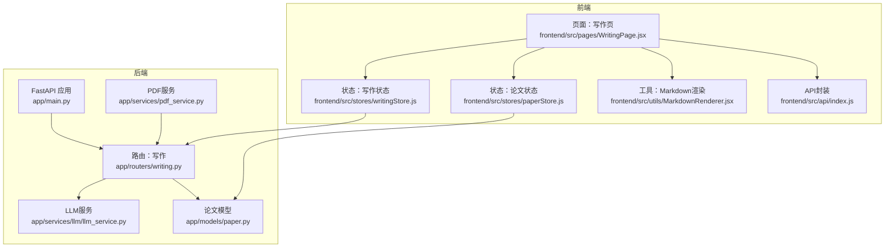
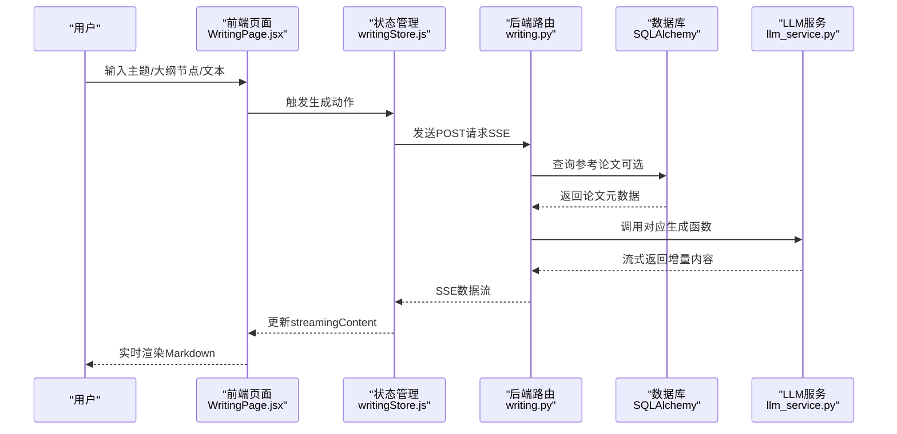
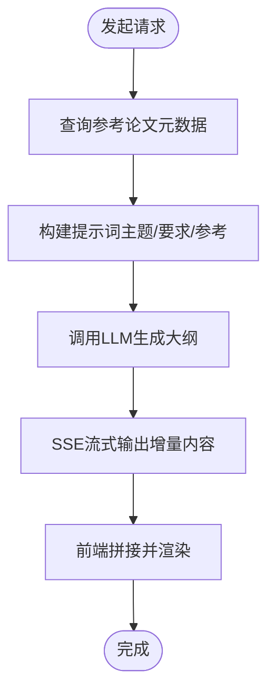
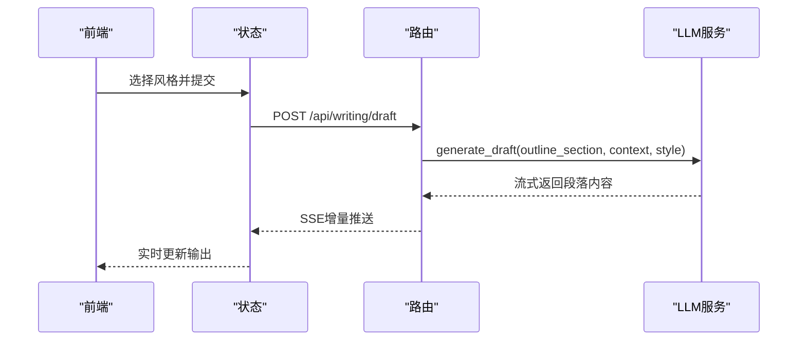
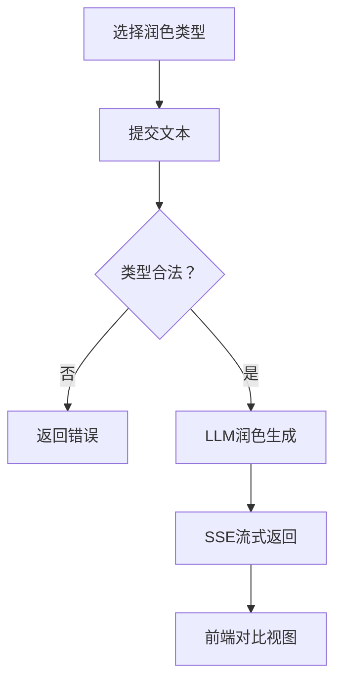
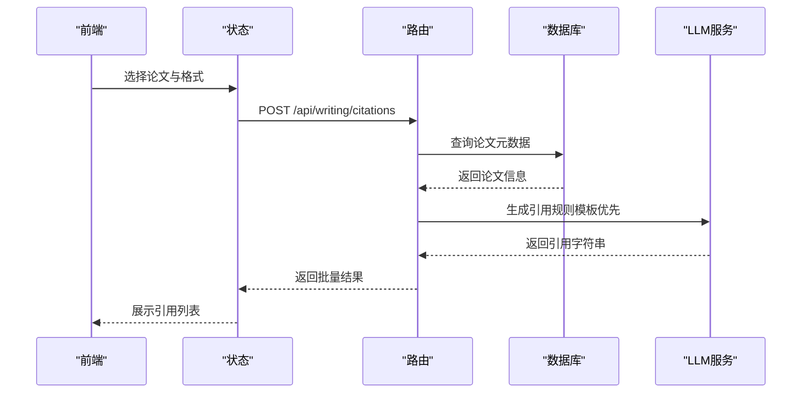
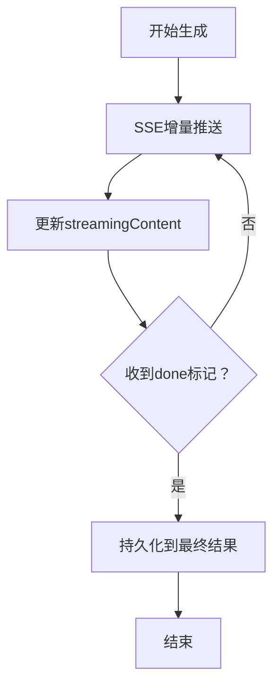
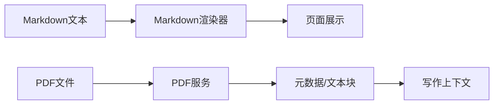
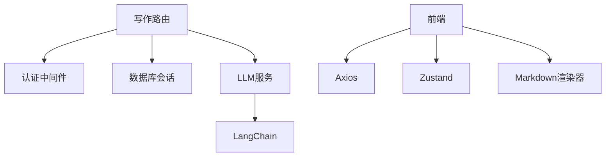

# 写作辅助功能

<cite>
**本文档引用的文件**
- [backend/app/routers/writing.py](file://backend/app/routers/writing.py)
- [backend/app/services/llm/llm_service.py](file://backend/app/services/llm/llm_service.py)
- [backend/app/services/pdf_service.py](file://backend/app/services/pdf_service.py)
- [backend/app/models/paper.py](file://backend/app/models/paper.py)
- [backend/app/main.py](file://backend/app/main.py)
- [frontend/src/pages/WritingPage.jsx](file://frontend/src/pages/WritingPage.jsx)
- [frontend/src/stores/writingStore.js](file://frontend/src/stores/writingStore.js)
- [frontend/src/stores/paperStore.js](file://frontend/src/stores/paperStore.js)
- [frontend/src/utils/MarkdownRenderer.jsx](file://frontend/src/utils/MarkdownRenderer.jsx)
- [frontend/src/api/index.js](file://frontend/src/api/index.js)
</cite>

## 目录
1. [简介](#简介)
2. [项目结构](#项目结构)
3. [核心组件](#核心组件)
4. [架构总览](#架构总览)
5. [详细组件分析](#详细组件分析)
6. [依赖分析](#依赖分析)
7. [性能考虑](#性能考虑)
8. [故障排查指南](#故障排查指南)
9. [结论](#结论)
10. [附录](#附录)

## 简介
本文件面向“写作辅助功能”的技术实现，围绕以下目标展开：
- 论文大纲生成：基于主题、参考论文与附加要求，通过流式生成构建结构化大纲。
- 段落生成：根据大纲节点、参考内容与写作风格，生成高质量初稿。
- 学术润色：支持学术表达、语法修正、流畅性提升与精简表达四类润色。
- 引用格式：支持APA、MLA、Chicago、GB/T 7714四种格式的批量生成。
- 写作进度与模板：前端通过流式SSE接收增量内容，实时展示进度；后端提供格式与风格配置查询。
- 多模态写作：前端Markdown渲染器适配标题层级与代码块样式；PDF服务支撑论文元数据与文本块提取。

该文档同时提供API接口说明、前端组件集成示例以及写作质量评估建议。

## 项目结构
后端采用FastAPI + SQLAlchemy + LangChain架构，前端使用React + Zustand + Axios。写作相关能力集中在后端路由与LLM服务，前端负责UI交互与状态管理。

**图表来源**
- [backend/app/main.py:55-95](file://backend/app/main.py#L55-L95)
- [backend/app/routers/writing.py:19](file://backend/app/routers/writing.py#L19)
- [backend/app/services/llm/llm_service.py:29-727](file://backend/app/services/llm/llm_service.py#L29-L727)
- [backend/app/services/pdf_service.py:11-194](file://backend/app/services/pdf_service.py#L11-L194)
- [backend/app/models/paper.py:11-85](file://backend/app/models/paper.py#L11-L85)
- [frontend/src/pages/WritingPage.jsx:1-1156](file://frontend/src/pages/WritingPage.jsx#L1-L1156)
- [frontend/src/stores/writingStore.js:1-275](file://frontend/src/stores/writingStore.js#L1-L275)
- [frontend/src/stores/paperStore.js:1-357](file://frontend/src/stores/paperStore.js#L1-L357)
- [frontend/src/utils/MarkdownRenderer.jsx:1-33](file://frontend/src/utils/MarkdownRenderer.jsx#L1-L33)
- [frontend/src/api/index.js:1-12](file://frontend/src/api/index.js#L1-L12)

**章节来源**
- [backend/app/main.py:55-95](file://backend/app/main.py#L55-L95)
- [backend/app/routers/writing.py:19](file://backend/app/routers/writing.py#L19)
- [frontend/src/pages/WritingPage.jsx:1-1156](file://frontend/src/pages/WritingPage.jsx#L1-L1156)

## 核心组件
- 写作路由（FastAPI）：提供大纲生成、段落生成、学术润色、引用格式生成与格式查询接口，均通过SSE流式返回。
- LLM服务（LangChain）：封装DeepSeek模型调用，提供大纲、段落、润色与引用生成的提示词模板与执行流程。
- 前端写作页：三大Tab（大纲、段落、润色）+ 引用格式Tab，配合Zustand状态管理与SSE解析。
- PDF服务：提供元数据与文本块提取，支撑论文分析与RAG检索（间接支持写作上下文）。
- 论文模型：存储论文元数据与分析缓存字段，支撑引用生成与写作上下文。

**章节来源**
- [backend/app/routers/writing.py:72-287](file://backend/app/routers/writing.py#L72-L287)
- [backend/app/services/llm/llm_service.py:491-677](file://backend/app/services/llm/llm_service.py#L491-L677)
- [frontend/src/pages/WritingPage.jsx:35-559](file://frontend/src/pages/WritingPage.jsx#L35-L559)
- [frontend/src/stores/writingStore.js:36-271](file://frontend/src/stores/writingStore.js#L36-L271)
- [backend/app/services/pdf_service.py:11-194](file://backend/app/services/pdf_service.py#L11-L194)
- [backend/app/models/paper.py:11-85](file://backend/app/models/paper.py#L11-L85)

## 架构总览
下图展示了从用户输入到流式输出的关键交互链路，涵盖鉴权、数据库查询、LLM调用与前端渲染。

**图表来源**
- [frontend/src/pages/WritingPage.jsx:35-559](file://frontend/src/pages/WritingPage.jsx#L35-L559)
- [frontend/src/stores/writingStore.js:36-242](file://frontend/src/stores/writingStore.js#L36-L242)
- [backend/app/routers/writing.py:72-287](file://backend/app/routers/writing.py#L72-L287)
- [backend/app/services/llm/llm_service.py:491-677](file://backend/app/services/llm/llm_service.py#L491-L677)

## 详细组件分析

### 大纲生成（论文结构分析与层次化组织）
- 请求体包含主题、参考论文ID列表与额外要求；可选参考论文摘要作为上下文。
- 后端查询用户权限内的论文元数据，拼接为参考上下文。
- LLM服务构造提示词模板，调用流式生成，逐块返回大纲内容。
- 前端通过SSE解析，实时拼接并渲染Markdown。

**图表来源**
- [backend/app/routers/writing.py:48-108](file://backend/app/routers/writing.py#L48-L108)
- [backend/app/services/llm/llm_service.py:491-534](file://backend/app/services/llm/llm_service.py#L491-L534)
- [frontend/src/stores/writingStore.js:36-97](file://frontend/src/stores/writingStore.js#L36-L97)

**章节来源**
- [backend/app/routers/writing.py:72-108](file://backend/app/routers/writing.py#L72-L108)
- [backend/app/services/llm/llm_service.py:491-534](file://backend/app/services/llm/llm_service.py#L491-L534)
- [frontend/src/stores/writingStore.js:36-97](file://frontend/src/stores/writingStore.js#L36-L97)

### 段落生成（主题扩展、内容填充与风格适配）
- 输入为大纲节点文本、可选参考内容与写作风格（学术/正式/简洁）。
- LLM服务根据风格映射生成描述，结合上下文生成段落初稿。
- 前端同样以SSE增量渲染，支持编辑/预览切换。

**图表来源**
- [backend/app/routers/writing.py:111-140](file://backend/app/routers/writing.py#L111-L140)
- [backend/app/services/llm/llm_service.py:536-577](file://backend/app/services/llm/llm_service.py#L536-L577)
- [frontend/src/stores/writingStore.js:99-160](file://frontend/src/stores/writingStore.js#L99-L160)

**章节来源**
- [backend/app/routers/writing.py:111-140](file://backend/app/routers/writing.py#L111-L140)
- [backend/app/services/llm/llm_service.py:536-577](file://backend/app/services/llm/llm_service.py#L536-L577)
- [frontend/src/stores/writingStore.js:99-160](file://frontend/src/stores/writingStore.js#L99-L160)

### 学术润色（语法检查、词汇优化、句式改写与精简）
- 支持四种润色类型：学术表达、语法修正、流畅性提升、精简表达。
- 后端校验类型合法性，调用LLM服务生成润色结果。
- 前端提供对比视图，便于查看原文与润色后文本差异。

**图表来源**
- [backend/app/routers/writing.py:142-184](file://backend/app/routers/writing.py#L142-L184)
- [backend/app/services/llm/llm_service.py:579-614](file://backend/app/services/llm/llm_service.py#L579-L614)
- [frontend/src/pages/WritingPage.jsx:300-414](file://frontend/src/pages/WritingPage.jsx#L300-L414)

**章节来源**
- [backend/app/routers/writing.py:142-184](file://backend/app/routers/writing.py#L142-L184)
- [backend/app/services/llm/llm_service.py:579-614](file://backend/app/services/llm/llm_service.py#L579-L614)
- [frontend/src/pages/WritingPage.jsx:300-414](file://frontend/src/pages/WritingPage.jsx#L300-L414)

### 引用格式生成（批量与格式查询）
- 批量生成：根据论文ID列表与目标格式，逐条生成引用并返回结果。
- 格式查询：返回支持的引用格式与润色类型、写作风格的描述信息。
- 引用生成策略：优先使用规则模板（高效），不支持时回退至LLM生成。

**图表来源**
- [backend/app/routers/writing.py:187-262](file://backend/app/routers/writing.py#L187-L262)
- [backend/app/services/llm/llm_service.py:616-677](file://backend/app/services/llm/llm_service.py#L616-L677)
- [frontend/src/stores/writingStore.js:224-242](file://frontend/src/stores/writingStore.js#L224-L242)

**章节来源**
- [backend/app/routers/writing.py:187-262](file://backend/app/routers/writing.py#L187-L262)
- [backend/app/services/llm/llm_service.py:616-677](file://backend/app/services/llm/llm_service.py#L616-L677)
- [frontend/src/stores/writingStore.js:224-242](file://frontend/src/stores/writingStore.js#L224-L242)

### 写作进度跟踪与模板管理
- 进度跟踪：前端通过SSE解析增量数据，实时更新streamingContent并在完成后持久化到对应结果字段。
- 模板管理：后端提供格式查询接口，返回引用格式、润色类型与写作风格的描述，便于前端动态展示。

**图表来源**
- [frontend/src/stores/writingStore.js:36-242](file://frontend/src/stores/writingStore.js#L36-L242)
- [backend/app/routers/writing.py:265-287](file://backend/app/routers/writing.py#L265-L287)

**章节来源**
- [frontend/src/stores/writingStore.js:36-242](file://frontend/src/stores/writingStore.js#L36-L242)
- [backend/app/routers/writing.py:265-287](file://backend/app/routers/writing.py#L265-L287)

### 多模态写作支持（Markdown渲染与PDF基础能力）
- Markdown渲染：前端使用自定义组件将标题层级降级、统一段落与列表样式，增强可读性。
- PDF基础能力：后端PDF服务提供元数据与文本块提取，为论文分析与RAG检索奠定基础（间接支持写作上下文）。

**图表来源**
- [frontend/src/utils/MarkdownRenderer.jsx:1-33](file://frontend/src/utils/MarkdownRenderer.jsx#L1-L33)
- [backend/app/services/pdf_service.py:11-194](file://backend/app/services/pdf_service.py#L11-L194)

**章节来源**
- [frontend/src/utils/MarkdownRenderer.jsx:1-33](file://frontend/src/utils/MarkdownRenderer.jsx#L1-L33)
- [backend/app/services/pdf_service.py:11-194](file://backend/app/services/pdf_service.py#L11-L194)

## 依赖分析
- 路由依赖：写作路由依赖认证中间件、数据库会话与LLM服务；引用生成还依赖论文模型。
- LLM服务依赖：LangChain ChatOpenAI与提示词模板；生成函数按需拼装上下文与风格描述。
- 前端依赖：Axios封装API调用；Zustand集中管理生成状态；Markdown渲染器统一UI风格。

**图表来源**
- [backend/app/routers/writing.py:13-17](file://backend/app/routers/writing.py#L13-L17)
- [backend/app/services/llm/llm_service.py:4-26](file://backend/app/services/llm/llm_service.py#L4-L26)
- [frontend/src/api/index.js:1-12](file://frontend/src/api/index.js#L1-L12)
- [frontend/src/stores/writingStore.js:1-3](file://frontend/src/stores/writingStore.js#L1-L3)
- [frontend/src/utils/MarkdownRenderer.jsx:1-33](file://frontend/src/utils/MarkdownRenderer.jsx#L1-L33)

**章节来源**
- [backend/app/routers/writing.py:13-17](file://backend/app/routers/writing.py#L13-L17)
- [backend/app/services/llm/llm_service.py:4-26](file://backend/app/services/llm/llm_service.py#L4-L26)
- [frontend/src/api/index.js:1-12](file://frontend/src/api/index.js#L1-L12)
- [frontend/src/stores/writingStore.js:1-3](file://frontend/src/stores/writingStore.js#L1-L3)
- [frontend/src/utils/MarkdownRenderer.jsx:1-33](file://frontend/src/utils/MarkdownRenderer.jsx#L1-L33)

## 性能考虑
- 流式传输：SSE减少首屏等待时间，前端逐步渲染，提升感知性能。
- 上下文截断：LLM服务对输入文本进行长度控制与截断，避免超限与高延迟。
- 配置更新：运行时可更新模型参数（温度、最大token、API Key等），无需重启。
- PDF解析：文本块提取按页扫描字符，注意大文件的内存占用与解析时间。

[本节为通用指导，无需特定文件来源]

## 故障排查指南
- SSE解析失败：前端按行解析data: JSON，忽略解析错误；若长时间无数据，检查后端日志与API Key配置。
- 权限与论文不存在：引用生成对论文ID进行存在性校验，返回错误信息；确认论文归属与ID有效性。
- 类型非法：润色类型校验失败时返回HTTP 400，检查类型枚举。
- LLM异常：LLM服务捕获异常并返回错误片段，前端显示错误提示；检查网络与模型可用性。

**章节来源**
- [frontend/src/stores/writingStore.js:84-96](file://frontend/src/stores/writingStore.js#L84-L96)
- [backend/app/routers/writing.py:204-207](file://backend/app/routers/writing.py#L204-L207)
- [backend/app/routers/writing.py:157-161](file://backend/app/routers/writing.py#L157-L161)
- [backend/app/services/llm/llm_service.py:139-140](file://backend/app/services/llm/llm_service.py#L139-L140)

## 结论
写作辅助功能通过“路由-服务-前端”三层协作，实现了从论文结构分析、段落生成、学术润色到引用格式化的完整闭环。SSE流式传输与Zustand状态管理保证了良好的用户体验；LLM服务的可配置性与规则模板相结合，兼顾了性能与准确性。未来可在提示词工程、质量评估指标与多模态内容（图表、公式）集成方面持续优化。

[本节为总结，无需特定文件来源]

## 附录

### API 接口文档
- 大纲生成
  - 方法与路径：POST /api/writing/outline
  - 请求体字段：topic（主题）、paper_ids（参考论文ID列表，可选）、requirements（额外要求，可选）
  - 响应：SSE流，逐块返回content，结束时done为true
- 段落生成
  - 方法与路径：POST /api/writing/draft
  - 请求体字段：outline_section（大纲节点文本）、context（参考内容，可选）、style（academic/formal/concise）
  - 响应：SSE流，逐块返回content，结束时done为true
- 学术润色
  - 方法与路径：POST /api/writing/polish
  - 请求体字段：text（待润色文本）、polish_type（academic/grammar/fluency/concise）
  - 响应：SSE流，逐块返回content，结束时done为true
- 引用格式生成
  - 方法与路径：POST /api/writing/citations
  - 请求体字段：paper_ids（论文ID列表）、format（apa/mla/chicago/gbt7714）
  - 响应：JSON数组，包含每条论文的引用或错误信息
- 格式与类型查询
  - 方法与路径：GET /api/writing/formats
  - 响应：formats、polish_types、writing_styles的描述列表

**章节来源**
- [backend/app/routers/writing.py:72-287](file://backend/app/routers/writing.py#L72-L287)

### 前端组件集成示例
- 写作页（WritingPage.jsx）：包含大纲、段落、润色、引用四个Tab，分别调用对应生成函数与渲染Markdown。
- 状态管理（writingStore.js）：封装SSE解析、错误处理与结果持久化。
- 论文状态（paperStore.js）：提供论文列表与上传能力，供写作页选择参考论文。
- API封装（api/index.js）：统一基地址与请求头。

**章节来源**
- [frontend/src/pages/WritingPage.jsx:35-559](file://frontend/src/pages/WritingPage.jsx#L35-L559)
- [frontend/src/stores/writingStore.js:36-271](file://frontend/src/stores/writingStore.js#L36-L271)
- [frontend/src/stores/paperStore.js:22-47](file://frontend/src/stores/paperStore.js#L22-L47)
- [frontend/src/api/index.js:1-12](file://frontend/src/api/index.js#L1-L12)

### 写作质量评估指标（建议）
- 结构性：大纲层级清晰度、段落与主题一致性、逻辑连贯性。
- 语言质量：语法正确率、词汇多样性、句式复杂度与流畅性。
- 专业性：术语使用准确性、学术表达规范性、引用格式一致性。
- 生成效率：首屏渲染时间、SSE延迟、吞吐量与资源占用。

[本节为建议，无需特定文件来源]