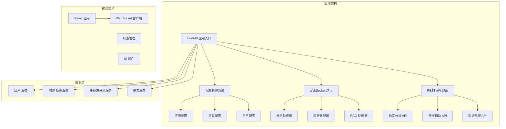
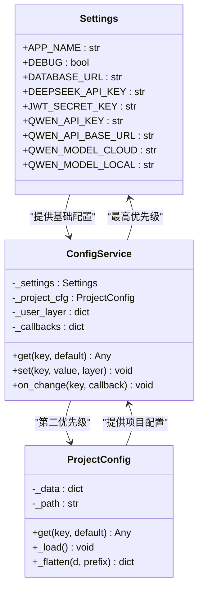
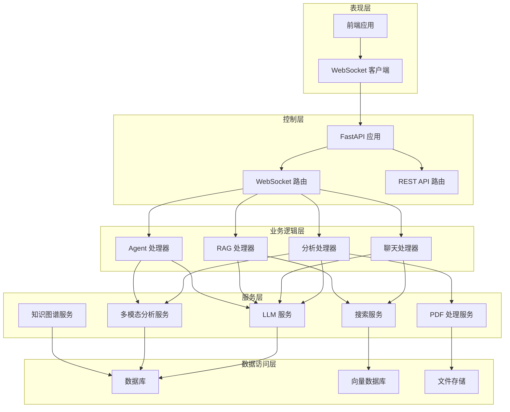
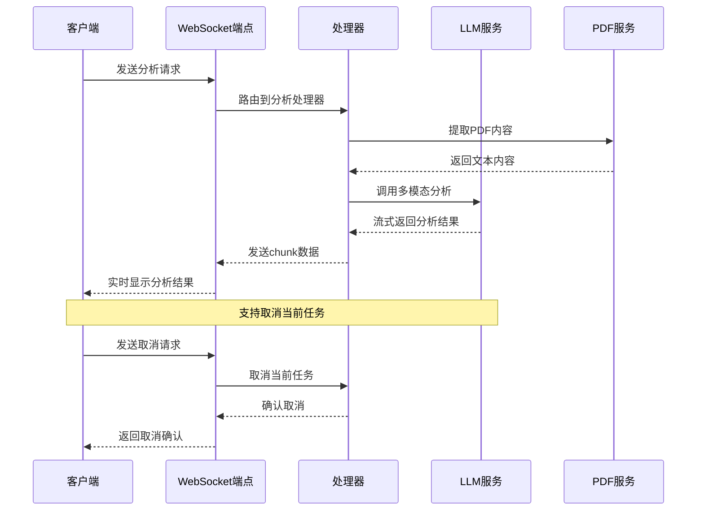
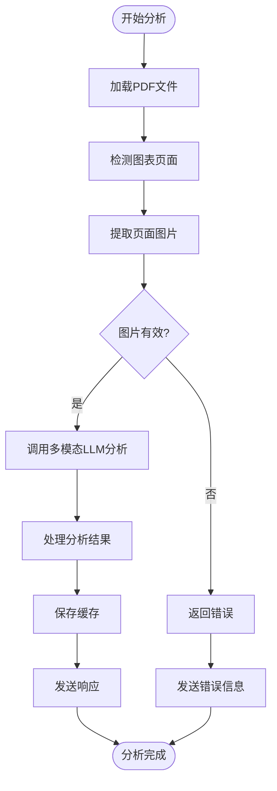
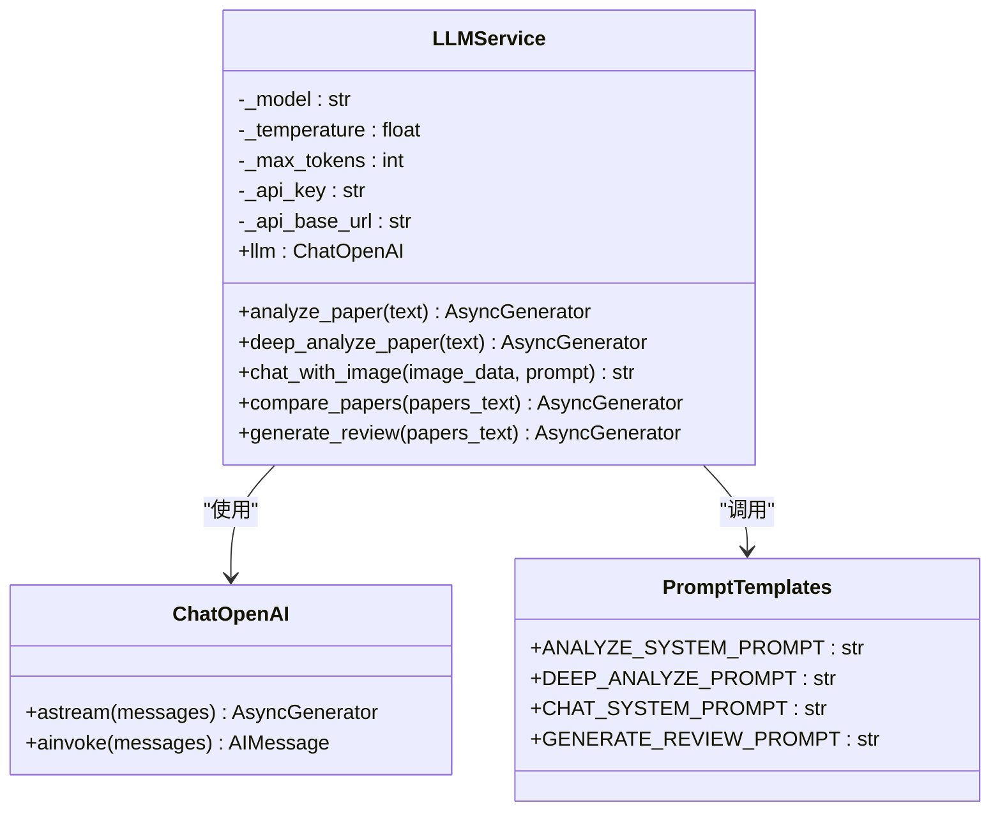
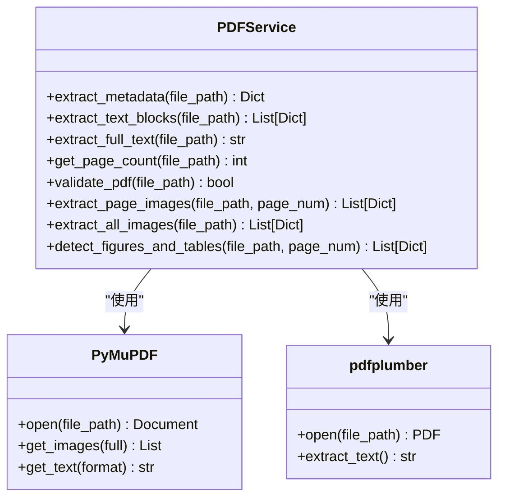
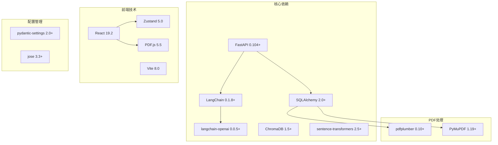

# 多模态分析系统

<cite>
**本文档引用的文件**
- [backend/main.py](file://backend/main.py)
- [backend/app/config.py](file://backend/app/config.py)
- [backend/app/tools/multimodal_tools.py](file://backend/app/tools/multimodal_tools.py)
- [backend/app/services/pdf_service.py](file://backend/app/services/pdf_service.py)
- [backend/app/services/llm/llm_service.py](file://backend/app/services/llm/llm_service.py)
- [backend/app/models/paper.py](file://backend/app/models/paper.py)
- [backend/app/routers/ws.py](file://backend/app/routers/ws.py)
- [backend/app/handlers/analyze_handler.py](file://backend/app/handlers/analyze_handler.py)
- [backend/app/routers/analysis.py](file://backend/app/routers/analysis.py)
- [frontend/src/App.jsx](file://frontend/src/App.jsx)
- [README.md](file://README.md)
</cite>

## 目录
1. [简介](#简介)
2. [项目结构](#项目结构)
3. [核心组件](#核心组件)
4. [架构概览](#架构概览)
5. [详细组件分析](#详细组件分析)
6. [依赖关系分析](#依赖关系分析)
7. [性能考虑](#性能考虑)
8. [故障排除指南](#故障排除指南)
9. [结论](#结论)

## 简介

PaperChat 是一个基于云端大模型的智能论文分析系统，专为学术研究而设计。该系统支持 PDF 上传、AI 论文结构化解析、智能问答、知识管理和写作辅助等功能。系统采用前后端分离架构，后端基于 FastAPI 和 LangChain，前端使用 React 和 Vite。

该多模态分析系统的核心特色在于其强大的图像理解和处理能力，能够分析论文中的图表、表格和图片内容，提供深度的视觉信息理解。系统支持多种分析模式，包括章节概览、深度分析、关键词提取和多模态搜索等。

## 项目结构

系统采用模块化的项目结构，主要分为以下几个核心部分：

**图表来源**
- [backend/main.py:1-151](file://backend/main.py#L1-L151)
- [backend/app/config.py:1-273](file://backend/app/config.py#L1-L273)
- [frontend/src/App.jsx:1-183](file://frontend/src/App.jsx#L1-L183)

**章节来源**
- [README.md:72-183](file://README.md#L72-L183)

## 核心组件

### 配置管理系统

系统采用四层配置覆盖机制，提供了灵活的配置管理能力：

**图表来源**
- [backend/app/config.py:29-273](file://backend/app/config.py#L29-L273)

### 多模态分析工具集

系统提供了三个核心的多模态分析工具：

1. **图表分析工具**：自动检测和分析论文中的图表内容
2. **多模态搜索工具**：结合图片和文本进行智能搜索
3. **表格提取工具**：从论文中提取结构化表格数据

**章节来源**
- [backend/app/tools/multimodal_tools.py:18-324](file://backend/app/tools/multimodal_tools.py#L18-L324)

## 架构概览

系统采用分层架构设计，实现了清晰的关注点分离：

**图表来源**
- [backend/main.py:21-151](file://backend/main.py#L21-L151)
- [backend/app/routers/ws.py:56-307](file://backend/app/routers/ws.py#L56-L307)

## 详细组件分析

### WebSocket 通信系统

系统使用 WebSocket 实现实时双向通信，支持多种消息类型：

**图表来源**
- [backend/app/routers/ws.py:56-307](file://backend/app/routers/ws.py#L56-L307)
- [backend/app/handlers/analyze_handler.py:14-92](file://backend/app/handlers/analyze_handler.py#L14-L92)

### 多模态分析流程

系统的核心分析流程包括 PDF 处理、图像提取和 LLM 分析三个步骤：

**图表来源**
- [backend/app/tools/multimodal_tools.py:32-95](file://backend/app/tools/multimodal_tools.py#L32-L95)
- [backend/app/services/pdf_service.py:228-269](file://backend/app/services/pdf_service.py#L228-L269)

### LLM 服务架构

系统使用 LangChain 框架构建 LLM 服务，支持多种分析模式：

**图表来源**
- [backend/app/services/llm/llm_service.py:37-800](file://backend/app/services/llm/llm_service.py#L37-L800)

**章节来源**
- [backend/app/services/llm/llm_service.py:137-481](file://backend/app/services/llm/llm_service.py#L137-L481)

### PDF 处理服务

PDF 处理服务提供了全面的 PDF 解析和图像提取功能：

**图表来源**
- [backend/app/services/pdf_service.py:18-332](file://backend/app/services/pdf_service.py#L18-L332)

**章节来源**
- [backend/app/services/pdf_service.py:21-332](file://backend/app/services/pdf_service.py#L21-L332)

## 依赖关系分析

系统的关键依赖关系如下：

**图表来源**
- [README.md:56-71](file://README.md#L56-L71)

**章节来源**
- [README.md:189-239](file://README.md#L189-L239)

## 性能考虑

系统在设计时充分考虑了性能优化：

### 缓存策略
- 图片提取结果缓存，避免重复处理
- 分析结果缓存，支持快速重用
- 模型响应缓存，减少重复计算

### 异步处理
- 所有 I/O 操作采用异步模式
- 流式响应机制，降低延迟
- 并发任务管理，提高吞吐量

### 资源优化
- 图片自动压缩，控制内存使用
- 上下文长度限制，防止超时
- 连接池管理，优化数据库性能

## 故障排除指南

### 常见问题及解决方案

**WebSocket 连接问题**
- 检查 CORS 配置
- 验证 JWT 令牌有效性
- 确认客户端连接状态

**多模态分析失败**
- 验证 Qwen API Key 配置
- 检查图片格式和大小限制
- 确认网络连接稳定性

**PDF 处理异常**
- 验证 PDF 文件完整性
- 检查文件权限设置
- 确认磁盘空间充足

**章节来源**
- [backend/app/routers/ws.py:295-307](file://backend/app/routers/ws.py#L295-L307)
- [backend/app/tools/multimodal_tools.py:86-88](file://backend/app/tools/multimodal_tools.py#L86-L88)

## 结论

PaperChat 多模态分析系统是一个功能完整、架构清晰的学术研究辅助工具。系统通过集成先进的 LLM 技术和 PDF 处理能力，为用户提供了一站式的论文分析解决方案。

系统的主要优势包括：
- **多模态能力**：支持文本、图表、表格的综合分析
- **实时交互**：基于 WebSocket 的流式响应机制
- **灵活配置**：四层配置覆盖机制满足不同需求
- **扩展性强**：模块化设计便于功能扩展

未来的发展方向包括：
- Agent 模式的前端集成
- 阅读辅助功能的完善
- 知识图谱功能的实现
- 更多写作辅助工具的添加

该系统为学术研究者提供了强大的技术支持，能够显著提高论文阅读和分析的效率。