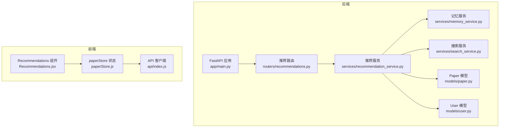
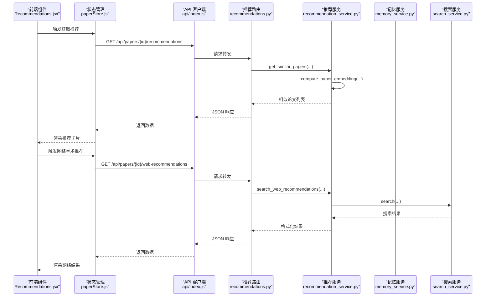
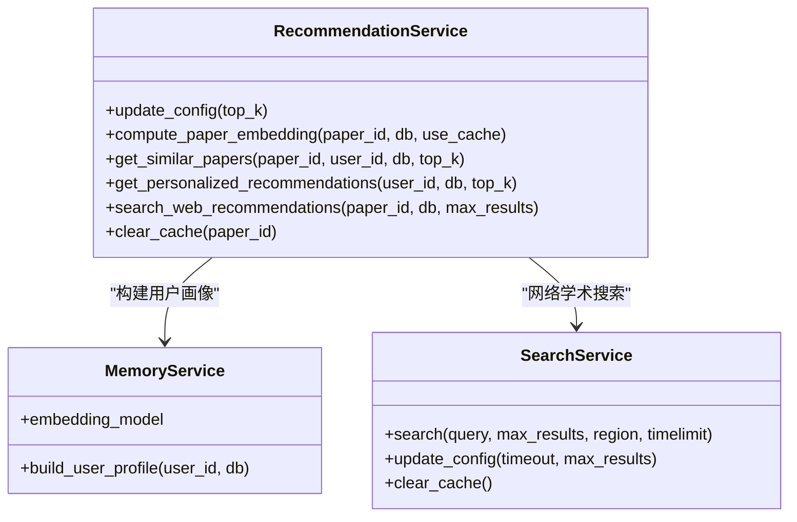
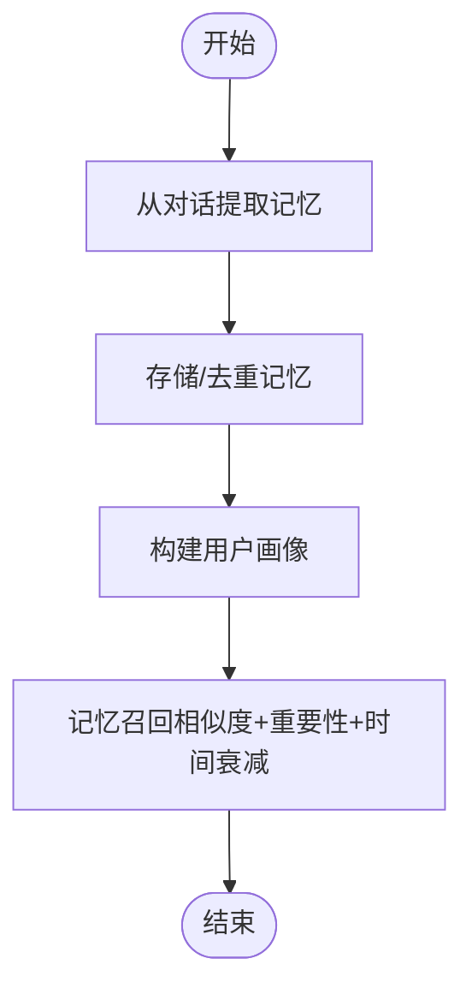
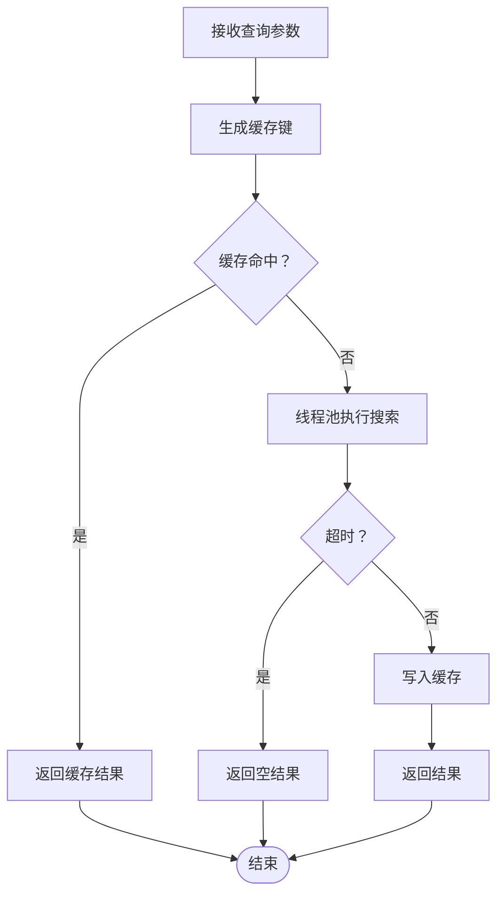
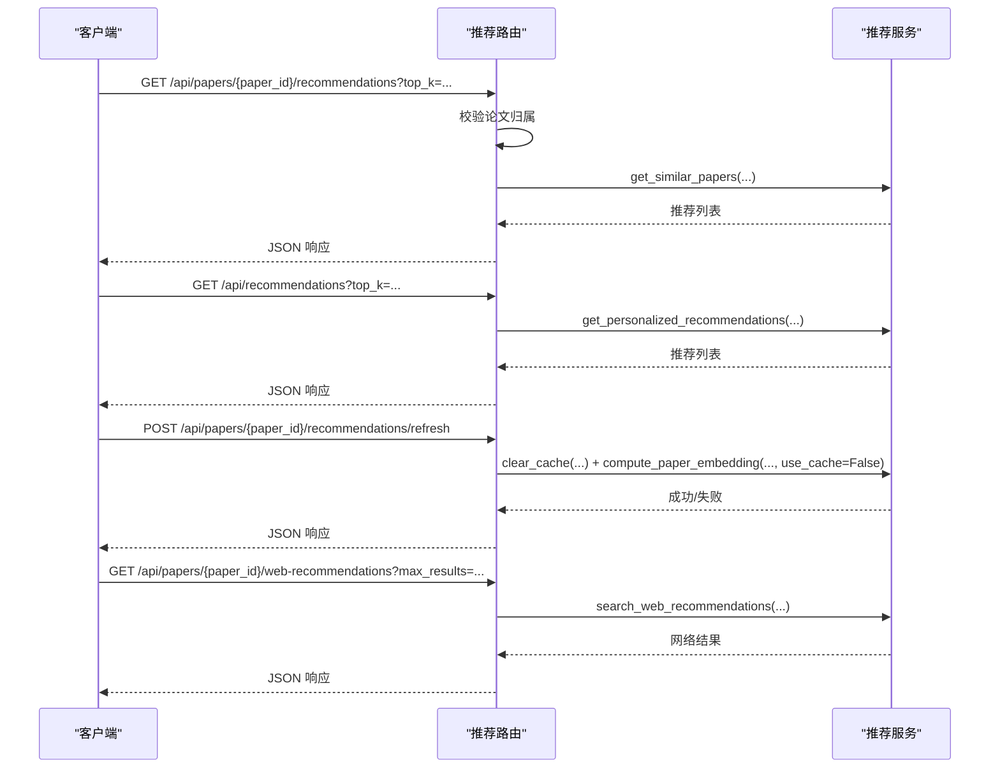
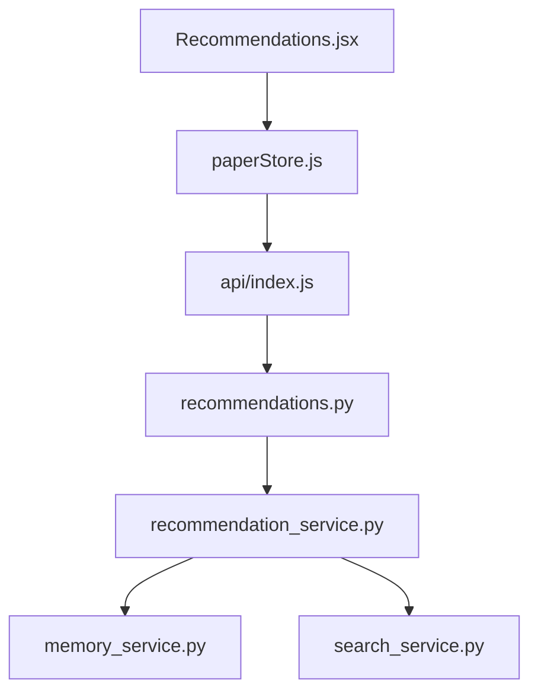
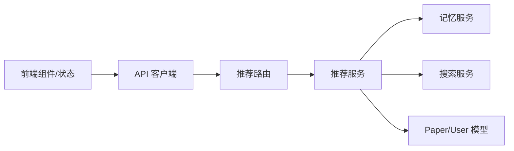

# 推荐系统

<cite>
**本文引用的文件**
- [backend/app/services/recommendation_service.py](file://backend/app/services/recommendation_service.py)
- [backend/app/routers/recommendations.py](file://backend/app/routers/recommendations.py)
- [backend/app/models/paper.py](file://backend/app/models/paper.py)
- [backend/app/models/user.py](file://backend/app/models/user.py)
- [backend/app/services/memory_service.py](file://backend/app/services/memory_service.py)
- [backend/app/services/search_service.py](file://backend/app/services/search_service.py)
- [backend/app/main.py](file://backend/app/main.py)
- [backend/app/config.py](file://backend/app/config.py)
- [frontend/src/components/Recommendations/Recommendations.jsx](file://frontend/src/components/Recommendations/Recommendations.jsx)
- [frontend/src/stores/paperStore.js](file://frontend/src/stores/paperStore.js)
- [frontend/src/api/index.js](file://frontend/src/api/index.js)
</cite>

## 目录
1. [简介](#简介)
2. [项目结构](#项目结构)
3. [核心组件](#核心组件)
4. [架构总览](#架构总览)
5. [详细组件分析](#详细组件分析)
6. [依赖分析](#依赖分析)
7. [性能考虑](#性能考虑)
8. [故障排查指南](#故障排查指南)
9. [结论](#结论)
10. [附录](#附录)

## 简介
本文件面向推荐系统的技术文档，围绕“论文推荐”能力进行深入解析。系统采用内容相似度与用户画像相结合的混合策略，提供三类核心能力：
- 基于内容相似性的论文推荐（余弦相似度）
- 基于用户画像的个性化推荐（阅读状态与时间衰减加权）
- 网络学术文献扩展推荐（arXiv、Google Scholar 等）

同时覆盖实时推荐的缓存与刷新机制、API 接口规范、前端组件集成方式以及推荐质量监控建议。

## 项目结构
推荐系统主要由后端服务层、路由层、模型层与前端组件/状态管理组成：
- 后端
  - 服务层：推荐服务、记忆服务、搜索服务
  - 路由层：推荐相关 API
  - 模型层：Paper、User 等实体
- 前端
  - 组件：Recommendations.jsx 展示推荐卡片
  - 状态：paperStore.js 管理推荐数据与网络搜索结果
  - API：index.js 统一 axios 实例

**图表来源**
- [backend/app/main.py:55-95](file://backend/app/main.py#L55-L95)
- [backend/app/routers/recommendations.py:15](file://backend/app/routers/recommendations.py#L15)
- [backend/app/services/recommendation_service.py:20-565](file://backend/app/services/recommendation_service.py#L20-L565)
- [backend/app/services/memory_service.py:46-438](file://backend/app/services/memory_service.py#L46-L438)
- [backend/app/services/search_service.py:10-113](file://backend/app/services/search_service.py#L10-L113)
- [backend/app/models/paper.py:11-85](file://backend/app/models/paper.py#L11-L85)
- [backend/app/models/user.py:11-36](file://backend/app/models/user.py#L11-L36)
- [frontend/src/components/Recommendations/Recommendations.jsx:1-265](file://frontend/src/components/Recommendations/Recommendations.jsx#L1-L265)
- [frontend/src/stores/paperStore.js:1-357](file://frontend/src/stores/paperStore.js#L1-L357)
- [frontend/src/api/index.js:1-12](file://frontend/src/api/index.js#L1-L12)

**章节来源**
- [backend/app/main.py:55-95](file://backend/app/main.py#L55-L95)
- [backend/app/routers/recommendations.py:15](file://backend/app/routers/recommendations.py#L15)
- [backend/app/services/recommendation_service.py:20-565](file://backend/app/services/recommendation_service.py#L20-L565)
- [backend/app/services/memory_service.py:46-438](file://backend/app/services/memory_service.py#L46-L438)
- [backend/app/services/search_service.py:10-113](file://backend/app/services/search_service.py#L10-L113)
- [backend/app/models/paper.py:11-85](file://backend/app/models/paper.py#L11-L85)
- [backend/app/models/user.py:11-36](file://backend/app/models/user.py#L11-L36)
- [frontend/src/components/Recommendations/Recommendations.jsx:1-265](file://frontend/src/components/Recommendations/Recommendations.jsx#L1-L265)
- [frontend/src/stores/paperStore.js:1-357](file://frontend/src/stores/paperStore.js#L1-L357)
- [frontend/src/api/index.js:1-12](file://frontend/src/api/index.js#L1-L12)

## 核心组件
- 推荐服务（RecommendationService）
  - 内容相似度推荐：基于论文嵌入向量的余弦相似度，返回与当前论文最相似的其他论文
  - 个性化推荐：基于用户画像（研究兴趣、术语使用、背景等）与论文嵌入相似度，结合阅读状态与时间衰减加权
  - 网络学术推荐：基于论文标题在 arXiv、Google Scholar 等站点搜索相关文献
  - 缓存与刷新：论文嵌入向量缓存，支持按论文 ID 清除缓存并重新计算
- 记忆服务（MemoryService）
  - 从对话中抽取用户记忆（研究兴趣、偏好、术语使用、背景），构建用户画像
  - 提供向量嵌入与相似度计算，支持记忆召回与衰减
- 搜索服务（SearchService）
  - 基于 DuckDuckGo 的网络搜索，带缓存与超时控制
- 路由与模型
  - 推荐路由提供相似论文、个性化推荐、刷新缓存、网络学术推荐四个接口
  - Paper、User 模型定义论文与用户属性及关系

**章节来源**
- [backend/app/services/recommendation_service.py:20-565](file://backend/app/services/recommendation_service.py#L20-L565)
- [backend/app/services/memory_service.py:46-438](file://backend/app/services/memory_service.py#L46-L438)
- [backend/app/services/search_service.py:10-113](file://backend/app/services/search_service.py#L10-L113)
- [backend/app/routers/recommendations.py:18-234](file://backend/app/routers/recommendations.py#L18-L234)
- [backend/app/models/paper.py:11-85](file://backend/app/models/paper.py#L11-L85)
- [backend/app/models/user.py:11-36](file://backend/app/models/user.py#L11-L36)

## 架构总览
推荐系统采用“服务-路由-模型”的分层设计，前后端通过 REST API 交互。核心流程如下：
- 前端调用推荐接口，后端通过推荐服务聚合内容相似度与用户画像，返回排序后的论文列表
- 对于网络学术推荐，后端通过搜索服务调用 DuckDuckGo 并分类来源
- 记忆服务负责用户画像构建与向量化，支撑个性化推荐

**图表来源**
- [frontend/src/components/Recommendations/Recommendations.jsx:206-260](file://frontend/src/components/Recommendations/Recommendations.jsx#L206-L260)
- [frontend/src/stores/paperStore.js:206-267](file://frontend/src/stores/paperStore.js#L206-L267)
- [frontend/src/api/index.js:1-12](file://frontend/src/api/index.js#L1-L12)
- [backend/app/routers/recommendations.py:18-234](file://backend/app/routers/recommendations.py#L18-L234)
- [backend/app/services/recommendation_service.py:150-258](file://backend/app/services/recommendation_service.py#L150-L258)
- [backend/app/services/search_service.py:41-103](file://backend/app/services/search_service.py#L41-L103)

## 详细组件分析

### 推荐服务（RecommendationService）
- 设计要点
  - 嵌入向量缓存：以 {paper_id: vector} 形式缓存，减少重复计算
  - 内容相似度：组合论文标题、作者、摘要与前 N 个文本块，经嵌入模型编码后计算余弦相似度
  - 个性化推荐：从记忆服务构建用户画像，对用户所有论文计算相似度，并叠加阅读状态权重与时间衰减
  - 网络学术推荐：基于论文标题构造学术搜索查询，限定 arXiv、Google Scholar 等站点，分类来源并格式化
  - 刷新缓存：支持按论文 ID 清除缓存并强制重新计算嵌入
- 复杂度与性能
  - 相似度计算复杂度 O(N×D)，N 为候选论文数，D 为向量维度；通过缓存显著降低重复计算
  - 个性化推荐额外引入阅读状态与时间衰减权重，排序成本 O(N log N)
- 错误处理
  - 嵌入计算失败、论文不存在、网络搜索异常均进行日志记录与降级处理（返回空或最近论文）

**图表来源**
- [backend/app/services/recommendation_service.py:20-565](file://backend/app/services/recommendation_service.py#L20-L565)
- [backend/app/services/memory_service.py:46-438](file://backend/app/services/memory_service.py#L46-L438)
- [backend/app/services/search_service.py:10-113](file://backend/app/services/search_service.py#L10-L113)

**章节来源**
- [backend/app/services/recommendation_service.py:20-565](file://backend/app/services/recommendation_service.py#L20-L565)

### 记忆服务（MemoryService）
- 设计要点
  - 从对话中抽取用户记忆（研究兴趣、偏好、术语使用、背景），并去重与相似度校验
  - 提供向量嵌入模型懒加载与线程池执行，支持记忆召回与时间衰减
  - 构建用户画像：聚合记忆并按类型组织，作为个性化推荐输入
- 复杂度与性能
  - 向量相似度计算 O(M×D)，M 为记忆条目数；召回排序 O(M log M)
  - 时间衰减指数因子，降低长期未访问记忆的影响

**图表来源**
- [backend/app/services/memory_service.py:83-357](file://backend/app/services/memory_service.py#L83-L357)

**章节来源**
- [backend/app/services/memory_service.py:46-438](file://backend/app/services/memory_service.py#L46-L438)

### 搜索服务（SearchService）
- 设计要点
  - 基于 DuckDuckGo 的异步搜索，支持超时控制与结果缓存
  - 缓存键包含查询、结果数、地区与时限，避免重复请求
- 性能与可靠性
  - 缓存命中直接返回，提升重复查询性能
  - 超时保护与异常捕获，保证接口稳定性

**图表来源**
- [backend/app/services/search_service.py:41-103](file://backend/app/services/search_service.py#L41-L103)

**章节来源**
- [backend/app/services/search_service.py:10-113](file://backend/app/services/search_service.py#L10-L113)

### 推荐路由（RecommendationsRouter）
- 接口概览
  - GET /api/papers/{paper_id}/recommendations：基于内容相似度的论文推荐
  - GET /api/recommendations：基于用户画像的个性化推荐
  - POST /api/papers/{paper_id}/recommendations/refresh：刷新论文推荐缓存
  - GET /api/papers/{paper_id}/web-recommendations：网络学术推荐
- 参数与约束
  - top_k/max_results：1~20 的整数范围
  - 权限校验：仅允许当前用户访问其论文相关的推荐
- 性能说明
  - 路由层提供性能提示，便于前端与运维参考

**图表来源**
- [backend/app/routers/recommendations.py:18-234](file://backend/app/routers/recommendations.py#L18-L234)
- [backend/app/services/recommendation_service.py:150-258](file://backend/app/services/recommendation_service.py#L150-L258)

**章节来源**
- [backend/app/routers/recommendations.py:18-234](file://backend/app/routers/recommendations.py#L18-L234)

### 前端组件与状态管理
- Recommendations 组件
  - 支持水平/垂直布局、可折叠、刷新按钮、空状态与加载态
  - 渲染相似度徽章、匹配原因标签、阅读状态徽章与元信息
  - 可选展示网络学术推荐区域，支持一键触发搜索
- paperStore 状态
  - 提供 fetchRecommendations、fetchPersonalRecommendations、fetchWebRecommendations 等方法
  - 管理推荐数据、网络推荐数据与加载状态
- API 客户端
  - axios 实例统一配置 baseURL=/api，简化后端交互

**图表来源**
- [frontend/src/components/Recommendations/Recommendations.jsx:28-265](file://frontend/src/components/Recommendations/Recommendations.jsx#L28-L265)
- [frontend/src/stores/paperStore.js:206-267](file://frontend/src/stores/paperStore.js#L206-L267)
- [frontend/src/api/index.js:1-12](file://frontend/src/api/index.js#L1-L12)
- [backend/app/routers/recommendations.py:18-234](file://backend/app/routers/recommendations.py#L18-L234)
- [backend/app/services/recommendation_service.py:150-258](file://backend/app/services/recommendation_service.py#L150-L258)

**章节来源**
- [frontend/src/components/Recommendations/Recommendations.jsx:1-265](file://frontend/src/components/Recommendations/Recommendations.jsx#L1-L265)
- [frontend/src/stores/paperStore.js:1-357](file://frontend/src/stores/paperStore.js#L1-L357)
- [frontend/src/api/index.js:1-12](file://frontend/src/api/index.js#L1-L12)

## 依赖分析
- 组件耦合
  - RecommendationService 依赖 MemoryService（用户画像）与 SearchService（网络搜索）
  - 路由层依赖 RecommendationService 提供业务能力
  - 前端组件依赖状态管理，状态管理依赖 API 客户端
- 外部依赖
  - 向量模型：SentenceTransformer（由 MemoryService 懒加载）
  - 搜索引擎：DuckDuckGo（由 SearchService 封装）
  - 数据库：SQLAlchemy ORM（Paper、User 模型）

**图表来源**
- [backend/app/services/recommendation_service.py:20-565](file://backend/app/services/recommendation_service.py#L20-L565)
- [backend/app/services/memory_service.py:46-438](file://backend/app/services/memory_service.py#L46-L438)
- [backend/app/services/search_service.py:10-113](file://backend/app/services/search_service.py#L10-L113)
- [backend/app/models/paper.py:11-85](file://backend/app/models/paper.py#L11-L85)
- [backend/app/models/user.py:11-36](file://backend/app/models/user.py#L11-L36)
- [frontend/src/components/Recommendations/Recommendations.jsx:1-265](file://frontend/src/components/Recommendations/Recommendations.jsx#L1-L265)
- [frontend/src/stores/paperStore.js:1-357](file://frontend/src/stores/paperStore.js#L1-L357)
- [frontend/src/api/index.js:1-12](file://frontend/src/api/index.js#L1-L12)

**章节来源**
- [backend/app/services/recommendation_service.py:20-565](file://backend/app/services/recommendation_service.py#L20-L565)
- [backend/app/services/memory_service.py:46-438](file://backend/app/services/memory_service.py#L46-L438)
- [backend/app/services/search_service.py:10-113](file://backend/app/services/search_service.py#L10-L113)
- [backend/app/models/paper.py:11-85](file://backend/app/models/paper.py#L11-L85)
- [backend/app/models/user.py:11-36](file://backend/app/models/user.py#L11-L36)
- [frontend/src/components/Recommendations/Recommendations.jsx:1-265](file://frontend/src/components/Recommendations/Recommendations.jsx#L1-L265)
- [frontend/src/stores/paperStore.js:1-357](file://frontend/src/stores/paperStore.js#L1-L357)
- [frontend/src/api/index.js:1-12](file://frontend/src/api/index.js#L1-L12)

## 性能考虑
- 嵌入向量缓存
  - RecommendationService 内置内存缓存，首次计算约 100–200ms/篇，后续查询极快
  - 支持按论文 ID 清除缓存并强制重新计算，适合论文内容更新后刷新
- 相似度计算
  - 相似度计算复杂度 O(N×D)，建议控制 top_k 与候选集规模
  - 个性化推荐增加排序成本，建议在用户论文量适中时启用
- 网络搜索
  - 搜索服务带超时与缓存，默认超时 15 秒，避免阻塞
  - 建议限制 max_results，控制下游渲染压力
- 模型加载
  - MemoryService 懒加载向量模型，首次加载可能耗时，建议在应用启动时预热或延迟到首次使用

[本节为通用性能建议，不直接分析特定文件，故不附加“章节来源”]

## 故障排查指南
- 常见问题
  - 嵌入计算失败：检查论文文本长度与可用性，必要时调用刷新缓存接口
  - 论文不存在或非当前用户：确认权限校验与论文归属
  - 网络搜索失败：检查网络连通性与超时设置，查看日志
  - 个性化推荐为空：确认用户画像是否存在，若无则回退为最近上传论文
- 排查步骤
  - 后端日志：关注推荐服务与搜索服务的异常打印
  - 前端状态：确认 store 中 loading、error 字段与 UI 显示一致
  - 接口响应：核对路由层返回的 JSON 结构与字段
- 建议
  - 对于大规模论文集合，建议在数据库层面增加索引（如 Paper.user_id、Paper.reading_status）
  - 对于频繁刷新场景，建议在路由层增加速率限制

**章节来源**
- [backend/app/services/recommendation_service.py:126-128](file://backend/app/services/recommendation_service.py#L126-L128)
- [backend/app/routers/recommendations.py:57-61](file://backend/app/routers/recommendations.py#L57-L61)
- [backend/app/services/search_service.py:98-103](file://backend/app/services/search_service.py#L98-L103)

## 结论
本推荐系统以“内容相似度 + 用户画像”的混合策略为核心，结合嵌入向量缓存与网络搜索扩展，形成从“已读论文”到“潜在相关文献”的完整推荐链路。通过清晰的服务-路由-模型分层与前端状态管理，系统具备良好的可维护性与扩展性。建议在生产环境中进一步完善评估指标与 A/B 测试框架，持续优化排序与权重策略。

[本节为总结性内容，不直接分析特定文件，故不附加“章节来源”]

## 附录

### API 接口文档
- 获取相似论文推荐
  - 方法与路径：GET /api/papers/{paper_id}/recommendations
  - 查询参数：
    - top_k：整数，1~20，默认 5
  - 返回字段：
    - source_paper_id：源论文 ID
    - total：推荐数量
    - recommendations：推荐论文列表（含相似度、摘要预览、阅读状态等）
  - 性能提示：首次计算嵌入约 100–200ms/篇，结果会被缓存
- 获取个性化推荐
  - 方法与路径：GET /api/recommendations
  - 查询参数：
    - top_k：整数，1~20，默认 5
  - 返回字段：
    - total：推荐数量
    - has_profile：是否存在用户画像
    - recommendations：个性化推荐论文列表（含匹配原因等）
  - 性能提示：依赖用户画像构建（约 300ms），嵌入计算约 100–200ms/篇
- 刷新论文推荐缓存
  - 方法与路径：POST /api/papers/{paper_id}/recommendations/refresh
  - 返回字段：
    - success：布尔值
    - message：状态信息
    - paper_id：论文 ID
- 获取网络学术推荐
  - 方法与路径：GET /api/papers/{paper_id}/web-recommendations
  - 查询参数：
    - max_results：整数，1~20，默认 8
  - 返回字段：
    - results：网络学术文献列表（标题、链接、摘要、来源）
    - total：结果数量
  - 性能提示：网络搜索约 3–5 秒延迟，结果被缓存以优化重复查询

**章节来源**
- [backend/app/routers/recommendations.py:18-234](file://backend/app/routers/recommendations.py#L18-L234)

### 前端组件集成示例
- Recommendations 组件
  - 属性：papers、layout、loading、collapsible、defaultCollapsed、onRefresh、emptyText、paperId、showWebRecommendations
  - 行为：渲染推荐卡片、相似度徽章、匹配原因、阅读状态、元信息；可选展示网络学术推荐区域
- paperStore 状态
  - 方法：fetchRecommendations、fetchPersonalRecommendations、fetchWebRecommendations、clearRecommendations、clearWebRecommendations
  - 状态：recommendations、personalRecommendations、webRecommendations、loading 等
- API 客户端
  - axios 实例，baseURL=/api，统一处理请求与响应

**章节来源**
- [frontend/src/components/Recommendations/Recommendations.jsx:28-265](file://frontend/src/components/Recommendations/Recommendations.jsx#L28-L265)
- [frontend/src/stores/paperStore.js:206-267](file://frontend/src/stores/paperStore.js#L206-L267)
- [frontend/src/api/index.js:1-12](file://frontend/src/api/index.js#L1-L12)

### 推荐效果评估与 A/B 测试框架建议
- 评估指标
  - 点击率（CTR）：推荐论文被打开的比例
  - 阅读完成率：推荐论文从“未读”到“已完成”的比例
  - 相似度一致性：推荐论文与源论文的相似度分布
  - 多样性：不同类别的论文占比，避免过度集中
- A/B 测试
  - 分组策略：随机分配用户至不同推荐策略（内容相似度 vs 个性化 vs 混合）
  - 指标收集：埋点记录点击、打开、阅读时长、完成等行为
  - 统计显著性：确保样本量足够，使用合适的统计检验
- 监控与告警
  - 嵌入计算失败率、搜索超时率、响应延迟分位数
  - 推荐列表为空率、用户反馈（点赞/踩）与差评原因

[本节为通用评估与测试建议，不直接分析特定文件，故不附加“章节来源”]