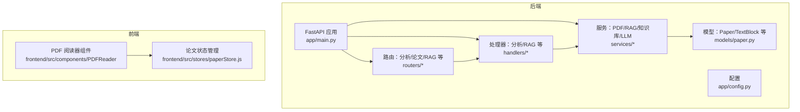
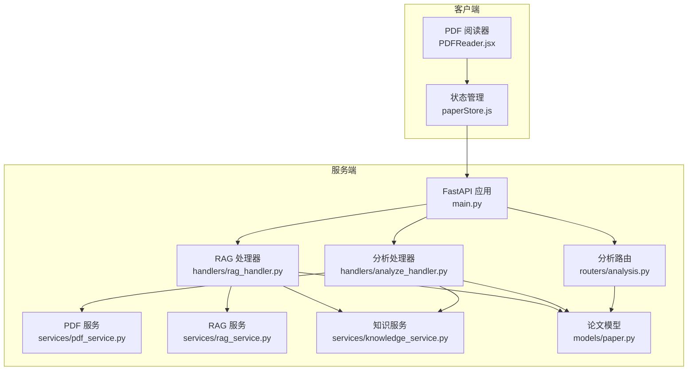
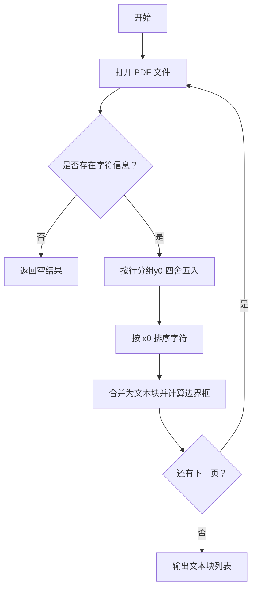
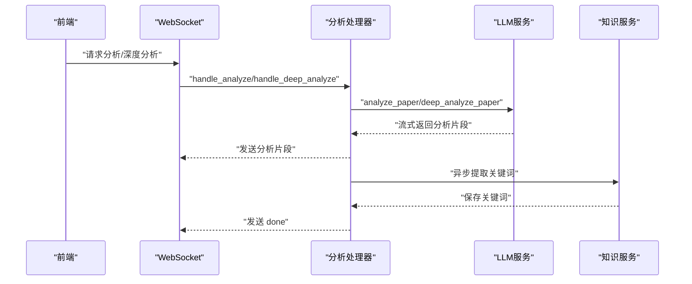
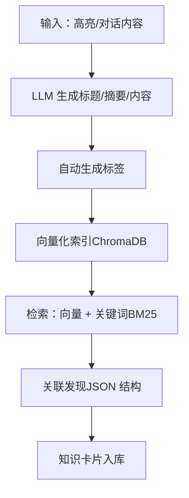
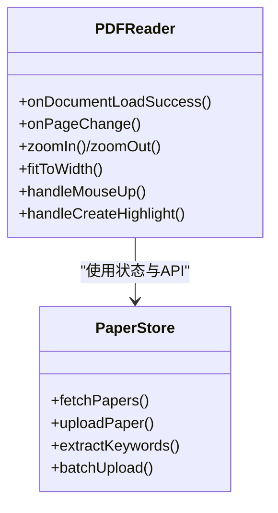
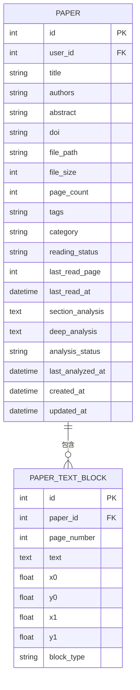
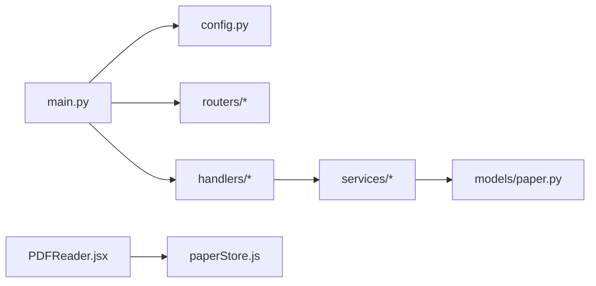

# 智能分析系统

<cite>
**本文引用的文件**
- [backend/app/main.py](file://backend/app/main.py)
- [backend/app/config.py](file://backend/app/config.py)
- [backend/app/routers/analysis.py](file://backend/app/routers/analysis.py)
- [backend/app/handlers/analyze_handler.py](file://backend/app/handlers/analyze_handler.py)
- [backend/app/handlers/rag_handler.py](file://backend/app/handlers/rag_handler.py)
- [backend/app/services/pdf_service.py](file://backend/app/services/pdf_service.py)
- [backend/app/models/paper.py](file://backend/app/models/paper.py)
- [backend/app/schemas/paper.py](file://backend/app/schemas/paper.py)
- [backend/app/services/knowledge_service.py](file://backend/app/services/knowledge_service.py)
- [backend/app/services/rag_service.py](file://backend/app/services/rag_service.py)
- [backend/app/services/llm_service.py](file://backend/app/services/llm_service.py)
- [frontend/src/components/PDFReader/PDFReader.jsx](file://frontend/src/components/PDFReader/PDFReader.jsx)
- [frontend/src/stores/paperStore.js](file://frontend/src/stores/paperStore.js)
</cite>

## 目录
1. [简介](#简介)
2. [项目结构](#项目结构)
3. [核心组件](#核心组件)
4. [架构总览](#架构总览)
5. [详细组件分析](#详细组件分析)
6. [依赖关系分析](#依赖关系分析)
7. [性能考量](#性能考量)
8. [故障排查指南](#故障排查指南)
9. [结论](#结论)
10. [附录](#附录)

## 简介
本项目是一个面向学术论文的智能分析系统，提供论文上传、解析、结构化解析、深度分析、关键词与实体抽取、知识图谱构建、RAG检索增强问答、以及前端可视化阅读与交互能力。系统采用前后端分离架构：后端基于 FastAPI + SQLAlchemy + LangChain/LLM + ChromaDB 向量库；前端基于 React + Zustand 状态管理与 react-pdf 进行 PDF 阅读器渲染。

## 项目结构
后端模块按职责划分：
- 应用入口与配置：app/main.py、app/config.py
- 路由与处理器：routers/*、handlers/*
- 业务服务：services/*（PDF解析、RAG检索、知识库、LLM兼容层）
- 数据模型：models/paper.py
- 前端工程：frontend/src 下的组件、页面、store、API封装

**图表来源**
- [backend/app/main.py:1-114](file://backend/app/main.py#L1-L114)
- [backend/app/config.py:1-44](file://backend/app/config.py#L1-L44)
- [backend/app/routers/analysis.py:1-214](file://backend/app/routers/analysis.py#L1-L214)
- [backend/app/handlers/analyze_handler.py:1-87](file://backend/app/handlers/analyze_handler.py#L1-L87)
- [backend/app/handlers/rag_handler.py:1-217](file://backend/app/handlers/rag_handler.py#L1-L217)
- [backend/app/services/pdf_service.py:1-194](file://backend/app/services/pdf_service.py#L1-L194)
- [backend/app/models/paper.py:1-85](file://backend/app/models/paper.py#L1-L85)
- [frontend/src/components/PDFReader/PDFReader.jsx:1-656](file://frontend/src/components/PDFReader/PDFReader.jsx#L1-L656)
- [frontend/src/stores/paperStore.js:1-357](file://frontend/src/stores/paperStore.js#L1-L357)

**章节来源**
- [backend/app/main.py:55-95](file://backend/app/main.py#L55-L95)
- [backend/app/config.py:15-44](file://backend/app/config.py#L15-L44)

## 核心组件
- 应用入口与生命周期：创建 FastAPI 实例、注册中间件与路由、数据库初始化与关闭。
- 配置中心：统一管理应用名称、调试模式、数据库连接、DeepSeek API密钥、JWT、CORS、上传目录与大小限制等。
- PDF 解析服务：提取元数据、文本块、全文、页数校验与有效性验证。
- 论文模型：Paper 与 PaperTextBlock 表结构，包含分析缓存字段与关系映射。
- 分析路由：对比分析、文献综述生成，支持流式返回（SSE）。
- 分析处理器：章节概述与深度分析的异步处理、WebSocket 通信、关键词异步提取。
- RAG 服务：智能分块、向量化、ChromaDB 持久化、语义检索 + BM25 混合检索、RRF 融合排序。
- 知识服务：从高亮/对话提取知识卡片、自动生成标签、关联发现、向量索引、检索与统计。
- 前端 PDF 阅读器：单页/滚动模式、缩放、页码导航、文本选择与高亮、术语解释/摘要/翻译、阅读辅助面板。
- 前端论文状态：上传、列表、详情、推荐、关键词提取、批量导入等。

**章节来源**
- [backend/app/main.py:16-52](file://backend/app/main.py#L16-L52)
- [backend/app/config.py:15-44](file://backend/app/config.py#L15-L44)
- [backend/app/services/pdf_service.py:11-194](file://backend/app/services/pdf_service.py#L11-L194)
- [backend/app/models/paper.py:11-85](file://backend/app/models/paper.py#L11-L85)
- [backend/app/routers/analysis.py:28-214](file://backend/app/routers/analysis.py#L28-L214)
- [backend/app/handlers/analyze_handler.py:13-87](file://backend/app/handlers/analyze_handler.py#L13-L87)
- [backend/app/services/rag_service.py:16-400](file://backend/app/services/rag_service.py#L16-L400)
- [backend/app/services/knowledge_service.py:79-662](file://backend/app/services/knowledge_service.py#L79-L662)
- [frontend/src/components/PDFReader/PDFReader.jsx:13-656](file://frontend/src/components/PDFReader/PDFReader.jsx#L13-L656)
- [frontend/src/stores/paperStore.js:4-357](file://frontend/src/stores/paperStore.js#L4-L357)

## 架构总览
系统采用“后端API + 前端组件”的分层架构。后端通过 FastAPI 提供 REST API 与 WebSocket，负责论文解析、LLM 分析、RAG 检索与知识图谱管理；前端通过组件化方式实现 PDF 阅读、高亮、笔记、聊天与知识卡片展示。

**图表来源**
- [backend/app/main.py:55-95](file://backend/app/main.py#L55-L95)
- [backend/app/routers/analysis.py:20-214](file://backend/app/routers/analysis.py#L20-L214)
- [backend/app/handlers/analyze_handler.py:13-87](file://backend/app/handlers/analyze_handler.py#L13-L87)
- [backend/app/handlers/rag_handler.py:29-217](file://backend/app/handlers/rag_handler.py#L29-L217)
- [backend/app/services/pdf_service.py:11-194](file://backend/app/services/pdf_service.py#L11-L194)
- [backend/app/services/rag_service.py:16-400](file://backend/app/services/rag_service.py#L16-L400)
- [backend/app/services/knowledge_service.py:79-662](file://backend/app/services/knowledge_service.py#L79-L662)
- [backend/app/models/paper.py:11-85](file://backend/app/models/paper.py#L11-L85)
- [frontend/src/components/PDFReader/PDFReader.jsx:13-656](file://frontend/src/components/PDFReader/PDFReader.jsx#L13-L656)
- [frontend/src/stores/paperStore.js:4-357](file://frontend/src/stores/paperStore.js#L4-L357)

## 详细组件分析

### 论文结构化解析与文本块提取
- PDF 元数据提取：标题、页数、作者，若 PDF 元数据缺失则从第一页文本推断标题。
- 文本块提取：按字符级别提取，按行（y0 坐标四舍五入到小数点后一位）聚合，再按 x0 排序合并为文本块，记录页码与边界框。
- 全文提取：按页拼接文本，用于 LLM 分析。
- 页数与有效性校验：通过 pdfplumber 打开并统计页数，同时校验文件头与扩展名。

**图表来源**
- [backend/app/services/pdf_service.py:58-118](file://backend/app/services/pdf_service.py#L58-L118)

**章节来源**
- [backend/app/services/pdf_service.py:14-194](file://backend/app/services/pdf_service.py#L14-L194)

### 深度分析报告生成流程（LLM 驱动）
- 章节概述与深度分析：通过分析处理器异步调用 LLM，流式返回分析片段；完成后保存章节概述与深度分析缓存；随后异步触发关键词提取。
- 对比分析与文献综述：分析路由从数据库读取论文文本块，按长度截断至合理范围，构造请求体，调用 LLM 服务生成对比/综述，使用 SSE 流式返回。
- RAG 增强问答：处理器组装检索上下文（论文 + 网络搜索），构建消息历史，流式获取 LLM 回复并推送引用来源。

**图表来源**
- [backend/app/handlers/analyze_handler.py:13-87](file://backend/app/handlers/analyze_handler.py#L13-L87)
- [backend/app/routers/analysis.py:88-214](file://backend/app/routers/analysis.py#L88-L214)
- [backend/app/handlers/rag_handler.py:29-217](file://backend/app/handlers/rag_handler.py#L29-L217)

**章节来源**
- [backend/app/handlers/analyze_handler.py:13-87](file://backend/app/handlers/analyze_handler.py#L13-L87)
- [backend/app/routers/analysis.py:28-214](file://backend/app/routers/analysis.py#L28-L214)
- [backend/app/handlers/rag_handler.py:29-217](file://backend/app/handlers/rag_handler.py#L29-L217)

### 关键词提取与实体识别（命名实体识别、术语标准化、语义聚类）
- 自动标签生成：基于 LLM Prompt 生成 3-5 个标签，过滤编号与宽泛术语，限制长度。
- 关联发现：比较新知识与现有卡片摘要，返回 JSON 数组的关联类型、描述与置信度。
- 向量索引与检索：将知识卡片（标题+内容+标签）向量化存入 ChromaDB，支持向量检索与关键词检索融合，按分数排序。
- 术语标准化与语义聚类：通过嵌入模型对术语进行向量化，结合 BM25 与 RAG 检索实现术语级聚类与相似度排序。

**图表来源**
- [backend/app/services/knowledge_service.py:82-349](file://backend/app/services/knowledge_service.py#L82-L349)
- [backend/app/services/rag_service.py:183-306](file://backend/app/services/rag_service.py#L183-L306)

**章节来源**
- [backend/app/services/knowledge_service.py:79-662](file://backend/app/services/knowledge_service.py#L79-L662)
- [backend/app/services/rag_service.py:16-400](file://backend/app/services/rag_service.py#L16-L400)

### 分析结果可视化与交互
- PDF 阅读器：支持单页/滚动模式、缩放、页码导航、文本选择与高亮、术语解释/摘要/翻译、阅读辅助面板。
- 状态管理：Zustand store 管理论文列表、详情、上传、推荐、关键词提取、批量导入等状态与 API 调用。
- 前端组件：PDFReader.jsx 负责渲染与交互；paperStore.js 提供统一的数据获取与更新逻辑。

**图表来源**
- [frontend/src/components/PDFReader/PDFReader.jsx:13-656](file://frontend/src/components/PDFReader/PDFReader.jsx#L13-L656)
- [frontend/src/stores/paperStore.js:4-357](file://frontend/src/stores/paperStore.js#L4-L357)

**章节来源**
- [frontend/src/components/PDFReader/PDFReader.jsx:13-656](file://frontend/src/components/PDFReader/PDFReader.jsx#L13-L656)
- [frontend/src/stores/paperStore.js:4-357](file://frontend/src/stores/paperStore.js#L4-L357)

### 数据模型与关系
- Paper：论文基本信息、分析缓存字段、阅读状态与时间、与用户及文本块/高亮/笔记/知识卡的关系。
- PaperTextBlock：存储解析后的文本块，包含页码、坐标与文本。

**图表来源**
- [backend/app/models/paper.py:11-85](file://backend/app/models/paper.py#L11-L85)

**章节来源**
- [backend/app/models/paper.py:11-85](file://backend/app/models/paper.py#L11-L85)

## 依赖关系分析
- 应用入口依赖配置、数据库初始化、中间件与路由注册。
- 分析路由依赖数据库查询、LLM 服务与用户认证。
- 分析/问答处理器依赖 LLM 服务、RAG 服务、知识服务与会话/消息服务。
- PDF 服务与 RAG 服务分别依赖外部库（pdfplumber、ChromaDB、SentenceTransformer、rank_bm25）。
- 前端组件依赖 react-pdf、Zustand 与后端 API。

**图表来源**
- [backend/app/main.py:55-95](file://backend/app/main.py#L55-L95)
- [backend/app/config.py:15-44](file://backend/app/config.py#L15-L44)
- [backend/app/routers/analysis.py:20-214](file://backend/app/routers/analysis.py#L20-L214)
- [backend/app/handlers/analyze_handler.py:13-87](file://backend/app/handlers/analyze_handler.py#L13-L87)
- [backend/app/handlers/rag_handler.py:29-217](file://backend/app/handlers/rag_handler.py#L29-L217)
- [backend/app/services/pdf_service.py:11-194](file://backend/app/services/pdf_service.py#L11-L194)
- [backend/app/services/rag_service.py:16-400](file://backend/app/services/rag_service.py#L16-L400)
- [backend/app/models/paper.py:11-85](file://backend/app/models/paper.py#L11-L85)
- [frontend/src/components/PDFReader/PDFReader.jsx:13-656](file://frontend/src/components/PDFReader/PDFReader.jsx#L13-L656)
- [frontend/src/stores/paperStore.js:4-357](file://frontend/src/stores/paperStore.js#L4-L357)

**章节来源**
- [backend/app/main.py:55-95](file://backend/app/main.py#L55-L95)
- [backend/app/routers/analysis.py:20-214](file://backend/app/routers/analysis.py#L20-L214)
- [backend/app/handlers/analyze_handler.py:13-87](file://backend/app/handlers/analyze_handler.py#L13-L87)
- [backend/app/handlers/rag_handler.py:29-217](file://backend/app/handlers/rag_handler.py#L29-L217)
- [backend/app/services/pdf_service.py:11-194](file://backend/app/services/pdf_service.py#L11-L194)
- [backend/app/services/rag_service.py:16-400](file://backend/app/services/rag_service.py#L16-L400)
- [backend/app/models/paper.py:11-85](file://backend/app/models/paper.py#L11-L85)
- [frontend/src/components/PDFReader/PDFReader.jsx:13-656](file://frontend/src/components/PDFReader/PDFReader.jsx#L13-L656)
- [frontend/src/stores/paperStore.js:4-357](file://frontend/src/stores/paperStore.js#L4-L357)

## 性能考量
- 检索性能：RAG 服务采用语义检索 + BM25 混合检索，使用 RRF 融合算法提升召回质量；BM25 索引缓存避免重复构建；线程池执行嵌入模型编码，避免阻塞事件循环。
- 分块策略：智能分块按自然边界与页码组织，块大小与重叠可配置，兼顾上下文完整性与检索效率。
- 流式传输：分析与问答均采用 SSE 流式返回，降低前端等待时间，提升交互体验。
- 模型懒加载：Embedding 模型按需加载，首次加载后缓存，减少启动时延。
- 前端懒加载：滚动模式下使用 IntersectionObserver 预加载相邻页面，减少滚动抖动与渲染压力。

**章节来源**
- [backend/app/services/rag_service.py:233-306](file://backend/app/services/rag_service.py#L233-L306)
- [backend/app/services/rag_service.py:102-161](file://backend/app/services/rag_service.py#L102-L161)
- [backend/app/services/rag_service.py:75-93](file://backend/app/services/rag_service.py#L75-L93)
- [frontend/src/components/PDFReader/PDFReader.jsx:315-362](file://frontend/src/components/PDFReader/PDFReader.jsx#L315-L362)

## 故障排查指南
- 健康检查：后端提供 /api/health 接口，确认应用与数据库连接状态。
- PDF 解析失败：检查文件扩展名与文件头，确认 pdfplumber 可正常打开；查看日志定位具体异常。
- 分析/问答无结果：确认论文是否已完成文本块解析与向量索引；若无索引，处理器会提示重建索引；检查 RAG 服务索引状态。
- 关键词/标签异常：检查 LLM Prompt 与响应解析逻辑，必要时降级为简单生成策略。
- 前端 PDF 加载失败：检查 PDF.js Worker 配置与文件源；确认浏览器兼容性与网络状况。

**章节来源**
- [backend/app/main.py:102-114](file://backend/app/main.py#L102-L114)
- [backend/app/services/pdf_service.py:163-190](file://backend/app/services/pdf_service.py#L163-L190)
- [backend/app/handlers/rag_handler.py:48-90](file://backend/app/handlers/rag_handler.py#L48-L90)
- [backend/app/services/knowledge_service.py:118-138](file://backend/app/services/knowledge_service.py#L118-L138)

## 结论
本系统通过 PDF 结构化解析、LLM 驱动的深度分析、RAG 检索增强问答与知识图谱构建，实现了从论文理解到知识沉淀的闭环。前端 PDF 阅读器与交互组件提升了用户体验。整体架构清晰、模块职责明确，具备良好的扩展性与性能表现。

## 附录

### API 接口文档（摘要）
- 健康检查
  - 方法：GET
  - 路径：/api/health
  - 响应：应用状态信息
- 论文分析
  - 对比分析（流式）
    - 方法：POST
    - 路径：/api/analysis/compare
    - 请求体：paper_ids（2-10）
    - 响应：SSE 流，逐行 JSON，最后发送 done 标记
  - 文献综述（流式）
    - 方法：POST
    - 路径：/api/analysis/review
    - 请求体：paper_ids（2-10）
    - 响应：SSE 流，Markdown 格式综述
- 关键词提取（手动）
  - 方法：POST
  - 路径：/papers/{paper_id}/extract-keywords
  - 响应：关键词数组（更新论文 tags）

**章节来源**
- [backend/app/main.py:102-114](file://backend/app/main.py#L102-L114)
- [backend/app/routers/analysis.py:88-214](file://backend/app/routers/analysis.py#L88-L214)

### 前端组件集成示例（概念性）
- PDF 阅读器
  - 组件：PDFReader.jsx
  - 功能：单页/滚动模式、缩放、页码导航、文本选择与高亮、术语解释/摘要/翻译、阅读辅助面板
  - 状态：paperStore.js 管理论文列表、详情、上传、推荐、关键词提取、批量导入
- 集成建议
  - 在页面中引入 PDFReader 并传入文件与回调（onCreateHighlight/onTextSelected 等）
  - 使用 paperStore.js 的 uploadPaper/fetchPapers 等方法与后端交互
  - 在分析完成后通过 WebSocket 接收流式结果并更新界面

**章节来源**
- [frontend/src/components/PDFReader/PDFReader.jsx:13-656](file://frontend/src/components/PDFReader/PDFReader.jsx#L13-L656)
- [frontend/src/stores/paperStore.js:4-357](file://frontend/src/stores/paperStore.js#L4-L357)