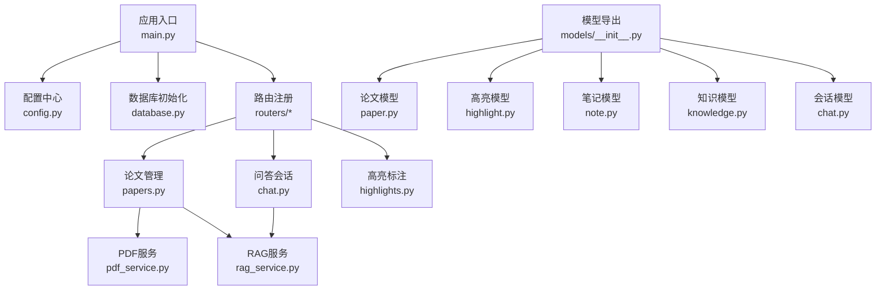
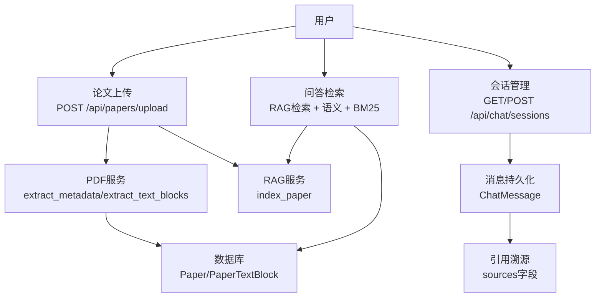
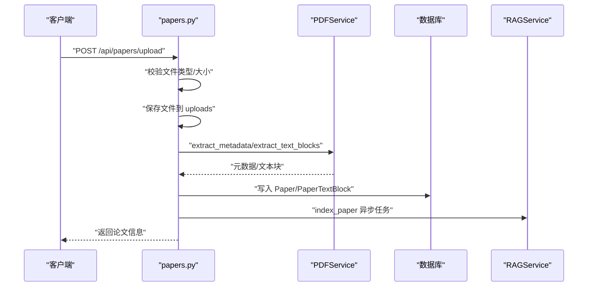
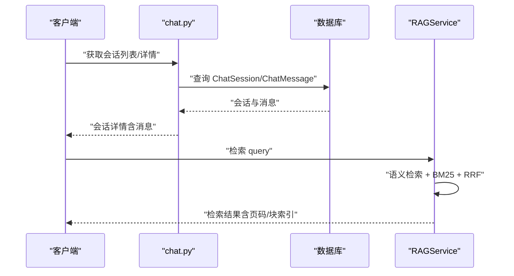
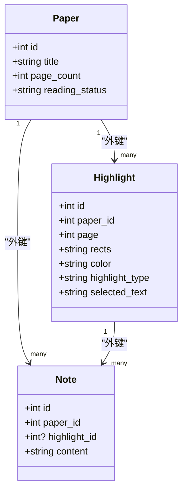
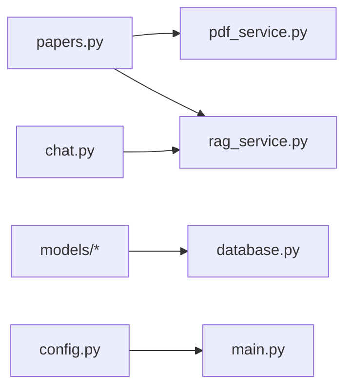

# 核心功能详解

<cite>
**本文档引用的文件**
- [backend/app/main.py](file://backend/app/main.py)
- [backend/app/config.py](file://backend/app/config.py)
- [backend/app/database.py](file://backend/app/database.py)
- [backend/app/models/__init__.py](file://backend/app/models/__init__.py)
- [backend/app/schemas/__init__.py](file://backend/app/schemas/__init__.py)
- [backend/app/models/paper.py](file://backend/app/models/paper.py)
- [backend/app/models/highlight.py](file://backend/app/models/highlight.py)
- [backend/app/models/note.py](file://backend/app/models/note.py)
- [backend/app/models/knowledge.py](file://backend/app/models/knowledge.py)
- [backend/app/models/chat.py](file://backend/app/models/chat.py)
- [backend/app/services/pdf_service.py](file://backend/app/services/pdf_service.py)
- [backend/app/services/rag_service.py](file://backend/app/services/rag_service.py)
- [backend/app/routers/papers.py](file://backend/app/routers/papers.py)
- [backend/app/routers/chat.py](file://backend/app/routers/chat.py)
- [backend/app/routers/highlights.py](file://backend/app/routers/highlights.py)
</cite>

## 目录
1. [简介](#简介)
2. [项目结构](#项目结构)
3. [核心组件](#核心组件)
4. [架构总览](#架构总览)
5. [详细组件分析](#详细组件分析)
6. [依赖分析](#依赖分析)
7. [性能考虑](#性能考虑)
8. [故障排查指南](#故障排查指南)
9. [结论](#结论)
10. [附录](#附录)

## 简介
本文件面向 PaperChat 的核心功能，围绕论文管理、智能分析、问答系统、阅读辅助、知识管理与写作辅助六大模块进行系统化技术说明。文档以“可读性强、循序渐进”的方式组织，既覆盖代码级实现细节，也提供高层架构视图与实践建议，帮助开发者与产品人员快速理解并高效使用系统。

## 项目结构
后端采用 FastAPI + SQLAlchemy 异步 ORM + ChromaDB 向量检索的分层架构：
- 应用入口与生命周期：应用初始化、CORS、路由注册、健康检查
- 配置中心：数据库、上传、鉴权、调试等配置项
- 数据层：声明式模型与异步会话管理
- 业务层：PDF 解析、RAG 检索、会话与消息管理、高亮与笔记、知识卡片
- 接口层：按功能划分的路由模块，统一暴露 REST API



图表来源
- [backend/app/main.py:55-95](file://backend/app/main.py#L55-L95)
- [backend/app/config.py:15-44](file://backend/app/config.py#L15-L44)
- [backend/app/database.py:13-57](file://backend/app/database.py#L13-L57)
- [backend/app/routers/papers.py:30](file://backend/app/routers/papers.py#L30)
- [backend/app/routers/chat.py:18](file://backend/app/routers/chat.py#L18)
- [backend/app/routers/highlights.py:17](file://backend/app/routers/highlights.py#L17)
- [backend/app/services/pdf_service.py:11](file://backend/app/services/pdf_service.py#L11)
- [backend/app/services/rag_service.py:16](file://backend/app/services/rag_service.py#L16)
- [backend/app/models/__init__.py:5-29](file://backend/app/models/__init__.py#L5-L29)

章节来源
- [backend/app/main.py:55-95](file://backend/app/main.py#L55-L95)
- [backend/app/config.py:15-44](file://backend/app/config.py#L15-L44)
- [backend/app/database.py:13-57](file://backend/app/database.py#L13-L57)

## 核心组件
- 论文管理：上传、元数据提取、文本块存储、全文检索、批量导入、文件下载
- 智能分析：论文结构化解析、深度分析缓存、关键词与摘要生成（通过 LLM 服务）
- 问答系统：RAG 检索增强、跨文档检索、会话持久化、消息与引用溯源
- 阅读辅助：高亮标注、笔记管理、术语解释（通过知识卡片与检索）
- 知识管理：知识卡片创建、标签分类、关系建模、跨文档关联
- 写作辅助：大纲生成、段落生成、学术润色（通过 LLM 服务）

章节来源
- [backend/app/routers/papers.py:156-262](file://backend/app/routers/papers.py#L156-L262)
- [backend/app/services/pdf_service.py:11-194](file://backend/app/services/pdf_service.py#L11-L194)
- [backend/app/services/rag_service.py:16-400](file://backend/app/services/rag_service.py#L16-L400)
- [backend/app/routers/chat.py:21-417](file://backend/app/routers/chat.py#L21-L417)
- [backend/app/models/paper.py:11-85](file://backend/app/models/paper.py#L11-L85)
- [backend/app/models/highlight.py:10-37](file://backend/app/models/highlight.py#L10-L37)
- [backend/app/models/note.py:11-34](file://backend/app/models/note.py#L11-L34)
- [backend/app/models/knowledge.py:14-80](file://backend/app/models/knowledge.py#L14-L80)

## 架构总览
PaperChat 的核心数据流如下：
- 用户上传 PDF → 后台校验与保存 → 提取元数据与文本块 → 异步建立向量索引 → 提供检索与问答
- 会话与消息持久化 → RAG 检索结果融合 → 返回带来源的消息
- 阅读过程中的高亮与笔记 → 与知识卡片联动 → 支持术语解释与知识图谱



图表来源
- [backend/app/routers/papers.py:156-262](file://backend/app/routers/papers.py#L156-L262)
- [backend/app/services/pdf_service.py:14-194](file://backend/app/services/pdf_service.py#L14-L194)
- [backend/app/services/rag_service.py:183-371](file://backend/app/services/rag_service.py#L183-L371)
- [backend/app/routers/chat.py:21-118](file://backend/app/routers/chat.py#L21-L118)
- [backend/app/models/chat.py:14-71](file://backend/app/models/chat.py#L14-L71)

## 详细组件分析

### 论文管理模块
- 功能要点
  - 单文件与批量上传（含 ZIP 批量导入）
  - 元数据提取（标题、作者、页数）、文本块提取（含坐标）
  - 数据库存储（Paper、PaperTextBlock）
  - 异步建立向量索引（不阻塞上传响应）
  - 文本与块级数据查询、文件下载
- 关键流程（上传）
  - 校验文件类型与大小 → 保存到 uploads 目录 → 提取元数据与文本块 → 写入数据库 → 异步触发 RAG 索引



图表来源
- [backend/app/routers/papers.py:156-262](file://backend/app/routers/papers.py#L156-L262)
- [backend/app/services/pdf_service.py:14-194](file://backend/app/services/pdf_service.py#L14-L194)
- [backend/app/services/rag_service.py:183-232](file://backend/app/services/rag_service.py#L183-L232)

章节来源
- [backend/app/routers/papers.py:91-154](file://backend/app/routers/papers.py#L91-L154)
- [backend/app/routers/papers.py:156-262](file://backend/app/routers/papers.py#L156-L262)
- [backend/app/routers/papers.py:264-463](file://backend/app/routers/papers.py#L264-L463)
- [backend/app/routers/papers.py:465-519](file://backend/app/routers/papers.py#L465-L519)
- [backend/app/routers/papers.py:521-647](file://backend/app/routers/papers.py#L521-L647)
- [backend/app/routers/papers.py:649-800](file://backend/app/routers/papers.py#L649-L800)

### 智能分析系统
- 设计原理
  - 文本智能分块：按自然边界与页码聚合，保留重叠提升召回
  - 向量索引：Sentence-BERT 编码，ChromaDB 持久化
  - 检索融合：语义检索 + BM25 关键词检索，RRF 融合排序
  - 缓存与并发：BM25 索引缓存、线程池异步执行模型加载
- 关键流程（索引与检索）
  - 索引：分块 → 编码 → 写入集合
  - 检索：语义向量查询 + BM25 关键词打分 → RRF 融合 → 结果组装


图表来源
- [backend/app/services/rag_service.py:102-162](file://backend/app/services/rag_service.py#L102-L162)
- [backend/app/services/rag_service.py:233-307](file://backend/app/services/rag_service.py#L233-L307)
- [backend/app/services/rag_service.py:308-336](file://backend/app/services/rag_service.py#L308-L336)

章节来源
- [backend/app/services/rag_service.py:16-400](file://backend/app/services/rag_service.py#L16-L400)

### 问答系统设计
- 会话持久化
  - 支持单论文与跨文档会话；会话关联论文ID列表
  - 消息模型包含角色、内容与引用来源（sources）
- RAG 增强
  - 基于论文向量索引与 BM25 的混合检索
  - 跨文档检索并按分数合并排序
- 引用溯源
  - 消息中携带 sources（如块索引、页码），前端可定位原文



图表来源
- [backend/app/routers/chat.py:21-118](file://backend/app/routers/chat.py#L21-L118)
- [backend/app/routers/chat.py:121-172](file://backend/app/routers/chat.py#L121-L172)
- [backend/app/models/chat.py:14-71](file://backend/app/models/chat.py#L14-L71)
- [backend/app/services/rag_service.py:233-336](file://backend/app/services/rag_service.py#L233-L336)

章节来源
- [backend/app/routers/chat.py:21-417](file://backend/app/routers/chat.py#L21-L417)
- [backend/app/models/chat.py:14-71](file://backend/app/models/chat.py#L14-L71)

### 阅读辅助功能
- 高亮标注
  - 支持创建、更新、删除；存储页面、坐标、颜色、类型与选中文本
  - 与笔记关联（一对多）
- 笔记管理
  - 支持为高亮创建笔记；支持独立笔记
- 术语解释
  - 通过知识卡片与检索实现术语抽取与解释



图表来源
- [backend/app/models/paper.py:11-85](file://backend/app/models/paper.py#L11-L85)
- [backend/app/models/highlight.py:10-37](file://backend/app/models/highlight.py#L10-L37)
- [backend/app/models/note.py:11-34](file://backend/app/models/note.py#L11-L34)

章节来源
- [backend/app/routers/highlights.py:20-189](file://backend/app/routers/highlights.py#L20-L189)
- [backend/app/models/highlight.py:10-37](file://backend/app/models/highlight.py#L10-L37)
- [backend/app/models/note.py:11-34](file://backend/app/models/note.py#L11-L34)

### 知识管理系统
- 知识卡片
  - 标题、内容、摘要、来源类型与ID、关联论文、标签、分类、重要性权重
- 知识关联
  - 支持多种关系类型（相关、先决、扩展、矛盾、支持），置信度评分
- 搜索与筛选
  - 基于标签、分类、重要性权重等维度进行筛选与排序

```mermaid
erDiagram
KNOWLEDGE_CARD {
int id PK
int user_id
string title
text content
text summary
string source_type
int source_id
int? paper_id
json tags
string category
float importance
}
KNOWLEDGE_RELATION {
int id PK
int source_card_id FK
int target_card_id FK
string relation_type
string description
float confidence
}
KNOWLEDGE_CARD ||--o{ KNOWLEDGE_RELATION : "source_card/target_card"
```

图表来源
- [backend/app/models/knowledge.py:14-80](file://backend/app/models/knowledge.py#L14-L80)

章节来源
- [backend/app/models/knowledge.py:14-80](file://backend/app/models/knowledge.py#L14-L80)

### 写作辅助模块
- 大纲生成、段落生成、学术润色
- 通过 LLM 服务对接外部大模型（DeepSeek 等），由上层路由与服务编排调用

章节来源
- [backend/app/config.py:25-31](file://backend/app/config.py#L25-L31)

## 依赖分析
- 组件耦合
  - papers 路由依赖 pdf_service 与 rag_service，体现“上传即索引”的解耦
  - chat 路由依赖 rag_service 实现检索增强
  - 模型层通过外键与级联删除保证数据一致性
- 外部依赖
  - pdfplumber：PDF 元数据与文本块提取
  - ChromaDB：向量检索持久化
  - rank_bm25：BM25 关键词检索
  - sentence-transformers：嵌入编码



图表来源
- [backend/app/routers/papers.py:25-28](file://backend/app/routers/papers.py#L25-L28)
- [backend/app/routers/chat.py:13-16](file://backend/app/routers/chat.py#L13-L16)
- [backend/app/database.py:13-57](file://backend/app/database.py#L13-L57)
- [backend/app/config.py:15-44](file://backend/app/config.py#L15-L44)
- [backend/app/main.py:55-95](file://backend/app/main.py#L55-L95)

章节来源
- [backend/app/routers/papers.py:25-28](file://backend/app/routers/papers.py#L25-L28)
- [backend/app/routers/chat.py:13-16](file://backend/app/routers/chat.py#L13-L16)
- [backend/app/database.py:13-57](file://backend/app/database.py#L13-L57)

## 性能考虑
- 异步与并发
  - 上传后异步建立索引，避免阻塞请求
  - 向量编码使用线程池，避免阻塞事件循环
- 检索优化
  - BM25 索引缓存，避免重复构建
  - RRF 融合减少人工调参成本
- 存储与序列化
  - ChromaDB 持久化集合，按论文隔离
  - 元数据中 list 转 JSON 字符串以适配存储

章节来源
- [backend/app/services/rag_service.py:41-42](file://backend/app/services/rag_service.py#L41-L42)
- [backend/app/services/rag_service.py:163-182](file://backend/app/services/rag_service.py#L163-L182)
- [backend/app/services/rag_service.py:255-260](file://backend/app/services/rag_service.py#L255-L260)
- [backend/app/services/rag_service.py:217-218](file://backend/app/services/rag_service.py#L217-L218)

## 故障排查指南
- 上传失败
  - 检查文件类型与大小限制；确认 uploads 目录可写
  - 若解析异常，查看 PDFService 抛出的异常信息
- 索引异常
  - 确认 ChromaDB 持久化目录权限；必要时重建索引
  - 检查 embedding 模型是否成功加载（首次加载较慢）
- 检索无结果
  - 确认论文已建立索引；检查 BM25 缓存是否命中
  - 调整 top_k、chunk_size 参数以改善召回
- 会话与消息
  - 确认会话归属当前用户；检查 paper_ids 是否正确

章节来源
- [backend/app/routers/papers.py:177-193](file://backend/app/routers/papers.py#L177-L193)
- [backend/app/services/pdf_service.py:163-190](file://backend/app/services/pdf_service.py#L163-L190)
- [backend/app/services/rag_service.py:337-371](file://backend/app/services/rag_service.py#L337-L371)
- [backend/app/routers/chat.py:36-44](file://backend/app/routers/chat.py#L36-L44)

## 结论
PaperChat 通过“上传即索引”的设计实现了论文全生命周期管理，结合 RAG 检索与会话持久化，为学术阅读与问答提供了稳定高效的基础设施。阅读辅助与知识管理进一步增强了学习与知识沉淀能力。建议在生产环境中关注模型加载延迟、索引重建策略与跨文档检索的性能调优。

## 附录

### API 接口清单与使用示例

- 论文管理
  - 上传论文
    - 方法与路径：POST /api/papers/upload
    - 请求：multipart/form-data，字段 file（必填，PDF）、title、category、tags
    - 响应：PaperResponse
    - 示例：见 [backend/app/routers/papers.py:156-262](file://backend/app/routers/papers.py#L156-L262)
  - 批量上传（文件列表）
    - 方法与路径：POST /api/papers/batch-upload
    - 请求：files（多文件）
    - 响应：BatchUploadResponse
    - 示例：见 [backend/app/routers/papers.py:521-647](file://backend/app/routers/papers.py#L521-L647)
  - 批量上传（ZIP）
    - 方法与路径：POST /api/papers/batch-upload-zip
    - 请求：file（ZIP）
    - 响应：BatchUploadResponse
    - 示例：见 [backend/app/routers/papers.py:649-800](file://backend/app/routers/papers.py#L649-L800)
  - 获取论文列表
    - 方法与路径：GET /api/papers
    - 查询：page、page_size、search、category、reading_status
    - 响应：PaperListResponse
    - 示例：见 [backend/app/routers/papers.py:91-154](file://backend/app/routers/papers.py#L91-L154)
  - 获取论文详情
    - 方法与路径：GET /api/papers/{paper_id}
    - 响应：PaperResponse
    - 示例：见 [backend/app/routers/papers.py:264-291](file://backend/app/routers/papers.py#L264-L291)
  - 更新论文
    - 方法与路径：PUT /api/papers/{paper_id}
    - 请求体：PaperUpdate
    - 响应：PaperResponse
    - 示例：见 [backend/app/routers/papers.py:293-339](file://backend/app/routers/papers.py#L293-L339)
  - 删除论文
    - 方法与路径：DELETE /api/papers/{paper_id}
    - 响应：204 No Content
    - 示例：见 [backend/app/routers/papers.py:341-377](file://backend/app/routers/papers.py#L341-L377)
  - 下载论文文件
    - 方法与路径：GET /api/papers/{paper_id}/file
    - 响应：FileResponse（application/pdf）
    - 示例：见 [backend/app/routers/papers.py:379-417](file://backend/app/routers/papers.py#L379-L417)
  - 获取论文文本
    - 方法与路径：GET /api/papers/{paper_id}/text
    - 查询：page（可选）
    - 响应：{ text, page_count }
    - 示例：见 [backend/app/routers/papers.py:419-463](file://backend/app/routers/papers.py#L419-L463)
  - 获取文本块（带坐标）
    - 方法与路径：GET /api/papers/{paper_id}/blocks
    - 查询：page（可选）
    - 响应：{ blocks: [...] }
    - 示例：见 [backend/app/routers/papers.py:465-519](file://backend/app/routers/papers.py#L465-L519)

- 问答会话管理
  - 获取会话列表
    - 方法与路径：GET /api/chat/sessions
    - 查询：paper_id（可选）
    - 响应：{ sessions: [...] }
    - 示例：见 [backend/app/routers/chat.py:21-66](file://backend/app/routers/chat.py#L21-L66)
  - 创建会话
    - 方法与路径：POST /api/chat/sessions
    - 查询：paper_id（可选）、paper_ids（可选）、title（可选）
    - 响应：会话详情
    - 示例：见 [backend/app/routers/chat.py:68-119](file://backend/app/routers/chat.py#L68-L119)
  - 获取会话详情
    - 方法与路径：GET /api/chat/sessions/{session_id}
    - 响应：会话与消息列表
    - 示例：见 [backend/app/routers/chat.py:121-172](file://backend/app/routers/chat.py#L121-L172)
  - 获取会话消息（分页）
    - 方法与路径：GET /api/chat/sessions/{session_id}/messages
    - 查询：limit、offset
    - 响应：消息列表与分页信息
    - 示例：见 [backend/app/routers/chat.py:174-225](file://backend/app/routers/chat.py#L174-L225)
  - 更新会话标题
    - 方法与路径：PUT /api/chat/sessions/{session_id}
    - 请求体：title
    - 响应：更新后的会话
    - 示例：见 [backend/app/routers/chat.py:227-264](file://backend/app/routers/chat.py#L227-L264)
  - 删除会话
    - 方法与路径：DELETE /api/chat/sessions/{session_id}
    - 响应：删除成功消息
    - 示例：见 [backend/app/routers/chat.py:266-293](file://backend/app/routers/chat.py#L266-L293)
  - 获取或创建论文默认会话
    - 方法与路径：GET /api/chat/sessions/by-paper/{paper_id}
    - 响应：会话详情（含 is_new 标记）
    - 示例：见 [backend/app/routers/chat.py:295-352](file://backend/app/routers/chat.py#L295-L352)
  - 创建跨文档会话
    - 方法与路径：POST /api/chat/sessions/cross-doc
    - 请求体：paper_ids（列表）、title（可选）
    - 响应：跨文档会话详情
    - 示例：见 [backend/app/routers/chat.py:354-417](file://backend/app/routers/chat.py#L354-L417)

- 高亮标注管理
  - 获取论文高亮
    - 方法与路径：GET /api/highlights/paper/{paper_id}
    - 响应：高亮列表
    - 示例：见 [backend/app/routers/highlights.py:20-56](file://backend/app/routers/highlights.py#L20-L56)
  - 创建高亮
    - 方法与路径：POST /api/highlights
    - 请求体：HighlightCreate
    - 响应：HighlightResponse
    - 示例：见 [backend/app/routers/highlights.py:58-106](file://backend/app/routers/highlights.py#L58-L106)
  - 更新高亮
    - 方法与路径：PUT /api/highlights/{highlight_id}
    - 请求体：HighlightUpdate
    - 响应：HighlightResponse
    - 示例：见 [backend/app/routers/highlights.py:108-152](file://backend/app/routers/highlights.py#L108-L152)
  - 删除高亮
    - 方法与路径：DELETE /api/highlights/{highlight_id}
    - 响应：204 No Content
    - 示例：见 [backend/app/routers/highlights.py:154-186](file://backend/app/routers/highlights.py#L154-L186)