# 核心功能详解

<cite>
**本文档引用的文件**
- [backend/app/main.py](file://backend/app/main.py)
- [backend/app/config.py](file://backend/app/config.py)
- [backend/app/database.py](file://backend/app/database.py)
- [backend/app/models/__init__.py](file://backend/app/models/__init__.py)
- [backend/app/schemas/__init__.py](file://backend/app/schemas/__init__.py)
- [backend/app/models/paper.py](file://backend/app/models/paper.py)
- [backend/app/models/highlight.py](file://backend/app/models/highlight.py)
- [backend/app/models/note.py](file://backend/app/models/note.py)
- [backend/app/models/knowledge.py](file://backend/app/models/knowledge.py)
- [backend/app/models/chat.py](file://backend/app/models/chat.py)
- [backend/app/models/cost.py](file://backend/app/models/cost.py)
- [backend/app/models/knowledge_graph.py](file://backend/app/models/knowledge_graph.py)
- [backend/app/services/pdf_service.py](file://backend/app/services/pdf_service.py)
- [backend/app/services/rag_service.py](file://backend/app/services/rag_service.py)
- [backend/app/services/cost/cost_service.py](file://backend/app/services/cost/cost_service.py)
- [backend/app/services/recommendation_service.py](file://backend/app/services/recommendation_service.py)
- [backend/app/routers/papers.py](file://backend/app/routers/papers.py)
- [backend/app/routers/chat.py](file://backend/app/routers/chat.py)
- [backend/app/routers/highlights.py](file://backend/app/routers/highlights.py)
- [backend/app/routers/batch_analysis.py](file://backend/app/routers/batch_analysis.py)
- [backend/app/routers/citations.py](file://backend/app/routers/citations.py)
- [backend/app/routers/cost.py](file://backend/app/routers/cost.py)
- [backend/app/routers/knowledge_graph.py](file://backend/app/routers/knowledge_graph.py)
- [backend/app/routers/recommendations.py](file://backend/app/routers/recommendations.py)
</cite>

## 目录
1. [简介](#简介)
2. [项目结构](#项目结构)
3. [核心组件](#核心组件)
4. [架构总览](#架构总览)
5. [详细组件分析](#详细组件分析)
6. [依赖分析](#依赖分析)
7. [性能考虑](#性能考虑)
8. [故障排查指南](#故障排查指南)
9. [结论](#结论)
10. [附录](#附录)

## 简介
本文件面向 PaperChat 的核心功能，围绕论文管理、智能分析、问答系统、阅读辅助、知识管理与写作辅助六大模块进行系统化技术说明。文档以"可读性强、循序渐进"的方式组织，既覆盖代码级实现细节，也提供高层架构视图与实践建议，帮助开发者与产品人员快速理解并高效使用系统。

**更新** 新增批量分析、成本管理、引用管理、知识图谱、推荐系统增强等功能模块。

## 项目结构
后端采用 FastAPI + SQLAlchemy 异步 ORM + ChromaDB 向量检索的分层架构：
- 应用入口与生命周期：应用初始化、CORS、路由注册、健康检查
- 配置中心：数据库、上传、鉴权、调试等配置项
- 数据层：声明式模型与异步会话管理
- 业务层：PDF 解析、RAG 检索、会话与消息管理、高亮与笔记、知识卡片、成本追踪、推荐系统、知识图谱
- 接口层：按功能划分的路由模块，统一暴露 REST API

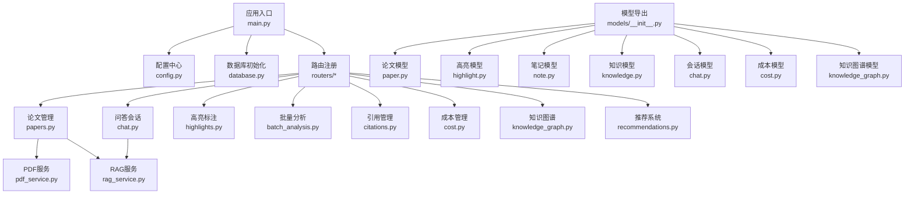

**图表来源**
- [backend/app/main.py:55-95](file://backend/app/main.py#L55-L95)
- [backend/app/config.py:15-44](file://backend/app/config.py#L15-L44)
- [backend/app/database.py:13-57](file://backend/app/database.py#L13-L57)
- [backend/app/routers/papers.py:30](file://backend/app/routers/papers.py#L30)
- [backend/app/routers/chat.py:18](file://backend/app/routers/chat.py#L18)
- [backend/app/routers/highlights.py:17](file://backend/app/routers/highlights.py#L17)
- [backend/app/routers/batch_analysis.py:19](file://backend/app/routers/batch_analysis.py#L19)
- [backend/app/routers/citations.py:19](file://backend/app/routers/citations.py#L19)
- [backend/app/routers/cost.py:14](file://backend/app/routers/cost.py#L14)
- [backend/app/routers/knowledge_graph.py:20](file://backend/app/routers/knowledge_graph.py#L20)
- [backend/app/routers/recommendations.py:16](file://backend/app/routers/recommendations.py#L16)
- [backend/app/services/pdf_service.py:11](file://backend/app/services/pdf_service.py#L11)
- [backend/app/services/rag_service.py:16](file://backend/app/services/rag_service.py#L16)
- [backend/app/models/__init__.py:5-29](file://backend/app/models/__init__.py#L5-L29)

**章节来源**
- [backend/app/main.py:55-95](file://backend/app/main.py#L55-L95)
- [backend/app/config.py:15-44](file://backend/app/config.py#L15-L44)
- [backend/app/database.py:13-57](file://backend/app/database.py#L13-L57)

## 核心组件
- 论文管理：上传、元数据提取、文本块存储、全文检索、批量导入、文件下载
- 智能分析：论文结构化解析、深度分析缓存、关键词与摘要生成（通过 LLM 服务）
- 问答系统：RAG 检索增强、跨文档检索、会话持久化、消息与引用溯源
- 阅读辅助：高亮标注、笔记管理、术语解释（通过知识卡片与检索）
- 知识管理：知识卡片创建、标签分类、关系建模、跨文档关联
- 写作辅助：大纲生成、段落生成、学术润色（通过 LLM 服务）
- **新增** 批量分析：支持批量摘要、对比分析、批量综述的异步任务处理
- **新增** 成本管理：费用追踪、预算控制、模型切换与成本统计
- **新增** 引用管理：引用格式导出、Zotero 同步、格式查询与连接状态检查
- **新增** 知识图谱：实体节点与关系边管理、D3.js 兼容图数据、手动构建与搜索
- **新增** 推荐系统：内容相似推荐、个性化推荐、知识图谱推荐、综合推荐与反馈

**章节来源**
- [backend/app/routers/papers.py:156-262](file://backend/app/routers/papers.py#L156-L262)
- [backend/app/services/pdf_service.py:11-194](file://backend/app/services/pdf_service.py#L11-L194)
- [backend/app/services/rag_service.py:16-400](file://backend/app/services/rag_service.py#L16-L400)
- [backend/app/routers/chat.py:21-417](file://backend/app/routers/chat.py#L21-L417)
- [backend/app/models/paper.py:11-85](file://backend/app/models/paper.py#L11-L85)
- [backend/app/models/highlight.py:10-37](file://backend/app/models/highlight.py#L10-L37)
- [backend/app/models/note.py:11-34](file://backend/app/models/note.py#L11-L34)
- [backend/app/models/knowledge.py:14-80](file://backend/app/models/knowledge.py#L14-L80)
- [backend/app/routers/batch_analysis.py:39-146](file://backend/app/routers/batch_analysis.py#L39-L146)
- [backend/app/routers/citations.py:33-196](file://backend/app/routers/citations.py#L33-L196)
- [backend/app/routers/cost.py:29-114](file://backend/app/routers/cost.py#L29-L114)
- [backend/app/routers/knowledge_graph.py:23-249](file://backend/app/routers/knowledge_graph.py#L23-249)
- [backend/app/routers/recommendations.py:29-338](file://backend/app/routers/recommendations.py#L29-L338)

## 架构总览
PaperChat 的核心数据流如下：
- 用户上传 PDF → 后台校验与保存 → 提取元数据与文本块 → 异步建立向量索引 → 提供检索与问答
- 会话与消息持久化 → RAG 检索结果融合 → 返回带来源的消息
- 阅读过程中的高亮与笔记 → 与知识卡片联动 → 支持术语解释与知识图谱
- **新增** 批量分析任务提交 → 异步队列处理 → 进度事件推送 → 结果获取
- **新增** 成本追踪服务 → LLM 调用记录 → 预算控制 → 成本统计报表
- **新增** 引用管理 → 多格式导出 → 外部工具同步 → 格式与状态查询
- **新增** 知识图谱构建 → 节点与边管理 → D3.js 图数据 → 子图查询与搜索
- **新增** 推荐系统 → 嵌入向量计算 → 多路推荐融合 → 反馈收集与优化

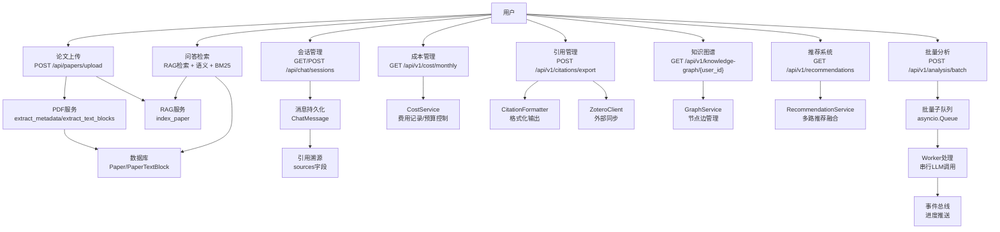

**图表来源**
- [backend/app/routers/papers.py:156-262](file://backend/app/routers/papers.py#L156-L262)
- [backend/app/services/pdf_service.py:14-194](file://backend/app/services/pdf_service.py#L14-L194)
- [backend/app/services/rag_service.py:183-371](file://backend/app/services/rag_service.py#L183-L371)
- [backend/app/routers/chat.py:21-118](file://backend/app/routers/chat.py#L21-L118)
- [backend/app/models/chat.py:14-71](file://backend/app/models/chat.py#L14-L71)
- [backend/app/routers/batch_analysis.py:112-173](file://backend/app/routers/batch_analysis.py#L112-L173)
- [backend/app/services/cost/cost_service.py:59-234](file://backend/app/services/cost/cost_service.py#L59-L234)
- [backend/app/routers/citations.py:33-196](file://backend/app/routers/citations.py#L33-L196)
- [backend/app/routers/knowledge_graph.py:23-249](file://backend/app/routers/knowledge_graph.py#L23-249)
- [backend/app/services/recommendation_service.py:21-800](file://backend/app/services/recommendation_service.py#L21-L800)

## 详细组件分析

### 论文管理模块
- 功能要点
  - 单文件与批量上传（含 ZIP 批量导入）
  - 元数据提取（标题、作者、页数）、文本块提取（含坐标）
  - 数据库存储（Paper、PaperTextBlock）
  - 异步建立向量索引（不阻塞上传响应）
  - 文本与块级数据查询、文件下载
- 关键流程（上传）
  - 校验文件类型与大小 → 保存到 uploads 目录 → 提取元数据与文本块 → 写入数据库 → 异步触发 RAG 索引

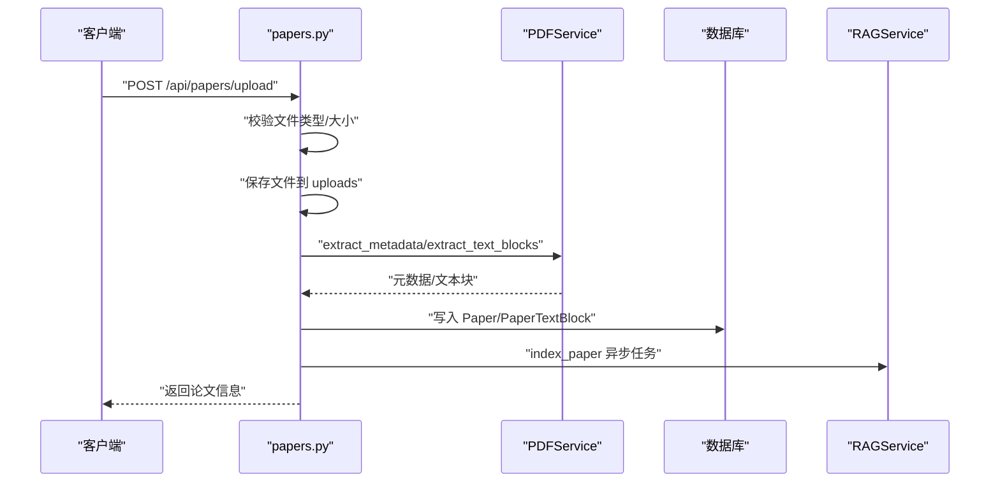

**图表来源**
- [backend/app/routers/papers.py:156-262](file://backend/app/routers/papers.py#L156-L262)
- [backend/app/services/pdf_service.py:14-194](file://backend/app/services/pdf_service.py#L14-L194)
- [backend/app/services/rag_service.py:183-232](file://backend/app/services/rag_service.py#L183-L232)

**章节来源**
- [backend/app/routers/papers.py:91-154](file://backend/app/routers/papers.py#L91-L154)
- [backend/app/routers/papers.py:156-262](file://backend/app/routers/papers.py#L156-L262)
- [backend/app/routers/papers.py:264-463](file://backend/app/routers/papers.py#L264-L463)
- [backend/app/routers/papers.py:465-519](file://backend/app/routers/papers.py#L465-L519)
- [backend/app/routers/papers.py:521-647](file://backend/app/routers/papers.py#L521-L647)
- [backend/app/routers/papers.py:649-800](file://backend/app/routers/papers.py#L649-L800)

### 智能分析系统
- 设计原理
  - 文本智能分块：按自然边界与页码聚合，保留重叠提升召回
  - 向量索引：Sentence-BERT 编码，ChromaDB 持久化
  - 检索融合：语义检索 + BM25 关键词检索，RRF 融合排序
  - 缓存与并发：BM25 索引缓存、线程池异步执行模型加载
- 关键流程（索引与检索）
  - 索引：分块 → 编码 → 写入集合
  - 检索：语义向量查询 + BM25 关键词打分 → RRF 融合 → 结果组装

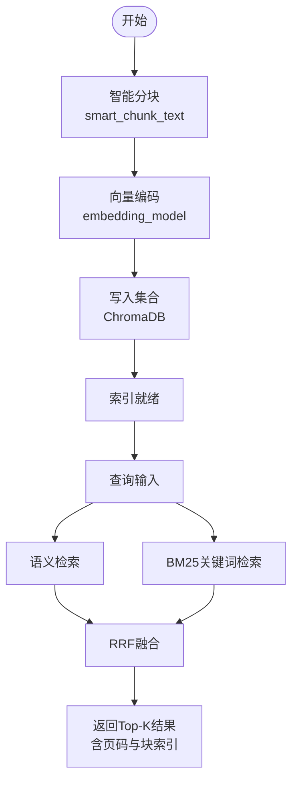

**图表来源**
- [backend/app/services/rag_service.py:102-162](file://backend/app/services/rag_service.py#L102-L162)
- [backend/app/services/rag_service.py:233-307](file://backend/app/services/rag_service.py#L233-L307)
- [backend/app/services/rag_service.py:308-336](file://backend/app/services/rag_service.py#L308-L336)

**章节来源**
- [backend/app/services/rag_service.py:16-400](file://backend/app/services/rag_service.py#L16-L400)

### 问答系统设计
- 会话持久化
  - 支持单论文与跨文档会话；会话关联论文ID列表
  - 消息模型包含角色、内容与引用来源（sources）
- RAG 增强
  - 基于论文向量索引与 BM25 的混合检索
  - 跨文档检索并按分数合并排序
- 引用溯源
  - 消息中携带 sources（如块索引、页码），前端可定位原文

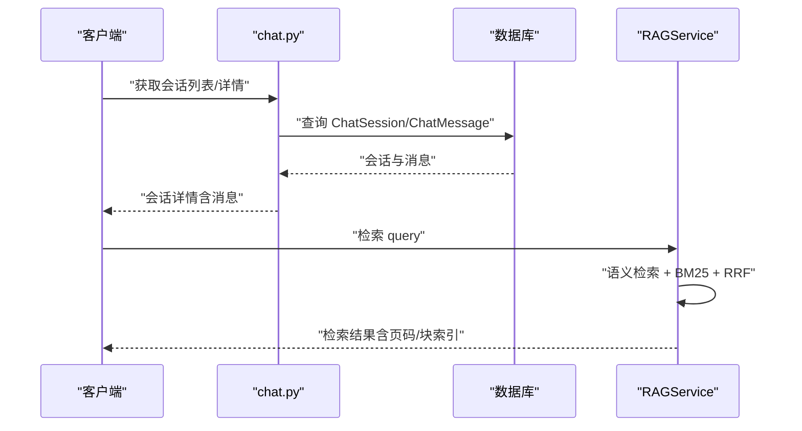

**图表来源**
- [backend/app/routers/chat.py:21-118](file://backend/app/routers/chat.py#L21-L118)
- [backend/app/routers/chat.py:121-172](file://backend/app/routers/chat.py#L121-L172)
- [backend/app/models/chat.py:14-71](file://backend/app/models/chat.py#L14-L71)
- [backend/app/services/rag_service.py:233-336](file://backend/app/services/rag_service.py#L233-L336)

**章节来源**
- [backend/app/routers/chat.py:21-417](file://backend/app/routers/chat.py#L21-L417)
- [backend/app/models/chat.py:14-71](file://backend/app/models/chat.py#L14-L71)

### 阅读辅助功能
- 高亮标注
  - 支持创建、更新、删除；存储页面、坐标、颜色、类型与选中文本
  - 与笔记关联（一对多）
- 笔记管理
  - 支持为高亮创建笔记；支持独立笔记
- 术语解释
  - 通过知识卡片与检索实现术语抽取与解释

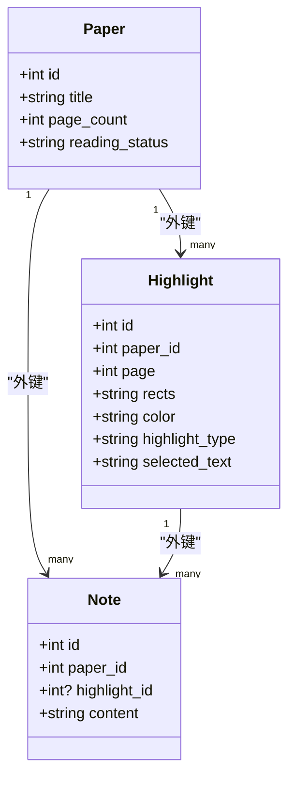

**图表来源**
- [backend/app/models/paper.py:11-85](file://backend/app/models/paper.py#L11-L85)
- [backend/app/models/highlight.py:10-37](file://backend/app/models/highlight.py#L10-L37)
- [backend/app/models/note.py:11-34](file://backend/app/models/note.py#L11-L34)

**章节来源**
- [backend/app/routers/highlights.py:20-189](file://backend/app/routers/highlights.py#L20-L189)
- [backend/app/models/highlight.py:10-37](file://backend/app/models/highlight.py#L10-L37)
- [backend/app/models/note.py:11-34](file://backend/app/models/note.py#L11-L34)

### 知识管理系统
- 知识卡片
  - 标题、内容、摘要、来源类型与ID、关联论文、标签、分类、重要性权重
- 知识关联
  - 支持多种关系类型（相关、先决、扩展、矛盾、支持），置信度评分
- 搜索与筛选
  - 基于标签、分类、重要性权重等维度进行筛选与排序

```mermaid
erDiagram
KNOWLEDGE_CARD {
int id PK
int user_id
string title
text content
text summary
string source_type
int source_id
int? paper_id
json tags
string category
float importance
}
KNOWLEDGE_RELATION {
int id PK
int source_card_id FK
int target_card_id FK
string relation_type
string description
float confidence
}
KNOWLEDGE_CARD ||--o{ KNOWLEDGE_RELATION : "source_card/target_card"
```

**图表来源**
- [backend/app/models/knowledge.py:14-80](file://backend/app/models/knowledge.py#L14-L80)

**章节来源**
- [backend/app/models/knowledge.py:14-80](file://backend/app/models/knowledge.py#L14-L80)

### 写作辅助模块
- 大纲生成、段落生成、学术润色
- 通过 LLM 服务对接外部大模型（DeepSeek 等），由上层路由与服务编排调用

**章节来源**
- [backend/app/config.py:25-31](file://backend/app/config.py#L25-L31)

### 批量分析系统（新增）
- 设计原理
  - 异步队列处理：使用 asyncio.Queue + Worker 模式，串行处理避免并发 LLM 调用
  - 任务状态管理：内存字典存储批次状态，支持取消与进度查询
  - 多类型分析：批量摘要、对比分析、批量综述三种模式
  - 事件驱动：通过 EventBus 推送进度事件
- 关键流程（任务提交与处理）
  - 提交：验证论文ID → 读取论文信息 → 创建批次状态 → 入队
  - 处理：串行执行 → 每篇论文完成后推送进度 → 最终状态更新
  - 取消：设置取消标志 → 更新批次状态为 CANCELLED

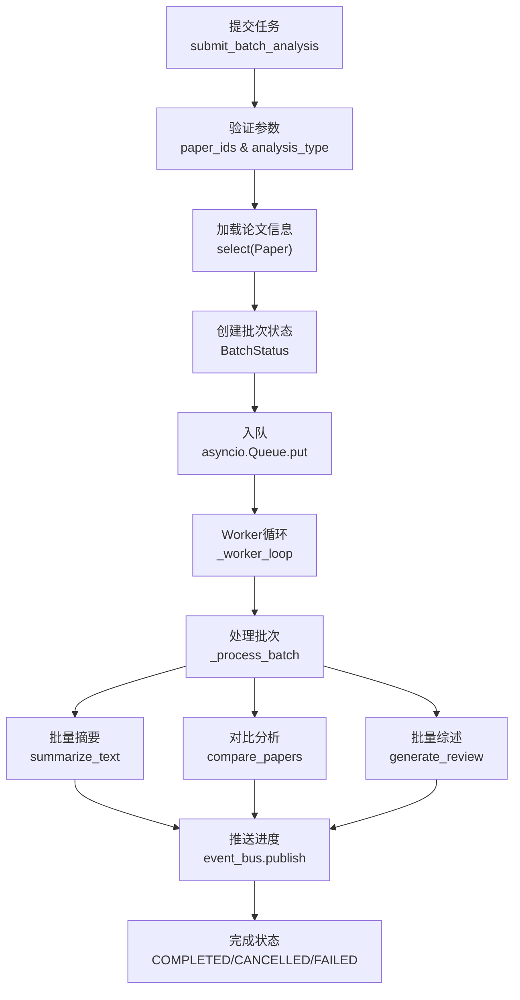

**图表来源**
- [backend/app/routers/batch_analysis.py:112-173](file://backend/app/routers/batch_analysis.py#L112-L173)
- [backend/app/services/batch_analysis.py:112-370](file://backend/app/services/batch_analysis.py#L112-L370)

**章节来源**
- [backend/app/routers/batch_analysis.py:39-146](file://backend/app/routers/batch_analysis.py#L39-L146)
- [backend/app/services/batch_analysis.py:94-370](file://backend/app/services/batch_analysis.py#L94-L370)

### 成本管理系统（新增）
- 设计原理
  - 费用追踪：记录每次 LLM 调用的 input/output tokens 与计算费用
  - 预算控制：月度预算限制，实时检查是否超支
  - 模型管理：支持多种模型切换，动态更新单价信息
  - 统计报表：日/月度费用统计，token 使用量汇总
- 关键流程（费用记录与预算检查）
  - 计费：根据模型定价表计算费用（美元/1000 tokens）
  - 记录：写入 usage_records 表，包含 session_id 关联
  - 预算：查询当月总费用与预算上限，计算剩余金额与百分比

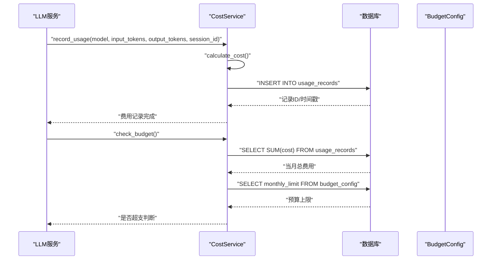

**图表来源**
- [backend/app/services/cost/cost_service.py:59-234](file://backend/app/services/cost/cost_service.py#L59-L234)
- [backend/app/models/cost.py:11-39](file://backend/app/models/cost.py#L11-L39)

**章节来源**
- [backend/app/routers/cost.py:29-114](file://backend/app/routers/cost.py#L29-L114)
- [backend/app/services/cost/cost_service.py:56-235](file://backend/app/services/cost/cost_service.py#L56-L235)
- [backend/app/models/cost.py:11-39](file://backend/app/models/cost.py#L11-L39)

### 引用管理系统（新增）
- 设计原理
  - 多格式支持：BibTeX、RIS、APA、MLA、Chicago、GB/T 7714 等
  - 外部同步：Zotero API 集成，支持用户配置与连接状态检查
  - 格式化器：统一的 CitationFormatter 处理不同格式的输出
- 关键流程（引用导出与同步）
  - 导出：验证论文ID → 读取论文元数据 → 格式化输出 → 统一分隔符
  - 同步：读取用户 Zotero 配置 → 创建客户端 → 批量添加条目 → 错误收集

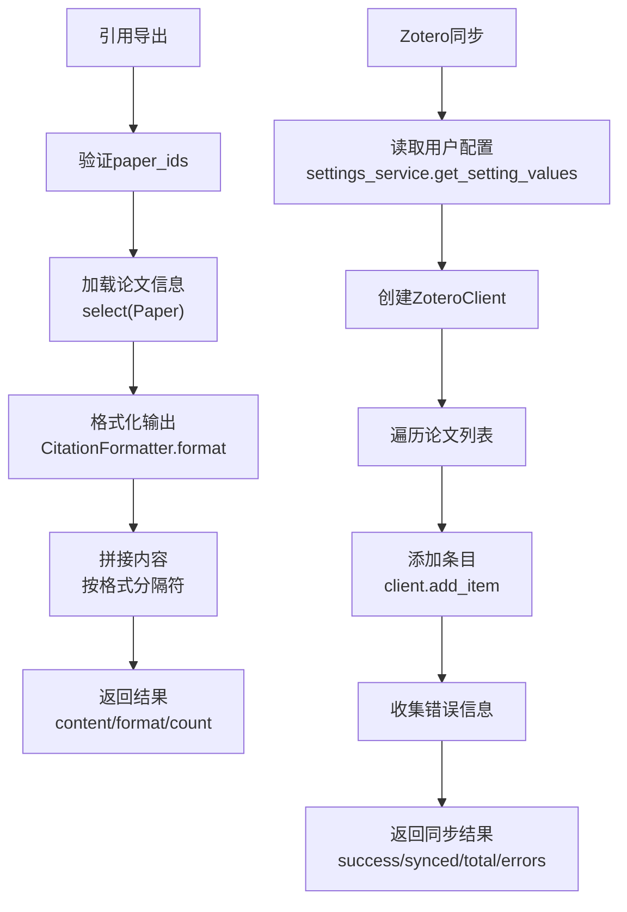

**图表来源**
- [backend/app/routers/citations.py:33-196](file://backend/app/routers/citations.py#L33-L196)
- [backend/app/services/citation/citation_formatter.py](file://backend/app/services/citation/citation_formatter.py)
- [backend/app/services/citation/zotero_client.py](file://backend/app/services/citation/zotero_client.py)

**章节来源**
- [backend/app/routers/citations.py:33-196](file://backend/app/routers/citations.py#L33-L196)
- [backend/app/services/citation/citation_formatter.py](file://backend/app/services/citation/citation_formatter.py)
- [backend/app/services/citation/zotero_client.py](file://backend/app/services/citation/zotero_client.py)

### 知识图谱系统（新增）
- 设计原理
  - 实体关系建模：GraphNode（节点）与 GraphEdge（边）双向关系
  - D3.js 兼容：提供 force graph 格式的节点与边数据
  - 用户隔离：每个用户独立的图谱空间，支持权限控制
  - 手动构建：支持按论文触发图谱更新，后台异步处理
- 关键流程（图谱查询与构建）
  - 用户图谱：查询该用户所有节点与边，组装 D3.js 格式
  - 论文子图：筛选包含特定论文ID的节点与边，形成局部图
  - 图谱构建：后台任务执行，更新节点属性与关系权重

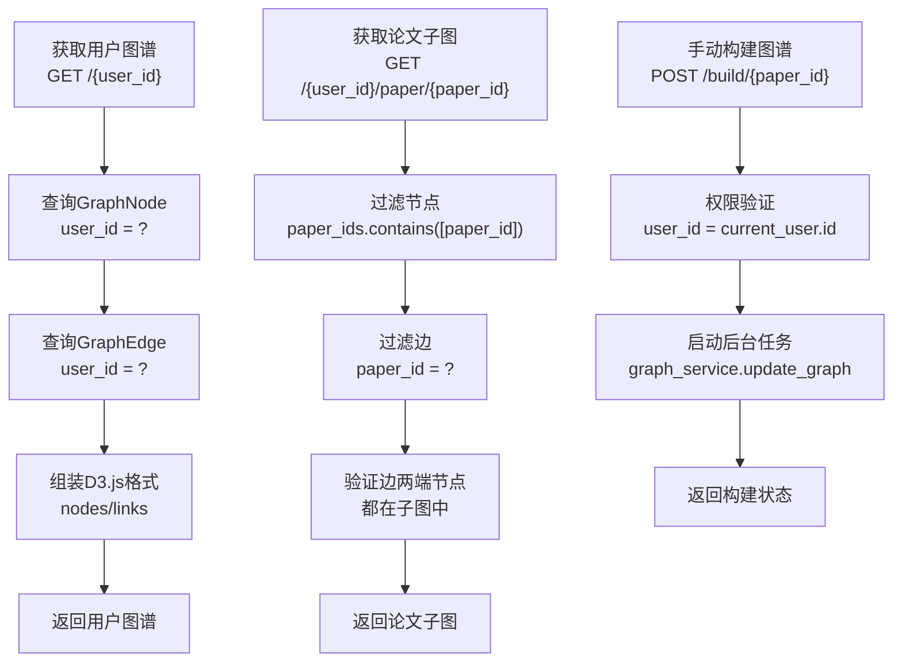

**图表来源**
- [backend/app/routers/knowledge_graph.py:23-249](file://backend/app/routers/knowledge_graph.py#L23-249)
- [backend/app/models/knowledge_graph.py:14-75](file://backend/app/models/knowledge_graph.py#L14-L75)

**章节来源**
- [backend/app/routers/knowledge_graph.py:23-249](file://backend/app/routers/knowledge_graph.py#L23-L249)
- [backend/app/models/knowledge_graph.py:14-75](file://backend/app/models/knowledge_graph.py#L14-L75)

### 推荐系统增强（新增）
- 设计原理
  - 多路推荐：内容相似推荐、个性化推荐、知识图谱推荐
  - 嵌入向量：基于论文文本块计算向量，支持缓存与刷新
  - 综合排序：加权融合三路推荐结果，提供推荐理由
  - 反馈机制：收集用户对推荐结果的有用性反馈
- 关键流程（推荐生成与融合）
  - 相似推荐：计算余弦相似度，返回 top_k 结果
  - 个性化推荐：基于用户画像构建向量，加权排序
  - 图谱推荐：通过知识卡片关系发现潜在关联论文
  - 综合推荐：并行计算三路结果，加权融合排序

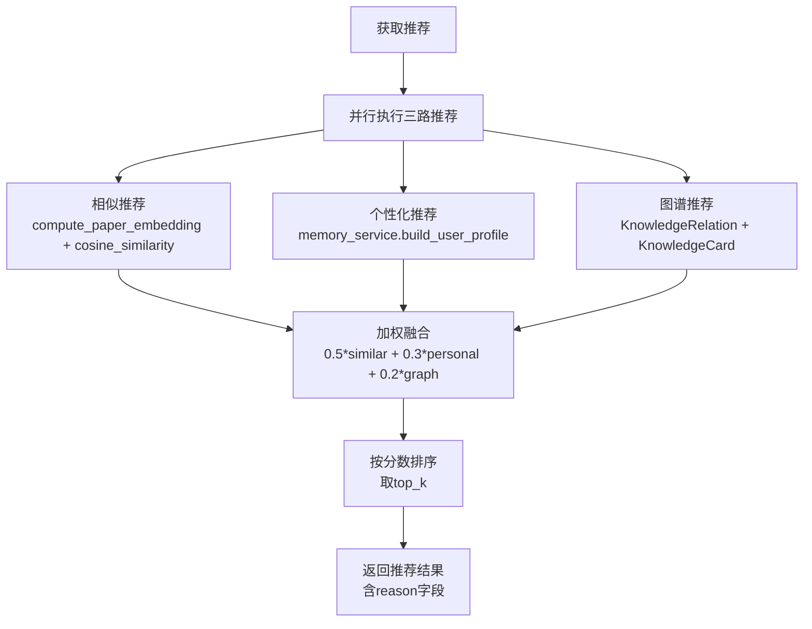

**图表来源**
- [backend/app/services/recommendation_service.py:673-788](file://backend/app/services/recommendation_service.py#L673-L788)

**章节来源**
- [backend/app/routers/recommendations.py:29-338](file://backend/app/routers/recommendations.py#L29-L338)
- [backend/app/services/recommendation_service.py:21-800](file://backend/app/services/recommendation_service.py#L21-L800)

## 依赖分析
- 组件耦合
  - papers 路由依赖 pdf_service 与 rag_service，体现"上传即索引"的解耦
  - chat 路由依赖 rag_service 实现检索增强
  - **新增** batch_analysis 依赖 llm_service 进行异步批量处理
  - **新增** cost_service 依赖 usage_records 表进行费用追踪
  - **新增** knowledge_graph 依赖 graph_nodes/graph_edges 表管理图数据
  - **新增** recommendations 依赖 memory_service 进行嵌入向量计算
  - 模型层通过外键与级联删除保证数据一致性
- 外部依赖
  - pdfplumber：PDF 元数据与文本块提取
  - ChromaDB：向量检索持久化
  - rank_bm25：BM25 关键词检索
  - sentence-transformers：嵌入编码
  - **新增** asyncio：异步队列与事件处理
  - **新增** aiohttp：Zotero API 客户端通信

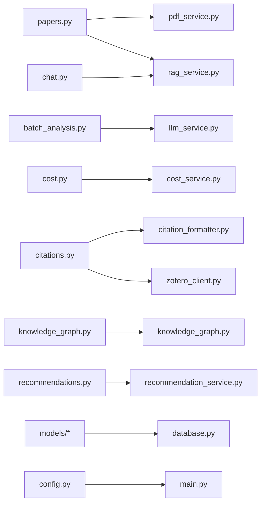

**图表来源**
- [backend/app/routers/papers.py:25-28](file://backend/app/routers/papers.py#L25-L28)
- [backend/app/routers/chat.py:13-16](file://backend/app/routers/chat.py#L13-L16)
- [backend/app/routers/batch_analysis.py:15](file://backend/app/routers/batch_analysis.py#L15)
- [backend/app/routers/cost.py:10](file://backend/app/routers/cost.py#L10)
- [backend/app/routers/citations.py:16](file://backend/app/routers/citations.py#L16)
- [backend/app/routers/knowledge_graph.py:16](file://backend/app/routers/knowledge_graph.py#L16)
- [backend/app/routers/recommendations.py:14](file://backend/app/routers/recommendations.py#L14)
- [backend/app/database.py:13-57](file://backend/app/database.py#L13-L57)
- [backend/app/config.py:15-44](file://backend/app/config.py#L15-L44)
- [backend/app/main.py:55-95](file://backend/app/main.py#L55-L95)

**章节来源**
- [backend/app/routers/papers.py:25-28](file://backend/app/routers/papers.py#L25-L28)
- [backend/app/routers/chat.py:13-16](file://backend/app/routers/chat.py#L13-L16)
- [backend/app/routers/batch_analysis.py:15](file://backend/app/routers/batch_analysis.py#L15)
- [backend/app/routers/cost.py:10](file://backend/app/routers/cost.py#L10)
- [backend/app/routers/citations.py:16](file://backend/app/routers/citations.py#L16)
- [backend/app/routers/knowledge_graph.py:16](file://backend/app/routers/knowledge_graph.py#L16)
- [backend/app/routers/recommendations.py:14](file://backend/app/routers/recommendations.py#L14)
- [backend/app/database.py:13-57](file://backend/app/database.py#L13-L57)

## 性能考虑
- 异步与并发
  - 上传后异步建立索引，避免阻塞请求
  - 向量编码使用线程池，避免阻塞事件循环
  - **新增** 批量分析使用串行 Worker，避免并发 LLM 调用导致的超时
  - **新增** 推荐系统并行计算三路推荐，提升响应速度
- 检索优化
  - BM25 索引缓存，避免重复构建
  - RRF 融合减少人工调参成本
  - **新增** 嵌入向量缓存，减少重复计算
- 存储与序列化
  - ChromaDB 持久化集合，按论文隔离
  - 元数据中 list 转 JSON 字符串以适配存储
  - **新增** 成本记录使用索引优化查询性能
  - **新增** 知识图谱节点与边建立适当索引

**章节来源**
- [backend/app/services/rag_service.py:41-42](file://backend/app/services/rag_service.py#L41-L42)
- [backend/app/services/rag_service.py:163-182](file://backend/app/services/rag_service.py#L163-L182)
- [backend/app/services/rag_service.py:255-260](file://backend/app/services/rag_service.py#L255-L260)
- [backend/app/services/rag_service.py:217-218](file://backend/app/services/rag_service.py#L217-L218)
- [backend/app/services/batch_analysis.py:195-220](file://backend/app/services/batch_analysis.py#L195-L220)
- [backend/app/services/recommendation_service.py:36-44](file://backend/app/services/recommendation_service.py#L36-L44)

## 故障排查指南
- 上传失败
  - 检查文件类型与大小限制；确认 uploads 目录可写
  - 若解析异常，查看 PDFService 抛出的异常信息
- 索引异常
  - 确认 ChromaDB 持久化目录权限；必要时重建索引
  - 检查 embedding 模型是否成功加载（首次加载较慢）
- 检索无结果
  - 确认论文已建立索引；检查 BM25 缓存是否命中
  - 调整 top_k、chunk_size 参数以改善召回
- 会话与消息
  - 确认会话归属当前用户；检查 paper_ids 是否正确
- **新增** 批量分析任务
  - 检查队列是否正常工作；查看 Worker 日志
  - 确认 LLM 服务可用性；检查取消标志状态
- **新增** 成本管理
  - 检查模型定价配置；确认费用记录是否写入
  - 验证预算配置；查看超支警告日志
- **新增** 引用管理
  - 确认 Zotero 配置完整性；测试连接状态
  - 检查论文格式化输出；验证 API 响应
- **新增** 知识图谱
  - 检查节点与边数据完整性；验证用户权限
  - 确认图谱构建任务执行状态
- **新增** 推荐系统
  - 验证嵌入向量计算；检查缓存状态
  - 确认用户画像数据；查看推荐理由生成

**章节来源**
- [backend/app/routers/papers.py:177-193](file://backend/app/routers/papers.py#L177-L193)
- [backend/app/services/pdf_service.py:163-190](file://backend/app/services/pdf_service.py#L163-L190)
- [backend/app/services/rag_service.py:337-371](file://backend/app/services/rag_service.py#L337-L371)
- [backend/app/routers/chat.py:36-44](file://backend/app/routers/chat.py#L36-L44)
- [backend/app/routers/batch_analysis.py:82-102](file://backend/app/routers/batch_analysis.py#L82-L102)
- [backend/app/services/cost/cost_service.py:215-218](file://backend/app/services/cost/cost_service.py#L215-L218)
- [backend/app/routers/citations.py:171-196](file://backend/app/routers/citations.py#L171-L196)
- [backend/app/routers/knowledge_graph.py:174-198](file://backend/app/routers/knowledge_graph.py#L174-L198)
- [backend/app/services/recommendation_service.py:488-497](file://backend/app/services/recommendation_service.py#L488-L497)

## 结论
PaperChat 通过"上传即索引"的设计实现了论文全生命周期管理，结合 RAG 检索与会话持久化，为学术阅读与问答提供了稳定高效的基础设施。阅读辅助与知识管理进一步增强了学习与知识沉淀能力。

**新增功能总结**
- 批量分析系统提供了异步、可监控的批量处理能力，支持多种分析模式
- 成本管理系统实现了精细化的费用追踪与预算控制，支持多模型定价
- 引用管理系统完善了学术工作流，支持多格式导出与外部工具同步
- 知识图谱系统建立了实体关系模型，为论文间关联提供了可视化支持
- 推荐系统通过多路融合提升了个性化推荐质量，支持反馈优化

建议在生产环境中关注模型加载延迟、索引重建策略、跨文档检索的性能调优，以及新增模块的成本控制与数据一致性保障。

## 附录

### API 接口清单与使用示例

#### 论文管理
- 上传论文
  - 方法与路径：POST /api/papers/upload
  - 请求：multipart/form-data，字段 file（必填，PDF）、title、category、tags
  - 响应：PaperResponse
  - 示例：见 [backend/app/routers/papers.py:156-262](file://backend/app/routers/papers.py#L156-L262)
- 批量上传（文件列表）
  - 方法与路径：POST /api/papers/batch-upload
  - 请求：files（多文件）
  - 响应：BatchUploadResponse
  - 示例：见 [backend/app/routers/papers.py:521-647](file://backend/app/routers/papers.py#L521-L647)
- 批量上传（ZIP）
  - 方法与路径：POST /api/papers/batch-upload-zip
  - 请求：file（ZIP）
  - 响应：BatchUploadResponse
  - 示例：见 [backend/app/routers/papers.py:649-800](file://backend/app/routers/papers.py#L649-L800)
- 获取论文列表
  - 方法与路径：GET /api/papers
  - 查询：page、page_size、search、category、reading_status
  - 响应：PaperListResponse
  - 示例：见 [backend/app/routers/papers.py:91-154](file://backend/app/routers/papers.py#L91-L154)
- 获取论文详情
  - 方法与路径：GET /api/papers/{paper_id}
  - 响应：PaperResponse
  - 示例：见 [backend/app/routers/papers.py:264-291](file://backend/app/routers/papers.py#L264-L291)
- 更新论文
  - 方法与路径：PUT /api/papers/{paper_id}
  - 请求体：PaperUpdate
  - 响应：PaperResponse
  - 示例：见 [backend/app/routers/papers.py:293-339](file://backend/app/routers/papers.py#L293-L339)
- 删除论文
  - 方法与路径：DELETE /api/papers/{paper_id}
  - 响应：204 No Content
  - 示例：见 [backend/app/routers/papers.py:341-377](file://backend/app/routers/papers.py#L341-L377)
- 下载论文文件
  - 方法与路径：GET /api/papers/{paper_id}/file
  - 响应：FileResponse（application/pdf）
  - 示例：见 [backend/app/routers/papers.py:379-417](file://backend/app/routers/papers.py#L379-L417)
- 获取论文文本
  - 方法与路径：GET /api/papers/{paper_id}/text
  - 查询：page（可选）
  - 响应：{ text, page_count }
  - 示例：见 [backend/app/routers/papers.py:419-463](file://backend/app/routers/papers.py#L419-L463)
- 获取文本块（带坐标）
  - 方法与路径：GET /api/papers/{paper_id}/blocks
  - 查询：page（可选）
  - 响应：{ blocks: [...] }
  - 示例：见 [backend/app/routers/papers.py:465-519](file://backend/app/routers/papers.py#L465-L519)

#### 问答会话管理
- 获取会话列表
  - 方法与路径：GET /api/chat/sessions
  - 查询：paper_id（可选）
  - 响应：{ sessions: [...] }
  - 示例：见 [backend/app/routers/chat.py:21-66](file://backend/app/routers/chat.py#L21-L66)
- 创建会话
  - 方法与路径：POST /api/chat/sessions
  - 查询：paper_id（可选）、paper_ids（可选）、title（可选）
  - 响应：会话详情
  - 示例：见 [backend/app/routers/chat.py:68-119](file://backend/app/routers/chat.py#L68-L119)
- 获取会话详情
  - 方法与路径：GET /api/chat/sessions/{session_id}
  - 响应：会话与消息列表
  - 示例：见 [backend/app/routers/chat.py:121-172](file://backend/app/routers/chat.py#L121-L172)
- 获取会话消息（分页）
  - 方法与路径：GET /api/chat/sessions/{session_id}/messages
  - 查询：limit、offset
  - 响应：消息列表与分页信息
  - 示例：见 [backend/app/routers/chat.py:174-225](file://backend/app/routers/chat.py#L174-L225)
- 更新会话标题
  - 方法与路径：PUT /api/chat/sessions/{session_id}
  - 请求体：title
  - 响应：更新后的会话
  - 示例：见 [backend/app/routers/chat.py:227-264](file://backend/app/routers/chat.py#L227-L264)
- 删除会话
  - 方法与路径：DELETE /api/chat/sessions/{session_id}
  - 响应：删除成功消息
  - 示例：见 [backend/app/routers/chat.py:266-293](file://backend/app/routers/chat.py#L266-L293)
- 获取或创建论文默认会话
  - 方法与路径：GET /api/chat/sessions/by-paper/{paper_id}
  - 响应：会话详情（含 is_new 标记）
  - 示例：见 [backend/app/routers/chat.py:295-352](file://backend/app/routers/chat.py#L295-L352)
- 创建跨文档会话
  - 方法与路径：POST /api/chat/sessions/cross-doc
  - 请求体：paper_ids（列表）、title（可选）
  - 响应：跨文档会话详情
  - 示例：见 [backend/app/routers/chat.py:354-417](file://backend/app/routers/chat.py#L354-L417)

#### 高亮标注管理
- 获取论文高亮
  - 方法与路径：GET /api/highlights/paper/{paper_id}
  - 响应：高亮列表
  - 示例：见 [backend/app/routers/highlights.py:20-56](file://backend/app/routers/highlights.py#L20-L56)
- 创建高亮
  - 方法与路径：POST /api/highlights
  - 请求体：HighlightCreate
  - 响应：HighlightResponse
  - 示例：见 [backend/app/routers/highlights.py:58-106](file://backend/app/routers/highlights.py#L58-L106)
- 更新高亮
  - 方法与路径：PUT /api/highlights/{highlight_id}
  - 请求体：HighlightUpdate
  - 响应：HighlightResponse
  - 示例：见 [backend/app/routers/highlights.py:108-152](file://backend/app/routers/highlights.py#L108-L152)
- 删除高亮
  - 方法与路径：DELETE /api/highlights/{highlight_id}
  - 响应：204 No Content
  - 示例：见 [backend/app/routers/highlights.py:154-186](file://backend/app/routers/highlights.py#L154-L186)

#### 批量分析（新增）
- 提交批量分析任务
  - 方法与路径：POST /api/v1/analysis/batch
  - 请求体：BatchAnalysisRequest（paper_ids, analysis_type）
  - 响应：BatchSubmitResponse（batch_id, message）
  - 示例：见 [backend/app/routers/batch_analysis.py:39-72](file://backend/app/routers/batch_analysis.py#L39-L72)
- 查询批量分析进度
  - 方法与路径：GET /api/v1/analysis/batch/{batch_id}
  - 响应：批次状态（status, progress, completed, failed, paper_results）
  - 示例：见 [backend/app/routers/batch_analysis.py:75-102](file://backend/app/routers/batch_analysis.py#L75-L102)
- 获取批量分析结果
  - 方法与路径：GET /api/v1/analysis/batch/{batch_id}/results
  - 响应：完整结果（包含每篇论文的分析内容）
  - 示例：见 [backend/app/routers/batch_analysis.py:105-123](file://backend/app/routers/batch_analysis.py#L105-L123)
- 取消批量分析任务
  - 方法与路径：DELETE /api/v1/analysis/batch/{batch_id}
  - 响应：取消状态信息
  - 示例：见 [backend/app/routers/batch_analysis.py:126-145](file://backend/app/routers/batch_analysis.py#L126-L145)

#### 引用管理（新增）
- 导出引用
  - 方法与路径：POST /api/v1/citations/export
  - 请求体：ExportRequest（paper_ids, format）
  - 响应：格式化后的引用内容
  - 示例：见 [backend/app/routers/citations.py:33-78](file://backend/app/routers/citations.py#L33-L78)
- 同步到 Zotero
  - 方法与路径：POST /api/v1/citations/sync-zotero
  - 请求体：SyncZoteroRequest（paper_ids）
  - 响应：同步结果（success, synced, total, errors）
  - 示例：见 [backend/app/routers/citations.py:81-153](file://backend/app/routers/citations.py#L81-L153)
- 获取支持的引用格式
  - 方法与路径：GET /api/v1/citations/formats
  - 响应：格式列表（key, label）
  - 示例：见 [backend/app/routers/citations.py:156-168](file://backend/app/routers/citations.py#L156-L168)
- 检查 Zotero 连接状态
  - 方法与路径：GET /api/v1/citations/zotero/status
  - 响应：配置状态与连接状态
  - 示例：见 [backend/app/routers/citations.py:171-196](file://backend/app/routers/citations.py#L171-L196)

#### 成本管理（新增）
- 获取可用模型列表
  - 方法与路径：GET /api/v1/cost/models
  - 响应：模型列表（name, description, input/output 价格）
  - 示例：见 [backend/app/routers/cost.py:29-42](file://backend/app/routers/cost.py#L29-L42)
- 查询会话费用
  - 方法与路径：GET /api/v1/cost/session/{session_id}
  - 响应：会话费用汇总（total_input_tokens, total_output_tokens, total_cost, call_count）
  - 示例：见 [backend/app/routers/cost.py:45-48](file://backend/app/routers/cost.py#L45-L48)
- 查询日费用
  - 方法与路径：GET /api/v1/cost/daily
  - 查询：date（YYYY-MM-DD，默认今天）
  - 响应：日费用统计
  - 示例：见 [backend/app/routers/cost.py:51-57](file://backend/app/routers/cost.py#L51-L57)
- 查询月费用
  - 方法与路径：GET /api/v1/cost/monthly
  - 查询：year（默认当前年）、month（默认当前月）
  - 响应：月费用统计与每日明细
  - 示例：见 [backend/app/routers/cost.py:60-69](file://backend/app/routers/cost.py#L60-L69)
- 查询预算状态
  - 方法与路径：GET /api/v1/cost/budget
  - 响应：预算使用状态（monthly_limit, used, remaining, percent, over_budget）
  - 示例：见 [backend/app/routers/cost.py:72-75](file://backend/app/routers/cost.py#L72-L75)
- 设置月度预算
  - 方法与路径：PUT /api/v1/cost/budget
  - 请求体：BudgetSetRequest（monthly_limit）
  - 响应：更新后的预算配置
  - 示例：见 [backend/app/routers/cost.py:78-81](file://backend/app/routers/cost.py#L78-L81)
- 获取当前模型
  - 方法与路径：GET /api/v1/cost/current-model
  - 响应：当前使用的模型信息
  - 示例：见 [backend/app/routers/cost.py:84-94](file://backend/app/routers/cost.py#L84-L94)
- 切换模型
  - 方法与路径：PUT /api/v1/cost/current-model
  - 请求体：ModelSwitchRequest（model）
  - 响应：切换结果与模型信息
  - 示例：见 [backend/app/routers/cost.py:97-113](file://backend/app/routers/cost.py#L97-L113)

#### 知识图谱（新增）
- 获取用户完整图谱
  - 方法与路径：GET /api/v1/knowledge-graph/{user_id}
  - 响应：D3.js force graph 兼容格式（nodes, links）
  - 示例：见 [backend/app/routers/knowledge_graph.py:23-78](file://backend/app/routers/knowledge_graph.py#L23-L78)
- 获取论文子图
  - 方法与路径：GET /api/v1/knowledge-graph/{user_id}/paper/{paper_id}
  - 响应：论文相关的子图数据
  - 示例：见 [backend/app/routers/knowledge_graph.py:81-152](file://backend/app/routers/knowledge_graph.py#L81-L152)
- 手动触发图谱构建
  - 方法与路径：POST /api/v1/knowledge-graph/build/{paper_id}?user_id={user_id}
  - 响应：构建状态信息
  - 示例：见 [backend/app/routers/knowledge_graph.py:155-198](file://backend/app/routers/knowledge_graph.py#L155-L198)
- 搜索图谱节点
  - 方法与路径：GET /api/v1/knowledge-graph/{user_id}/search?query={query}
  - 响应：匹配的节点列表
  - 示例：见 [backend/app/routers/knowledge_graph.py:201-248](file://backend/app/routers/knowledge_graph.py#L201-L248)

#### 推荐系统（新增）
- 获取相似论文推荐
  - 方法与路径：GET /api/v1/papers/{paper_id}/recommendations?top_k={top_k}
  - 响应：相似论文列表（包含相似度分数）
  - 示例：见 [backend/app/routers/recommendations.py:29-86](file://backend/app/routers/recommendations.py#L29-L86)
- 获取个性化推荐
  - 方法与路径：GET /api/v1/recommendations?top_k={top_k}
  - 响应：个性化论文列表（包含匹配原因）
  - 示例：见 [backend/app/routers/recommendations.py:89-129](file://backend/app/routers/recommendations.py#L89-L129)
- 刷新论文推荐缓存
  - 方法与路径：POST /api/v1/papers/{paper_id}/recommendations/refresh
  - 响应：刷新状态与结果
  - 示例：见 [backend/app/routers/recommendations.py:132-188](file://backend/app/routers/recommendations.py#L132-L188)
- 获取网络推荐
  - 方法与路径：GET /api/v1/papers/{paper_id}/web-recommendations?max_results={max_results}
  - 响应：网络学术文献列表
  - 示例：见 [backend/app/routers/recommendations.py:191-244](file://backend/app/routers/recommendations.py#L191-L244)
- 获取综合推荐
  - 方法与路径：GET /api/v1/recommendations/comprehensive?paper_id={paper_id}&top_k={top_k}
  - 响应：综合推荐列表（含推荐理由）
  - 示例：见 [backend/app/routers/recommendations.py:247-282](file://backend/app/routers/recommendations.py#L247-L282)
- 提交推荐反馈
  - 方法与路径：POST /api/v1/recommendations/feedback
  - 请求体：FeedbackRequest（paper_id, feedback_type, source, comment）
  - 响应：反馈记录结果
  - 示例：见 [backend/app/routers/recommendations.py:285-337](file://backend/app/routers/recommendations.py#L285-L337)