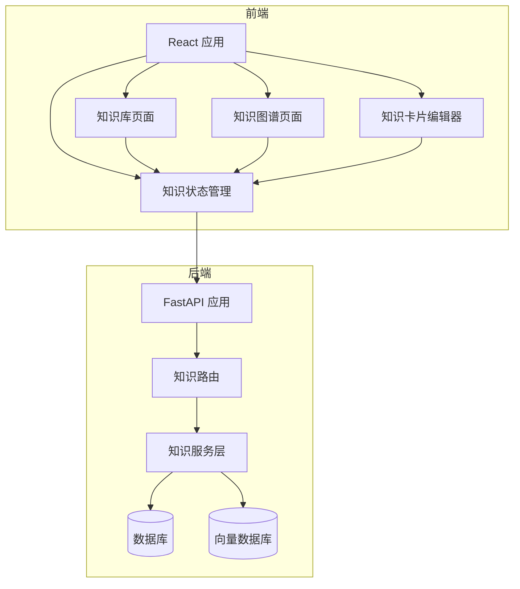
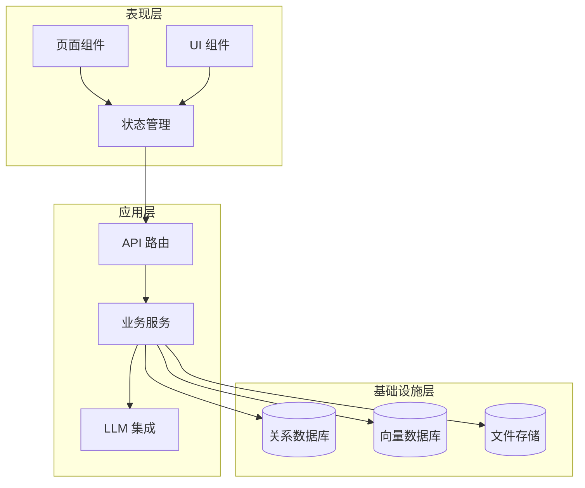
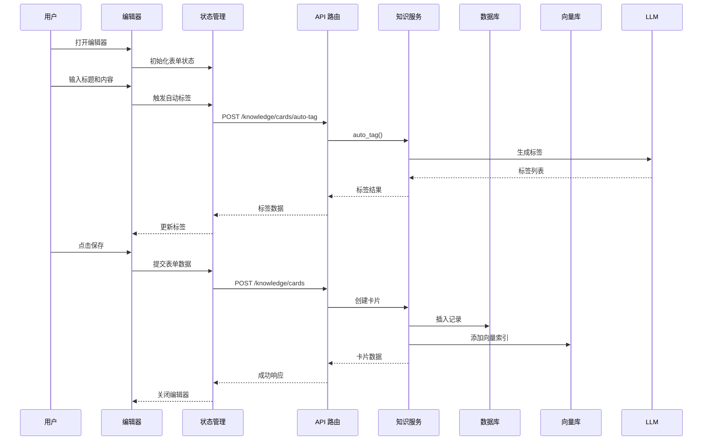
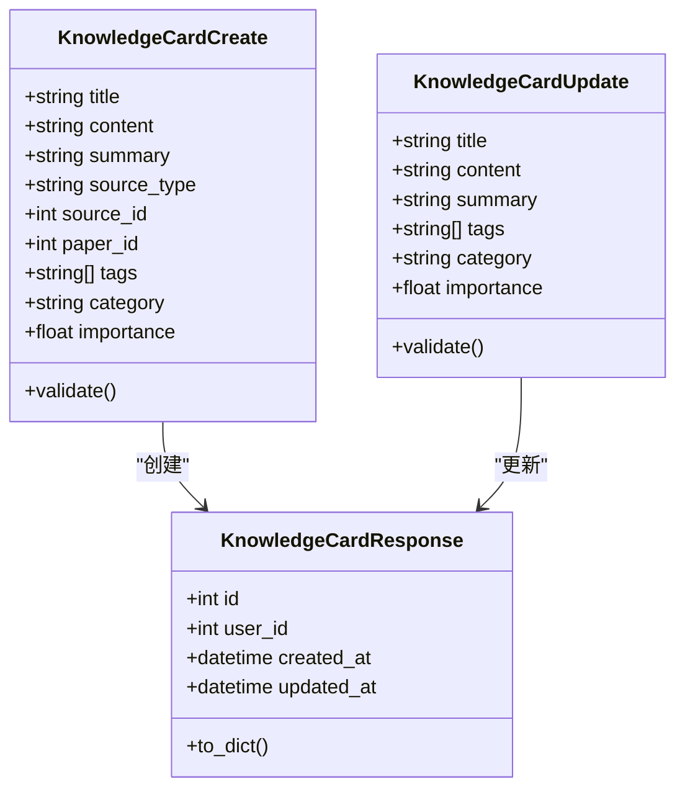
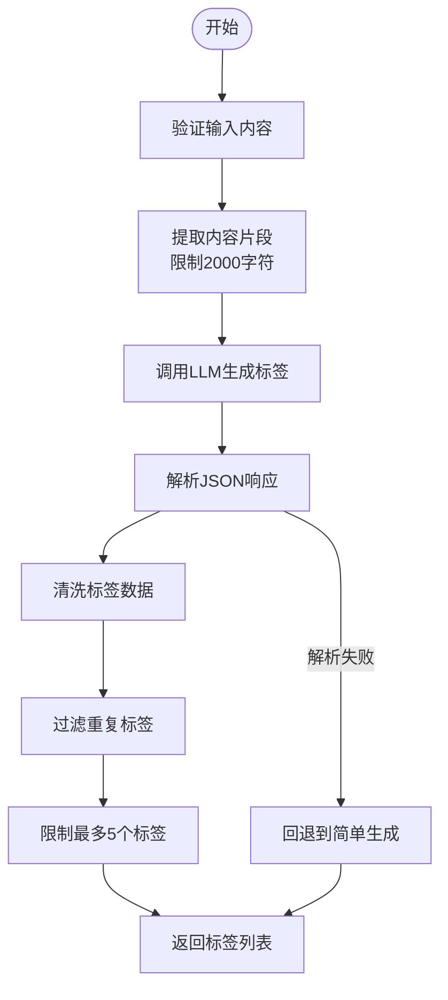
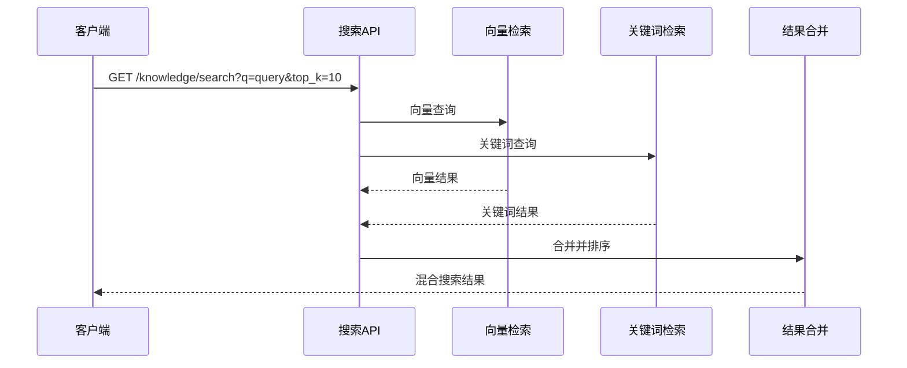
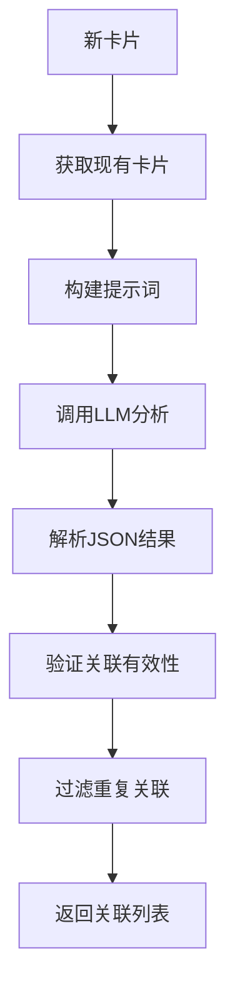
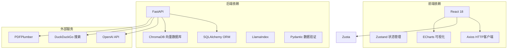

# 知识管理系统

<cite>
**本文档引用的文件**
- [backend/app/main.py](file://backend/app/main.py)
- [backend/app/models/knowledge.py](file://backend/app/models/knowledge.py)
- [backend/app/routers/knowledge.py](file://backend/app/routers/knowledge.py)
- [backend/app/services/knowledge_service.py](file://backend/app/services/knowledge_service.py)
- [backend/app/services/search_service.py](file://backend/app/services/search_service.py)
- [backend/app/services/recommendation_service.py](file://backend/app/services/recommendation_service.py)
- [backend/app/schemas/note.py](file://backend/app/schemas/note.py)
- [backend/app/models/note.py](file://backend/app/models/note.py)
- [backend/app/models/paper.py](file://backend/app/models/paper.py)
- [backend/app/routers/writing.py](file://backend/app/routers/writing.py)
- [backend/app/services/pdf_service.py](file://backend/app/services/pdf_service.py)
- [frontend/src/components/KnowledgeCardEditor/KnowledgeCardEditor.jsx](file://frontend/src/components/KnowledgeCardEditor/KnowledgeCardEditor.jsx)
- [frontend/src/stores/knowledgeStore.js](file://frontend/src/stores/knowledgeStore.js)
- [frontend/src/pages/KnowledgePage.jsx](file://frontend/src/pages/KnowledgePage.jsx)
- [frontend/src/pages/KnowledgeGraphPage.jsx](file://frontend/src/pages/KnowledgeGraphPage.jsx)
</cite>

## 目录
1. [简介](#简介)
2. [项目结构](#项目结构)
3. [核心组件](#核心组件)
4. [架构概览](#架构概览)
5. [详细组件分析](#详细组件分析)
6. [依赖分析](#依赖分析)
7. [性能考虑](#性能考虑)
8. [故障排除指南](#故障排除指南)
9. [结论](#结论)
10. [附录](#附录)

## 简介
本系统是一个基于 FastAPI + React 的知识管理系统，专注于学术论文阅读与知识管理。系统提供知识卡片的创建与编辑、标签分类、智能搜索、知识关联网络构建、AI 辅助写作等功能。后端采用异步架构，支持向量检索与传统关键词检索相结合的混合搜索策略；前端使用 Zustand 状态管理与 ECharts 进行知识图谱可视化。

## 项目结构
系统采用前后端分离架构，后端使用 FastAPI 提供 RESTful API，前端使用 Vite + React 构建用户界面。

**图表来源**
- [backend/app/main.py:55-99](file://backend/app/main.py#L55-L99)
- [frontend/src/pages/KnowledgePage.jsx:33-429](file://frontend/src/pages/KnowledgePage.jsx#L33-L429)

**章节来源**
- [backend/app/main.py:1-114](file://backend/app/main.py#L1-L114)
- [frontend/src/pages/KnowledgePage.jsx:1-429](file://frontend/src/pages/KnowledgePage.jsx#L1-L429)

## 核心组件
系统围绕知识卡片这一核心实体构建，包含以下关键组件：

### 数据模型
- **KnowledgeCard**: 知识卡片实体，支持多种来源类型（手动、高亮、问答、分析）
- **KnowledgeRelation**: 知识关联实体，支持五种关系类型
- **Paper**: 论文实体，支持阅读状态跟踪
- **Note**: 笔记实体，可关联高亮内容

### 服务层
- **KnowledgeService**: 知识管理核心服务，包含提取、搜索、关联发现、向量化索引等功能
- **RecommendationService**: 论文推荐服务，基于内容相似性和用户画像
- **SearchService**: 网络搜索服务，集成 DuckDuckGo
- **PDFService**: PDF 处理服务，提供元数据提取和文本解析

### 前端组件
- **KnowledgeCardEditor**: 知识卡片编辑器，支持 AI 自动生成标签和关联发现
- **KnowledgePage**: 知识库主页面，支持搜索、筛选、分页
- **KnowledgeGraphPage**: 知识图谱可视化页面，基于 ECharts

**章节来源**
- [backend/app/models/knowledge.py:14-80](file://backend/app/models/knowledge.py#L14-L80)
- [backend/app/models/paper.py:11-85](file://backend/app/models/paper.py#L11-L85)
- [backend/app/models/note.py:11-34](file://backend/app/models/note.py#L11-L34)
- [frontend/src/components/KnowledgeCardEditor/KnowledgeCardEditor.jsx:23-493](file://frontend/src/components/KnowledgeCardEditor/KnowledgeCardEditor.jsx#L23-L493)

## 架构概览
系统采用分层架构设计，确保关注点分离和模块化。

**图表来源**
- [backend/app/main.py:16-52](file://backend/app/main.py#L16-L52)
- [backend/app/routers/knowledge.py:19-550](file://backend/app/routers/knowledge.py#L19-L550)

## 详细组件分析

### 知识卡片创建与编辑流程

#### 创建流程序列图

**图表来源**
- [frontend/src/components/KnowledgeCardEditor/KnowledgeCardEditor.jsx:120-152](file://frontend/src/components/KnowledgeCardEditor/KnowledgeCardEditor.jsx#L120-L152)
- [frontend/src/stores/knowledgeStore.js:93-116](file://frontend/src/stores/knowledgeStore.js#L93-L116)
- [backend/app/routers/knowledge.py:194-222](file://backend/app/routers/knowledge.py#L194-L222)
- [backend/app/services/knowledge_service.py:466-510](file://backend/app/services/knowledge_service.py#L466-L510)

#### 字段验证与模板机制
系统通过 Pydantic 模型实现严格的字段验证：

**图表来源**
- [backend/app/routers/knowledge.py:24-65](file://backend/app/routers/knowledge.py#L24-L65)

#### 版本控制机制
系统通过时间戳字段实现隐式版本控制：
- `created_at`: 创建时间
- `updated_at`: 更新时间
- `last_analyzed_at`: 分析时间

**章节来源**
- [backend/app/models/knowledge.py:30-31](file://backend/app/models/knowledge.py#L30-L31)
- [backend/app/models/paper.py:33-34](file://backend/app/models/paper.py#L33-L34)

### 标签分类系统设计

#### 标签生成算法
系统采用两阶段标签生成策略：

**图表来源**
- [backend/app/services/knowledge_service.py:233-258](file://backend/app/services/knowledge_service.py#L233-L258)

#### 自动分类机制
系统支持基于内容的自动分类，通过 LLM 分析文本语义并分配合适的分类标签。

**章节来源**
- [backend/app/services/knowledge_service.py:21-51](file://backend/app/services/knowledge_service.py#L21-L51)

### 知识搜索与筛选功能

#### 搜索架构
系统采用混合搜索策略，结合向量检索和关键词检索：

**图表来源**
- [backend/app/services/knowledge_service.py:350-465](file://backend/app/services/knowledge_service.py#L350-L465)

#### 筛选条件组合
支持多维度筛选：
- 分类筛选 (`category`)
- 来源类型筛选 (`source_type`)
- 标签筛选 (`tag`)
- 全文搜索 (`search`)

**章节来源**
- [backend/app/routers/knowledge.py:130-191](file://backend/app/routers/knowledge.py#L130-L191)

### 知识关联网络构建

#### 关联发现算法
系统使用 LLM 进行智能关联发现：

**图表来源**
- [backend/app/services/knowledge_service.py:259-349](file://backend/app/services/knowledge_service.py#L259-L349)

#### 关系类型定义
支持五种关系类型：
- `related`: 相关
- `prerequisite`: 前置知识
- `extends`: 扩展
- `supports`: 支持
- `contradicts`: 矛盾

**章节来源**
- [backend/app/models/knowledge.py:61-64](file://backend/app/models/knowledge.py#L61-L64)

### 知识导出导入与批量操作

#### 批量操作支持
系统提供以下批量操作能力：
- 批量创建知识卡片
- 批量删除知识卡片
- 批量生成标签
- 批量发现关联

#### 导出功能
系统支持将知识卡片导出为标准格式，便于知识迁移和备份。

**章节来源**
- [frontend/src/stores/knowledgeStore.js:147-171](file://frontend/src/stores/knowledgeStore.js#L147-L171)

### 权限管理技术实现

#### 用户隔离机制
系统通过用户 ID 实现完全的数据隔离：
- 所有操作均验证当前用户的权限
- 数据库查询自动添加用户过滤条件
- 文件存储按用户目录隔离

#### API 权限控制
- 使用 `get_current_user` 依赖注入获取当前用户
- 每个路由都包含权限验证逻辑
- 支持细粒度的资源级权限控制

**章节来源**
- [backend/app/routers/knowledge.py:130-140](file://backend/app/routers/knowledge.py#L130-L140)

## 依赖分析

### 技术栈依赖关系

**图表来源**
- [backend/app/main.py:10-13](file://backend/app/main.py#L10-L13)

### 模块间耦合分析
系统采用松耦合设计：
- 前后端通过 RESTful API 通信
- 服务层与数据访问层分离
- 组件间通过状态管理器通信
- 外部服务通过适配器模式封装

**章节来源**
- [backend/app/services/knowledge_service.py:19-18](file://backend/app/services/knowledge_service.py#L19-L18)

## 性能考虑
- **向量检索优化**: 使用 ChromaDB 进行高效的相似性搜索
- **缓存策略**: LLM 响应缓存和嵌入向量缓存
- **异步处理**: 全面使用 async/await 减少阻塞
- **数据库优化**: 合理的索引设计和查询优化
- **前端性能**: 组件懒加载和虚拟滚动

## 故障排除指南

### 常见问题诊断
1. **向量检索失败**: 检查 ChromaDB 连接和集合初始化
2. **LLM 调用超时**: 检查网络连接和 API 密钥配置
3. **PDF 解析错误**: 验证 PDF 文件完整性和格式
4. **权限验证失败**: 检查用户认证状态和权限配置

### 日志监控
系统提供详细的日志记录，包括：
- API 请求日志
- 数据库查询日志
- LLM 调用日志
- 错误堆栈跟踪

**章节来源**
- [backend/app/services/knowledge_service.py:401-404](file://backend/app/services/knowledge_service.py#L401-L404)

## 结论
本知识管理系统通过合理的架构设计和技术选型，实现了学术知识的有效管理和智能处理。系统具备良好的扩展性，支持后续的功能增强和性能优化。建议持续关注 LLM API 的成本控制和性能优化，以及向量数据库的规模扩展方案。

## 附录

### API 接口文档

#### 知识卡片管理
- `GET /api/knowledge/cards` - 获取知识卡片列表
- `POST /api/knowledge/cards` - 创建知识卡片
- `GET /api/knowledge/cards/{id}` - 获取卡片详情
- `PUT /api/knowledge/cards/{id}` - 更新卡片
- `DELETE /api/knowledge/cards/{id}` - 删除卡片

#### 搜索与关联
- `GET /api/knowledge/search` - 全局搜索
- `POST /api/knowledge/cards/{id}/find-relations` - 发现关联
- `GET /api/knowledge/cards/{id}/relations` - 获取关联
- `POST /api/knowledge/relations` - 创建关联
- `DELETE /api/knowledge/relations/{id}` - 删除关联

#### 图谱与统计
- `GET /api/knowledge/graph` - 获取图谱数据
- `GET /api/knowledge/stats` - 获取统计信息

### 前端组件集成示例
- 知识卡片编辑器集成到知识库页面
- 知识图谱页面使用 ECharts 进行可视化
- 状态管理器统一管理 API 调用和数据缓存