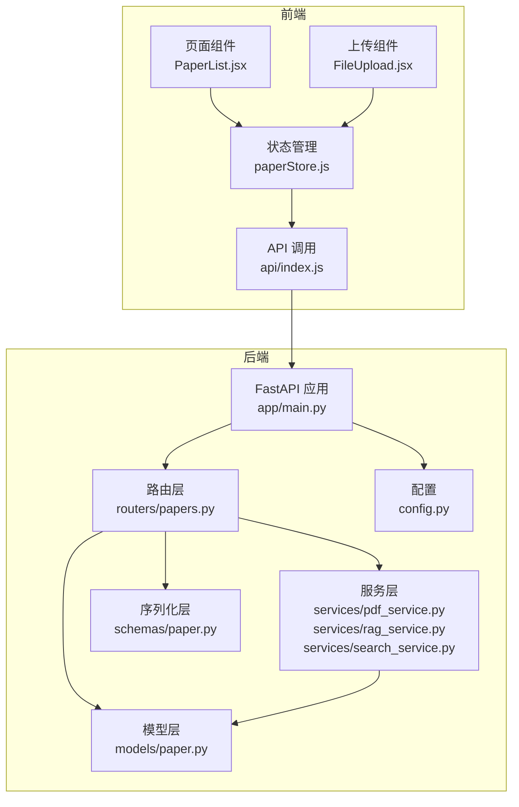
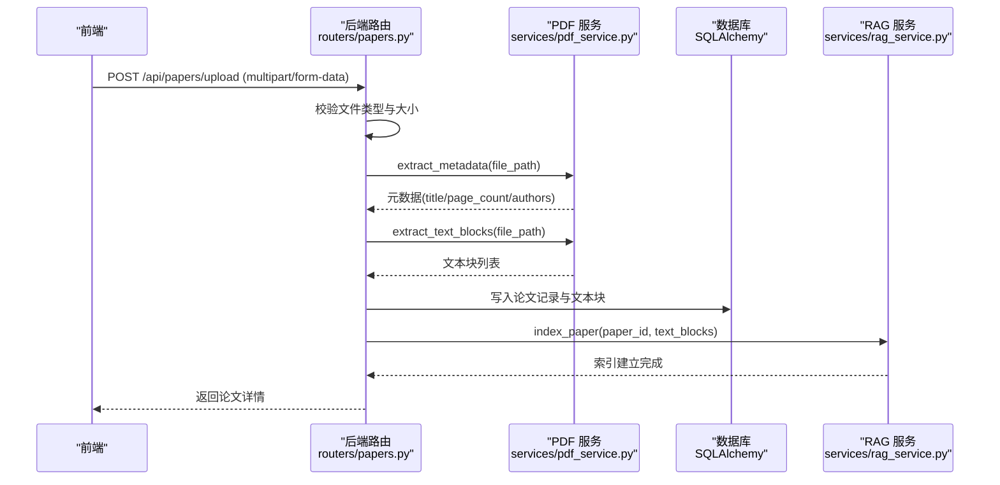
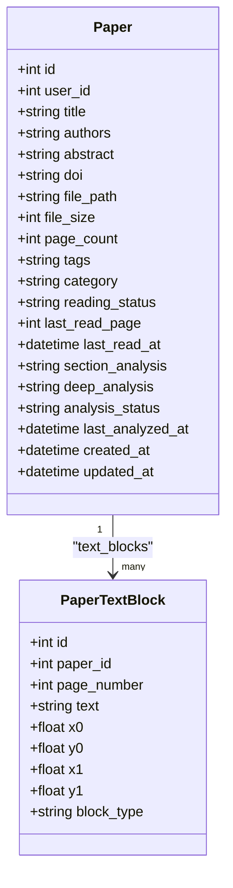
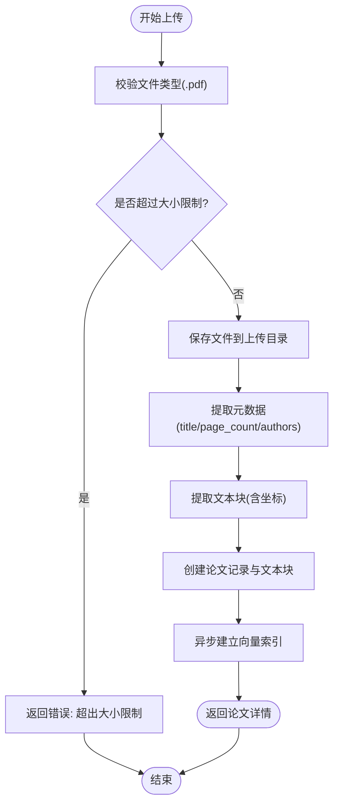
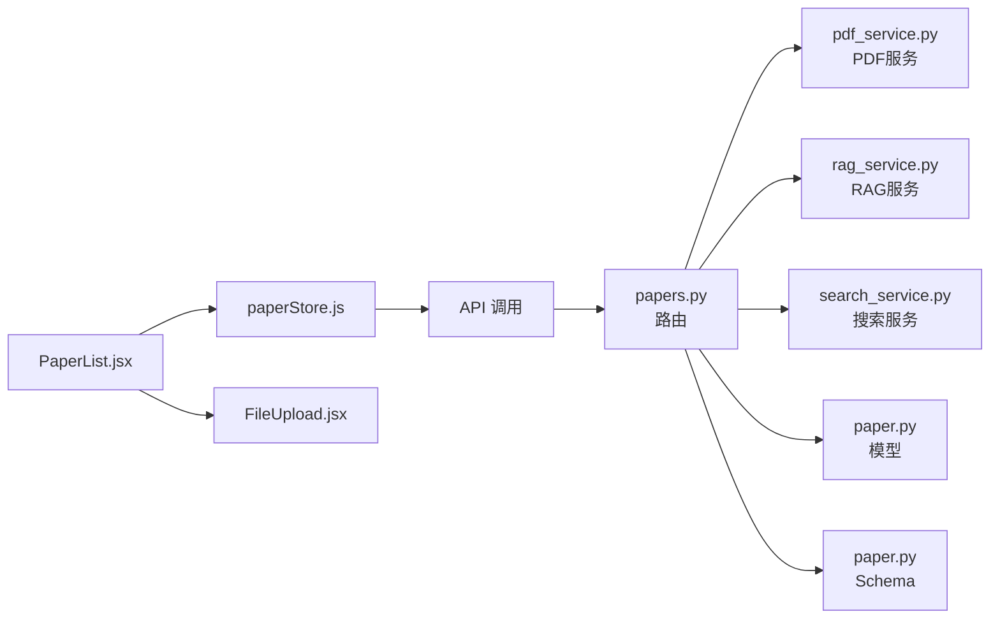

# 论文管理功能

<cite>
**本文引用的文件**
- [backend/app/models/paper.py](file://backend/app/models/paper.py)
- [backend/app/schemas/paper.py](file://backend/app/schemas/paper.py)
- [backend/app/routers/papers.py](file://backend/app/routers/papers.py)
- [backend/app/services/pdf_service.py](file://backend/app/services/pdf_service.py)
- [backend/app/services/rag_service.py](file://backend/app/services/rag_service.py)
- [backend/app/services/search_service.py](file://backend/app/services/search_service.py)
- [backend/app/handlers/analyze_handler.py](file://backend/app/handlers/analyze_handler.py)
- [backend/app/config.py](file://backend/app/config.py)
- [backend/app/main.py](file://backend/app/main.py)
- [frontend/src/pages/PaperList.jsx](file://frontend/src/pages/PaperList.jsx)
- [frontend/src/components/FileUpload/FileUpload.jsx](file://frontend/src/components/FileUpload/FileUpload.jsx)
- [frontend/src/stores/paperStore.js](file://frontend/src/stores/paperStore.js)
</cite>

## 目录
1. [简介](#简介)
2. [项目结构](#项目结构)
3. [核心组件](#核心组件)
4. [架构总览](#架构总览)
5. [详细组件分析](#详细组件分析)
6. [依赖关系分析](#依赖关系分析)
7. [性能考量](#性能考量)
8. [故障排查指南](#故障排查指南)
9. [结论](#结论)
10. [附录](#附录)

## 简介
本文件面向论文管理功能，系统性阐述 PDF 上传与解析的完整流程、论文存储机制、元数据管理、前端展示与交互、以及完整的 API 接口规范。重点覆盖：
- PDF 文件验证、格式转换、文本提取与元数据获取
- 文件系统与数据库的协同存储，以及向量索引的同步更新
- 论文元数据的数据模型与验证规则
- 论文列表展示、搜索过滤、排序的前端实现细节
- 完整的 API 接口文档与错误处理策略

## 项目结构
后端采用 FastAPI + SQLAlchemy + AsyncIO 架构，前端使用 React + Zustand 状态管理。论文管理模块位于 backend/app/routers/papers.py，配套服务层在 backend/app/services/，模型与序列化在 backend/app/models/ 与 backend/app/schemas/。

图表来源
- [backend/app/main.py:55-99](file://backend/app/main.py#L55-L99)
- [backend/app/routers/papers.py:30-31](file://backend/app/routers/papers.py#L30-L31)
- [backend/app/services/pdf_service.py:11-194](file://backend/app/services/pdf_service.py#L11-L194)
- [backend/app/services/rag_service.py:16-400](file://backend/app/services/rag_service.py#L16-L400)
- [backend/app/services/search_service.py:10-113](file://backend/app/services/search_service.py#L10-L113)
- [backend/app/models/paper.py:11-85](file://backend/app/models/paper.py#L11-L85)
- [backend/app/schemas/paper.py:7-83](file://backend/app/schemas/paper.py#L7-L83)
- [frontend/src/pages/PaperList.jsx:45-431](file://frontend/src/pages/PaperList.jsx#L45-L431)
- [frontend/src/components/FileUpload/FileUpload.jsx:6-92](file://frontend/src/components/FileUpload/FileUpload.jsx#L6-L92)
- [frontend/src/stores/paperStore.js:4-357](file://frontend/src/stores/paperStore.js#L4-L357)

章节来源
- [backend/app/main.py:16-53](file://backend/app/main.py#L16-L53)
- [backend/app/config.py:15-44](file://backend/app/config.py#L15-L44)

## 核心组件
- 论文模型与文本块模型：定义论文表、文本块表及关系，支撑元数据、分页、阅读状态、分析缓存等字段。
- 论文路由与处理器：提供上传、查询、更新、删除、文本提取、文件下载、批量上传等接口。
- PDF 服务：负责 PDF 元数据提取、文本块提取、全文提取、页数统计与有效性校验。
- RAG 服务：基于 ChromaDB 的向量索引与混合检索（语义 + BM25），支持跨论文检索与索引重建。
- 前端页面与状态管理：论文列表展示、搜索过滤、排序、上传与删除交互；通过 store 统一管理 API 调用与本地状态。

章节来源
- [backend/app/models/paper.py:11-85](file://backend/app/models/paper.py#L11-L85)
- [backend/app/schemas/paper.py:7-83](file://backend/app/schemas/paper.py#L7-L83)
- [backend/app/routers/papers.py:91-800](file://backend/app/routers/papers.py#L91-L800)
- [backend/app/services/pdf_service.py:11-194](file://backend/app/services/pdf_service.py#L11-L194)
- [backend/app/services/rag_service.py:16-400](file://backend/app/services/rag_service.py#L16-L400)
- [frontend/src/pages/PaperList.jsx:45-431](file://frontend/src/pages/PaperList.jsx#L45-L431)
- [frontend/src/stores/paperStore.js:4-357](file://frontend/src/stores/paperStore.js#L4-L357)

## 架构总览
论文管理功能的端到端流程如下：
- 前端触发上传，携带 PDF 文件与可选元数据
- 后端路由接收请求，进行文件类型与大小校验
- 调用 PDF 服务提取元数据与文本块
- 写入数据库论文记录与文本块明细
- 异步触发 RAG 服务建立向量索引
- 前端刷新列表并进入阅读态

图表来源
- [backend/app/routers/papers.py:156-262](file://backend/app/routers/papers.py#L156-L262)
- [backend/app/services/pdf_service.py:14-118](file://backend/app/services/pdf_service.py#L14-L118)
- [backend/app/services/rag_service.py:183-232](file://backend/app/services/rag_service.py#L183-L232)

## 详细组件分析

### 数据模型与元数据管理
- 论文模型包含标题、作者、摘要、DOI、文件路径、文件大小、页数、标签、分类、阅读状态、最后阅读页与时间、分析缓存字段等。
- 文本块模型记录每页文本块的坐标与类型，便于高亮与定位。
- 元数据提取优先从 PDF 元数据中读取，若缺失则从第一页文本中推断标题；页数通过 pdfplumber 获取；作者字段同样来自 PDF 元数据或推断。

图表来源
- [backend/app/models/paper.py:11-85](file://backend/app/models/paper.py#L11-L85)

章节来源
- [backend/app/models/paper.py:11-85](file://backend/app/models/paper.py#L11-L85)
- [backend/app/services/pdf_service.py:14-56](file://backend/app/services/pdf_service.py#L14-L56)

### PDF 上传与解析流程
- 文件验证：检查扩展名与大小上限（默认 50MB）
- 元数据提取：优先使用 PDF 元数据，其次从首页文本推断标题
- 文本块提取：按字符级别提取，按行合并，计算边界框
- 数据写入：创建论文记录与文本块明细
- 异步索引：后台任务建立向量索引，不阻塞上传响应

图表来源
- [backend/app/routers/papers.py:177-262](file://backend/app/routers/papers.py#L177-L262)
- [backend/app/services/pdf_service.py:14-118](file://backend/app/services/pdf_service.py#L14-L118)
- [backend/app/services/rag_service.py:183-232](file://backend/app/services/rag_service.py#L183-L232)

章节来源
- [backend/app/routers/papers.py:156-262](file://backend/app/routers/papers.py#L156-L262)
- [backend/app/services/pdf_service.py:14-118](file://backend/app/services/pdf_service.py#L14-L118)
- [backend/app/services/rag_service.py:183-232](file://backend/app/services/rag_service.py#L183-L232)

### 论文存储机制
- 文件系统：上传目录由配置决定，保存 PDF 文件并记录文件路径
- 数据库：论文与文本块分别持久化，文本块随论文级联删除
- 向量索引：每篇论文独立 collection，使用智能分块策略与嵌入模型编码，BM25 索引缓存提升检索效率

章节来源
- [backend/app/config.py:36-38](file://backend/app/config.py#L36-L38)
- [backend/app/models/paper.py:39-59](file://backend/app/models/paper.py#L39-L59)
- [backend/app/services/rag_service.py:95-232](file://backend/app/services/rag_service.py#L95-L232)

### 论文元数据管理
- 支持字段：标题、作者、摘要、DOI、标签、分类、阅读状态、最后阅读页与时间
- 标题优先级：用户提交 > PDF 元数据 > 首页文本 > 原始文件名
- 标签：以字符串形式存储（建议为 JSON 数组），前端渲染最多 4 个关键词标签
- 阅读状态：unread/reading/finished，支持标记与时间更新

章节来源
- [backend/app/schemas/paper.py:7-45](file://backend/app/schemas/paper.py#L7-L45)
- [backend/app/routers/papers.py:204-227](file://backend/app/routers/papers.py#L204-L227)
- [frontend/src/pages/PaperList.jsx:299-312](file://frontend/src/pages/PaperList.jsx#L299-L312)

### 前端实现细节
- 论文列表：支持搜索（标题/作者）、分类筛选、阅读状态筛选、分页与排序
- 上传组件：拖拽上传、进度显示、错误提示
- 状态管理：统一管理论文列表、当前论文、错误与加载状态，封装 CRUD 与推荐接口调用

章节来源
- [frontend/src/pages/PaperList.jsx:45-431](file://frontend/src/pages/PaperList.jsx#L45-L431)
- [frontend/src/components/FileUpload/FileUpload.jsx:6-92](file://frontend/src/components/FileUpload/FileUpload.jsx#L6-L92)
- [frontend/src/stores/paperStore.js:4-357](file://frontend/src/stores/paperStore.js#L4-L357)

### API 接口文档

- 列出论文
  - 方法与路径：GET /api/papers
  - 查询参数：
    - page: 页码（默认 1）
    - page_size: 每页数量（默认 20，范围 1-100）
    - search: 搜索关键词（模糊匹配标题/作者）
    - category: 分类筛选
    - reading_status: 阅读状态筛选
  - 响应：PaperListResponse（total, papers）

- 上传论文
  - 方法与路径：POST /api/papers/upload
  - 表单字段：
    - file: PDF 文件（必填）
    - title: 标题（可选）
    - category: 分类（可选）
    - tags: 标签（可选，逗号分隔）
  - 响应：PaperResponse

- 获取论文详情
  - 方法与路径：GET /api/papers/{paper_id}
  - 响应：PaperResponse

- 更新论文
  - 方法与路径：PUT /api/papers/{paper_id}
  - 请求体：PaperUpdate（可选字段）
  - 响应：PaperResponse

- 删除论文
  - 方法与路径：DELETE /api/papers/{paper_id}
  - 响应：204 No Content

- 获取论文文件
  - 方法与路径：GET /api/papers/{paper_id}/file
  - 响应：application/pdf 文件流

- 获取论文文本
  - 方法与路径：GET /api/papers/{paper_id}/text
  - 查询参数：page: 指定页码（可选）
  - 响应：{ text: string, page_count: int }

- 获取文本块
  - 方法与路径：GET /api/papers/{paper_id}/blocks
  - 查询参数：page: 指定页码（可选）
  - 响应：{ blocks: PaperTextBlockResponse[] }

- 批量上传（文件列表）
  - 方法与路径：POST /api/papers/batch-upload
  - 表单字段：files: PDF 文件列表
  - 响应：BatchUploadResponse（total, success, failed, results）

- 批量上传（ZIP）
  - 方法与路径：POST /api/papers/batch-upload-zip
  - 表单字段：file: ZIP 文件（内含 PDF）
  - 响应：BatchUploadResponse

- 标记阅读状态
  - 方法与路径：PATCH /api/papers/{paper_id}/reading-status
  - 请求体：{ status: "unread"|"reading"|"finished" }
  - 响应：{ message, reading_status, last_read_at }

章节来源
- [backend/app/routers/papers.py:91-800](file://backend/app/routers/papers.py#L91-L800)
- [backend/app/schemas/paper.py:7-83](file://backend/app/schemas/paper.py#L7-L83)

### 论文分析与检索
- 分析流程：异步调用 LLM 生成章节概述与深度分析，完成后通过 WebSocket 推送完成信号，并异步提取关键词
- 检索策略：语义检索（向量）与 BM25 关键词检索融合（RRF），支持跨论文检索与索引重建

章节来源
- [backend/app/handlers/analyze_handler.py:13-87](file://backend/app/handlers/analyze_handler.py#L13-L87)
- [backend/app/services/rag_service.py:233-336](file://backend/app/services/rag_service.py#L233-L336)

## 依赖关系分析

图表来源
- [backend/app/routers/papers.py:20-29](file://backend/app/routers/papers.py#L20-L29)
- [backend/app/services/pdf_service.py:11-194](file://backend/app/services/pdf_service.py#L11-L194)
- [backend/app/services/rag_service.py:16-400](file://backend/app/services/rag_service.py#L16-L400)
- [backend/app/services/search_service.py:10-113](file://backend/app/services/search_service.py#L10-L113)
- [backend/app/models/paper.py:11-85](file://backend/app/models/paper.py#L11-L85)
- [backend/app/schemas/paper.py:7-83](file://backend/app/schemas/paper.py#L7-L83)
- [frontend/src/pages/PaperList.jsx:45-431](file://frontend/src/pages/PaperList.jsx#L45-L431)
- [frontend/src/components/FileUpload/FileUpload.jsx:6-92](file://frontend/src/components/FileUpload/FileUpload.jsx#L6-L92)
- [frontend/src/stores/paperStore.js:4-357](file://frontend/src/stores/paperStore.js#L4-L357)

## 性能考量
- 异步处理：上传后立即返回，索引建立在后台任务中进行，避免阻塞
- 智能分块：按文本块边界与页码进行分块，减少噪声并提高检索质量
- BM25 缓存：首次构建后缓存索引，后续检索显著提速
- 线程池：Embedding 模型加载与编码在独立线程池执行，避免事件循环阻塞
- 搜索缓存：网络搜索结果缓存，降低重复请求成本

章节来源
- [backend/app/routers/papers.py:249-250](file://backend/app/routers/papers.py#L249-L250)
- [backend/app/services/rag_service.py:102-161](file://backend/app/services/rag_service.py#L102-L161)
- [backend/app/services/rag_service.py:163-182](file://backend/app/services/rag_service.py#L163-L182)
- [backend/app/services/rag_service.py:254-306](file://backend/app/services/rag_service.py#L254-L306)
- [backend/app/services/search_service.py:62-96](file://backend/app/services/search_service.py#L62-L96)

## 故障排查指南
- 上传失败
  - 检查文件类型与大小限制（默认 50MB）
  - 查看后端日志与异常处理，确认 PDF 服务是否抛出异常
- 索引建立失败
  - 确认 ChromaDB 持久化目录可写
  - 检查嵌入模型是否成功加载（首次加载较慢）
- 检索无结果
  - 确认论文是否已建立索引
  - 检查分块大小与重叠设置是否合理
- 前端无法显示论文
  - 检查路由权限与用户上下文
  - 确认分页参数与筛选条件

章节来源
- [backend/app/routers/papers.py:177-192](file://backend/app/routers/papers.py#L177-L192)
- [backend/app/services/rag_service.py:229-231](file://backend/app/services/rag_service.py#L229-L231)
- [backend/app/services/rag_service.py:337-353](file://backend/app/services/rag_service.py#L337-L353)

## 结论
论文管理功能通过“文件上传 + 元数据提取 + 文本块解析 + 数据库存储 + 向量索引”的完整链路，实现了高效、可扩展的论文管理与检索能力。前端提供直观的列表展示与交互体验，后端以异步与缓存策略保障性能与稳定性。建议在生产环境中进一步完善安全校验、监控告警与缓存清理策略。

## 附录

### 配置项说明
- APP_NAME: 应用名称
- DEBUG: 调试模式
- DATABASE_URL: 数据库连接（开发阶段使用 SQLite）
- UPLOAD_DIR: 上传目录
- MAX_FILE_SIZE: 文件大小限制（默认 50MB）
- CORS_ORIGINS: 允许的跨域来源

章节来源
- [backend/app/config.py:15-44](file://backend/app/config.py#L15-L44)