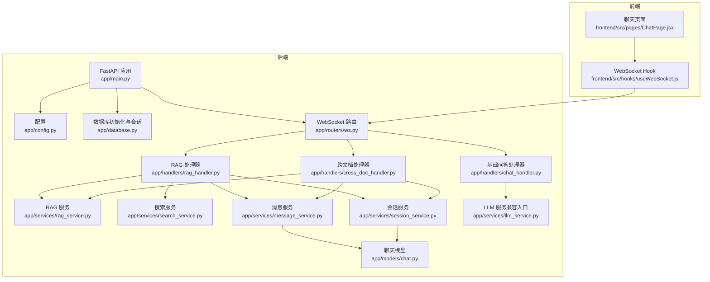
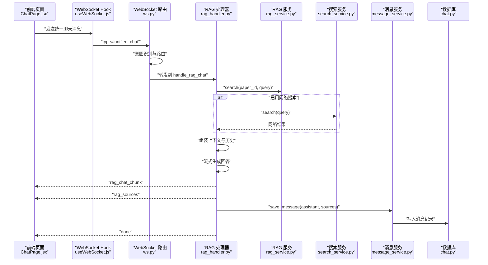
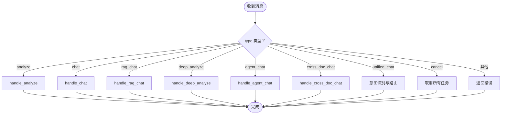
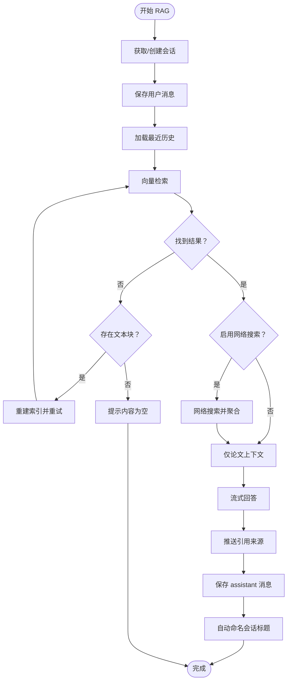
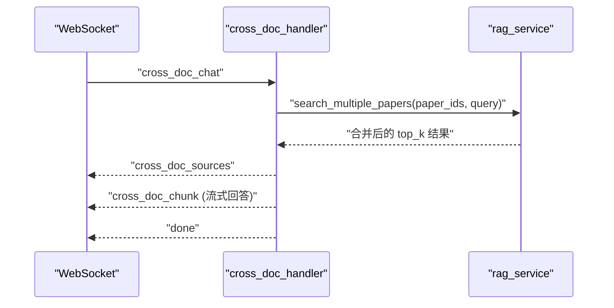
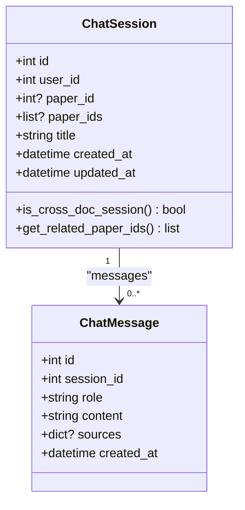
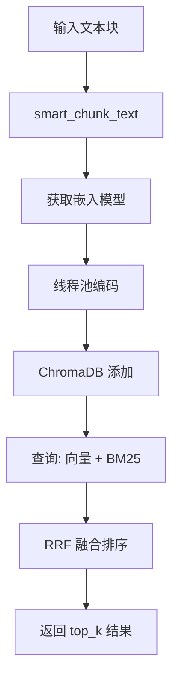
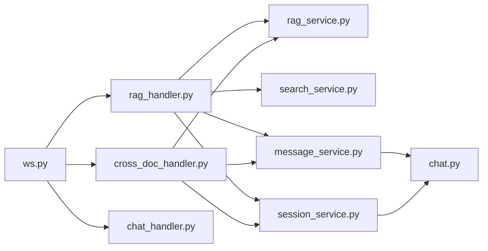

# 问答系统

<cite>
**本文档引用的文件**
- [backend/app/main.py](file://backend/app/main.py)
- [backend/app/config.py](file://backend/app/config.py)
- [backend/app/database.py](file://backend/app/database.py)
- [backend/app/routers/ws.py](file://backend/app/routers/ws.py)
- [backend/app/handlers/rag_handler.py](file://backend/app/handlers/rag_handler.py)
- [backend/app/handlers/cross_doc_handler.py](file://backend/app/handlers/cross_doc_handler.py)
- [backend/app/handlers/chat_handler.py](file://backend/app/handlers/chat_handler.py)
- [backend/app/services/rag_service.py](file://backend/app/services/rag_service.py)
- [backend/app/services/search_service.py](file://backend/app/services/search_service.py)
- [backend/app/services/message_service.py](file://backend/app/services/message_service.py)
- [backend/app/services/session_service.py](file://backend/app/services/session_service.py)
- [backend/app/services/llm_service.py](file://backend/app/services/llm_service.py)
- [backend/app/models/chat.py](file://backend/app/models/chat.py)
- [frontend/src/hooks/useWebSocket.js](file://frontend/src/hooks/useWebSocket.js)
- [frontend/src/pages/ChatPage.jsx](file://frontend/src/pages/ChatPage.jsx)
</cite>

## 目录
1. [简介](#简介)
2. [项目结构](#项目结构)
3. [核心组件](#核心组件)
4. [架构总览](#架构总览)
5. [详细组件分析](#详细组件分析)
6. [依赖分析](#依赖分析)
7. [性能考虑](#性能考虑)
8. [故障排查指南](#故障排查指南)
9. [结论](#结论)
10. [附录](#附录)

## 简介
本问答系统采用“检索增强生成”（RAG）架构，结合本地论文向量检索与可选的网络搜索，提供实时、可溯源的智能问答能力。系统通过 WebSocket 实现实时通信，支持会话持久化、多轮对话理解、跨文档问答与引用溯源，并提供统一聊天入口以根据用户意图自动路由到合适的处理流程。

## 项目结构
后端基于 FastAPI，采用异步 SQLAlchemy、LangChain 与 ChromaDB，前端基于 React + Vite。整体采用“路由-处理器-服务-模型”的分层设计，WebSocket 路由集中处理多种消息类型，分别委派至对应的处理器与服务。

**图表来源**
- [backend/app/main.py:55-95](file://backend/app/main.py#L55-L95)
- [backend/app/routers/ws.py:76-436](file://backend/app/routers/ws.py#L76-L436)
- [backend/app/services/rag_service.py:16-400](file://backend/app/services/rag_service.py#L16-L400)
- [backend/app/services/search_service.py:10-113](file://backend/app/services/search_service.py#L10-L113)
- [backend/app/services/message_service.py:1-72](file://backend/app/services/message_service.py#L1-L72)
- [backend/app/services/session_service.py:1-134](file://backend/app/services/session_service.py#L1-L134)
- [backend/app/models/chat.py:14-71](file://backend/app/models/chat.py#L14-L71)
- [frontend/src/hooks/useWebSocket.js:1-180](file://frontend/src/hooks/useWebSocket.js#L1-L180)
- [frontend/src/pages/ChatPage.jsx:1-434](file://frontend/src/pages/ChatPage.jsx#L1-L434)

**章节来源**
- [backend/app/main.py:55-95](file://backend/app/main.py#L55-L95)
- [backend/app/routers/ws.py:76-102](file://backend/app/routers/ws.py#L76-L102)

## 核心组件
- WebSocket 路由与状态管理：统一接收消息、校验令牌、分发到具体处理器，并维护连接状态与运行中的任务。
- RAG 处理器：整合论文向量检索、可选网络搜索、上下文组装与流式回答生成，同时保存消息与会话标题自动命名。
- 跨文档处理器：对多篇论文执行并行检索与结果融合，支持跨文档引用溯源。
- RAG 服务：基于 ChromaDB 的向量检索与 BM25 混合检索，支持分块、重排与索引重建。
- 搜索服务：基于 DuckDuckGo 的网络搜索，具备超时控制与缓存。
- 会话与消息服务：会话创建与标题管理、历史加载与消息持久化。
- 前端 WebSocket Hook：统一连接、消息收发、重连与事件订阅。

**章节来源**
- [backend/app/routers/ws.py:56-74](file://backend/app/routers/ws.py#L56-L74)
- [backend/app/handlers/rag_handler.py:29-217](file://backend/app/handlers/rag_handler.py#L29-L217)
- [backend/app/handlers/cross_doc_handler.py:14-95](file://backend/app/handlers/cross_doc_handler.py#L14-L95)
- [backend/app/services/rag_service.py:16-400](file://backend/app/services/rag_service.py#L16-L400)
- [backend/app/services/search_service.py:10-113](file://backend/app/services/search_service.py#L10-L113)
- [backend/app/services/session_service.py:17-54](file://backend/app/services/session_service.py#L17-L54)
- [backend/app/services/message_service.py:24-55](file://backend/app/services/message_service.py#L24-L55)
- [frontend/src/hooks/useWebSocket.js:19-71](file://frontend/src/hooks/useWebSocket.js#L19-L71)

## 架构总览
系统采用“实时通信 + 检索增强 + 会话持久化”的整体架构。WebSocket 负责消息编解码与事件分发；处理器负责业务流程编排；服务层负责检索、搜索与消息持久化；模型层负责数据库表结构与关系。

**图表来源**
- [backend/app/routers/ws.py:262-417](file://backend/app/routers/ws.py#L262-L417)
- [backend/app/handlers/rag_handler.py:29-217](file://backend/app/handlers/rag_handler.py#L29-L217)
- [backend/app/services/rag_service.py:233-307](file://backend/app/services/rag_service.py#L233-L307)
- [backend/app/services/search_service.py:41-104](file://backend/app/services/search_service.py#L41-L104)
- [backend/app/services/message_service.py:45-55](file://backend/app/services/message_service.py#L45-L55)
- [backend/app/models/chat.py:53-71](file://backend/app/models/chat.py#L53-L71)

## 详细组件分析

### WebSocket 路由与消息协议
- 连接与认证：支持 JWT 令牌校验，未提供令牌时降级为默认用户。
- 消息类型与负载：
  - 分析论文：{"type":"analyze","text":"...","paper_id":N}
  - 问答：{"type":"chat","message":"..."}
  - RAG问答：{"type":"rag_chat","message":"...","paper_id":N,"session_id":M,"user_id":K,"enable_search":bool}
  - 跨文档问答：{"type":"cross_doc_chat","message":"...","paper_ids":[],"session_id":M,"user_id":K}
  - 深度分析：{"type":"deep_analyze","text":"...","paper_id":N}
  - Agent问答：{"type":"agent_chat","message":"...","paper_id":N,"paper_ids":[]}
  - 统一聊天：{"type":"unified_chat","message":"...","paper_id":N,"paper_ids":[],"session_id":M,"enable_search":bool}
  - 取消：{"type":"cancel"}
- 响应类型：
  - 片段：analyze_chunk、chat_chunk、rag_chat_chunk、cross_doc_chunk
  - 引用：rag_sources、cross_doc_sources
  - 搜索状态：search_status
  - 完成：done(channel, session_id)
  - 错误：error(message)

**图表来源**
- [backend/app/routers/ws.py:114-436](file://backend/app/routers/ws.py#L114-L436)

**章节来源**
- [backend/app/routers/ws.py:76-102](file://backend/app/routers/ws.py#L76-L102)
- [backend/app/routers/ws.py:114-436](file://backend/app/routers/ws.py#L114-L436)

### RAG 问答流程与上下文匹配
- 会话管理：获取或创建会话，保存用户消息，加载最近历史，自动命名会话标题。
- 检索策略：优先使用论文向量检索，若无结果则检查是否存在文本块；如存在但无索引则重建索引后重试；若仍无结果则提示用户。
- 网络搜索：可选开启，推送搜索状态，聚合论文与网络上下文，使用专用系统提示词。
- 上下文组装：将检索到的论文片段与网络结果拼接为上下文，附加页码与来源信息。
- 回答生成：流式调用 LLM，逐片断推送回答，最后推送引用来源，保存 assistant 消息与会话标题。

**图表来源**
- [backend/app/handlers/rag_handler.py:29-217](file://backend/app/handlers/rag_handler.py#L29-L217)

**章节来源**
- [backend/app/handlers/rag_handler.py:29-217](file://backend/app/handlers/rag_handler.py#L29-L217)

### 跨文档问答实现策略
- 多论文并行检索：对 paper_ids 列表并行执行检索，聚合结果后按分数排序。
- 引用溯源：为每条结果附带 paper_id 与页码，前端渲染跨文档来源。
- 会话扩展：跨文档会话在模型中通过 JSON 字段存储 paper_ids，区分单论文与多论文场景。

**图表来源**
- [backend/app/handlers/cross_doc_handler.py:14-95](file://backend/app/handlers/cross_doc_handler.py#L14-L95)
- [backend/app/services/rag_service.py:308-336](file://backend/app/services/rag_service.py#L308-L336)
- [backend/app/models/chat.py:40-51](file://backend/app/models/chat.py#L40-L51)

**章节来源**
- [backend/app/handlers/cross_doc_handler.py:14-95](file://backend/app/handlers/cross_doc_handler.py#L14-L95)
- [backend/app/services/rag_service.py:308-336](file://backend/app/services/rag_service.py#L308-L336)
- [backend/app/models/chat.py:40-51](file://backend/app/models/chat.py#L40-L51)

### 会话管理机制
- 会话创建：根据 session_id 与 user_id 查找或创建会话，支持单论文与多论文场景。
- 历史加载：按时间倒序加载最近 N 条消息，转换为 LangChain 的 ChatMessageHistory。
- 标题自动命名：在前两条消息且标题为默认值时，以用户第一条消息截断命名。
- 消息持久化：保存用户与助手消息，助手消息附带引用来源。

**图表来源**
- [backend/app/models/chat.py:14-71](file://backend/app/models/chat.py#L14-L71)

**章节来源**
- [backend/app/services/session_service.py:17-54](file://backend/app/services/session_service.py#L17-L54)
- [backend/app/services/message_service.py:24-55](file://backend/app/services/message_service.py#L24-L55)
- [backend/app/models/chat.py:14-71](file://backend/app/models/chat.py#L14-L71)

### 向量检索与混合检索
- 分块策略：按目标长度与重叠长度切分文本块，保留页码元数据。
- 向量编码：延迟加载嵌入模型，使用线程池异步执行编码。
- 检索融合：语义检索（向量）与 BM25 关键词检索使用 RRF 融合排序。
- 索引管理：支持重建索引、删除索引与状态查询；BM25 索引缓存提升性能。

**图表来源**
- [backend/app/services/rag_service.py:102-162](file://backend/app/services/rag_service.py#L102-L162)
- [backend/app/services/rag_service.py:233-307](file://backend/app/services/rag_service.py#L233-L307)

**章节来源**
- [backend/app/services/rag_service.py:16-400](file://backend/app/services/rag_service.py#L16-L400)

### 网络搜索与错误恢复
- 搜索服务：基于 DuckDuckGo，支持超时控制与结果缓存，确保稳定性。
- 错误恢复：WebSocket 层捕获异常并返回错误消息；前端 Hook 提供自动重连与状态通知。

**章节来源**
- [backend/app/services/search_service.py:10-113](file://backend/app/services/search_service.py#L10-L113)
- [frontend/src/hooks/useWebSocket.js:19-71](file://frontend/src/hooks/useWebSocket.js#L19-L71)

## 依赖分析
- 组件耦合：WebSocket 路由与处理器松耦合，通过消息类型分发；处理器依赖服务层；服务层依赖模型与数据库。
- 外部依赖：ChromaDB（向量存储）、sentence-transformers（嵌入）、rank_bm25（BM25）、DuckDuckGo 搜索、FastAPI/LangChain。

**图表来源**
- [backend/app/routers/ws.py:23-27](file://backend/app/routers/ws.py#L23-L27)
- [backend/app/handlers/rag_handler.py:10-17](file://backend/app/handlers/rag_handler.py#L10-L17)
- [backend/app/handlers/cross_doc_handler.py:8-12](file://backend/app/handlers/cross_doc_handler.py#L8-L12)
- [backend/app/services/message_service.py:10-11](file://backend/app/services/message_service.py#L10-L11)
- [backend/app/services/session_service.py:13-14](file://backend/app/services/session_service.py#L13-L14)
- [backend/app/models/chat.py:11](file://backend/app/models/chat.py#L11)

**章节来源**
- [backend/app/routers/ws.py:23-27](file://backend/app/routers/ws.py#L23-L27)
- [backend/app/handlers/rag_handler.py:10-17](file://backend/app/handlers/rag_handler.py#L10-L17)
- [backend/app/handlers/cross_doc_handler.py:8-12](file://backend/app/handlers/cross_doc_handler.py#L8-L12)
- [backend/app/services/message_service.py:10-11](file://backend/app/services/message_service.py#L10-L11)
- [backend/app/services/session_service.py:13-14](file://backend/app/services/session_service.py#L13-L14)
- [backend/app/models/chat.py:11](file://backend/app/models/chat.py#L11)

## 性能考虑
- 检索性能
  - 向量检索：合理设置 top_k，避免过大导致排序开销；BM25 索引缓存减少重复构建。
  - 分块策略：适当增大 chunk_size 与 chunk_overlap 可提升召回，但会增加向量化成本。
- 模型加载
  - 嵌入模型懒加载与线程池执行，避免阻塞事件循环。
- I/O 与并发
  - 多论文检索使用 asyncio.gather 并行执行，降低总延迟。
- 前端体验
  - 虚拟列表渲染消息列表，减少 DOM 压力；流式回答逐步渲染，提升感知速度。
- 数据库
  - 事务性提交与回滚，确保消息一致性；索引字段 user_id、session_id、paper_id 提升查询效率。

[本节为通用性能建议，无需特定文件引用]

## 故障排查指南
- WebSocket 连接失败
  - 检查前端 Hook 的重连逻辑与状态监听；确认后端路由 /ws 可达。
- RAG 无结果
  - 确认论文已解析并存在文本块；若无索引，等待重建索引后重试。
- 网络搜索异常
  - 检查超时设置与缓存；必要时清理缓存后重试。
- 会话消息缺失
  - 核对消息持久化逻辑与数据库连接；检查 ChatMessageHistory 的加载顺序。

**章节来源**
- [frontend/src/hooks/useWebSocket.js:19-71](file://frontend/src/hooks/useWebSocket.js#L19-L71)
- [backend/app/handlers/rag_handler.py:48-90](file://backend/app/handlers/rag_handler.py#L48-L90)
- [backend/app/services/search_service.py:62-104](file://backend/app/services/search_service.py#L62-L104)
- [backend/app/services/message_service.py:24-55](file://backend/app/services/message_service.py#L24-L55)

## 结论
该问答系统通过 RAG 架构实现了“可解释、可溯源”的智能问答，结合会话管理与跨文档能力，满足学术论文阅读与多源信息整合的需求。WebSocket 实时通信与前端虚拟渲染提供了流畅的交互体验。后续可在检索融合策略、缓存命中率与前端交互细节上进一步优化。

[本节为总结性内容，无需特定文件引用]

## 附录

### API 接口文档（WebSocket）
- 端点：/ws
- 支持的消息类型与负载
  - analyze: {"type":"analyze","text":"...","paper_id":N}
  - chat: {"type":"chat","message":"..."}
  - rag_chat: {"type":"rag_chat","message":"...","paper_id":N,"session_id":M,"user_id":K,"enable_search":bool}
  - cross_doc_chat: {"type":"cross_doc_chat","message":"...","paper_ids":[],"session_id":M,"user_id":K}
  - deep_analyze: {"type":"deep_analyze","text":"...","paper_id":N}
  - agent_chat: {"type":"agent_chat","message":"...","paper_id":N,"paper_ids":[]}
  - unified_chat: {"type":"unified_chat","message":"...","paper_id":N,"paper_ids":[],"session_id":M,"enable_search":bool}
  - cancel: {"type":"cancel"}
- 响应类型
  - analyze_chunk、chat_chunk、rag_chat_chunk、cross_doc_chunk
  - rag_sources、cross_doc_sources
  - search_status
  - done(channel, session_id)
  - error(message)

**章节来源**
- [backend/app/routers/ws.py:76-102](file://backend/app/routers/ws.py#L76-L102)
- [backend/app/routers/ws.py:114-436](file://backend/app/routers/ws.py#L114-L436)

### 前端组件集成示例
- 使用 WebSocket Hook
  - 连接与状态：status
  - 发送消息：sendRagMessage、sendCrossDocMessage、sendUnifiedChatMessage、sendCancel
  - 订阅事件：onMessage(type, handler) 或 onMessage(handler)
- 聊天页面
  - 通过 useWebSocket 获取连接状态与消息回调，结合虚拟列表与打字机效果渲染回答流。

**章节来源**
- [frontend/src/hooks/useWebSocket.js:84-179](file://frontend/src/hooks/useWebSocket.js#L84-L179)
- [frontend/src/pages/ChatPage.jsx:58-133](file://frontend/src/pages/ChatPage.jsx#L58-L133)

### 最佳实践指南
- 检索与索引
  - 合理设置分块大小与重叠，平衡召回与性能。
  - 对新增论文及时重建索引，确保检索可用。
- 会话与溯源
  - 为每条回答附带引用来源，便于用户核验。
  - 自动命名会话标题，提升用户体验。
- 实时通信
  - 前端监听连接状态，提供重连与错误提示。
  - 后端对异常进行捕获并返回明确错误信息。

[本节为通用实践建议，无需特定文件引用]