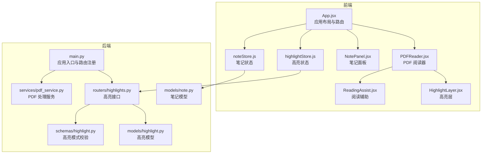
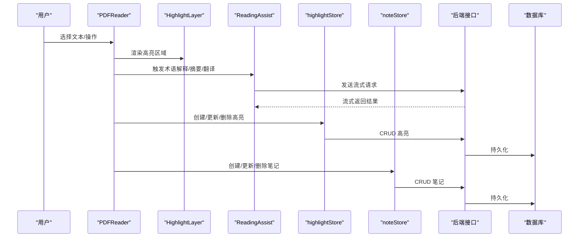
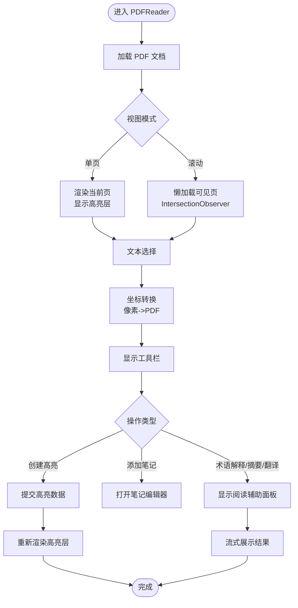
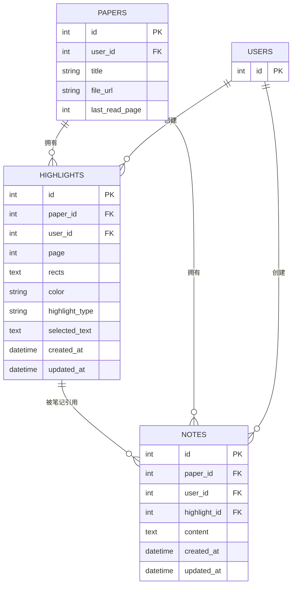
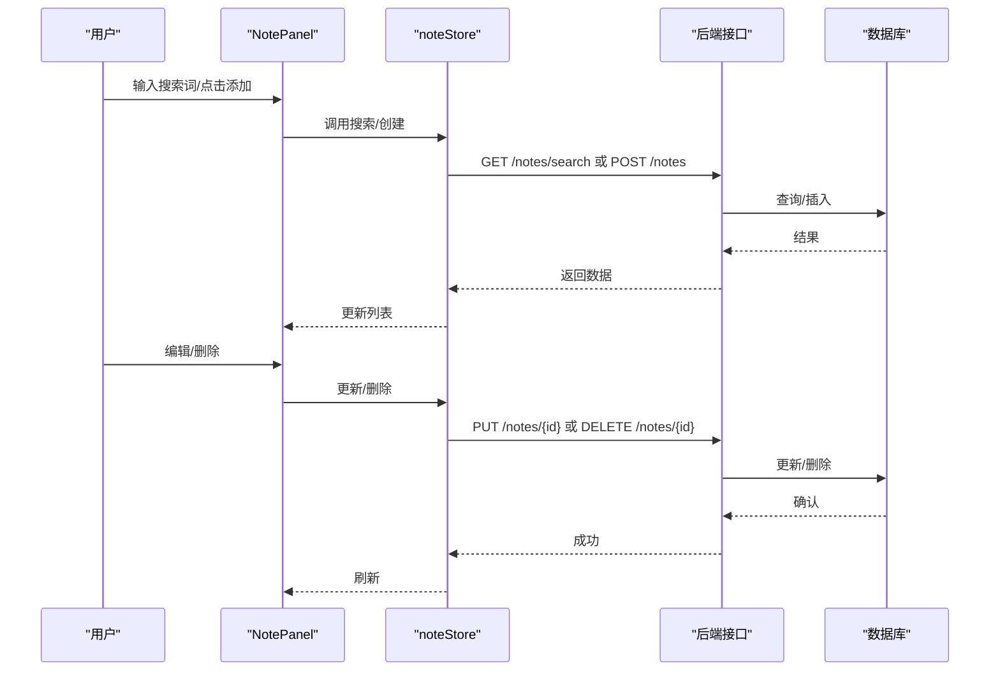
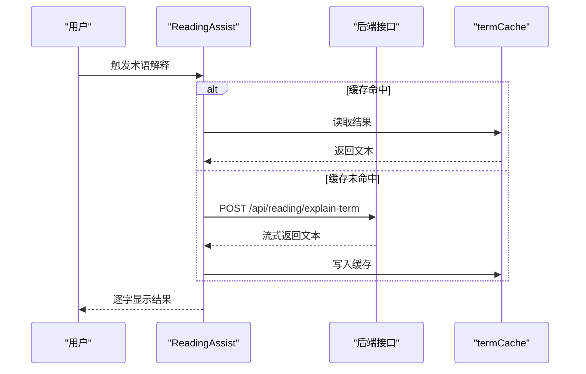
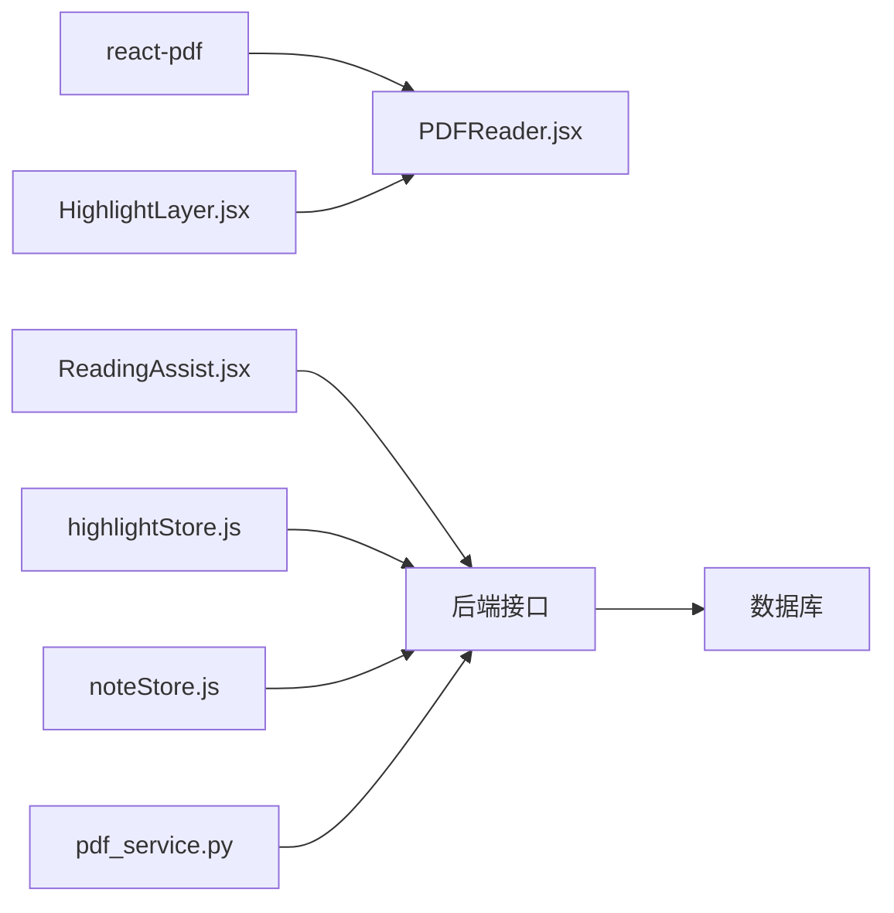

# 阅读辅助功能

<cite>
**本文引用的文件**
- [backend/app/main.py](file://backend/app/main.py)
- [frontend/src/App.jsx](file://frontend/src/App.jsx)
- [frontend/src/components/PDFReader/PDFReader.jsx](file://frontend/src/components/PDFReader/PDFReader.jsx)
- [frontend/src/components/PDFViewer/PDFViewer.jsx](file://frontend/src/components/PDFViewer/PDFViewer.jsx)
- [frontend/src/components/HighlightLayer/HighlightLayer.jsx](file://frontend/src/components/HighlightLayer/HighlightLayer.jsx)
- [frontend/src/components/NotePanel/NotePanel.jsx](file://frontend/src/components/NotePanel/NotePanel.jsx)
- [frontend/src/components/ReadingAssist/ReadingAssist.jsx](file://frontend/src/components/ReadingAssist/ReadingAssist.jsx)
- [frontend/src/stores/highlightStore.js](file://frontend/src/stores/highlightStore.js)
- [frontend/src/stores/noteStore.js](file://frontend/src/stores/noteStore.js)
- [backend/app/models/highlight.py](file://backend/app/models/highlight.py)
- [backend/app/routers/highlights.py](file://backend/app/routers/highlights.py)
- [backend/app/schemas/highlight.py](file://backend/app/schemas/highlight.py)
- [backend/app/models/note.py](file://backend/app/models/note.py)
- [backend/app/services/pdf_service.py](file://backend/app/services/pdf_service.py)
</cite>

## 目录
1. [简介](#简介)
2. [项目结构](#项目结构)
3. [核心组件](#核心组件)
4. [架构总览](#架构总览)
5. [详细组件分析](#详细组件分析)
6. [依赖关系分析](#依赖关系分析)
7. [性能考量](#性能考量)
8. [故障排查指南](#故障排查指南)
9. [结论](#结论)
10. [附录](#附录)

## 简介
本技术文档聚焦于阅读辅助功能的实现，涵盖 PDF 阅读器架构（基于 react-pdf 与 PDF.js）、页面渲染与缩放控制、导航机制；高亮标注系统的坐标计算、区域选择、样式管理与持久化；笔记管理的富文本编辑、分类组织、全文搜索与同步；术语解释与翻译的术语库管理、上下文感知与实时查询；以及阅读进度跟踪、书签管理与个性化设置的实现要点。文档同时提供前端组件 API 与状态管理实现示例，帮助开发者快速理解与扩展。

## 项目结构
项目采用前后端分离架构：
- 前端使用 React + Vite，组件化设计，状态通过 Zustand 管理，PDF 阅读集成 react-pdf。
- 后端使用 FastAPI，提供高亮、笔记、阅读辅助等接口，PDF 文本与元数据处理由 pdfplumber 提供。

**图表来源**
- [frontend/src/App.jsx:1-1010](file://frontend/src/App.jsx#L1-L1010)
- [frontend/src/components/PDFReader/PDFReader.jsx:1-656](file://frontend/src/components/PDFReader/PDFReader.jsx#L1-L656)
- [frontend/src/components/HighlightLayer/HighlightLayer.jsx:1-119](file://frontend/src/components/HighlightLayer/HighlightLayer.jsx#L1-L119)
- [frontend/src/components/NotePanel/NotePanel.jsx:1-275](file://frontend/src/components/NotePanel/NotePanel.jsx#L1-L275)
- [frontend/src/components/ReadingAssist/ReadingAssist.jsx:1-309](file://frontend/src/components/ReadingAssist/ReadingAssist.jsx#L1-L309)
- [frontend/src/stores/highlightStore.js:1-102](file://frontend/src/stores/highlightStore.js#L1-L102)
- [frontend/src/stores/noteStore.js:1-145](file://frontend/src/stores/noteStore.js#L1-L145)
- [backend/app/main.py:1-114](file://backend/app/main.py#L1-L114)
- [backend/app/routers/highlights.py:1-189](file://backend/app/routers/highlights.py#L1-L189)
- [backend/app/models/highlight.py:1-37](file://backend/app/models/highlight.py#L1-L37)
- [backend/app/schemas/highlight.py:1-37](file://backend/app/schemas/highlight.py#L1-L37)
- [backend/app/models/note.py:1-34](file://backend/app/models/note.py#L1-L34)
- [backend/app/services/pdf_service.py:1-194](file://backend/app/services/pdf_service.py#L1-L194)

**章节来源**
- [backend/app/main.py:1-114](file://backend/app/main.py#L1-L114)
- [frontend/src/App.jsx:1-1010](file://frontend/src/App.jsx#L1-L1010)

## 核心组件
- PDF 阅读器：负责 PDF 加载、页面渲染、缩放控制、键盘导航、文本选择与高亮工具栏、阅读辅助面板集成。
- 高亮层：在 PDF 页面上叠加绝对定位层，渲染高亮区域，支持多种高亮样式与点击交互。
- 笔记面板：展示论文笔记列表，支持搜索、展开折叠、编辑与删除。
- 阅读辅助：提供术语解释、文本摘要、翻译的流式展示与缓存。
- 状态管理：Zustand store 管理高亮与笔记的 CRUD、搜索与活跃项状态。

**章节来源**
- [frontend/src/components/PDFReader/PDFReader.jsx:1-656](file://frontend/src/components/PDFReader/PDFReader.jsx#L1-L656)
- [frontend/src/components/HighlightLayer/HighlightLayer.jsx:1-119](file://frontend/src/components/HighlightLayer/HighlightLayer.jsx#L1-L119)
- [frontend/src/components/NotePanel/NotePanel.jsx:1-275](file://frontend/src/components/NotePanel/NotePanel.jsx#L1-L275)
- [frontend/src/components/ReadingAssist/ReadingAssist.jsx:1-309](file://frontend/src/components/ReadingAssist/ReadingAssist.jsx#L1-L309)
- [frontend/src/stores/highlightStore.js:1-102](file://frontend/src/stores/highlightStore.js#L1-L102)
- [frontend/src/stores/noteStore.js:1-145](file://frontend/src/stores/noteStore.js#L1-L145)

## 架构总览
前端通过 react-pdf 与 PDF.js Worker 渲染 PDF，高亮与笔记数据通过 API 与后端交互，阅读辅助通过流式接口实时展示结果。后端提供高亮与笔记的增删改查接口，并通过 pdfplumber 提供 PDF 元数据与文本提取能力。

**图表来源**
- [frontend/src/components/PDFReader/PDFReader.jsx:1-656](file://frontend/src/components/PDFReader/PDFReader.jsx#L1-L656)
- [frontend/src/components/HighlightLayer/HighlightLayer.jsx:1-119](file://frontend/src/components/HighlightLayer/HighlightLayer.jsx#L1-L119)
- [frontend/src/components/ReadingAssist/ReadingAssist.jsx:1-309](file://frontend/src/components/ReadingAssist/ReadingAssist.jsx#L1-L309)
- [frontend/src/stores/highlightStore.js:1-102](file://frontend/src/stores/highlightStore.js#L1-L102)
- [frontend/src/stores/noteStore.js:1-145](file://frontend/src/stores/noteStore.js#L1-L145)
- [backend/app/routers/highlights.py:1-189](file://backend/app/routers/highlights.py#L1-L189)

## 详细组件分析

### PDF 阅读器组件分析
- PDF.js 集成：通过 react-pdf 的 Document/ Page 渲染 PDF，设置 worker 源为 CDN 版本。
- 页面渲染与缩放：支持单页与滚动两种视图模式，缩放范围与自适应宽度计算。
- 导航机制：键盘方向键与 Home/End 快捷键，页码输入跳转，平滑滚动到目标页面。
- 文本选择与坐标转换：利用 Selection API 获取选区，结合页面尺寸与缩放比例将像素坐标转换为 PDF 坐标，生成高亮区域数组。
- 高亮工具栏与阅读辅助：根据选区位置显示工具栏，支持创建高亮、添加笔记、术语解释、摘要与翻译。

**图表来源**
- [frontend/src/components/PDFReader/PDFReader.jsx:1-656](file://frontend/src/components/PDFReader/PDFReader.jsx#L1-L656)

**章节来源**
- [frontend/src/components/PDFReader/PDFReader.jsx:1-656](file://frontend/src/components/PDFReader/PDFReader.jsx#L1-L656)

### 高亮标注系统
- 坐标计算：前端将浏览器选区矩形转换为 PDF 坐标系，考虑缩放比例与 Y 轴翻转。
- 区域选择：将多个矩形合并为高亮区域，序列化为 JSON 字符串存储。
- 样式管理：支持高亮、下划线、删除线三种样式，激活态高亮透明度更高。
- 持久化存储：后端提供高亮的增删改查接口，模型包含颜色、类型、所属页码与关联笔记。

**图表来源**
- [backend/app/models/highlight.py:1-37](file://backend/app/models/highlight.py#L1-L37)
- [backend/app/models/note.py:1-34](file://backend/app/models/note.py#L1-L34)

**章节来源**
- [frontend/src/components/HighlightLayer/HighlightLayer.jsx:1-119](file://frontend/src/components/HighlightLayer/HighlightLayer.jsx#L1-L119)
- [backend/app/routers/highlights.py:1-189](file://backend/app/routers/highlights.py#L1-L189)
- [backend/app/models/highlight.py:1-37](file://backend/app/models/highlight.py#L1-L37)
- [backend/app/schemas/highlight.py:1-37](file://backend/app/schemas/highlight.py#L1-L37)

### 笔记管理功能
- 富文本编辑：笔记内容以纯文本形式存储，支持在编辑器中进行富文本编辑（前端编辑器组件未在本文档中展开）。
- 分类组织：按论文与高亮关联，支持按时间排序与活跃项高亮。
- 全文搜索：前端提供搜索过滤，后端提供搜索接口（store 中定义）。
- 同步机制：Zustand store 与后端 API 双向同步，创建/更新/删除后刷新本地状态。

**图表来源**
- [frontend/src/components/NotePanel/NotePanel.jsx:1-275](file://frontend/src/components/NotePanel/NotePanel.jsx#L1-L275)
- [frontend/src/stores/noteStore.js:1-145](file://frontend/src/stores/noteStore.js#L1-L145)

**章节来源**
- [frontend/src/components/NotePanel/NotePanel.jsx:1-275](file://frontend/src/components/NotePanel/NotePanel.jsx#L1-L275)
- [frontend/src/stores/noteStore.js:1-145](file://frontend/src/stores/noteStore.js#L1-L145)

### 术语解释与翻译功能
- 术语库管理：术语解释结果具备内存缓存，相同术语重复查询时直接命中缓存。
- 上下文感知：术语解释携带上下文文本，提高解释准确性。
- 实时查询：通过流式接口接收增量结果，逐字显示增强用户体验。

**图表来源**
- [frontend/src/components/ReadingAssist/ReadingAssist.jsx:1-309](file://frontend/src/components/ReadingAssist/ReadingAssist.jsx#L1-L309)

**章节来源**
- [frontend/src/components/ReadingAssist/ReadingAssist.jsx:1-309](file://frontend/src/components/ReadingAssist/ReadingAssist.jsx#L1-L309)

### 阅读进度跟踪、书签管理与个性化设置
- 阅读进度：后端模型包含最后阅读页字段，前端在加载论文时恢复阅读进度。
- 书签管理：高亮与笔记均可作为书签的载体，高亮支持点击跳转至对应页面。
- 个性化设置：应用启动时加载默认用户配置并应用（见应用入口）。

**章节来源**
- [backend/app/models/highlight.py:1-37](file://backend/app/models/highlight.py#L1-L37)
- [backend/app/main.py:1-114](file://backend/app/main.py#L1-L114)

## 依赖关系分析
- 前端依赖：react-pdf 与 PDF.js Worker；Zustand 管理状态；自定义组件与模块样式。
- 后端依赖：SQLAlchemy ORM、FastAPI 路由与 Pydantic 模型校验；pdfplumber 用于 PDF 文本与元数据提取。
- 数据一致性：高亮与笔记均通过用户与论文外键约束，确保数据隔离与级联删除。

**图表来源**
- [frontend/src/components/PDFReader/PDFReader.jsx:1-656](file://frontend/src/components/PDFReader/PDFReader.jsx#L1-L656)
- [frontend/src/components/HighlightLayer/HighlightLayer.jsx:1-119](file://frontend/src/components/HighlightLayer/HighlightLayer.jsx#L1-L119)
- [frontend/src/components/ReadingAssist/ReadingAssist.jsx:1-309](file://frontend/src/components/ReadingAssist/ReadingAssist.jsx#L1-L309)
- [frontend/src/stores/highlightStore.js:1-102](file://frontend/src/stores/highlightStore.js#L1-L102)
- [frontend/src/stores/noteStore.js:1-145](file://frontend/src/stores/noteStore.js#L1-L145)
- [backend/app/services/pdf_service.py:1-194](file://backend/app/services/pdf_service.py#L1-L194)

**章节来源**
- [backend/app/main.py:1-114](file://backend/app/main.py#L1-L114)
- [backend/app/routers/highlights.py:1-189](file://backend/app/routers/highlights.py#L1-L189)

## 性能考量
- PDF 渲染：单页模式减少 DOM 数量，滚动模式使用 IntersectionObserver 懒加载，降低首屏压力。
- 高亮渲染：高亮层仅渲染当前页或可见页，矩形数量较多时建议限制高亮密度或采用虚拟化策略。
- 缓存策略：术语解释结果缓存，避免重复请求；笔记搜索在前端过滤，建议后端分页与索引优化。
- 网络请求：高亮与笔记操作采用并行请求，减少等待时间；流式接口提升交互体验。

## 故障排查指南
- PDF 加载失败：检查文件源类型（File/URL），确认 worker 源正确配置；查看错误提示并重试。
- 高亮坐标异常：确认页面尺寸缓存与缩放比例一致；检查选区是否为空。
- 笔记搜索无结果：确认查询语句与后端搜索接口参数；检查网络请求状态。
- 术语解释超时：检查后端流式接口可用性与网络状况；必要时取消请求并重试。

**章节来源**
- [frontend/src/components/PDFReader/PDFReader.jsx:60-70](file://frontend/src/components/PDFReader/PDFReader.jsx#L60-L70)
- [frontend/src/components/ReadingAssist/ReadingAssist.jsx:128-181](file://frontend/src/components/ReadingAssist/ReadingAssist.jsx#L128-L181)

## 结论
该项目通过 react-pdf 与 PDF.js 实现高性能 PDF 阅读，结合高亮标注、笔记管理与阅读辅助功能，形成完整的学术阅读闭环。前端采用模块化组件与状态管理，后端提供稳定的数据模型与接口，配合 PDF 文本提取能力，满足阅读辅助场景的多样化需求。后续可在高亮密度控制、搜索索引与流式接口稳定性方面进一步优化。

## 附录

### 前端组件 API 与状态管理示例

- PDFReader 组件属性
  - file: PDF 文件对象或 URL
  - onTextSelected: 回调，参数为选中文本、客户端矩形数组与页码
  - onPageChange: 回调，参数为页码
  - onCreateHighlight: 回调，参数为高亮数据
  - onHighlightClick: 回调，参数为高亮对象
  - onAddNote: 回调，打开笔记编辑器
  - initialPage: 初始页码
  - highlights: 当前论文高亮数组
  - activeHighlight: 当前选中高亮
  - paperId: 论文 ID

- HighlightLayer 组件属性
  - highlights: 当前页高亮数组
  - scale: 缩放比例
  - pageWidth/pageHeight: 页面原始宽高
  - activeHighlight: 当前选中高亮
  - onHighlightClick: 回调，参数为高亮对象

- NotePanel 组件属性
  - notes: 笔记数组
  - onNoteClick/onAddNote/onEditNote/onDeleteNote: 回调
  - activeNoteId: 当前选中笔记 ID
  - loading: 加载状态

- ReadingAssist 组件属性
  - type: 'explain' | 'summarize' | 'translate'
  - content: 输入文本
  - term: 术语（解释类型）
  - position: { x, y } 显示位置
  - visible: 是否可见
  - onClose: 关闭回调

- highlightStore 方法
  - fetchHighlights(paperId): 获取高亮列表
  - createHighlight(data): 创建高亮
  - updateHighlight(id, data): 更新高亮
  - deleteHighlight(id): 删除高亮
  - setActiveHighlight(highlight): 设置当前高亮
  - clearHighlights(): 清空高亮

- noteStore 方法
  - fetchNotes(paperId): 获取笔记列表
  - createNote(data): 创建笔记
  - updateNote(id, data): 更新笔记
  - deleteNote(id): 删除笔记
  - searchNotes(query, paperId?): 搜索笔记
  - fetchNote(id): 获取单条笔记
  - setActiveNote(note): 设置当前笔记
  - clearNotes(): 清空笔记
  - clearSearchResults(): 清空搜索结果

**章节来源**
- [frontend/src/components/PDFReader/PDFReader.jsx:13-24](file://frontend/src/components/PDFReader/PDFReader.jsx#L13-L24)
- [frontend/src/components/HighlightLayer/HighlightLayer.jsx:16-23](file://frontend/src/components/HighlightLayer/HighlightLayer.jsx#L16-L23)
- [frontend/src/components/NotePanel/NotePanel.jsx:17-25](file://frontend/src/components/NotePanel/NotePanel.jsx#L17-L25)
- [frontend/src/components/ReadingAssist/ReadingAssist.jsx:21-21](file://frontend/src/components/ReadingAssist/ReadingAssist.jsx#L21-L21)
- [frontend/src/stores/highlightStore.js:4-99](file://frontend/src/stores/highlightStore.js#L4-L99)
- [frontend/src/stores/noteStore.js:4-142](file://frontend/src/stores/noteStore.js#L4-L142)