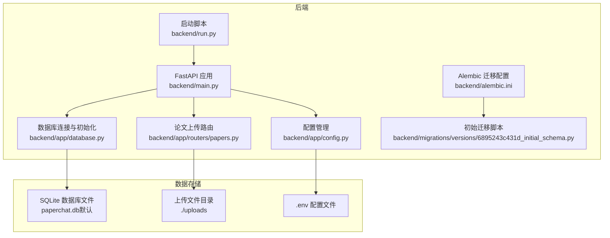
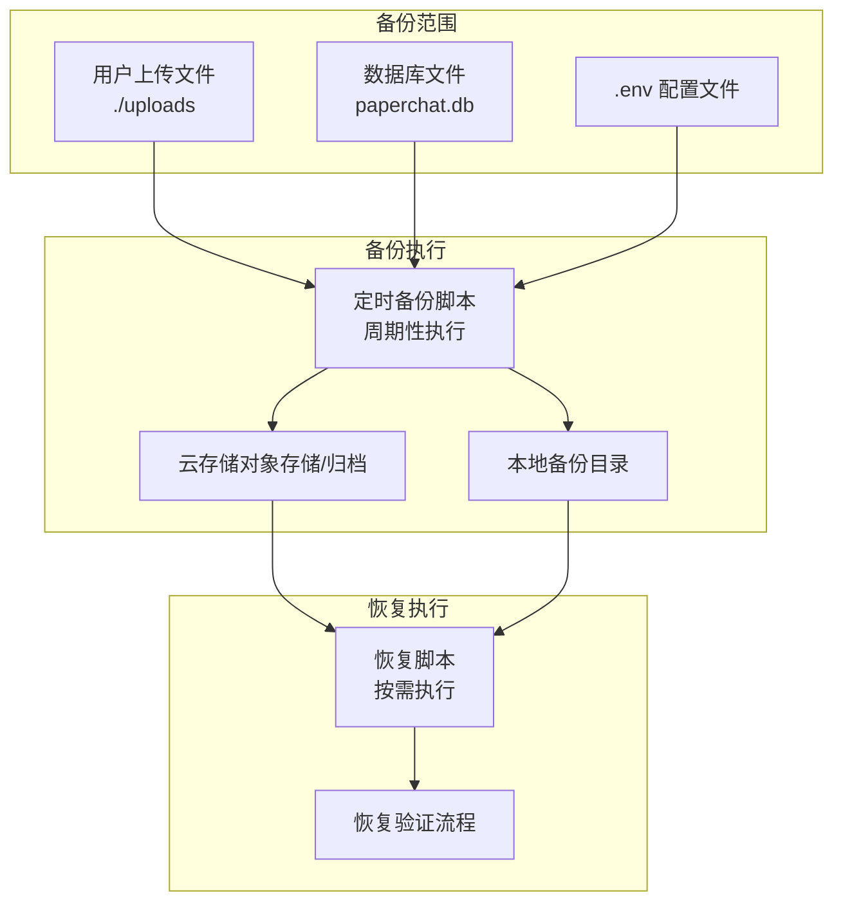
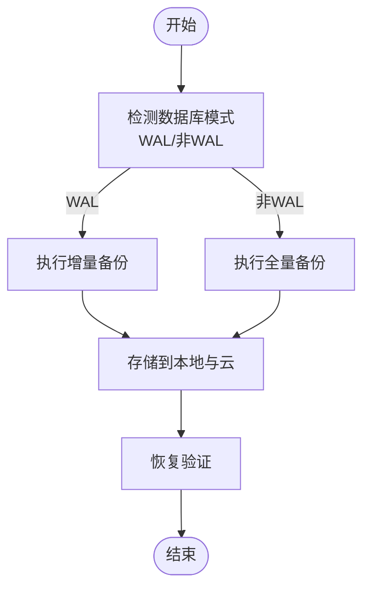
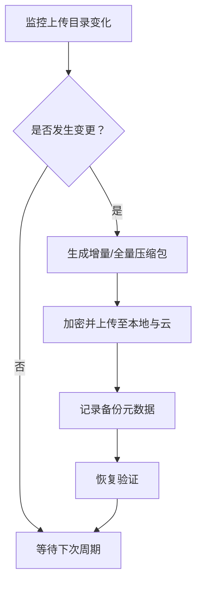
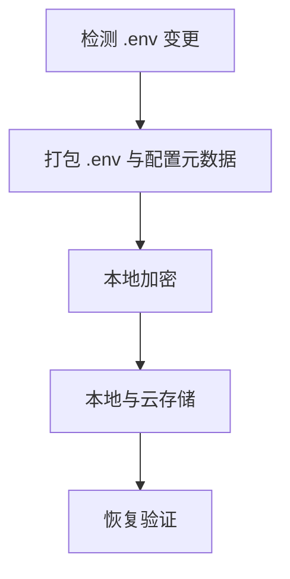
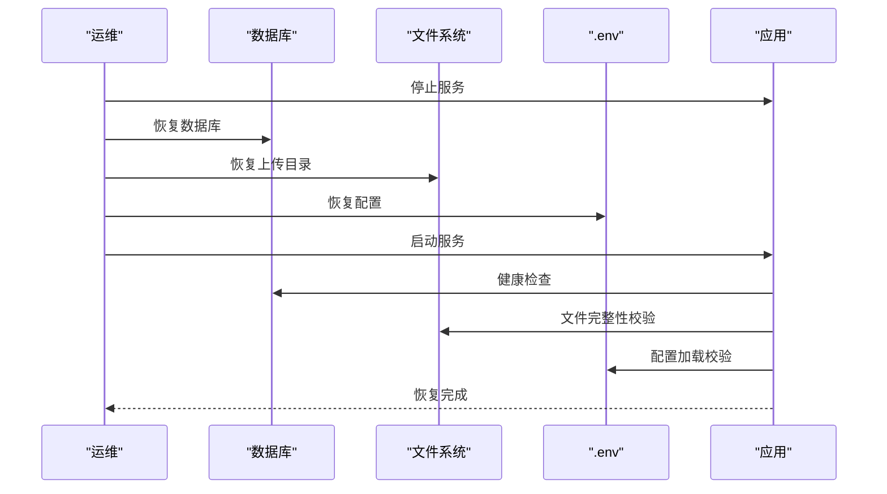
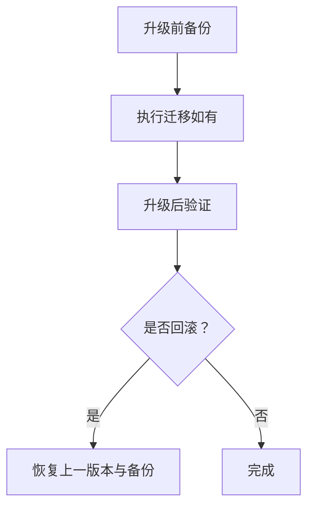
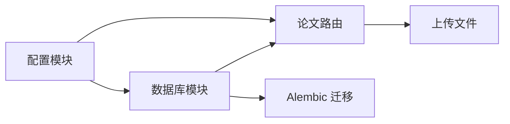

# 备份与恢复

<cite>
**本文引用的文件**
- [backend/app/config.py](file://backend/app/config.py)
- [backend/app/database.py](file://backend/app/database.py)
- [backend/app/routers/papers.py](file://backend/app/routers/papers.py)
- [backend/alembic.ini](file://backend/alembic.ini)
- [backend/migrations/versions/6895243c431d_initial_schema.py](file://backend/migrations/versions/6895243c431d_initial_schema.py)
- [backend/run.py](file://backend/run.py)
- [backend/main.py](file://backend/main.py)
- [backend/requirements.txt](file://backend/requirements.txt)
- [README.md](file://README.md)
</cite>

## 目录
1. [简介](#简介)
2. [项目结构](#项目结构)
3. [核心组件](#核心组件)
4. [架构总览](#架构总览)
5. [详细组件分析](#详细组件分析)
6. [依赖分析](#依赖分析)
7. [性能考虑](#性能考虑)
8. [故障排查指南](#故障排查指南)
9. [结论](#结论)
10. [附录](#附录)

## 简介
本文件面向 PaperChat 系统，提供一套完整的备份与恢复策略，覆盖数据库、用户上传文件与配置文件三类关键数据；明确定时备份脚本的编写与调度方式，区分全量与增量备份；给出备份存储位置与加密保护建议（本地与云存储）；制定灾难恢复流程与业务连续性保障；说明版本升级过程中的数据迁移方案；并提供备份验证与恢复测试方法以及紧急情况下的快速恢复与回滚策略。

## 项目结构
PaperChat 后端采用 FastAPI + SQLAlchemy 异步 ORM 架构，数据库默认使用 SQLite（开发环境），上传文件保存在本地目录，配置通过 pydantic-settings 从 .env 读取。系统通过 Alembic 管理数据库迁移。

图表来源
- [backend/main.py:1-148](file://backend/main.py#L1-L148)
- [backend/app/config.py:1-44](file://backend/app/config.py#L1-L44)
- [backend/app/database.py:1-81](file://backend/app/database.py#L1-L81)
- [backend/app/routers/papers.py:1-800](file://backend/app/routers/papers.py#L1-L800)
- [backend/alembic.ini:1-150](file://backend/alembic.ini#L1-L150)
- [backend/migrations/versions/6895243c431d_initial_schema.py:1-61](file://backend/migrations/versions/6895243c431d_initial_schema.py#L1-L61)
- [backend/run.py:1-31](file://backend/run.py#L1-L31)

章节来源
- [README.md:72-183](file://README.md#L72-L183)
- [backend/app/config.py:15-44](file://backend/app/config.py#L15-L44)
- [backend/app/database.py:13-81](file://backend/app/database.py#L13-L81)
- [backend/app/routers/papers.py:33-36](file://backend/app/routers/papers.py#L33-L36)
- [backend/alembic.ini:89-90](file://backend/alembic.ini#L89-L90)

## 核心组件
- 数据库与迁移
  - 默认数据库 URL 指向 SQLite 文件，开发阶段使用 aiosqlite；生产建议迁移到 PostgreSQL/MySQL 并启用 WAL/热备。
  - Alembic 提供迁移管理，初始迁移脚本定义了索引与列约束变更。
- 上传与文件存储
  - 上传目录由配置项控制，论文文件以 UUID 命名保存，元数据与文本块写入数据库。
- 配置与启动
  - 配置从 .env 读取，包含数据库 URL、JWT、CORS、上传目录与大小限制等。
  - 启动脚本负责 uvicorn 启动与 HuggingFace 缓存路径设置。

章节来源
- [backend/app/config.py:22-38](file://backend/app/config.py#L22-L38)
- [backend/app/database.py:14-27](file://backend/app/database.py#L14-L27)
- [backend/migrations/versions/6895243c431d_initial_schema.py:21-39](file://backend/migrations/versions/6895243c431d_initial_schema.py#L21-L39)
- [backend/app/routers/papers.py:156-262](file://backend/app/routers/papers.py#L156-L262)
- [backend/run.py:23-31](file://backend/run.py#L23-L31)

## 架构总览
下图展示备份与恢复涉及的关键数据流与组件：

图表来源
- [backend/app/config.py:36-38](file://backend/app/config.py#L36-L38)
- [backend/app/routers/papers.py:194-201](file://backend/app/routers/papers.py#L194-L201)
- [backend/app/database.py:14-18](file://backend/app/database.py#L14-L18)

## 详细组件分析

### 数据库备份策略
- 备份对象
  - SQLite 数据库文件（默认 paperchat.db）。
- 备份类型
  - 全量备份：每次生成完整数据库快照，适合小规模或非高频场景。
  - 增量备份：基于 WAL/事务日志的增量（SQLite WAL 模式下可行），适合生产环境。
- 备份时机
  - 周期性：每日/每周全量 + 每小时增量（若启用 WAL）。
  - 事件驱动：数据库结构变更（Alembic 迁移）后立即全量备份。
- 备份存储
  - 本地：独立磁盘/分区，定期复制到外部介质。
  - 云存储：对象存储归档（如 AWS S3 Glacier、阿里云 OSS Archive）。
- 加密保护
  - 传输加密：TLS/HTTPS。
  - 静态加密：备份文件本地加密（如 AES-256）与云存储服务端加密结合。
- 验证与恢复测试
  - 定期抽样恢复测试，验证数据库一致性与应用可用性。
  - 迁移前后均进行一致性校验（表计数、关键记录抽样）。

图表来源
- [backend/app/database.py:14-18](file://backend/app/database.py#L14-L18)
- [backend/alembic.ini:89-90](file://backend/alembic.ini#L89-L90)

章节来源
- [backend/app/database.py:14-27](file://backend/app/database.py#L14-L27)
- [backend/migrations/versions/6895243c431d_initial_schema.py:21-39](file://backend/migrations/versions/6895243c431d_initial_schema.py#L21-L39)

### 用户上传文件备份策略
- 备份对象
  - 上传目录（默认 ./uploads）下所有 PDF 文件与关联元数据。
- 备份类型
  - 全量备份：按目录整体打包。
  - 增量备份：基于文件修改时间或哈希差异（可选）。
- 备份时机
  - 周期性：每日全量 + 每小时增量。
  - 事件驱动：批量导入/删除后触发增量备份。
- 备份存储
  - 本地与云存储并行，确保异地冗余。
- 加密保护
  - 本地加密存储；云存储启用服务端加密与访问控制。
- 验证与恢复测试
  - 抽样恢复测试，验证文件完整性与数据库记录一致性。

图表来源
- [backend/app/routers/papers.py:194-201](file://backend/app/routers/papers.py#L194-L201)
- [backend/app/config.py:36-38](file://backend/app/config.py#L36-L38)

章节来源
- [backend/app/routers/papers.py:156-262](file://backend/app/routers/papers.py#L156-L262)

### 配置文件备份策略
- 备份对象
  - .env 配置文件与应用配置类（Settings）。
- 备份类型
  - 全量备份：随应用部署同步备份。
- 备份时机
  - 配置变更后立即备份。
- 备份存储
  - 本地与云存储并行。
- 加密保护
  - .env 包含敏感信息（如 JWT_SECRET_KEY、API Key），建议本地加密存储与最小权限访问。
- 验证与恢复测试
  - 恢复后启动应用，验证健康检查与关键接口可用性。

图表来源
- [backend/app/config.py:15-44](file://backend/app/config.py#L15-L44)

章节来源
- [backend/app/config.py:15-44](file://backend/app/config.py#L15-L44)

### 定时备份脚本与调度
- 脚本职责
  - 备份数据库文件、上传目录与 .env。
  - 生成备份元数据（时间戳、大小、哈希）。
  - 将备份文件加密并上传至本地与云存储。
- 调度方式
  - Linux: cron（如每日 2:00 全量，每小时 1:00 增量）。
  - Windows: 任务计划程序（计划任务）。
  - Kubernetes: CronJob（容器化部署时）。
- 事件触发
  - Alembic 迁移完成后自动触发一次全量备份。
- 日志与告警
  - 记录备份状态、失败原因与耗时；异常时邮件/IM 告警。

章节来源
- [backend/alembic.ini:89-90](file://backend/alembic.ini#L89-L90)
- [backend/run.py:23-31](file://backend/run.py#L23-L31)

### 灾难恢复流程
- 场景划分
  - 数据库损坏：使用最近全量 + 增量恢复。
  - 上传目录丢失：从云存储恢复 ./uploads。
  - 配置丢失：从备份恢复 .env。
- 恢复步骤
  1) 停止应用服务。
  2) 从备份源恢复数据库、上传目录与 .env。
  3) 校验文件完整性与数据库一致性。
  4) 启动应用，执行健康检查与关键接口测试。
  5) 观察日志，确认无异常。
- 业务连续性
  - 采用蓝绿/滚动发布与多副本部署，缩短恢复窗口。
  - 云存储与异地冗余，降低单点风险。

图表来源
- [backend/app/database.py:75-81](file://backend/app/database.py#L75-L81)
- [backend/app/routers/papers.py:368-374](file://backend/app/routers/papers.py#L368-L374)
- [backend/app/config.py:15-44](file://backend/app/config.py#L15-L44)

章节来源
- [backend/app/database.py:75-81](file://backend/app/database.py#L75-L81)
- [backend/app/routers/papers.py:368-374](file://backend/app/routers/papers.py#L368-L374)

### 版本升级与数据迁移
- 升级前准备
  - 备份数据库、上传目录与 .env。
  - 检查迁移脚本兼容性。
- 迁移执行
  - 使用 Alembic 执行迁移（如需）。
  - 若数据库结构变更，先全量备份再执行迁移。
- 升级后验证
  - 运行数据库一致性检查与关键接口回归测试。
- 回滚策略
  - 保留上一版本镜像与备份，必要时回退到上一版本并恢复对应备份。

图表来源
- [backend/alembic.ini:89-90](file://backend/alembic.ini#L89-L90)
- [backend/migrations/versions/6895243c431d_initial_schema.py:21-39](file://backend/migrations/versions/6895243c431d_initial_schema.py#L21-L39)

章节来源
- [backend/alembic.ini:89-90](file://backend/alembic.ini#L89-L90)
- [backend/migrations/versions/6895243c431d_initial_schema.py:21-39](file://backend/migrations/versions/6895243c431d_initial_schema.py#L21-L39)

### 备份验证与恢复测试
- 验证指标
  - 备份完整性：文件大小与哈希校验。
  - 数据库一致性：表计数、关键记录抽样。
  - 应用可用性：健康检查、登录、上传/下载、检索等关键路径。
- 测试频率
  - 每月至少一次抽样恢复测试。
  - 迁移或重大变更后必须进行恢复测试。

章节来源
- [backend/app/routers/papers.py:379-416](file://backend/app/routers/papers.py#L379-L416)
- [backend/main.py:29-31](file://backend/main.py#L29-L31)

### 紧急快速恢复与回滚
- 快速恢复
  - 优先恢复数据库与上传目录，随后恢复 .env。
  - 使用最近一次全量 + 增量组合进行恢复。
- 回滚策略
  - 回退到上一稳定版本镜像，恢复对应版本备份。
  - 保持回滚路径清晰，避免破坏历史备份。

章节来源
- [backend/app/routers/papers.py:368-374](file://backend/app/routers/papers.py#L368-L374)
- [backend/app/config.py:15-44](file://backend/app/config.py#L15-L44)

## 依赖分析
- 组件耦合
  - 配置模块影响数据库 URL 与上传目录路径。
  - 数据库模块提供会话与初始化能力，被各路由与服务依赖。
  - 论文路由负责文件落地与数据库写入，是文件备份的核心对象。
  - Alembic 提供迁移能力，影响数据库结构与备份策略。
- 外部依赖
  - SQLAlchemy/aiosqlite：数据库访问。
  - pdfplumber：PDF 解析，间接影响上传文件处理。
  - ChromaDB/Sentence-Transformers/Rank-BM25：检索与向量索引，属于运行期数据，通常可重建。

图表来源
- [backend/app/config.py:15-44](file://backend/app/config.py#L15-L44)
- [backend/app/database.py:13-27](file://backend/app/database.py#L13-L27)
- [backend/app/routers/papers.py:156-262](file://backend/app/routers/papers.py#L156-L262)
- [backend/alembic.ini:89-90](file://backend/alembic.ini#L89-L90)

章节来源
- [backend/requirements.txt:1-19](file://backend/requirements.txt#L1-L19)
- [backend/app/config.py:15-44](file://backend/app/config.py#L15-L44)
- [backend/app/database.py:13-27](file://backend/app/database.py#L13-L27)
- [backend/app/routers/papers.py:156-262](file://backend/app/routers/papers.py#L156-L262)

## 性能考虑
- 备份窗口
  - 在业务低峰时段执行全量备份，避免影响在线服务。
- 增量策略
  - SQLite 启用 WAL 并配合增量备份，减少锁竞争。
- 存储与网络
  - 本地与云并行备份，提高可靠性；云存储选择近线/低频访问以降低成本。
- 并发与资源
  - 备份脚本并发控制，避免占用过多 CPU/IO。

## 故障排查指南
- 健康检查
  - 使用健康检查端点确认服务状态。
- 常见问题
  - 上传失败：检查上传目录权限与磁盘空间。
  - 数据库连接失败：核对 DATABASE_URL 与数据库文件权限。
  - 配置加载失败：检查 .env 权限与格式。
- 日志与监控
  - 启用详细日志，结合监控告警定位问题。

章节来源
- [backend/main.py:29-31](file://backend/main.py#L29-L31)
- [backend/app/routers/papers.py:177-192](file://backend/app/routers/papers.py#L177-L192)
- [backend/app/database.py:14-18](file://backend/app/database.py#L14-L18)
- [backend/app/config.py:22-38](file://backend/app/config.py#L22-L38)

## 结论
通过将数据库、上传文件与配置文件纳入统一的备份体系，并结合全量与增量备份、本地与云存储、严格的加密与验证机制，PaperChat 可实现高可靠的数据保护与快速恢复能力。配合规范的升级与回滚流程，可有效保障业务连续性与数据安全。

## 附录
- 关键配置项
  - DATABASE_URL：数据库连接字符串（默认 SQLite）。
  - UPLOAD_DIR：上传目录路径。
  - MAX_FILE_SIZE：上传文件大小限制。
  - JWT_SECRET_KEY：JWT 密钥（需加密存储）。
- 启动与运行
  - 使用启动脚本或 uvicorn 直接运行，确保 HuggingFace 缓存目录正确设置。

章节来源
- [backend/app/config.py:22-38](file://backend/app/config.py#L22-L38)
- [backend/run.py:23-31](file://backend/run.py#L23-L31)
- [README.md:185-240](file://README.md#L185-L240)