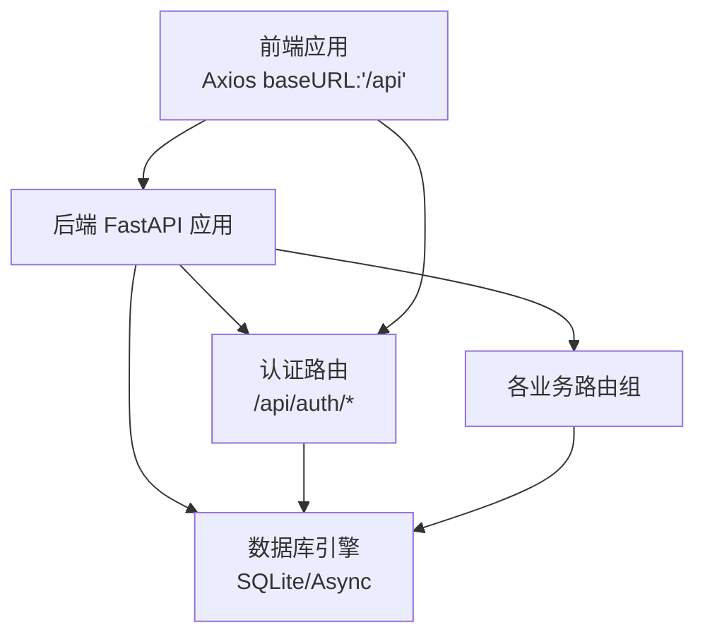
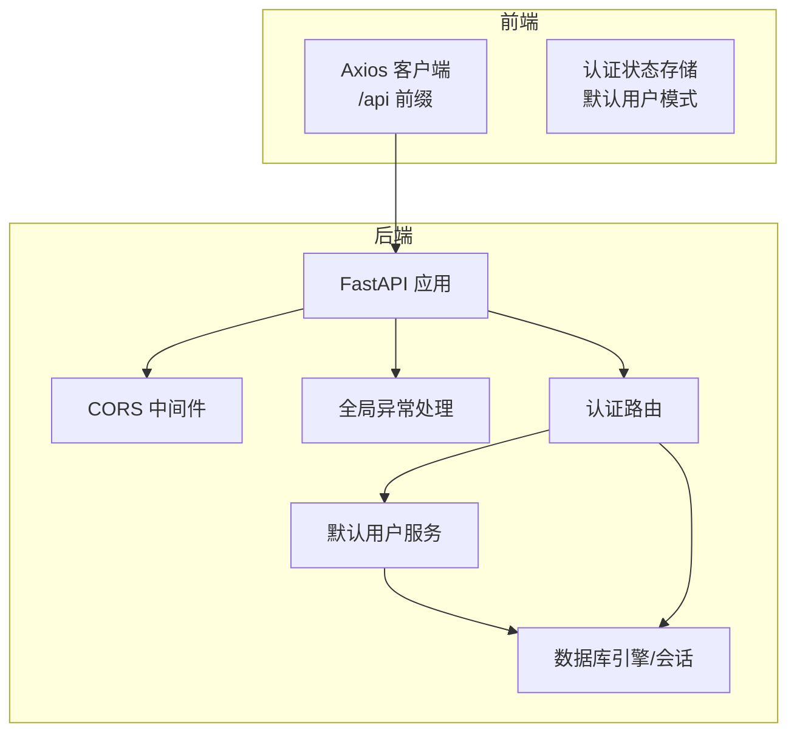
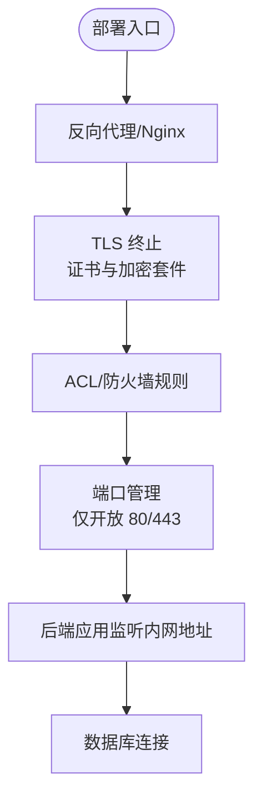
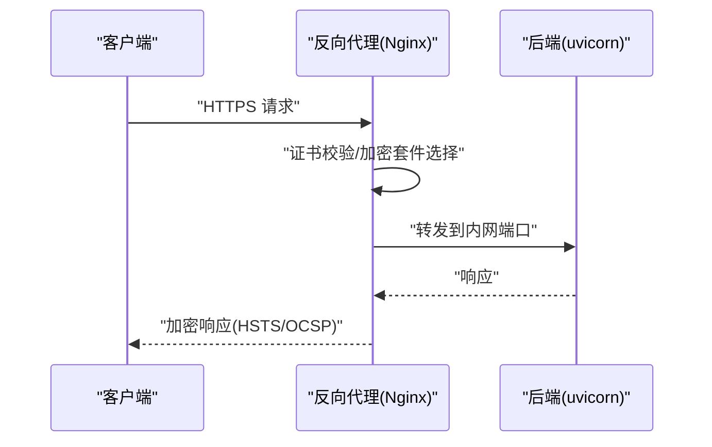
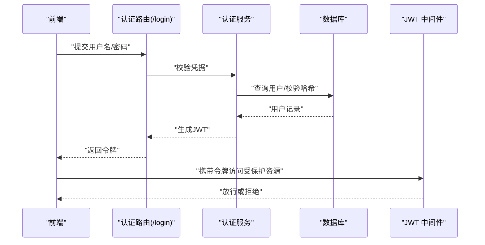
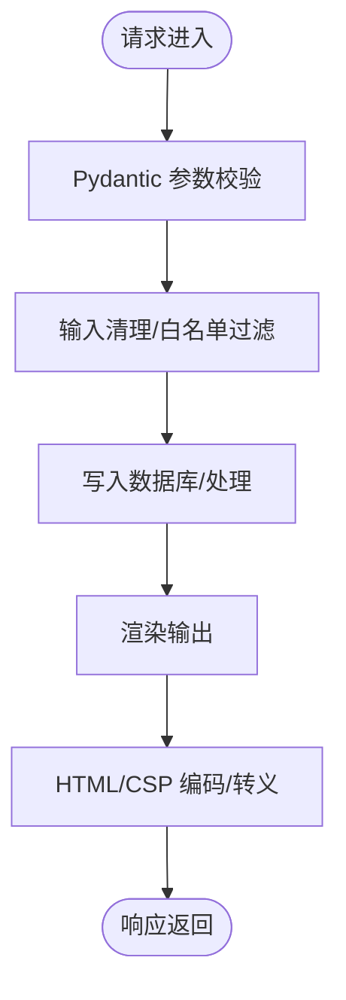
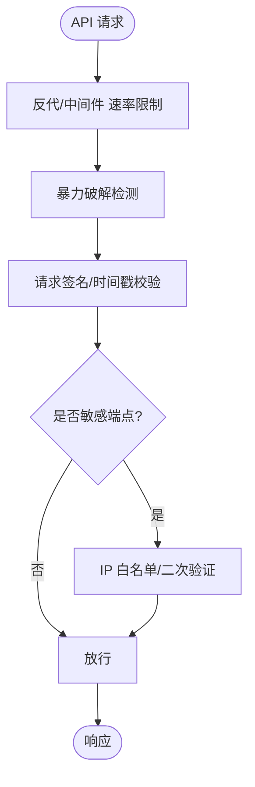
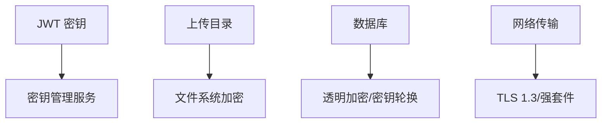
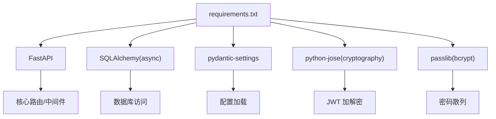

# 安全加固

<cite>
**本文引用的文件**
- [backend/app/config.py](file://backend/app/config.py)
- [backend/app/main.py](file://backend/app/main.py)
- [backend/app/routers/auth.py](file://backend/app/routers/auth.py)
- [backend/app/services/auth_service.py](file://backend/app/services/auth_service.py)
- [backend/app/middleware/error_handler.py](file://backend/app/middleware/error_handler.py)
- [backend/app/models/user.py](file://backend/app/models/user.py)
- [backend/app/schemas/user.py](file://backend/app/schemas/user.py)
- [backend/app/database.py](file://backend/app/database.py)
- [backend/requirements.txt](file://backend/requirements.txt)
- [frontend/src/api/index.js](file://frontend/src/api/index.js)
- [frontend/src/stores/authStore.js](file://frontend/src/stores/authStore.js)
</cite>

## 目录
1. [简介](#简介)
2. [项目结构](#项目结构)
3. [核心组件](#核心组件)
4. [架构总览](#架构总览)
5. [详细组件分析](#详细组件分析)
6. [依赖分析](#依赖分析)
7. [性能考虑](#性能考虑)
8. [故障排查指南](#故障排查指南)
9. [结论](#结论)
10. [附录](#附录)

## 简介
本文件面向 PaperChat 系统的安全加固需求，结合现有代码库的实现现状，提出网络安全、HTTPS 配置、身份认证与授权、输入验证与输出编码、API 安全防护、敏感数据保护、安全审计与漏洞扫描及应急响应流程等多维度的安全建议。由于当前仓库中未包含完整的后端 HTTPS 与中间件安全配置实现，本文在“网络安全配置”“HTTPS 配置”“API 安全防护”等章节提供基于现有代码的可落地改进建议与图示，帮助在不破坏现有功能的前提下逐步完善安全体系。

## 项目结构
后端采用 FastAPI + SQLAlchemy 异步 ORM 架构，前端通过 Axios 发起对 /api 的请求；认证与授权目前以“默认用户模式”为主，未启用标准 JWT 中间件链路；CORS 已启用但较为宽松；数据库为 SQLite（开发态），上传目录为本地文件系统。

图表来源
- [backend/app/main.py:55-95](file://backend/app/main.py#L55-L95)
- [frontend/src/api/index.js:4-9](file://frontend/src/api/index.js#L4-L9)

章节来源
- [backend/app/main.py:55-95](file://backend/app/main.py#L55-L95)
- [frontend/src/api/index.js:4-9](file://frontend/src/api/index.js#L4-L9)

## 核心组件
- 配置中心：集中管理应用名称、调试模式、数据库连接、JWT 密钥与算法、CORS 来源、上传目录与大小限制等。
- 应用入口：创建 FastAPI 实例、注册中间件（CORS）、注册路由、健康检查端点。
- 认证路由：提供注册、登录、登出、获取当前用户等接口；当前实现依赖默认用户服务。
- 默认用户服务：在数据库中确保默认用户存在，便于个人使用模式。
- 全局异常处理：统一处理 Pydantic 参数校验、HTTP 异常、数据库异常与通用异常。
- 数据层：异步 SQLAlchemy 引擎与会话工厂，初始化与关闭流程。
- 前端 API 客户端：统一的 Axios 实例，指向后端 /api 前缀。

章节来源
- [backend/app/config.py:15-44](file://backend/app/config.py#L15-L44)
- [backend/app/main.py:55-95](file://backend/app/main.py#L55-L95)
- [backend/app/routers/auth.py:18-186](file://backend/app/routers/auth.py#L18-L186)
- [backend/app/services/auth_service.py:13-39](file://backend/app/services/auth_service.py#L13-L39)
- [backend/app/middleware/error_handler.py:73-92](file://backend/app/middleware/error_handler.py#L73-L92)
- [backend/app/database.py:13-81](file://backend/app/database.py#L13-L81)
- [frontend/src/api/index.js:4-9](file://frontend/src/api/index.js#L4-L9)

## 架构总览
下图展示当前后端与前端交互、认证与数据库的关系，以及可扩展的安全中间件位置。

图表来源
- [backend/app/main.py:70-80](file://backend/app/main.py#L70-L80)
- [backend/app/middleware/error_handler.py:73-92](file://backend/app/middleware/error_handler.py#L73-L92)
- [backend/app/routers/auth.py:18-186](file://backend/app/routers/auth.py#L18-L186)
- [backend/app/services/auth_service.py:13-39](file://backend/app/services/auth_service.py#L13-L39)
- [backend/app/database.py:13-48](file://backend/app/database.py#L13-L48)

## 详细组件分析

### 网络安全配置
- 现状
  - CORS 已启用，允许任意方法与头，允许凭据开启，来源列表包含本地开发端口。
  - 未启用防火墙规则、端口管理与访问控制列表（ACL）。
  - 未见反向代理与 HTTPS 终止配置。
- 建议
  - 明确生产环境的允许来源列表，避免通配符。
  - 在反向代理层（如 Nginx）启用严格 ACL 与限速，仅开放必要端口（如 80/443）。
  - 使用反向代理终止 TLS 并转发到后端（例如 uvicorn），后端监听内网地址。
  - 在系统防火墙层面仅放行反向代理端口，限制 SSH/数据库等端口访问范围。

图表来源
- [backend/app/main.py:70-77](file://backend/app/main.py#L70-L77)
- [backend/app/config.py:33-38](file://backend/app/config.py#L33-L38)

章节来源
- [backend/app/main.py:70-77](file://backend/app/main.py#L70-L77)
- [backend/app/config.py:33-38](file://backend/app/config.py#L33-L38)

### HTTPS 配置
- 现状
  - 未见 SSL/TLS 证书与密钥配置；后端直接运行于 HTTP。
- 建议
  - 使用 Let’s Encrypt 或商业证书，启用自动续期（certbot/cron）。
  - 在反向代理层配置强加密套件（如 TLS 1.3，默认套件由代理选择），禁用弱协议与套件。
  - 启用 HSTS、OCSP Stapling、前向保密（ECDHE）等最佳实践。
  - 将后端监听地址改为内网回环或容器网络，仅通过反代暴露公网。

图表来源
- [backend/app/main.py:62-68](file://backend/app/main.py#L62-L68)

章节来源
- [backend/app/main.py:62-68](file://backend/app/main.py#L62-L68)

### 身份认证与授权机制
- 现状
  - 认证路由存在，但当前默认用户服务始终返回“已认证”的默认用户，未启用 JWT 中间件链路。
  - JWT 密钥与算法已在配置中定义，但未在路由层实际使用。
- 建议
  - 在路由层引入 JWT 中间件（如依赖项解析当前用户），替换默认用户服务为真实鉴权链路。
  - 对登录接口增加失败计数与临时封禁（防暴力破解）。
  - 登出采用黑名单或短期令牌策略（需额外存储）。
  - 为每个路由明确标注所需权限级别，结合角色/资源级授权。

图表来源
- [backend/app/routers/auth.py:71-118](file://backend/app/routers/auth.py#L71-L118)
- [backend/app/schemas/user.py:37-42](file://backend/app/schemas/user.py#L37-L42)
- [backend/app/config.py:28-31](file://backend/app/config.py#L28-L31)

章节来源
- [backend/app/routers/auth.py:71-118](file://backend/app/routers/auth.py#L71-L118)
- [backend/app/schemas/user.py:37-42](file://backend/app/schemas/user.py#L37-L42)
- [backend/app/config.py:28-31](file://backend/app/config.py#L28-L31)

### 输入验证与输出编码
- 现状
  - Pydantic 模型用于请求体校验（最小长度、最大长度、邮箱格式等）。
  - 未见专门的 XSS/CSRF 防护中间件与输出编码策略。
- 建议
  - 在路由层对所有外部输入进行严格校验（长度、类型、格式、白名单字符集）。
  - 对富文本输出进行 HTML 转义与内容安全策略（CSP）。
  - 对文件上传路径与文件名进行规范化与白名单校验，限制扩展名与 MIME 类型。
  - CSRF 防护：若未来引入表单场景，需在反代或中间件层启用 CSRF Token 与 SameSite Cookie。

图表来源
- [backend/app/schemas/user.py:8-23](file://backend/app/schemas/user.py#L8-L23)
- [backend/app/middleware/error_handler.py:11-28](file://backend/app/middleware/error_handler.py#L11-L28)

章节来源
- [backend/app/schemas/user.py:8-23](file://backend/app/schemas/user.py#L8-L23)
- [backend/app/middleware/error_handler.py:11-28](file://backend/app/middleware/error_handler.py#L11-L28)

### API 安全防护
- 现状
  - 未见速率限制、请求签名与防暴力破解机制。
  - 健康检查端点公开，未做访问控制。
- 建议
  - 在反向代理层启用基于 IP 的速率限制与地理阻断。
  - 对关键接口（登录、注册）增加失败次数阈值与临时封禁。
  - 引入请求签名（如 HMAC）与时间戳校验，配合非对称密钥。
  - 对敏感端点启用 IP 白名单与二次验证码。

图表来源
- [backend/app/main.py:102-113](file://backend/app/main.py#L102-L113)

章节来源
- [backend/app/main.py:102-113](file://backend/app/main.py#L102-L113)

### 敏感数据保护
- 现状
  - JWT 密钥为示例值，应立即更换。
  - 上传目录为本地文件系统，未见加密与访问控制。
  - 数据库为 SQLite，未见透明数据加密（TDE）。
- 建议
  - 使用强随机密钥并妥善保管（环境变量/密钥管理服务）。
  - 上传目录设置严格权限（仅应用进程可读写），对上传文件进行病毒扫描与扩展名白名单。
  - 生产环境迁移至带 TDE 的数据库（如 PostgreSQL），或启用文件系统级加密。
  - 传输加密：强制 HTTPS，禁用明文协议；内部服务间使用 mTLS。

图表来源
- [backend/app/config.py:28-31](file://backend/app/config.py#L28-L31)
- [backend/app/config.py:36-38](file://backend/app/config.py#L36-L38)
- [backend/app/database.py:13-18](file://backend/app/database.py#L13-L18)

章节来源
- [backend/app/config.py:28-31](file://backend/app/config.py#L28-L31)
- [backend/app/config.py:36-38](file://backend/app/config.py#L36-L38)
- [backend/app/database.py:13-18](file://backend/app/database.py#L13-L18)

### 安全审计与漏洞扫描
- 建议
  - 依赖扫描：定期使用 pip-audit/OSV 等工具扫描 Python 依赖漏洞。
  - 静态分析：集成 bandit/flake8/pylint 等工具于 CI。
  - 运行时审计：记录关键操作日志（登录、敏感变更、异常）。
  - 渗透测试：按季度对生产环境进行授权渗透测试。

章节来源
- [backend/requirements.txt:1-19](file://backend/requirements.txt#L1-L19)

### 应急响应流程
- 建议
  - 建立事件分级（低/中/高/严重）与处置时限。
  - 明确通知链路（开发者、运维、管理层）与外部通报机制。
  - 快速隔离受影响服务，回滚可疑变更，修复漏洞并发布补丁。
  - 事后复盘：记录根因、改进措施与演练计划。

## 依赖分析
后端依赖中包含 FastAPI、SQLAlchemy、Pydantic Settings、JWT 加解密与密码散列库等。这些库为安全能力提供了基础，但具体安全效果取决于配置与实现。

图表来源
- [backend/requirements.txt:1-19](file://backend/requirements.txt#L1-L19)

章节来源
- [backend/requirements.txt:1-19](file://backend/requirements.txt#L1-L19)

## 性能考虑
- CORS 与中间件链路应尽量精简，避免在热路径上执行昂贵操作。
- 数据库连接池与事务管理需合理配置，避免长事务与锁竞争。
- 上传文件建议采用流式处理与分块校验，减少内存占用。

## 故障排查指南
- 参数校验失败：检查 Pydantic 模型字段约束与前端传参格式。
- HTTP 异常：查看全局异常处理器返回的标准化错误结构。
- 数据库异常：关注回滚与连接释放逻辑，定位具体 SQL 与表结构。
- 健康检查：确认应用生命周期钩子与数据库初始化顺序。

章节来源
- [backend/app/middleware/error_handler.py:11-70](file://backend/app/middleware/error_handler.py#L11-L70)
- [backend/app/database.py:30-48](file://backend/app/database.py#L30-L48)
- [backend/app/main.py:102-113](file://backend/app/main.py#L102-L113)

## 结论
当前 PaperChat 在认证与授权方面尚未启用严格的 JWT 链路，CORS 与网络边界较为宽松，HTTPS 与传输加密尚未落地。建议优先完成 HTTPS 终止、严格的 CORS 与防火墙配置、JWT 中间件接入、速率限制与暴力破解防护，并完善输入验证、输出编码与敏感数据保护策略。在此基础上，建立持续的安全审计与应急响应机制，确保系统在演进过程中逐步达到生产级安全水平。

## 附录
- 前端 Axios 客户端默认指向 /api，建议在反代层统一处理跨域与安全头。
- 默认用户模式适合个人使用，生产环境必须切换为真实鉴权链路。

章节来源
- [frontend/src/api/index.js:4-9](file://frontend/src/api/index.js#L4-L9)
- [frontend/src/stores/authStore.js:3-6](file://frontend/src/stores/authStore.js#L3-L6)