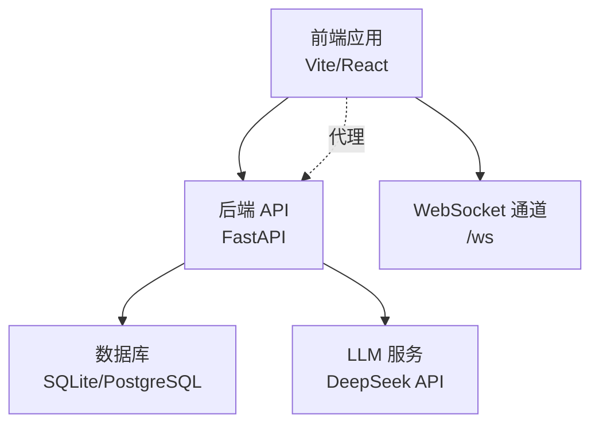
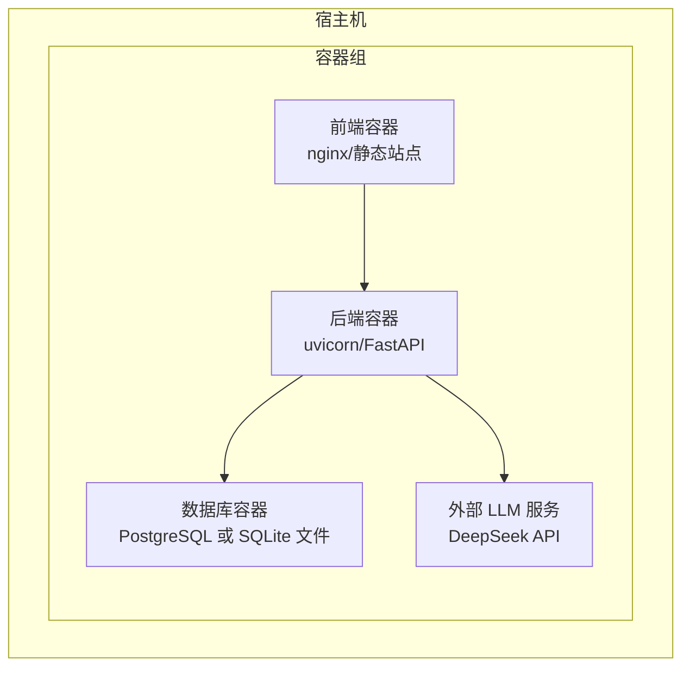
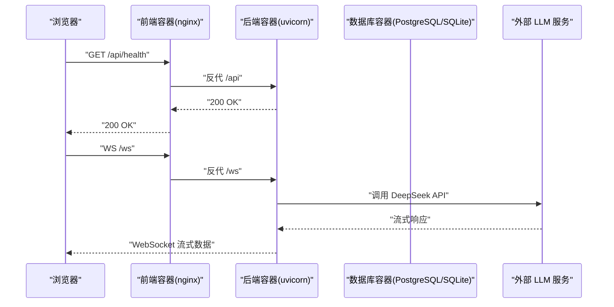
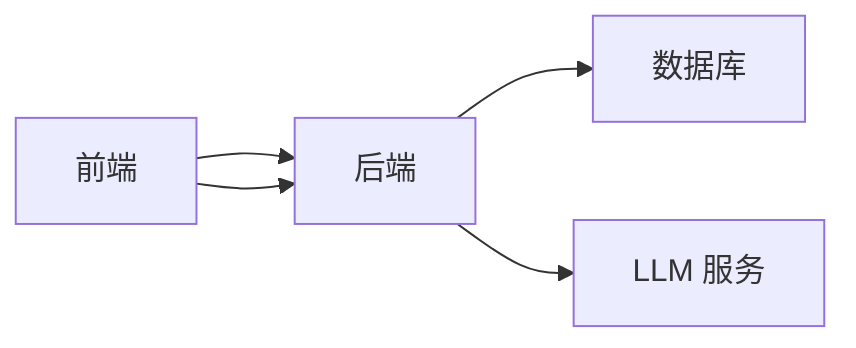

# 容器化部署

<cite>
**本文引用的文件**
- [backend/main.py](file://backend/main.py)
- [backend/run.py](file://backend/run.py)
- [backend/app/config.py](file://backend/app/config.py)
- [backend/app/database.py](file://backend/app/database.py)
- [backend/services/llm_service.py](file://backend/services/llm_service.py)
- [backend/requirements.txt](file://backend/requirements.txt)
- [backend/.env.example](file://backend/.env.example)
- [frontend/vite.config.js](file://frontend/vite.config.js)
- [frontend/package.json](file://frontend/package.json)
- [frontend/src/api/index.js](file://frontend/src/api/index.js)
- [README.md](file://README.md)
</cite>

## 目录
1. [简介](#简介)
2. [项目结构](#项目结构)
3. [核心组件](#核心组件)
4. [架构总览](#架构总览)
5. [详细组件分析](#详细组件分析)
6. [依赖关系分析](#依赖关系分析)
7. [性能考虑](#性能考虑)
8. [故障排查指南](#故障排查指南)
9. [结论](#结论)
10. [附录](#附录)

## 简介
本文件面向 PaperChat 系统的容器化部署，覆盖 Docker 镜像构建、docker-compose 编排、容器间通信、Kubernetes 部署要点、健康检查与重启策略、资源限制、日志与监控、以及安全最佳实践。文档以仓库现有代码与配置为依据，确保部署方案与应用行为一致。

## 项目结构
PaperChat 采用前后端分离架构：
- 后端：FastAPI 应用，提供 REST API 与 WebSocket，使用异步数据库连接与 LangChain 大模型服务。
- 前端：Vite + React 应用，通过代理访问后端 API 与 WebSocket。
- 配置：后端通过 pydantic-settings 从 .env 读取环境变量；数据库默认使用 SQLite（开发）。

图表来源
- [backend/main.py:29-31](file://backend/main.py#L29-L31)
- [backend/main.py:34-147](file://backend/main.py#L34-L147)
- [backend/app/database.py:14-27](file://backend/app/database.py#L14-L27)
- [backend/services/llm_service.py:30-38](file://backend/services/llm_service.py#L30-L38)
- [frontend/vite.config.js:8-17](file://frontend/vite.config.js#L8-L17)

章节来源
- [README.md:72-183](file://README.md#L72-L183)
- [backend/app/config.py:15-44](file://backend/app/config.py#L15-L44)
- [backend/app/database.py:14-27](file://backend/app/database.py#L14-L27)

## 核心组件
- 后端服务
  - FastAPI 应用入口与路由：提供健康检查端点与 WebSocket 通道。
  - 配置管理：从 .env 读取数据库、JWT、CORS、上传目录等配置。
  - 数据库：异步 SQLAlchemy 引擎与会话工厂，默认 SQLite。
  - LLM 服务：基于 LangChain 的 DeepSeek 聊天接口，支持流式输出。
- 前端服务
  - Vite 开发服务器与代理：将 /api 与 /ws 代理至后端。
  - Axios 实例：统一设置 baseURL 为 /api。

章节来源
- [backend/main.py:29-31](file://backend/main.py#L29-L31)
- [backend/main.py:34-147](file://backend/main.py#L34-L147)
- [backend/app/config.py:15-44](file://backend/app/config.py#L15-L44)
- [backend/app/database.py:14-27](file://backend/app/database.py#L14-L27)
- [backend/services/llm_service.py:30-38](file://backend/services/llm_service.py#L30-L38)
- [frontend/vite.config.js:8-17](file://frontend/vite.config.js#L8-L17)
- [frontend/src/api/index.js:4-9](file://frontend/src/api/index.js#L4-L9)

## 架构总览
容器化部署建议采用“单主机多容器”方式：
- 前端容器：构建静态产物，暴露 80 端口，反向代理至后端。
- 后端容器：运行 uvicorn，监听 0.0.0.0:8000，提供 REST 与 WebSocket。
- 数据库容器：PostgreSQL（生产）或本地 SQLite 文件（开发）。
- LLM 服务：通过 API Key 调用外部 DeepSeek API，无需本地容器。

图表来源
- [backend/run.py:24-30](file://backend/run.py#L24-L30)
- [backend/app/config.py:22-23](file://backend/app/config.py#L22-L23)
- [backend/services/llm_service.py:30-38](file://backend/services/llm_service.py#L30-L38)

## 详细组件分析

### Docker 镜像构建指南
- 基础镜像与分层
  - Python 3.10+ 基础镜像，安装系统依赖（如编译工具链、字体/库依赖，视 PDF/向量化需求而定）。
  - 将 requirements.txt 作为独立层，便于缓存依赖。
- 多阶段构建
  - 第一阶段：安装构建依赖，构建前端静态产物（npm run build）。
  - 第二阶段：仅复制运行时依赖与构建产物，最小化运行镜像。
- 镜像大小控制
  - 使用 .dockerignore 排除 node_modules、.git、构建缓存。
  - 合理合并 RUN 指令减少层数。
  - 前端静态产物仅复制 dist 目录。
- 端口与入口
  - 后端监听 0.0.0.0:8000；前端容器暴露 80。
- 健康检查
  - 后端提供 /api/health 健康检查端点，可在容器健康检查中使用。
- 环境变量
  - 通过 Docker 环境变量或 secrets 注入 DEEPSEEK_API_KEY、DATABASE_URL、JWT_SECRET_KEY 等。

章节来源
- [backend/requirements.txt:1-19](file://backend/requirements.txt#L1-L19)
- [backend/.env.example:10-44](file://backend/.env.example#L10-L44)
- [backend/main.py:29-31](file://backend/main.py#L29-L31)

### docker-compose 编排配置
- 服务定义
  - 后端服务：映射 8000 端口，挂载 uploads 目录与 .env 文件；设置环境变量。
  - 前端服务：映射 80 端口，使用 nginx 反代 /api 至后端 8000，/ws 至后端 8000。
  - 数据库服务：PostgreSQL，初始化数据库与用户；生产环境建议持久化卷。
- 网络设置
  - 使用自定义桥接网络，容器间通过服务名互通。
- 卷挂载
  - uploads 目录持久化，避免容器重建丢失文件。
  - .env 文件挂载为只读。
- 环境变量传递
  - 通过 compose 的 environment/env_file 字段注入配置，敏感信息使用 secrets。

章节来源
- [backend/app/config.py:22-38](file://backend/app/config.py#L22-L38)
- [backend/.env.example:10-44](file://backend/.env.example#L10-L44)
- [frontend/vite.config.js:8-17](file://frontend/vite.config.js#L8-L17)

### 容器间通信配置
- 前端到后端
  - 通过 /api 与 /ws 代理，开发环境使用 Vite 代理；生产环境使用 nginx 反代。
- 后端到数据库
  - 默认 SQLite 文件位于 uploads 下方；生产环境改用 PostgreSQL，并通过 DATABASE_URL 连接。
- 后端到 LLM 服务
  - 通过 DEEPSEEK_API_KEY 与 base_url 调用外部 DeepSeek API，无需本地容器。

图表来源
- [backend/main.py:29-31](file://backend/main.py#L29-L31)
- [backend/main.py:34-147](file://backend/main.py#L34-L147)
- [backend/services/llm_service.py:30-38](file://backend/services/llm_service.py#L30-L38)
- [frontend/vite.config.js:8-17](file://frontend/vite.config.js#L8-L17)

### Kubernetes 部署配置示例
- Deployment
  - 后端：设置副本数、探针、环境变量与卷挂载；暴露 8000 端口。
  - 前端：使用 nginx 镜像，挂载静态产物，暴露 80 端口。
- Service
  - ClusterIP/LoadBalancer 暴露后端与前端服务。
- ConfigMap/Secret
  - ConfigMap：存放非敏感配置（如 CORS、应用名）。
  - Secret：存放 DEEPSEEK_API_KEY、JWT_SECRET_KEY、DATABASE_URL 等。
- Pod 安全
  - 使用非 root 用户运行，只读根文件系统，移除不必要的 Linux 能力。

章节来源
- [backend/app/config.py:15-44](file://backend/app/config.py#L15-L44)
- [backend/.env.example:10-44](file://backend/.env.example#L10-L44)

### 健康检查、重启策略与资源限制
- 健康检查
  - HTTP GET /api/health；失败则重启。
- 重启策略
  - 业务容器使用 RestartPolicy Always/OnFailure，确保服务可用。
- 资源限制
  - CPU/内存 requests/limits 根据负载压测设定；LLM 调用为 IO 密集，适当放宽内存上限。
- 日志
  - 后端 uvicorn 日志输出到 stdout/stderr；前端容器使用 nginx access/error 日志。

章节来源
- [backend/main.py:29-31](file://backend/main.py#L29-L31)
- [backend/run.py:24-30](file://backend/run.py#L24-L30)

### 日志收集与监控
- 日志
  - 后端：uvicorn 日志级别 info，结合容器日志采集器（如 Fluent Bit/Vector）统一收集。
  - 前端：nginx access/error.log。
- 监控
  - 指标：CPU/内存/HTTP 请求速率/错误率/WS 连接数。
  - 告警：健康检查失败、HTTP 5xx、WS 断开率异常。
  - 链路追踪：为 /api 与 /ws 增加 trace 上下文（可选）。

章节来源
- [backend/run.py:24-30](file://backend/run.py#L24-L30)
- [frontend/vite.config.js:8-17](file://frontend/vite.config.js#L8-L17)

### 安全最佳实践
- 凭据管理
  - 使用 Secrets 管理 API Key 与密钥，避免硬编码。
- 网络隔离
  - 仅暴露必要端口；后端与数据库之间使用内部网络。
- 权限控制
  - 非 root 用户运行；最小权限原则；禁用不必要 capabilities。
- 配置校验
  - 在启动时校验关键配置（如 DEEPSEEK_API_KEY 是否为空）。
- CORS 与认证
  - 生产环境严格限制 CORS 源；JWT 密钥定期轮换。

章节来源
- [backend/.env.example:10-25](file://backend/.env.example#L10-L25)
- [backend/app/config.py:34-35](file://backend/app/config.py#L34-L35)

## 依赖关系分析
- 后端依赖
  - FastAPI、Uvicorn、SQLAlchemy、aiosqlite、LangChain、ChromaDB、sentence-transformers、rank-bm25、pdfplumber、pydantic-settings、python-jose、passlib、alembic。
- 前端依赖
  - React、Vite、Zustand、react-router-dom、PDF.js、axios 等。
- 容器间耦合
  - 前端与后端通过 /api 与 /ws 通信；后端与数据库通过 DATABASE_URL；后端与 LLM 通过 DEEPSEEK_API_KEY。

图表来源
- [backend/requirements.txt:1-19](file://backend/requirements.txt#L1-L19)
- [frontend/package.json:12-24](file://frontend/package.json#L12-L24)

章节来源
- [backend/requirements.txt:1-19](file://backend/requirements.txt#L1-L19)
- [frontend/package.json:12-24](file://frontend/package.json#L12-L24)

## 性能考虑
- 数据库
  - 开发阶段 SQLite 足够；生产建议 PostgreSQL，启用连接池与只读副本。
- LLM 调用
  - 流式响应降低首字延迟；合理设置温度与最大 tokens。
- 前端
  - Vite 分包策略已按依赖拆分 vendor 组，减少缓存失效。
- 容器
  - 多阶段构建减小镜像体积；合理设置资源 limits，避免 OOM。

章节来源
- [backend/services/llm_service.py:30-38](file://backend/services/llm_service.py#L30-L38)
- [frontend/vite.config.js:23-47](file://frontend/vite.config.js#L23-L47)

## 故障排查指南
- 健康检查失败
  - 检查 /api/health 是否可达；核对容器日志。
- WebSocket 无法连接
  - 确认 /ws 路由与反代配置；检查前端代理是否指向后端 8000。
- 数据库连接异常
  - 核对 DATABASE_URL；确认数据库容器已就绪且网络连通。
- LLM 调用失败
  - 核对 DEEPSEEK_API_KEY；检查网络可达性与代理设置。
- 文件上传失败
  - 检查 uploads 目录权限与磁盘空间；确认 .env 中 UPLOAD_DIR 与 MAX_FILE_SIZE 设置。

章节来源
- [backend/main.py:29-31](file://backend/main.py#L29-L31)
- [backend/main.py:34-147](file://backend/main.py#L34-L147)
- [backend/app/config.py:22-38](file://backend/app/config.py#L22-L38)
- [backend/.env.example:10-44](file://backend/.env.example#L10-L44)

## 结论
本文基于仓库现有代码与配置，提供了 PaperChat 的容器化部署蓝图：明确镜像构建策略、编排与通信、Kubernetes 配置要点、健康检查与资源限制、日志与监控、以及安全实践。建议在生产环境中优先采用 PostgreSQL、Secrets 管理凭据、严格的 CORS 与认证策略，并结合监控与告警体系保障稳定性。

## 附录
- 端口与路由
  - 前端开发端口：5173；后端 API/WS：8000。
- 关键环境变量
  - DEEPSEEK_API_KEY、DATABASE_URL、JWT_SECRET_KEY、CORS_ORIGINS、UPLOAD_DIR、MAX_FILE_SIZE。
- 健康检查路径
  - /api/health。

章节来源
- [README.md:384-389](file://README.md#L384-L389)
- [backend/.env.example:10-44](file://backend/.env.example#L10-L44)
- [backend/main.py:29-31](file://backend/main.py#L29-L31)