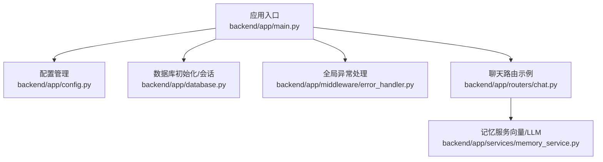
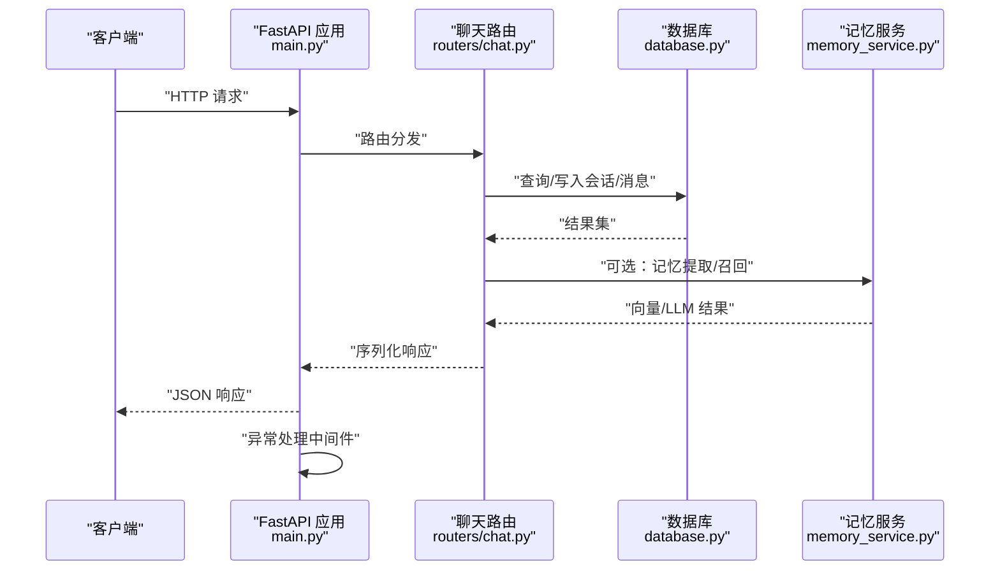
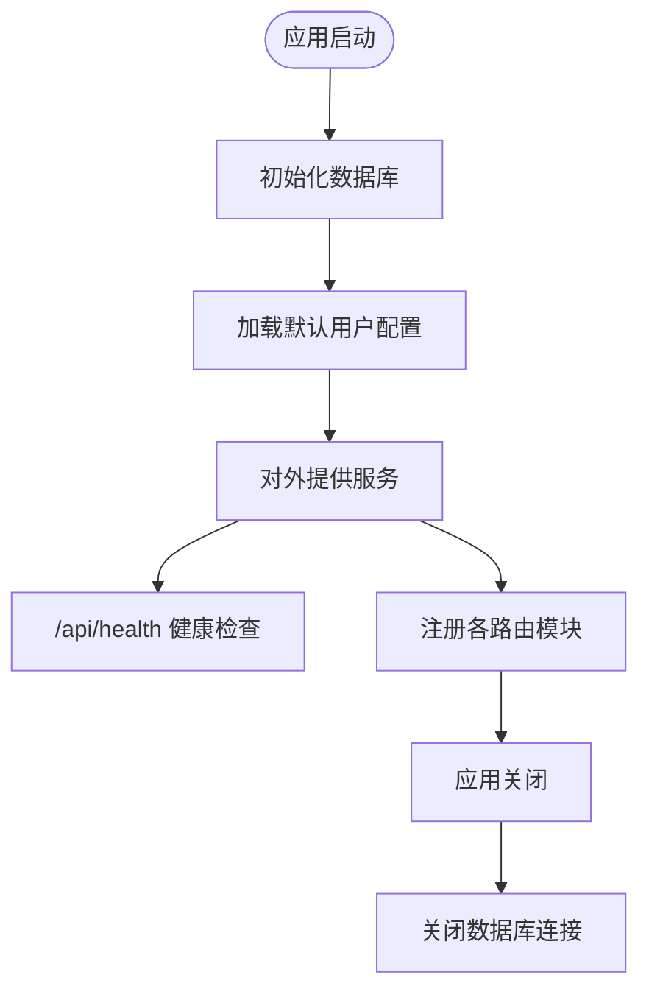
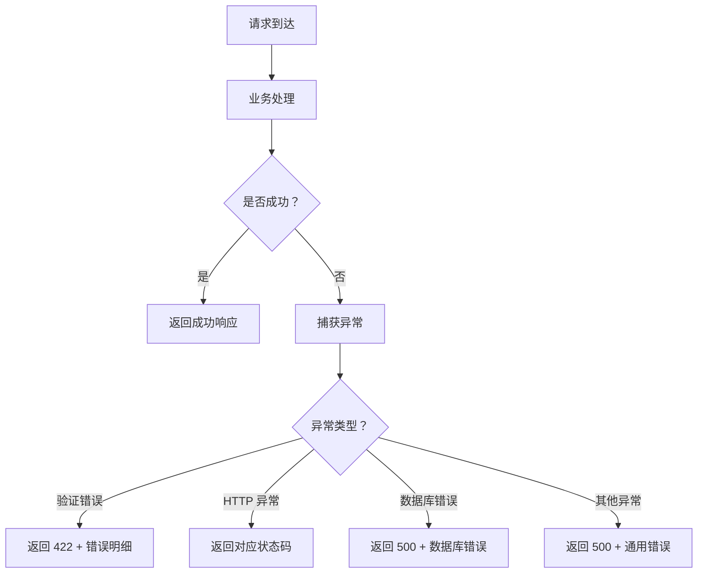
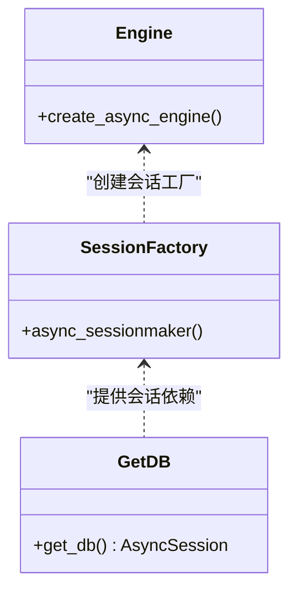
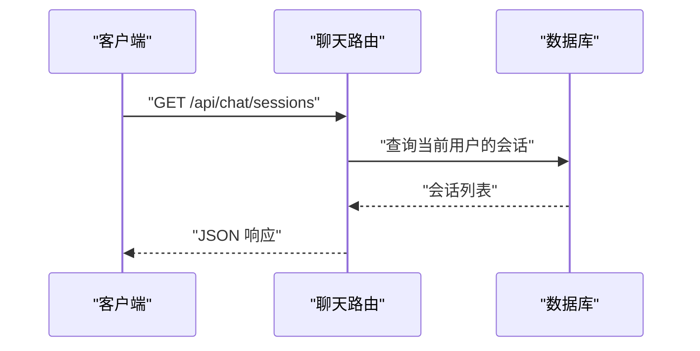
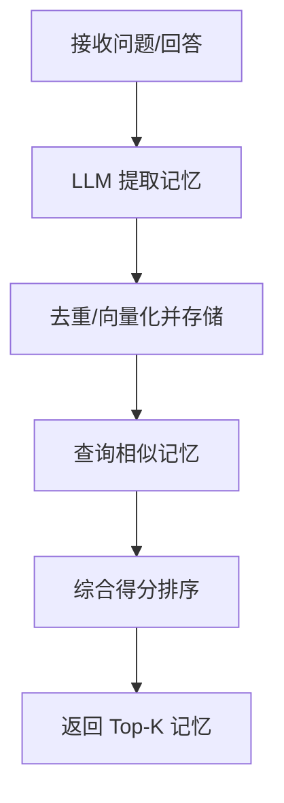
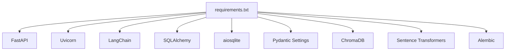

# 监控与日志

<cite>
**本文引用的文件**
- [backend/app/main.py](file://backend/app/main.py)
- [backend/app/config.py](file://backend/app/config.py)
- [backend/app/middleware/error_handler.py](file://backend/app/middleware/error_handler.py)
- [backend/app/database.py](file://backend/app/database.py)
- [backend/app/routers/chat.py](file://backend/app/routers/chat.py)
- [backend/app/services/memory_service.py](file://backend/app/services/memory_service.py)
- [backend/requirements.txt](file://backend/requirements.txt)
</cite>

## 目录
1. [简介](#简介)
2. [项目结构](#项目结构)
3. [核心组件](#核心组件)
4. [架构总览](#架构总览)
5. [详细组件分析](#详细组件分析)
6. [依赖分析](#依赖分析)
7. [性能考虑](#性能考虑)
8. [故障排查指南](#故障排查指南)
9. [结论](#结论)
10. [附录](#附录)

## 简介
本文件面向 PaperChat 系统的监控与日志管理，目标是帮助运维与开发团队建立完善的可观测性体系，覆盖应用性能监控（APM）、日志收集与分类、错误追踪与告警、以及 Prometheus/Grafana 可视化方案。由于当前代码库尚未集成专门的监控与日志库，本文提供基于现有代码结构的落地建议与最佳实践，便于后续逐步引入。

## 项目结构
后端采用 FastAPI 架构，核心入口负责应用生命周期、CORS、全局异常处理与路由注册；数据库层通过 SQLAlchemy 异步引擎管理连接；中间件提供统一异常处理；部分业务服务（如记忆服务）涉及外部模型与向量计算，具备可观测性改造的天然场景。

图表来源
- [backend/app/main.py:55-95](file://backend/app/main.py#L55-L95)
- [backend/app/config.py:15-44](file://backend/app/config.py#L15-L44)
- [backend/app/database.py:13-48](file://backend/app/database.py#L13-L48)
- [backend/app/middleware/error_handler.py:73-92](file://backend/app/middleware/error_handler.py#L73-L92)
- [backend/app/routers/chat.py:18](file://backend/app/routers/chat.py#L18)
- [backend/app/services/memory_service.py:46-66](file://backend/app/services/memory_service.py#L46-L66)

章节来源
- [backend/app/main.py:55-114](file://backend/app/main.py#L55-L114)
- [backend/app/config.py:15-44](file://backend/app/config.py#L15-L44)
- [backend/app/database.py:13-81](file://backend/app/database.py#L13-L81)
- [backend/app/middleware/error_handler.py:73-92](file://backend/app/middleware/error_handler.py#L73-L92)
- [backend/app/routers/chat.py:18](file://backend/app/routers/chat.py#L18)
- [backend/app/services/memory_service.py:46-66](file://backend/app/services/memory_service.py#L46-L66)

## 核心组件
- 应用入口与生命周期：负责数据库初始化、默认用户配置加载、CORS 与路由注册，并提供健康检查端点。
- 配置中心：集中管理应用名称、调试开关、数据库连接、JWT、CORS、上传目录与大小限制等。
- 全局异常处理：统一拦截 Pydantic 验证错误、HTTP 异常、SQLAlchemy 错误与通用异常，返回结构化错误响应。
- 数据库连接管理：异步引擎与会话工厂，支持依赖注入与事务回滚。
- 路由与业务：以聊天路由为例，展示数据访问与业务逻辑组织方式。
- 记忆服务：涉及 LLM 调用与向量计算，具备可观测性改造的典型场景。

章节来源
- [backend/app/main.py:16-52](file://backend/app/main.py#L16-L52)
- [backend/app/config.py:15-44](file://backend/app/config.py#L15-L44)
- [backend/app/middleware/error_handler.py:11-70](file://backend/app/middleware/error_handler.py#L11-L70)
- [backend/app/database.py:13-48](file://backend/app/database.py#L13-L48)
- [backend/app/routers/chat.py:21-65](file://backend/app/routers/chat.py#L21-L65)
- [backend/app/services/memory_service.py:83-154](file://backend/app/services/memory_service.py#L83-L154)

## 架构总览
下图展示了 PaperChat 的运行时关键路径：客户端请求经由 FastAPI 路由进入业务层，访问数据库与外部服务（如 LLM），异常统一由中间件处理，最终返回响应。健康检查端点用于系统自检。

图表来源
- [backend/app/main.py:55-95](file://backend/app/main.py#L55-L95)
- [backend/app/routers/chat.py:21-65](file://backend/app/routers/chat.py#L21-L65)
- [backend/app/database.py:30-48](file://backend/app/database.py#L30-L48)
- [backend/app/services/memory_service.py:83-154](file://backend/app/services/memory_service.py#L83-L154)

## 详细组件分析

### 应用入口与健康检查
- 生命周期钩子：启动时初始化数据库并加载默认用户配置；关闭时释放数据库连接。
- 健康检查端点：提供基础状态信息，便于外部监控系统探测。
- CORS 与路由注册：统一跨域策略与模块化路由挂载。

图表来源
- [backend/app/main.py:16-52](file://backend/app/main.py#L16-L52)
- [backend/app/main.py:102-114](file://backend/app/main.py#L102-L114)

章节来源
- [backend/app/main.py:16-52](file://backend/app/main.py#L16-L52)
- [backend/app/main.py:102-114](file://backend/app/main.py#L102-L114)

### 全局异常处理
- 分类处理：Pydantic 验证错误、HTTP 异常、SQLAlchemy 错误、通用异常。
- 统一响应：标准化错误码、消息与数据字段，便于前端与监控系统消费。
- 日志记录：当前实现使用标准输出打印错误详情，建议替换为结构化日志框架。

图表来源
- [backend/app/middleware/error_handler.py:11-70](file://backend/app/middleware/error_handler.py#L11-L70)

章节来源
- [backend/app/middleware/error_handler.py:11-70](file://backend/app/middleware/error_handler.py#L11-L70)

### 数据库连接与依赖注入
- 异步引擎与会话工厂：支持异步查询与事务控制。
- 依赖注入：通过 get_db 提供会话，自动提交/回滚与关闭。
- 默认用户保障：启动时确保默认用户存在，避免权限相关异常。

图表来源
- [backend/app/database.py:13-48](file://backend/app/database.py#L13-L48)

章节来源
- [backend/app/database.py:13-81](file://backend/app/database.py#L13-L81)

### 路由与业务示例（聊天）
- 会话管理：查询、创建、更新、删除、跨文档会话等。
- 数据访问：使用依赖注入的会话对象执行查询与写入。
- 安全约束：校验会话归属与论文权限。

图表来源
- [backend/app/routers/chat.py:21-65](file://backend/app/routers/chat.py#L21-L65)

章节来源
- [backend/app/routers/chat.py:21-65](file://backend/app/routers/chat.py#L21-L65)

### 记忆服务（向量/LLM）
- 记忆提取：基于 LLM 判定对话中有价值的记忆并持久化。
- 向量相似度：使用嵌入模型计算相似度，支持召回与画像构建。
- 性能与稳定性：线程池与异步锁保护模型加载，异常捕获与回滚。

图表来源
- [backend/app/services/memory_service.py:83-154](file://backend/app/services/memory_service.py#L83-L154)
- [backend/app/services/memory_service.py:226-300](file://backend/app/services/memory_service.py#L226-L300)

章节来源
- [backend/app/services/memory_service.py:83-154](file://backend/app/services/memory_service.py#L83-L154)
- [backend/app/services/memory_service.py:226-300](file://backend/app/services/memory_service.py#L226-L300)

## 依赖分析
- 外部依赖：FastAPI、Uvicorn、LangChain、SQLAlchemy、aiosqlite、Pydantic Settings、ChromaDB、Sentence Transformers、Alembic 等。
- 观测性相关：当前未发现显式的 APM、Prometheus、日志库依赖，需后续引入。

图表来源
- [backend/requirements.txt:1-19](file://backend/requirements.txt#L1-L19)

章节来源
- [backend/requirements.txt:1-19](file://backend/requirements.txt#L1-L19)

## 性能考虑
- 请求响应时间
  - 在路由层增加请求耗时统计（毫秒级），记录方法、路径、状态码与耗时，便于定位慢接口。
  - 对外部 LLM/向量服务调用增加超时与重试策略，避免阻塞主流程。
- 并发连接数
  - 数据库连接池参数需结合并发峰值进行调优；监控活跃连接数与等待队列长度。
  - Web 服务器（Uvicorn）进程与 worker 数量应与 CPU 核数匹配，避免过度上下文切换。
- 内存使用率
  - 记忆服务的嵌入模型加载与向量计算可能占用较多内存，建议限制并发与缓存命中率。
  - 定期触发记忆衰减与清理，降低长期未访问记忆的影响。

## 故障排查指南
- 健康检查
  - 通过 /api/health 端点确认应用存活与版本信息。
- 数据库问题
  - 若出现连接异常，检查数据库 URL 与连接池配置；查看会话提交/回滚逻辑是否正确。
- 异常定位
  - 全局异常处理器已统一返回结构化错误；建议在生产环境接入结构化日志与追踪 ID，便于跨服务串联。
- LLM/向量异常
  - 记忆服务中对 LLM/向量调用有异常捕获与回滚；若频繁失败，检查 API 密钥、网络连通性与超时设置。

章节来源
- [backend/app/main.py:102-114](file://backend/app/main.py#L102-L114)
- [backend/app/database.py:30-48](file://backend/app/database.py#L30-L48)
- [backend/app/middleware/error_handler.py:43-70](file://backend/app/middleware/error_handler.py#L43-L70)
- [backend/app/services/memory_service.py:152-154](file://backend/app/services/memory_service.py#L152-L154)

## 结论
当前代码库已具备良好的基础结构与异常处理能力，适合在此基础上引入专业的监控与日志体系。建议优先完成日志标准化、错误追踪与告警配置，再逐步完善 APM 与可视化面板，以实现端到端的可观测性闭环。

## 附录

### 监控与日志实施建议（基于现有代码）
- 应用性能监控（APM）
  - 接入 OpenTelemetry 或同类 APM SDK，在应用入口与关键业务路径埋点，采集请求耗时、并发、错误率与资源使用。
  - 对外部 LLM/向量服务调用增加 span 与标签，便于定位性能瓶颈。
- 日志收集与分类
  - 使用结构化日志（JSON），区分访问日志、错误日志与业务日志，按级别落盘与归档。
  - 为每条日志附加 trace_id/span_id，便于链路追踪。
- Prometheus 与 Grafana
  - 通过 APM 导出指标或自定义指标端点，Prometheus 抓取后在 Grafana 中创建仪表板：请求速率、P95/P99 延迟、错误率、并发连接、内存使用、LLM 调用耗时与成功率。
- 错误追踪与告警
  - 将全局异常处理器输出对接错误追踪平台（如 Sentry），自动上报异常堆栈与上下文。
  - 设置阈值告警：错误率上升、延迟突增、连接池耗尽、内存使用率过高。
- APM 工具集成（Sentry 等）
  - 在应用启动时初始化 SDK，配置 DSN、环境与用户标识。
  - 对关键业务（如记忆提取、向量召回）增加手动标记与面包屑，提升可诊断性。
- 日志分析与查询最佳实践
  - 使用日志聚合平台（如 ELK/EFK 或云厂商日志服务），建立索引与查询模板。
  - 常用查询：按 trace_id 聚合一次完整请求链路；按错误码/异常类型统计趋势；按路由/用户维度对比性能。
- 系统健康检查与故障诊断
  - 健康检查端点用于存活探测；配合外部探针定期探测关键依赖（数据库、LLM 服务）。
  - 故障时启用降级策略（如禁用记忆服务、限流、缓存兜底）并记录诊断信息。