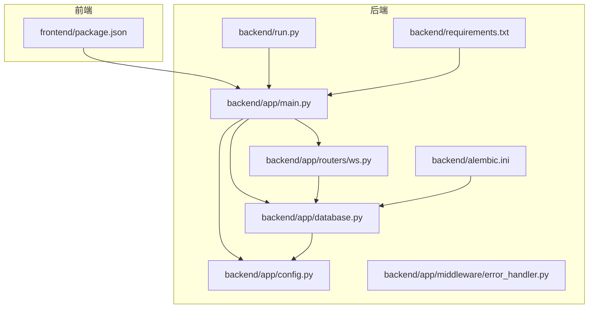
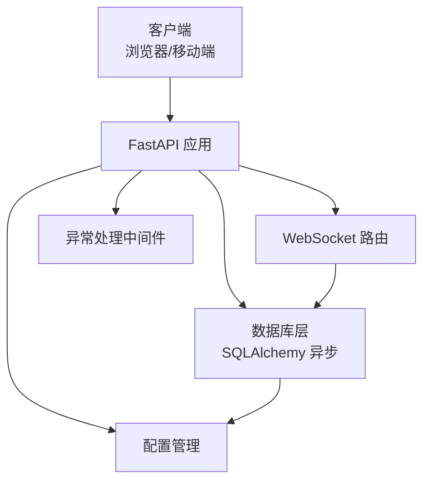
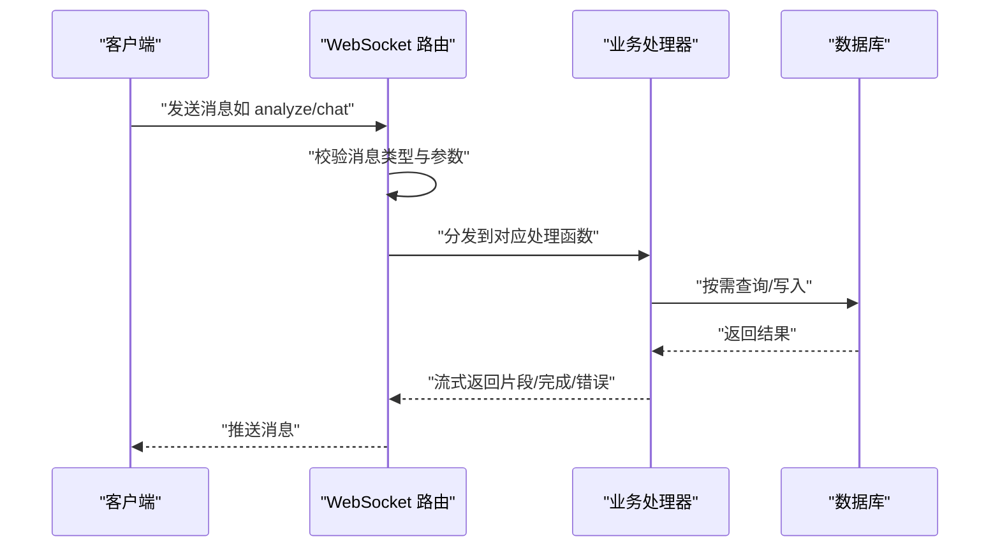
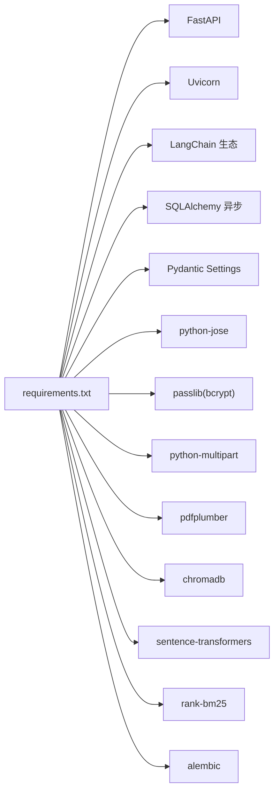

# 部署与运维

<cite>
**本文引用的文件**
- [backend/main.py](file://backend/main.py)
- [backend/app/main.py](file://backend/app/main.py)
- [backend/run.py](file://backend/run.py)
- [backend/requirements.txt](file://backend/requirements.txt)
- [backend/app/config.py](file://backend/app/config.py)
- [backend/app/database.py](file://backend/app/database.py)
- [backend/app/middleware/error_handler.py](file://backend/app/middleware/error_handler.py)
- [backend/app/routers/ws.py](file://backend/app/routers/ws.py)
- [backend/app/services/pdf_service.py](file://backend/app/services/pdf_service.py)
- [backend/alembic.ini](file://backend/alembic.ini)
- [frontend/package.json](file://frontend/package.json)
</cite>

## 目录
1. [简介](#简介)
2. [项目结构](#项目结构)
3. [核心组件](#核心组件)
4. [架构总览](#架构总览)
5. [详细组件分析](#详细组件分析)
6. [依赖分析](#依赖分析)
7. [性能考虑](#性能考虑)
8. [故障排查指南](#故障排查指南)
9. [结论](#结论)
10. [附录](#附录)

## 简介
本文件面向 PaperChat 生产环境的部署与运维，覆盖服务器与依赖要求、环境变量配置、Docker 容器化与编排、高可用与负载均衡、监控与日志、备份与恢复、安全加固以及运维自动化与流水线建议。文档基于仓库现有代码与配置进行说明，并提供可落地的实践建议。

## 项目结构
PaperChat 采用前后端分离架构：
- 后端基于 FastAPI，提供 REST API 与 WebSocket 服务，使用 SQLAlchemy 异步 ORM 进行数据库访问，Alembic 进行迁移管理。
- 前端基于 Vite + React，通过 API 与 WebSocket 与后端交互。
- 项目包含开发与生产相关的配置与启动脚本，便于本地开发与生产部署。

**图表来源**
- [backend/app/main.py:1-114](file://backend/app/main.py#L1-L114)
- [backend/app/routers/ws.py:1-436](file://backend/app/routers/ws.py#L1-L436)
- [backend/app/database.py:1-81](file://backend/app/database.py#L1-L81)
- [backend/app/config.py:1-44](file://backend/app/config.py#L1-L44)
- [backend/app/middleware/error_handler.py:1-92](file://backend/app/middleware/error_handler.py#L1-L92)
- [backend/run.py:1-31](file://backend/run.py#L1-L31)
- [backend/requirements.txt:1-19](file://backend/requirements.txt#L1-L19)
- [backend/alembic.ini:1-150](file://backend/alembic.ini#L1-L150)
- [frontend/package.json:1-36](file://frontend/package.json#L1-L36)

**章节来源**
- [backend/app/main.py:1-114](file://backend/app/main.py#L1-L114)
- [backend/app/routers/ws.py:1-436](file://backend/app/routers/ws.py#L1-L436)
- [backend/app/database.py:1-81](file://backend/app/database.py#L1-L81)
- [backend/app/config.py:1-44](file://backend/app/config.py#L1-L44)
- [backend/app/middleware/error_handler.py:1-92](file://backend/app/middleware/error_handler.py#L1-L92)
- [backend/run.py:1-31](file://backend/run.py#L1-L31)
- [backend/requirements.txt:1-19](file://backend/requirements.txt#L1-L19)
- [backend/alembic.ini:1-150](file://backend/alembic.ini#L1-L150)
- [frontend/package.json:1-36](file://frontend/package.json#L1-L36)

## 核心组件
- 应用入口与生命周期：后端通过 FastAPI 应用入口创建应用实例，注册中间件、路由与生命周期钩子；在启动时初始化数据库并在关闭时释放连接。
- WebSocket 服务：提供论文分析、问答、RAG、跨文档问答、Agent 等多种能力，支持任务取消与统一聊天入口。
- 数据库与迁移：使用 SQLAlchemy 异步引擎与会话工厂，默认 SQLite，支持 Alembic 迁移。
- 配置管理：通过 pydantic-settings 从 .env 读取配置，包含数据库、JWT、CORS、上传目录与大小限制等。
- 异常处理：统一处理校验、HTTP、数据库与通用异常，返回标准化错误响应。
- PDF 处理：封装 pdfplumber 的元数据、文本块与全文提取能力。
- 启动脚本：提供 uvicorn 启动方式与 HuggingFace 缓存目录设置。

**章节来源**
- [backend/app/main.py:16-95](file://backend/app/main.py#L16-L95)
- [backend/app/routers/ws.py:76-436](file://backend/app/routers/ws.py#L76-L436)
- [backend/app/database.py:13-81](file://backend/app/database.py#L13-L81)
- [backend/app/config.py:15-44](file://backend/app/config.py#L15-L44)
- [backend/app/middleware/error_handler.py:73-92](file://backend/app/middleware/error_handler.py#L73-L92)
- [backend/app/services/pdf_service.py:11-194](file://backend/app/services/pdf_service.py#L11-L194)
- [backend/run.py:23-31](file://backend/run.py#L23-L31)

## 架构总览
后端以 FastAPI 为核心，WebSocket 路由负责实时交互，数据库层提供异步访问，配置与中间件保障运行稳定性。前端通过 API 与 WebSocket 与后端交互。

**图表来源**
- [backend/app/main.py:55-95](file://backend/app/main.py#L55-L95)
- [backend/app/routers/ws.py:76-120](file://backend/app/routers/ws.py#L76-L120)
- [backend/app/database.py:13-48](file://backend/app/database.py#L13-L48)
- [backend/app/config.py:15-44](file://backend/app/config.py#L15-L44)
- [backend/app/middleware/error_handler.py:73-92](file://backend/app/middleware/error_handler.py#L73-L92)

## 详细组件分析

### 配置与环境变量
- 配置来源：pydantic-settings 从 .env 文件加载，支持调试开关、数据库 URL、JWT 密钥与算法、CORS 来源、上传目录与大小限制等。
- 建议：生产环境务必设置安全密钥、禁用调试、配置生产数据库（如 PostgreSQL），并确保 .env 权限最小化。

**章节来源**
- [backend/app/config.py:15-44](file://backend/app/config.py#L15-L44)

### 数据库与迁移
- 默认 SQLite：适用于开发与小规模场景；生产建议迁移到 PostgreSQL 并启用连接池与只读副本。
- 初始化与关闭：应用启动时创建表并确保默认用户存在；关闭时释放引擎。
- Alembic：提供迁移脚本位置与日志配置，建议在 CI 中执行迁移。

**章节来源**
- [backend/app/database.py:13-81](file://backend/app/database.py#L13-L81)
- [backend/alembic.ini:1-150](file://backend/alembic.ini#L1-150)

### WebSocket 服务与消息协议
- 支持的消息类型：分析、问答、RAG、深度分析、Agent、跨文档、统一聊天入口、取消任务等。
- 认证：支持 JWT Token，未提供时降级为默认用户。
- 任务管理：每连接维护独立状态与运行中的任务集合，支持取消与并发清理。

**图表来源**
- [backend/app/routers/ws.py:76-436](file://backend/app/routers/ws.py#L76-L436)

**章节来源**
- [backend/app/routers/ws.py:32-54](file://backend/app/routers/ws.py#L32-L54)
- [backend/app/routers/ws.py:120-417](file://backend/app/routers/ws.py#L120-L417)

### 异常处理与健康检查
- 统一异常处理：Pydantic 校验、HTTP、SQLAlchemy、通用异常均返回标准化结构。
- 健康检查：提供 /api/health 探活端点。

**章节来源**
- [backend/app/middleware/error_handler.py:11-92](file://backend/app/middleware/error_handler.py#L11-L92)
- [backend/app/main.py:102-114](file://backend/app/main.py#L102-L114)

### PDF 处理服务
- 功能：元数据提取、文本块提取、全文提取、页数统计、有效性校验。
- 适用：论文解析与检索增强的基础能力。

**章节来源**
- [backend/app/services/pdf_service.py:11-194](file://backend/app/services/pdf_service.py#L11-L194)

### 启动与开发服务器
- 开发启动：run.py 使用 uvicorn 在 0.0.0.0:8000 启动，开启热重载。
- 生产建议：使用 gunicorn/uwsgi + ASGI，配合反向代理与进程/线程池。

**章节来源**
- [backend/run.py:23-31](file://backend/run.py#L23-L31)

## 依赖分析
- 后端依赖：FastAPI、Uvicorn、LangChain 生态、SQLAlchemy 异步、Pydantic Settings、JWT、密码散列、multipart、PDF 解析、向量库与检索等。
- 前端依赖：React 生态、PDF.js、路由、状态管理等。

**图表来源**
- [backend/requirements.txt:1-19](file://backend/requirements.txt#L1-L19)

**章节来源**
- [backend/requirements.txt:1-19](file://backend/requirements.txt#L1-L19)
- [frontend/package.json:12-34](file://frontend/package.json#L12-L34)

## 性能考虑
- 数据库：生产使用 PostgreSQL，启用连接池、只读副本与索引优化；避免 N+1 查询。
- WebSocket：合理控制并发任务数量与内存占用，及时取消冗余任务。
- LLM 与嵌入：模型与向量库资源消耗大，建议独立服务与缓存策略。
- 前端：Vite 构建产物部署于静态服务器，CDN 加速与 Gzip/Brotli 压缩。
- 反向代理：Nginx/Traefik 提升并发与静态资源处理能力。

## 故障排查指南
- 健康检查：通过 /api/health 判断服务状态。
- 日志：生产环境建议接入结构化日志与集中式日志平台，记录异常堆栈与请求上下文。
- 数据库：关注连接泄漏与事务回滚，定期巡检慢查询。
- WebSocket：确认认证 Token、消息格式与任务取消逻辑。
- PDF 解析：检查文件权限、磁盘空间与 pdfplumber 版本兼容性。

**章节来源**
- [backend/app/main.py:102-114](file://backend/app/main.py#L102-L114)
- [backend/app/middleware/error_handler.py:43-70](file://backend/app/middleware/error_handler.py#L43-L70)
- [backend/app/routers/ws.py:424-436](file://backend/app/routers/ws.py#L424-L436)

## 结论
本部署与运维文档基于现有代码与配置，给出了生产环境的关键实践建议。建议优先完成数据库替换、HTTPS 与访问控制加固、监控与日志体系、备份与恢复流程以及容器化与高可用编排，以确保系统的稳定性与可维护性。

## 附录

### 服务器与依赖要求
- 操作系统：Linux（推荐 Ubuntu/CentOS）。
- Python：3.10+。
- 数据库：生产建议 PostgreSQL；开发可使用 SQLite。
- 容器：Docker 与 Compose（见后续容器化章节）。
- 反向代理：Nginx/Traefik。
- 监控：Prometheus/Grafana 或云厂商监控。

### 环境变量配置（建议）
- APP_NAME、DEBUG（生产关闭）
- DATABASE_URL（生产使用 PostgreSQL）
- JWT_SECRET_KEY（高强度随机值）、JWT_ALGORITHM
- CORS_ORIGINS（生产限定域名）
- UPLOAD_DIR、MAX_FILE_SIZE
- HF_ENDPOINT、HF_HOME（模型缓存）

**章节来源**
- [backend/app/config.py:18-40](file://backend/app/config.py#L18-L40)

### Docker 容器化部署方案
- 镜像构建
  - 基础镜像：python:3.10-slim
  - 安装系统依赖（如编译工具链、字体、CA 证书）
  - 复制 requirements.txt 并安装 Python 依赖
  - 复制后端代码与前端构建产物（或分别构建）
  - 暴露端口 8000
  - 启动命令：uvicorn 或 gunicorn
- 容器编排
  - 使用 docker-compose 管理后端、数据库、向量库与反向代理
  - 数据卷：持久化上传目录与数据库文件
  - 网络：隔离后端与数据库
- 数据持久化
  - 使用命名卷或主机挂载保存数据库与上传目录
  - 备份策略：定时快照或逻辑导出

### 负载均衡与高可用
- 多实例：后端多副本 + 反向代理轮询
- 会话亲和：WebSocket 连接需确保粘性会话或共享状态
- 数据高可用：数据库主从复制、只读副本分流
- 健康探针：/api/health 与数据库连通性检查
- 故障转移：自动重启与服务发现

### 监控与日志
- 指标：请求量、延迟、错误率、并发连接数、数据库连接池使用率
- 日志：结构化日志、按级别分层、采样与脱敏
- 告警：阈值触发、收敛与通知渠道

### 备份与恢复
- 数据库：增量/全量备份、跨区域复制、周期性校验
- 文件存储：对象存储或共享存储快照
- 灾难恢复：RTO/RPO 目标、演练与文档化流程

### 安全加固
- HTTPS：Let’s Encrypt 自动证书与强制跳转
- 防火墙：仅开放必要端口，内网白名单
- 访问控制：JWT 强认证、速率限制、CORS 白名单
- 依赖更新：定期扫描与升级

### 运维自动化与流水线
- 构建：多阶段 Docker 构建、依赖缓存
- 测试：单元测试、集成测试、端到端测试
- 部署：蓝绿/金丝雀发布、回滚策略
- 监控：日志采集、指标上报、告警规则