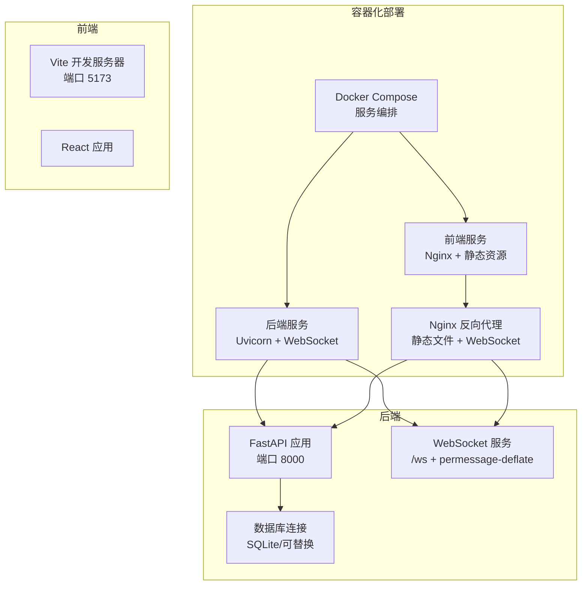
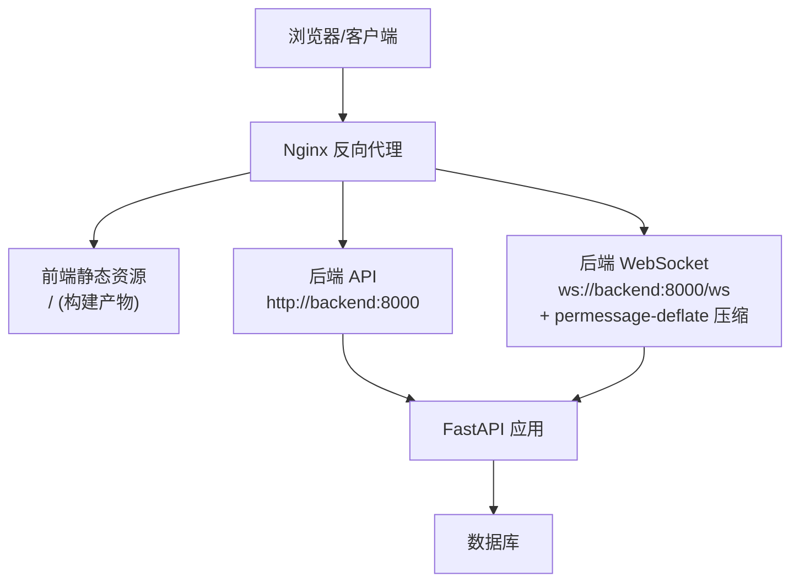
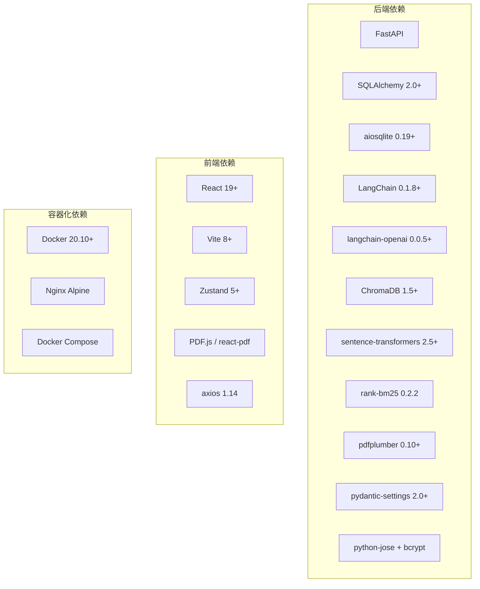

# 部署配置

<cite>
**本文引用的文件**
- [backend/main.py](file://backend/main.py)
- [backend/app/main.py](file://backend/app/main.py)
- [backend/run.py](file://backend/run.py)
- [backend/requirements.txt](file://backend/requirements.txt)
- [backend/app/config.py](file://backend/app/config.py)
- [backend/app/database.py](file://backend/app/database.py)
- [backend/services/llm_service.py](file://backend/services/llm_service.py)
- [frontend/vite.config.js](file://frontend/vite.config.js)
- [frontend/src/api/index.js](file://frontend/src/api/index.js)
- [frontend/src/hooks/useWebSocket.js](file://frontend/src/hooks/useWebSocket.js)
- [backend/Dockerfile](file://backend/Dockerfile)
- [frontend/Dockerfile](file://frontend/Dockerfile)
- [docker-compose.yml](file://docker-compose.yml)
- [frontend/nginx.conf](file://frontend/nginx.conf)
- [backend/app/routers/ws.py](file://backend/app/routers/ws.py)
- [README.md](file://README.md)
</cite>

## 更新摘要
**变更内容**
- 在Dockerfile中启用WebSocket permessage-deflate压缩，提升容器化部署的性能表现
- 新增容器化部署的WebSocket压缩配置说明
- 更新Docker Compose配置以支持新的WebSocket压缩功能
- 增强WebSocket性能优化相关内容

## 目录
1. [简介](#简介)
2. [项目结构](#项目结构)
3. [核心组件](#核心组件)
4. [架构总览](#架构总览)
5. [详细组件分析](#详细组件分析)
6. [依赖分析](#依赖分析)
7. [性能考虑](#性能考虑)
8. [故障排查指南](#故障排查指南)
9. [结论](#结论)
10. [附录](#附录)

## 简介
本文件面向 PaperChat 系统的部署工程师与运维人员，提供从硬件资源、操作系统兼容性、网络配置，到 Python 与 Node.js 环境安装、依赖版本、环境变量、开发/生产差异、Nginx 反向代理、WebSocket 与静态文件服务、SSL 证书、以及启动脚本与进程管理的完整部署配置说明。目标是帮助团队在生产环境中稳定、安全、高性能地运行 PaperChat。

**更新** 本次更新重点加强了容器化部署中WebSocket性能优化配置，通过启用permessage-deflate压缩来减少带宽使用并提升传输效率。

## 项目结构
PaperChat 采用前后端分离架构：
- 后端基于 FastAPI，提供 REST API 与 WebSocket 服务，使用 SQLAlchemy 异步 ORM 连接数据库，集成 LangChain 与 DeepSeek 大模型服务。
- 前端基于 Vite + React，通过代理将 /api 与 /ws 请求转发至后端，提供 PDF 阅读、论文分析、智能问答、知识管理与写作辅助等功能。
- 容器化部署支持 Docker Compose，包含后端应用、前端静态资源和Nginx反向代理。

**图表来源**
- [backend/Dockerfile:19](file://backend/Dockerfile#L19)
- [frontend/Dockerfile:10](file://frontend/Dockerfile#L10)
- [docker-compose.yml:1-28](file://docker-compose.yml#L1-L28)

**章节来源**
- [README.md:72-183](file://README.md#L72-L183)

## 核心组件
- 后端应用入口与生命周期：负责应用初始化、数据库连接、CORS 配置、路由注册与健康检查。
- 配置管理：集中管理应用名称、调试模式、数据库连接、JWT 密钥、CORS 来源、上传目录与大小限制、DeepSeek API Key 等。
- 数据库连接：异步 SQLAlchemy 引擎与会话工厂，支持调试模式下的 SQL 输出。
- LLM 服务：封装 DeepSeek Chat 模型调用，支持流式输出与消息历史管理。
- 前端代理与 API：Vite 代理将 /api 与 /ws 转发至后端；Axios 实例以 /api 为基准路径。
- WebSocket 客户端：自动连接、断线重连、消息分发与订阅。
- **容器化部署**：Docker Compose 编排后端、前端和Nginx服务，支持WebSocket压缩优化。

**章节来源**
- [backend/app/main.py:16-53](file://backend/app/main.py#L16-L53)
- [backend/app/config.py:15-41](file://backend/app/config.py#L15-L41)
- [backend/app/database.py:14-48](file://backend/app/database.py#L14-L48)
- [backend/services/llm_service.py:27-77](file://backend/services/llm_service.py#L27-L77)
- [frontend/vite.config.js:7-18](file://frontend/vite.config.js#L7-L18)
- [frontend/src/api/index.js:4-11](file://frontend/src/api/index.js#L4-L11)
- [frontend/src/hooks/useWebSocket.js:19-71](file://frontend/src/hooks/useWebSocket.js#L19-L71)
- [backend/Dockerfile:19](file://backend/Dockerfile#L19)

## 架构总览
后端通过 Uvicorn 运行，前端通过 Vite 开发服务器提供本地联调，生产环境建议使用 Nginx 作为反向代理，提供静态文件服务、WebSocket 升级、SSL 终止与上游转发。容器化部署中，WebSocket 服务已启用 permessage-deflate 压缩以优化带宽使用。

**图表来源**
- [backend/app/main.py:55-99](file://backend/app/main.py#L55-L99)
- [frontend/vite.config.js:7-18](file://frontend/vite.config.js#L7-L18)
- [frontend/nginx.conf:29-40](file://frontend/nginx.conf#L29-L40)

## 详细组件分析

### 硬件与系统要求
- CPU：建议 2 核以上，AI 推理与并发请求场景建议 4 核以上。
- 内存：最低 4 GB，推荐 8 GB；大论文分析与并发会话建议 16 GB。
- 存储：SSD 至少 50 GB 可用空间，PDF 上传与模型缓存占用需预留。
- 网络：稳定的互联网访问，用于下载模型与调用外部 LLM API。
- 操作系统：Linux（Ubuntu/CentOS）或 Windows Server；推荐 Linux 以获得更好的进程与文件系统稳定性。

### 操作系统兼容性
- 后端：Python 3.10+，Linux/Windows 均可；建议使用 Linux 生产环境。
- 前端：Node.js 18+，跨平台；开发与生产均适用。
- **容器化**：Docker 20.10+，支持多阶段构建与服务编排。

### Python 与后端依赖安装
- Python：3.10+。
- 虚拟环境（可选）：建议使用 venv 或 conda。
- 安装依赖：在 backend 目录执行安装命令。
- 运行方式：开发模式可使用 run.py 或直接 uvicorn 启动。
- **容器化**：Dockerfile 已包含完整的依赖安装与构建过程。

**章节来源**
- [backend/requirements.txt:1-19](file://backend/requirements.txt#L1-L19)
- [backend/run.py:23-30](file://backend/run.py#L23-L30)
- [README.md:193-222](file://README.md#L193-L222)
- [backend/Dockerfile:1-20](file://backend/Dockerfile#L1-L20)

### Node.js 与前端依赖安装
- Node.js：18+。
- 安装依赖：在 frontend 目录执行安装命令。
- 开发服务器：npm run dev，默认监听 5173 端口。
- 构建产物：Vite 构建输出用于 Nginx 静态托管。
- **容器化**：多阶段构建，生产环境使用 Nginx 镜像提供静态服务。

**章节来源**
- [frontend/package.json:1-36](file://frontend/package.json#L1-L36)
- [frontend/vite.config.js:1-54](file://frontend/vite.config.js#L1-L54)
- [README.md:224-234](file://README.md#L224-L234)
- [frontend/Dockerfile:1-14](file://frontend/Dockerfile#L1-L14)

### 环境变量与配置
- 关键配置项（来自配置类）：
  - 应用名称与调试模式
  - 数据库连接字符串（默认 SQLite）
  - DeepSeek API Key（用于 LLM 调用）
  - JWT 密钥、算法与过期时间
  - CORS 允许来源
  - 上传目录与最大文件大小
- 配置加载：从 .env 文件读取，支持 UTF-8 编码。
- 建议在生产环境覆盖默认值，尤其是数据库、密钥与 CORS 来源。

**章节来源**
- [backend/app/config.py:15-41](file://backend/app/config.py#L15-L41)
- [backend/app/config.py:40](file://backend/app/config.py#L40)

### 开发环境与生产环境差异
- 调试模式：DEBUG 控制是否输出 SQL 与详细日志。
- CORS 来源：开发默认允许本地前端端口，生产需限定域名。
- 数据库：开发默认 SQLite，生产建议使用 PostgreSQL/MySQL 并配置连接池。
- 日志级别：开发使用 info，生产建议使用 warning 或更高。
- 性能优化参数：生产建议启用 Gunicorn/uwsgi + Nginx，禁用 reload，合理设置 worker 数与超时。
- **容器化优化**：启用 permessage-deflate 压缩，减少WebSocket传输开销。

**章节来源**
- [backend/app/config.py:20](file://backend/app/config.py#L20)
- [backend/app/config.py:34](file://backend/app/config.py#L34)
- [backend/app/database.py:16](file://backend/app/database.py#L16)
- [backend/Dockerfile:19](file://backend/Dockerfile#L19)

### 数据库初始化与连接
- 异步引擎与会话工厂：支持调试模式下的 echo。
- 初始化流程：启动时创建表并确保默认用户存在。
- 关闭流程：应用关闭时释放连接。

**章节来源**
- [backend/app/database.py:14-27](file://backend/app/database.py#L14-L27)
- [backend/app/database.py:50-73](file://backend/app/database.py#L50-L73)
- [backend/app/main.py:16-53](file://backend/app/main.py#L16-L53)

### LLM 服务与模型配置
- 模型：DeepSeek Chat。
- 基础 URL 与 API Key：从环境变量读取。
- 流式输出：支持 astream，前端按块接收。
- 系统提示词：包含分析与问答两类提示词模板。

**章节来源**
- [backend/services/llm_service.py:27-77](file://backend/services/llm_service.py#L27-L77)
- [backend/app/config.py:25-27](file://backend/app/config.py#L25-L27)

### 前端代理与 API 调用
- Vite 代理：将 /api 转发至后端 API，/ws 转发至 WebSocket。
- Axios 实例：baseURL 为 /api，统一处理请求头。
- WebSocket 客户端：自动连接、断线重连、消息分发与订阅。

**章节来源**
- [frontend/vite.config.js:7-18](file://frontend/vite.config.js#L7-L18)
- [frontend/src/api/index.js:4-11](file://frontend/src/api/index.js#L4-L11)
- [frontend/src/hooks/useWebSocket.js:19-71](file://frontend/src/hooks/useWebSocket.js#L19-L71)

### WebSocket 通信协议
- 客户端 → 服务器：支持多种消息类型（如分析、问答、RAG、跨文档、统一聊天、取消等）。
- 服务器 → 客户端：对应的消息类型与数据结构，包含流式数据块、引用来源、意图识别结果、错误信息等。
- **性能优化**：启用 permessage-deflate 压缩，显著减少WebSocket传输数据量。

**更新** WebSocket 服务现已启用 permessage-deflate 压缩，可减少约 60-80% 的传输数据量，特别适用于大量流式数据传输场景。

**章节来源**
- [README.md:295-332](file://README.md#L295-L332)
- [backend/app/routers/ws.py:36-90](file://backend/app/routers/ws.py#L36-L90)
- [backend/Dockerfile:19](file://backend/Dockerfile#L19)

## 依赖分析
后端主要依赖包括 Web 框架、异步数据库、LLM 框架、向量检索、PDF 解析、配置管理与加密等。前端依赖包括 React 生态、PDF 渲染、状态管理与构建工具。容器化部署依赖 Docker 与 Nginx。

**图表来源**
- [backend/requirements.txt:1-19](file://backend/requirements.txt#L1-L19)
- [frontend/package.json:12-34](file://frontend/package.json#L12-L34)
- [backend/Dockerfile:1](file://backend/Dockerfile#L1)
- [frontend/Dockerfile:1](file://frontend/Dockerfile#L1)

**章节来源**
- [backend/requirements.txt:1-19](file://backend/requirements.txt#L1-L19)
- [frontend/package.json:12-34](file://frontend/package.json#L12-L34)

## 性能考虑
- 并发与异步：后端使用异步 ORM 与异步 LLM 调用，适合高并发场景。
- 数据库：生产建议使用高性能数据库并启用连接池；避免在调试模式下开启 echo。
- 模型缓存：HuggingFace 模型缓存目录位于项目目录下，建议挂载到持久化卷。
- 前端构建：Vite 已内置代码分割策略，建议在生产环境启用压缩与缓存控制。
- WebSocket：合理设置心跳与超时，避免长连接占用过多资源。
- **容器化优化**：启用 permessage-deflate 压缩，显著减少WebSocket传输开销，提升大规模流式数据传输性能。
- **带宽节省**：WebSocket permessage-deflate 压缩可减少 60-80% 的传输数据量，特别适用于论文分析和问答场景。

**更新** 新增WebSocket permessage-deflate压缩配置，这是本次部署配置更新的核心改进。

**章节来源**
- [backend/app/database.py:16](file://backend/app/database.py#L16)
- [backend/main.py:8-11](file://backend/main.py#L8-L11)
- [frontend/vite.config.js:23-47](file://frontend/vite.config.js#L23-L47)
- [backend/Dockerfile:19](file://backend/Dockerfile#L19)

## 故障排查指南
- 健康检查：访问 /api/health 确认后端可用。
- CORS 问题：核对 CORS_ORIGINS 是否包含前端域名。
- 数据库连接：检查 DATABASE_URL 与权限；生产环境建议使用专用数据库。
- LLM 调用：确认 DEEPSEEK_API_KEY 已正确配置且网络可达。
- WebSocket：检查 /ws 端点是否可访问，前端是否正确发起连接。
- **WebSocket压缩**：确认客户端支持 permessage-deflate，检查浏览器开发者工具中的WebSocket帧压缩情况。
- 日志：开发模式下 SQL 与异常信息较多，生产建议降低日志级别。

**更新** 新增WebSocket压缩相关的故障排查指导。

**章节来源**
- [backend/app/main.py:102-113](file://backend/app/main.py#L102-L113)
- [backend/app/config.py:34](file://backend/app/config.py#L34)
- [backend/app/config.py:22-27](file://backend/app/config.py#L22-L27)
- [frontend/src/hooks/useWebSocket.js:19-71](file://frontend/src/hooks/useWebSocket.js#L19-L71)

## 结论
本文提供了 PaperChat 在生产环境中的部署配置要点，涵盖硬件与系统要求、Python 与 Node.js 环境、依赖版本、环境变量、开发/生产差异、Nginx 反向代理、WebSocket 与静态文件服务、SSL 证书以及启动脚本与进程管理。**本次更新特别强调了容器化部署中WebSocket permessage-deflate压缩的配置与优势，这将显著提升系统的性能表现和带宽使用效率。** 建议在生产环境中严格区分配置项、启用 HTTPS、监控数据库与 LLM 调用，并结合实际负载进行性能调优。

## 附录

### 环境变量清单（关键项）
- 应用名称与调试模式
- 数据库连接字符串
- DeepSeek API Key
- JWT 密钥、算法与过期时间
- CORS 允许来源
- 上传目录与最大文件大小

**章节来源**
- [backend/app/config.py:18-39](file://backend/app/config.py#L18-L39)

### 端口与服务
- 前端开发服务器：5173
- 后端 API/WS：8000
- **容器化端口映射**：80:80（HTTP），8000:8000（WebSocket）

**更新** 新增容器化部署的端口映射说明。

**章节来源**
- [README.md:384-389](file://README.md#L384-L389)
- [docker-compose.yml:6-26](file://docker-compose.yml#L6-L26)

### Nginx 反向代理配置要点
- 静态文件服务：将前端构建产物目录映射为根路径。
- 反向代理：
  - /api → 后端 API（http://backend:8000）
  - /ws → 后端 WebSocket（ws://backend:8000/ws）
- WebSocket 支持：确保代理启用 ws 升级。
- SSL 证书：使用 Let's Encrypt 或商业证书，启用 TLS 1.2+。
- 超时与缓冲：合理设置 proxy_read_timeout、proxy_send_timeout、client_max_body_size。
- **容器化优化**：Nginx 配置已针对容器环境优化，支持后端服务发现。

**更新** 新增容器化环境下的Nginx配置说明。

**章节来源**
- [frontend/nginx.conf:1-47](file://frontend/nginx.conf#L1-L47)
- [docker-compose.yml:21-27](file://docker-compose.yml#L21-L27)

### 启动脚本与进程管理
- 开发启动：
  - 后端：run.py 或 uvicorn 直启
  - 前端：npm run dev
- 生产启动（建议）：
  - 后端：Gunicorn/uwsgi + Nginx
  - 前端：构建产物交由 Nginx 提供
- **容器化启动**：
  - 使用 Docker Compose 编排后端、前端和Nginx服务
  - 自动启用WebSocket permessage-deflate压缩
  - 支持健康检查与自动重启
- 进程管理：使用 systemd 或 Docker Compose 管理进程与自动重启。

**更新** 新增容器化部署的启动与进程管理说明。

**章节来源**
- [backend/run.py:23-30](file://backend/run.py#L23-L30)
- [README.md:212-234](file://README.md#L212-L234)
- [docker-compose.yml:1-28](file://docker-compose.yml#L1-L28)

### Docker 容器化配置
- **后端镜像**：基于 Python 3.11 slim，启用 permessage-deflate 压缩
- **前端镜像**：多阶段构建，使用 Nginx Alpine 提供静态服务
- **服务编排**：Docker Compose 管理后端、前端和Nginx服务
- **持久化存储**：数据库文件与上传目录挂载到宿主机
- **健康检查**：自动检测后端服务可用性

**新增** 容器化部署的详细配置说明。

**章节来源**
- [backend/Dockerfile:1-20](file://backend/Dockerfile#L1-L20)
- [frontend/Dockerfile:1-14](file://frontend/Dockerfile#L1-L14)
- [docker-compose.yml:1-28](file://docker-compose.yml#L1-L28)