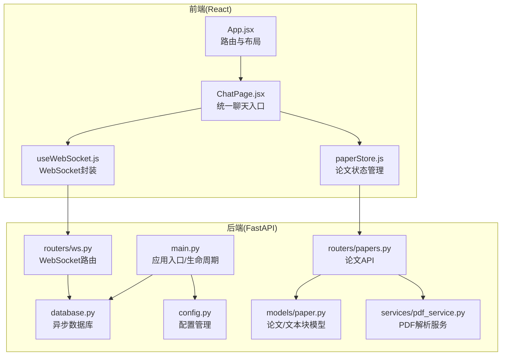
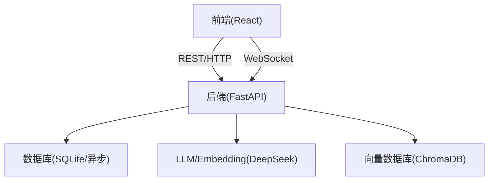
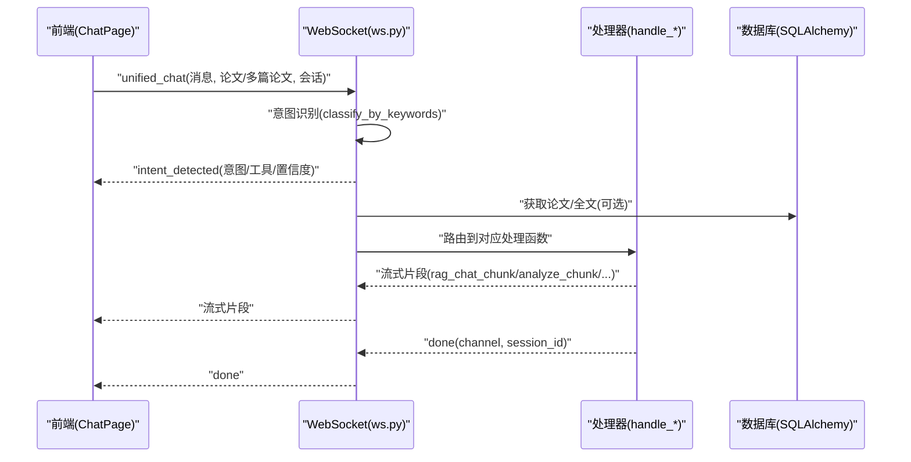
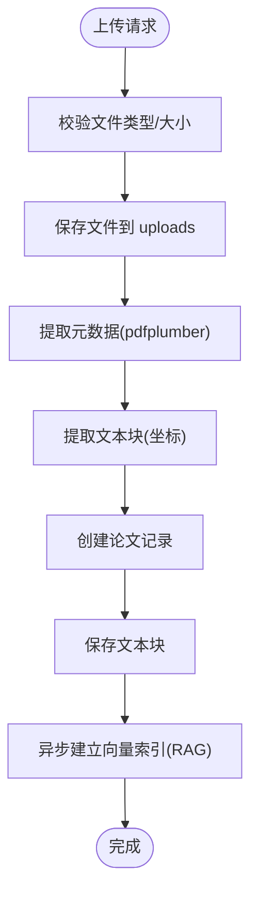
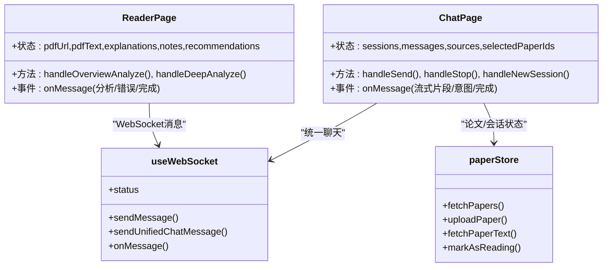
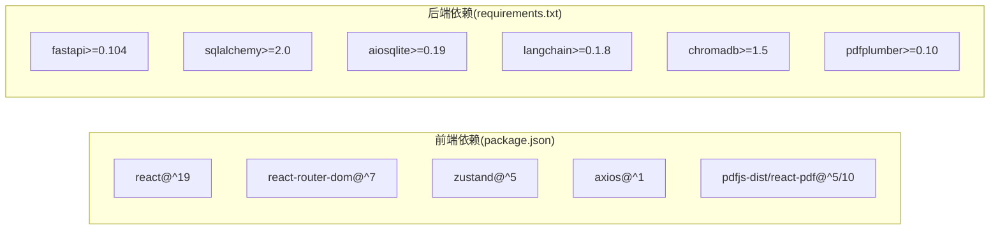

# 项目概述

<cite>
**本文档引用的文件**
- [README.md](file://README.md)
- [backend/app/main.py](file://backend/app/main.py)
- [backend/app/config.py](file://backend/app/config.py)
- [backend/app/database.py](file://backend/app/database.py)
- [backend/app/routers/ws.py](file://backend/app/routers/ws.py)
- [backend/app/routers/papers.py](file://backend/app/routers/papers.py)
- [backend/app/models/paper.py](file://backend/app/models/paper.py)
- [backend/app/services/pdf_service.py](file://backend/app/services/pdf_service.py)
- [frontend/src/App.jsx](file://frontend/src/App.jsx)
- [frontend/src/hooks/useWebSocket.js](file://frontend/src/hooks/useWebSocket.js)
- [frontend/src/pages/ChatPage.jsx](file://frontend/src/pages/ChatPage.jsx)
- [frontend/src/stores/paperStore.js](file://frontend/src/stores/paperStore.js)
- [frontend/package.json](file://frontend/package.json)
</cite>

## 目录
1. [简介](#简介)
2. [项目结构](#项目结构)
3. [核心组件](#核心组件)
4. [架构总览](#架构总览)
5. [详细组件分析](#详细组件分析)
6. [依赖关系分析](#依赖关系分析)
7. [性能考量](#性能考量)
8. [故障排查指南](#故障排查指南)
9. [结论](#结论)
10. [附录](#附录)

## 简介
PaperChat 是一个面向学术论文阅读与问答的智能系统，提供从 PDF 上传、结构化解析、智能问答、高亮标注、笔记管理、知识库、写作辅助到推荐系统的完整能力闭环。系统采用前后端分离架构，后端基于 FastAPI + SQLAlchemy 异步 ORM + LangChain + ChromaDB，前端基于 React + Zustand + Vite，通过 WebSocket 实现实时流式通信，支持统一聊天入口、会话持久化、引用溯源、Agent 智能体等高级特性。

本项目旨在解决学术论文阅读中的以下痛点：
- 传统阅读效率低：通过结构化解析与深度分析，快速把握论文要点
- 问答体验差：基于 RAG 的检索增强问答，附带引用溯源
- 知识碎片化：高亮、笔记、知识卡片一体化管理
- 写作成本高：大纲生成、段落生成、学术润色、引用格式化
- 学习路径不清晰：相似论文推荐与知识图谱（待完善）

## 项目结构
项目采用典型的前后端分离组织方式，后端为 Python FastAPI 应用，前端为 React 单页应用，二者通过 REST API 与 WebSocket 通信。

图表来源
- [frontend/src/App.jsx:1-800](file://frontend/src/App.jsx#L1-L800)
- [frontend/src/pages/ChatPage.jsx:1-638](file://frontend/src/pages/ChatPage.jsx#L1-L638)
- [frontend/src/hooks/useWebSocket.js:1-178](file://frontend/src/hooks/useWebSocket.js#L1-L178)
- [frontend/src/stores/paperStore.js:1-357](file://frontend/src/stores/paperStore.js#L1-L357)
- [backend/app/main.py:1-114](file://backend/app/main.py#L1-L114)
- [backend/app/database.py:1-81](file://backend/app/database.py#L1-L81)
- [backend/app/config.py:1-44](file://backend/app/config.py#L1-L44)
- [backend/app/routers/ws.py:1-397](file://backend/app/routers/ws.py#L1-L397)
- [backend/app/routers/papers.py:1-1034](file://backend/app/routers/papers.py#L1-L1034)
- [backend/app/models/paper.py:1-85](file://backend/app/models/paper.py#L1-L85)
- [backend/app/services/pdf_service.py:1-194](file://backend/app/services/pdf_service.py#L1-L194)

章节来源
- [README.md:72-183](file://README.md#L72-L183)

## 核心组件
- 后端应用入口与生命周期：负责初始化数据库、加载默认用户配置、注册中间件与路由，并提供健康检查端点。
- 数据库与配置：异步 SQLAlchemy 引擎、会话工厂；配置类从 .env 读取，支持调试模式、CORS、JWT、上传目录与大小限制等。
- WebSocket 路由：统一聊天入口、意图识别与自动路由、RAG/跨文档/章节/深度分析等多通道消息处理，支持任务取消与断线重连。
- 论文路由：论文上传（支持单文件/批量/ZIP）、元数据提取、文本块解析、全文文本获取、删除与文件下载、阅读状态追踪。
- PDF 解析服务：元数据提取、文本块坐标信息、全文提取、页数获取、有效性校验。
- 前端应用与路由：懒加载页面组件、导航栏、阅读器三栏布局、笔记编辑器、推荐面板等。
- WebSocket 封装：全局连接池、状态订阅、消息监听、发送封装（RAG/跨文档/统一聊天/取消）。
- ChatPage：统一聊天入口、会话管理、意图标签、流式渲染、引用溯源、联网搜索开关。
- 状态管理：Zustand paperStore 封装论文列表、上传、删除、阅读状态、推荐、批量导入等操作。

章节来源
- [backend/app/main.py:16-95](file://backend/app/main.py#L16-L95)
- [backend/app/config.py:15-44](file://backend/app/config.py#L15-L44)
- [backend/app/database.py:13-81](file://backend/app/database.py#L13-L81)
- [backend/app/routers/ws.py:47-397](file://backend/app/routers/ws.py#L47-L397)
- [backend/app/routers/papers.py:156-262](file://backend/app/routers/papers.py#L156-L262)
- [backend/app/services/pdf_service.py:11-194](file://backend/app/services/pdf_service.py#L11-L194)
- [frontend/src/App.jsx:1-800](file://frontend/src/App.jsx#L1-L800)
- [frontend/src/hooks/useWebSocket.js:1-178](file://frontend/src/hooks/useWebSocket.js#L1-L178)
- [frontend/src/pages/ChatPage.jsx:1-638](file://frontend/src/pages/ChatPage.jsx#L1-L638)
- [frontend/src/stores/paperStore.js:1-357](file://frontend/src/stores/paperStore.js#L1-L357)

## 架构总览
系统采用“前后端分离 + 实时流式通信”的架构设计：
- 前端：React + Zustand 管理状态，Vite 构建，组件按需懒加载，路由驱动页面切换。
- 后端：FastAPI 提供 REST API 与 WebSocket，LangChain + ChromaDB 实现 RAG，pdfplumber 解析 PDF，SQLAlchemy 异步 ORM 管理数据。
- 通信：HTTP REST 用于 CRUD 与一次性请求；WebSocket 用于长连接、流式输出与实时交互。

图表来源
- [backend/app/main.py:55-95](file://backend/app/main.py#L55-L95)
- [backend/app/routers/ws.py:47-70](file://backend/app/routers/ws.py#L47-L70)
- [backend/app/config.py:25-38](file://backend/app/config.py#L25-L38)

## 详细组件分析

### 后端应用入口与生命周期
- 生命周期管理：启动时初始化数据库、创建表、加载默认用户配置；关闭时释放数据库连接。
- 中间件与路由：CORS 配置、全局异常处理、注册论文、高亮、笔记、阅读、分析、聊天、知识、写作、推荐、设置、WebSocket 等路由。
- 健康检查：提供应用状态信息。

章节来源
- [backend/app/main.py:16-53](file://backend/app/main.py#L16-L53)
- [backend/app/main.py:70-95](file://backend/app/main.py#L70-L95)
- [backend/app/main.py:102-114](file://backend/app/main.py#L102-L114)

### 数据库与配置
- 异步引擎与会话：基于 aiosqlite 的异步 SQLAlchemy 引擎，会话工厂支持依赖注入。
- 默认用户：启动时确保默认用户存在。
- 配置项：应用名称、调试模式、数据库 URL、API Key、JWT、CORS、上传目录与大小限制等。

章节来源
- [backend/app/database.py:13-81](file://backend/app/database.py#L13-L81)
- [backend/app/config.py:15-44](file://backend/app/config.py#L15-L44)

### WebSocket 统一路由与意图识别
- 支持的消息类型：analyze、deep_analyze、chat、rag_chat、cross_doc_chat、agent_chat、unified_chat、cancel。
- 统一聊天入口：根据关键词进行意图识别，自动路由到章节概述、深度分析、跨文档问答或 RAG 问答。
- 任务管理：ConnectionState 共享上下文，支持任务取消、会话持久化与历史维护。
- 断线重连：前端 useWebSocket 提供指数退避重连策略。

图表来源
- [backend/app/routers/ws.py:223-378](file://backend/app/routers/ws.py#L223-L378)
- [frontend/src/pages/ChatPage.jsx:149-205](file://frontend/src/pages/ChatPage.jsx#L149-L205)
- [frontend/src/hooks/useWebSocket.js:138-152](file://frontend/src/hooks/useWebSocket.js#L138-L152)

章节来源
- [backend/app/routers/ws.py:47-397](file://backend/app/routers/ws.py#L47-L397)
- [frontend/src/pages/ChatPage.jsx:1-638](file://frontend/src/pages/ChatPage.jsx#L1-L638)
- [frontend/src/hooks/useWebSocket.js:1-178](file://frontend/src/hooks/useWebSocket.js#L1-L178)

### 论文上传与解析
- 单文件上传：验证类型/大小，保存文件，提取元数据与文本块，异步建立向量索引。
- 批量上传：支持多文件与 ZIP 压缩包，批量处理并异步索引。
- 元数据与文本块：标题、作者、页数、全文文本、按页与坐标排序的文本块。
- 文件下载与删除：提供文件下载与级联删除。

图表来源
- [backend/app/routers/papers.py:156-262](file://backend/app/routers/papers.py#L156-L262)
- [backend/app/services/pdf_service.py:14-194](file://backend/app/services/pdf_service.py#L14-L194)

章节来源
- [backend/app/routers/papers.py:156-800](file://backend/app/routers/papers.py#L156-L800)
- [backend/app/services/pdf_service.py:11-194](file://backend/app/services/pdf_service.py#L11-L194)
- [backend/app/models/paper.py:11-85](file://backend/app/models/paper.py#L11-L85)

### 前端应用与阅读器
- ReaderPage：三栏布局（论文解析/笔记/推荐），PDF 阅读器、高亮、笔记、关键词、相似推荐。
- ChatPage：统一聊天入口，会话管理、意图标签、流式渲染、引用溯源、联网搜索开关。
- useWebSocket：全局连接、状态订阅、消息监听、发送封装。
- paperStore：论文列表、上传/删除/更新、阅读状态、推荐、批量导入等。

图表来源
- [frontend/src/App.jsx:60-757](file://frontend/src/App.jsx#L60-L757)
- [frontend/src/pages/ChatPage.jsx:1-638](file://frontend/src/pages/ChatPage.jsx#L1-L638)
- [frontend/src/hooks/useWebSocket.js:1-178](file://frontend/src/hooks/useWebSocket.js#L1-L178)
- [frontend/src/stores/paperStore.js:1-357](file://frontend/src/stores/paperStore.js#L1-L357)

章节来源
- [frontend/src/App.jsx:1-800](file://frontend/src/App.jsx#L1-L800)
- [frontend/src/pages/ChatPage.jsx:1-638](file://frontend/src/pages/ChatPage.jsx#L1-L638)
- [frontend/src/hooks/useWebSocket.js:1-178](file://frontend/src/hooks/useWebSocket.js#L1-L178)
- [frontend/src/stores/paperStore.js:1-357](file://frontend/src/stores/paperStore.js#L1-L357)

## 依赖关系分析
- 技术栈与版本：前端 React 19、Vite 8、Zustand 5、React Router 7、PDF.js/react-pdf、axios；后端 FastAPI 0.104+、SQLAlchemy 2.0+、aiosqlite 0.19+、LangChain 0.1.8+、ChromaDB 1.5+、sentence-transformers 2.5+、rank-bm25 0.2.2、pdfplumber 0.10+、pydantic-settings 2.0+、python-jose 3.3+。
- 前后端通信：REST API 用于 CRUD 与一次性请求；WebSocket 用于实时流式输出与统一聊天入口。
- 数据模型：Paper 与 PaperTextBlock 一对多关系，支持级联删除；Paper 持有分析缓存字段与阅读状态。

图表来源
- [frontend/package.json:12-34](file://frontend/package.json#L12-L34)
- [README.md:40-71](file://README.md#L40-L71)

章节来源
- [frontend/package.json:1-36](file://frontend/package.json#L1-L36)
- [README.md:40-71](file://README.md#L40-L71)

## 性能考量
- 异步与并发：后端使用异步 SQLAlchemy 与 asyncio，上传与索引异步处理，避免阻塞请求。
- 向量检索：ChromaDB + BM25 混合检索，提高召回与相关性。
- 流式输出：WebSocket 分片传输，前端逐字渲染，降低首屏等待。
- 前端懒加载：页面组件按需加载，减少初始包体积。
- 本地缓存：论文分析结果缓存字段，减少重复计算。

## 故障排查指南
- WebSocket 连接问题：检查前端 useWebSocket 的连接状态订阅与断线重连逻辑；后端路由是否正确接受连接。
- 论文上传失败：确认文件类型为 PDF、大小未超限；查看后端 PDF 解析与数据库写入日志。
- RAG 问答无结果：检查向量索引是否建立成功；确认论文文本块是否正确保存。
- 引用溯源缺失：确认后端在 RAG 处理中正确收集并回传 sources/cross_doc_sources。
- CORS 问题：核对后端 CORS 配置与前端请求域名一致。

章节来源
- [frontend/src/hooks/useWebSocket.js:1-178](file://frontend/src/hooks/useWebSocket.js#L1-L178)
- [backend/app/routers/ws.py:47-70](file://backend/app/routers/ws.py#L47-L70)
- [backend/app/routers/papers.py:177-262](file://backend/app/routers/papers.py#L177-L262)

## 结论
PaperChat 通过前后端分离与实时流式通信，构建了从论文上传、结构化解析、智能问答到知识管理与写作辅助的完整生态。其技术选型兼顾易用性与扩展性：后端以 FastAPI + LangChain + ChromaDB 为核心，前端以 React + Zustand + Vite 为基础，配合统一聊天入口与会话持久化，显著提升了学术阅读与研究工作的效率。未来可进一步完善知识图谱、Agent 模式前端集成与深色主题优化等方向。

## 附录

### 功能概览表
- 论文管理：上传、存储、元数据、阅读状态追踪、批量导入
- PDF 阅读器：原生渲染、文本选择、页码导航、阅读进度保存
- 论文解析：章节概览、深度分析、关键词提取
- 智能问答：RAG 增强、多轮对话、引用溯源、联网搜索
- 高亮标注：多色标注、标注管理
- 笔记系统：创建/编辑/关联高亮/笔记面板
- 知识库：知识卡片管理、标签分类、搜索筛选
- 写作辅助：大纲/段落/润色/引用格式/论文对比
- 推荐系统：相似论文推荐
- Agent 模式：意图识别、任务规划、工具调用（后端完成，前端待集成）
- 流式传输：WebSocket 实时流式输出

章节来源
- [README.md:5-26](file://README.md#L5-L26)

### 页面结构说明
- 统一聊天：/chat，支持论文问答、分析、联网搜索
- 论文列表：/papers，论文库管理、批量导入
- 论文阅读：/paper/:id，三栏布局阅读页面
- 知识库：/knowledge，知识卡片管理
- 知识图谱：/knowledge-graph（待完善）
- 写作辅助：/writing，大纲/润色/引用/对比
- 系统设置：/settings，个性化配置
- 用户认证：/auth，登录/注册

章节来源
- [README.md:27-39](file://README.md#L27-L39)

### 版本演进与未来规划
- v1.0：基础架构（PDF 上传、解析、问答、三栏布局）
- v2.0：WebSocket + LangChain 重构（双向通信、断线重连、响应式布局）
- v2.1：交互体验优化（流式渲染、异步并发）
- v3.0：功能扩展（高亮/笔记/知识库/写作/推荐/设置）
- v3.1：Agent 智能体后端（意图识别、任务规划、多工具调用）
- v3.2：统一聊天入口（关键词意图识别、会话管理增强）
- v4.0：样式重构（暖色调学术风格、字体系统、页面样式更新）
- 待办：Agent 模式前端集成、阅读辅助面板集成、知识图谱完善、深色主题优化、移动端响应式、性能优化、导出功能

章节来源
- [README.md:391-772](file://README.md#L391-L772)